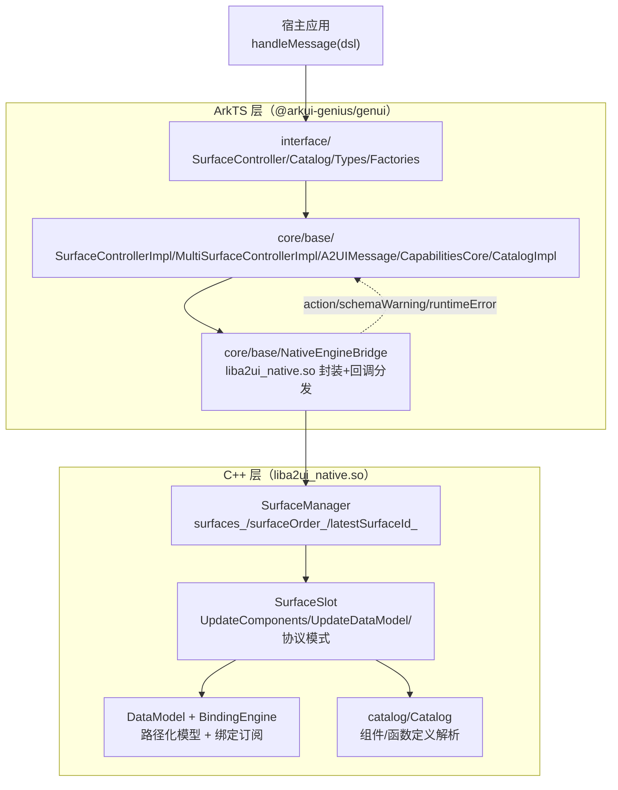
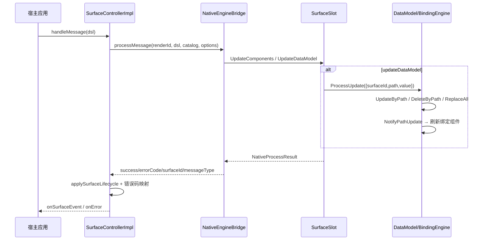

# 架构设计

> 确认目标仓和模块的架构约束、关键设计决策、Spec 拆分方向。

## 设计元数据

| Field | Content |
|-------|---------|
| Design ID | DESIGN-Func-07-04-01 |
| 关联需求 | 已有能力补录（无独立 requirement.md） |
| 关联 Epic | 无 |
| 目标 Feature | Feat-01 消息类型与协议版本契约（基线）；Feat-02 Surface 生命周期与 catalogId 匹配；Feat-03 组件描述与增量更新；Feat-04 数据模型更新与绑定刷新；Feat-05 流式渐进渲染；Feat-06 多 Surface 管理；Feat-07 Catalog 与能力查询 |
| 复杂度 | 复杂 |
| 目标版本 | A2UI 原生协议 v0.9（`https://a2ui.org/specification/v0_9/catalogs/basic/catalog.json`）+ 鸿蒙扩展协议 1.0.0（`ohos.a2ui.extended.catalog`） |
| Owner | GenUI SIG |
| 状态 | Baselined（已有实现补录） |

## 需求基线

> 需求基线详见 proposal.md。以下仅列出设计阶段需要额外强调的要点。

| 项 | 补充说明 |
|----|---------|
| 补录而非新增 | 当前实现即规格，可疑行为只能标注为风险/备注 |
| 基准实现声明 | 共享契约域以 A2UIRender 全量渲染引擎（`GenerativeUI/A2UIRender`，`@arkui-genius/genui`）为基准实现 |
| 协议分层 | A2UI 原生协议 v0.9（Google 标准）→ 鸿蒙 A2UI 扩展协议（`catalogId=ohos.a2ui.extended.catalog`）→ Form 卡片协议（裁剪，本域不展开） |
| 范围边界 | 本功能域（07-04-01）覆盖消息模型 + Surface 生命周期 + 组件/数据模型增量更新 + 流式渲染 + 多 Surface + Catalog 能力查询；具体组件/函数/样式语义归各自功能域（07-04-02~24），本设计不展开 |
| 消息类型 | 服务端→客户端消息四类：`createSurface` / `updateComponents` / `updateDataModel` / `deleteSurface`；客户端→服务端仅 `action` |

## 上下文和现状

### 涉及仓和模块

| 仓库 | 补充架构说明 |
|------|-------------|
| `GenerativeUI/A2UIRender` | 全量渲染引擎。ArkTS 层（`genui/src/main/ets/interface/`、`ets/core/base/`）提供公开契约与控制器实现；C++ 层（`genui/src/main/cpp/`）提供 `liba2ui_native.so` 原生渲染（SurfaceManager/SurfaceSlot/DataModel/BindingEngine/Catalog） |
| `GenerativeUI/Docs` | 开发者文档（消息格式参考 / 概念），仅作理解辅助，契约以 A2UIRender 实现为准 |

> 仓、模块、当前职责、影响类型详见 proposal.md「影响范围」。

### 调用链层级分析

| 层 | 模块 | 职责 | 修改类型 |
|----|------|------|---------|
| 1. 公开契约层（ArkTS） | `ets/interface/SurfaceController.ets`、`MultiSurfaceController.ets`、`Catalog.ets`、`CatalogItem.ets`、`Types.ets`、`Factories.ets` | 声明 SurfaceController/错误码/事件类型/目录契约与工厂 | 现状（基准实现） |
| 2. 控制器实现层（ArkTS） | `ets/core/base/SurfaceControllerImpl.ets`、`MultiSurfaceControllerImpl.ets`、`A2UIMessage.ets`、`CapabilitiesCore.ets`、`CatalogImpl.ets` | handleMessage 流程、消息解析、协议版本/catalogId 匹配、多 Surface 栈转发 | 现状 |
| 3. NAPI 桥接层（ArkTS） | `ets/core/base/NativeEngineBridge.ets` | 封装 `liba2ui_native.so` 调用 + 回调分发（action/schemaWarning/runtimeError） | 现状 |
| 4. 原生消息处理层（C++） | `cpp/SurfaceManager.cpp`、`cpp/SurfaceSlot.cpp` | Surface 生命周期、组件/数据模型增量更新、协议模式判定 | 现状 |
| 5. 数据模型与绑定层（C++） | `cpp/data/DataModel.cpp`、`BindingEngine.cpp`、`PathValidator.cpp` | 路径化数据模型、绑定订阅通知、路径校验 | 现状 |
| 6. 目录/能力层（C++ + ArkTS） | `cpp/catalog/Catalog.cpp`、`ets/core/base/CapabilitiesCore.ets` | Catalog 定义解析、能力清单 | 现状 |

检查项：
- [x] 调用链每一层都已覆盖（公开契约→控制器→NAPI→原生消息→数据模型→目录）
- [x] 每层职责边界清晰（ArkTS 负责契约与流程编排，C++ 负责原生渲染与数据模型）
- [x] 每层修改类型明确（均为「现状」，存量补录）

### 适用架构规则

| Rule ID | 适用原因 | 设计结论 | 验证方式 |
|---------|---------|---------|---------|
| OH-ARCH-LAYERING | ArkTS→NAPI→C++ 跨语言多层调用 | 调用方向自顶向下；C++ 经 NAPI 回调分发到 ArkTS（action/schemaWarning/runtimeError） | 架构评审/依赖检查 |
| OH-ARCH-SUBSYSTEM | 单仓 + 独立 Docs 仓，无跨子系统 | 不引入子系统外依赖 | 依赖检查 |
| OH-ARCH-API-LEVEL | 公开 ArkTS API（SurfaceController/Catalog/Factory），无 C-API | Public API（ArkTS），无新增权限 | API 评审 |
| OH-ARCH-COMPONENT-BUILD | 现状无 BUILD.gn/bundle.json 变更 | 无构建影响 | 构建验证 |
| OH-ARCH-ERROR-LOG | 错误码双层映射（native errorCode 字符串 → SurfaceErrorCode 枚举） | 错误码契约详见 Feat-01/Feat-06 | UT |

## 不涉及项承接

> proposal.md 已完成 N/A 判定。本节仅对标记「涉及」且需展开设计的维度给出结论。

| 维度 | 设计结论 |
|------|---------|
| 跨进程/SA | 不涉及（同进程 ArkTS↔C++ 经 NAPI） |
| 持久化 | 不涉及（DataModel 仅内存态） |
| 权限 | 不涉及 |
| 国际化/RTL | 组件/样式层关注，本域消息模型不涉及 |
| 多设备适配 | 本域消息/生命周期契约设备无关；断点/主题为控制器状态（07-04-23/24 展开） |
| 范围边界 | 组件/函数/样式语义归 07-04-02~24；卡片裁剪归 07-04-25；扩展域归 07-04-27/28 |

## 关键设计决策

| 决策 ID | 问题 | 推荐方案 | 探索过的替代方案 | 取舍理由 | 影响 |
|--------|------|---------|----------------|---------|------|
| ADR-1 | 消息体如何判定类型 | 顶层 JSON 只允许 `createSurface`/`updateComponents`/`updateDataModel`/`deleteSurface` 四键之一；`messageCount!==1` 判 `MESSAGE_MULTIPLE_BODIES`/`MESSAGE_OPERATION_INVALID` | (a) 多消息体合并；(b) 数组承载 | A2UI v0.9 规定单消息体；单 body 简化解析与错误定位 | 多 body 判错（`A2UIMessage.fromDSL`） |
| ADR-2 | 协议版本如何校验 | ArkTS `CapabilitiesCore` 持 `SUPPORTED_A2UI_PROTOCOL_VERSIONS=['v0.9']`；`fromDSL` 对 `version` 非受支持值判 null；native 侧 `VERSION_INVALID`/`UNSUPPORTED_PROTOCOL_VERSION` 二次校验 | (a) 只 ArkTS 校验；(b) 只 native 校验 | 双层防御：ArkTS 快速失败，native 权威拦截 | 双版本常量需同步（`SurfaceContext.h` 注释） |
| ADR-3 | catalogId 如何决定协议模式 | `isExtend = catalog.getCatalogId().toLowerCase()===A2UI_EXTENDED_CATALOG_ID`；`SurfaceSlot::UpdateSurfaceProtocolMode` 按 catalogId 区分 A2UI_STANDARD / EXTENDED_PROTOCOL | (a) 按组件名区分；(b) 独立配置项 | catalogId 是协议身份的权威标识 | 扩展协议仅认 `ohos.a2ui.extended.catalog` |
| ADR-4 | 数据模型更新语义 | `updateDataModel` 带 `path`/`value`：带 value 更新、缺 value 删除、path 缺省 `/` 全量替换；`DataModel::UpdateByPath`/`DeleteByPath`/`ReplaceAll` 三态 | (a) 全量覆盖；(b) 只支持替换 | A2UI v0.9 JSON Pointer 语义；path/value 组合表达增删改 | path 缺省与 value 缺失边界（`A2UIMessage.validateMessageBody`） |
| ADR-5 | 错误码如何贯穿两层 | native 返回字符串 errorCode（`VERSION_INVALID` 等）→ ArkTS `handleReceiveMessage` 映射为 `SurfaceErrorCode`（`SCHEMA_*` 段） | (a) native 直接返回枚举值；(b) 不映射 | 字符串解耦 native 与 ArkTS；枚举对外稳定 | 映射表需完整覆盖（`SurfaceControllerImpl.handleMessage`） |
| ADR-6 | 多 Surface 栈由谁持有 | C++ `SurfaceManager` 持有 `surfaces_`/`surfaceOrder_`/`latestSurfaceId_`；ArkTS `MultiSurfaceControllerImpl` 仅转发 pop/canPop/getSurfaceList | (a) ArkTS 持有栈；(b) 双端各持一份 | 渲染所有权在 native；ArkTS 转发保证单源真值 | `MULTI_SURFACE_MAX_COUNT=15` 上限 |
| ADR-7 | 组件树如何增量更新 | `updateComponents` 以扁平邻接表（`components[]`，每项含 `id`+`component`+`children`）描述；`SurfaceSlot` 维护 `allComponents_`/`descriptorsById_`/`parentsRelations_` 跨批次重建 root | (a) 嵌套树 JSON；(b) 全量重建 | 邻接表支持流式增量（流式渲染核心）；跨 batch 关系索引复用未变节点 | root 判定 + 模板延迟展开 |

## 设计骨架

### 骨架范围

| 骨架项 | 目标 | 不包含 | 验证方式 |
|--------|------|--------|---------|
| 消息模型 | 固化四类消息解析、版本校验、单 body 约束 | 组件/函数语义（07-04-02~24） | UT |
| Surface 生命周期 | 固化 create/update/delete 状态机与 catalogId 匹配 | 卡片裁剪（07-04-25） | UT |
| 数据模型 | 固化 path/value 三态更新 + 绑定通知 | 表达式/变量语义（07-04-21） | UT |
| 多 Surface | 固化栈转发 + pop 错误码 | — | UT |

### 骨架 Spec 拆分

| Task ID | 目标 | 受影响文件 | AC |
|---------|------|----------|-----|
| TASK-SKELETON-1 | Feat-01 消息类型与协议版本契约基线 | `A2UIMessage.ets`、`CapabilitiesCore.ets`、`cpp/SurfaceErrorCodes.h` | AC-1.1~1.x |
| TASK-SKELETON-2 | Feat-02~07 生命周期/增量/数据/流式/多Surface/Catalog | `SurfaceControllerImpl.ets`、`SurfaceSlot.cpp`、`DataModel.cpp` 等 | 各 Feat AC |

## 后续 Task 拆分

| Task ID | 目标 | 受影响文件 | 依赖 |
|---------|------|----------|------|
| T-1 | Feat-01 消息类型与协议版本契约（基线，本设计已承接） | `Feat-01-*-spec.md` + 本 design.md | — |
| T-2 | Feat-02 Surface 生命周期与 catalogId 匹配 | `SurfaceControllerImpl.ets`、`SurfaceSlot.cpp` | T-1 |
| T-3 | Feat-03 组件描述与增量更新 | `SurfaceSlot.cpp` | T-1 |
| T-4 | Feat-04 数据模型更新与绑定刷新 | `DataModel.cpp`、`BindingEngine.cpp` | T-1 |
| T-5 | Feat-05 流式渐进渲染 | `SurfaceControllerImpl.ets`、`SurfaceSlot.cpp` | T-3,T-4 |
| T-6 | Feat-06 多 Surface 管理 | `MultiSurfaceControllerImpl.ets`、`SurfaceManager.cpp` | T-2 |
| T-7 | Feat-07 Catalog 与能力查询 | `CatalogImpl.ets`、`CapabilitiesCore.ets`、`cpp/catalog/Catalog.cpp` | T-1 |

## API 签名、Kit 与权限

> 本节承接 spec.md「API 变更分析」中识别的 API，给出签名、权限和 d.ts 位置等实现细节。

### 新增 API

无新增。本特性覆盖既有 ArkTS 公开 API（存量补录）。

### 变更/废弃 API

| 原有 API | 变更类型 | 新 API | 迁移说明 |
|---------|---------|--------|---------|
| `SurfaceController`（`handleMessage`/`destroy`/`registerActionReceiver`/`registerErrorCallback`/`setFontSizeScale`/`updateThemeMode`） | 既有 | — | 单 Surface 控制器契约 |
| `MultiSurfaceController`（`canPop`/`pop`/`getLatestSurfaceId`/`getSurfaceList`/`setBackGestureEnabled`） | 既有 | — | 多 Surface 栈契约 |
| `Catalog`（`addCatalogItem`/`addClientFunction` 等） | 既有 | — | 自定义组件/函数注册 |
| `SurfaceControllerFactory`/`CatalogFactory` | 既有 | — | 工厂入口 |

> d.ts 位置：`genui/src/main/ets/interface/*.ets`（ArkTS 源即契约，无独立 SDK `.d.ts`）。Kit：`@arkui-genius/genui`；权限：无；SysCap：不适用。

## 构建系统影响

### BUILD.gn 变更

无变更（存量补录）。`genui/src/main/cpp/` 已纳入现有 `liba2ui_native.so` 构建目标。

### bundle.json 变更

无变更。

## 可选设计扩展

### 架构图



### 数据流/控制流

| 步骤 | 调用方 | 被调用方 | 数据/接口 | 说明 |
|------|--------|---------|----------|------|
| 1 | 宿主应用 | `SurfaceControllerImpl.handleMessage` | dsl string | 入口 |
| 2 | `SurfaceControllerImpl` | `NativeEngineBridge.processMessage` | `(renderId, dsl, catalog, options)` | 跨语言 |
| 3 | native | `SurfaceSlot::UpdateComponents/UpdateDataModel` | `JsonValue messageBody` | 按消息类型分发 |
| 4 | `SurfaceSlot` | `DataModel::ProcessUpdate` | `DataModelUpdate{surfaceId,path,value}` | 数据模型三态 |
| 5 | `DataModel` | `BindingEngine::NotifyPathUpdate` | path | 订阅通知 |
| 6 | native | `NativeEngineBridge` 回调 | `NativeProcessResult{success,errorCode,surfaceId,messageType}` | 结果回传 |
| 7 | `SurfaceControllerImpl` | `onSurfaceEvent`/`onError`/`onAction` | 事件/错误码 | 对外通知 |

### 时序设计



### 数据模型设计

**API 层（ArkTS，公开契约）**

```typescript
// ets/interface/Types.ets
export enum A2UIMessageType { CREATE_SURFACE = 0, UPDATE_COMPONENTS = 1, UPDATE_DATA_MODEL = 2, DELETE_SURFACE = 3 }
export enum SurfaceEventType { UNKNOWN=-1, SURFACE_CREATED=0, SURFACE_COMPONENTS_UPDATED=1, SURFACE_DATA_MODEL_UPDATED=2, SURFACE_DELETED=3 }
export enum SurfaceErrorCode { NO_ERROR=0, NO_SURFACE_MATCHED=1001, /* ... 见 Feat-01 */ }
```

**Framework 层（C++）**

```cpp
// cpp/data/DataModel.h
struct DataModelUpdate { std::string surfaceId; std::string path; std::optional<JsonValue> value; };
static constexpr int32_t MAX_DATA_MODEL_DEPTH = 20;   // 数据模型嵌套深度上限

// cpp/SurfaceManager.h
std::unordered_map<std::string, SurfaceSlot> surfaces_;
std::string latestSurfaceId_;
std::vector<std::string> surfaceOrder_;
```

| 结构 | 存储方案 | 生命周期 |
|------|---------|---------|
| `SurfaceManager::surfaces_` | `unordered_map<string, SurfaceSlot>` | create/delete 增删 |
| `SurfaceSlot::allComponents_` | `map<string, shared_ptr<Component>>` | 组件增量更新 |
| `SurfaceSlot::descriptorsById_` | `map<string, JsonValue>` | 邻接表描述符缓存 |
| `DataModel::root_` | `shared_ptr<JsonValue>` | 数据模型根 |
| `BindingEngine::bindingIndex_` | `path → set<component_id>` | 订阅索引 |

### 测试性设计

| 测试层级 | 测试目标 | Mock 策略 | 验证方式 |
|---------|---------|----------|---------|
| ArkTS 单测 | `A2UIMessage.fromDSL` 消息解析/版本校验 | 直接测 `A2UIMessage.ets` | `genui/src/test/` |
| C++ UT | `SurfaceSlot::UpdateDataModel` 三态 | Mock Component | `genui/src/test/cpp/` |
| C++ UT | `DataModel::UpdateByPath/DeleteByPath/ReplaceAll` | Mock BindingEngine | `genui/src/test/cpp/` |
| ohosTest | Surface 生命周期端到端 | — | `entry/src/ohosTest/` |

### 资源所有权矩阵

| 资源 | 创建方 | 持有方 | 销毁触发 | 实际释放 | 异常回收 |
|------|--------|--------|---------|---------|---------|
| `SurfaceControllerImpl` | Factory | 宿主 | `destroy()` | 释放 renderSlot + 解绑 | `destroyed` 幂等 |
| `SurfaceSlot` | `SurfaceManager::CreateSurface` | `SurfaceManager::surfaces_` | deleteSurface | `RemoveSurface` | Dispose |
| `DataModel` | `BindingEngine::GetOrCreateDataModel` | `dataModels_` | surface 销毁 | 随 binding 释放 | — |
| `Component` | `SurfaceSlot::CreateOrUpdateComponentNode` | `allComponents_` | 组件移除/重建 | RemoveChild | — |

### 接口参数规约

| 接口 | 参数 | 类型 | 合法范围 | 非法处理 | 边界说明 |
|------|------|------|---------|---------|---------|
| `handleMessage` | dsl | string | 非空合法 JSON | 空→SCHEMA_DSL_EMPTY；非法 JSON→SCHEMA_JSON_PARSE_FAILED | 空串校验 |
| `updateDataModel` | path | string | JSON Pointer 或 `/` | PathValidator 拒绝非法路径 | path 缺省 `/` |
| `updateDataModel` | value | any | 可选 | 缺 value→删除 | path 与 value 同缺→错误 |
| `createSurface` | catalogId | string | basic/extended 之一 | 缺→SCHEMA_CATALOG_ID_MISSING | 大小写不敏感匹配 |

### 线程与并发模型

| 操作 | 发起线程 | 回调线程 | 跨进程边界 | 线程安全 | 重入约束 |
|------|---------|---------|----------|---------|---------|
| handleMessage | UI | UI | 无 | 单线程 UI | 处理中不可销毁 |
| action 回调 | native→ArkTS | UI | 无 | 单线程 | — |
| setTimeout 冲刷 schema warning | UI | UI | 无 | 单线程 | 批次合并 |

## 详细设计

### 消息解析与版本校验

`A2UIMessage.fromDSL`（`A2UIMessage.ets:40-96`）：空串→null（`:41-44`）；`JSON.parse` 失败→null（`:47-52`）；根非对象→null（`:54-57`）；`version` 非 string 或非 `CapabilitiesCore.isSupportedA2UIProtocolVersion`→null（`:60-64`）；遍历 `createSurface`/`updateComponents`/`updateDataModel`/`deleteSurface` 四键计数（`:69-88`），`messageCount!==1`→null（`:90-93`）。`tryParseMessage`（`:98-122`）：body 非对象→null；`surfaceId` 非 string 或空→null。`validateMessageBody`（`:124-141`）：UPDATE_COMPONENTS 校验 `components` 为数组；UPDATE_DATA_MODEL 校验 `path`/`value` 至少其一存在。

### Surface 生命周期与 catalogId 匹配

`SurfaceControllerImpl` 构造（`SurfaceControllerImpl.ets:129-163`）：`CatalogImpl.fromPublicOrEmpty` 归一目录；`isExtend=isExtendedCatalog(catalog)`（catalogId 大小写不敏感比对 `ohos.a2ui.extended.catalog`）；`renderId` 全局唯一；`apiSupported=apiVersion>=20`（`MIN_SUPPORTED_API_VERSION=20`，`:88`）；支持时 `initRenderSlot`+安装四类 bridge（action/schemaWarning/crossLanguageAttribute/runtimeError）。`applySurfaceLifecycle`（`:287-302`）：CREATE_SURFACE→绑定 schema warning 路由；DELETE_SURFACE→解绑。

### handleMessage 错误码映射

`handleReceiveMessage`（`:701-893`）：`NativeEngineBridge.processMessage` 返回 `NativeProcessResult`；`success!==true` 时按 `errorCode` 字符串映射：`VERSION_INVALID`→`SCHEMA_VERSION_INVALID`(2107)、`UNSUPPORTED_PROTOCOL_VERSION`→`UNSUPPORTED_PROTOCOL_VERSION`(1003)、`DSL_EMPTY`→`SCHEMA_DSL_EMPTY`(2002)、`JSON_PARSE_FAILED`→`SCHEMA_JSON_PARSE_FAILED`(2003)、`ROOT_NOT_OBJECT`→`SCHEMA_ROOT_NOT_OBJECT`(2004)、`MESSAGE_OPERATION_INVALID`→`SCHEMA_MESSAGE_OPERATION_INVALID`(2101)、`MESSAGE_MULTIPLE_BODIES`→`SCHEMA_MESSAGE_MULTIPLE_BODIES`(2102)、`MESSAGE_BODY_INVALID`→`SCHEMA_MESSAGE_BODY_INVALID`(2103)、`SURFACE_ID_MISSING`→`SCHEMA_SURFACE_ID_MISSING`(2104)、`COMPONENTS_INVALID`→`SCHEMA_COMPONENTS_INVALID`(2105)、`CATALOG_ID_MISSING`→`SCHEMA_CATALOG_ID_MISSING`(2106)、`SURFACE_NOT_FOUND`→`NO_SURFACE_MATCHED`(1001)。成功后 `applySurfaceLifecycle`+`notifyHandlingResult`（CREATE→`SURFACE_CREATED` 等）。

### 数据模型三态与绑定刷新

`SurfaceSlot::UpdateDataModel` → `ValidateDataModelValue`（`path`/`value` 三态）→ `ExecuteDataModelOperation` → `DataModel::ProcessUpdate`（`DataModel.h:72`）。`DataModel`：`UpdateByPath`（带 value 更新，`MAX_DATA_MODEL_DEPTH=20` 深度上限）、`DeleteByPath`（缺 value 删除）、`ReplaceAll`（path 缺省 `/` 全量替换）；`NotifyPathUpdate` 经 `BindingEngine::bindingIndex_`（`path→set<component_id>`）通知订阅组件刷新。

### 多 Surface 栈

`MultiSurfaceControllerImpl`（`MultiSurfaceControllerImpl.ets:31-151`）：`supportsMultipleSurfaces()=true`、`getMaxSurfaceCount()=15`（`MULTI_SURFACE_MAX_COUNT=15`，`:23`）；`pop()`→`NativeEngineBridge.popSurface`；`canPop()`=栈内 surface 数>1；`getSurfaceList()`→`getCurrentSurfaceIds`（native `SurfaceManager::GetSurfaceIds`）。native `SurfaceManager`：`CreateSurface`/`FindSurface`/`RemoveSurface`/`Back`/`GetLatestSurface`。

## 风险和开放问题

| 项 | 类型 | 影响 | 处理方式 | Owner |
|----|------|------|---------|-------|
| RISK-1 协议版本常量 ArkTS 与 C++ 双份维护（`CapabilitiesCore.ets` vs `SurfaceContext.h`），需手动同步 | 架构 | 中 | 规格 ADR-2 标注；`CapabilitiesCore.ets:27` 注释「Keep in sync」 | GenUI SIG |
| RISK-2 native errorCode 字符串到 `SurfaceErrorCode` 枚举的映射为手写 if-else 链，新增错误码需同步补映射 | 架构 | 中 | 规格 Feat-01 AC 覆盖映射；`SurfaceControllerImpl.ets:723-870` | GenUI SIG |
| RISK-3 `MULTI_SURFACE_MAX_COUNT=15` 为 ArkTS 常量，native 侧上限需同步（若 native 不一致则以 native 为准） | 架构 | 低 | 规格 Feat-06 AC 覆盖；`MultiSurfaceControllerImpl.ets:23` | GenUI SIG |
| RISK-4 数据模型 `MAX_DATA_MODEL_DEPTH=20` 深度上限行为在超出时未显式文档化 | 边界 | 低 | 规格 Feat-04 标注；`DataModel.h:53` | GenUI SIG |

## 设计审批

- [x] 需求基线已确认，设计覆盖 P0/P1 AC
- [x] 不涉及项已承接，N/A 和展开项都有结论
- [x] 涉及仓和模块职责清楚
- [x] 调用链层级分析完整，每层覆盖到位
- [x] 适用架构规则已识别并形成设计结论
- [x] 分层和子系统边界合规
- [x] API 变更有签名、权限、错误码和兼容性说明
- [x] BUILD.gn/bundle.json 影响明确
- [x] 设计输出和后续 Task 拆分明确
- [x] 关键设计决策有理由和影响说明
- [x] 风险和开放问题有 Owner

**结论:** 通过（已有实现补录）
