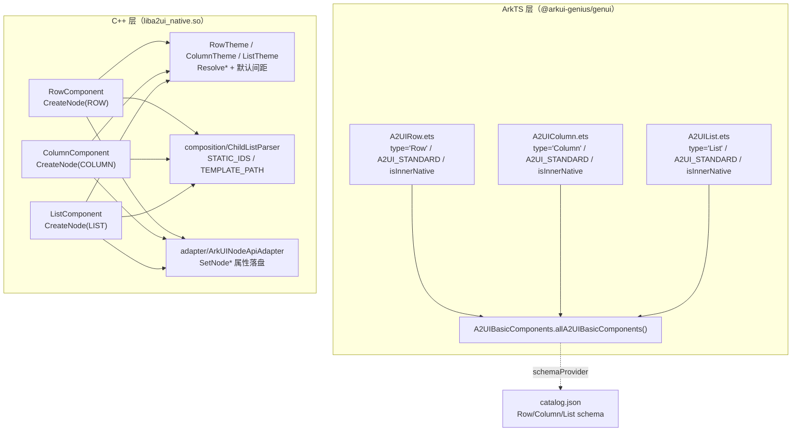
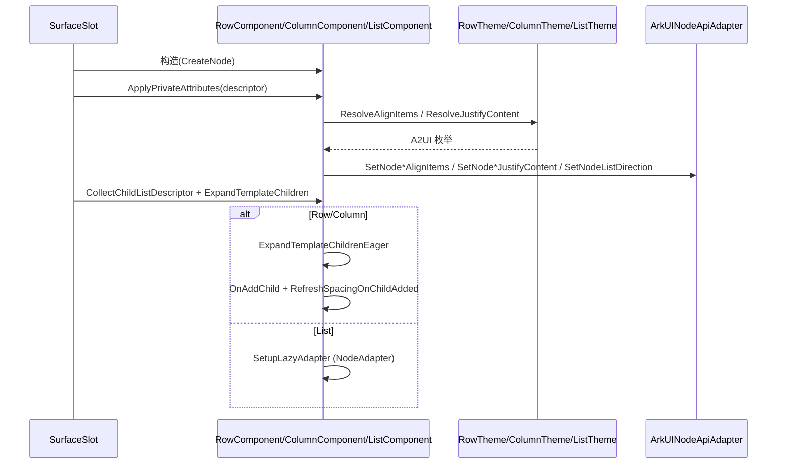

# 架构设计

> 确认目标仓和模块的架构约束、关键设计决策、Spec 拆分方向。

## 设计元数据

| Field | Content |
|-------|---------|
| Design ID | DESIGN-Func-07-04-02 |
| 关联需求 | 已有能力补录（无独立 requirement.md） |
| 关联 Epic | 无 |
| 目标 Feature | Feat-01 Row 组件（基线）；Feat-02 Column 组件；Feat-03 List 组件 |
| 复杂度 | 标准 |
| 目标版本 | A2UI 原生协议 v0.9（`https://a2ui.org/specification/v0_9/catalogs/basic/catalog.json`） |
| Owner | GenUI SIG |
| 状态 | Baselined（已有实现补录） |

## 需求基线

> 需求基线详见 proposal.md。以下仅列出设计阶段需要额外强调的要点。

| 项 | 补充说明 |
|----|---------|
| 补录而非新增 | 当前实现即规格，可疑行为只能标注为风险/备注 |
| 基准实现声明 | 布局容器域以 A2UIRender 全量渲染引擎（`GenerativeUI/A2UIRender`，`@arkui-genius/genui`）为基准实现 |
| 范围边界 | 本功能域（07-04-02）覆盖三个标准协议布局容器 Row / Column / List；`weight`、`accessibility` 等通用属性归 07-04-18，子组件模板展开语义归 07-04-17，动态数据绑定归 07-04-21，多设备断点适配归 07-04-23，主题/深浅色归 07-04-24 |
| 组件三件套 | 每个布局容器由三层落地：ArkTS CatalogItem 注册（`A2UIRow/A2UIColumn/A2UIList.ets`）→ C++ 组件实现（`row|column|list/`）→ 主题/枚举解析（`RowTheme/ColumnTheme/ListTheme`） |
| 布局方向 | Row 沿水平方向排列子组件（主轴水平、交叉轴垂直）；Column 沿垂直方向排列（主轴垂直、交叉轴水平）；List 为可滚动列表容器 |

## 上下文和现状

### 涉及仓和模块

| 仓库 | 补充架构说明 |
|------|-------------|
| `GenerativeUI/A2UIRender` | 全量渲染引擎。ArkTS 层 `ets/core/components/A2UI/A2UIRow.ets`、`A2UIColumn.ets`、`A2UIList.ets`、`A2UIBasicComponents.ets` 完成目录注册；C++ 层 `cpp/components/A2UI/{row,column,list}/` 提供原生组件实现，`cpp/composition/` 提供子列表解析，`cpp/adapter/` 提供 ArkUI 原生节点适配 |
| `GenerativeUI/Docs` | 开发者文档（`reference/standard-components/row.md`、`column.md`、`list.md`、`overview.md`），仅作理解辅助，契约以 A2UIRender 实现为准 |

> 仓、模块、当前职责、影响类型详见 proposal.md「影响范围」。

### 调用链层级分析

| 层 | 模块 | 职责 | 修改类型 |
|----|------|------|---------|
| 1. 目录注册层（ArkTS） | `ets/core/components/A2UI/A2UIRow.ets`、`A2UIColumn.ets`、`A2UIList.ets`、`A2UIBasicComponents.ets` | 声明组件 type、schemaProvider，标记 `A2UI_STANDARD` 类别与 `isInnerNative=true` | 现状（基准实现） |
| 2. 协议 Schema 层 | `specification/A2UI/v0_9/catalogs/basic/catalog.json` | 声明 Row/Column/List 组件 JSON Schema（属性枚举、默认值、required 键） | 现状 |
| 3. 组件实现层（C++） | `cpp/components/A2UI/row/RowComponent.{h,cpp}`、`column/ColumnComponent.{h,cpp}`、`list/ListComponent.{h,cpp}`（均继承 `A2UIComponent`） | 创建原生节点、解析私有属性、管理子组件间距/懒加载 | 现状 |
| 4. 主题/枚举解析层（C++） | `row/RowTheme.{h,cpp}`、`column/ColumnTheme.{h,cpp}`、`list/ListTheme.{h,cpp}` | 字符串 token → ArkUI 枚举映射、默认间距常量、非法 token 回退 | 现状 |
| 5. 子列表解析层（C++） | `composition/ChildListParser.{h,cpp}`、`Component::ExpandTemplateChildrenEager` | children 静态 ID 数组 / 模板对象二态解析与模板展开 | 现状 |
| 6. ArkUI 原生适配层（C++） | `adapter/ArkUINodeApiAdapter`、`adapter/A2UIArkUITypes.h` | 对齐 ArkUI `ArkUI_NodeHandle` 属性/枚举，落盘原生节点 | 现状 |

检查项：
- [x] 调用链每一层都已覆盖（目录注册→Schema→组件实现→主题解析→子列表解析→原生适配）
- [x] 每层职责边界清晰（ArkTS 负责注册与契约声明，C++ 负责原生渲染、属性映射与间距/懒加载）
- [x] 每层修改类型明确（均为「现状」，存量补录）

### 适用架构规则

| Rule ID | 适用原因 | 设计结论 | 验证方式 |
|---------|---------|---------|---------|
| OH-ARCH-LAYERING | ArkTS 目录注册 → C++ 组件/主题/适配 多层调用 | 调用方向自顶向下；ArkTS 仅声明 catalogItem，渲染逻辑下沉 C++ | 架构评审/依赖检查 |
| OH-ARCH-SUBSYSTEM | 单仓 + 独立 Docs 仓，无跨子系统 | 不引入子系统外依赖 | 依赖检查 |
| OH-ARCH-API-LEVEL | 无新增/变更 Public/System API，组件经 `CatalogItem` 内部注册 | 内部 API（isInnerNative），无新增权限/SysCap | API 评审 |
| OH-ARCH-COMPONENT-BUILD | 现状无 BUILD.gn/bundle.json 变更 | 无构建影响 | 构建验证 |
| OH-ARCH-ERROR-LOG | 组件私有属性非法值经 `ReportSchemaWarning`/日志回退 | 枚举非法 token 回退默认值；children 结构非法上报 schema warning | UT/hilog |

## 不涉及项承接

> proposal.md 已完成 N/A 判定。本节仅对标记「涉及」且需展开设计的维度给出结论。

| 维度 | 设计结论 |
|------|---------|
| 跨进程/SA | 不涉及（同进程 ArkTS↔C++ 经 NAPI） |
| 持久化 | 不涉及（组件树仅内存态） |
| 权限 | 不涉及 |
| 国际化/RTL | 本域不直接处理；RTL 由 ArkUI 原生节点层负责，布局容器只透传主轴/交叉轴对齐 |
| 多设备适配 | 断点/主题上下文经 `ThemeContext` 传入但当前 `OnConfigChange` 为空实现（见 RISK-3），展开归 07-04-23 |
| 范围边界 | 通用属性（weight/accessibility 等）归 07-04-18；模板/子列表语义归 07-04-17；动态绑定归 07-04-21；主题/深浅色归 07-04-24 |

## 关键设计决策

| 决策 ID | 问题 | 推荐方案 | 探索过的替代方案 | 取舍理由 | 影响 |
|--------|------|---------|----------------|---------|------|
| ADR-1 | 布局容器如何落地到 ArkUI 原生节点 | 组件类继承 `A2UIComponent`，构造时 `CreateNode(ROW/COLUMN/LIST)`；私有属性经 `GetPrivatePropertyDeclaration` 声明式映射（`RowComponent.cpp:27`） | (a) 每组件独立裸实现；(b) 用 ETS `@Builder` 组合 | 复用 `A2UIComponent` 通用属性/事件/子节点管理；声明式 property 表便于校验与回退 | 私有属性名 `align`/`justify`/`direction` 由各组件独立声明 |
| ADR-2 | 主轴/交叉轴 token 如何映射到 ArkUI 枚举 | 各 `Theme` 提供静态 `ResolveAlignItems/ResolveJustifyContent` 做字符串→枚举转换，非法 token 回退默认值 | (a) 组件内 switch；(b) 全局 converter | 语义集中在 Theme，组件只透传；回退规则单点维护 | Row 交叉轴用 `A2UIVerticalAlignment`，Column 用 `A2UIHorizontalAlignment`，二者枚举不同 |
| ADR-3 | 子组件间距如何实现 | `spacing_` 默认常量（Row=16.0、Column=8.0）+ `CalculateChildSpacing` 半间距 margin；Row 水平 margin、Column 垂直 margin，经虚函数 `ApplyMarginToChild` 区分方向 | (a) 用 ArkUI 原生 spacing 属性；(b) 固定 margin 常量 | 用 margin 表达间距可随子组件增删移动精确刷新；方向差异由子类 override | 半间距机制可能与子组件显式 margin 冲突（RISK-2） |
| ADR-4 | children 静态数组 vs 模板对象如何解析 | `ChildListParser::ParseChildren` 二态解析（数组→STATIC_IDS；对象含 componentId+path→TEMPLATE_PATH；其余 INVALID）；Row/Column 用 Eager 展开，List 用 LAZY 展开 | (a) 只支持静态数组；(b) 只支持模板 | 同时满足固定集合与数据驱动两种场景；List 走 NodeAdapter 懒加载 | 模板展开语义细节归 07-04-17 |
| ADR-5 | List 懒加载如何落地 | `ListComponent` 内部 `Mode::EAGER/LAZY` 二态 + `ListAdapterNode` NodeAdapter；模板 children 触发 `SetupLazyAdapter` | (a) 仅 Eager 全量展开；(b) 独立 LazyList 组件 | NodeAdapter 复用 ArkUI 原生 `NODE_LIST_NODE_ADAPTER`，支持大数据量 | EAGER 模式 `OnAddChild` 需包裹 `LIST_ITEM` 节点 |
| ADR-6 | List itemCount 解析的缺省/异常策略 | 相对路径（不以 `/` 开头）→ 返回 0 延迟到运行期解析；dataModel 为空 → 放弃（nullopt）；path 未找到/非数组 → 创建空 adapter 并上报 missing path | (a) 直接报错；(b) 全量同步 | 数据模型可能尚未就绪（流式），延迟解析 + 空 adapter 保证不崩溃 | 缺失路径经 `DynamicValueResolver::ReportMissingPath(DEFER_UNTIL_DATA_UPDATE)` |

## 设计骨架

### 骨架范围

| 骨架项 | 目标 | 不包含 | 验证方式 |
|--------|------|--------|---------|
| Row 组件 | 固化水平布局、align/justify 枚举映射、16.0 默认间距、静态/模板子列表 | 通用属性（07-04-18）、模板语义（07-04-17） | ohosTest/UT |
| Column 组件 | 固化垂直布局、align/justify 枚举映射、8.0 默认间距、静态/模板子列表 | 同上 | ohosTest/UT |
| List 组件 | 固化可滚动列表、direction/align 枚举映射、EAGER/LAZY 双态与懒加载 | 同上 | ohosTest/UT |

### 骨架 Spec 拆分

| Task ID | 目标 | 受影响文件 | AC |
|---------|------|----------|-----|
| TASK-SKELETON-1 | Feat-01 Row 组件基线 | `A2UIRow.ets`、`row/RowComponent.{h,cpp}`、`row/RowTheme.{h,cpp}` | 各 Feat AC |
| TASK-SKELETON-2 | Feat-02 Column 组件 | `A2UIColumn.ets`、`column/ColumnComponent.{h,cpp}`、`column/ColumnTheme.{h,cpp}` | 各 Feat AC |
| TASK-SKELETON-3 | Feat-03 List 组件 | `A2UIList.ets`、`list/ListComponent.{h,cpp}`、`list/ListTheme.{h,cpp}` | 各 Feat AC |

## 后续 Task 拆分

| Task ID | 目标 | 受影响文件 | 依赖 |
|---------|------|----------|------|
| T-1 | Feat-01 Row 组件（基线，本设计已承接） | `Feat-01-row-layout-spec.md` + 本 design.md | — |
| T-2 | Feat-02 Column 组件 | `Feat-02-column-layout-spec.md` | T-1 |
| T-3 | Feat-03 List 组件 | `Feat-03-list-layout-spec.md` | T-1 |

## API 签名、Kit 与权限

> 本节承接 spec.md「API 变更分析」中识别的 API，给出签名、权限和 d.ts 位置等实现细节。

### 新增 API

无新增。本特性覆盖既有组件目录注册（存量补录），组件经内部 `CatalogItem` 注册，不暴露为宿主可直接调用的 Public API。

### 变更/废弃 API

| 原有 API | 变更类型 | 新 API | 迁移说明 |
|---------|---------|--------|---------|
| `A2UIRow.asCatalogItem()` / `A2UIColumn.asCatalogItem()` / `A2UIList.asCatalogItem()` | 既有 | — | 内部目录项构造，`CatalogItem.forComponent(type, schemaProvider, EMPTY_COMPONENT_BUILDER)` |
| `A2UIBasicComponents.allA2UIBasicComponents()` | 既有 | — | 聚合注册 18 个标准组件目录项 |

> d.ts 位置：`genui/src/main/ets/core/components/A2UI/*.ets`（ArkTS 源即契约，无独立 SDK `.d.ts`）。Kit：`@arkui-genius/genui`；权限：无；SysCap：不适用。

## 构建系统影响

### BUILD.gn 变更

无变更（存量补录）。`genui/src/main/cpp/components/A2UI/{row,column,list}/` 已纳入现有 `liba2ui_native.so` 构建目标。

### bundle.json 变更

无变更。

## 可选设计扩展

### 架构图



### 数据流/控制流

| 步骤 | 调用方 | 被调用方 | 数据/接口 | 说明 |
|------|--------|---------|----------|------|
| 1 | `CatalogImpl` | `A2UIRow/Column/List.asCatalogItem()` | `CatalogItem` | 目录项注册 |
| 2 | `SurfaceSlot` | `RowComponent/ColumnComponent/ListComponent` 构造 | `A2UINodeType` | 创建原生节点 |
| 3 | `SurfaceSlot` | `ApplyPrivateAttributes(descriptor)` | `JsonValue` | 解析 align/justify/direction |
| 4 | 组件 | `Theme::Resolve*` | string→enum | 枚举映射与回退 |
| 5 | 组件 | `ArkUINodeApiAdapter::SetNode*` | enum | 属性落盘原生节点 |
| 6 | `SurfaceSlot` | `ChildListParser::ParseChildren` + `ExpandTemplateChildren*` | `ChildListDescriptor` | 子列表解析与展开 |
| 7 | 组件 | `CalculateChildSpacing`/`ApplyMarginToChild` | `spacing_` | 子组件间距（Row/Column） |

### 时序设计



### 数据模型设计

**API 层（ArkTS，内部目录项）**

```typescript
// ets/core/components/A2UI/A2UIRow.ets（Column/List 结构同构）
export class A2UIRow {
  private static type: string = 'Row';
  private static schemaProvider: SchemaProvider = (version: string) =>
    SchemaResourceLoader.loadA2UISchema(version, 'components/Row.json');
  public static asCatalogItem(): CatalogItem {
    let catalogItem = CatalogItem.forComponent(A2UIRow.type, A2UIRow.schemaProvider, EMPTY_COMPONENT_BUILDER);
    catalogItem.markCategory(CatalogCategory.A2UI_STANDARD).markInnerNative(true);
    return catalogItem;
  }
}
```

**Framework 层（C++）**

```cpp
// list/ListComponent.h
struct LazyAdapterConfig {
    std::string templateComponentId;
    std::string templatePath;
    std::shared_ptr<DataModel> dataModel;
    JsonValue templateDescriptor;
    std::map<std::string, JsonValue> allDescriptors;
    std::string surfaceId;
    int32_t renderId = -1;
    SurfaceContext surfaceContext;
};

// adapter/A2UIArkUITypes.h
enum class A2UIVerticalAlignment : int32_t { TOP = 0, CENTER = 1, BOTTOM = 2 };
enum class A2UIHorizontalAlignment : int32_t { START = 0, CENTER = 1, END = 2 };
enum class A2UIFlexAlignment : int32_t { CENTER = 0, END = 1, SPACE_AROUND = 2, SPACE_BETWEEN = 3, SPACE_EVENLY = 4, START = 5 };
enum class A2UIAxis : int32_t { HORIZONTAL = 0, VERTICAL = 1 };
enum class A2UIListItemAlignment : int32_t { START = 0, CENTER = 1, END = 2 };
```

| 结构 | 存储方案 | 生命周期 |
|------|---------|---------|
| `Component::spacing_` | `float` 实例成员 | 构造时取 `Theme::GetDefaultSpace()` |
| `ListComponent::mode_` | `enum Mode { EAGER, LAZY }`，默认 EAGER | `SetLazyMode` 切换 |
| `ListComponent::listItems_` | `vector<ArkUI_NodeHandle>` | `OnAddChild` 追加，`RemoveAllChildren`/析构释放 |
| `ListComponent::adapterNode_` | `shared_ptr<ListAdapterNode>` | `SetAdapterNode` 赋值，随组件销毁 |

### 测试性设计

| 测试层级 | 测试目标 | Mock 策略 | 验证方式 |
|---------|---------|----------|---------|
| C++ UT | `ChildListParser::ParseChildren` 二态解析 | 直接测 `ChildListParser.cpp` | `genui/src/test/cpp/` |
| C++ UT | `RowTheme/ColumnTheme::Resolve*` 枚举映射与回退 | 直接测 `RowTheme.cpp`/`ColumnTheme.cpp` | `genui/src/test/cpp/` |
| ohosTest | Row 对齐/间距/模板展开 | `entry/src/ohosTest/ets/test/dynamic/row/` | 像素级 UI dump |
| ohosTest | Column 对齐/间距 | `entry/src/ohosTest/ets/test/dynamic/column/` | 像素级 UI dump |
| ohosTest | List 方向/滚动 | `entry/src/ohosTest/ets/test/dynamic/list/`、`entry/src/test/List.test.ets` | 像素级 UI dump |

### 资源所有权矩阵

| 资源 | 创建方 | 持有方 | 销毁触发 | 实际释放 | 异常回收 |
|------|--------|--------|---------|---------|---------|
| 原生节点 | `ArkUINodeApiAdapter::CreateNode` | 组件实例 | 组件销毁 | `A2UIComponent::~A2UIComponent` | 随 `SurfaceSlot` 释放 |
| `ListComponent::listItems_` | `ListComponent::OnAddChild` | `ListComponent` | `RemoveAllChildren`/析构 | `RemoveChild`+`DisposeNode` | 析构兜底释放 |
| `ListComponent::adapterNode_` | `ApplyLazyAdapterConfig` | `ListComponent` | 组件销毁 | `shared_ptr` 自动回收 | — |
| `cachedTheme_` | `GetTheme` | 组件实例 | 组件销毁 | `weak_ptr` 不持所有权 | — |

### 接口参数规约

| 接口 | 参数 | 类型 | 合法范围 | 非法处理 | 边界说明 |
|------|------|------|---------|---------|---------|
| Row/Column `align` | value | string | `start`/`center`/`end` | 非法 token 回退默认 `start` | 枚举内无 `stretch` |
| Row/Column `justify` | value | string | `start`/`center`/`end`/`spaceAround`/`spaceBetween`/`spaceEvenly` | 非法 token 回退默认 `start` | — |
| List `direction` | value | string | `vertical`/`horizontal` | 非法 token 回退默认 `vertical` | — |
| List `align` | value | string | `start`/`center`/`end` | 非法 token 回退默认 `start` | — |
| `children` | value | array/object | 非空 ID 数组 或 `{componentId,path}` | 空/非法结构→INVALID（schema warning） | 空数组上报 `ERROR_SCHEMA_WARNING` |

### 线程与并发模型

| 操作 | 发起线程 | 回调线程 | 跨进程边界 | 线程安全 | 重入约束 |
|------|---------|---------|----------|---------|---------|
| 组件创建/属性应用 | UI | UI | 无 | 单线程 UI | 处理中不可销毁 |
| 模板展开/懒加载 | UI | UI | 无 | 单线程 UI | — |
| 数据模型更新触发刷新 | UI | UI | 无 | 单线程 UI | `OnDataUpdate` 顺序执行 |

## 详细设计

### Row 组件（Feat-01）

`A2UIRow.asCatalogItem()`（`A2UIRow.ets:31-35`）注册 `type='Row'`（`:25`）、schemaProvider（`:27-29`）并标记 `A2UI_STANDARD`+`isInnerNative=true`（`:34`）。`RowComponent` 构造 `CreateNode(A2UINodeType::ROW)` 且 `spacing_=RowTheme::GetDefaultSpace()`（`RowComponent.cpp:22-25`）。私有属性 `align`（`RowComponent.cpp:30-41`，fallback `"start"`）与 `justify`（`:42-53`，fallback `"start"`）经 `SetAlignItems/SetJustifyContent` 落盘（`:68-76`）。`RowTheme::ResolveAlignItems` 映射 `start→TOP/center→CENTER/end→BOTTOM`（`RowTheme.cpp:47-60`），`ResolveJustifyContent` 映射 6 值（`:62-84`），默认间距 `ROW_DEFAULT_SPACE=16.0F`（`:22`）。间距经 `ApplyMarginToChild` 施加水平 margin（`RowComponent.cpp:96-103`，`SetMargin(0, end, 0, start)`），增删移动子组件时 `RefreshSpacingOnChildAdded/Moved` 刷新相邻项（`Component.cpp:1532-1562`）。模板 children 走 `ExpandTemplateChildrenEager`（`RowComponent.cpp:149-153`）。

### Column 组件（Feat-02）

结构与 Row 同构，差异点：`CreateNode(A2UINodeType::COLUMN)`、`spacing_=8.0F`（`ColumnComponent.cpp:22-25`）；`SetAlignItems` 用 `A2UIHorizontalAlignment`（`:69-72`）；`ApplyMarginToChild` 施加垂直 margin（`:97-104`，`SetMargin(start, 0, end, 0)`）。`ColumnTheme::ResolveAlignItems` 映射 `start→START/center→CENTER/end→END`（`ColumnTheme.cpp:47-60`），默认间距 `COLUMN_DEFAULT_SPACE=8.0F`（`:22`）。模板 children 同样走 `ExpandTemplateChildrenEager`（`ColumnComponent.cpp:150-154`）。

### List 组件（Feat-03）

`ListComponent` 构造 `CreateNode(A2UINodeType::LIST)`（`ListComponent.cpp:27`）。私有属性 `direction`（`:48-64`，fallback `"vertical"`）与 `align`（`:65-85`，fallback `"start"`）。内部 `Mode::EAGER/LAZY`（`ListComponent.h:88-89`），模板 children 触发 `ExpandTemplateChildren`（`ListComponent.cpp:209-234`）→ `SetupLazyAdapter`（`:127-142`）→ `ResolveLazyAdapterItemCount`（`:144-182`：相对路径/缺失 path/非数组→空或 0，正常→`GetArraySize`）。EAGER 模式 `OnAddChild` 为每个子组件包裹 `LIST_ITEM` 节点（`:236-248`），`RemoveAllChildren` 统一 `DisposeNode` 释放（`:265-280`）。

## 风险和开放问题

| 项 | 类型 | 影响 | 处理方式 | Owner |
|----|------|------|---------|-------|
| RISK-1 Row `align` 默认值文档分歧：`row.md` 标注 `"center"`（`row.md:154`），但 `catalog.json`（`:313`）与代码 fallback（`RowComponent.cpp:35`）均为 `"start"` | API | 中 | 以代码与 catalog 为准（`start`）；标注于 Feat-01 兼容性声明 | GenUI SIG |
| RISK-2 子组件间距经 margin 半间距实现，可能与子组件显式 `margin` 冲突（`Component.cpp:1498-1530`） | 架构 | 中 | 规格 Feat-01/02 标注间距语义；冲突优先级未文档化 | GenUI SIG |
| RISK-3 `OnConfigChange`/`InitializeAllProperties` 为空实现（`RowComponent.cpp:141`、`RowTheme.cpp:44` 等），主题/断点切换后样式不重应用 | 架构 | 中 | 标注风险；主题重应用归 07-04-23/24 承接 | GenUI SIG |
| RISK-4 List EAGER↔LAZY 模式切换（`SetLazyMode`）非对称：`SetLazyMode(false)` 不回收已建 `adapterNode_` | 架构 | 低 | 规格 Feat-03 标注；模式切换场景未覆盖 | GenUI SIG |
| RISK-5 `A2UIArkUITypes.h` 为项目内 SDK 枚举镜像，`A2UIFlexAlignment` 枚举序值依赖 SDK 映射（`A2UIArkUITypes.h:78-85`） | API | 低 | 经 `ArkUINodeApiAdapter` 名称解析解耦（见注释 `:252-259`） | GenUI SIG |

## 设计审批

- [x] 需求基线已确认，设计覆盖 P0/P1 AC
- [x] 不涉及项已承接，N/A 和展开项都有结论
- [x] 涉及仓和模块职责清楚
- [x] 调用链层级分析完整，每层覆盖到位
- [x] 适用架构规则已识别并形成设计结论
- [x] 分层和子系统边界合规
- [x] API 变更有签名、权限、错误码和兼容性说明
- [x] BUILD.gn/bundle.json 影响明确
- [x] 设计输出和后续 Task 拆分明确
- [x] 关键设计决策有理由和影响说明
- [x] 风险和开放问题有 Owner

**结论:** 通过（已有实现补录）
