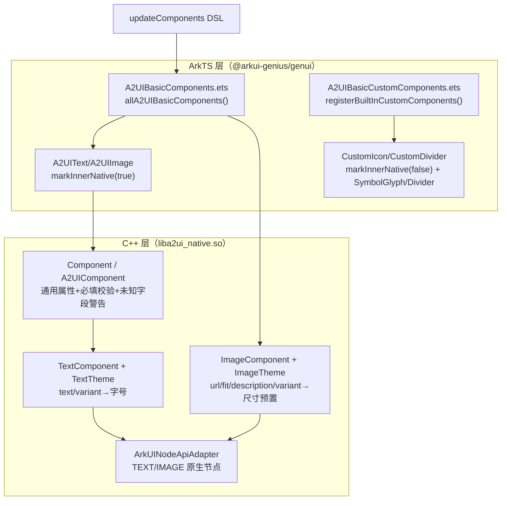
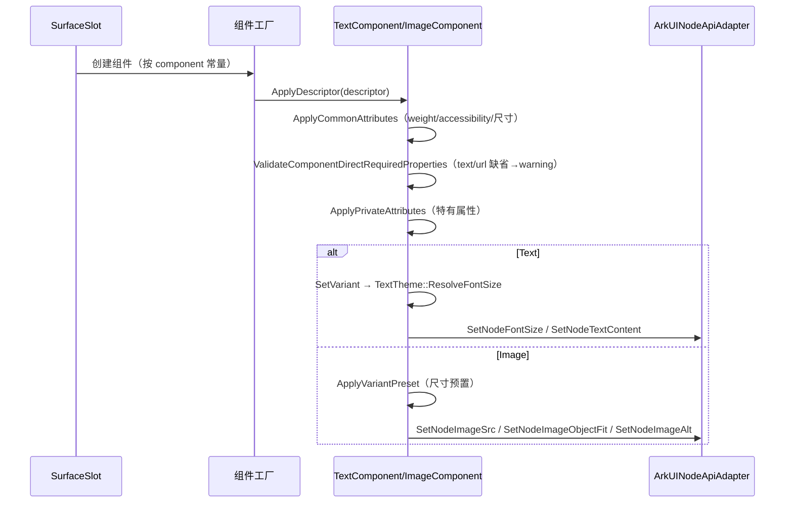

# 架构设计

> 确认目标仓和模块的架构约束、关键设计决策、Spec 拆分方向。

## 设计元数据

| Field | Content |
|-------|---------|
| Design ID | DESIGN-Func-07-04-03 |
| 关联需求 | 已有能力补录（无独立 requirement.md） |
| 关联 Epic | 无 |
| 目标 Feature | Feat-01 Text 组件；Feat-02 Image 组件；Feat-03 Icon 组件；Feat-04 Divider 组件 |
| 复杂度 | 标准 |
| 目标版本 | A2UI 原生协议 v0.9（`https://a2ui.org/specification/v0_9/catalogs/basic/catalog.json`）+ 起始 API Version 20 |
| Owner | GenUI SIG |
| 状态 | Baselined（已有实现补录） |

## 需求基线

> 需求基线详见 proposal.md。以下仅列出设计阶段需要额外强调的要点。

| 项 | 补充说明 |
|----|---------|
| 补录而非新增 | 当前实现即规格，可疑行为只能标注为风险/备注 |
| 基准实现声明 | 标准展示组件域以 A2UIRender 全量渲染引擎（`GenerativeUI/A2UIRender`，`@arkui-genius/genui`）为基准实现 |
| 范围边界 | 本功能域（07-04-03）覆盖 4 个 A2UI 标准展示组件：Text（文本）、Image（图片）、Icon（图标）、Divider（分割线）；其通用属性（布局/样式）语义归 07-04-18 通用样式属性，本域只覆盖组件特有属性 |
| 组件实现分型 | Text/Image 为 native（C++）组件（`markInnerNative(true)`）；Icon/Divider 为 ArkTS Custom 组件（`markInnerNative(false)`） |
| 协议身份 | 四组件均属 A2UI 原生协议 v0.9 `basic` catalog，`component` 字段常量分别为 `Text`/`Image`/`Icon`/`Divider` |

## 上下文和现状

### 涉及仓和模块

| 仓库 | 补充架构说明 |
|------|-------------|
| `GenerativeUI/A2UIRender` | 全量渲染引擎。ArkTS 层（`genui/src/main/ets/core/components/A2UI/`）声明 catalog 项与 Custom 组件；C++ 层（`genui/src/main/cpp/components/A2UI/`）实现 native 组件（Text/Image）与通用属性管线（`A2UIComponent`/`Component`） |
| `GenerativeUI/Docs` | 开发者文档（`reference/standard-components/*.md`），仅作理解辅助，契约以 A2UIRender 实现为准 |

> 仓、模块、当前职责、影响类型详见 proposal.md「影响范围」。

### 调用链层级分析

| 层 | 模块 | 职责 | 修改类型 |
|----|------|------|---------|
| 1. 目录声明层（ArkTS） | `A2UIBasicComponents.ets`、`A2UIBasicCustomComponents.ets` | 声明 Text/Image/Icon/Divider 的 `CatalogItem`（schemaProvider + builder + 分类/原生标记） | 现状 |
| 2. 组件定义层（ArkTS） | `A2UIText.ets`、`A2UIImage.ets`、`CustomIcon.ets`、`CustomDivider.ets` | Text/Image 静态 catalog 项；Icon/Divider 的 Custom 组件 struct + 定义 + 资源/颜色解析 | 现状 |
| 3. 描述符解析层（C++） | `Component.cpp`、`A2UIComponent.cpp` | 通用属性（weight/accessibility/尺寸/背景/padding/margin/borderRadius）+ 必填属性校验 + 未知字段警告 | 现状 |
| 4. 组件特有属性层（C++） | `components/A2UI/text/TextComponent.*`、`components/A2UI/image/ImageComponent.*` | Text（text/variant）、Image（url/description/fit/variant）私有属性声明与应用 | 现状 |
| 5. 主题映射层（C++） | `components/A2UI/text/TextTheme.*`、`image/ImageTheme.*` | Text variant→字号常量映射；Image 主题上下文（占位，未应用具体值） | 现状 |
| 6. 原生节点适配层（C++） | `adapter/ArkUINodeApiAdapter.*` | 将组件属性落到 ArkUI 原生节点（TEXT/IMAGE 节点） | 现状 |

检查项：
- [x] 调用链每一层都已覆盖（目录→定义→通用属性→特有属性→主题→原生适配）
- [x] 每层职责边界清晰（ArkTS 负责契约声明与 Custom 渲染；C++ 负责 native 组件属性管线）
- [x] 每层修改类型明确（均为「现状」，存量补录）

### 适用架构规则

| Rule ID | 适用原因 | 设计结论 | 验证方式 |
|---------|---------|---------|---------|
| OH-ARCH-LAYERING | ArkTS catalog → C++ native 组件 + ArkTS Custom 组件双路径 | Text/Image 走 native 路径；Icon/Divider 走 ArkTS Custom 路径，两路径互不交叉 | 架构评审/依赖检查 |
| OH-ARCH-SUBSYSTEM | 单仓 + 独立 Docs 仓，无跨子系统 | 不引入子系统外依赖 | 依赖检查 |
| OH-ARCH-API-LEVEL | 无 ArkTS 公开 API、无 C-API（组件经协议 DSL 声明） | 无新增 Public/System API，无权限 | API 评审 |
| OH-ARCH-COMPONENT-BUILD | 现状无 BUILD.gn/bundle.json 变更 | 无构建影响 | 构建验证 |
| OH-ARCH-ERROR-LOG | 组件属性非法/缺省走 schema warning（`SURFACE_ERROR_SCHEMA_WARNING=2001`） | 枚举越界回落默认值 + schema warning；缺必填上报 `ERROR_CODE_REQUIRED_MISS` | UT/hilog |

## 不涉及项承接

> proposal.md 已完成 N/A 判定。本节仅对标记「涉及」且需展开设计的维度给出结论。

| 维度 | 设计结论 |
|------|---------|
| 跨进程/SA | 不涉及（同进程 ArkTS↔C++ 经 NAPI，Custom 组件纯 ArkTS） |
| 持久化 | 不涉及（组件属性仅内存态，随 surface 生命周期） |
| 权限 | 不涉及 |
| 通用布局/样式属性 | 不涉及本域（width/height/margin/padding/borderRadius/weight/accessibility 归 07-04-18 通用样式属性，本域 Feat 仅覆盖组件特有属性 text/variant/url/fit/description/name/axis） |
| 深色/浅色模式 | 涉及（Icon/Divider 颜色随 `ThemeMode` 切换）——详见 Feat-03/Feat-04 |
| 多设备适配 | 无差异（固定 VP 尺寸预置与设备无关）；断点主题归 07-04-23/24 |

## 关键设计决策

| 决策 ID | 问题 | 推荐方案 | 探索过的替代方案 | 取舍理由 | 影响 |
|--------|------|---------|----------------|---------|------|
| ADR-1 | 四组件如何分型（native vs Custom） | Text/Image 用 native C++ 组件（`TextComponent`/`ImageComponent`，`markInnerNative(true)`）；Icon/Divider 用 ArkTS Custom 组件（`CustomIcon`/`CustomDivider`，`markInnerNative(false)`） | (a) 全部 native；(b) 全部 ArkTS Custom | Text/Image 需原生文本/图片渲染与属性管线；Icon 依赖 `sys.symbol` 系统符号与 ArkTS `SymbolGlyph`，Divider 依赖 ArkUI `Divider` 组件，适合 ArkTS 侧实现 | 两套解析路径并存：native 走 C++ `PropertyDeclaration`，Custom 走 ArkTS `SchemaLocalPropertyHelper` |
| ADR-2 | Text 字号如何由 variant 决定 | `variant` 枚举（h1~h5/caption/body）→ `TextTheme::ResolveFontSize` 静态映射为字号常量（32/28/24/20/18/12/16） | (a) 用系统 float token 动态取；(b) 直接暴露 fontSize | 补录期用硬编码常量与 A2UI v0.9 语义 token 对齐，实现简单可预测 | 常量与系统 float token 未联动（TextTheme.cpp 注释标注 `sys.float.*`）；非法 variant 回落 body=16 |
| ADR-3 | Image 尺寸如何由 variant 决定 | `variant` → `ApplyVariantPreset` 设置固定宽高（icon/avatar 32×32、smallFeature 50×50、mediumFeature 150×150、largeFeature 400×400、header 全宽） | (a) 只设建议尺寸不改节点尺寸；(b) 全部走 weight 自适应 | 展示组件需确定的默认尺寸保证一致外观；avatar 附加圆角 16 呈现圆形 | header 仅设宽度百分比（`SetWidthPercent(1.0)`），无高度约束 |
| ADR-4 | Image `fit` 默认值与 header 特例 | 默认 `fill`；当 `variant==header` 且 fit 缺省/非法时回落 `contain`（`ResolveDefaultFitValueForVariant`） | (a) 全局默认 `contain`；(b) 全部默认 `fill` | header 为横幅图，`contain` 避免裁剪；其余场景 A2UI schema 声明默认 `fill` | 文档 image.md 写「默认 contain」与源码/schema（fill）不一致 → RISK-2 |
| ADR-5 | Icon 图标资源如何解析 | `name`（预定义语义名或 `{path}` 对象）→ `ICON_RESOURCE_MAP` 映射到 `sys.symbol.*`/`sys.media.*` 资源；`starHalf` 走 `COMPOSITE_ICON_MAP` 合成（半星 Stack 裁剪） | (a) 直接接受任意资源 URL；(b) 服务端下发资源路径 | 内置映射表保证语义 token 到系统符号资源的确定性转换 | 非法 name 回落灰色占位符（非丢弃）；55 个内置名 + 1 个合成名 |
| ADR-6 | Icon/Divider 颜色与占位如何适配主题 | 颜色经 `resolveXxxColorByThemeMode(colorMode)`：DARK 取暗色资源/常量，否则浅色；Icon 占位符同样按主题取色 | (a) 写死单一颜色；(b) 走 native ThemeBase | ArkTS Custom 组件不经过 native ThemeBase，需在 ArkTS 侧按 `ThemeMode` 显式分流 | Icon 深浅色为 `$r('app.color.*')` 资源；Divider 为 0x33 前缀透明度常量 |

## 设计骨架

### 骨架范围

| 骨架项 | 目标 | 不包含 | 验证方式 |
|--------|------|--------|---------|
| Text 组件 | 固化 text 内容 + variant 字号映射契约 | Markdown/富文本（schema 注明简单 Markdown 支持但不含 HTML/图片/链接） | UT |
| Image 组件 | 固化 url/fit/description/variant 契约 | 图片解码/缓存细节 | UT |
| Icon 组件 | 固化 name 资源映射 + 主题颜色 + 占位符契约 | `{path}` 数据模型动态解析语义（归 07-04-21 表达式） | ArkTS 单测/ohosTest |
| Divider 组件 | 固化 axis 方向 + 主题颜色契约 | strokeWidth/color 扩展（归 07-04-11 扩展域 ExtendedDivider） | ArkTS 单测/ohosTest |

### 骨架 Spec 拆分

| Task ID | 目标 | 受影响文件 | AC |
|---------|------|----------|-----|
| TASK-SKELETON-1 | Feat-01 Text 组件基线 | `text/TextComponent.cpp`、`text/TextTheme.cpp`、`A2UIText.ets` | AC-1.1~1.x |
| TASK-SKELETON-2 | Feat-02 Image 组件 | `image/ImageComponent.cpp`、`A2UIImage.ets` | 各 Feat AC |
| TASK-SKELETON-3 | Feat-03 Icon 组件 | `CustomIcon.ets` | 各 Feat AC |
| TASK-SKELETON-4 | Feat-04 Divider 组件 | `CustomDivider.ets` | 各 Feat AC |

## 后续 Task 拆分

| Task ID | 目标 | 受影响文件 | 依赖 |
|---------|------|----------|------|
| T-1 | Feat-01 Text 组件（基线，本设计已承接） | `Feat-01-text-display-spec.md` + 本 design.md | — |
| T-2 | Feat-02 Image 组件 | `image/ImageComponent.cpp`、`A2UIImage.ets` | T-1 |
| T-3 | Feat-03 Icon 组件 | `CustomIcon.ets` | T-1 |
| T-4 | Feat-04 Divider 组件 | `CustomDivider.ets` | T-1 |

## API 签名、Kit 与权限

> 本节承接 spec.md「API 变更分析」中识别的 API，给出签名、权限和 d.ts 位置等实现细节。

### 新增 API

无新增。本特性覆盖既有组件契约（存量补录），无 ArkTS 公开 API、无 C-API。

### 变更/废弃 API

| 原有 API | 变更类型 | 新 API | 迁移说明 |
|---------|---------|--------|---------|
| `CatalogItem`（`A2UIText`/`A2UIImage`/`CustomIcon.asCatalogItem`/`CustomDivider.asCatalogItem`） | 既有 | — | 组件目录注册入口 |
| `CustomComponentDefinition`（`createIconDefinition`/`createDividerDefinition`） | 既有 | — | Icon/Divider 的 Custom 组件定义 |

> d.ts 位置：`genui/src/main/ets/core/components/A2UI/*.ets`（ArkTS 源即契约，无独立 SDK `.d.ts`）。Kit：`@arkui-genius/genui`；权限：无；SysCap：不适用。

## 构建系统影响

### BUILD.gn 变更

无变更（存量补录）。`genui/src/main/cpp/components/A2UI/text|image/` 已纳入现有 `liba2ui_native.so` 构建目标。

### bundle.json 变更

无变更。

## 可选设计扩展

### 架构图



### 数据流/控制流

| 步骤 | 调用方 | 被调用方 | 数据/接口 | 说明 |
|------|--------|---------|----------|------|
| 1 | 宿主 | `SurfaceSlot::UpdateComponents` | components[] 描述符 | 组件增量更新入口 |
| 2 | `SurfaceSlot` | 组件工厂 | `component` 常量 | 按 `Text`/`Image`/`Icon`/`Divider` 创建节点 |
| 3 | 组件工厂 | `Component::ApplyDescriptor` | descriptor | 通用属性 + 必填校验 + 未知字段警告 |
| 4 | `TextComponent`/`ImageComponent` | `ApplyPrivateAttributes` | 特有属性 | 应用 text/variant 或 url/fit/description/variant |
| 5 | `TextTheme::ResolveFontSize` / `ImageComponent::ApplyVariantPreset` | 节点适配 | 字号/尺寸 | 映射到原生节点属性 |
| 6 | `CustomIcon`/`CustomDivider` | ArkTS build | `customProps` | ArkTS 侧解析 name/axis + 主题颜色 |

### 时序设计



### 数据模型设计

**API 层（ArkTS，公开契约）**

```typescript
// ets/core/components/A2UI/A2UIText.ets
// A2UIText.type = 'Text'，schemaProvider → schema/A2UI/v0.9/components/Text.json
// ets/core/components/A2UI/CustomIcon.ets
// ICON_COMPONENT_TYPE = 'Icon'，createIconDefinition() → CustomComponentDefinition
```

**Framework 层（C++）**

```cpp
// components/A2UI/text/TextTheme.cpp
constexpr float H1_FONT_SIZE = 32.0F;   // h1
constexpr float BODY_FONT_SIZE = 16.0F; // body（默认）
// 映射：h1=32, h2=28, h3=24, h4=20, h5=18, caption=12, body=16

// components/A2UI/image/ImageComponent.cpp
constexpr float VARIANT_ICON_WIDTH = 32.0F;      // icon 32×32
constexpr float VARIANT_AVATAR_BORDER_RADIUS = 16.0F; // avatar 圆形
constexpr float FULL_WIDTH_PERCENT = 1.0F;        // header 全宽
```

| 结构 | 存储方案 | 生命周期 |
|------|---------|---------|
| `TextComponent::textContent_` | `std::string` | 组件创建/更新 |
| `TextComponent::cachedTheme_` | `weak_ptr<TextTheme>` | 弱引用主题缓存 |
| `ImageComponent::cachedTheme_` | `weak_ptr<ImageTheme>` | 弱引用主题缓存 |
| `ICON_RESOURCE_MAP` | ArkTS `Map<string,string>`（静态） | 模块加载常驻 |
| `COMPOSITE_ICON_MAP` | ArkTS `Map<string,string>`（静态） | 模块加载常驻 |

### 测试性设计

| 测试层级 | 测试目标 | Mock 策略 | 验证方式 |
|---------|---------|----------|---------|
| C++ UT | `TextComponent` text/variant 应用与回落 | Mock ArkUINodeApiAdapter | `TextComponentTddTest.cpp` |
| C++ UT | `ImageComponent` url/fit/variant 预置 | Mock ArkUINodeApiAdapter | `ImageComponentTddTest.cpp` |
| ArkTS 单测 | Icon/Divider 渲染状态解析 | 直接测 `CustomIcon`/`CustomDivider` | `genui/src/test/` |
| ohosTest | 四组件端到端渲染 | — | `entry/src/ohosTest/` |

### 接口参数规约

| 接口 | 参数 | 类型 | 合法范围 | 非法处理 | 边界说明 |
|------|------|------|---------|---------|---------|
| Text | text | string（DynamicString） | 任意字符串 | 缺省→必填警告 + 回落 ""；非 string→类型警告 | 必填属性 |
| Text | variant | string（enum） | h1/h2/h3/h4/h5/caption/body | 非法→回落 body | 默认 body |
| Image | url | string（DynamicString） | 任意字符串 | 缺省→必填警告 + 回落 ""；空→不设置 src | 必填属性 |
| Image | fit | string（enum） | contain/cover/fill/none/scaleDown | 非法→回落默认（header=contain，其余=fill） | 默认 fill |
| Image | variant | string（enum） | icon/avatar/smallFeature/mediumFeature/largeFeature/header | 非法→回落 mediumFeature | 默认 mediumFeature |
| Image | description | string（DynamicString） | 任意字符串 | 缺省→回落占位图 alt；空→不设置 alt | 无障碍文本 |
| Icon | name | string（enum）\| object{path} | 55 内置名 + starHalf + {path} | 非法/缺省→灰色占位符 | 必填属性 |
| Divider | axis | string（enum） | horizontal/vertical | 非法/缺省→回落 horizontal | 默认 horizontal |

### 线程与并发模型

| 操作 | 发起线程 | 回调线程 | 跨进程边界 | 线程安全 | 重入约束 |
|------|---------|---------|----------|---------|---------|
| 组件属性应用 | UI | UI | 无 | 单线程 UI | 处理中不可销毁 |
| Custom 组件 build | UI | UI | 无 | 单线程 | — |

## 详细设计

### Text 组件特有属性

`TextComponent::GetPrivatePropertyDeclaration`（`TextComponent.cpp:25-57`）声明两个特有属性：
- `text`（`:28-37`）：`STRING`，`allowDynamic=true`，`fallbackString=""`，`applyValue` 调 `SetTextContent(value.GetStringValue(""))`。
- `variant`（`:38-49`）：`ENUM_STRING`，`allowDynamic=false`，`fallbackString="body"`，`enumAllowed={h1,h2,h3,h4,h5,caption,body}`，`enumFallback="body"`，`applyValue` 调 `SetVariant(value.GetStringValue("body"))`。

必填属性 `text` 由 `GetComponentDirectRequiredPropertyKeys`（`TextComponent.cpp:64-67`）声明；缺省时 `Component::ValidateComponentDirectRequiredProperties`（`Component.cpp:1352-1372`）上报 `ERROR_CODE_REQUIRED_MISS` 并回落默认。`SetVariant`（`TextComponent.cpp:100-103`）→ `TextTheme::ResolveFontSize`（`TextTheme.cpp:52-73`）映射字号常量（`TextTheme.cpp:22-28`）：h1=32、h2=28、h3=24、h4=20、h5=18、caption=12、body=16；非法 variant 回落 body=16。

### Image 组件特有属性

`ImageComponent::GetPrivatePropertyDeclaration`（`ImageComponent.cpp:137-152`）分发到四个私有声明：`url`（`:95-102`）、`description`（`:104-111`）、`fit`（`:113-124`）、`variant`（`:126-135`）。必填 `url`（`ImageComponent.cpp:159-162`）。`fit` 默认值由 `ResolveDefaultFitValueForVariant`（`:47-50`）决定：`variant==header` → `contain`，否则 `fill`。`ApplyVariantPreset`（`:214-245`）设尺寸：icon 32×32、avatar 32×32+圆角 16、smallFeature 50×50、mediumFeature 150×150、largeFeature 400×400、header→`SetWidthPercent(1.0)` 全宽无高约束。`ApplyPrivateAttributes`（`:247-264`）中 `description` 缺省时 `SetAlt(DEFAULT_IMAGE_PLACEHOLDER_ALT)`（占位图 alt），且 `weight>0` 时重置宽高（`:260-263`）。

### Icon 组件特有属性

`CustomIcon.resolveIconRenderState`（`CustomIcon.ets:156-233`）解析 `name`：缺省→灰色占位符（`:165-182`）；非法名（`normalizeEnumStringProperty` 回落 `INVALID_ICON_PLACEHOLDER_NAME`）→占位符（`:194-202`）；`starHalf`→`COMPOSITE_ICON_MAP` 合成（`:204-213`）；其余→`ICON_RESOURCE_MAP`（`:52-111`，55 项）映射系统符号资源（`:215-231`）。`build`（`:239-244`）→ `IconRoot`（`:246-273`）按占位/合成/`SymbolGlyph` 分支渲染，并应用 `layoutWeight`/`margin`/`accessibility`/`id`。颜色经 `resolveColor`（`:367-377`）与 `resolveIconDefaultColorByThemeMode`（`:148-150`）按 `ThemeMode.DARK` 分流。

### Divider 组件特有属性

`CustomDivider.resolveOptionsForSchemaWarning`（`CustomDivider.ets:112-135`）解析 `axis`：`normalizeEnumStringProperty` 枚举 `[horizontal, vertical]`，默认/非法回落 `horizontal`。`build`（`:54-72`）渲染 `Divider().vertical(axis==='vertical').color(resolveColor()).margin(水平 margin 资源)`，颜色经 `resolveDividerColorByThemeMode`（`:40-42`）：DARK→`0x33FFFFFF`，否则 `0x33000000`。`asCatalogItem`（`:155-162`）`markInnerNative(false)`。

## 风险和开放问题

| 项 | 类型 | 影响 | 处理方式 | Owner |
|----|------|------|---------|-------|
| RISK-1 Text 字号文档与源码不一致：docs text.md 写 h4=22/h5=16/body=14，源码 TextTheme.cpp 为 h4=20/h5=18/body=16 | 测试 | 中 | 以源码为准（`TextTheme.cpp:25-28`）；Feat-01 风险表标注 | GenUI SIG |
| RISK-2 Image fit 默认值文档与源码不一致：docs image.md 写「默认 contain」，源码/schema 默认 fill（仅 header→contain） | 测试 | 中 | 以源码为准（`ImageComponent.cpp:42,47-50`）；Feat-02 风险表标注 | GenUI SIG |
| RISK-3 Icon 非法 name 处理文档与源码不一致：docs icon.md 写「丢弃组件 + 错误 2001」，源码回落灰色占位符（非丢弃） | 测试 | 中 | 以源码为准（`CustomIcon.ets:194-202`）；Feat-03 风险表标注 | GenUI SIG |
| RISK-4 Icon/Divider 为 ArkTS Custom 组件，无 C++ 实现与 native ThemeBase，主题颜色在 ArkTS 侧按 `ThemeMode` 显式分流，主题扩展需双端同步 | 架构 | 低 | Feat-03/04 标注；`resolveIconDefaultColorByThemeMode`/`resolveDividerColorByThemeMode` | GenUI SIG |
| RISK-5 Text `variant` 字号为硬编码常量，与系统 float token（`sys.float.*`）未联动，随系统字体缩放不生效 | 架构 | 低 | `TextTheme.cpp:22-28` 注释标注 token；Feat-01 标注 | GenUI SIG |

## 设计审批

- [x] 需求基线已确认，设计覆盖 P0/P1 AC
- [x] 不涉及项已承接，N/A 和展开项都有结论
- [x] 涉及仓和模块职责清楚
- [x] 调用链层级分析完整，每层覆盖到位
- [x] 适用架构规则已识别并形成设计结论
- [x] 分层和子系统边界合规
- [x] API 变更有签名、权限、错误码和兼容性说明
- [x] BUILD.gn/bundle.json 影响明确
- [x] 设计输出和后续 Task 拆分明确
- [x] 关键设计决策有理由和影响说明
- [x] 风险和开放问题有 Owner

**结论:** 通过（已有实现补录）
