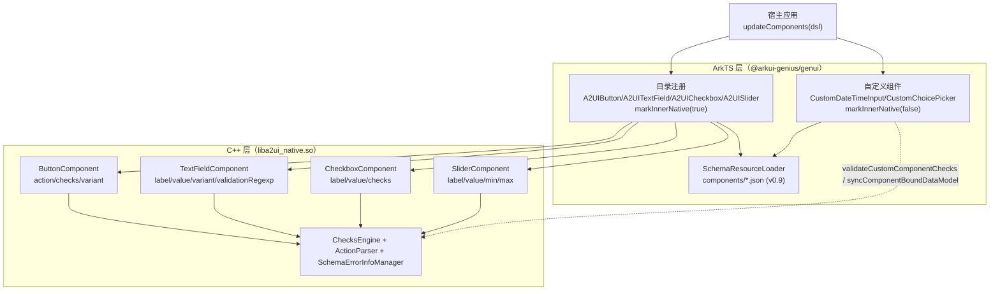
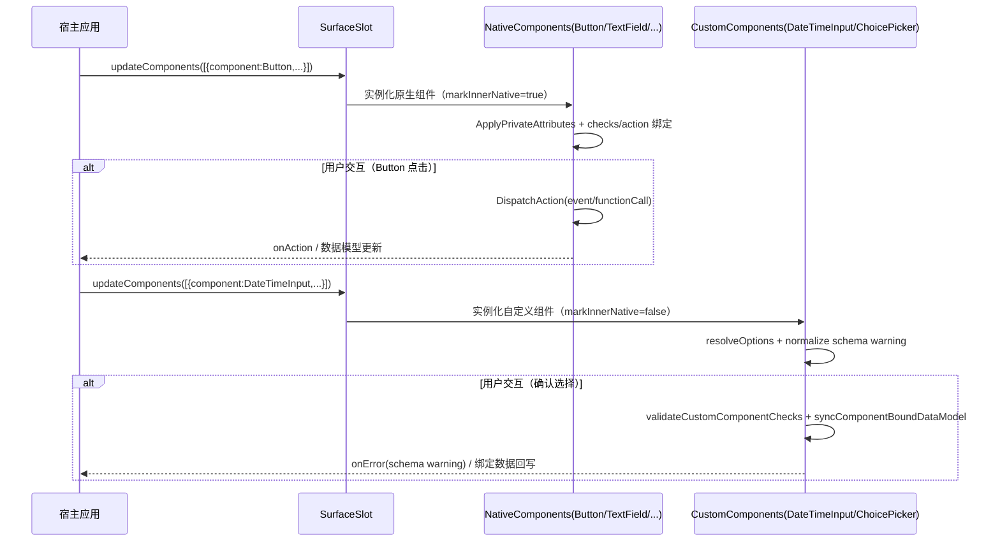

# 架构设计

> 确认目标仓和模块的架构约束、关键设计决策、Spec 拆分方向。

## 设计元数据

| Field | Content |
|-------|---------|
| Design ID | DESIGN-Func-07-04-04 |
| 关联需求 | 已有能力补录（无独立 requirement.md） |
| 关联 Epic | 无 |
| 目标 Feature | Feat-01 Button；Feat-02 TextField；Feat-03 CheckBox；Feat-04 Slider；Feat-05 DateTimeInput；Feat-06 ChoicePicker |
| 复杂度 | 标准 |
| 目标版本 | A2UI 原生协议 v0.9（`https://a2ui.org/specification/v0_9/catalogs/basic/catalog.json`）+ API Version 20 |
| Owner | GenUI SIG |
| 状态 | Baselined（已有实现补录） |

## 需求基线

> 需求基线详见 proposal.md。以下仅列出设计阶段需要额外强调的要点。

| 项 | 补充说明 |
|----|---------|
| 补录而非新增 | 当前实现即规格，可疑行为只能标注为风险/备注，不做修改 |
| 基准实现声明 | 标准交互组件以 A2UIRender 全量渲染引擎（`GenerativeUI/A2UIRender`，`@arkui-genius/genui`）为基准实现 |
| 范围边界 | 本功能域（07-04-04）覆盖 A2UI 标准交互组件 Button / TextField / CheckBox / Slider / DateTimeInput / ChoicePicker；组件通用属性（id/weight/margin 等）归 07-04-18，checks 验证函数（required/regex/length/numeric/email）归 07-04-07，action 事件与函数链归 07-04-19/22，动态数据绑定归 07-04-21，本设计不展开 |
| 双实现路径 | Button / TextField / CheckBox / Slider 经 C++ 原生组件（`cpp/components/A2UI/{button,textfield,checkbox,slider}`，`markInnerNative(true)`）；DateTimeInput / ChoicePicker 经 ArkTS 自定义组件（`CustomDateTimeInput.ets` / `CustomChoicePicker.ets`，`markInnerNative(false)`） |
| checks 语义 | 六组件均承载 `checks` 客户端验证，但失败行为不一致（Button/CheckBox/Slider 禁用、TextField 显示错误文本、DateTimeInput 弹窗内阻断、ChoicePicker 仅提示不阻断），需逐组件理解 |

## 上下文和现状

### 涉及仓和模块

| 仓库 | 补充架构说明 |
|------|-------------|
| `GenerativeUI/A2UIRender` | 全量渲染引擎。ArkTS 目录注册层（`genui/src/main/ets/core/components/A2UI/A2UIButton.ets`、`A2UITextField.ets`、`A2UICheckbox.ets`、`A2UISlider.ets`、`CustomDateTimeInput.ets`、`CustomChoicePicker.ets`）；C++ 原生层（`genui/src/main/cpp/components/A2UI/{button,textfield,checkbox,slider}`）提供 `liba2ui_native.so` 原生组件节点 |
| `GenerativeUI/Docs` | 开发者文档（`reference/standard-components/{button,textfield,checkbox,slider,dateTimeInput,choicePicker}.md`），仅理解辅助，契约以 A2UIRender 实现为准 |

> 仓、模块、当前职责、影响类型详见 proposal.md「影响范围」。

### 调用链层级分析

| 层 | 模块 | 职责 | 修改类型 |
|----|------|------|---------|
| 1. 目录注册层（ArkTS） | `A2UIButton.ets`/`A2UITextField.ets`/`A2UICheckbox.ets`/`A2UISlider.ets` | `asCatalogItem()` 注册组件类型与 schema；原生组件标记 `markInnerNative(true)` | 现状（基准实现） |
| 2. 目录注册层 - 自定义（ArkTS） | `CustomDateTimeInput.ets`/`CustomChoicePicker.ets` | `createDefinition()` + `asCatalogItem()` 注册自定义组件，标记 `markInnerNative(false)` | 现状 |
| 3. Schema 资源层（ArkTS） | `SchemaResourceLoader.loadA2UISchema(version, 'components/<X>.json')` | 加载 v0.9 标准化 schema（`rawfile/schema/A2UI/v0.9/components/*.json`） | 现状 |
| 4. 原生组件实现层（C++） | `ButtonComponent`/`TextFieldComponent`/`CheckboxComponent`/`SliderComponent`（`A2UIComponent` 子类） | 描述符解析、私有属性、内部节点（label/input/error/checkbox/slider）、主题应用 | 现状 |
| 5. 自定义组件层（ArkTS） | `CustomDateTimeInput`/`CustomChoicePicker` struct + `CustomComponentFactory` | 弹窗/面板渲染、属性解析、value 回写、`nativeEngine.validateCustomComponentChecks`/`syncComponentBoundDataModel` | 现状 |
| 6. 校验与动作基础层（C++ + ArkTS） | `ChecksEngine`、`ActionParser`/`ActionDispatcher`、`FunctionBridge`、`NativeActionRegistry`、`SchemaErrorInfoManager` | checks 校验、action 事件/函数分发、schema 告警记录 | 现状 |
| 7. 主题层（C++） | `ButtonTheme`/`TextFieldTheme`/`CheckboxTheme`/`SliderTheme` | 颜色/字号/尺寸等主题常量与暗色适配 | 现状 |

检查项：
- [x] 调用链每一层都已覆盖（目录注册 → schema → 原生/自定义实现 → 校验/动作 → 主题）
- [x] 每层职责边界清晰（ArkTS 负责注册与自定义组件编排，C++ 负责原生组件节点与校验动作）
- [x] 每层修改类型明确（均为「现状」，存量补录）

### 适用架构规则

| Rule ID | 适用原因 | 设计结论 | 验证方式 |
|---------|---------|---------|---------|
| OH-ARCH-LAYERING | ArkTS 目录层→C++ 原生层，及 ArkTS 自定义组件经 NAPI 调 `liba2ui_native.so` | 原生组件自顶向下；自定义组件经 `NativeEngineBridge` 回调校验/回写 | 架构评审/依赖检查 |
| OH-ARCH-SUBSYSTEM | 单仓 + 独立 Docs 仓，无跨子系统 | 不引入子系统外依赖 | 依赖检查 |
| OH-ARCH-API-LEVEL | 组件以 DSL 属性暴露（v0.9 schema），无独立 ArkTS 公共 API 变更 | 无新增权限；Kit `@arkui-genius/genui` | API 评审 |
| OH-ARCH-COMPONENT-BUILD | 现状无 BUILD.gn/bundle.json 变更 | 无构建影响 | 构建验证 |
| OH-ARCH-ERROR-LOG | 组件属性非法经 `SchemaErrorInfoManager`/`WarningDispatchBridge` 上报 schema 告警（发 onError，code=2001） | 非法属性告警契约详见各 Feat | UT |

## 不涉及项承接

> proposal.md 已完成 N/A 判定。本节仅对标记「涉及」且需展开设计的维度给出结论。

| 维度 | 设计结论 |
|------|---------|
| 跨进程/SA | 不涉及（同进程 ArkTS↔C++ 经 NAPI） |
| 持久化 | 不涉及（组件状态仅内存态，value 可经绑定回写数据模型） |
| 权限 | 不涉及 |
| 国际化/RTL | 文本内容由 DSL label 数据驱动，组件层仅透传；RTL 布局适配归 07-04-18/23 |
| 多设备适配 | 交互组件行为设备无关；断点/主题为控制器/主题状态（07-04-23/24 展开） |
| 范围边界 | 通用属性归 07-04-18；checks 函数归 07-04-07；action 链归 07-04-22；扩展交互组件归 07-04-12 |

## 关键设计决策

| 决策 ID | 问题 | 推荐方案 | 探索过的替代方案 | 取舍理由 | 影响 |
|--------|------|---------|----------------|---------|------|
| ADR-1 | 标准交互组件以何种技术实现 | Button/TextField/CheckBox/Slider 走 C++ 原生节点（`markInnerNative(true)`）；DateTimeInput/ChoicePicker 走 ArkTS 自定义组件（`markInnerNative(false)`，依赖 DatePicker/TimePicker/Checkbox 弹窗） | (a) 全部原生；(b) 全部自定义 | 简单表单类原生高性能；日期/选择器需弹窗与复杂状态，ArkTS 表达力更强 | 双路径行为契约需分别理解（`A2UIButton.ets:34`、`CustomChoicePicker.ets:977`） |
| ADR-2 | `checks` 校验失败行为如何统一 | 统一 `ChecksEngine::Validate` 判定，但失败动作由各组件各自实现：Button/CheckBox/Slider `SetEnabled=ValidateChecks()`（禁用）；TextField `SetErrorText`（错误文本）；DateTimeInput 弹窗确认时 `validateDateTimeInputChecks`（阻断）；ChoicePicker `resolveValidationMessage`（仅提示） | (a) 统一禁用；(b) 统一错误文本 | A2UI v0.9 各组件交互边界不同；错误呈现方式贴近原生语义 | checks 语义差异是理解关键（各 Feat 规则表） |
| ADR-3 | Button 点击响应如何分派 | `action` 支持 `event`（上报服务器事件）与 `functionCall`（客户端函数）双形式，经 `ActionType::FUNCTION_CALL/EVENT` 分支 | (a) 仅 event；(b) 仅 functionCall | A2UI v0.9 `Action` 定义双形式；`functionCall` 支持 dynamic resolve + native action 注册表 | `ButtonComponent.cpp:298-355` |
| ADR-4 | TextField 用户输入是否回写数据模型 | 用户输入实时回写：`HandleInputValueChange` → `SyncValueToBoundDataModel`（仅当 `valueBindingPath_` 非空） | (a) 仅在失焦回写；(b) 不回写 | 新 spec 要求实时同步绑定数据，保证模型与 UI 一致 | `TextFieldComponent.cpp:361-372,330-359` |
| ADR-5 | Slider min/max/value 边界 | `min>=max` 时回退默认 `min=0/max=100`；`value` 经 `ClampValue` 夹到 `[min,max]` | (a) 报错丢弃；(b) 不夹取直接设置 | A2UI v0.9 允许渲染器夹取越界值；`min>=max` 属非法配置，回退默认保证可用 | `SliderComponent.cpp:236-243,28-37` |
| ADR-6 | DateTimeInput 值格式 | 内核统一 ISO 8601；日期 `YYYY-MM-DD`、时间 `HH:mm`、日期时间 `YYYY-MM-DD HH:mm`（兼容 `T` 分隔）；时间 24 小时制（`useMilitaryTime(true)`） | (a) 12 小时制；(b) 本地化格式 | 与 A2UI v0.9 schema `format: date/time/date-time` 对齐；24 小时制消除歧义 | `CustomDateTimeInput.ets:824,836,503-518` |
| ADR-7 | ChoicePicker 选值回写模式 | 依 `value` 绑定形态区分 `item`（单选单值）与 `list`（多选数组）回写模式，`syncComponentBoundDataModel` 分别以字符串或数组回写 | (a) 固定数组回写；(b) 固定字符串回写 | 单选 mutuallyExclusive 回写单值，多选 multipleSelection 回写数组 | `CustomChoicePicker.ets:222-238,922-953` |

## 设计骨架

### 骨架范围

| 骨架项 | 目标 | 不包含 | 验证方式 |
|--------|------|--------|---------|
| 原生表单组件 | 固化 Button/TextField/CheckBox/Slider 属性解析、checks、action、内部节点 | 通用属性（07-04-18）、主题独有逻辑（07-04-24） | UT |
| 自定义选择组件 | 固化 DateTimeInput/ChoicePicker 属性解析、弹窗/面板、value 回写、schema 告警 | DatePicker/TimePicker 平台语义 | ohosTest |
| checks 语义 | 固化六组件 checks 失败行为差异 | checks 函数实现（07-04-07） | UT |

### 骨架 Spec 拆分

| Task ID | 目标 | 受影响文件 | AC |
|---------|------|----------|-----|
| TASK-SKELETON-1 | Feat-01 Button 交互组件基线 | `A2UIButton.ets`、`cpp/button/ButtonComponent.cpp/h`、`ButtonTheme` | AC-1.1~1.x |
| TASK-SKELETON-2 | Feat-02~06 TextField/CheckBox/Slider/DateTimeInput/ChoicePicker | `A2UITextField.ets`、`TextFieldComponent.cpp` 等 + `CustomDateTimeInput.ets`/`CustomChoicePicker.ets` | 各 Feat AC |

## 后续 Task 拆分

| Task ID | 目标 | 受影响文件 | 依赖 |
|---------|------|----------|------|
| T-1 | Feat-01 Button 组件（基线，本设计已承接） | `Feat-01-button-interaction-spec.md` + 本 design.md | — |
| T-2 | Feat-02 TextField 组件 | `TextFieldComponent.cpp/h`、`TextFieldTheme` | T-1 |
| T-3 | Feat-03 CheckBox 组件 | `CheckboxComponent.cpp/h`、`CheckboxTheme` | T-1 |
| T-4 | Feat-04 Slider 组件 | `SliderComponent.cpp/h`、`SliderTheme` | T-1 |
| T-5 | Feat-05 DateTimeInput 组件 | `CustomDateTimeInput.ets` | T-1 |
| T-6 | Feat-06 ChoicePicker 组件 | `CustomChoicePicker.ets` | T-1 |

## API 签名、Kit 与权限

> 本节承接 spec.md「API 变更分析」中识别的 API，给出签名、权限和 d.ts 位置等实现细节。

### 新增 API

无新增。六组件均为 A2UI v0.9 DSL 组件（存量补录），无独立 ArkTS 公开 API 变更。

### 变更/废弃 API

| 原有 API | 变更类型 | 新 API | 迁移说明 |
|---------|---------|--------|---------|
| `Button` / `TextField` / `CheckBox` / `Slider`（DSL 组件，`component` 字段） | 既有 | — | 经 `CatalogItem.forComponent` 注册，schema 载入 `components/*.json` |
| `DateTimeInput` / `ChoicePicker`（DSL 组件） | 既有 | — | 经 `CustomComponentDefinition` 注册，`markInnerNative(false)` |

> d.ts 位置：组件 schema 位于 `genui/src/main/resources/rawfile/schema/A2UI/v0.9/components/*.json`（ArkTS 源即契约，无独立 SDK `.d.ts`）。Kit：`@arkui-genius/genui`；权限：无；SysCap：不适用。

## 构建系统影响

### BUILD.gn 变更

无变更（存量补录）。`genui/src/main/cpp/` 已纳入现有 `liba2ui_native.so` 构建目标。

### bundle.json 变更

无变更。

## 可选设计扩展

### 架构图



### 数据流/控制流

| 步骤 | 调用方 | 被调用方 | 数据/接口 | 说明 |
|------|--------|---------|----------|------|
| 1 | 宿主应用 | `SurfaceSlot::UpdateComponents` | components 邻接表 | 组件实例化入口 |
| 2 | `SurfaceSlot` | `CatalogItem.forComponent` / `CustomComponentFactory` | type + schema + builder | 匹配组件定义 |
| 3 | 组件定义 | `ButtonComponent`/`TextFieldComponent`/... 或 `CustomDateTimeInput`/`CustomChoicePicker` | 私有属性描述符 | 属性解析与应用 |
| 4 | 原生组件 | `ChecksEngine::Validate` / `ActionParser::Parse` | checks 规则 / action 描述符 | 校验与动作绑定 |
| 5 | 自定义组件 | `nativeEngine.validateCustomComponentChecks` / `syncComponentBoundDataModel` | componentId + value | 校验与 value 回写 |
| 6 | 组件 | `WarningDispatchBridge` / `SchemaErrorInfoManager` | schema 告警（code=2001） | 非法属性上报 onError |

### 时序设计



### 数据模型设计

**API 层（ArkTS，目录注册契约）**

```typescript
// ets/core/components/A2UI/A2UIButton.ets（原生成分示）
export class A2UIButton {
  private static type: string = 'Button';
  public static asCatalogItem(): CatalogItem {
    return CatalogItem.forComponent(A2UIButton.type, A2UIButton.schemaProvider, EMPTY_COMPONENT_BUILDER)
      .markCategory(CatalogCategory.A2UI_STANDARD).markInnerNative(true);
  }
}
// CustomDateTimeInput.ets / CustomChoicePicker.ets（自定义成分示）
export function asCatalogItem(): CatalogItem {
  return CatalogItem.forComponent(definition.type, definition.schemaProvider, definition.builder)
    .markInnerNative(false);
}
```

**Framework 层（C++，原生组件状态）**

```cpp
// cpp/components/A2UI/button/ButtonComponent.h
std::string variant_ = "";
std::weak_ptr<Component> childComponent_;
std::unique_ptr<ChecksEngine> checksEngine_;
std::shared_ptr<ActionInfo> actionInfo_;

// cpp/components/A2UI/slider/SliderComponent.h
float minValue_;  // 默认 0.0f
float maxValue_;  // 默认 100.0f
float value_;     // clamp 到 [min,max]
```

| 结构 | 存储方案 | 生命周期 |
|------|---------|---------|
| `ButtonComponent::actionInfo_` | `shared_ptr<ActionInfo>` | `ApplyPrivateAttributes` 重建 |
| `TextFieldComponent::{labelText_,valueText_,errorText_}` | `std::string` 成员 | 属性/输入更新 |
| `TextFieldComponent::valueBindingPath_` | `std::string` | `ApplyPrivateAttributes` 解析 |
| `CheckboxComponent::{label_,value_}` | `std::string/bool` | 属性更新 |
| `ChoicePickerOptions::{options,value,valuePath}` | ArkTS interface | `resolveOptionsForSchemaWarning` 重建 |

### 测试性设计

| 测试层级 | 测试目标 | Mock 策略 | 验证方式 |
|---------|---------|----------|---------|
| C++ UT | `ButtonComponent` checks/action/variant | Mock Component/ChecksEngine | `genui/src/test/cpp/` |
| C++ UT | `TextFieldComponent` validationRegexp/value 回写 | Mock BindingEngine | `genui/src/test/cpp/` |
| C++ UT | `SliderComponent` min/max/value clamp | — | `genui/src/test/cpp/` |
| ArkTS 单测 | `CustomDateTimeInput`/`CustomChoicePicker` 属性解析与 schema 告警 | Mock attribute | `genui/src/test/` |
| ohosTest | 六组件端到端交互 | — | `entry/src/ohosTest/` |

### 资源所有权矩阵

| 资源 | 创建方 | 持有方 | 销毁触发 | 实际释放 | 异常回收 |
|------|--------|--------|---------|---------|---------|
| `ButtonComponent` | `SurfaceSlot` | `allComponents_` | 组件移除 | `RemoveChild` | Dispose |
| `TextFieldComponent` 内部节点 | `InitializeInternalNodes` | `TextFieldComponent` | 析构 | `DisposeNode` 逐个释放 | 析构器幂等 |
| `CustomDateTimeInput.dialogContent` | `openPickerDialog` | `CustomDateTimeInput` | 关闭/消失 | `closeCustomDialogSafely` | catch 中 clear |
| `ChecksEngine` | 组件构造 | `unique_ptr` 成员 | 组件析构 | 自动释放 | — |

### 接口参数规约

| 接口 | 参数 | 类型 | 合法范围 | 非法处理 | 边界说明 |
|------|------|------|---------|---------|---------|
| Button `variant` | — | enum | default/primary/borderless | 非法→default | `ResolveVariant` fallback |
| TextField `variant` | — | enum | shortText/longText/number/obscured | 非法→shortText | `ResolveVariant` fallback |
| TextField `validationRegexp` | — | string | 合法正则 | 非法→schema 告警 2001，校验失败 | 仅上报一次 |
| Slider `min`/`max` | — | number | min<max | min>=max→回退 0/100 | 边界回退 |
| Slider `value` | — | number | [min,max] | 越界→夹取 | `ClampValue` |
| DateTimeInput `value` | — | string | ISO 8601 | 非法→归一化或回退默认 | 24 小时制 |
| ChoicePicker `options` | — | array | 非空 | 空→丢弃组件 | option 缺 label/value→丢弃该项 |

### 线程与并发模型

| 操作 | 发起线程 | 回调线程 | 跨进程边界 | 线程安全 | 重入约束 |
|------|---------|---------|----------|---------|---------|
| 组件属性应用 | UI | UI | 无 | 单线程 UI | — |
| 用户输入/点击 | UI | UI | 无 | 单线程 UI | — |
| 数据模型回写 | UI | UI | 无 | 单线程 UI | value 绑定路径非空才回写 |

## 详细设计

### Button 变体与点击分派

`A2UIButton.ets:25` 注册 `type='Button'`。原生 `ButtonComponent::ResolveVariant`（`ButtonComponent.cpp:40-48`）将 variant 归一为 `default/primary/borderless`，非法回退 `default`；`SetVariant`（`:167-179`）经 `ButtonTheme::GetBackgroundColor` 设置背景并刷新子节点视觉。`ApplyPrivateAttributes`（`:123-139`）：先解析 `action` 与 `checks`，`ValidateChecks()` 结果驱动 `SetEnabled`（禁用状态），`actionInfo_` 有效时注册 `onClick`。`DispatchAction`（`:298-315`）按 `ActionType::FUNCTION_CALL/EVENT` 分支；`DispatchFunctionCallAction`（`:317-355`）先 `DynamicValueResolver::ResolveFunctionCallDescriptor` 解析（失败回退 raw args），再经 `NativeActionRegistry` 或 `FunctionBridge` 分发。子节点仅为 `Text` 或 `Icon`（`:141-149`），`OnAddChild` 后 `ApplyChildVisualStyle`（`:223-244`）区分布局（Icon→CIRCLE，Text→CAPSULE）。

### TextField 变体输入与正则校验

`TextFieldComponent::SetVariant`（`TextFieldComponent.cpp:500-523`）将 variant 映射到输入模式：`longText`→TextArea，`number`→`TextInputType::NUMBER`，`obscured`→`PASSWORD`，`shortText`→`NORMAL`。`ValidationRegexpCheck`（`:374-396`）：正则匹配失败设错误文本 `Input does not match validationRegexp`；正则非法时经 `WarningDispatchBridge` 上报 schema 告警（`SCHEMA_ERROR_CODE_INVALID_VALUE`，code=2001）并仅上报一次。`HandleInputValueChange`（`:361-372`）用户输入实时 `SyncValueToBoundDataModel`（`:330-359`）。`SetErrorText`（`:398-413`）在 checks 失败与 regexp 失败间优先保留 checks 消息。

### CheckBox 与 Slider 校验禁用与边界

`CheckboxComponent::ApplyPrivateAttributes`（`CheckboxComponent.cpp:175-195`）内置 ROW 节点（TEXT + CHECKBOX），`SetCheckboxShape(CIRCLE)`、`SetSelectColor`（主题或默认 `0xFF007DFF`）；`SetSelect`（`:159-163`）写 checkbox 选中态。`RefreshEnabledState`（`:211-214`）将 `ValidateChecks` 结果直接作用于 `SetEnabled`——checks 失败即禁用。`SliderComponent::ApplyPrivateAttributes`（`SliderComponent.cpp:221-254`）在属性应用后校验 `min>=max` 回退默认 `0/100`，`value` 经 `ClampValue` 夹取，`SetStep(1.0)`/`SetStyle(OUT_SET)`；`OnDataUpdate`（`:256-276`）在 min/max/value 动态更新时重新夹取。

### DateTimeInput 弹窗选择与 ISO 8601 归一化

`CustomDateTimeInput`（`CustomDateTimeInput.ets:958-1330`）经 `resolveOptions`（`:1256-1329`）解析 `label/value/enableDate/enableTime/min/max`；`normalizeDateTimeInputOptionsForSchemaWarning`（`:450-501`）校验 `enableDate/enableTime` 不可同 false、丢弃非法 min/max、`min>max` 回退默认边界、非法 value 归一化或回退。弹窗 `DateTimeInputSelectionDialog`（`:664-956`）以 `DatePicker`/`TimePicker` 渲染，`useMilitaryTime(true)` 24 小时制，combined 模式两步确认（`:741-775`），确认时 `resolveConfirmedValue` 格式化为 `YYYY-MM-DD HH:mm`。确认后 `validateDateTimeInputChecks`（`:1348-1377`）与 `updateDateTimeInputDataModelValue`（`:1379-1406`）回写绑定数据。

### ChoicePicker 单/多选与 value 回写

`CustomChoicePicker`（`CustomChoicePicker.ets:572-880`）`resolveVariantMode`（`:392-400`）归一 `mutuallyExclusive`（缺省）/`multipleSelection`；`ChoicePickerSelectionPanel`（`:427-570`）按 `displayStyle` 渲染 checkbox（分组）或 chips `chip`，`filterable` 时对 label/value 做不区分大小写包含过滤（`:546-555`）。`buildNextSelectedValues`（`:557-569`）实现单选互斥/多选增删。`applySelection`（`:659-672`）更新状态并 `updateChoicePickerDataModelValue`（`:922-953`）：`valueBindingMode==='item'` 回写单值字符串，否则回写数组。

## 风险和开放问题

| 项 | 类型 | 影响 | 处理方式 | Owner |
|----|------|------|---------|-------|
| RISK-1 checks 失败行为在六组件间不一致（禁用/错误文本/弹窗阻断/仅提示），易混淆 | 架构 | 中 | 各 Feat 规则表显式标注失败行为；`ChecksEngine` 统一判定 | GenUI SIG |
| RISK-2 DateTimeInput/ChoicePicker 无 C++ 实现，走 ArkTS 自定义组件（`markInnerNative(false)`），性能与能力上界区别于原生组件 | 架构 | 中 | design ADR-1 标注；组件规格标注实现路径 | GenUI SIG |
| RISK-3 TextField `variant='longText'` 采用 TextArea，`number`/`obscured` 叠加 inputType，变体切换时 inputNode 复用需保证可见性正确 | 架构 | 低 | `SetInputMode` 严格切换 Visible/Hidden（`TextFieldComponent.cpp:457-490`） | GenUI SIG |
| RISK-4 Slider `min>=max` 回退默认与 `value` 夹取的边界行为需与 A2UI v0.9 schema 注释一致 | 边界 | 低 | Feat-04 规则表覆盖 | GenUI SIG |
| RISK-5 DateTimeInput min/max 解析失败/`min>max` 的丢弃与默认边界（1970-01-01/2100-12-31 23:59）需文档化一致 | 边界 | 低 | Feat-05 规则表 + DFX 表覆盖 | GenUI SIG |

## 设计审批

- [x] 需求基线已确认，设计覆盖 P0/P1 AC
- [x] 不涉及项已承接，N/A 和展开项都有结论
- [x] 涉及仓和模块职责清楚
- [x] 调用链层级分析完整，每层覆盖到位
- [x] 适用架构规则已识别并形成设计结论
- [x] 分层和子系统边界合规
- [x] API 变更有签名、权限、错误码和兼容性说明
- [x] BUILD.gn/bundle.json 影响明确
- [x] 设计输出和后续 Task 拆分明确
- [x] 关键设计决策有理由和影响说明
- [x] 风险和开放问题有 Owner

**结论:** 通过（已有实现补录）