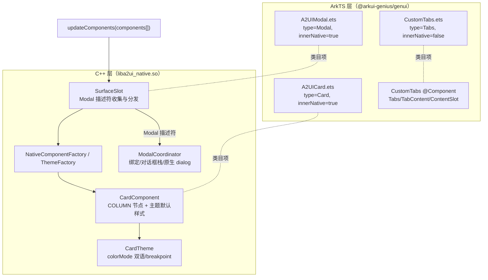
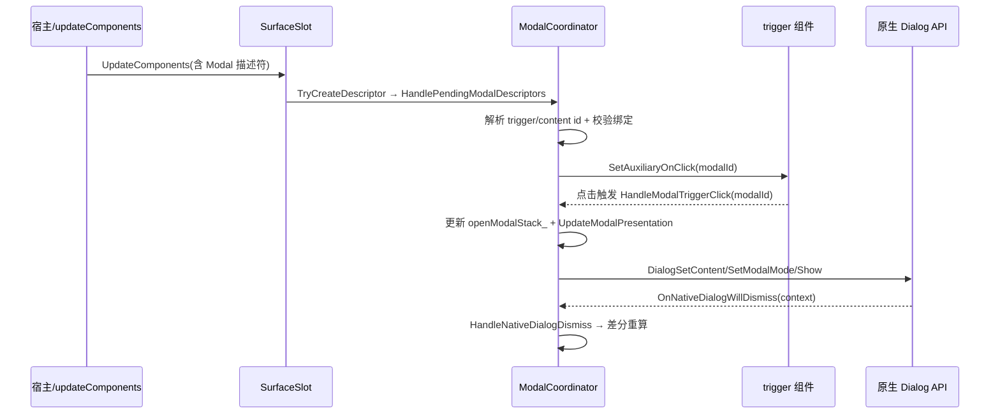

# 架构设计

> 确认目标仓和模块的架构约束、关键设计决策、Spec 拆分方向。

## 设计元数据

| Field | Content |
|-------|---------|
| Design ID | DESIGN-Func-07-04-05 |
| 关联需求 | 已有能力补录（无独立 requirement.md） |
| 关联 Epic | 无 |
| 目标 Feature | Feat-01 Card 容器（基线）；Feat-02 Modal 模态框；Feat-03 Tabs 页签 |
| 复杂度 | 标准 |
| 目标版本 | API Version 20；A2UI 标准协议 v0.9 |
| Owner | GenUI SIG |
| 状态 | Baselined（已有实现补录） |

## 需求基线

> 需求基线详见 proposal.md。以下仅列出设计阶段需要额外强调的要点。

| 项 | 补充说明 |
|----|---------|
| 补录而非新增 | 当前实现即规格，可疑行为只能标注为风险/备注 |
| 基准实现声明 | 本功能域以 A2UIRender 全量渲染引擎（`GenerativeUI/A2UIRender`，`@arkui-genius/genui`）为基准实现 |
| 子类形态差异 | 三个容器组件的实现形态不同：Card 与 Modal 为「innerNative」类目（native 渲染/协调），Tabs 为纯 ArkTS 自定义组件（`markInnerNative(false)`） |
| 范围边界 | 本功能域（07-04-05）仅覆盖 Card/Modal/Tabs 三个「容器」组件的特有语义；通用属性（通用属性域）、样式/主题基础（主题域）与 action 事件语义（交互域）不在此展开 |

## 上下文和现状

### 涉及仓和模块

| 仓库 | 补充架构说明 |
|------|-------------|
| `GenerativeUI/A2UIRender` | 全量渲染引擎。ArkTS 层（`genui/src/main/ets/core/components/A2UI/`）声明类目项与自定义组件；C++ 层（`genui/src/main/cpp/components/A2UI/`）提供 Card 原生组件与 Modal 协调器（`liba2ui_native.so`） |
| `GenerativeUI/Docs` | 开发者文档（`reference/standard-components/card.md`、`modal.md`、`tabs.md`），仅作理解辅助，契约以 A2UIRender 实现为准 |

> 仓、模块、当前职责、影响类型详见 proposal.md「影响范围」。

### 调用链层级分析

| 层 | 模块 | 职责 | 修改类型 |
|----|------|------|---------|
| 1. 类目注册层（ArkTS） | `A2UICard.ets`、`A2UIModal.ets`、`CustomTabs.ets`（`asCatalogItem`） | 声明组件类型、SchemaProvider、`markInnerNative`/类目标记 | 现状（基准实现） |
| 2. 组件工厂层 | `NativeComponentFactory.cpp`（Card）、`ThemeFactory.cpp`（CardTheme）、`CustomComponentFactory.ets`（Tabs） | 按 component 类型创建 native 组件/Custom 定义 | 现状 |
| 3. 树构建与分发层（C++） | `SurfaceSlot.cpp`（`HandleSpecialRootBuildDescriptor`/`HandlePendingModalDescriptors`） | 识别 Modal 协议节点、收集 modal 描述符、分发到协调器 | 现状 |
| 4. 组件渲染层（C++） | `CardComponent.cpp` | Card 以原生 COLUMN 节点渲染，应用主题默认样式（圆角/阴影/边距/边框/背景） | 现状 |
| 5. 主题层（C++） | `CardTheme.cpp` | Card 默认样式指标按 `colorMode` 解析（breakpoint 暂未差异化） | 现状 |
| 6. 模态协调层（C++） | `ModalCoordinator.cpp` | trigger/content 绑定、对话框栈协调、原生 dialog 生命周期、属性转发 | 现状 |
| 7. 自定义组件渲染层（ArkTS） | `CustomTabs.ets`（`@Component`） | Tabs 页签归一化、`Tabs`/`TabContent` 声明式绑定、品牌色解析 | 现状 |

检查项：
- [x] 调用链每一层都已覆盖（类目注册→工厂→树分发→组件渲染→主题→模态协调→自定义渲染）
- [x] 每层职责边界清晰（ArkTS 负责类目声明与 Tabs 自定义渲染，C++ 负责 Card 渲染与 Modal 原生 dialog 协调）
- [x] 每层修改类型明确（均为「现状」，存量补录）

### 适用架构规则

| Rule ID | 适用原因 | 设计结论 | 验证方式 |
|---------|---------|---------|---------|
| OH-ARCH-LAYERING | ArkTS 类目声明 → C++ 原生渲染/协调 跨语言调用 | Card/Modal 走 native（innerNative=true）；Tabs 走 ArkTS 自定义组件；调用方向自顶向下 | 架构评审/依赖检查 |
| OH-ARCH-SUBSYSTEM | 单仓 + 独立 Docs 仓，无跨子系统 | 不引入子系统外依赖 | 依赖检查 |
| OH-ARCH-API-LEVEL | 无新增公开 ArkTS API/C-API（均为既有 A2UI 组件协议），无新增权限 | 组件协议经 JSON Schema 约束 | API 评审 |
| OH-ARCH-COMPONENT-BUILD | 现状 Card 源已纳入 `CMakeLists.txt`/`A2UISources.cmake` | 无新增构建目标 | 构建验证 |
| OH-ARCH-ERROR-LOG | Card 主题缺失打 `LOG_ERROR`；Modal 绑定校验打 `LOG_WARN` + 经 `WarningDispatchBridge` 派发 schema warning | 错误/告警契约详见 Feat-01/Feat-02 | UT/hilog |

## 不涉及项承接

> proposal.md 已完成 N/A 判定。本节仅对标记「涉及」且需展开设计的维度给出结论。

| 维度 | 设计结论 |
|------|---------|
| 跨进程/SA | 不涉及（同进程 ArkTS↔C++ 经 NAPI；Modal 原生 dialog 也是同进程 API 调用） |
| 持久化 | 不涉及 |
| 权限 | 不涉及 |
| 国际化/RTL | 不涉及（Tabs 标题为任意字符串，无方向性处理） |
| 多设备适配 | Card 主题 `ResolveValueMetrics` 暂不按 breakpoint 差异化（固定默认值，风险 RISK-3）；Tabs/Modal 无设备差异 |
| 深色模式 | Card 主题按 `colorMode` 解析背景/边框颜色（`CardTheme.cpp:92-106`）；Tabs/Modal 不涉及 |

## 关键设计决策

| 决策 ID | 问题 | 推荐方案 | 探索过的替代方案 | 取舍理由 | 影响 |
|--------|------|---------|----------------|---------|------|
| ADR-1 | Card 如何渲染 | Card 复用原生 `COLUMN` 节点（`CardComponent.cpp:24`），通过 `CardTheme` 默认样式 + descriptor `width`/`height` 渲染 | (a) 新建独立 Card 节点类型；(b) 纯 ArkTS 容器 | 复用 Column 布局语义，native 性能佳，主题统一 | Card 继承 A2UIComponent 通用属性 |
| ADR-2 | Card 默认样式如何取 | `CardTheme` 常量默认值（圆角 8/阴影 OUTER_DEFAULT_LG/内边距 16/边框宽 1），背景与边框色按 `colorMode` 双语 | (a) descriptor 必填样式；(b) 资源文件 | A2UI 协议无样式必填约束，主题常量兜底统一样式 | 深色/浅色自动切换（`CardTheme.cpp:92-106`） |
| ADR-3 | Modal 是否有可见组件节点 | Modal 不创建可见组件节点；作为「协议节点」在 `SurfaceSlot::HandleSpecialRootBuildDescriptor` 收集描述符，由 `ModalCoordinator` 绑定 trigger/content 并弹原生 dialog | (a) 创建 Modal 组件节点；(b) ArkTS Overlay 层实现 | trigger/content 是既有组件，dialog 语义由原生 dialog 统一承载 | Modal 描述符不参与正常组件树挂载 |
| ADR-4 | Modal trigger/content 如何解析与校验 | `ResolveModalDescriptorIds` 用 `DynamicValueResolver` 解析动态 id；绑定前多条件跳过（root 作 content、trigger 不支持点击、content 无 native view、content 已挂载、trigger/content 重复 id） | (a) 仅静态 id；(b) 忽略校验直接绑定 | 动态 id 与数据模型联动；分场景跳过避免非法弹框 | 非法绑定被 retain 待后续数据更新重试 |
| ADR-5 | Modal 对话框栈如何协调 | `openModalStack_`（期望）与 `activeDialogs_`（实际原生 dialog）差分：公共前缀保留、超部分关闭、不足部分 `PresentNativeDialog`；`dialogCloseInProgress_` 防重入 | (a) 每次都重建全部 dialog；(b) 单 dialog 覆盖 | 差分最小化原生 dialog 重建，支持叠层 modal | dismiss context 需退休回收防 late 回调 |
| ADR-6 | Modal 通用属性如何送达 trigger | Modal 的 `weight`/`accessibility.label`/`accessibility.description` 转发到 trigger 组件（`ApplyTriggerCommonAttributes`） | (a) 在 Modal 上直接设置；(b) 通过内容节点 | Modal 无自身节点，只能作用于 trigger；与 `Component::SetLayoutWeight` 行为对齐 | 取消绑定时需重置 trigger 属性（`ResetTriggerCommonAttributes`） |
| ADR-7 | Tabs 用 native 还是 ArkTS | Tabs 用 ArkTS `@Component` `CustomTabs`（`markInnerNative(false)`），基于系统 `Tabs`+`TabContent`+`ContentSlot` 渲染 | (a) native C++ 组件；(b) 第三方库 | 系统 `Tabs` 提供页签/指示器/动画等完整能力，ArkTS 声明式更易实现 | 与 Card/Modal（innerNative）形态不同 |
| ADR-8 | Tabs 页签如何归一化与告警 | `SchemaLocalPropertyHelper.normalizeObjectArrayProperty`（`tabs`，`minItems=1`）+ `normalizeDynamicStringProperty`/`normalizeNonEmptyStringProperty`；unknown field 记录 schema warning | (a) 直接 JSON 解析；(b) 不校验 | Schema 校验 + 动态解析统一于 helper，签名去重避免重复告警 | title/child 必填，tabs 至少 1 项 |

## 设计骨架

### 骨架范围

| 骨架项 | 目标 | 不包含 | 验证方式 |
|--------|------|--------|---------|
| Card 容器 | 固化 Card 默认主题样式、child 单子、width/height 覆盖 | 通用属性/主题基础（其他功能域） | UT |
| Modal 模态框 | 固化 trigger/content 绑定、对话框栈、原生 dialog 配置 | action 事件语义（交互域） | UT |
| Tabs 页签 | 固化 tabs 数组归一化、页签渲染、品牌色 | 动态字符串解析底层（数据域） | ArkTS 单测 |

### 骨架 Spec 拆分

| Task ID | 目标 | 受影响文件 | AC |
|---------|------|----------|-----|
| TASK-SKELETON-1 | Feat-01 Card 容器基线 | `CardComponent.*`、`CardTheme.*`、`A2UICard.ets` | AC-1.1~ |
| TASK-SKELETON-2 | Feat-02 Modal 模态框 | `ModalCoordinator.*`、`SurfaceSlot.cpp`、`A2UIModal.ets` | AC-1.1~ |
| TASK-SKELETON-3 | Feat-03 Tabs 页签 | `CustomTabs.ets`、`CustomComponentFactory.ets` | AC-1.1~ |

## 后续 Task 拆分

| Task ID | 目标 | 受影响文件 | 依赖 |
|---------|------|----------|------|
| T-1 | Feat-01 Card 容器（基线，本设计已承接） | `Feat-01-card-container-spec.md` + 本 design.md | — |
| T-2 | Feat-02 Modal 模态框 | `Feat-02-modal-container-spec.md` | T-1 |
| T-3 | Feat-03 Tabs 页签 | `Feat-03-tabs-container-spec.md` | T-1 |

## API 签名、Kit 与权限

> 本节承接 spec.md「API 变更分析」中识别的 API，给出签名、权限和 d.ts 位置等实现细节。

### 新增 API

无新增。本特性覆盖既有 A2UI 标准组件协议（JSON Schema 约束，无 ArkTS/C-API 公开签名变更）。

### 变更/废弃 API

| 原有 API | 变更类型 | 新 API | 迁移说明 |
|---------|---------|--------|---------|
| `Card` 组件协议（`component: "Card"`，`child` + 可选 `width`/`height`） | 既有 | — | 容器组件协议 |
| `Modal` 组件协议（`component: "Modal"`，`trigger`/`content`，可选 `weight`/`accessibility`） | 既有 | — | 模态框协议 |
| `Tabs` 组件协议（`component: "Tabs"`，`tabs` 数组，项含 `title`/`child`） | 既有 | — | 页签协议 |

> Schema 位置：`components/Card.json`、`components/Modal.json`、`components/Tabs.json`（经 `SchemaResourceLoader.loadA2UISchema` 加载）。Kit：`@arkui-genius/genui`；权限：无；SysCap：不适用。

## 构建系统影响

### BUILD.gn 变更

无变更（存量补录）。Card 相关源已纳入构建：`CMakeLists.txt:126`（`components/A2UI/card/CardComponent.cpp`）、`cmake/A2UISources.cmake:85`。

### bundle.json 变更

无变更。

## 可选设计扩展

### 架构图



### 数据流/控制流

| 步骤 | 调用方 | 被调用方 | 数据/接口 | 说明 |
|------|--------|---------|----------|------|
| 1 | `SurfaceSlot` | `NativeComponentFactory` | `component: "Card"` 描述符 | 创建 CardComponent |
| 2 | `CardComponent` | `CardTheme` | `ThemeContext` | 取默认样式指标 |
| 3 | `CardComponent` | `ArkUINodeApiAdapter` | 圆角/阴影/内边距/边框/背景 | 应用样式 |
| 4 | `SurfaceSlot` | `ModalCoordinator::TryCreateDescriptor` | `component: "Modal"` 描述符 | 收集 modal 描述符 |
| 5 | `SurfaceSlot` | `ModalCoordinator::HandlePendingModalDescriptors` | 描述符 + allComponents + parentsRelations | 建立绑定 |
| 6 | trigger 点击 | `ModalCoordinator::HandleModalTriggerClick` | modalId | 更新期望栈 |
| 7 | `ModalCoordinator` | `ArkUINodeApiAdapter::Dialog*` | content native view | 原生 dialog 呈现/关闭 |
| 8 | `CustomComponentFactory` | `CustomTabs` | `CustomComponentAttribute` | Tabs 自定义渲染 |

### 时序设计



### 数据模型设计

**API 层（ArkTS，公开契约）**

```typescript
// CustomTabs.ets（TabItem 内部契约）
interface TabItem { title: string; child: string; slot?: NodeContent; }
// ModalDescriptor（C++ 协议描述，无 ArkTS 对应公开类型）
```

**Framework 层（C++）**

```cpp
// CardTheme.h
struct StyleMetrics {
  float borderRadius; int32_t shadowStyle; float padding;
  float borderWidth; uint32_t borderColor; uint32_t backgroundColor;
};

// ModalCoordinator.h
struct ModalDescriptor {
  std::string modalId, triggerId, contentId;
  std::string triggerJsonLiteral, contentJsonLiteral;
  bool hasWeight; float weight;
  bool hasAccessibilityLabel; std::string accessibilityLabelJson;
  bool hasAccessibilityDescription; std::string accessibilityDescriptionJson;
};
```

| 结构 | 存储方案 | 生命周期 |
|------|---------|---------|
| `CardComponent::cachedTheme_` | `weak_ptr<CardTheme>` | 主题缓存，随组件生命周期 |
| `CardTheme::styleMetrics_` | 值语义 struct | 构造/`OnConfigChange` 重建 |
| `ModalCoordinator::modalDescriptors_` | `vector<ModalDescriptor>` | 每批组件更新重建 |
| `ModalCoordinator::modalBindings_` | `unordered_map<modalId, ModalBinding>` | 绑定生效期 |
| `ModalCoordinator::openModalStack_` | `vector<string>` | 期望弹框栈 |
| `ModalCoordinator::activeDialogs_` | `vector<ActiveDialogState>` | 原生 dialog 栈 |
| `ModalCoordinator` 全局注册表 | `static unordered_map<key, ModalCoordinator*>` | 静态 dismiss 回调回查 |

### 测试性设计

| 测试层级 | 测试目标 | Mock 策略 | 验证方式 |
|---------|---------|----------|---------|
| C++ UT | `CardTheme::Resolve*` 默认值/colorMode 双语 | Mock `ThemeContext` | `genui/src/test/cpp/` |
| C++ UT | `CardComponent::ApplyThemeDefaults` 样式下发 | Mock `ArkUINodeApiAdapter` | `genui/src/test/cpp/` |
| C++ UT（TDD_BUILD） | `ModalCoordinator` 绑定/栈协调 | `#ifdef TDD_BUILD` 暴露 `GetBindingCount/GetOpenModalCount` 等 | `genui/src/test/cpp/` |
| ArkTS 单测 | `CustomTabs.normalizeTabsDefinitions` 归一化 | 直接测 `CustomTabs.ets` | `genui/src/test/` |
| ohosTest | Card/Modal/Tabs 端到端渲染 | — | `entry/src/ohosTest/` |

### 资源所有权矩阵

| 资源 | 创建方 | 持有方 | 销毁触发 | 实际释放 | 异常回收 |
|------|--------|--------|---------|---------|---------|
| `CardComponent` | `NativeComponentFactory` | `SurfaceSlot::allComponents_` | 组件移除 | `RemoveChild` | — |
| `CardTheme` | `ThemeFactory` | `weak_ptr`（组件缓存） | 组件销毁 | 随组件 | — |
| `ModalCoordinator` | `SurfaceSlot` 构造 | `SurfaceSlot::modalCoordinator_` | Surface 销毁 | `Dispose()` | `ForceCloseAllActiveDialogs` |
| `DialogDismissContext` | `PresentNativeDialog` | `activeDialogs_`/退休表 | 原生 close/过渡 | `Release*`/`delete` | 退休/脱离写回释放 |
| `A2UINativeDialogHandle` | `DialogCreate` | `activeDialogs_` | 关闭/过渡 | `DialogDispose` | `cleanup` lambda 兜底 |

### 接口参数规约

| 接口 | 参数 | 类型 | 合法范围 | 非法处理 | 边界说明 |
|------|------|------|---------|---------|---------|
| Card 描述符 | child | string | 单个已存在组件 id | 缺省/多 id/不存在 id 不渲染内容 | 必填（schema `{"child"}`） |
| Card 描述符 | width/height | number | 正值 | 缺省走主题 | `IsKnownAdditionalDescriptorKey` 白名单 |
| Modal 描述符 | trigger/content | string 或动态 | 引用已存在且可点击/未挂载组件 | 非法跳过绑定并 retain | 必填；root 不可作 content |
| Modal 描述符 | weight | number | finite && >0 | 非 number → schema warning + 默认值 | 0/非有限值归一化为 0 |
| Tabs 描述符 | tabs | array(object) | ≥1 项 | 缺失/空 → 无法创建 | `minItems=1` |
| Tabs 描述符 | tabs[].title/child | string/DynamicString | 非空 | 缺失任一 → schema 校验不通过 | 均必填 |

### 线程与并发模型

| 操作 | 发起线程 | 回调线程 | 跨进程边界 | 线程安全 | 重入约束 |
|------|---------|---------|----------|---------|---------|
| Card/Modal 组件更新 | UI | UI | 无 | 单线程 UI | — |
| Modal trigger 点击 | UI | UI | 无 | 单线程 | `dialogCloseInProgress_` 防过渡重入 |
| 原生 dialog dismiss 回调 | native→ArkTS | UI | 无 | 单线程 | 退休 context 防 late 回调双删 |
| `ModalCoordinator` 全局注册表 | UI | UI | 无 | 单线程 | 静态回调经 key 回查 owner |

## 详细设计

### Card 渲染与主题

`CardComponent` 构造即以原生 `COLUMN` 节点为基（`CardComponent.cpp:24`），`GetType()` 返回 `"Card"`（`:77-80`）。`ApplyPrivateAttributes`（`:51-69`）先取 `GetTheme()`（`:82-103`，经 `weak_ptr` 缓存 + `dynamic_pointer_cast<CardTheme>`）；theme 为 null 打 `LOG_ERROR` 直接返回；否则 `ApplyThemeDefaults` 后可选覆盖 `width`/`height`。`ApplyThemeDefaults`（`:105-114`）下发：`SetBorderRadius(borderRadius)`、`SetBackgroundColor(backgroundColor)`、`SetShadow(shadowStyle)`、`SetPadding(padding×4)`、`SetBorderWidth(borderWidth×4)`、`SetBorderColor(borderColor)`。`child` 由 `CollectChildListDescriptor`（`:46-49`）经 `ChildListParser::ParseChild` 解析单子。`OnConfigChange`（`:116-128`）在主题上下文变化（深色/浅色等）时重放默认样式。

`CardTheme` 常量默认值（`CardTheme.cpp:26-33`）：`DEFAULT_CARD_BORDER_RADIUS=8.0F`、`DEFAULT_CARD_SHADOW_STYLE=OUTER_DEFAULT_LG`、`DEFAULT_CARD_PADDING=16.0F`、`DEFAULT_CARD_BORDER_WIDTH=1.0F`；边框/背景浅色 `0xFFE0E0E0`/`0xFFFFFFFF`，深色 `0xFF333333`/`0xFF1A1A1A`。`ResolveBackgroundColor`/`ResolveBorderColor`（`:92-106`）按 `currentContext_.colorMode==LIGHT` 双语；`ResolveValueMetrics`（`:85-90`）返回固定值、未按 `breakpoint` 差异化（风险 RISK-3）。

### Modal 绑定与对话框栈

`SurfaceSlot::HandleSpecialRootBuildDescriptor`（`SurfaceSlot.cpp:1166-1176`）识别 `componentType=="Modal"` 并经 `TryCreateDescriptor` 收集描述符；后续 `HandlePendingModalDescriptors`（`:1246`）下发。`ModalCoordinator::TryCreateDescriptor`（`ModalCoordinator.cpp:372-409`）：非对象或非 `"Modal"` 返回 false；读取 `id`/`trigger`/`content`（required，动态字符串）、`weight`（可选 number）、`accessibility`（可选，label/description）。`ValidateUnknownDescriptorFields`（`:104-130`）对未定义字段派发 `SCHEMA_ERROR_CODE_UNDEFINED_FIELD` schema warning。

绑定校验链（`ApplyModalBindings`，`:567-601`）：`ValidateModalDescriptorForBinding`（`:611-627`）先 `ResolveModalDescriptorIds` 解析动态 id，`contentId=="root"` 跳过；`ResolveModalBindingComponents`（`:629-672`）逐条跳过（trigger/content 不存在、trigger 不支持点击、content 无 native view、content 已挂载正常树）；`ReserveModalBindingIds`（`:674-692`）拒绝重复 trigger/content id。通过后 `ApplyResolvedModalBinding`（`:694-710`）转发通用属性并 `SetAuxiliaryOnClick`（`:707-709`）挂 click handler。

点击 `HandleModalTriggerClick`（`:487-503`）维护 `openModalStack_`（栈顶既有则 pop、中途则截断、缺失则 push）。`UpdateModalPresentation`（`:793-837`）对期望栈与 `activeDialogs_` 做公共前缀差分：超部分 `CloseTopActiveDialogForTransition`（`:916-936`）逐步关闭；不足部分 `PresentNativeDialog`（`:882-914`）经 `ConfigureNativeDialog`（`:839-880`）配置内容/居中/模态/自动取消/`onWillDismiss` 后 `DialogShow`。原生 dismiss 经静态 `OnNativeDialogWillDismiss`（`:1105-1126`）回查 `ModalCoordinator`（全局注册表 `RegisterOwner`/`FindCoordinator`）→ `HandleNativeDialogDismiss`（`:1037-1062`）同步栈并重算呈现。

### Tabs 自定义组件

`CustomTabs`（`CustomTabs.ets:78`）为 ArkTS `@Component`，`markInnerNative(false)`（`asCatalogItem`，`:369-375` 经 `markInnerNative(false)`）。构建期（`:96-144`）用系统 `Tabs({index})`+`TabContent`+`ContentSlot`，`.barMode(Fixed)`、`.animationDuration(200)`、`.onChange` 更新 `currentIndex`，并附 `layoutWeight`/`margin`/无障碍文本。`normalizeTabsDefinitions`（`:189-251`）经 `normalizeObjectArrayProperty`（`tabs`，`TABS_MIN_ITEMS=1`，`:50`）与 `normalizeDynamicStringProperty`/`normalizeNonEmptyStringProperty` 归一化每项 `title`/`child`；`recordUnknownFieldWarningsIfNeeded`（`:274-305`）以签名去重后记录 unknown field warning。`resolveTabItems`（`:307-337`）将归一化定义与 `slots`（`ContentSlot`）关联；`resolveDynamicString`（`:339-349`）解析动态标题。品牌色存在时（`hasBrandColor`）页签指标器与选中文字用品牌色（`:98-131`）。

## 风险和开放问题

| 项 | 类型 | 影响 | 处理方式 | Owner |
|----|------|------|---------|-------|
| RISK-1 render_docs 描述 Modal trigger 需配置 `action.event.name=="modal.trigger"`、content 按钮用 `"modal.dismiss"` 关闭（`modal.md:24`），但 native 实现仅经 `SetAuxiliaryOnClick` 直接接管 trigger 点击，未消费 `"modal.trigger"`/`"modal.dismiss"` action 名（`ModalCoordinator.cpp:707-709`） | 架构 | 高 | 以代码为准写入 Feat-02；render_docs 需后续对齐 | GenUI SIG |
| RISK-2 render_docs DFX 表称 Modal trigger/content 引用不存在上报 `code 2001`（`modal.md:330-333`），native 实现为绑定跳过 + retain + schema warning，无 2001 错误码 | API | 中 | 以代码为准写入 Feat-02；错误码契约对账 | GenUI SIG |
| RISK-3 `CardTheme::ResolveValueMetrics` 未按 `breakpoint` 差异化，返回固定值（`CardTheme.cpp:85-90`） | 架构 | 低 | Feat-01 标注；多设备保持无差异 | GenUI SIG |
| RISK-4 Modal 的 `weight`/`accessibility` 字段在 render_docs Schema 未列出但 native 支持（`ModalCoordinator.cpp:391-406`） | API | 低 | Feat-02 标注；Schema 需同步 | GenUI SIG |
| RISK-5 Modal 绑定跳过时机存在时序性：content 已挂载正常树时跳过并 retain，待后续 `updateComponents` 重试（`ModalCoordinator.cpp:664-671`），多轮数据更新语义非显式 | 边界 | 低 | Feat-02 AC 覆盖 | GenUI SIG |

## 设计审批

- [x] 需求基线已确认，设计覆盖 P0/P1 AC
- [x] 不涉及项已承接，N/A 和展开项都有结论
- [x] 涉及仓和模块职责清楚
- [x] 调用链层级分析完整，每层覆盖到位
- [x] 适用架构规则已识别并形成设计结论
- [x] 分层和子系统边界合规
- [x] API 变更有签名、权限、错误码和兼容性说明
- [x] BUILD.gn/bundle.json 影响明确
- [x] 设计输出和后续 Task 拆分明确
- [x] 关键设计决策有理由和影响说明
- [x] 风险和开放问题有 Owner

**结论:** 通过（已有实现补录）