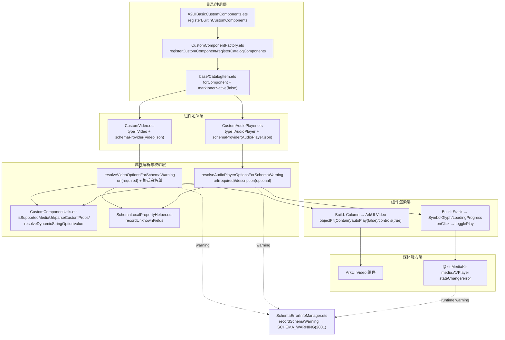
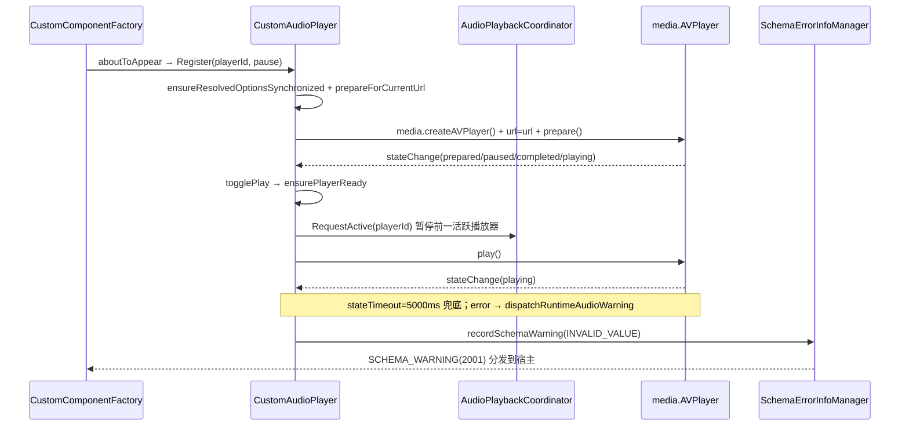

# 架构设计

> 确认目标仓和模块的架构约束、关键设计决策、Spec 拆分方向。

## 设计元数据

| Field | Content |
|-------|---------|
| Design ID | DESIGN-Func-07-04-06 |
| 关联需求 | 已有能力补录（无独立 requirement.md） |
| 关联 Epic | 无 |
| 目标 Feature | Feat-01 Video 组件（基线）；Feat-02 AudioPlayer 组件 |
| 复杂度 | 标准 |
| 目标版本 | A2UI 原生协议 v0.9（`https://a2ui.org/specification/v0_9/catalogs/basic/catalog.json`）+ 鸿蒙 API Version 20 |
| Owner | GenUI SIG |
| 状态 | Baselined（已有实现补录） |

## 需求基线

> 需求基线详见 proposal.md。以下仅列出设计阶段需要额外强调的要点。

| 项 | 补充说明 |
|----|---------|
| 补录而非新增 | 当前实现即规格，可疑行为只能标注为风险/备注 |
| 基准实现声明 | 本功能域以 A2UIRender 全量渲染引擎（`GenerativeUI/A2UIRender`，`@arkui-genius/genui`）为基准实现 |
| 组件归属 | Video/AudioPlayer 均为 A2UI 标准 catalog 下的媒体类高级组件，以 ArkTS 自定义组件（custom component）方式实现，非 native C++ 渲染路径 |
| 范围边界 | 本功能域（07-04-06）仅覆盖 Video/AudioPlayer 两个媒体组件的属性解析、格式校验、渲染与播放控制；其余组件语义归各自功能域（07-04-02~05、07-04-10~16），动态值/表达式/函数归 07-04-21/22，主题/深色模式归 07-04-24 |

## 上下文和现状

### 涉及仓和模块

| 仓库 | 补充架构说明 |
|------|-------------|
| `GenerativeUI/A2UIRender` | 全量渲染引擎。ArkTS 自定义组件层（`genui/src/main/ets/core/components/A2UI/CustomVideo.ets`、`CustomAudioPlayer.ets`）实现媒体组件；`CustomComponentUtils.ets`/`CustomComponentFactory.ets`/`CatalogItem.ets` 提供自定义组件注册、属性解析与 catalog 挂载；`SchemaErrorInfoManager.ets`/`SchemaLocalPropertyHelper.ets` 提供 schema warning 上报 |
| `GenerativeUI/Docs` | 开发者文档（`reference/standard-components/video.md`、`audioPlayer.md`），仅作理解辅助，契约以 A2UIRender 实现为准 |

> 仓、模块、当前职责、影响类型详见 proposal.md「影响范围」。

### 调用链层级分析

| 层 | 模块 | 职责 | 修改类型 |
|----|------|------|---------|
| 1. 目录/注册层（ArkTS） | `A2UIBasicCustomComponents.ets`、`CustomComponentFactory.ets`、`base/CatalogItem.ets` | 内置组件定义收集、`registerBuiltInCustomComponents` 注册、`CatalogItem.forComponent`/`markInnerNative(false)` 挂载 | 现状（基准实现） |
| 2. 组件定义层（ArkTS） | `CustomVideo.ets`、`CustomAudioPlayer.ets`（`createXxxDefinition`/`asCatalogItem`） | 声明组件 type、builder 与 schemaProvider（`components/Video.json`/`AudioPlayer.json`） | 现状 |
| 3. 属性解析与校验层（ArkTS） | `CustomVideo.ets`/`CustomAudioPlayer.ets`（`resolveXxxOptionsForSchemaWarning`）、`CustomComponentUtils.ets`、`SchemaLocalPropertyHelper.ets` | `url`/`description` 解析、DynamicString 解析、格式白名单校验、未知字段/必填/类型 mismatch warning | 现状 |
| 4. 组件渲染层（ArkTS） | `CustomVideo`/`CustomAudioPlayer` 结构体 `build()` | 映射到 ArkUI `Video` 组件 / 自绘 `Stack`+`SymbolGlyph` 播放按钮 | 现状 |
| 5. 媒体能力层（ArkUI/MediaKit） | `Video` 组件（`@kit.ArkUI`）、`media.AVPlayer`（`@kit.MediaKit`） | 实际视频/音频解码播放、状态机（initialized/prepared/paused/completed/playing/released/error） | 现状 |
| 6. Schema warning 上报层（ArkTS） | `SchemaErrorInfoManager.ets` | `recordSchemaWarning`/`captureWarnings`/`dispatchCapturedWarnings` 归集并分发 warning（`SCHEMA_WARNING`=2001） | 现状 |

检查项：
- [x] 调用链每一层都已覆盖（注册→定义→解析校验→渲染→媒体能力→warning 上报）
- [x] 每层职责边界清晰（ArkTS 负责解析/渲染编排，ArkUI/MediaKit 负责底层媒体解码播放）
- [x] 每层修改类型明确（均为「现状」，存量补录）

### 适用架构规则

| Rule ID | 适用原因 | 设计结论 | 验证方式 |
|---------|---------|---------|---------|
| OH-ARCH-LAYERING | ArkTS 自定义组件 → ArkUI Video / MediaKit AVPlayer 多层调用 | 调用方向自顶向下；无跨语言 NAPI（媒体能力走系统 Kit） | 架构评审/依赖检查 |
| OH-ARCH-SUBSYSTEM | 单仓 + 独立 Docs 仓，依赖 `@kit.ArkUI`/`@kit.MediaKit` 系统 Kit | 不引入子系统外自定义依赖 | 依赖检查 |
| OH-ARCH-API-LEVEL | 媒体组件 API 起始于 API Version 20（`@kit.MediaKit` AVPlayer） | Public API（ArkTS），无新增权限（媒体播放能力由 Kit 内部处理） | API 评审 |
| OH-ARCH-COMPONENT-BUILD | 现状无 BUILD.gn/bundle.json 变更，组件经 `CatalogItem` 动态挂载 | 无构建影响 | 构建验证 |
| OH-ARCH-ERROR-LOG | schema warning 经 `SchemaErrorInfoManager` 上报，映射 `SurfaceErrorCode.SCHEMA_WARNING`(2001)/`COMPONENT_DROPPED_ON_INVALID_PARAMETER`(1004) | 错误码契约见 Feat-01/Feat-02 | UT |

## 不涉及项承接

> proposal.md 已完成 N/A 判定。本节仅对标记「涉及」且需展开设计的维度给出结论。

| 维度 | 设计结论 |
|------|---------|
| 跨进程/SA | 不涉及（同进程 ArkTS，媒体能力走系统 Kit） |
| 持久化 | 不涉及（url/播放状态仅内存态） |
| 权限 | 不涉及（AVPlayer/Video 播放权限由宿主应用声明，组件不额外申请） |
| 国际化/RTL | url/description 字符串透传，不涉及布局 RTL 反转 |
| 多设备适配 | 组件渲染设备无关；全屏播放/断点为 ArkUI `Video` 组件内部行为，本域不展开 |
| 深色模式 | AudioPlayer 播放图标/加载颜色按 `componentTheme.colorMode` 区分（`ThemeMode.DARK`），Video 无主题态差异 |
| 范围边界 | 动态值/表达式/函数语义归 07-04-21/22；主题归 07-04-24；卡片裁剪归 07-04-25 |

## 关键设计决策

| 决策 ID | 问题 | 推荐方案 | 探索过的替代方案 | 取舍理由 | 影响 |
|--------|------|---------|----------------|---------|------|
| ADR-1 | Video 组件如何实现 | ArkTS `@Component CustomVideo` 包装 ArkUI 原生 `Video` 组件，`src` 赋解析后的 `resolvedUrl`，固定 `objectFit(Contain)`/`autoPlay(false)`/`controls(true)`（`CustomVideo.ets:178-184`） | (a) native C++ 渲染 Video；(b) 直接暴露 Video 为原生组件 | 复用 ArkUI 视频解码/全屏/控制能力，避免自建播放器；A2UI Video 语义固定「有控制条、不自动播放」 | 播放行为不可经 DSL 配置（autoPlay/controls 写死） |
| ADR-2 | AudioPlayer 组件如何实现 | ArkTS `@Component CustomAudioPlayer` 组合 `Stack`+`SymbolGlyph`(播放/暂停按钮)/`LoadingProgress`，底层 `media.createAVPlayer` 驱动播放（`CustomAudioPlayer.ets:295-316,472-508`） | (a) ArkUI 无内置音频播放器组件，需自建 UI；(b) 复用 `@ohos.multimedia.media` 直接暴露 | 自建按钮 UI + AVPlayer 解耦播放与展示；支持加载态/主题态/独占播放 | 音频 UI 为固定图标按钮，无进度条/时长展示 |
| ADR-3 | url 属性格式如何校验 | 扩展名白名单 + `data:` 前缀（`isSupportedMediaUrl`，`CustomComponentUtils.ets:307-333`）；Video 支持 `.mp4/.m4v/.mov/.webm/.mkv/.avi/.3gp/.mpeg/.mpg/.m3u8`，AudioPlayer 支持 `.mp3/.m4a/.aac/.wav/.ogg/.oga/.flac/.amr/.opus` | (a) URL 正则校验；(b) 不校验 | 扩展名白名单快速失败；`data:` 前缀允许内联资源；查询串/锚点先剥离再比较 | 不支持格式直接丢弃组件（渲染 false） |
| ADR-4 | 不支持 url 格式如何处理 | 记录 `INVALID_VALUE` schema warning 并令 `renderContent=false`，组件不渲染（丢弃）（`CustomVideo.ets:144-152`、`CustomAudioPlayer.ets:161-169`） | (a) 抛出运行时错误；(b) 降级占位 | 与 A2UI「组件丢弃」语义一致，不阻断整棵 Surface | 上报 warning 而非 error，宿主须经 `registerErrorCallback` 感知 |
| ADR-5 | AudioPlayer 多实例并发如何处理 | 静态 `AudioPlaybackCoordinator` 全局协调：`RequestActive` 时先暂停前一活跃播放器，保证单一活跃播放（`CustomAudioPlayer.ets:221-255,240-248`） | (a) 允许多实例同时播放；(b) 每组件独立状态 | 媒体场景独占播放更符合预期，避免多音频混叠 | 跨组件共享静态状态 |
| ADR-6 | 属性解析如何统一 | `url`/`description` 统一走 `resolveDynamicStringOptionValue`（支持 string / `{path}` / `{call}` / `{value}` / 表达式），`parseCustomProps` 归一 customProps，`recordUnknownFields` 上报未知字段（`CustomComponentUtils.ets:98-107,224-243`、`SchemaLocalPropertyHelper.ets:511-525`） | (a) 仅支持 string；(b) 各组件手写解析 | 复用 DynamicString 语义（path/call/value），与数据绑定/表达式解耦 | `{value}` 分支降级为字符串并记 TYPE_MISMATCH warning |
| ADR-7 | AudioPlayer 加载竞态如何控制 | `prepareSequence` 递增序列号 + `PLAYER_STATE_TIMEOUT_MS=5000` 状态等待超时 + `MIN_LOADING_VISIBLE_MS=400` 最小 loading 展示（`CustomAudioPlayer.ets:45-47,374-414,575-631`） | (a) 无序列号；(b) 无超时 | 防快速切换 url 时旧请求覆盖新请求；超时兜底防卡 loading | 加载态为 16ms 帧延迟 + 400ms 最小展示的软约束 |

## 设计骨架

### 骨架范围

| 骨架项 | 目标 | 不包含 | 验证方式 |
|--------|------|--------|---------|
| Video 组件 | 固化 `url` 解析/必填/格式校验/组件丢弃/固定播放控制 | AudioPlayer 语义 | UT |
| AudioPlayer 组件 | 固化 `url`/`description` 解析、AVPlayer 播放控制、独占播放、加载态 | 进度条/时长/seek | UT |
| Schema warning | 固化 warning 类型（REQUIRED_MISS/INVALID_VALUE/TYPE_MISMATCH/UNDEFINED_FIELD）与 `SCHEMA_WARNING` 2001 上报 | — | UT |

### 骨架 Spec 拆分

| Task ID | 目标 | 受影响文件 | AC |
|---------|------|----------|-----|
| TASK-SKELETON-1 | Feat-01 Video 组件基线 | `CustomVideo.ets`、`CustomComponentUtils.ets`、`components/Video.json` | AC-1.1~1.x |
| TASK-SKELETON-2 | Feat-02 AudioPlayer 组件基线 | `CustomAudioPlayer.ets`、`CustomComponentUtils.ets`、`components/AudioPlayer.json` | AC-2.1~2.x |

## 后续 Task 拆分

| Task ID | 目标 | 受影响文件 | 依赖 |
|---------|------|----------|------|
| T-1 | Feat-01 Video 组件（基线，本设计已承接） | `Feat-01-video-advanced-spec.md` + 本 design.md | — |
| T-2 | Feat-02 AudioPlayer 组件 | `Feat-02-audioplayer-advanced-spec.md` | T-1 |

## API 签名、Kit 与权限

> 本节承接 spec.md「API 变更分析」中识别的 API，给出签名、权限和 d.ts 位置等实现细节。

### 新增 API

无新增。本特性覆盖既有 ArkTS 自定义组件实现（存量补录），不新增 SDK 公开 API。

### 变更/废弃 API

| 原有 API | 变更类型 | 新 API | 迁移说明 |
|---------|---------|--------|---------|
| `CustomVideo`（type `Video`，builder `customVideoBuilder`） | 既有 | — | 经 `CatalogItem.forComponent(...).markInnerNative(false)` 挂载为 A2UI `Video` 组件 |
| `CustomAudioPlayer`（type `AudioPlayer`，builder `customAudioPlayerBuilder`） | 既有 | — | 经 `CatalogItem.forComponent(...).markInnerNative(false)` 挂载为 A2UI `AudioPlayer` 组件 |

> d.ts 位置：`genui/src/main/ets/core/components/A2UI/CustomVideo.ets`、`CustomAudioPlayer.ets`（ArkTS 源即契约，无独立 SDK `.d.ts`）。组件 DSL 契约定义于 `genui/src/main/resources/rawfile/schema/A2UI/v0.9/components/Video.json`、`AudioPlayer.json`。Kit：`@arkui-genius/genui`（宿主侧）；媒体能力依赖系统 `@kit.ArkUI`（Video）/`@kit.MediaKit`（AVPlayer）。权限：组件层无新增权限，实际联网/播放权限由宿主应用声明。

## 构建系统影响

### BUILD.gn 变更

无变更（存量补录）。`CustomVideo.ets`/`CustomAudioPlayer.ets` 已纳入现有 `genui` ArkTS 模块构建，无需新增 BUILD.gn 目标。

### bundle.json 变更

无变更。媒体能力依赖 `@kit.MediaKit`/`@kit.ArkUI` 为系统 Kit，不新增组件/依赖关系。

## 可选设计扩展

### 架构图



### 数据流/控制流

| 步骤 | 调用方 | 被调用方 | 数据/接口 | 说明 |
|------|--------|---------|----------|------|
| 1 | native（组件树渲染） | `CustomComponentFactory.createCustomComponent` | `CustomComponentDescriptor` | 组件描述下发 |
| 2 | `CustomComponentFactory` | `customVideoBuilder`/`customAudioPlayerBuilder` | `CustomComponentAttribute` | 构造 @Component 实例 |
| 3 | `CustomVideo`/`CustomAudioPlayer` | `resolveXxxOptionsForSchemaWarning` | customProps | 解析 url/description |
| 4 | `resolveXxx` | `resolveDynamicStringOptionValue`/`isSupportedMediaUrl`/`recordUnknownFields` | path/call/value | 动态值解析 + 格式校验 |
| 5 | `resolveXxx` | `recordXxxWarning` → `SchemaErrorInfoManager` | `SchemaErrorCode` | warning 归集 |
| 6 | `CustomVideo.build`/`CustomAudioPlayer.build` | ArkUI `Video` / `media.AVPlayer` | resolvedUrl | 实际媒体渲染/播放 |

### 时序设计



### 数据模型设计

**API 层（ArkTS，组件内部类型）**

```typescript
// CustomVideo.ets
export interface VideoOptions { url: string; renderContent: boolean; }   // :33-36

// CustomAudioPlayer.ets
export interface AudioPlayerOptions { url: string; description: string; renderContent: boolean; }  // :125-129

// CustomComponentUtils.ets
export interface Margin { top?: number; right?: number; bottom?: number; left?: number; }  // :32-37
```

**组件状态/常量**

```typescript
// CustomAudioPlayer 状态
@State avPlayer: media.AVPlayer | null = null;     // :261
@State isPlaying: boolean = false;                 // :262
@State isLoading: boolean = false;                 // :263
@State isPrepared: boolean = false;                // :264
private prepareSequence: number = 0;               // :266 竞态防护序列号

// 常量
const PLAYER_STATE_TIMEOUT_MS: number = 5000;      // :45 AVPlayer 状态等待超时
const MIN_LOADING_VISIBLE_MS: number = 400;        // :46 最小 loading 展示
const LOADING_FRAME_DELAY_MS: number = 16;         // :47 loading 帧延迟
```

| 结构 | 存储方案 | 生命周期 |
|------|---------|---------|
| `AudioPlaybackCoordinator.controllers` | 静态 `Map<string, AudioPlaybackController>` | Register/Unregister 增删 |
| `AudioPlaybackCoordinator.activePlayerId` | 静态 string | RequestActive 设置 / ClearActive 清空 |
| `VideoOptions`/`AudioPlayerOptions` | 组件 @State（解析结果缓存） | `synchronizeResolvedOptions` 刷新 |
| `CustomVideo.lastResolvedCustomProps/lastResolvedDataModel` | 引用缓存 | 变更检测优化 |

### 测试性设计

| 测试层级 | 测试目标 | Mock 策略 | 验证方式 |
|---------|---------|----------|---------|
| ArkTS 单测 | `resolveVideoOptionsForSchemaWarning` url 解析/格式校验 | 构造 `CustomComponentAttribute` | `genui/src/test/` |
| ArkTS 单测 | `resolveAudioPlayerOptionsForSchemaWarning` url/description 解析 | 构造 `CustomComponentAttribute` | `genui/src/test/` |
| ohosTest | Video url 场景渲染（Inspector 通道存在性） | `BasicTestHost` + `BasicScenarioAssert` | `entry/src/ohosTest/.../BasicVideoProperty.test.ets` |
| ohosTest | AudioPlayer url 场景渲染（SymbolGlyph 物化） | `BasicTestHost` + `BasicScenarioAssert` | `entry/src/ohosTest/.../BasicAudioPlayerProperty.test.ets` |

### 资源所有权矩阵

| 资源 | 创建方 | 持有方 | 销毁触发 | 实际释放 | 异常回收 |
|------|--------|--------|---------|---------|---------|
| `media.AVPlayer` | `media.createAVPlayer()` | `CustomAudioPlayer.avPlayer` | `aboutToDisappear`/url 变更 | `releasePlayer()`→`player.release()` | `initPlayer` catch 分支 `disposePlayer` |
| `AudioPlaybackController` | `CustomAudioPlayer.aboutToAppear` | `AudioPlaybackCoordinator.controllers` | `aboutToDisappear` | `Unregister` + `ClearActive` | — |
| `CustomVideo`/`CustomAudioPlayer` 实例 | `CustomComponentFactory` | `ComponentContent` | Surface 销毁/组件移除 | ArkUI 自动回收 | — |

### 接口参数规约

| 接口 | 参数 | 类型 | 合法范围 | 非法处理 | 边界说明 |
|------|------|------|---------|---------|---------|
| Video `url` | url | DynamicString \| string | 非空 string 或 `{path}`/`{call}`/`{value}`，且满足视频扩展名白名单或 `data:video/` | 缺失→REQUIRED_MISS；空串→INVALID_VALUE；不支持格式→INVALID_VALUE 并丢弃组件 | required=true |
| AudioPlayer `url` | url | DynamicString \| string | 非空 string 或 `{path}`/`{call}`/`{value}`，且满足音频扩展名白名单或 `data:audio/` | 缺失→REQUIRED_MISS；空串→INVALID_VALUE；不支持格式→INVALID_VALUE 并丢弃组件 | required=true, allowEmpty=false |
| AudioPlayer `description` | description | DynamicString \| string | 任意 string（可空） | 非 string 对象 `{value}` 强转并记 TYPE_MISMATCH | optional, allowEmpty=true |

### 线程与并发模型

| 操作 | 发起线程 | 回调线程 | 跨进程边界 | 线程安全 | 重入约束 |
|------|---------|---------|----------|---------|---------|
| `prepareForCurrentUrl` | UI | UI（await Promise） | 无 | 单线程 UI | `prepareSequence` 防竞态 |
| `togglePlay` | UI（onClick） | UI | 无 | 单线程 | 需 `canTogglePlayback` 门禁 |
| AVPlayer `stateChange`/`error` 回调 | MediaKit | UI | 无 | 单线程 | `this.avPlayer !== player` 防旧回调 |
| `AudioPlaybackCoordinator` 静态访问 | UI | UI | 无 | 单线程 | RequestActive 暂停旧播放器 |

## 详细设计

### Video 组件属性解析与渲染

`resolveVideoOptionsForSchemaWarning`（`CustomVideo.ets:127-157`）：`parseCustomProps(attribute, 'CustomVideo')` 归一 customProps（null/undefined/数组→undefined，`:98-107`）；解析失败且 `customProps` 缺失/为 null 时记 `REQUIRED_MISS`（`.url`）并返回默认 options；否则 `recordUnknownFields(parsed, ['url'], 'Video', prefix)` 上报未知字段。`resolveVideoUrlProperty`（`:72-121`）解析 `url`（required=true）：string 且非空→返回；string 空串→`INVALID_VALUE`；对象含 `path`/`call`→`resolveDynamicStringOptionValue`；对象含 `value`（string 非空）→`TYPE_MISMATCH` 强转；其余→`TYPE_MISMATCH` 回落默认。url 非空后经 `isSupportedVideoUrl`（`:123-125`）校验扩展名白名单（`.mp4/.m4v/.mov/.webm/.mkv/.avi/.3gp/.mpeg/.mpg/.m3u8`，`:40-51`）或 `data:video/` 前缀（`CustomComponentUtils.ets:307-333`），不通过则记 `INVALID_VALUE` 并 `renderContent=false`（组件丢弃）。`CustomVideo.build`（`:175-193`）在 `shouldRenderContent` 为真时渲染 `Column → ArkUI Video`，固定 `.objectFit(ImageFit.Contain)`/`.autoPlay(false)`/`.controls(true)`，并应用 `layoutWeight`/`margin`/`accessibilityGroup(true)`/`accessibilityText`/`accessibilityDescription`/`id`。

### AudioPlayer 组件属性解析与播放控制

`resolveAudioPlayerOptionsForSchemaWarning`（`CustomAudioPlayer.ets:173-215`）解析 `url`（required, allowEmpty=false）与 `description`（optional, allowEmpty=true），未知字段经 `recordUnknownFields(parsed, ['url','description'], ...)` 上报。`normalizeAudioPlayerOptionsForSchemaWarning`（`:151-171`）对 url 做 `isSupportedAudioUrl`（`:147-149`，白名单 `.mp3/.m4a/.aac/.wav/.ogg/.oga/.flac/.amr/.opus` + `data:audio/`）校验，不通过则 `renderContent=false`。播放控制核心为 `CustomAudioPlayer` 结构体：`aboutToAppear` 注册 `AudioPlaybackCoordinator` 并 `prepareForCurrentUrl`（`:272-277`）；`initPlayer`（`:472-508`）经 `media.createAVPlayer()` 创建播放器、`player.url=url`、等待 `initialized` 后 `prepare()`，失败记 `dispatchRuntimeAudioWarning`；`togglePlay`（`:416-450`）按 AVPlayer 状态切换播放/暂停，播放前 `AudioPlaybackCoordinator.RequestActive`（`:240-248`）暂停前一活跃播放器；`attachPlayerListeners`（`:510-548`）监听 `stateChange`/`error` 同步 `isPlaying`/`isPrepared`/`isLoading`；`waitForAnyPlayerState`（`:575-631`）以 `PLAYER_STATE_TIMEOUT_MS=5000` 超时兜底。

## 风险和开放问题

| 项 | 类型 | 影响 | 处理方式 | Owner |
|----|------|------|---------|-------|
| RISK-1 `description` 属性在 schema/文档中声明但组件未渲染（`CustomAudioPlayer.ets` 仅 `Stack`+图标，无描述文本区域），ohosTest 将 `AudioPlayer.description` 标记为「unsupported（probe-baseline conflict C-1）」 | API | 中 | 规格 Feat-02 风险标注；`BasicComponentPropertyMap.ets:707` | GenUI SIG |
| RISK-2 Video/AudioPlayer 播放行为固定（`autoPlay(false)`/`controls(true)` 写死，AudioPlayer 无进度条/时长），与 A2UI 标准 Video 语义可能不完全一致 | 架构 | 低 | 规格 ADR-1/ADR-2 标注；`CustomVideo.ets:182-183` | GenUI SIG |
| RISK-3 url 无效格式「丢弃组件」与文档 DFX「2001」一致，但实际 warning 码为 `ERROR_CODE_INVALID_VALUE`（`SchemaErrorCode.INVALID_VALUE`），宿主须经 `registerErrorCallback` 感知 | API | 低 | 规格错误码章节标注映射；`SchemaErrorInfoManager.ets:18`、`interface/Types.ets:71` | GenUI SIG |
| RISK-4 `AudioPlaybackCoordinator` 为静态全局状态，多 Surface 间共享活跃播放器，存在跨 Surface 互扰可能 | 架构 | 低 | `CustomAudioPlayer.ets:221-255` | GenUI SIG |
| RISK-5 `resolveVideoUrlProperty` 与 `resolveAudioPlayerDynamicStringProperty` 逻辑相似但分写，未知字段/类型 mismatch 行为需保持一致 | 架构 | 低 | 规格 Feat-01/Feat-02 各自覆盖；`CustomVideo.ets:72-121`、`CustomAudioPlayer.ets:71-123` | GenUI SIG |

## 设计审批

- [x] 需求基线已确认，设计覆盖 P0/P1 AC
- [x] 不涉及项已承接，N/A 和展开项都有结论
- [x] 涉及仓和模块职责清楚
- [x] 调用链层级分析完整，每层覆盖到位
- [x] 适用架构规则已识别并形成设计结论
- [x] 分层和子系统边界合规
- [x] API 变更有签名、权限、错误码和兼容性说明
- [x] BUILD.gn/bundle.json 影响明确
- [x] 设计输出和后续 Task 拆分明确
- [x] 关键设计决策有理由和影响说明
- [x] 风险和开放问题有 Owner

**结论:** 通过（已有实现补录）