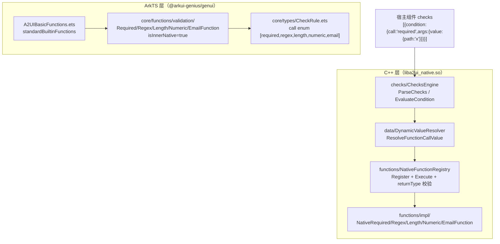
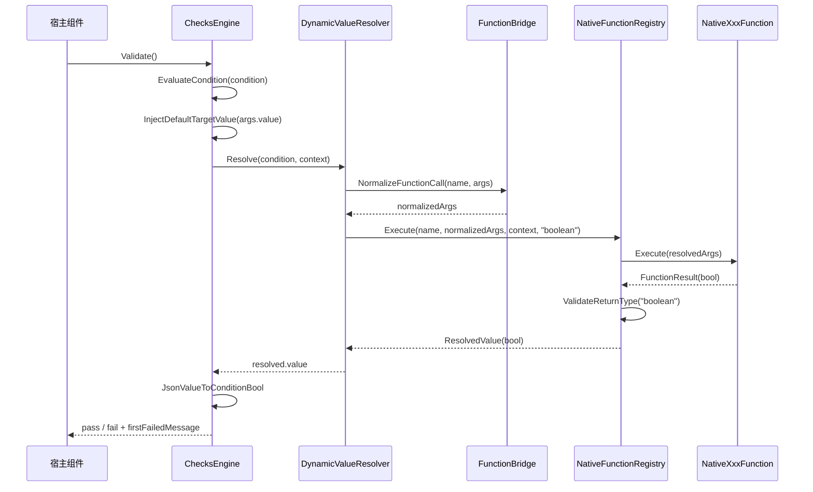

# 架构设计

> 确认目标仓和模块的架构约束、关键设计决策、Spec 拆分方向。

## 设计元数据

| Field | Content |
|-------|---------|
| Design ID | DESIGN-Func-07-04-07 |
| 关联需求 | 已有能力补录（无独立 requirement.md） |
| 关联 Epic | 无 |
| 目标 Feature | Feat-01 required；Feat-02 regex；Feat-03 length；Feat-04 numeric；Feat-05 email |
| 复杂度 | 标准 |
| 目标版本 | A2UI 原生协议 v0.9（`https://a2ui.org/specification/v0_9/catalogs/basic/catalog.json`）+ API Version 20 |
| Owner | GenUI SIG |
| 状态 | Baselined（已有实现补录） |

## 需求基线

> 需求基线详见 proposal.md。以下仅列出设计阶段需要额外强调的要点。

| 项 | 补充说明 |
|----|---------|
| 补录而非新增 | 当前实现即规格，可疑行为只能标注为风险/备注，不做修改 |
| 基准实现声明 | 标准协议校验函数以 A2UIRender 全量渲染引擎（`GenerativeUI/A2UIRender`，`@arkui-genius/genui`）为基准实现 |
| 范围边界 | 本功能域（07-04-07）覆盖 A2UI 标准协议校验函数 `required` / `regex` / `length` / `numeric` / `email`；校验函数的**消费方**（组件 `checks` 失败行为）归 07-04-04（交互组件），CheckRule 类型定义归 07-04-21（动态绑定）共性类型，本设计仅展开函数自身执行语义 |
| 受限用途 | 五个校验函数是 `ChecksEngine` 的「legacy check 函数」（`IsLegacyCheckFunction` 白名单），仅能作为组件 `checks` 数组内 `condition.call` 使用，不能作为 `action.functionCall` 或普通 `DynamicValue` 表达式使用（`ChecksEngine.cpp:31-36,158-164`） |
| 双实现声明 | ArkTS 层仅注册目录项与 schema（`isInnerNative: true`），校验逻辑全部在 C++ 原生实现（`liba2ui_native.so` 内 `NativeFunctionRegistry` 分发） |

## 上下文和现状

### 涉及仓和模块

| 仓库 | 补充架构说明 |
|------|-------------|
| `GenerativeUI/A2UIRender` | 全量渲染引擎。ArkTS 目录注册层（`genui/src/main/ets/core/functions/validation/{Required,Regex,Length,Numeric,Email}Function.ets`、`core/functions/A2UIBasicFunctions.ets`、`core/types/CheckRule.ets`）；C++ 原生实现层（`genui/src/main/cpp/functions/impl/Native{Required,Regex,Length,Numeric,Email}Function.cpp`、`functions/NativeFunctionRegistry.cpp`、`checks/ChecksEngine.cpp`、`data/DynamicValueResolver.cpp`） |
| `GenerativeUI/Docs` | 开发者文档（`reference/functions/validation.md`、`functions/overview.md`、`functions/README.md`），仅理解辅助，契约以 A2UIRender 实现为准 |

> 仓、模块、当前职责、影响类型详见 proposal.md「影响范围」。

### 调用链层级分析

| 层 | 模块 | 职责 | 修改类型 |
|----|------|------|---------|
| 1. 目录注册层（ArkTS） | `validation/RequiredFunction.ets` / `RegexFunction.ets` / `LengthFunction.ets` / `NumericFunction.ets` / `EmailFunction.ets` | 声明函数名（`super('required')` 等）、`isInnerNative: true`、`loadFunctionSchema(version, '<name>.json')` | 现状（基准实现） |
| 2. 函数聚合层（ArkTS） | `A2UIBasicFunctions.ets` | 将五函数纳入 `standardBuiltinFunctions` 列表（`:48-52`），经 `allA2UIBasicFunctions()` 导出目录项 | 现状 |
| 3. 类型契约层（ArkTS） | `core/types/CheckRule.ets` | `A2UICheckRule.schema()` 声明 `condition.call` 枚举 `["required","regex","length","numeric","email"]` 与 `returnType=boolean` | 现状 |
| 4. 校验引擎层（C++） | `checks/ChecksEngine.cpp` | `ParseChecks` 白名单过滤 legacy 函数；`EvaluateCondition` 经 `DynamicValueResolver` 解析 `condition.call` 为布尔 | 现状 |
| 5. 动态值解析层（C++） | `data/DynamicValueResolver.cpp` | `ResolveFunctionCallValue`→`ExecuteBuiltinFunctionCall`（`FunctionBridge::NormalizeFunctionCall` + `NativeFunctionRegistry::Execute`）分发函数调用 | 现状 |
| 6. 原生注册表层（C++） | `functions/NativeFunctionRegistry.cpp` | 构造时 `Register` 五函数；`Execute` 统一异常捕获 + `returnType` 校验 | 现状 |
| 7. 原生函数实现层（C++） | `functions/impl/Native{Required,Regex,Length,Numeric,Email}Function.cpp` | 各自的 `GetName()` / `Execute(const JsonValue&)` 判定逻辑，返回 `FunctionResult(bool)` | 现状 |

检查项：
- [x] 调用链每一层都已覆盖（目录注册 → 函数聚合 → 类型契约 → 校验引擎 → 动态值解析 → 原生注册表 → 原生实现）
- [x] 每层职责边界清晰（ArkTS 只注册契约与 schema，校验逻辑全部下沉 C++ 原生层）
- [x] 每层修改类型明确（均为「现状」，存量补录）

### 适用架构规则

| Rule ID | 适用原因 | 设计结论 | 验证方式 |
|---------|---------|---------|---------|
| OH-ARCH-LAYERING | ArkTS 目录层 → C++ 原生层跨语言调用 | 调用方向自顶向下；ArkTS 不承载校验逻辑，仅注册 `isInnerNative: true` 契约 | 架构评审/依赖检查 |
| OH-ARCH-SUBSYSTEM | 单仓 + 独立 Docs 仓，无跨子系统 | 不引入子系统外依赖 | 依赖检查 |
| OH-ARCH-API-LEVEL | 校验函数以 DSL `condition.call` 暴露，无独立 ArkTS 公共 API / C-API | 无新增权限；Kit `@arkui-genius/genui` | API 评审 |
| OH-ARCH-COMPONENT-BUILD | 现状无 BUILD.gn/bundle.json 变更 | 无构建影响 | 构建验证 |
| OH-ARCH-ERROR-LOG | 校验失败返回布尔 `false`，不产生错误码/schema 告警；`regex` 非法 pattern 仅 `LOG_ERROR` | 失败语义契约详见各 Feat 规则表 | UT |

## 不涉及项承接

> proposal.md 已完成 N/A 判定。本节仅对标记「涉及」且需展开设计的维度给出结论。

| 维度 | 设计结论 |
|------|---------|
| 跨进程/SA | 不涉及（同进程 ArkTS↔C++ 经 NAPI） |
| 持久化 | 不涉及（校验为纯函数，无状态持久化） |
| 权限 | 不涉及 |
| 国际化/RTL | 不涉及（校验逻辑与 locale 无关） |
| 多设备适配 | 校验语义设备无关；断点/主题为控制器状态（07-04-23/24 展开） |
| 范围边界 | 校验函数失败行为（禁用/错误文本等）归 07-04-04；CheckRule 类型共性归 07-04-21；格式化/逻辑函数归 07-04-08/09 |

## 关键设计决策

| 决策 ID | 问题 | 推荐方案 | 探索过的替代方案 | 取舍理由 | 影响 |
|--------|------|---------|----------------|---------|------|
| ADR-1 | 校验函数如何分类与限制用途 | 作为「legacy check 函数」白名单，`ChecksEngine::IsLegacyCheckFunction` 仅认 `required/regex/length/numeric/email`（`ChecksEngine.cpp:31-36`）；`ParseChecks` 对 `condition.call` 非白名单项跳过（`:158-164`） | (a) 任意函数可用于 checks；(b) 独立 CheckRegistry | 与 A2UI v0.9 `CheckRule` 契约对齐，白名单防止任意函数注入校验语义 | checks 只能使用五函数；其余函数走 07-04-08/09 |
| ADR-2 | 校验逻辑放 ArkTS 还是 C++ | ArkTS 仅注册目录项 + schema（`isInnerNative: true`），逻辑全部在 C++ `Native{...}Function::Execute` | (a) ArkTS 实现；(b) 双端各实现一份 | 校验在渲染链路上高频调用，原生实现性能更优；单源真值避免双端漂移 | 五函数需在 `NativeFunctionRegistry.cpp:68-72` 与 `A2UIBasicFunctions.ets:48-52` 双注册保持一致 |
| ADR-3 | 校验失败如何表达 | 返回 `FunctionResult(false)`（布尔 false），**不产生错误码、不发 schema 告警**；失败呈现由消费组件决定（07-04-04 各组件禁用/错误文本） | (a) 返回错误码；(b) 上抛异常 | A2UI v0.9 校验函数定义为返回 `boolean` 的谓词，错误呈现属组件语义 | 校验失败≠schema 告警；`regex` 非法 pattern 仅 `LOG_ERROR` |
| ADR-4 | 参数类型/returnType 如何校验 | `NativeFunctionRegistry::Execute` 先 `FunctionBridge::NormalizeFunctionCall` 按 schema 归一，再校验 `returnType`（`NativeFunctionBase.cpp:27-54`，`boolean`→`IsBool`） | (a) 不校验；(b) 只在 schema 校验 | schema 归一 + 运行时 returnType 双保险，mismatch 返回 `FailFunctionCall("builtin returnType mismatch")` | 校验函数 returnType 必须为 `boolean` |
| ADR-5 | `value` 参数如何确定被校验对象 | 校验函数 `Execute` 读 `args.value`；若 condition 未显式给 `value` 且组件提供 `ChecksDefaultTargetProvider`，`ChecksEngine::InjectDefaultTargetValue` 注入组件当前值（`ChecksEngine.cpp:52-75`） | (a) 必须显式传 value；(b) 不支持缺省 | 支持「校验组件自身当前值」的常用形态，减少 DSL 冗余 | `value` 可为字面量/路径绑定 `{path}`/组件默认值三形态 |
| ADR-6 | regex 匹配语义与非法 pattern 处理 | 用 C++ `std::regex_match`（完整匹配，非 `regex_search` 部分匹配）；非法 pattern 捕获 `std::regex_error` 后 `LOG_ERROR` 并返回 false，**不发 schema 告警 2001**（`NativeRegexFunction.cpp:47-53`） | (a) 部分匹配；(b) 非法 pattern 发 2001 告警 | A2UI v0.9 校验为「完全匹配」；区别于 `TextField.validationRegexp` 的 2001 告警路径（07-04-04） | 非法 pattern 静默判 false，仅日志可见 |

## 设计骨架

### 骨架范围

| 骨架项 | 目标 | 不包含 | 验证方式 |
|--------|------|--------|---------|
| 目录注册 | 固化五函数 ArkTS 注册契约 + schema 载入 | 函数实现逻辑（C++ 层） | ArkTS 单测 |
| 执行语义 | 固化五函数 C++ `Execute` 判定语义（空值/匹配/范围/邮箱格式） | 组件 checks 失败呈现（07-04-04） | C++ UT |
| 失败语义 | 固化布尔 false + 无错误码/告警 + returnType 校验 | 错误码契约（07-04-01） | C++ UT |

### 骨架 Spec 拆分

| Task ID | 目标 | 受影响文件 | AC |
|---------|------|----------|-----|
| TASK-SKELETON-1 | Feat-01 required 校验函数基线 | `RequiredFunction.ets`、`NativeRequiredFunction.cpp/h`、`required.json` | AC-1.1~4.x |
| TASK-SKELETON-2 | Feat-02~05 regex/length/numeric/email 校验函数 | `{Regex,Length,Numeric,Email}Function.ets`、`Native{...}Function.cpp/h`、`*.json` | 各 Feat AC |

## 后续 Task 拆分

| Task ID | 目标 | 受影响文件 | 依赖 |
|---------|------|----------|------|
| T-1 | Feat-01 required 函数（基线，本设计已承接） | `Feat-01-required-validation-spec.md` + 本 design.md | — |
| T-2 | Feat-02 regex 函数 | `NativeRegexFunction.cpp/h`、`RegexFunction.ets`、`regex.json` | T-1 |
| T-3 | Feat-03 length 函数 | `NativeLengthFunction.cpp/h`、`LengthFunction.ets`、`length.json` | T-1 |
| T-4 | Feat-04 numeric 函数 | `NativeNumericFunction.cpp/h`、`NumericFunction.ets`、`numeric.json` | T-1 |
| T-5 | Feat-05 email 函数 | `NativeEmailFunction.cpp/h`、`EmailFunction.ets`、`email.json` | T-1 |

## API 签名、Kit 与权限

> 本节承接 spec.md「API 变更分析」中识别的 API，给出签名、权限和 d.ts 位置等实现细节。

### 新增 API

无新增。五函数均为 A2UI v0.9 DSL 校验函数（存量补录），无独立 ArkTS 公开 API 变更，无 C-API。

### 变更/废弃 API

| 原有 API | 变更类型 | 新 API | 迁移说明 |
|---------|---------|--------|---------|
| `required` / `regex` / `length` / `numeric` / `email`（DSL 校验函数，`condition.call` 字段） | 既有 | — | 经 `A2UIBasicFunctions.standardBuiltinFunctions` 注册，schema 载入 `functions/<name>.json` |

> d.ts 位置：函数 schema 位于 `genui/src/main/resources/rawfile/schema/A2UI/v0.9/functions/*.json`（ArkTS 源即契约，无独立 SDK `.d.ts`）。Kit：`@arkui-genius/genui`；权限：无；SysCap：不适用。

## 构建系统影响

### BUILD.gn 变更

无变更（存量补录）。`genui/src/main/cpp/` 已纳入现有 `liba2ui_native.so` 构建目标。

### bundle.json 变更

无变更。

## 可选设计扩展

### 架构图



### 数据流/控制流

| 步骤 | 调用方 | 被调用方 | 数据/接口 | 说明 |
|------|--------|---------|----------|------|
| 1 | 宿主组件 | `ChecksEngine::ParseChecks` | `checks` 数组 | 白名单过滤 legacy 函数 |
| 2 | `ChecksEngine` | `ChecksEngine::EvaluateCondition` | `conditionValue` | 注入默认 value + 解析 |
| 3 | `ChecksEngine` | `DynamicValueResolver::Resolve` | `{renderId,surfaceId,componentId}` | 解析 `call`/`args` |
| 4 | `DynamicValueResolver` | `FunctionBridge::NormalizeFunctionCall` | `FunctionCallInfo` | 按 schema 归一 args |
| 5 | `DynamicValueResolver` | `NativeFunctionRegistry::Execute` | `(name,args,context,returnType)` | 分发 + 异常捕获 + returnType 校验 |
| 6 | `NativeFunctionRegistry` | `Native{...}Function::Execute` | `resolvedArgs` | 具体校验逻辑，返回 `FunctionResult(bool)` |
| 7 | `ChecksEngine` | `ChecksEngine::Validate` | `bool + firstFailedMessage` | 回填失败消息给组件 |

### 时序设计



### 数据模型设计

**API 层（ArkTS，目录注册契约）**

```typescript
// ets/core/functions/validation/RequiredFunction.ets（其余四函数结构一致）
export class RequiredFunction extends BuiltinFunctionBase {
  constructor() { super('required'); }
  public override asFunctionItem(): InnerFunctionItem {
    return { name: 'required', isInnerNative: true, schemaProvider: this.schemaProvider(), functionCall: undefined };
  }
  protected override schemaProvider(): SchemaProvider {
    return (version: string) => this.loadFunctionSchema(version, 'required.json');
  }
}
// ets/core/types/CheckRule.ets — 校验规则类型（条件为函数调用）
//   condition.call enum: ["required","regex","length","numeric","email"]
//   condition.returnType enum: ["boolean"]（default "boolean"）
//   required: ["condition","message"]
```

**Framework 层（C++，原生实现状态）**

```cpp
// functions/NativeFunctionBase.h — 抽象基类
virtual std::string GetName() const = 0;
virtual FunctionResult Execute(const JsonValue& resolvedArgs) = 0;

// functions/FunctionResult.h — 布尔结果载体
FunctionResult(bool value);       // BOOL 类型，ToJsonLiteral → "true"/"false"

// checks/ChecksEngine.h — 校验规则运行时结构
struct CheckRule { JsonValue conditionValue; std::string message; };
std::vector<CheckRule> checks_;
std::unordered_set<std::string> bindingPaths_;
```

| 结构 | 存储方案 | 生命周期 |
|------|---------|---------|
| `ChecksEngine::checks_` | `vector<CheckRule>` | `ParseChecks` 重建 |
| `CheckRule::conditionValue` | `JsonValue`（克隆） | 校验期只读 |
| `FunctionResult::boolValue_` | `bool` | 每次 `Execute` 返回 |
| `NativeFunctionRegistry::handlers_` | `map<string, shared_ptr<NativeFunctionBase>>` | 单例构造期注册 |

### 算法与状态机

校验函数为无状态纯函数，无并发状态机。核心判定分支：

```text
required:  args 非对象 → false
           value 无效 → false
           value null → false；string → 非空；array → size>0；object → 有子节点；其它标量 → true

regex:     args 非对象 → false
           value/pattern 非 string → false；pattern 空 → false
           std::regex_match(value, pattern) 全匹配；std::regex_error → LOG_ERROR + false

length:    args 非对象 → false；value 非 string → false
           min/max 都缺 → false
           min/max 非 number 或非有限或超出 int32 → false；len<min 或 len>max → false

numeric:   args 非对象 → false；value 非 number → false；value 非有限 → false
           min/max 都缺 → false
           min/max 非 number 或非有限 → false；value<min 或 value>max → false

email:     args 非对象 → false；value 非 string → false；value 空 → false
           std::regex_match(value, EMAIL_PATTERN)
```

### 测试性设计

| 测试层级 | 测试目标 | Mock 策略 | 验证方式 |
|---------|---------|----------|---------|
| C++ UT | `NativeRequiredFunction::IsPresent` 各类型空值判定 | 直接构造 JsonValue | `genui/src/test/cpp/` |
| C++ UT | `NativeRegexFunction::Execute` 全匹配/非法 pattern | — | `genui/src/test/cpp/` |
| C++ UT | `NativeLengthFunction::Execute` min/max 边界与非法参数 | — | `genui/src/test/cpp/` |
| C++ UT | `NativeNumericFunction::Execute` 非 number/非有限/范围 | — | `genui/src/test/cpp/` |
| C++ UT | `NativeEmailFunction::Execute` 邮箱格式 | — | `genui/src/test/cpp/` |
| ArkTS 单测 | 目录注册 + schema 载入 | — | `genui/src/test/` |
| ohosTest | checks 端到端校验（组件禁用/错误文本） | — | `entry/src/ohosTest/` |

### 资源所有权矩阵

| 资源 | 创建方 | 持有方 | 销毁触发 | 实际释放 | 异常回收 |
|------|--------|--------|---------|---------|---------|
| `NativeRequiredFunction` 等 | `NativeFunctionRegistry` 构造 | `handlers_`（`shared_ptr`） | 进程退出 | 单例析构 | — |
| `CheckRule::conditionValue` | `ChecksEngine::ParseChecks` | `checks_`（vector） | `ParseChecks` 重建 | 随 vector 清空 | — |
| `FunctionResult` | 各 `Execute` | 栈 | 返回后 | 值语义销毁 | — |
| `JsonAdapter`（normalizedArgs） | `NormalizeFunctionCall` | `ExecuteBuiltinFunctionCall` 栈 | 调用结束 | RAII | — |

### 接口参数规约

| 接口 | 参数 | 类型 | 合法范围 | 非法处理 | 边界说明 |
|------|------|------|---------|---------|---------|
| required | value | any | 非 null/非空 string/非空 array/非空 object | null/空→false | 标量非 null 恒 true |
| regex | value | string | 任意字符串 | 非 string→false | 全匹配 |
| regex | pattern | string | 合法正则（ECMAScript 子集） | 空/非法→false（LOG_ERROR） | 非法不发 2001 |
| length | value | string | 任意字符串 | 非 string→false | 长度按字节数 `size()` |
| length | min/max | integer | ≥0，int32 范围，有限 | 非 number/越界→false | 边界含，至少给其一 |
| numeric | value | number | 有限数 | 非 number/非有限→false | string "123"→false |
| numeric | min/max | number | 有限数 | 非 number/非有限→false | 边界含，至少给其一 |
| email | value | string | 符合 `EMAIL_PATTERN` | 空/非 string/不匹配→false | 简化 RFC 5322 子集 |

### 线程与并发模型

| 操作 | 发起线程 | 回调线程 | 跨进程边界 | 线程安全 | 重入约束 |
|------|---------|---------|----------|---------|---------|
| checks 校验 | UI | UI | 无 | 单线程 UI | 无状态，可重入 |
| `NativeFunctionRegistry::Execute` | UI | UI | 无 | 只读 map，单线程 | — |
| `ChecksEngine::Validate` | UI | UI | 无 | 单线程 UI | — |

## 详细设计

### required 非空判定

`NativeRequiredFunction::Execute`（`NativeRequiredFunction.cpp:27-41`）：args 非对象打 `LOG_WARN "args is empty"` 并返回 false；取 `args.value`，无效返回 false；`IsPresent`（`:43-58`）按类型分派：null/invalid→false，string→`!GetStringValue("").empty()`，array→`GetArraySize()>0`，object→`GetChild().IsValid()`，其余标量（number/bool）→true。ArkTS 注册 `name='required'`、`isInnerNative=true`、schema `required.json`（`RequiredFunction.ets:22,28,35`）。

### regex 全匹配

`NativeRegexFunction::Execute`（`NativeRegexFunction.cpp:29-55`）：args 非对象或 `value`/`pattern` 非 string 或 pattern 空→false；`std::regex re(pattern)` + `std::regex_match`（完整匹配）；`std::regex_error` 捕获后 `LOG_ERROR "invalid regex pattern"` 并返回 false。与 `TextField.validationRegexp` 的 2001 schema 告警路径相区别（见 ADR-6）。

### length 范围校验

`NativeLengthFunction::Execute`（`NativeLengthFunction.cpp:29-83`）：value 非 string→false；`len = value.size()` 转 int32；min/max 均缺→false；min/max 需为 number 且有限且落在 int32 范围，越界→false；`len<min` 或 `len>max`→false。边界含（`min<=len<=max`）。

### numeric 范围校验

`NativeNumericFunction::Execute`（`NativeNumericFunction.cpp:28-80`）：value 非 number 或非有限（NaN/Inf）→false；min/max 均缺→false；min/max 需为 number 且有限，`value<min`/`value>max`→false。注意 value 必须是 JSON number，数字字符串 `"123"` 判 false。

### email 格式校验

`NativeEmailFunction::Execute`（`NativeEmailFunction.cpp:35-55`）：value 非 string 或空→false；对 `EMAIL_PATTERN`（`:24-26`，local-part 允许 `[a-zA-Z0-9.!#$%&'*+/=?^_\`{|}~-]+`，domain 为标准标签）做 `std::regex_match`。该 pattern 为 RFC 5322 的**简化子集**（不支持带引号 local-part / 域名字面量），与 Docs「RFC 5322 兼容」表述存在偏差（见 RISK-3）。

### checks 集成与失败语义

`ChecksEngine::ParseChecks`（`ChecksEngine.cpp:134-170`）白名单过滤：`condition.call` 非 `required/regex/length/numeric/email` 之一时打 WARN 并跳过（`:158-164`）；`message` 缺省 `CHECK_DEFAULT_MESSAGE="Invalid value"`（`:29,167`）。`Validate`（`:172-183`）逐个校验，首个失败即返回 false 并回填 `firstFailedMessage`。`EvaluateCondition`（`:207-235`）经 `InjectDefaultTargetValue`（`:52-75`）补全缺省 value，再 `DynamicValueResolver::Resolve` 解析为布尔。`ExecuteBuiltinFunctionCall`（`DynamicValueResolver.cpp:817-836`）先 `NormalizeFunctionCall` 再 `NativeFunctionRegistry::Execute`，后者统一异常捕获（`NativeFunctionRegistry.cpp:119-128`）并校验 `returnType`（`NativeFunctionBase.cpp:27-54`）。

## 风险和开放问题

| 项 | 类型 | 影响 | 处理方式 | Owner |
|----|------|------|---------|-------|
| RISK-1 校验函数 ArkTS 目录注册（`A2UIBasicFunctions.ets:48-52`）与 C++ registry（`NativeFunctionRegistry.cpp:68-72`）双注册，需手动同步 | 架构 | 中 | design ADR-2 标注；各 Feat 注册 AC 覆盖 | GenUI SIG |
| RISK-2 `regex` 非法 pattern 仅 `LOG_ERROR` 不发 schema 告警，与 `TextField.validationRegexp` 的 2001 告警语义不一致，易混淆 | API | 中 | design ADR-3/ADR-6 标注；Feat-02 规则表显式标注 | GenUI SIG |
| RISK-3 `email` 的 `EMAIL_PATTERN` 为简化子集，Docs 宣称「RFC 5322 兼容」与实际正则不符（不支持 quoted local-part 等） | API | 低 | Feat-05 兼容/风险表标注 | GenUI SIG |
| RISK-4 `length` 的 `len=value.size()` 转 int32，超大字符串（>2^31 字节）理论上溢出，未显式防护 | 边界 | 低 | Feat-03 规则表标注 | GenUI SIG |
| RISK-5 `numeric` value 必须是 JSON number，数字字符串 `"123"` 判 false，与用户直觉可能不符 | 边界 | 低 | Feat-04 规则表标注 | GenUI SIG |

## 设计审批

- [x] 需求基线已确认，设计覆盖 P0/P1 AC
- [x] 不涉及项已承接，N/A 和展开项都有结论
- [x] 涉及仓和模块职责清楚
- [x] 调用链层级分析完整，每层覆盖到位
- [x] 适用架构规则已识别并形成设计结论
- [x] 分层和子系统边界合规
- [x] API 变更有签名、权限、错误码和兼容性说明
- [x] BUILD.gn/bundle.json 影响明确
- [x] 设计输出和后续 Task 拆分明确
- [x] 关键设计决策有理由和影响说明
- [x] 风险和开放问题有 Owner

**结论:** 通过（已有实现补录）
