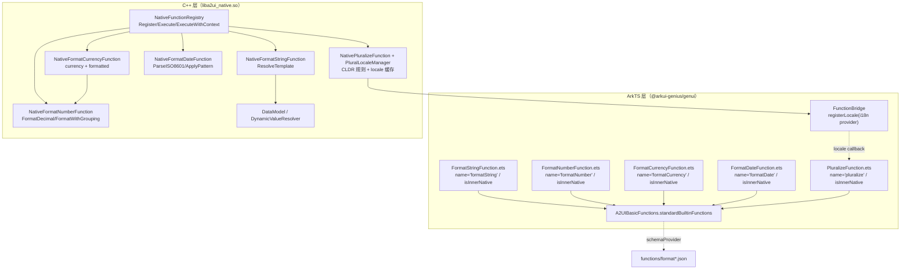
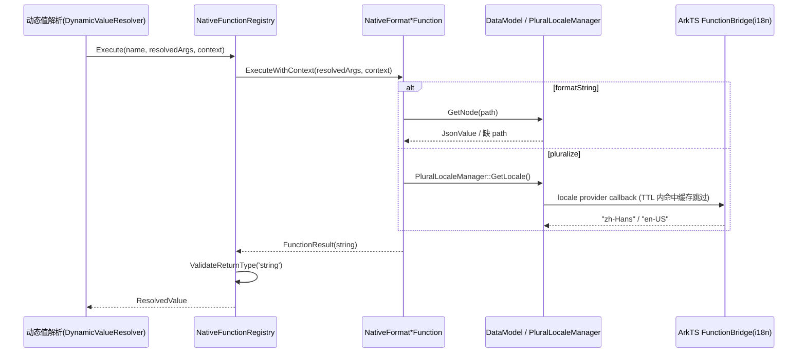

# 架构设计

> 确认目标仓和模块的架构约束、关键设计决策、Spec 拆分方向。

## 设计元数据

| Field | Content |
|-------|---------|
| Design ID | DESIGN-Func-07-04-08 |
| 关联需求 | 已有能力补录（无独立 requirement.md） |
| 关联 Epic | 无 |
| 目标 Feature | Feat-01 formatString 函数（基线）；Feat-02 formatNumber 函数；Feat-03 formatCurrency 函数；Feat-04 formatDate 函数；Feat-05 pluralize 函数 |
| 复杂度 | 标准 |
| 目标版本 | A2UI 原生协议 v0.9（`https://a2ui.org/specification/v0_9/catalogs/basic/catalog.json`） |
| Owner | GenUI SIG |
| 状态 | Baselined（已有实现补录） |

## 需求基线

> 需求基线详见 proposal.md。以下仅列出设计阶段需要额外强调的要点。

| 项 | 补充说明 |
|----|---------|
| 补录而非新增 | 当前实现即规格，可疑行为只能标注为风险/备注 |
| 基准实现声明 | 格式化函数域以 A2UIRender 全量渲染引擎（`GenerativeUI/A2UIRender`，`@arkui-genius/genui`）为基准实现 |
| 范围边界 | 本功能域（07-04-08）覆盖五个标准协议格式化函数 formatString / formatNumber / formatCurrency / formatDate / pluralize；校验函数（required/regex/length/numeric/email）归 07-04-07，逻辑与系统函数（and/or/not）归 07-04-09，扩展函数归 07-04-16，动态数据绑定归 07-04-21 |
| 函数三件套 | 每个函数由三层落地：ArkTS 目录项注册（`Format*.ets` 标记 `isInnerNative=true`）→ JSON Schema 声明（`functions/format*.json`）→ C++ 原生实现（`NativeFormat*Function.{h,cpp}`） |
| 返回约定 | 五个函数均返回 string 类型；任何非法入参（类型错误/空串/越界/非有限值）统一返回空字符串 `""`，不抛异常、不返回错误码 |

## 上下文和现状

### 涉及仓和模块

| 仓库 | 补充架构说明 |
|------|-------------|
| `GenerativeUI/A2UIRender` | 全量渲染引擎。ArkTS 层 `ets/core/functions/format/Format*.ets`、`ets/core/functions/A2UIBasicFunctions.ets` 完成函数目录项注册；C++ 层 `cpp/functions/impl/NativeFormat*Function.cpp` + `cpp/functions/NativeFunctionRegistry.cpp` 提供原生执行与分发；`cpp/functions/NativePluralizeFunction.{h,cpp}` 提供 locale 提供者桥接 |
| `GenerativeUI/Docs` | 开发者文档（`reference/functions/format.md`），仅作理解辅助，契约以 A2UIRender 实现为准 |

> 仓、模块、当前职责、影响类型详见 proposal.md「影响范围」。

### 调用链层级分析

| 层 | 模块 | 职责 | 修改类型 |
|----|------|------|---------|
| 1. 函数注册层（ArkTS） | `ets/core/functions/format/FormatStringFunction.ets`、`FormatNumberFunction.ets`、`FormatCurrencyFunction.ets`、`FormatDateFunction.ets`、`PluralizeFunction.ets`、`A2UIBasicFunctions.ets` | 声明函数 name、`isInnerNative=true`、schemaProvider，聚合进 `standardBuiltinFunctions` | 现状（基准实现） |
| 2. Schema 声明层 | `resources/rawfile/schema/A2UI/v0.9/functions/formatString.json`、`formatNumber.json`、`formatCurrency.json`、`formatDate.json`、`pluralize.json` | 声明 args 属性/required 键/returnType | 现状 |
| 3. NAPI 桥接层（ArkTS） | `ets/core/functions/FunctionBridge.ets` | 安装 `registerLocale` 回调（pluralize 依赖系统 locale） | 现状 |
| 4. 函数分发层（C++） | `cpp/functions/NativeFunctionRegistry.{h,cpp}`、`NativeFunctionBase.{h,cpp}` | `Execute` → `ExecuteWithContext` 分发、异常捕获、返回类型校验 | 现状 |
| 5. 函数实现层（C++） | `cpp/functions/impl/NativeFormatStringFunction.cpp`、`NativeFormatNumberFunction.cpp`、`NativeFormatCurrencyFunction.cpp`、`NativeFormatDateFunction.cpp`、`NativePluralizeFunction.cpp` | 各函数格式化逻辑、参数解析、CLDR 复数规则 | 现状 |
| 6. 数据模型/上下文层（C++） | `cpp/data/DataModel.h`、`cpp/data/DynamicValueResolver.{h,cpp}`、`PluralLocaleManager` | formatString 数据路径解析、缺 path 上报、locale 提供者缓存 | 现状 |

检查项：
- [x] 调用链每一层都已覆盖（函数注册→Schema→NAPI→函数分发→函数实现→数据模型/locale）
- [x] 每层职责边界清晰（ArkTS 负责注册与 schema 声明，C++ 负责执行、格式化与 locale 缓存）
- [x] 每层修改类型明确（均为「现状」，存量补录）

### 适用架构规则

| Rule ID | 适用原因 | 设计结论 | 验证方式 |
|---------|---------|---------|---------|
| OH-ARCH-LAYERING | ArkTS 目录注册 → NAPI → C++ 函数分发/实现 多层调用 | 调用方向自顶向下；`NativeFunctionRegistry::Execute` 经 `ExecuteWithContext` 分发到具体函数实现 | 架构评审/依赖检查 |
| OH-ARCH-SUBSYSTEM | 单仓 + 独立 Docs 仓，无跨子系统 | 不引入子系统外依赖；locale 经 ArkTS `@kit.LocalizationKit` i18n 回传 | 依赖检查 |
| OH-ARCH-API-LEVEL | 无新增/变更 Public/System API，函数经内部 `InnerFunctionItem` 注册 | 内部 API（isInnerNative），无新增权限/SysCap | API 评审 |
| OH-ARCH-COMPONENT-BUILD | 现状无 BUILD.gn/bundle.json 变更 | 无构建影响 | 构建验证 |
| OH-ARCH-ERROR-LOG | 非法入参统一返回空串，缺失数据路径经 `ReportMissingPath` 上报 | 不抛异常；缺 path 走 `DynamicValueResolver::ReportMissingPath` | UT/hilog |

## 不涉及项承接

> proposal.md 已完成 N/A 判定。本节仅对标记「涉及」且需展开设计的维度给出结论。

| 维度 | 设计结论 |
|------|---------|
| 跨进程/SA | 不涉及（同进程 ArkTS↔C++ 经 NAPI） |
| 持久化 | 不涉及（格式化结果仅内存态） |
| 权限 | 不涉及 |
| 国际化/RTL | 部分涉及：pluralize 依赖系统 locale 选择复数类别；formatDate 月/周名称硬编码英文、不随 locale 本地化（RISK）；number/currency 千分位与小数点硬编码（`,`/`.`），不随 locale 本地化 |
| 多设备适配 | 函数语义设备无关；locale 仅影响 pluralize 类别选择 |
| 范围边界 | 校验函数归 07-04-07；逻辑与系统函数归 07-04-09；扩展函数归 07-04-16；动态数据绑定归 07-04-21 |

## 关键设计决策

| 决策 ID | 问题 | 推荐方案 | 探索过的替代方案 | 取舍理由 | 影响 |
|--------|------|---------|----------------|---------|------|
| ADR-1 | 格式化函数如何落地 | ArkTS `BuiltinFunctionBase` 子类声明 `isInnerNative=true`（无本地 handler），C++ `NativeFunctionRegistry` 注册 `NativeFormat*Function` 实现 `Execute`/`ExecuteWithContext` | (a) 纯 ArkTS 实现；(b) 独立 C-API | 渲染与数据模型在 C++，格式化下沉 native 复用 JsonValue/DataModel；ArkTS 仅声明 schema | 调用经 `ExecuteWithContext` 统一分发 |
| ADR-2 | formatString 模板解析放哪层 | C++ `ResolveTemplate` 运行时解析 `${expr}`（数据路径或函数调用），支持 `\${` 逃逸、嵌套 `${}` 参数 | (a) 复用 JS 模板引擎；(b) 预编译模板 | 协议自定义占位符语法需与 A2UI 数据模型耦合，运行时解析避免引入 JS 引擎 | 非 JS 模板语义，详见 Feat-01 |
| ADR-3 | number/currency 舍入与分组实现 | 手写 `FormatDecimal`（`std::round(value*10^n)/10^n` + `std::fixed` + `setprecision`）；`FormatWithGrouping` 千分位逗号分组；decimals 上限 20、取绝对值 | (a) ICU/Intl 库；(b) `printf` 格式串 | 不引入 ICU 依赖；decimals 边界可控 | 与 locale 无关，硬编码逗号/小数点（RISK-3） |
| ADR-4 | currency 如何输出 | 输出 `"{currency} {formatted}"`，不校验 ISO 4217、不按 locale 映射符号/位置 | (a) ISO 校验 + 符号映射；(b) 按 locale 定位符号 | 契约仅要求货币代码前缀；实现最简 | 货币符号硬编码前置 + 空格（RISK-4） |
| ADR-5 | formatDate 模式如何解析 | 手写 TR35 模式子集（y/M/d/E/H/h/m/s/a），run-length 扫描 + `PatternTokenHandler` 表分发，字面量原样输出 | (a) ICU 日期格式化；(b) 全量 TR35 | 只覆盖 A2UI 契约所需 token；避免 ICU 依赖 | 月/周名称硬编码英文（RISK-5） |
| ADR-6 | pluralize CLDR 规则如何落地 | 硬编码 `PLURAL_RULE_MAPPINGS`（语言→规则函数表）+ `GetLanguagePrefix` 提取语言；locale 由 ArkTS i18n provider 回调提供，`CACHE_TTL_MS=1000` 缓存 | (a) 运行时加载 CLDR 数据；(b) 全量语言规则 | 覆盖常用语言族；缓存降低跨语言回调频率 | 未命中语言回退 one/other 规则 |
| ADR-7 | 非法入参如何统一处理 | 各函数 `Execute` 开头判对象/类型/空串，非法返回 `FunctionResult("")`；缺数据路径经 `ReportMissingPath` | (a) 返回错误码；(b) 抛异常 | 与 FunctionResult 字符串类型对齐；宿主侧无错误码语义 | 非法入参无显式错误码（RISK-6） |

## 设计骨架

### 骨架范围

| 骨架项 | 目标 | 不包含 | 验证方式 |
|--------|------|--------|---------|
| formatString | 固化 `${path}`/`${func()}` 模板插值、`\${` 逃逸、缺 path 上报 | 校验/逻辑/扩展函数语义 | C++ UT |
| formatNumber | 固化 decimals（默认 2、上限 20、取绝对值）、grouping 千分位 | locale 本地化 | C++ UT |
| formatCurrency | 固化 `{currency} {formatted}` 输出、复用 number 分组 | ISO 校验/符号映射 | C++ UT |
| formatDate | 固化 TR35 模式子集 + ISO 8601 解析 | 全量 TR35/本地化月名 | C++ UT |
| pluralize | 固化 CLDR 语言族规则 + locale 缓存 + other 回退 | 全量语言规则 | C++ UT |

### 骨架 Spec 拆分

| Task ID | 目标 | 受影响文件 | AC |
|---------|------|----------|-----|
| TASK-SKELETON-1 | Feat-01 formatString 函数基线 | `FormatStringFunction.ets`、`NativeFormatStringFunction.{h,cpp}` | 各 Feat AC |
| TASK-SKELETON-2 | Feat-02 formatNumber 函数 | `FormatNumberFunction.ets`、`NativeFormatNumberFunction.{h,cpp}` | 各 Feat AC |
| TASK-SKELETON-3 | Feat-03 formatCurrency 函数 | `FormatCurrencyFunction.ets`、`NativeFormatCurrencyFunction.{h,cpp}` | 各 Feat AC |
| TASK-SKELETON-4 | Feat-04 formatDate 函数 | `FormatDateFunction.ets`、`NativeFormatDateFunction.{h,cpp}` | 各 Feat AC |
| TASK-SKELETON-5 | Feat-05 pluralize 函数 | `PluralizeFunction.ets`、`NativePluralizeFunction.{h,cpp}`、`FunctionBridge.ets` | 各 Feat AC |

## 后续 Task 拆分

| Task ID | 目标 | 受影响文件 | 依赖 |
|---------|------|----------|------|
| T-1 | Feat-01 formatString 函数（基线，本设计已承接） | `Feat-01-formatstring-function-spec.md` + 本 design.md | — |
| T-2 | Feat-02 formatNumber 函数 | `Feat-02-formatnumber-function-spec.md` | T-1 |
| T-3 | Feat-03 formatCurrency 函数 | `Feat-03-formatcurrency-function-spec.md` | T-2 |
| T-4 | Feat-04 formatDate 函数 | `Feat-04-formatdate-function-spec.md` | T-1 |
| T-5 | Feat-05 pluralize 函数 | `Feat-05-pluralize-function-spec.md` | T-1 |

## API 签名、Kit 与权限

> 本节承接 spec.md「API 变更分析」中识别的 API，给出签名、权限和 d.ts 位置等实现细节。

### 新增 API

无新增。本特性覆盖既有函数目录注册（存量补录），函数经内部 `InnerFunctionItem` 注册（`isInnerNative=true`），不暴露为宿主可直接调用的 Public API。

### 变更/废弃 API

| 原有 API | 变更类型 | 新 API | 迁移说明 |
|---------|---------|--------|---------|
| `formatStringFunction.asFunctionItem()` | 既有 | — | 内部函数目录项，`name='formatString'`、`isInnerNative=true` |
| `formatNumberFunction.asFunctionItem()` | 既有 | — | `name='formatNumber'` |
| `formatCurrencyFunction.asFunctionItem()` | 既有 | — | `name='formatCurrency'` |
| `formatDateFunction.asFunctionItem()` | 既有 | — | `name='formatDate'` |
| `pluralizeFunction.asFunctionItem()` | 既有 | — | `name='pluralize'` |

> d.ts 位置：`genui/src/main/ets/core/functions/format/*.ets`（ArkTS 源即契约，无独立 SDK `.d.ts`）。Kit：`@arkui-genius/genui`；权限：无；SysCap：不适用。

## 构建系统影响

### BUILD.gn 变更

无变更（存量补录）。`genui/src/main/cpp/functions/impl/` 与 `genui/src/main/cpp/functions/NativeFunctionRegistry.cpp` 已纳入现有 `liba2ui_native.so` 构建目标。

### bundle.json 变更

无变更。

## 可选设计扩展

### 架构图



### 数据流/控制流

| 步骤 | 调用方 | 被调用方 | 数据/接口 | 说明 |
|------|--------|---------|----------|------|
| 1 | `CatalogImpl` | `Format*.asFunctionItem()` | `InnerFunctionItem` | 函数目录项注册 |
| 2 | 动态值解析 | `NativeFunctionRegistry::Execute(name, args, context)` | `ResolvedValue` | 函数调用入口 |
| 3 | `NativeFunctionRegistry` | `ExecuteWithContext(resolvedArgs, context)` | `FunctionResult` | 默认回落到 `Execute` |
| 4 | `NativeFormatStringFunction` | `ResolveTemplate` / `ResolveDataPathExpression` | `DataModel::GetNode` | 模板插值与数据路径 |
| 5 | `NativeFormatCurrencyFunction` | `NativeFormatNumberFunction::FormatWithGrouping` | string | 复用分组 |
| 6 | `NativePluralizeFunction` | `PluralLocaleManager::GetLocale` | locale string | 经 NAPI 回调 ArkTS |

### 时序设计



### 数据模型设计

**API 层（ArkTS，内部目录项）**

```typescript
// ets/core/functions/format/FormatStringFunction.ets（其余函数结构同构）
class FormatStringFunction extends BuiltinFunctionBase {
  constructor() { super('formatString'); }
  public override asFunctionItem(): InnerFunctionItem {
    return { name: 'formatString', isInnerNative: true, schemaProvider: this.schemaProvider(), functionCall: undefined };
  }
  protected override schemaProvider(): SchemaProvider {
    return (version: string) => this.loadFunctionSchema(version, 'formatString.json');
  }
}
```

**Framework 层（C++）**

```cpp
// cpp/functions/NativeFormatDateFunction.h
struct DateTimeParts { int year = 0; int month = 1; int day = 1; int hour = 0; int minute = 0; int second = 0; };

// cpp/functions/NativePluralizeFunction.h
class PluralLocaleManager {
  napi_env env_ = nullptr; napi_ref providerRef_ = nullptr;
  std::string cachedLocale_ = "en";
  static constexpr int64_t CACHE_TTL_MS = 1000;
};
```

| 结构 | 存储方案 | 生命周期 |
|------|---------|---------|
| `NativeFunctionRegistry::handlers_` | `unordered_map<string, shared_ptr<NativeFunctionBase>>` | 静态单例注册 |
| `PluralLocaleManager::cachedLocale_` | `std::string`，默认 `"en"` | `SetLocale`/provider 回调更新，TTL 1000ms 缓存 |
| `DateTimeParts` | 栈上值类型 | `ParseISO8601` 填充 |

### 测试性设计

| 测试层级 | 测试目标 | Mock 策略 | 验证方式 |
|---------|---------|----------|---------|
| C++ UT | `NativeFormatNumberFunction::FormatDecimal/FormatWithGrouping` | 直接测纯函数 | `genui/src/test/cpp/` |
| C++ UT | `NativeFormatDateFunction::ParseISO8601/ApplyPattern` | 直接测纯函数 | `genui/src/test/cpp/` |
| C++ UT | `NativeFormatStringFunction::ResolveTemplate` | Mock DataModel | `genui/src/test/cpp/` |
| C++ UT | `NativePluralizeFunction` 复数规则族 | 直接调规则函数 | `genui/src/test/cpp/` |
| ohosTest | 五函数经 DSL `FunctionCall` 端到端 | `entry/src/ohosTest/` | UI dump 文本断言 |

### 接口参数规约

| 接口 | 参数 | 类型 | 合法范围 | 非法处理 | 边界说明 |
|------|------|------|---------|---------|---------|
| formatString | value | string | 非空模板串 | 非 string → `""` | `${...}` 占位符 |
| formatNumber | value | number | 任意有限数值 | 非 number → `""` | — |
| formatNumber | decimals | number | 缺省→2；`\|x\|<=20` 取整 | 非 number/非有限/越界 → `""` | 负值取绝对值 |
| formatNumber | grouping | boolean | 缺省→false | 非 bool → `""` | 千分位逗号 |
| formatCurrency | currency | string | 非空字符串 | 非 string/空 → `""` | 不校验 ISO 4217 |
| formatDate | value | string | ISO 8601（`YYYY-MM-DD[THH:MM:SS]`） | 非法/空 → `""` | 最短 10 字符 |
| formatDate | format | string | 非空 TR35 模式 | 非 string/空 → `""` | 字面量原样输出 |
| pluralize | value | number | 任意数值 | 非 number → `""` | — |
| pluralize | zero/one/two/few/many/other | string | 可选；非 string 存在则非法 | 存在但非 string → `""` | 缺类别回退 other |

### 线程与并发模型

| 操作 | 发起线程 | 回调线程 | 跨进程边界 | 线程安全 | 重入约束 |
|------|---------|---------|----------|---------|---------|
| 函数 Execute | UI | UI | 无 | 单线程 UI | 处理中不可销毁 |
| locale provider 回调 | C++ → ArkTS | UI | 无（NAPI 同步） | 单线程 | 仅 pluralize 触发 |

## 详细设计

### formatString 模板解析（Feat-01）

`FormatStringFunction.ets:20-39` 注册 `name='formatString'`、`isInnerNative=true`、schema `formatString.json`。`NativeFormatStringFunction::Execute`（`NativeFormatStringFunction.cpp:120-132`）仅做类型校验后原样返回 value（不做插值）；`ExecuteWithContext`（`:134-149`）调用 `ResolveTemplate`（`:167-210`）逐字符扫描：遇 `\${` 逃逸输出字面 `${`（`:174-179`）；非 `${` 字符原样输出（`:181-185`）；`${` 后经 `FindMatchingBrace`（`:151-165`）匹配闭合括号，expr 含 `(` 且以 `)` 结尾走 `ResolveFunctionCall`（`:311-329`），否则走 `ResolveDataPathExpression`（`:331-349`）。未闭合 `${` 原样输出（`:187-191`）。数据路径缺前缀 `/` 自动补（`:340-342`），缺 path 经 `ReportMissingPath` 上报并返回 `""`（`:344-347`）。

### formatNumber 数值格式化（Feat-02）

`FormatNumberFunction.ets:20-39` 注册。`NativeFormatNumberFunction::Execute`（`:53-88`）：value 非 number 返回 `""`；`decimals` 缺省 2（`:65`），`ParseDecimals`（`:29-44`）非 number 或非有限或 `|x|>20` 返回 `""`，否则 `decimals=|x|` 取整；`grouping` 缺省 false（`:71`），非 bool 返回 `""`。`FormatDecimal`（`:90-98`）`std::round(value*10^n)/10^n` 后 `std::fixed`+`setprecision(decimals)`；`FormatWithGrouping`（`:100-129`）取绝对值分组，从右往左每 3 位插逗号，负数补 `-` 前缀。

### formatCurrency 货币格式化（Feat-03）

`FormatCurrencyFunction.ets:20-39` 注册。`NativeFormatCurrencyFunction::Execute`（`:55-99`）：value 非 number 或 currency 非 string 返回 `""`；currency 空返回 `""`（`:69-71`）；decimals/grouping 解析同 formatNumber（`:73-86`）。grouping 为 true 时复用 `NativeFormatNumberFunction::FormatWithGrouping`（`:90`）；为 false 时 `std::fixed`+`setprecision(decimals)` 直接输出（`:92-94`，与 grouping 路径的 `std::round` 舍入方式不一致，见 RISK-7）。结果拼装 `currency + " " + formatted`（`:97`）。

### formatDate 日期模式格式化（Feat-04）

`FormatDateFunction.ets:20-39` 注册。`NativeFormatDateFunction::Execute`（`:171-196`）：value/format 非 string 或空返回 `""`；`ParseISO8601`（`:198-239`）要求长度 ≥10、`iso[4]=='-'&&iso[7]=='-'`，解析年月日，可选 `T` 后时间（`>=19` 解析时分秒、`>=16` 解析时分）；`ApplyPattern`（`:241-261`）run-length 扫描模式串，命中 `PATTERN_TOKEN_HANDLERS`（`:145-147`）的 token（y/M/d/E/H/h/m/s/a）调对应 formatter，否则 `AppendLiteral`（`:159-164`）原样输出。月/周名称硬编码英文数组（`:26-34`）。

### pluralize CLDR 复数（Feat-05）

`PluralizeFunction.ets:20-39` 注册。`NativePluralizeFunction::Execute`（`:603-629`）：value 非 number 返回 `""`；`ValidateOptionalString`（`:592-596`）校验六个类别参数（存在则须 string）；`GetPluralCategory`（`:570-581`）取 locale → `GetLanguagePrefix`（`:106-113`）→ `ResolvePluralRule`（`:559-567`）匹配 `PLURAL_RULE_MAPPINGS`（`:550-557`，22 语言映射），未命中回退 `PluralOneOther`；取该类别字符串，缺省回退 `other`（`:622-628`）。locale 由 ArkTS `FunctionBridge.install`（`FunctionBridge.ets:65-87`）注册 i18n provider 回调，native `PluralLocaleManager::CallProvider`（`:60-99`）以 `CACHE_TTL_MS=1000` 缓存，默认 `cachedLocale_="en"`。

## 风险和开放问题

| 项 | 类型 | 影响 | 处理方式 | Owner |
|----|------|------|---------|-------|
| RISK-1 schema 描述与代码默认值分歧：`formatNumber.json:17`/`formatCurrency.json:21` 描述 decimals「Defaults to 0 or 2 depending on locale」、grouping「Defaults to true」，但代码固定 decimals=2（`NativeFormatNumberFunction.cpp:65`）、grouping=false（`:71`） | API | 中 | 以代码为准（decimals=2、grouping=false）；标注于 Feat-02/03 兼容性声明 | GenUI SIG |
| RISK-2 五个函数非法入参统一返回空串，无独立错误码/日志，宿主无法区分「参数错误」与「结果为空」 | 架构 | 中 | 标注于各 Feat 规则表（异常类）；错误码契约未在函数层建立 | GenUI SIG |
| RISK-3 number/currency 千分位（`,`）与小数点（`.`）硬编码，不随系统 locale 变化（如德语 `1.234,56`） | 架构 | 中 | 标注于 Feat-02/03；locale 本地化未覆盖 | GenUI SIG |
| RISK-4 currency 不校验 ISO 4217 代码、不按 locale 映射货币符号/位置，仅作字符串前缀 + 空格拼接 | API | 中 | 标注于 Feat-03；以代码为准 | GenUI SIG |
| RISK-5 formatDate 月/周名称硬编码英文（`NativeFormatDateFunction.cpp:26-34`），不随系统 locale 本地化；`AppendWeekday` 不校验非法月份/日期范围 | 边界 | 中 | 标注于 Feat-04；本地化未覆盖 | GenUI SIG |
| RISK-6 pluralize schema 声明 `other` 为 required（`pluralize.json:40-43`），但代码未强制校验 other 存在，缺 other 时返回空串 | API | 低 | 标注于 Feat-05；以代码为准（回退空串） | GenUI SIG |
| RISK-7 formatCurrency 非分组路径用 `std::fixed`+`setprecision`（round-half-even），分组路径经 `FormatDecimal`（`std::round`，round-half-away-from-zero），两路径舍入行为不一致 | 边界 | 低 | 标注于 Feat-03；以代码为准 | GenUI SIG |

## 设计审批

- [x] 需求基线已确认，设计覆盖 P0/P1 AC
- [x] 不涉及项已承接，N/A 和展开项都有结论
- [x] 涉及仓和模块职责清楚
- [x] 调用链层级分析完整，每层覆盖到位
- [x] 适用架构规则已识别并形成设计结论
- [x] 分层和子系统边界合规
- [x] API 变更有签名、权限、错误码和兼容性说明
- [x] BUILD.gn/bundle.json 影响明确
- [x] 设计输出和后续 Task 拆分明确
- [x] 关键设计决策有理由和影响说明
- [x] 风险和开放问题有 Owner

**结论:** 通过（已有实现补录）
