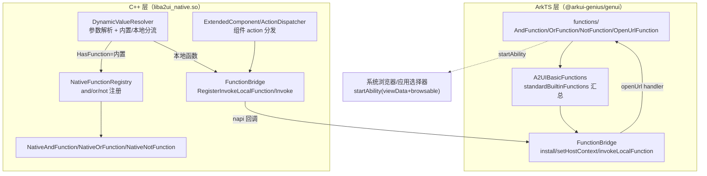
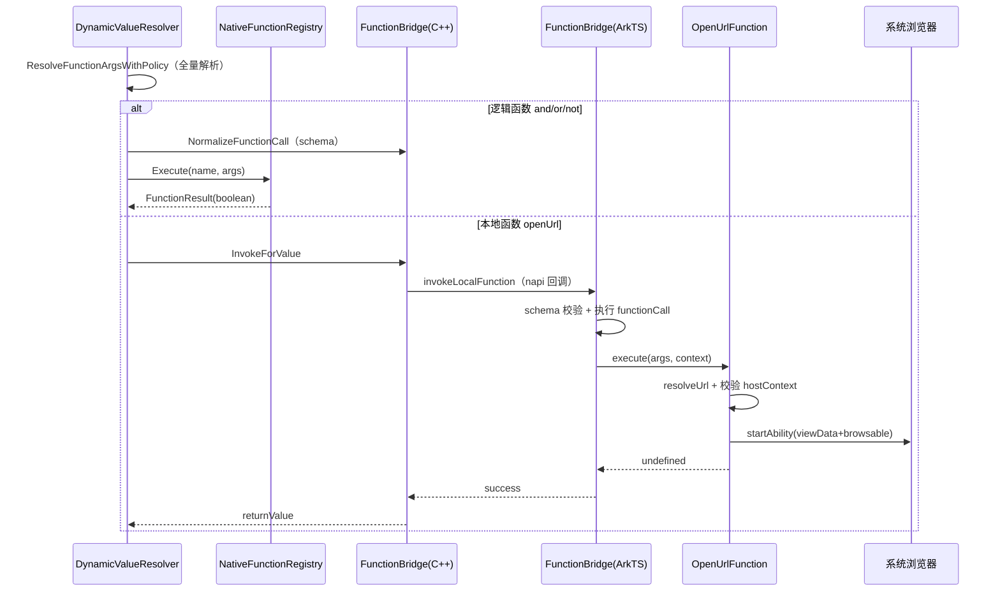

# 架构设计

> 确认目标仓和模块的架构约束、关键设计决策、Spec 拆分方向。

## 设计元数据

| Field | Content |
|-------|---------|
| Design ID | DESIGN-Func-07-04-09 |
| 关联需求 | 已有能力补录（无独立 requirement.md） |
| 关联 Epic | 无 |
| 目标 Feature | Feat-01 and 函数（基线）；Feat-02 or 函数；Feat-03 not 函数；Feat-04 openUrl 函数 |
| 复杂度 | 标准 |
| 目标版本 | A2UI 原生协议 v0.9（`https://a2ui.org/specification/v0_9/catalogs/basic/catalog.json`） |
| Owner | GenUI SIG |
| 状态 | Baselined（已有实现补录） |

## 需求基线

> 需求基线详见 proposal.md。以下仅列出设计阶段需要额外强调的要点。

| 项 | 补充说明 |
|----|---------|
| 补录而非新增 | 当前实现即规格，可疑行为只能标注为风险/备注 |
| 基准实现声明 | 本功能域以 A2UIRender 全量渲染引擎（`GenerativeUI/A2UIRender`，`@arkui-genius/genui`）为基准实现；协议 schema 以 `genui/src/main/resources/rawfile/schema/A2UI/v0.9/functions/*.json` 为契约 |
| 功能域边界 | 本功能域（07-04-09）覆盖三个逻辑函数（`and`/`or`/`not`）+ 一个系统函数（`openUrl`）；其余内置函数归 07-04-07（校验）、07-04-08（格式化）、07-04-16（扩展函数） |
| 函数运行位置 | 逻辑函数（`and`/`or`/`not`）为原生内置函数，在 C++ 层执行；`openUrl` 为本地函数，经 FunctionBridge 回 ArkTS 层执行 |

## 上下文和现状

### 涉及仓和模块

| 仓库 | 补充架构说明 |
|------|-------------|
| `GenerativeUI/A2UIRender` | 全量渲染引擎。ArkTS 层（`genui/src/main/ets/core/functions/`）声明函数契约与本地函数实现；C++ 层（`genui/src/main/cpp/functions/`）提供 `NativeFunctionRegistry` 与原生函数实现，`data/DynamicValueResolver.cpp` 负责动态值解析与函数分发 |
| `GenerativeUI/Docs` | 开发者文档（`reference/functions/logic.md`、`system.md`），仅作理解辅助，契约以 A2UIRender 实现与 schema 为准 |

> 仓、模块、当前职责、影响类型详见 proposal.md「影响范围」。

### 调用链层级分析

| 层 | 模块 | 职责 | 修改类型 |
|----|------|------|---------|
| 1. 函数声明层（ArkTS） | `ets/core/functions/logic/AndFunction.ets`、`OrFunction.ets`、`NotFunction.ets`、`OpenUrlFunction.ets`、`BuiltinFunctionBase.ets`、`A2UIBasicFunctions.ets` | 声明函数名、`schemaProvider`、`isInnerNative`、`functionCall`，并汇总到 `standardBuiltinFunctions` | 现状（基准实现） |
| 2. 函数桥接层（ArkTS） | `ets/core/functions/FunctionBridge.ets` | `install()` 注册 `invokeLocalFunction` 回调；`invokeLocalFunction` 做 schema 校验 + 本地函数执行；`setHostContext` 注入 UIAbilityContext | 现状 |
| 3. NAPI 桥接层（C++） | `cpp/functions/FunctionBridge.cpp` | `RegisterInvokeLocalFunction` 持有 ArkTS 回调引用；`Invoke`/`InvokeForValue`/`NormalizeFunctionCall` 跨语言调用与响应解析 | 现状 |
| 4. 动态值解析层（C++） | `cpp/data/DynamicValueResolver.cpp` | 参数递归解析（路径绑定/嵌套函数调用）；按 `NativeFunctionRegistry::HasFunction` 分流内置/本地函数 | 现状 |
| 5. 原生函数注册与执行层（C++） | `cpp/functions/NativeFunctionRegistry.cpp`、`NativeAndFunction.cpp`、`NativeOrFunction.cpp`、`NativeNotFunction.cpp` | 逻辑函数（and/or/not）的原生执行与布尔组合语义 | 现状 |
| 6. 组件 action 分发层（C++） | `cpp/components/extended/ExtendedComponent.cpp`、`cpp/components/actions/ActionDispatcher.cpp` | `openUrl` 作为组件 action 的入口：`NativeActionRegistry` → `NativeFunctionRegistry` → `FunctionBridge.Invoke` 兜底 | 现状 |

检查项：
- [x] 调用链每一层都已覆盖（声明 → 桥接 → NAPI → 动态值解析 → 原生注册 → action 分发）
- [x] 每层职责边界清晰（ArkTS 负责契约与本地函数实现，C++ 负责原生函数与分发）
- [x] 每层修改类型明确（均为「现状」，存量补录）

### 适用架构规则

| Rule ID | 适用原因 | 设计结论 | 验证方式 |
|---------|---------|---------|---------|
| OH-ARCH-LAYERING | ArkTS→NAPI→C++ 跨语言多层调用 | 调用方向自顶向下；`openUrl` 由 C++ 经 NAPI 回调到 ArkTS 执行 | 架构评审/依赖检查 |
| OH-ARCH-SUBSYSTEM | 单仓 + 独立 Docs 仓，无跨子系统 | 不引入子系统外依赖（`openUrl` 经 want 调起系统能力，属运行时交互） | 依赖检查 |
| OH-ARCH-API-LEVEL | 函数为内部 `InnerFunctionItem` 契约，无新增 Public API | InnerApi；`openUrl` 无显式权限声明，URL 可达性依赖宿主声明 `ohos.permission.INTERNET` | API 评审 |
| OH-ARCH-COMPONENT-BUILD | 现状无 BUILD.gn/bundle.json 变更 | 无构建影响 | 构建验证 |
| OH-ARCH-ERROR-LOG | `openUrl` 同步异常经 FunctionBridge 映射为 `LOCAL_FUNCTION`（3101） | 逻辑函数无错误码（始终返回 boolean）；`openUrl` 异步失败仅日志 | UT |

## 不涉及项承接

> proposal.md 已完成 N/A 判定。本节仅对标记「涉及」且需展开设计的维度给出结论。

| 维度 | 设计结论 |
|------|---------|
| 跨进程/SA | 不涉及（函数本身同进程；`openUrl` 经 want 调起系统浏览器为运行时行为） |
| 持久化 | 不涉及 |
| 权限 | `openUrl` 自身不声明权限；样例宿主 `entry/src/main/module.json5` 声明 `ohos.permission.INTERNET`（URL 内容可达性所需，属宿主职责，见 RISK-4） |
| 国际化/RTL | 不涉及（逻辑函数与 URL 打开均设备无关） |
| 多设备适配 | `openUrl` 调起结果依赖系统浏览器/可处理应用可用性（`showDefaultPicker`），见 Feat-04 |
| 范围边界 | 校验函数归 07-04-07；格式化函数归 07-04-08；扩展函数（navigate 等）归 07-04-16；本地函数机制本身归 07-04-01 消息模型域 |

## 关键设计决策

| 决策 ID | 问题 | 推荐方案 | 探索过的替代方案 | 取舍理由 | 影响 |
|--------|------|---------|----------------|---------|------|
| ADR-1 | 逻辑函数与系统函数运行位置如何划分 | `and`/`or`/`not` 为原生内置函数（`isInnerNative: true`，`functionCall: undefined`），在 C++ `NativeFunctionRegistry` 执行；`openUrl` 为本地函数（`isInnerNative: false`，`functionCall: createHandler()`），经 `FunctionBridge` 回 ArkTS 执行 | (a) 全部回 ArkTS 执行；(b) openUrl 也下沉 C++ | 逻辑函数无平台依赖、需高频求值（校验条件），下沉 C++ 避免跨语言往返；openUrl 依赖 ArkTS `common.UIAbilityContext.startAbility`，须在 ArkTS 执行 | 逻辑函数走 `ExecuteBuiltinFunctionCall`，openUrl 走 `ExecuteLocalFunctionCall` |
| ADR-2 | and/or 是否具备短路求值语义 | 原生 `Execute` 循环早返回（`and` 遇 false 即返 false，`or` 遇 true 即返 true），但入参在进入 native 前已被 `DynamicValueResolver` 全量解析（含嵌套函数调用） | (a) 按参数逐个懒解析；(b) 全量解析 + 全量组合 | 参数全量解析简化解析器（无跨函数延迟求值上下文）；native 循环早返回仅优化布尔组合，不延迟后续项求值 | 「短路」仅限布尔组合循环，非延迟求值（见 RISK-1） |
| ADR-3 | openUrl 如何调起系统打开 URL | 同步校验 url 非空 + hostContext 就绪后，`startAbility({action:'ohos.want.action.viewData', entities:['entity.system.browsable'], uri, parameters:{showDefaultPicker:true}})`；异步 `.then`/`.catch` 仅日志 | (a) 内嵌 WebView；(b) 返回 Promise 给调用方 | viewData + browsable 复用系统浏览器/应用选择器；fire-and-forget 适配 action 语义（returnType void） | 异步失败不回流错误码，仅 `console.error`（见 RISK-3） |
| ADR-4 | 函数如何注册与 schema 关联 | 逻辑函数：ArkTS `asFunctionItem()` 提供 schema（`and.json`/`or.json`/`not.json`），C++ `NativeFunctionRegistry` 构造时 `Register("and"/"or"/"not")`；openUrl 仅在 ArkTS `standardBuiltinFunctions` 注册并加载 `openUrl.json` | (a) 单一 C++ 注册源；(b) 单一 ArkTS 注册源 | schema 随 ArkTS 契约分发，执行句柄按运行位置分布；双轨注册名必须一致 | `NativeFunctionRegistry` 不注册 openUrl；`and`/`or`/`not` 不提供 ArkTS `functionCall` |

## 设计骨架

### 骨架范围

| 骨架项 | 目标 | 不包含 | 验证方式 |
|--------|------|--------|---------|
| 逻辑函数（and/or/not） | 固化布尔组合语义、入参约束、短路早返回、非布尔回退行为 | 校验/格式化/扩展函数 | UT |
| 系统函数（openUrl） | 固化 URL 解析（url/uri）、同步异常、startAbility 调起、fire-and-forget | 其它系统动作（navigate 归 07-04-16） | UT |

### 骨架 Spec 拆分

| Task ID | 目标 | 受影响文件 | AC |
|---------|------|----------|-----|
| TASK-SKELETON-1 | Feat-01 and 函数基线 | `AndFunction.ets`、`NativeAndFunction.cpp`、`and.json` | AC-1.1~1.x |
| TASK-SKELETON-2 | Feat-02~04 or/not/openUrl | `OrFunction.ets`、`NotFunction.ets`、`OpenUrlFunction.ets`、对应 Native 与 schema | 各 Feat AC |

## 后续 Task 拆分

| Task ID | 目标 | 受影响文件 | 依赖 |
|---------|------|----------|------|
| T-1 | Feat-01 and 函数（基线，本设计已承接） | `Feat-01-and-logic-spec.md` + 本 design.md | — |
| T-2 | Feat-02 or 函数 | `OrFunction.ets`、`NativeOrFunction.cpp`、`or.json` | T-1 |
| T-3 | Feat-03 not 函数 | `NotFunction.ets`、`NativeNotFunction.cpp`、`not.json` | T-1 |
| T-4 | Feat-04 openUrl 函数 | `OpenUrlFunction.ets`、`FunctionBridge.ets`、`openUrl.json` | T-1 |

## API 签名、Kit 与权限

> 本节承接 spec.md「API 变更分析」中识别的 API，给出签名、权限和 d.ts 位置等实现细节。

### 新增 API

无新增。本特性覆盖既有内置函数契约（存量补录）。

### 变更/废弃 API

| 原有 API | 变更类型 | 新 API | 迁移说明 |
|---------|---------|--------|---------|
| 内置函数 `and`（`InnerFunctionItem`，`isInnerNative: true`） | 既有 | — | 逻辑与，returnType `boolean` |
| 内置函数 `or`（`InnerFunctionItem`，`isInnerNative: true`） | 既有 | — | 逻辑或，returnType `boolean` |
| 内置函数 `not`（`InnerFunctionItem`，`isInnerNative: true`） | 既有 | — | 逻辑非，returnType `boolean` |
| 内置函数 `openUrl`（`InnerFunctionItem`，`isInnerNative: false`） | 既有 | — | 打开 URL，returnType `void` |

> 函数契约位置：ArkTS 声明 `genui/src/main/ets/core/functions/`；schema `genui/src/main/resources/rawfile/schema/A2UI/v0.9/functions/*.json`；无独立 SDK `.d.ts`。Kit：`@arkui-genius/genui`；权限：逻辑函数无、openUrl 无显式权限（宿主需 `ohos.permission.INTERNET`）；SysCap：不适用。

## 构建系统影响

### BUILD.gn 变更

无变更（存量补录）。`NativeAndFunction.cpp`/`NativeOrFunction.cpp`/`NativeNotFunction.cpp` 已纳入现有 `liba2ui_native.so` 构建目标。

### bundle.json 变更

无变更。

## 可选设计扩展

### 架构图



### 数据流/控制流

| 步骤 | 调用方 | 被调用方 | 数据/接口 | 说明 |
|------|--------|---------|----------|------|
| 1 | 动态值/组件 | `DynamicValueResolver::ResolveFunctionCallValue` | `functionCall{call,args,returnType}` | 函数入口 |
| 2 | `DynamicValueResolver` | `ResolveFunctionArgsWithPolicy` | args（路径/嵌套调用） | 全量递归解析 |
| 3 | `DynamicValueResolver` | `FunctionBridge::NormalizeFunctionCall`（napi→ArkTS） | schema 校验 + 归一化 | 逻辑函数与 openUrl 均先过 schema |
| 4 | `DynamicValueResolver` | `NativeFunctionRegistry::Execute`（and/or/not） | `(name, resolvedArgs, context, returnType)` | 内置函数原生执行 |
| 5 | `DynamicValueResolver` | `FunctionBridge::InvokeForValue`（openUrl） | napi→ArkTS `invokeLocalFunction` | 本地函数回 ArkTS |
| 6 | ArkTS `FunctionBridge` | `openUrlFunction.execute` | `(args, context)` | `startAbility` 调起 |

### 时序设计



### 数据模型设计

**API 层（ArkTS，内部契约）**

```typescript
// ets/core/base/FunctionItem.ets
export interface InnerFunctionItem {
  name: string;
  schemaProvider: SchemaProvider;
  functionCall?: FunctionCall;
  isInnerNative?: boolean;
}
```

**Framework 层（C++）**

```cpp
// cpp/functions/NativeFunctionBase.h
virtual std::string GetName() const = 0;
virtual FunctionResult Execute(const JsonValue& resolvedArgs) = 0;

// cpp/functions/FunctionResult.h
enum class FunctionResultType { NULL_VALUE = 0, BOOL, INT, DOUBLE, STRING, JSON_VALUE };
```

| 结构 | 存储方案 | 生命周期 |
|------|---------|---------|
| `NativeFunctionRegistry::handlers_` | `map<string, shared_ptr<NativeFunctionBase>>` | 进程单例，构造时注册 and/or/not |
| `FunctionBridge::registeredFunctionOverrides_` | `Map<string, InnerFunctionItem>` | `register()` 注册，会话级 |
| `OpenUrlFunction::hostContext` | `common.UIAbilityContext \| undefined` | `setHostContext` 注入 |

### 测试性设计

| 测试层级 | 测试目标 | Mock 策略 | 验证方式 |
|---------|---------|----------|---------|
| C++ UT | `NativeAndFunction::Execute` 全 true/false/非布尔/少于 2 项 | 构造 JsonValue 入参 | `genui/src/test/cpp/` |
| C++ UT | `NativeOrFunction::Execute` 任一 true/全 false/非布尔跳过 | 构造 JsonValue 入参 | `genui/src/test/cpp/` |
| C++ UT | `NativeNotFunction::Execute` 取反/非布尔回退 true | 构造 JsonValue 入参 | `genui/src/test/cpp/` |
| ArkTS 单测 | `OpenUrlFunction.resolveUrl/execute` 空 URL 抛错、hostContext 缺失抛错 | Mock `common.UIAbilityContext` | `genui/src/test/` |

### 接口参数规约

| 接口 | 参数 | 类型 | 合法范围 | 非法处理 | 边界说明 |
|------|------|------|---------|---------|---------|
| `and`/`or` | values | array | DynamicBoolean[]，minItems 2 | schema 拒绝；native 回退 false | `<2` 项 native 返回 false |
| `not` | value | boolean | DynamicBoolean | schema 拒绝；native 回退 true | 非布尔回退 true |
| `openUrl` | url | string | 非空 uri | 空串抛错→LOCAL_FUNCTION(3101) | 也接受 `uri` 参数名（schema 禁） |

### 线程与并发模型

| 操作 | 发起线程 | 回调线程 | 跨进程边界 | 线程安全 | 重入约束 |
|------|---------|---------|----------|---------|---------|
| 逻辑函数求值 | UI | UI | 无 | 单线程 | 参数全量解析后可重入 |
| openUrl startAbility | UI | 系统（异步 Promise） | 跨应用 | hostContext 只读注入 | fire-and-forget，无返回 |

## 详细设计

### 逻辑函数声明与注册

`AndFunction.ets:20-37`（`OrFunction.ets`/`NotFunction.ets` 同构）：`asFunctionItem()` 返回 `{name:'and', isInnerNative:true, schemaProvider, functionCall:undefined}`。`A2UIBasicFunctions.ets:46-61` 将 `andFunction`/`orFunction`/`notFunction` 纳入 `standardBuiltinFunctions`；`:87-89` `allA2UIBasicFunctions()` 产出 `InnerFunctionItem[]` 供 Catalog 使用。C++ `NativeFunctionRegistry.cpp:78-80` 构造时 `Register("and"/"or"/"not")`。

### 动态值解析与函数分流

`DynamicValueResolver.cpp:856-879` `ResolveFunctionCallValue`：先 `ResolveFunctionArgsWithPolicy`（`:662-765`，数组项经 `ResolveArrayFunctionArgsWithPolicy` `:696-723` 逐个递归解析，含嵌套 `call`），再按 `NativeFunctionRegistry::HasFunction(functionName)`（`:874`）分流：内置 → `ExecuteBuiltinFunctionCall`（`:817-836`，先 `NormalizeFunctionCall` 再 `NativeFunctionRegistry::Execute`）；否则 → `ExecuteLocalFunctionCall`（`:838-854`，经 `FunctionBridge::InvokeForValue` 回 ArkTS）。

### and/or/not 原生语义

`NativeAndFunction::Execute`（`NativeAndFunction.cpp:27-50`）：非对象→false（`:29-31`）；`values` 非数组→false（`:33-36`）；`size<2`→false（`:38-41`）；循环遇非布尔或 false 即返 false（`:43-48`）；全为布尔 true 返 true（`:49`）。`NativeOrFunction::Execute`（`NativeOrFunction.cpp:27-54`）：同前三守卫返 false；循环中非布尔项 `continue` 跳过（`:45-47`），遇 true 即返 true（`:48-50`），全 false 返 false（`:53`）。`NativeNotFunction::Execute`（`NativeNotFunction.cpp:25-37`）：非对象→true（`:27-29`）；`value` 非布尔→true（`:31-34`）；否则返 `!value`（`:36`）。

### openUrl 本地执行

`OpenUrlFunction.ets:51-75` `execute`：`resolveUrl(args)`（`:77-90`，优先 `record['url']`，回退 `record['uri']`，均非 string 返空）为空则 `throw Error('openUrl requires a non-empty url')`（`:53-55`）；`hostContext` 未注入则 `throw Error('host context is not ready')`（`:57-59`）；随后 `startAbility({action:'ohos.want.action.viewData', entities:['entity.system.browsable'], uri, parameters:{showDefaultPicker:true}})`（`:61-68`），`.then`/`.catch` 仅打日志（`:68-72`），返回 `undefined`（`:74`）。异常经 `FunctionBridge.invokeLocalFunction` 的 try/catch（`FunctionBridge.ets:254-266`）映射为 `LOCAL_FUNCTION`（3101，`Types.ets:107`）。

## 风险和开放问题

| 项 | 类型 | 影响 | 处理方式 | Owner |
|----|------|------|---------|-------|
| RISK-1 「短路」仅为布尔组合循环早返回，入参在 `ResolveFunctionArgsWithPolicy` 已全量解析，嵌套函数调用不延迟求值 | 架构 | 中 | Feat-01/02 ADR-2 标注；`DynamicValueResolver.cpp:696-723` | GenUI SIG |
| RISK-2 逻辑函数原生回退语义（非布尔/缺项）与 schema（`DynamicBoolean`/`minItems:2`）存在落差：路径绑定在 schema 层通过校验，运行时解析为非布尔才触发 native 回退 | 架构 | 中 | Feat-01/02/03 规则表标注；schema 见 `and.json`/`or.json`/`not.json` | GenUI SIG |
| RISK-3 `openUrl` 异步 `startAbility` 失败仅 `console.error`，不回流错误码；fire-and-forget 语义下调用方无法获知失败 | 架构 | 中 | Feat-04 规则表标注；`OpenUrlFunction.ets:70-72` | GenUI SIG |
| RISK-4 `openUrl` 无显式权限声明；URL 内容可达性依赖宿主 `ohos.permission.INTERNET`（样例 `entry/src/main/module.json5:5`） | API | 低 | Feat-04 兼容性/非功能标注 | GenUI SIG |
| RISK-5 `openUrl` schema（`openUrl.json` `additionalProperties:false`）禁 `uri`，但 `resolveUrl` 有 `record['uri']` 回退（`OpenUrlFunction.ets:83-85`），文档（`system.md:15`）称支持 `uri`——三方不一致，schema 生效时 `uri` 被拒 | API | 低 | Feat-04 风险表标注，以 schema+代码为准 | GenUI SIG |

## 设计审批

- [x] 需求基线已确认，设计覆盖 P0/P1 AC
- [x] 不涉及项已承接，N/A 和展开项都有结论
- [x] 涉及仓和模块职责清楚
- [x] 调用链层级分析完整，每层覆盖到位
- [x] 适用架构规则已识别并形成设计结论
- [x] 分层和子系统边界合规
- [x] API 变更有签名、权限、错误码和兼容性说明
- [x] BUILD.gn/bundle.json 影响明确
- [x] 设计输出和后续 Task 拆分明确
- [x] 关键设计决策有理由和影响说明
- [x] 风险和开放问题有 Owner

**结论:** 通过（已有实现补录）
