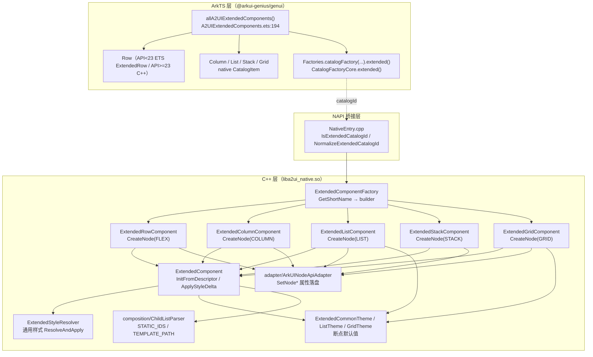
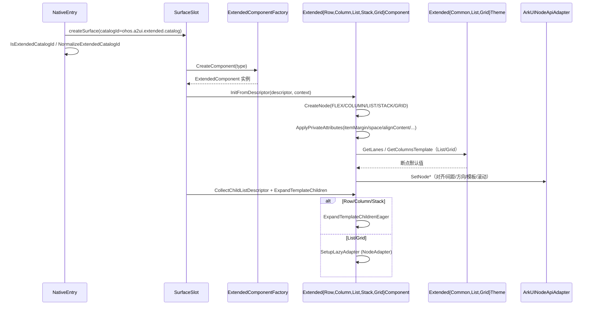

# 架构设计

> 确认目标仓和模块的架构约束、关键设计决策、Spec 拆分方向。

## 设计元数据

| Field | Content |
|-------|---------|
| Design ID | DESIGN-Func-07-04-10 |
| 关联需求 | 已有能力补录（无独立 requirement.md） |
| 关联 Epic | 无 |
| 目标 Feature | Feat-01 Row 组件（基线）；Feat-02 Column 组件；Feat-03 List 组件；Feat-04 Stack 组件；Feat-05 Grid 组件 |
| 复杂度 | 标准 |
| 目标版本 | A2UI 扩展协议 Catalog v1.0.0（`ohos.a2ui.extended.catalog`，消息协议 v0.9） |
| Owner | GenUI SIG |
| 状态 | Baselined（已有实现补录） |

## 需求基线

> 需求基线详见 proposal.md。以下仅列出设计阶段需要额外强调的要点。

| 项 | 补充说明 |
|----|---------|
| 补录而非新增 | 当前实现即规格，可疑行为只能标注为风险/备注 |
| 基准实现声明 | 扩展布局容器域以 GenUI 全量渲染引擎（`full_render` 仓，`@arkui-genius/genui`）为基准实现 |
| Catalog 声明 | 扩展协议走独立 Catalog，`catalogId=ohos.a2ui.extended.catalog`（`catalog/CatalogConstants.h:22`），默认版本 `1.0.0`（`:23`）；与 Basic Catalog 不可在同一 Surface 混用 |
| 范围边界 | 本功能域（07-04-10）覆盖五个扩展协议布局容器 Row / Column / List / Stack / Grid 的**特有属性与特有样式**；通用属性与 `styles` 通用样式（width/height/margin/padding/backgroundColor 等）归 overview 声明（07-04-11 及后续承接），模板/子列表语义归 07-04-17，动态绑定归 07-04-21，主题/深浅色归 07-04-24 |
| 与标准组件的差异 | 扩展组件在标准组件基础上新增 `styles` 对象与 `onClick`/`onAppear` 等事件属性（`render_docs/reference/extended-components/overview.md:56-64` 同名对照表）；Row 存在 API<23 的 ETS 兼容路径 |
| 组件三件套 | 每个布局容器由三层落地：ArkTS 目录注册（`A2UIExtendedComponents.ets`）→ C++ 组件实现（`components/extended/Extended{Row,Column,List,Stack,Grid}Component.{h,cpp}`，均继承 `ExtendedComponent`）→ 主题/样式解析（`ExtendedStyleResolver` + `Extended{Common,List,Grid}Theme`） |

## 上下文和现状

### 涉及仓和模块

| 仓库 | 补充架构说明 |
|------|-------------|
| `genui/full_render` | 全量渲染引擎。ArkTS 层 `ets/core/components/A2UI/A2UIExtendedComponents.ets` 完成扩展目录注册；C++ 层 `cpp/components/extended/` 提供 `ExtendedComponent` 基类与五个布局组件实现，`ExtendedComponentFactory` 负责按短名创建，`ExtendedStyleResolver` 负责通用样式解析，`Extended{Common,List,Grid}Theme` 负责断点/主题默认值；`specification/extended/1.0.0/extended_catalog.json` 为协议 schema |
| `genui/render_docs` | 开发者文档（`reference/extended-components/{row,column,list,stack,grid,overview}.md`），仅作理解辅助，契约以 full_render 实现为准 |

> 仓、模块、当前职责、影响类型详见 proposal.md「影响范围」。

### 调用链层级分析

| 层 | 模块 | 职责 | 修改类型 |
|----|------|------|---------|
| 1. 目录注册层（ArkTS） | `ets/core/components/A2UI/A2UIExtendedComponents.ets`、`ets/interface/Factories.ets` | 声明扩展目录项（type、schemaProvider），`allA2UIExtendedComponents()` 聚合注册 16 个原生 + 6 个自定义组件；API<23 时 Row 额外走 ETS 兼容路径 | 现状（基准实现） |
| 2. 协议 Schema 层 | `specification/extended/1.0.0/extended_catalog.json` | 声明扩展组件 JSON Schema（属性枚举、默认值、required 键） | 现状 |
| 3. NAPI 桥接层（C++） | `NativeEntry.cpp`（`IsExtendedCatalogId` / `NormalizeExtendedCatalogId`）、`SurfaceSlot` | createSurface 时归一化/校验扩展 catalogId 与版本，路由到扩展渲染管线 | 现状 |
| 4. 组件工厂层（C++） | `components/extended/ExtendedComponentFactory.{h,cpp}` | 按组件短名（`GetShortName` 去 namespace 前缀）创建 `ExtendedComponent` 实例 | 现状 |
| 5. 组件实现层（C++） | `Extended{Row,Column,List,Stack,Grid}Component.{h,cpp}`（均继承 `ExtendedComponent`） | 创建原生节点、解析私有属性、应用组件特有样式、子列表展开 | 现状 |
| 6. 样式解析层（C++） | `ExtendedStyleResolver.{h,cpp}`（通用样式）+ 各组件 `ApplyComponentSpecificStyles`（特有样式） | 通用样式 token → ArkUI 属性落盘；特有样式按组件解析 | 现状 |
| 7. 主题解析层（C++） | `ExtendedCommonTheme`、`ExtendedListTheme`、`ExtendedGridTheme` | 断点驱动的 lanes / columnsTemplate 默认值、阴影色 | 现状 |
| 8. 子列表解析层（C++） | `composition/ChildListParser.{h,cpp}`、`ExtendedComponent::ExpandTemplateChildren` | children 静态数组/模板对象二态解析与 eager/lazy 展开 | 现状 |
| 9. ArkUI 原生适配层（C++） | `adapter/ArkUINodeApiAdapter` | 对齐 ArkUI `ArkUI_NodeHandle` 属性/枚举，落盘原生节点 | 现状 |

检查项：
- [x] 调用链每一层都已覆盖（目录注册→Schema→NAPI→工厂→组件实现→样式解析→主题→子列表→原生适配）
- [x] 每层职责边界清晰（ArkTS 负责注册与 schemaProvider，C++ 负责原生渲染、属性映射、主题默认与懒加载）
- [x] 每层修改类型明确（均为「现状」，存量补录）

### 适用架构规则

| Rule ID | 适用原因 | 设计结论 | 验证方式 |
|---------|---------|---------|---------|
| OH-ARCH-LAYERING | ArkTS 目录注册 → NAPI → C++ 工厂/组件/主题/适配 多层调用 | 调用方向自顶向下；ArkTS 仅声明 catalogItem，渲染逻辑下沉 C++ | 架构评审/依赖检查 |
| OH-ARCH-SUBSYSTEM | 单仓 + 独立 Docs 仓，无跨子系统 | 不引入子系统外依赖 | 依赖检查 |
| OH-ARCH-API-LEVEL | 无新增/变更 Public/System API，组件经 `CatalogItem` 内部注册 | 内部 API（isInnerNative 语义同类），无新增权限/SysCap | API 评审 |
| OH-ARCH-COMPONENT-BUILD | 现状无 BUILD.gn/bundle.json 变更 | 无构建影响 | 构建验证 |
| OH-ARCH-ERROR-LOG | 私有属性/样式非法值经 `ReportExtendedSchemaWarning` 回退 | 枚举非法 token 回退默认值；children 结构非法上报 schema warning | UT/hilog |

## 不涉及项承接

> proposal.md 已完成 N/A 判定。本节仅对标记「涉及」且需展开设计的维度给出结论。

| 维度 | 设计结论 |
|------|---------|
| 跨进程/SA | 不涉及（同进程 ArkTS↔C++ 经 NAPI） |
| 持久化 | 不涉及（组件树仅内存态，`ExtendedComponent` 含 `cachedShadowValue_` 阴影缓存等内存态） |
| 权限 | 不涉及 |
| 国际化/RTL | 本域不直接处理；RTL 由 ArkUI 原生节点层负责，布局容器只透传主轴/交叉轴对齐 |
| 多设备适配 | 断点经 `ThemeContext` 传入；List lanes（1/2/3）与 Grid columnsTemplate（2/3/5 列）断点驱动；Row/Column/Stack 无断点差异 |
| 范围边界 | 通用属性/通用样式归 overview（07-04-11 及后续）；模板/子列表语义归 07-04-17；动态绑定归 07-04-21；主题/深浅色归 07-04-24 |

## 关键设计决策

| 决策 ID | 问题 | 推荐方案 | 探索过的替代方案 | 取舍理由 | 影响 |
|--------|------|---------|----------------|---------|------|
| ADR-1 | 扩展协议与标准协议如何共存 | 独立 Catalog，`catalogId=ohos.a2ui.extended.catalog`，`NativeEntry::IsExtendedCatalogId` 归一化校验；同一 Surface 不可混用 Basic/Extended | (a) 复用 Basic catalog 追加组件；(b) 版本号内嵌 catalogId | 两份协议 schema/默认值差异大，混用会误渲染；显式 Isolation 保证契约清晰 | createSurface 需携带扩展 catalogId；版本不匹配返回 `CATALOG_ID_MISSING`/unsupported version |
| ADR-2 | 组件类型多前缀时如何路由到实现 | `ExtendedComponentFactory::GetShortName` 取最后一个 `.` 之后的短名匹配 builder（`ExtendedComponentFactory.cpp:79-90`） | (a) 精确字符串匹配；(b) 前缀表硬编码 | 支持 namespaced type（如 `ohos.a2ui.extended.Row`）兼容 | 类型名不区分大小写校验由 NativeEntry 归一化负责 |
| ADR-3 | 布局容器落地到哪个原生节点 | Row→`FLEX`、Column→`COLUMN`、List→`LIST`、Stack→`STACK`、Grid→`GRID`（各组件构造 `CreateNode`） | (a) 全部借用 FLEX；(b) 全部 Column | 复用 ArkUI 原生容器语义，滚动（List/Grid）与层叠（Stack）靠原生能力 | Row 用 FLEX 表达 wrap/justify/align；Column 用原生 COLUMN 枚举 |
| ADR-4 | 属性如何分两态表达 | 顶层私有属性走 `PropertyDeclaration`（`allowDynamic`/`allowExpression`/`fallback*`），`styles` 组件特有样式走 `ApplyComponentSpecificStyles` | (a) 全部集中 attribute 解析；(b) 全部走 styles | 私有属性可动态绑定与回退；styles 可直接 delta 更新与 Schema/DFX 校验 | `itemMargin`/`space` 是顶层私有属性，其余是 styles 特有样式；二者存储/刷新路径不同 |
| ADR-5 | Row 在 API<23 上如何渲染 | `deviceInfo.sdkApiVersion < 23` 时 `Row` 走 ArkTS `ExtendedRow`（`A2UIExtendedComponents.ets:179-182`），API≥23 走 C++ `ExtendedRowComponent`（FLEX 原生节点） | (a) 完全 C++ 原生；(b) 完全 ETS | API<23 原生 FLEX 属性刷新会清掉写入 Root 的 margin，ETS 路径规避该缺陷 | 两套 Row 实现并存，itemMargin/alignment 语义需保持一致（RISK-4） |
| ADR-6 | 断点驱动的默认值如何落地 | `ExtendedListTheme::GetLanes`（XS/SM=1、MD=2、LG/XL=3）、`ExtendedGridTheme::GetColumnsTemplate`（2/3/5 列）；List/Grid 监听 size/area change 刷新断点（`HandleSizeChange`） | (a) 固定常量默认；(b) 暴露给 DSL 显式配置 | 复用 `ThemeContext.breakpoint` 响应式布局，免 DSL 显式配置多列 | Grid columnsTemplate 默认既非文档 "1fr"，而是断点驱动（RISK-1） |
| ADR-7 | 子项间距如何实现 | Row 用原生 Flex `space`（main=itemMargin、cross=itemMargin/2，`SetNodeFlexSpace`）；Column 用半间距 margin（`ApplyItemMarginToChildren`）；List 用原生 `space`；`spaceAround/spaceBetween/spaceEvenly` 时 itemMargin 失效 | (a) 统一 margin 半间距；(b) 统一原生 space | Row 原生 space 表达简洁；Column 原生无 space 属性故用 margin | Column 半间距 margin 与子项显式 margin 叠加（RISK-3）；List 无「justify 失效」语义 |
| ADR-8 | 子列表懒加载如何区分 | List/Grid 模板 children 走 `NodeAdapter` 懒加载（`ListAdapterNode`/`GridAdapterNode`）；Row/Column/Stack 走 Eager 展开（`ExpandTemplateChildrenEager`） | (a) 全部 eager；(b) 全部 lazy | 滚动容器需虚拟化；固定布局 eager 更简单 | Grid 懒加载失败回退 EAGER（`ExtendedGridComponent.cpp:649-665`） |

## 设计骨架

### 骨架范围

| 骨架项 | 目标 | 不包含 | 验证方式 |
|--------|------|--------|---------|
| Row 组件 | 固化水平布局、itemMargin/justifyContent/alignItems/wrap、子列表 eager 展开、API<23 ETS 兼容 | 通用属性/通用样式（overview）、模板语义（07-04-17） | ohosTest/UT |
| Column 组件 | 固化垂直布局、itemMargin 半间距 margin、justifyContent/alignItems、API<23 Row 子项兼容 | 同上 | ohosTest/UT |
| List 组件 | 固化可滚动列表、space/listDirection/scrollBar/nestedScroll、onReachStart/End、断点 lanes 与懒加载 | 同上 | ohosTest/UT |
| Stack 组件 | 固化层叠布局、alignContent 九值对齐、子列表 eager 展开 | 同上 | ohosTest/UT |
| Grid 组件 | 固化网格布局、columnsTemplate/rowsTemplate/columnsGap/rowsGap、断点默认列模板与懒加载、高度策略 | 同上 | ohosTest/UT |

### 骨架 Spec 拆分

| Task ID | 目标 | 受影响文件 | AC |
|---------|------|----------|-----|
| TASK-SKELETON-1 | Feat-01 Row 组件基线 | `ExtendedRow.ets`、`extended/ExtendedRowComponent.{h,cpp}` | 各 Feat AC |
| TASK-SKELETON-2 | Feat-02 Column 组件 | `extended/ExtendedColumnComponent.{h,cpp}` | 各 Feat AC |
| TASK-SKELETON-3 | Feat-03 List 组件 | `extended/ExtendedListComponent.{h,cpp}`、`extended/ExtendedListTheme.{h,cpp}` | 各 Feat AC |
| TASK-SKELETON-4 | Feat-04 Stack 组件 | `extended/ExtendedStackComponent.{h,cpp}` | 各 Feat AC |
| TASK-SKELETON-5 | Feat-05 Grid 组件 | `extended/ExtendedGridComponent.{h,cpp}`、`extended/ExtendedGridTheme.{h,cpp}` | 各 Feat AC |

## 后续 Task 拆分

| Task ID | 目标 | 受影响文件 | 依赖 |
|---------|------|----------|------|
| T-1 | Feat-01 Row 组件（基线，本设计已承接） | `Feat-01-row-extended-layout-spec.md` + 本 design.md | — |
| T-2 | Feat-02 Column 组件 | `Feat-02-column-extended-layout-spec.md` | T-1 |
| T-3 | Feat-03 List 组件 | `Feat-03-list-extended-layout-spec.md` | T-1 |
| T-4 | Feat-04 Stack 组件 | `Feat-04-stack-extended-layout-spec.md` | T-1 |
| T-5 | Feat-05 Grid 组件 | `Feat-05-grid-extended-layout-spec.md` | T-1 |

## API 签名、Kit 与权限

> 本节承接 spec.md「API 变更分析」中识别的 API，给出签名、权限和 d.ts 位置等实现细节。

### 新增 API

无新增。本特性覆盖既有扩展组件目录注册（存量补录），组件经内部 `CatalogItem` 注册，不暴露为宿主可直接调用的 Public API。

### 变更/废弃 API

| 原有 API | 变更类型 | 新 API | 迁移说明 |
|---------|---------|--------|---------|
| `createExtendedNativeCatalogItem(name)` | 既有 | — | 内部目录项构造，`CatalogItem.forComponent(name, schemaProvider, EMPTY_COMPONENT_BUILDER)`（`A2UIExtendedComponents.ets:160-166`） |
| `allA2UIExtendedComponents()` | 既有 | — | 聚合注册扩展目录项（`A2UIExtendedComponents.ets:194-204`） |
| `Factories.catalogFactory(...).extended()` | 既有 | — | 经 `CatalogFactoryCore.extended()` 返回扩展 Catalog（`Factories.ets:41-42`） |

> d.ts 位置：`genui/src/main/ets/core/components/A2UI/A2UIExtendedComponents.ets`（ArkTS 源即契约，无独立 SDK `.d.ts`）。Kit：`@arkui-genius/genui`；权限：无；SysCap：不适用。

## 构建系统影响

### BUILD.gn 变更

无变更（存量补录）。`genui/src/main/cpp/components/extended/{ExtendedRowComponent,ExtendedColumnComponent,ExtendedListComponent,ExtendedStackComponent,ExtendedGridComponent}.cpp` 已纳入现有 `liba2ui_native.so` 构建目标。

### bundle.json 变更

无变更。

## 可选设计扩展

### 架构图



### 数据流/控制流

| 步骤 | 调用方 | 被调用方 | 数据/接口 | 说明 |
|------|--------|---------|----------|------|
| 1 | `CatalogImpl` | `allA2UIExtendedComponents()` | `CatalogItem[]` | 扩展目录项注册 |
| 2 | `NativeEntry` | `IsExtendedCatalogId`/`NormalizeExtendedCatalogId` | `catalogId` | createSurface 归一化扩展 catalogId 与版本 |
| 3 | `SurfaceSlot` | `ExtendedComponentFactory::CreateComponent` | `type shortName` | 创建扩展组件实例 |
| 4 | `SurfaceSlot` | `ExtendedComponent::InitFromDescriptor` | `JsonValue` | 归一化 descriptor → ApplyPrivateAttributes |
| 5 | `ExtendedComponent` | `ExtendedStyleResolver::ResolveAndApply` + `ApplyComponentSpecificStyles` | `styles` | 通用样式 + 组件特有样式落盘 |
| 6 | 组件 | `Theme::GetLanes`/`GetColumnsTemplate` | `ThemeContext` | 断点默认值（List/Grid） |
| 7 | `SurfaceSlot` | `ChildListParser::ParseChildren` + `ExpandTemplateChildren` | `ChildListDescriptor` | 子列表解析与 eager/lazy 展开 |
| 8 | 组件 | `ArkUINodeApiAdapter::SetNode*` | enum/value | 属性落盘原生节点 |

### 时序设计



### 数据模型设计

**API 层（ArkTS，内部目录项）**

```typescript
// ets/core/components/A2UI/A2UIExtendedComponents.ets
const EXTENDED_NATIVE_COMPONENT_NAMES: string[] = ['Button', 'Text', 'TextInput', 'Row', 'Column',
  'List', 'Stack', 'Grid', 'Image', 'NavContainer', 'Toggle', 'Progress', 'Radio', 'Checkbox',
  'CheckboxGroup', 'If'];

function createExtendedNativeCatalogItem(componentName: string): CatalogItem {
  return CatalogItem.forComponent(componentName, (): string => createExtendedNativeSchema(componentName),
    EMPTY_COMPONENT_BUILDER);
}
```

**Framework 层（C++）**

```cpp
// components/extended/ExtendedRowComponent.h
static constexpr float DEFAULT_ITEM_MARGIN = 16.0F;
static constexpr A2UIItemAlignment DEFAULT_ALIGN_ITEMS = A2UIItemAlignment::CENTER;
static constexpr A2UIFlexAlignment DEFAULT_JUSTIFY_CONTENT = A2UIFlexAlignment::START;
static constexpr A2UIFlexWrap DEFAULT_WRAP = A2UIFlexWrap::NO_WRAP;

// components/extended/ExtendedGridComponent.h
enum class Mode { EAGER, LAZY };
enum class TemplateMode { THEME_DEFAULT, FIXED, RESPONSIVE, RESET };
struct GridTemplateConfig {
    TemplateMode mode = TemplateMode::RESET;
    std::string fixedValue;
    std::array<std::string, 5> responsiveValues {};
};
```

| 结构 | 存储方案 | 生命周期 |
|------|---------|---------|
| `ExtendedRowComponent::itemMargin_` | `float` 实例成员，默认 16.0F | `SetItemMargin` 更新，随组件销毁 |
| `ExtendedColumnComponent::itemMargin_` | `float` 实例成员，默认 8.0F | `SetItemMargin` 更新 |
| `ExtendedListComponent::listItems_` | `vector<ListItemSlot>`（weak_ptr child + `LIST_ITEM` 节点） | `OnAddChild` 追加，`RemoveAllChildren` 释放 |
| `ExtendedListComponent::adapterNode_` | `shared_ptr<ListAdapterNode>` | LAZY 模式持有，随组件销毁 |
| `ExtendedGridComponent::gridItems_` | `vector<GridItemSlot>`（weak_ptr child + `GRID_ITEM` 节点） | `OnAddChild` 追加，`RemoveAllChildren` 释放 |
| `ExtendedGridComponent::columnsTemplateConfig_/rowsTemplateConfig_` | `GridTemplateConfig` | `ApplyComponentSpecificStyles` 更新，`OnConfigChange` 重应用 |
| `ExtendedComponent::cachedShadowValue_` | `JsonValue`（阴影缓存） | `ApplyResolvedStyleObject` 缓存，`OnConfigChange` 重应用 |

### 测试性设计

| 测试层级 | 测试目标 | Mock 策略 | 验证方式 |
|---------|---------|----------|---------|
| C++ UT | `ExtendedComponentFactory` 短名匹配与创建 | 直接测 `ExtendedComponentFactory.cpp` | `genui/src/test/cpp/` |
| C++ UT | Resolve* 枚举映射与回退（Row/Column/Stack/List/Grid） | 直接测各 `Extended*Component.cpp` | `genui/src/test/cpp/` |
| C++ UT | `ExtendedListTheme`/`ExtendedGridTheme` 断点默认值 | 构造不同 `ThemeContext` | `genui/src/test/cpp/` |
| ohosTest | Row/Column 对齐/间距/模板展开 | `entry/src/ohosTest/` | 像素级 UI dump |
| ohosTest | List 方向/滚动/嵌套滚动、Grid 模板/间距 | `entry/src/ohosTest/` | 像素级 UI dump |

### 资源所有权矩阵

| 资源 | 创建方 | 持有方 | 销毁触发 | 实际释放 | 异常回收 |
|------|--------|--------|---------|---------|---------|
| 原生节点 | `ArkUINodeApiAdapter::CreateNode` | 组件实例 | 组件销毁 | `A2UIComponent::~A2UIComponent` | 随 `SurfaceSlot` 释放 |
| `ExtendedListComponent::listItems_` | `OnAddChild` | `ExtendedListComponent` | `RemoveAllChildren` | `RemoveListItemNode`+`DisposeNode` | 析构兜底 |
| `ExtendedGridComponent::gridItems_` | `OnAddChild` | `ExtendedGridComponent` | `RemoveAllChildren` | `DetachGridItemNode`+`DisposeNode` | 析构兜底 |
| `adapterNode_`（List/Grid） | `SetupLazyAdapter` | 组件实例 | 组件销毁 | `shared_ptr` 自动回收 | — |
| `cachedCommonTheme_` | `GetCommonTheme` | 组件实例 | 组件销毁 | `weak_ptr` 不持所有权 | — |

### 接口参数规约

| 接口 | 参数 | 类型 | 合法范围 | 非法处理 | 边界说明 |
|------|------|------|---------|---------|---------|
| Row `itemMargin` | value | number | `[0, +inf)` | 非法/负数回退 16.0F 并上报 warning | 默认 16vp |
| Row `styles.justifyContent` | value | string | `start/center/end/spaceAround/spaceBetween/spaceEvenly` | 回退 `start` | 三均分值禁用 itemMargin |
| Row `styles.alignItems` | value | string | `top/center/bottom` | 回退 `center` | 交叉轴 |
| Row `styles.wrap` | value | string | `noWrap/wrap` | 回退 `noWrap` | — |
| Column `itemMargin` | value | number | `[0, +inf)` | 回退 8.0F | 默认 8vp |
| Column `styles.alignItems` | value | string | `start/center/end` | 回退 `start` | 交叉轴 |
| List `space` | value | number | `[0, +inf)` | 负数/非法回退 0.0F | 默认 0vp |
| List `styles.nestedScroll` | value | string/object | `selfOnly/selfFirst/parentFirst/paraller` 或 `{scrollForward,scrollBackward}` | 回退 `selfFirst` | 保留 `paraller` 拼写 |
| Stack `styles.alignContent` | value | string | 九值枚举 | 回退 `center` | 默认 `center` |
| Grid `styles.columnsTemplate` | value | string/object | `fr` token 或 `{xs,sm,md,lg,xl}` | 回退主题默认（断点驱动） | fr token 仅支持 `数字.fr` |
| Grid `styles.columnsGap/rowsGap` | value | number | `[0, +inf)` | 负数回退 0.0F | 默认 0vp |

### 线程与并发模型

| 操作 | 发起线程 | 回调线程 | 跨进程边界 | 线程安全 | 重入约束 |
|------|---------|---------|----------|---------|---------|
| 组件创建/属性应用 | UI | UI | 无 | 单线程 UI | 处理中不可销毁 |
| 模板展开/懒加载 | UI | UI | 无 | 单线程 UI | — |
| size/area change 断点刷新 | UI | UI | 无 | 单线程 UI | `HandleSizeChange` 宽度相等时直接返回 |

## 详细设计

### Row 组件（Feat-01）

`EXTENDED_NATIVE_COMPONENT_NAMES` 含 `'Row'`（`A2UIExtendedComponents.ets:32`），schema 文件映射 `ExtendedRow.json`（`:51`）；API<23 时 `getExtendedCustomDefinitions` 追加 `createExtendedRowDefinition()`（`:179-182`），其 ArkTS `ExtendedRow` 用 `Flex({direction: Row})` + `space:{main:vpx(itemMargin), cross:vpx(itemMargin/2)}`（`ExtendedRow.ets:124-133`）。API≥23 走 C++ `ExtendedRowComponent`（`ExtendedComponentFactory.cpp:111` 注册），构造 `CreateNode(A2UINodeType::FLEX)`（`ExtendedRowComponent.cpp:83`）。私有属性 `itemMargin`（`ExtendedRowComponent.cpp:122-132`，fallbackNumber=16.0F）、`justifyContent`（`:134-148`，fallback `"start"` 六值）、`alignItems`（`:150-164`，fallback `"center"` 三值）、`wrap`（`:166-180`，fallback `"noWrap"`）经 `ApplyEffectiveLayout` 合并顶层与样式态（`:261-269`），最终 `SetNodeFlexOption(ROW, wrap, justifyContent, alignItems, START)`（`:291-292`）与 `SetNodeFlexSpace(space, space/2.0F)`（`:282`）。`justifyContent` 取三均分值时不施加间距（`IsItemMarginDisabledByJustify` `:75-79`、`ApplyItemMarginSpace` `:271-274`）。children 经 `ValidateChildListSchema(..., ALLOW)`（`:184`）与 `ExpandTemplateChildrenEager`（`ExtendedComponent.cpp:888`）。

### Column 组件（Feat-02）

`ExtendedColumnComponent` 构造 `CreateNode(A2UINodeType::COLUMN)`（`ExtendedColumnComponent.cpp:109-111`）。私有属性仅 `itemMargin`（`:134-155`，fallback 8.0F）。`styles.justifyContent`（六值回退 `start`）与 `styles.alignItems`（三值回退 `start`）经 `ApplyComponentSpecificStyles`（`:179-196`）。间距用半间距 margin：`ApplyItemMarginToChildren` 计算 `halfMargin = itemMargin/2`、中间项上下各加半间距（`:246-282`）；API<23 且下一子项为 Row 时把完整单项间距施加于前一子项以规避 Row 属性刷新清 margin（`useTrailingItemMargin` `:272-279`、`MIN_API_VERSION_NATIVE_ROW=23` `:33`、`IsRowChild` `:35-43`）。`OnAddChild/OnMoveChild/OnRemoveChild/RemoveAllChildren` 触发重刷与 margin 恢复（`:198-222`、`:284-297`）。

### List 组件（Feat-03）

`ExtendedListComponent` 构造 `CreateNode(A2UINodeType::LIST)`（`ExtendedListComponent.cpp:208`）。私有属性 `space`（`:305-316`，fallback 0.0，`SetSpace` 负数/非法回退 0 并上报 warning `:608-615`）。`styles.listDirection`（`vertical/horizontal` 回退 vertical）、`scrollBar`（`off/auto/on` 回退 auto）、`nestedScroll`（`selfOnly/selfFirst/parentFirst/paraller` 回退 selfFirst，支持 string 或 `{scrollForward,scrollBackward}`）经 `ApplyComponentSpecificStyles`（`:407-429`、`ApplyNestedScrollValueOrDefault` `:431-455`）。事件 `onReachStart`/`onReachEnd` 经 `RegisterComponentSpecificListeners`（`:457-474`）。EAGER 模式下 `OnAddChild` 为每子项包裹 `LIST_ITEM` 节点（`:513-534`）；模板 children 走 `SetupLazyAdapter`（`ListAdapterNode` `:244-264`）。断点默认 lanes 由 `ApplyDefaultLanes`（`:589-593`）+ `ExtendedListTheme::GetLanes`（XS/SM=1、MD=2、LG/XL=3，`ExtendedListTheme.cpp:54-69`）驱动，`HandleSizeChange` 追踪断点（`:476-511`，API<`MIN_API_VERSION_SIZE_CHANGE`=21 用 `ON_AREA_CHANGE`）。

### Stack 组件（Feat-04）

`ExtendedStackComponent` 构造 `CreateNode(A2UINodeType::STACK)`（`ExtendedStackComponent.cpp:58-60`）。`ApplyPrivateAttributes` 固定 `SetAlignContent(CENTER)`（`:67-71`）。`styles.alignContent` 九值枚举（`topStart/top/topEnd/start/center/end/bottomStart/bottom/bottomEnd`）经 `ApplyComponentSpecificStyles`（`:104-116`），`ResolveStackAlignContent` 非法回退 `center`（`:24-54`）。无私有属性，`GetPrivatePropertyDeclaration` 直接委托基类（`:93-96`）。children 二态解析 + `ExpandTemplateChildrenEager`（`:98-102`）。

### Grid 组件（Feat-05）

`ExtendedGridComponent` 构造 `CreateNode(A2UINodeType::GRID)`，`columnsTemplateConfig_.mode = THEME_DEFAULT`（`ExtendedGridComponent.cpp:265-268`）。`ApplyPrivateAttributes` 置 `PixelRoundNoForceRound`、GridAlignItems=0、gaps=0、应用主题列模板（`:341-349`）。样式 `columnsTemplate`/`rowsTemplate`（`fr` token 或响应式 `{xs,sm,md,lg,xl}`）与 `columnsGap`/`rowsGap`（负数回退 0）经 `ApplyColumnsTemplateStyle`/`ApplyComponentSpecificStyles`（`:484-545`）。`fr` token 仅支持 `数字.fr`（`IsSupportedGridFractionToken` `:136-157`），非法回退默认 `"1fr"`（`DEFAULT_GRID_TEMPLATE` `:40`）。断点默认列模板由 `ExtendedGridTheme::GetColumnsTemplate`（XS/SM=2、MD=3、LG/XL=5 列，`ExtendedGridTheme.cpp:54-69`）；`ApplyRowsTemplateForContext` 在 RESET/THEME_DEFAULT 态保持行不动以免切静态布局（`:700-721`）。EAGER 模式 `OnAddChild` 包裹 `GRID_ITEM` 并施加高度策略（`:592-614`、`:173-184`）；`ShouldGridItemsWrapContentHeight` 在未显式配 rowsTemplate 时为真（`:839-842`）。模板 children 走 `SetNodeGridNodeAdapter` 懒加载，失败回退 EAGER（`:649-665`、`:301-339`）。

## 风险和开放问题

| 项 | 类型 | 影响 | 处理方式 | Owner |
|----|------|------|---------|-------|
| RISK-1 Grid columnsTemplate 默认值文档分歧：`grid.md:235` 标注默认 `"1fr"`（1 列），但实现主题默认按断点驱动（XS/SM=2、MD=3、LG/XL=5 列，`ExtendedGridTheme.cpp:54-69`、`ExtendedGridComponent.cpp:676-698`） | API | 中 | 以代码为准（断点驱动）；`"1fr"` 仅作非法值回退；标注于 Feat-05 兼容性声明 | GenUI SIG |
| RISK-2 `nestedScroll` 枚举 token `paraller` 为拼写异常（应为 `parallel`），代码 `ExtendedListComponent.cpp:128-129` 与文档 `list.md:558` 一致保留 | API | 低 | 作为契约保留该 token，不改写；标注于 Feat-03 | GenUI SIG |
| RISK-3 Column 间距经半间距 margin 施加，与子项显式 `styles.margin` 叠加（`ExtendedColumnComponent.cpp:246-282`），冲突优先级未文档化 | 架构 | 中 | 规格 Feat-02 标注间距语义 | GenUI SIG |
| RISK-4 Row 双实现并存：API<23 走 ArkTS `ExtendedRow`（Flex+space），API≥23 走 C++ `ExtendedRowComponent`（FLEX native），itemMargin/对齐语义需保持一致（`ExtendedRow.ets:124-133` vs `ExtendedRowComponent.cpp:282,291-292`） | 架构 | 中 | 标注于 Feat-01；版本边界为 `deviceInfo.sdkApiVersion < 23` | GenUI SIG |
| RISK-5 List `space` 类型分歧：文档/schema 允许非负数字字符串（`list.md:221`、schema `NonNegativeNumberValue` string pattern），但 C++ `space` 属性声明为 `PropertyValueType::NUMBER` 且 `SetSpace(value.GetNumberValue(0.0))`（`ExtendedListComponent.cpp:308-313`），字符串字面量会退化为 0 | API | 中 | 以代码为准（数字字面量/动态表达式），字符串仅经动态解析路径生效 | GenUI SIG |
| RISK-6 Grid rowsTemplate 在 RESET/THEME_DEFAULT 态不做原生 reset（`ExtendedGridComponent.cpp:713-719`），避免 grid 退回静态布局；该缺省语义未在文档显式说明 | 架构 | 低 | 标注于 Feat-05 | GenUI SIG |
| RISK-7 `ExtendedCommonTheme::GetShadowColor` 深/浅色阴影均返回 `0xFF000000`，仅 brandColor 存在时不同（`ExtendedCommonTheme.cpp:23-24,47-54`） | 架构 | 低 | 标注风险；主题重应用归 07-04-24 | GenUI SIG |

## 设计审批

- [x] 需求基线已确认，设计覆盖 P0/P1 AC
- [x] 不涉及项已承接，N/A 和展开项都有结论
- [x] 涉及仓和模块职责清楚
- [x] 调用链层级分析完整，每层覆盖到位
- [x] 适用架构规则已识别并形成设计结论
- [x] 分层和子系统边界合规
- [x] API 变更有签名、权限、错误码和兼容性说明
- [x] BUILD.gn/bundle.json 影响明确
- [x] 设计输出和后续 Task 拆分明确
- [x] 关键设计决策有理由和影响说明
- [x] 风险和开放问题有 Owner

**结论:** 通过（已有实现补录）