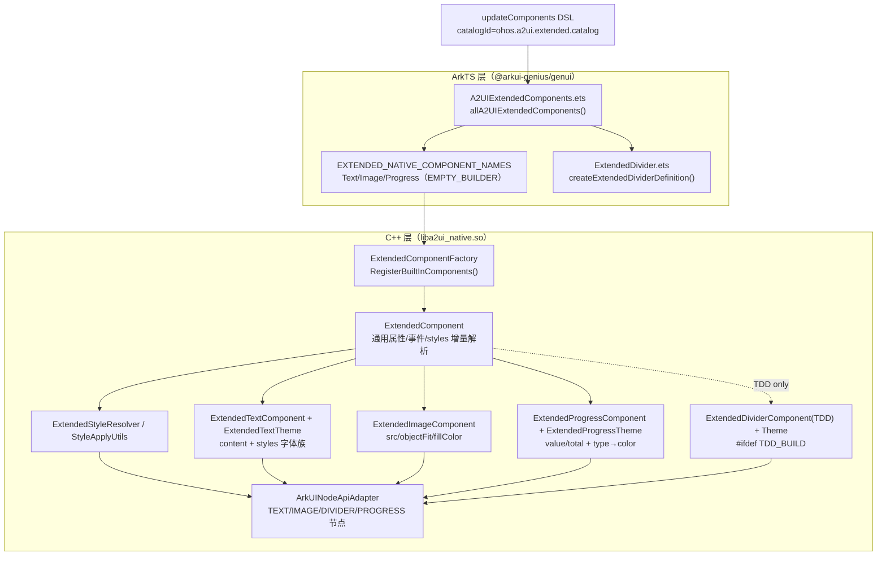
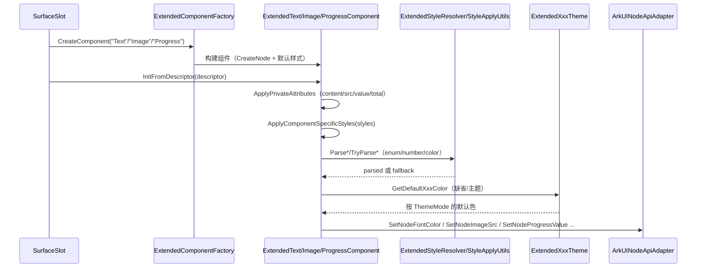

# 架构设计

> 确认目标仓和模块的架构约束、关键设计决策、Spec 拆分方向。

## 设计元数据

| Field | Content |
|-------|---------|
| Design ID | DESIGN-Func-07-04-11 |
| 关联需求 | 已有能力补录（无独立 requirement.md） |
| 关联 Epic | 无 |
| 目标 Feature | Feat-01 Text 扩展组件；Feat-02 Image 扩展组件；Feat-03 Divider 扩展组件；Feat-04 Progress 扩展组件 |
| 复杂度 | 标准 |
| 目标版本 | A2UI 扩展协议 catalog `ohos.a2ui.extended.catalog`（`https://a2ui.org/specification/v0_9/extended_catalog.json`）+ 起始 API Version 20 |
| Owner | GenUI SIG |
| 状态 | Baselined（已有实现补录） |

## 需求基线

> 需求基线详见 proposal.md。以下仅列出设计阶段需要额外强调的要点。

| 项 | 补充说明 |
|----|---------|
| 补录而非新增 | 当前实现即规格，可疑行为只能标注为风险/备注 |
| 基准实现声明 | 扩展展示组件域以 A2UIRender 全量渲染引擎（`GenerativeUI/A2UIRender`，`@arkui-genius/genui`）为基准实现 |
| 范围边界 | 本功能域（07-04-11）覆盖 4 个 A2UI 扩展展示组件：Text（文本）、Image（图片）、Divider（分割线）、Progress（进度）；其通用布局/样式属性（width/height/margin/padding/weight/accessibility/background/borderRadius 等）归通用样式域，本域只覆盖组件特有属性与 `styles` 特有样式 |
| 组件实现分型 | Text/Image/Progress 为 native（C++）组件（`ExtendedComponentFactory` 注册）；Divider 为 ArkTS Custom 组件（`markInnerNative(false)` + `createExtendedDividerDefinition`），另存在 `#ifdef TDD_BUILD` 的 C++ 镜像 `ExtendedDividerComponent` 仅用于单测 |
| 协议身份 | 四组件均属 A2UI 扩展协议 catalog（`ohos.a2ui.extended.catalog`），`component` 字段常量分别为 `Text`/`Image`/`Divider`/`Progress` |
| 与标准展示域差异 | 标准域（07-04-03）组件用顶层特有属性（`text`/`variant`/`axis`）；扩展域改用 `styles` 对象承载特有样式（`styles.fontColor`/`styles.objectFit`/`styles.strokeWidth`/`styles.type` 等） |

## 上下文和现状

### 涉及仓和模块

| 仓库 | 补充架构说明 |
|------|-------------|
| `GenerativeUI/A2UIRender` | 全量渲染引擎。ArkTS 层（`genui/src/main/ets/core/components/A2UI/A2UIExtendedComponents.ets`）声明扩展 catalog 项与 Custom 组件；C++ 层（`genui/src/main/cpp/components/extended/`）实现 native 组件（Text/Image/Progress）与通用样式管线（`ExtendedComponent`/`ExtendedComponentFactory`/`ExtendedStyleResolver`） |
| `GenerativeUI/Docs` | 开发者文档（`reference/extended-components/*.md`），仅作理解辅助，契约以 A2UIRender 实现为准 |

> 仓、模块、当前职责、影响类型详见 proposal.md「影响范围」。

### 调用链层级分析

| 层 | 模块 | 职责 | 修改类型 |
|----|------|------|---------|
| 1. 目录声明层（ArkTS） | `A2UIExtendedComponents.ets` | 声明扩展 native 组件名（`EXTENDED_NATIVE_COMPONENT_NAMES`）→ 生成 `CatalogItem`（schemaProvider + `EMPTY_COMPONENT_BUILDER`）；注册 Custom 组件定义（`getExtendedCustomDefinitions`） | 现状 |
| 2. 组件定义层（ArkTS Custom） | `extended/ExtendedDivider.ets` | Divider 的 Custom 组件 struct + `resolveExtendedDividerStyles` + `createExtendedDividerDefinition` | 现状 |
| 3. 工厂路由层（C++） | `ExtendedComponentFactory.cpp` | 按 `component` 短名路由 native 组件构建（`Text`/`Image`/`Progress`；`Divider` 仅 `#ifdef TDD_BUILD`） | 现状 |
| 4. 基类通用层（C++） | `ExtendedComponent.cpp`、`ExtendedComponent.h` | 通用属性/事件/绑定 + `styles` 增量解析 + 类型/枚举校验 | 现状 |
| 5. 组件特有属性层（C++） | `ExtendedTextComponent.*`、`ExtendedImageComponent.*`、`ExtendedProgressComponent.*`（+ TDD 镜像 `ExtendedDividerComponent.*`） | 特有属性（content/src/value/total）与特有样式（styles.*）声明与应用 | 现状 |
| 6. 样式解析层（C++） | `ExtendedStyleResolver.*`、`styles/StyleApplyUtils*.cpp` | enum/number/color 解析（`StyleApplyUtils::Parse*`）+ 默认回落 | 现状 |
| 7. 主题映射层（C++） | `ExtendedTextTheme.*`、`ExtendedDividerTheme.*`、`ExtendedProgressTheme.*`（继承 `ExtendedCommonTheme`） | 按 `ThemeMode` 分流的默认色常量映射 | 现状 |
| 8. 原生节点适配层（C++） | `ArkUINodeApiAdapter.*` | 将组件属性落到 ArkUI 原生节点（TEXT/IMAGE/DIVIDER/PROGRESS） | 现状 |

检查项：
- [x] 调用链每一层都已覆盖（目录→定义→工厂→基类→特有属性→样式解析→主题→原生适配）
- [x] 每层职责边界清晰（ArkTS 负责契约声明与 Custom 渲染；C++ 负责 native 组件属性/样式管线）
- [x] 每层修改类型明确（均为「现状」，存量补录）

### 适用架构规则

| Rule ID | 适用原因 | 设计结论 | 验证方式 |
|---------|---------|---------|---------|
| OH-ARCH-LAYERING | ArkTS catalog → C++ native 组件 + ArkTS Custom 组件双路径 | Text/Image/Progress 走 native 路径；Divider 走 ArkTS Custom 路径（生产）；两路径互不交叉 | 架构评审/依赖检查 |
| OH-ARCH-SUBSYSTEM | 单仓 + 独立 Docs 仓，无跨子系统 | 不引入子系统外依赖 | 依赖检查 |
| OH-ARCH-API-LEVEL | 无 ArkTS 公开 API、无 C-API（组件经协议 DSL 声明） | 无新增 Public/System API，无权限 | API 评审 |
| OH-ARCH-COMPONENT-BUILD | 现状无 BUILD.gn/bundle.json 变更 | 无构建影响 | 构建验证 |
| OH-ARCH-ERROR-LOG | 组件属性/样式非法或缺省走 schema warning（`SURFACE_ERROR_SCHEMA_WARNING` 系列错误码） | 枚举/类型回落默认值 + schema warning；缺必填上报 `SCHEMA_ERROR_CODE_*` | UT/hilog |

## 不涉及项承接

> proposal.md 已完成 N/A 判定。本节仅对标记「涉及」且需展开设计的维度给出结论。

| 维度 | 设计结论 |
|------|---------|
| 跨进程/SA | 不涉及（同进程 ArkTS↔C++ 经 NAPI，Custom 组件纯 ArkTS） |
| 持久化 | 不涉及（组件属性仅内存态，随 surface 生命周期） |
| 权限 | 不涉及 |
| 通用布局/样式属性 | 不涉及本域（width/height/margin/padding/weight/accessibility/background/borderRadius 等归通用样式域，本域 Feat 仅覆盖组件特有属性 content/src/value/total 与 `styles.*` 特有样式） |
| 深色/浅色模式 | 涉及（Text 字体色/装饰线色、Divider 颜色、Progress 前景色均随 `ThemeMode` 切换）——详见各 Feat |
| 大字体/字体缩放 | 涉及（Text 的 `fontScaleMode`/`minFontScale`/`maxFontScale`/自适应字号）——详见 Feat-01 |
| 多设备适配 | 无差异（默认色/字号/maxLines 等为固定常量或比例，与设备无关） |

## 关键设计决策

| 决策 ID | 问题 | 推荐方案 | 探索过的替代方案 | 取舍理由 | 影响 |
|--------|------|---------|----------------|---------|------|
| ADR-1 | 四组件如何分型（native vs Custom） | Text/Image/Progress 用 native C++ 组件（`ExtendedTextComponent`/`ExtendedImageComponent`/`ExtendedProgressComponent`）；Divider 用 ArkTS Custom 组件 `ExtendedDivider`（`EXTENDED_NATIVE_COMPONENT_NAMES` 不含 Divider） | (a) 全部 native；(b) 全部 ArkTS Custom | Text/Image/Progress 需原生文本/图片/进度渲染与 C++ 样式管线；Divider 依赖 ArkUI `Divider` 组件（`.strokeWidth`/`.color`/`.vertical` 链式属性）适合 ArkTS 侧实现 | 两套解析路径并存：native 走 C++ `PropertyDeclaration` + `ExtendedStyleResolver`，Custom 走 ArkTS `resolveExtendedDividerStyles` |
| ADR-2 | 特有样式如何承载 | 统一用 `styles` 对象子属性（`styles.fontColor`/`styles.objectFit`/`styles.strokeWidth`/`styles.type`），非顶层属性 | (a) 顶层属性（同标准域）；(b) 平铺多字段 | 扩展协议 schema 约定 `styles` 为通用样式容器（`additionalProperties: true`），使特有样式与通用样式统一走一条解析路径 | 特有样式 key 与通用样式 key 同域混编，靠 `ExtendedStyleResolver`/`StyleApplyUtils` 分发 |
| ADR-3 | Text 内容属性命名 | 规范名为 `content`（schema 必填），保留 `text` 作为旧别名（`ApplyPrivateAttributes` 双键兜底） | (a) 仅 `content`；(b) 仅 `text` | 与标准域 `text` 语义错开、避免冲突，同时兼容旧 DSL 下发 `text` | 两键二选一（`content` 优先）；均缺省回落空串 + 警告 |
| ADR-4 | Image 填充与默认 objectFit | `objectFit` 默认 `cover`（`IsSupportedObjectFitToken` 16 取值）；`fillColor` 走 `SetNodeImageFillColor`（SVG 才视觉染色） | (a) 默认 `contain`（标准域）；(b) 默认 `center` | 扩展 schema 声明默认 `cover`；`fillColor` 对 PNG/位图仅解析不染色（ArkUI 固有行为），文档已标注 | `src` 空串回落占位图 alt（`DEFAULT_IMAGE_PLACEHOLDER_ALT`） |
| ADR-5 | Divider 厚度单位与双实现 | 生产 ArkTS：`strokeWidth` 支持 vp/px/%/数字（px→`px2vp`）；C++ 镜像 `SetStrokeWidth` 用 `ParseDividerStrokeWidth` + px→vp 密度换算（`ConvertPxToVp`） | (a) 仅 vp；(b) 仅 px | 扩展协议允许带单位字符串，需密度无关换算；C++ 实现仅 TDD_BUILD 下编译，供 UT 覆盖 | 生产 ArkTS 默认 `0.29vp` vs schema/C++/文档 `1px` 不一致（RISK-1） |
| ADR-6 | Progress value 边界与 type→颜色 | `value`/`total`（`total` 缺省告警回落 100）；`value<0` 钳 0、`value>total` 钳 total；`type` 枚举 → `ExtendedProgressTheme::GetDefaultColorByType` 取前景色 | (a) 越界直接拒绝；(b) 不钳制直接传递 | 进度必须单调有界，钳制保证原生节点不越界；type 决定主题前景色 | `ring`/`capsule` 无对应主题色条目，落入 `EXTENDED_PROGRESS_FALLBACK_DEFAULT_COLOR`（RISK-4） |

## 设计骨架

### 骨架范围

| 骨架项 | 目标 | 不包含 | 验证方式 |
|--------|------|--------|---------|
| Text 扩展组件 | 固化 `content`（+`text` 别名）契约与 `styles` 字体族样式（fontSize/fontWeight/fontColor/textAlign/maxLines/textOverflow/wordBreak/decoration/minFontSize/maxFontSize/fontScaleMode/minFontScale/maxFontScale） | 富文本/HTML/图片/链接（schema 说明简单文本） | C++ UT |
| Image 扩展组件 | 固化 `src`/`objectFit`/`fillColor` 契约与占位图 alt | 图片解码/缓存、SVG 解析细节 | C++ UT |
| Divider 扩展组件 | 固化 `styles.strokeWidth`（含单位）/`styles.vertical`/`styles.color` 契约与主题颜色 | 通用布局属性（归通用样式域） | ArkTS 单测 + C++ UT（TDD 镜像） |
| Progress 扩展组件 | 固化 `value`/`total` 钳制与 `styles.type`/`styles.color`/`styles.strokeWidth` 契约 | 动画/过渡细节 | C++ UT |

### 骨架 Spec 拆分

| Task ID | 目标 | 受影响文件 | AC |
|---------|------|----------|-----|
| TASK-SKELETON-1 | Feat-01 Text 扩展组件基线 | `extended/ExtendedTextComponent.cpp`、`ExtendedTextTheme.cpp`、`ExtendedText.json` | AC-1.1~1.x |
| TASK-SKELETON-2 | Feat-02 Image 扩展组件 | `extended/ExtendedImageComponent.cpp`、`ExtendedImage.json` | 各 Feat AC |
| TASK-SKELETON-3 | Feat-03 Divider 扩展组件 | `extended/ExtendedDivider.ets`、`ExtendedDividerComponent.cpp`（TDD）、`ExtendedDividerTheme.cpp`、`ExtendedDivider.json` | 各 Feat AC |
| TASK-SKELETON-4 | Feat-04 Progress 扩展组件 | `extended/ExtendedProgressComponent.cpp`、`ExtendedProgressTheme.cpp`、`ExtendedProgress.json` | 各 Feat AC |

## 后续 Task 拆分

| Task ID | 目标 | 受影响文件 | 依赖 |
|---------|------|----------|------|
| T-1 | Feat-01 Text 扩展组件（基线，本设计已承接） | `Feat-01-text-extended-display-spec.md` + 本 design.md | — |
| T-2 | Feat-02 Image 扩展组件 | `ExtendedImageComponent.cpp`、`ExtendedImage.json` | T-1 |
| T-3 | Feat-03 Divider 扩展组件 | `ExtendedDivider.ets`、`ExtendedDividerComponent.cpp`（TDD） | T-1 |
| T-4 | Feat-04 Progress 扩展组件 | `ExtendedProgressComponent.cpp`、`ExtendedProgress.json` | T-1 |

## API 签名、Kit 与权限

> 本节承接 spec.md「API 变更分析」中识别的 API，给出签名、权限和 d.ts 位置等实现细节。

### 新增 API

无新增。本特性覆盖既有组件契约（存量补录），无 ArkTS 公开 API、无 C-API。

### 变更/废弃 API

| 原有 API | 变更类型 | 新 API | 迁移说明 |
|---------|---------|--------|---------|
| `CatalogItem`（`A2UIExtendedComponents.allA2UIExtendedComponents()`） | 既有 | — | 扩展目录注册入口（native 名 + Custom 定义） |
| `CustomComponentDefinition`（`createExtendedDividerDefinition()`） | 既有 | — | Divider 的 Custom 组件定义 |
| `ExtendedComponentFactory::RegisterBuiltInComponents()` | 既有 | — | Text/Image/Progress 的 native 工厂注册 |

> d.ts 位置：`genui/src/main/ets/core/components/A2UI/A2UIExtendedComponents.ets`、`genui/src/main/ets/core/components/extended/ExtendedDivider.ets`（ArkTS 源即契约，无独立 SDK `.d.ts`）。Kit：`@arkui-genius/genui`；权限：无；SysCap：不适用。

## 构建系统影响

### BUILD.gn 变更

无变更（存量补录）。`genui/src/main/cpp/components/extended/` 已纳入现有 `liba2ui_native.so` 构建目标；`ExtendedDividerComponent` 仅 `#ifdef TDD_BUILD` 编译（`ExtendedComponentFactory.cpp:22-24,118-120`）。

### bundle.json 变更

无变更。

## 可选设计扩展

### 架构图



### 数据流/控制流

| 步骤 | 调用方 | 被调用方 | 数据/接口 | 说明 |
|------|--------|---------|----------|------|
| 1 | 宿主 | `SurfaceSlot::UpdateComponents` | components[] 描述符 | 组件增量更新入口 |
| 2 | `SurfaceSlot` | `ExtendedComponentFactory::CreateComponent` | `component` 短名 | 按 `Text`/`Image`/`Progress`（native）或 Divider（Custom）创建 |
| 3 | `ExtendedComponent` | `ApplyExtendedDescriptor` | normalizedDescriptor | 通用属性 + styles 解析 + 类型/枚举校验 |
| 4 | 组件特有 | `ApplyPrivateAttributes` | descriptor | 应用 content/src 或 value/total |
| 5 | 组件特有 | `ApplyComponentSpecificStyles` | styles | 应用 `styles.*` 特有样式（经 `ExtendedStyleResolver`/`StyleApplyUtils`） |
| 6 | Theme | `GetDefaultFontColor`/`GetDefaultColor`/`GetDefaultColorByType` | ThemeContext | 按 `ThemeMode` 取默认色 |
| 7 | `ArkUINodeApiAdapter` | 原生节点 | TEXT/IMAGE/PROGRESS | 落到 ArkUI 节点属性 |

### 时序设计



### 数据模型设计

**API 层（ArkTS，公开契约）**

```typescript
// ets/core/components/A2UI/A2UIExtendedComponents.ets
// EXTENDED_NATIVE_COMPONENT_NAMES 含 Text/Image/Progress；schema 经 createExtendedNativeSchema
// ets/core/components/extended/ExtendedDivider.ets
// EXTENDED_DIVIDER_COMPONENT_TYPE = 'Divider'，createExtendedDividerDefinition()
```

**Framework 层（C++）**

```cpp
// components/extended/ExtendedTextTheme.cpp
constexpr uint32_t EXTENDED_TEXT_LIGHT_DEFAULT_FONT_COLOR = 0xE5000000u;   // 浅色字体
constexpr uint32_t EXTENDED_TEXT_DARK_DEFAULT_FONT_COLOR = 0x99FFFFFFu;    // 深色字体
constexpr uint32_t EXTENDED_TEXT_LIGHT_DEFAULT_DECORATION_COLOR = 0xFF000000u; // 浅色装饰线

// components/extended/ExtendedProgressTheme.cpp
// 0=linear(light 0xFF0A59F7/dark 0xFF317AF7)、2=eclipse(0x19*)、3=scaleRing(0x99*)、fallback 0xFFFF7DFF

// components/extended/ExtendedDividerTheme.cpp（TDD 镜像）
constexpr uint32_t EXTENDED_DIVIDER_LIGHT_DEFAULT_COLOR = 0x33000000u;
constexpr uint32_t EXTENDED_DIVIDER_DARK_DEFAULT_COLOR = 0x33FFFFFFu;
```

| 结构 | 存储方案 | 生命周期 |
|------|---------|---------|
| `ExtendedTextComponent::textValue_` | `std::string` | 组件创建/更新 |
| `ExtendedTextComponent::fontSize_`/`fontColor_`/`minFontScale_` 等 | 值成员 | 组件创建/样式更新；`(@Watch)` 见 ArkTS 侧 |
| `ExtendedImageComponent::srcValue_`/`fillColor_`/`hasFillColor_` | 值成员 | 组件创建/更新 |
| `ExtendedProgressComponent::value_`/`total_`/`progressType_`/`color_` | 值成员 | 组件创建/更新 |
| `cachedTheme_` 系 | `weak_ptr` 弱引用主题缓存 | 组件生命周期 |

### 测试性设计

| 测试层级 | 测试目标 | Mock 策略 | 验证方式 |
|---------|---------|----------|---------|
| C++ UT | `ExtendedTextComponent` content/styles 字体族应用与回落 | Mock `ArkUINodeApiAdapter` | `#ifdef TDD_BUILD` `ApplyTextStyleStateForTest` |
| C++ UT | `ExtendedImageComponent` src/objectFit/fillColor | Mock `ArkUINodeApiAdapter` | `ImageDfxDecision` DFX 日志 + 断言 |
| C++ UT | `ExtendedDividerComponent`（TDD 镜像）strokeWidth/vertical/color | Mock `ArkUINodeApiAdapter` | `#ifdef TDD_BUILD` |
| C++ UT | `ExtendedProgressComponent` value/total 钳制 + type→颜色 | Mock `ArkUINodeApiAdapter` | DFX 日志 + 断言 |
| ArkTS 单测 | `ExtendedDivider` 样式解析状态 | 直接测 `resolveExtendedDividerStyles` | `genui/src/test/` |
| ohosTest | 四组件端到端渲染 | — | `entry/src/ohosTest/` |

### 接口参数规约

| 接口 | 参数 | 类型 | 合法范围 | 非法处理 | 边界说明 |
|------|------|------|---------|---------|---------|
| Text | content | ExtendedDynamicString | 任意字符串（含 Expression/PathBinding/FunctionCall） | 缺省/非 string/bool/number → 警告 + 回落空串 | 必填（`text` 为旧别名） |
| Text | styles.fontSize | ExtendedDynamicNumber | 正有限数 | 非法 → 回落 16 | 默认 16，单位 fp |
| Text | styles.fontWeight | number/string | 100~900 步长 100 或关键字 | 非法 → 回落 W400 | 默认 400 |
| Text | styles.fontColor | ExtendedDynamicString | 十六进制颜色 | 非法 → 主题默认色 | 随 ThemeMode 刷新 |
| Text | styles.textOverflow | enum | none/clip/ellipsis/marquee | 非法 → 回落 clip | 默认 clip（=1） |
| Text | styles.textAlign | enum | start/center/end/justify | 非法 → 回落 start | 默认 start（=0） |
| Text | styles.wordBreak | enum | normal/breakAll/breakWord/hyphenation | 非法 → 回落 breakWord | 默认 breakWord |
| Text | styles.maxLines | number | [0, INT_MAX] | 非法 → 不限制 | 默认无限制（INT_MAX） |
| Text | styles.minFontScale | number | [0,1] | <0 钳 0，>1 钳 1 | 需 fontScaleMode=custom |
| Text | styles.maxFontScale | number | [1,∞) | <1 钳 1 | 需 fontScaleMode=custom |
| Text | styles.decoration.type | enum | none/underline/overline/lineThrough | 非法 → 回落 none | 源码 `lineThrough`（大写 T） |
| Text | styles.decoration.color | ExtendedDynamicString | 十六进制颜色 | 非法 → 主题默认装饰色 | 随 ThemeMode 刷新 |
| Text | styles.decoration.style | enum | solid/double/dotted/dashed/wavy | 非法 → 回落 solid | 默认 solid |
| Text | styles.decoration.thicknessScale | number | 有限数 | 非法 → 1.0 | 默认 1.0 |
| Image | src | ExtendedDynamicString | 任意字符串 | 缺省/非法 → 警告 + 空串；空串 → 不设置 src | 必填 |
| Image | styles.objectFit | enum | contain/cover/auto/fill/scaleDown/none/9 对齐位/matrix | 非法 → 回落 cover | 默认 cover |
| Image | styles.fillColor | string/ResourceColor | 0xARGB hex（number 亦被源码接受） | 非法 → 重置（不染色） | SVG 才视觉生效 |
| Divider | styles.strokeWidth | string/number | 非负；单位 vp/px/% | 非法 → 回落默认 | 生产 ArkTS 默认 0.29vp，schema/C++ 默认 1px |
| Divider | styles.vertical | ExtendedDynamicBoolean | true/false | 非法 → 回落 false | 默认水平 |
| Divider | styles.color | ExtendedDynamicString | 十六进制颜色 | 非法 → 主题默认色 | 默认 #33000000/#33FFFFFF |
| Progress | value | ExtendedDynamicNumber | [0,total] | <0 钳 0，>total 钳 total | 必填，默认 0 |
| Progress | total | ExtendedDynamicNumber | >0 有限数 | 缺省/非正/非有限 → 100 | 默认 100 |
| Progress | styles.type | enum | linear/ring/eclipse/scaleRing/capsule | 非法 → 回落 linear | 默认 linear（`line` 为源码别名） |
| Progress | styles.color | ExtendedDynamicString | 十六进制颜色 | 非法 → 类型默认色 | 主题默认色按 type 分流 |
| Progress | styles.strokeWidth | ExtendedDynamicNumber | 有限数 | 非法 → 回落 4 | 默认 4（vp） |

### 线程与并发模型

| 操作 | 发起线程 | 回调线程 | 跨进程边界 | 线程安全 | 重入约束 |
|------|---------|---------|----------|---------|---------|
| 组件属性/样式应用 | UI | UI | 无 | 单线程 UI | 处理中不可销毁 |
| Custom 组件 build | UI | UI | 无 | 单线程 | — |
| Progress strokeWidth（`CrossLanguageAttributeBridge::Dispatch`） | UI | UI | 无 | 单线程 | — |

## 详细设计

### Text 扩展组件特有属性与样式

`ExtendedTextComponent`（`ExtendedTextComponent.cpp:243-247`）构造时创建 `TEXT` 原生节点并调用 `SetText("")`、`ApplyDefaultTextStyles()`。内容属性在 `ApplyPrivateAttributes`（`:260-289`）解析：规范键 `content`、旧别名 `text`，二者均缺省则上报 `SCHEMA_ERROR_CODE_INVALID_VALUE` 并回落空串（`:264-268`）；值仅接受 string/bool/number/绑定描述符，否则 `SCHEMA_ERROR_CODE_TYPE_MISMATCH` 并 `RemoveBindingsForProperty` + 回落空串（`:283-288`）。属性声明 `GetPrivatePropertyDeclaration`（`:291-303`）对 `content`/`text` 声明 `STRING`、`allowDynamic=true`、`allowExpression=true`、`fallbackString=""`。

字体族样式经 `ApplyComponentSpecificStyles`（`:578-626`）分发：`ApplyFontWeightAndColorStyle`（`:305-345`）处理 fontWeight（`TryParseTextFontWeight`，详见 `:132-160`）与 fontColor（`TryParseHexColorStringStyleValue`，非法回落 `ResolveDefaultFontColor`）；`ApplyFontScaleRangeStyle`（`:347-395`）处理 minFontScale/maxFontScale（`TryParseValidMinFontScale` 钳 [0,1] 见 `:192-217`，`TryParseValidMaxFontScale` 钳 ≥1 见 `:219-239`）；`ApplyFontScaleModeAndSizeStyle`（`:397-435`）处理 fontScaleMode（`custom`/`followSystem`，其余回落）与 fontSize（`TryParsePositiveFiniteStyleScalar`，非法回落 16）；`ApplyMaxLinesAndOverflowStyle`（`:437-477`）处理 maxLines（`TryParseMaxLinesNumber`）与 textOverflow（`StyleApplyUtils::ParseTextOverflow`，默认 clip=1），并在 textOverflow 非默认且未配 maxLines 时告警 `:471-476`）；`ApplyTextAlignAndBreakStyle`（`:479-513`）处理 textAlign/wordBreak；自适应字号 `ApplyMinFontSizeStyle`（`:515-541`）/`ApplyMaxFontSizeStyle`（`:543-576`）在 minFontSize≥maxFontSize 时报 `HasConflictingAdaptiveFontSizes` 告警（`:570-575`）。

装饰线 `ApplyDecorationStyleWithFallback`（`:770-813`）经 `ResolveDecorationWithFallback`（`:671-725`）解析 `decoration:{type,color,style,thicknessScale}`；`type` token 映射见 `ParseDecorationTypeToken`（`:90-101`，`lineThrough`=3，注意大写 T）、`style` 见 `ParseDecorationStyleToken`（`:103-114`）；`ValidateDecorationFields`（`:727-768`）对非法字段分别告警。有效字号在 `ComputeEffectiveFontSize`（`:1113-1127`）按 `fontScaleMode` 分支：`custom` 时乘 `RenderContext.fontSizeScale` 并受 min/maxFontScale 钳制，否则原值。默认字体色由 `ExtendedTextTheme::GetDefaultFontColor`（`ExtendedTextTheme.cpp:48-52`：light `0xE5000000`，dark `0x99FFFFFF`），默认装饰色 `GetDefaultDecorationColor`（`:54-58`：light `0xFF000000`，dark `0x99FFFFFF`）；主题切换经 `OnConfigChange`（`ExtendedTextComponent.cpp:825-841`）刷新。

### Image 扩展组件特有属性与样式

`ExtendedImageComponent`（`ExtendedImageComponent.cpp:94-101`）创建 `IMAGE` 节点并设 aspectRatio 1.0、`SetObjectFit(DEFAULT_OBJECT_FIT=COVER)`。`src` 属性在 `ApplyPrivateAttributes`（`:114-140`）：缺省上报 `INVALID_VALUE` 回落空串，非法类型上报 `TYPE_MISMATCH`；最后恒 `SetAlt(DEFAULT_IMAGE_PLACEHOLDER_ALT)`（`:139`）。`GetPrivatePropertyDeclaration`（`:142-157`）仅声明 `src`（STRING、allowDynamic、allowExpression）。`SetSrc`（`:235-247`）对空串 `ResetNodeImageSrc` 否则 `SetNodeImageSrc`。

`objectFit` 经 `ApplyObjectFitStyle`（`:159-189`）解析（`IsSupportedObjectFitToken` 16 取值见 `:35-40`），非法回落 `cover`。`fillColor` 在 `ApplyComponentSpecificStyles`（`:210-232`）中解析：string/number 经 `StyleApplyUtils::ParseColor`（`SetFillColor`），非法 `ResetFillColor`（`:285-294`）。`fillColor` schema 预校验 `ValidateFillColorSchema`（`:304-327`）对 string-and-number 之外类型与非法 color 分别 `ReportExtendedSchemaWarning`；注意源码接受 number，而 schema `ExtendedImage.json:60-68` 仅声明 string + DynamicValueRef（RISK-5）。

### Divider 扩展组件特有属性与样式

生产路径 ArkTS `ExtendedDivider`（`ExtendedDivider.ets:303-411`）：`build`（`:321-341`）渲染 `Divider().strokeWidth(.color(.vertical(...)))` 并透传 `accessibilityLabel`/`accessibilityDescription`/`id` 与通用样式 modifier。样式解析集中在 `resolveExtendedDividerStyles`（`:274-301`）：`resolveStrokeWidth`（`:209-229`，非法回落 `DEFAULT_STROKE_WIDTH='0.29vp'`）、`resolveVertical`（`:231-251`，回落 `false`）、`resolveColor`（`:253-272`，回落 `resolveDividerColorByThemeMode`）。动态样式经 `registerDynamicStyles`（`:350-397`）绑定更新。`createExtendedDividerDefinition`（`:418-426`）以 `SchemaResourceLoader.loadSchema('schema/Extended/components/ExtendedDivider.json')` 注册 Custom 组件。

TDD 镜像 C++ `ExtendedDividerComponent`（`ExtendedDividerComponent.cpp`）：`GetPrivatePropertyDeclaration`（`:276-313`）声明 `strokeWidth`（STRING、`acceptNumberForString=true`、fallback `"1px"`）、`vertical`（BOOLEAN、fallback `false`）、`color`（STRING、fallback `""`）；`SetStrokeWidth`（`:315-332`）经 `ParseDividerStrokeWidth` 解析单位；`ApplyThickness`（`:447-461`）对 `%` 走 `SetPercentDimension`，`px` 经 `ConvertPxToVp` 换算，`vp` 直接 `SetAbsoluteDimension`；`SetColor`（`:339-350`）非法回落 `ResolveDefaultColor`；`ResolveDefaultColor`（`:352-361`）→ `ExtendedDividerTheme::GetDefaultColor`（`ExtendedDividerTheme.cpp:47-51`：light `0x33000000`，dark `0x33FFFFFF`）。该镜像仅 `#ifdef TDD_BUILD` 注册（`ExtendedComponentFactory.cpp:118-120`），生产不走 C++ 路径。

### Progress 扩展组件特有属性与样式

`ExtendedProgressComponent`（`ExtendedProgressComponent.cpp:95-102`）创建 `PROGRESS` 节点并设 `total=100`/`value=0`/`type=0`/默认前景色。`value`/`total` 在 `ApplyPrivateAttributes`（`:167-209`）/`ApplyTotalPrivateAttribute`（`:127-165`）：`total` 缺省/非正/非有限回落 100；`value<0` 钳 0（`:192-198`）、`value>total` 钳 total（`:200-208`）。`GetPrivatePropertyDeclaration`（`:211-240`）声明 `value`/`total`（NUMBER、allowDynamic、allowExpression）。

`styles` 经 `ApplyComponentSpecificStyles`（`:242-272`）：`type`（`ApplyProgressTypeValue` `:336-360`，经 `StyleApplyUtils::ParseProgressType`，映射见 `StyleApplyUtilsText.cpp:53-54`：`linear`/`line`=0、`ring`=1、`eclipse`=2、`scaleRing`=3、`capsule`=4）、`color`（`ApplyColorValue` `:314-334`，非法回落类型默认色）、`strokeWidth`（`ApplyStrokeWidthValue` `:374-389`，经 `CrossLanguageAttributeBridge::Dispatch` 下发，默认 4）。前景色 `ExtendedProgressTheme::GetDefaultColorByType`（`ExtendedProgressTheme.cpp:56-72`）：linear（`0xFF0A59F7`/`0xFF317AF7`）、eclipse（`0x19000000`/`0x19FFFFFF`）、scaleRing（`0x99000000`/`0x99FFFFFF`）、其余（ring/capsule）回落 `0xFFFF7DFF`。主题切换 `OnConfigChange`（`:115-125`）在 `useDefaultColor_` 时刷新。

## 风险和开放问题

| 项 | 类型 | 影响 | 处理方式 | Owner |
|----|------|------|---------|-------|
| RISK-1 Divider `strokeWidth` 默认值三处不一致：schema/文档/C++ 为 `"1px"`/`"1px"`/`1.0F`，生产 ArkTS `ExtendedDivider.ets:40` 为 `'0.29vp'` | 测试 | 中 | 以生产 ArkTS 为准（`ExtendedDivider.ets:40`）；Feat-03 风险表标注 | GenUI SIG |
| RISK-2 Divider 双实现：生产走 ArkTS `ExtendedDivider`，C++ `ExtendedDividerComponent` 仅 `#ifdef TDD_BUILD` 镜像（`ExtendedComponentFactory.cpp:118-120`），两者默认值/单位换算路径不完全一致 | 架构 | 中 | Feat-03 标注；C++ 主题与 ArkTS 常量需双端同步 | GenUI SIG |
| RISK-3 Text `decoration.type` 取值大小写不一致：schema（`ExtendedText.json:59`）与文档（`text.md`）写 `linethrough`，源码 `ParseDecorationTypeToken`（`ExtendedTextComponent.cpp:92-93`）接受 `lineThrough`（大写 T），`linethrough` 会被判非法回落 `none` | 测试 | 中 | 以源码为准（`ExtendedTextComponent.cpp:92-93`）；Feat-01 风险表标注 | GenUI SIG |
| RISK-4 Progress `ring`/`capsule` 无对应主题色条目，`GetDefaultColorByType`（`ExtendedProgressTheme.cpp:56-72`）落入 `EXTENDED_PROGRESS_FALLBACK_DEFAULT_COLOR=0xFFFF7DFF`（品红）；且源码含 `line` 别名（`StyleApplyUtilsText.cpp:53`）未进 schema | 测试 | 中 | 以源码为准（`ExtendedProgressTheme.cpp:29,71`、`StyleApplyUtilsText.cpp:53-54`）；Feat-04 标注 | GenUI SIG |
| RISK-5 Image `fillColor` 源码接受 number（`ExtendedImageComponent.cpp:211-214`），但 schema（`ExtendedImage.json:60-68`）仅声明 string + DynamicValueRef；且 `fillColor` 对 PNG/位图仅解析不染色（ArkUI 固有行为） | 测试 | 中 | 以源码为准（`ExtendedImageComponent.cpp:274-294`）；Feat-02 标注 | GenUI SIG |
| RISK-6 Text 默认字体色/装饰色为硬编码常量（`ExtendedTextTheme.cpp:23-25`），与系统 float/color token 未联动 | 架构 | 低 | Feat-01 标注；`ExtendedTextTheme` 常量表 | GenUI SIG |

## 设计审批

- [x] 需求基线已确认，设计覆盖 P0/P1 AC
- [x] 不涉及项已承接，N/A 和展开项都有结论
- [x] 涉及仓和模块职责清楚
- [x] 调用链层级分析完整，每层覆盖到位
- [x] 适用架构规则已识别并形成设计结论
- [x] 分层和子系统边界合规
- [x] API 变更有签名、权限、错误码和兼容性说明
- [x] BUILD.gn/bundle.json 影响明确
- [x] 设计输出和后续 Task 拆分明确
- [x] 关键设计决策有理由和影响说明
- [x] 风险和开放问题有 Owner

**结论:** 通过（已有实现补录）