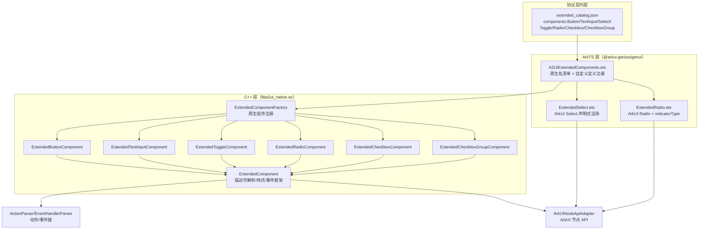
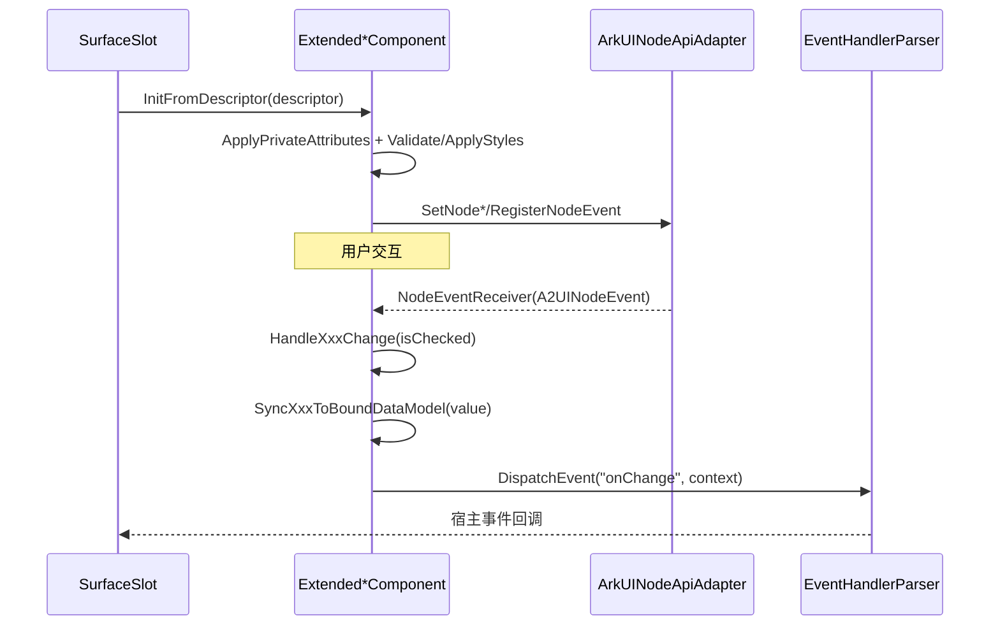

# 架构设计

> 确认目标仓和模块的架构约束、关键设计决策、Spec 拆分方向。

## 设计元数据

| Field | Content |
|-------|---------|
| Design ID | DESIGN-Func-07-04-12 |
| 关联需求 | 已有能力补录（无独立 requirement.md） |
| 关联 Epic | 无 |
| 目标 Feature | Feat-01 Button；Feat-02 TextInput；Feat-03 Select；Feat-04 Toggle；Feat-05 Radio；Feat-06 Checkbox；Feat-07 CheckboxGroup |
| 复杂度 | 标准 |
| 目标版本 | 鸿蒙 A2UI 扩展协议 1.0.0（`catalogId = ohos.a2ui.extended.catalog`，`specification/extended/1.0.0/extended_catalog.json`） |
| Owner | GenUI SIG |
| 状态 | Baselined（已有实现补录） |

## 需求基线

> 需求基线详见 proposal.md。以下仅列出设计阶段需要额外强调的要点。

| 项 | 补充说明 |
|----|---------|
| 补录而非新增 | 当前实现即规格，可疑行为只能标注为风险/备注 |
| 基准实现声明 | 共享契约域以 A2UIRender 全量渲染引擎（`GenerativeUI/A2UIRender`，`@arkui-genius/genui`）为基准实现 |
| 契约优先级 | 协议 schema（`specification/extended/1.0.0/extended_catalog.json`）优先于任一仓实现；实现分叉记入 spec 兼容/风险表 |
| 范围边界 | 本功能域（07-04-12）覆盖 7 个扩展交互组件的**组件契约**（属性 / 样式 / 事件）；取值函数 `getRadioValue` / `getCheckboxGroupValues` / `getToggleValue` / `getSelectValue` 归 07-04-16，本设计不展开 |
| 双实现路径 | Button/TextInput/Toggle/Checkbox/CheckboxGroup 走原生 C++ 路径；Select 走 ArkTS 自定义组件路径；Radio 两者皆具（ArkTS 注册时覆盖原生） |

## 上下文和现状

### 涉及仓和模块

| 仓库 | 补充架构说明 |
|------|-------------|
| `GenerativeUI/A2UIRender` | 全量渲染引擎。原生扩展组件在 C++ 层 `genui/src/main/cpp/components/extended/`（`Extended*Component.cpp`，经 `ExtendedComponentFactory` 注册）；Select/Radio 等自定义组件在 ArkTS 层 `genui/src/main/ets/core/components/extended/`（`ExtendedSelect.ets`/`ExtendedRadio.ets`，经 `CustomComponentFactory` 注册）；目录注册入口 `genui/src/main/ets/core/components/A2UI/A2UIExtendedComponents.ets` |
| `GenerativeUI/Docs` | 开发者文档（`reference/extended-components/*.md`），仅作理解辅助，契约以 schema + A2UIRender 实现为准 |

> 仓、模块、当前职责、影响类型详见 proposal.md「影响范围」。

### 调用链层级分析

| 层 | 模块 | 职责 | 修改类型 |
|----|------|------|---------|
| 1. 协议 Schema 契约层 | `specification/extended/1.0.0/extended_catalog.json` | 声明 7 组件的属性 / 样式 / 事件结构（`components.Button/TextInput/Select/Toggle/Radio/Checkbox/CheckboxGroup`） | 现状（基准实现） |
| 2. Catalog 注册层（ArkTS） | `A2UIExtendedComponents.ets` | 区分原生名清单 `EXTENDED_NATIVE_COMPONENT_NAMES` 与自定义定义 `getExtendedCustomDefinitions()`；注册时按名覆盖 | 现状 |
| 3. 原生组件实现层（C++） | `components/extended/Extended*Component.cpp` | 属性解析 / 样式校验与应用 / 事件注册与分发 / 绑定回写 | 现状 |
| 4. 自定义组件实现层（ArkTS） | `core/components/extended/ExtendedSelect.ets`、`ExtendedRadio.ets` | Select/Radio 的 ArkUI 声明式渲染与事件桥接 | 现状 |
| 5. 基础组件层（C++） | `components/extended/ExtendedComponent.cpp`、`components/A2UI/A2UIComponent.cpp` | 描述符解析框架、动态值/表达式解析、样式增量应用、事件处理器解析 | 现状 |
| 6. ArkUI 节点适配与动作分发（C++） | `adapter/ArkUINodeApiAdapter`、`components/actions/ActionParser`/`EventHandlerParser` | 节点 API 封装、action/functionCall 解析、事件链执行 | 现状 |

检查项：
- [x] 调用链每一层都已覆盖（schema→catalog→原生/自定义组件→基础组件→节点适配）
- [x] 每层职责边界清晰（schema 声明契约，C++ 原生渲染，ArkTS 自定义渲染，基础层统一解析框架）
- [x] 每层修改类型明确（均为「现状」，存量补录）

### 适用架构规则

| Rule ID | 适用原因 | 设计结论 | 验证方式 |
|---------|---------|---------|---------|
| OH-ARCH-LAYERING | schema（契约）→ ArkTS catalog → C++ 原生 / ArkTS 自定义 多路径调用 | 契约由 schema 声明；原生路径 ArkTS→C++ 经 NAPI，自定义路径纯 ArkTS | 架构评审/依赖检查 |
| OH-ARCH-SUBSYSTEM | 单仓 + 独立 Docs 仓，无跨子系统 | 不引入子系统外依赖 | 依赖检查 |
| OH-ARCH-API-LEVEL | 无新增 ArkTS/C-API，组件经 JSON 描述符驱动 | 无 Public API 变更，无权限 | API 评审 |
| OH-ARCH-COMPONENT-BUILD | 现状无 BUILD.gn/bundle.json 变更 | 无构建影响 | 构建验证 |
| OH-ARCH-ERROR-LOG | 组件非法属性/样式经 `ReportExtendedSchemaWarning` 上报 schema 告警 | 错误码见 SchemaErrorCodes（本域只约束告警行为，不展开错误码枚举） | UT |

## 不涉及项承接

> proposal.md 已完成 N/A 判定。本节仅对标记「涉及」且需展开设计的维度给出结论。

| 维度 | 设计结论 |
|------|---------|
| 跨进程/SA | 不涉及（同进程 ArkTS↔C++ 经 NAPI） |
| 持久化 | 不涉及（组件状态仅内存态；Checkbox select 的 runtime state 亦为内存态） |
| 权限 | 不涉及 |
| 国际化/RTL | 组件布局层关注，本域交互组件契约不展开 RTL 语义 |
| 多设备适配 | 组件渲染尺寸/断点由通用样式（07-04-13 及公共样式）处理，本域组件契约设备无关 |
| 取值函数 | `getRadioValue`/`getCheckboxGroupValues`/`getToggleValue`/`getSelectValue` 归 07-04-16 |
| 标准交互组件 | A2UI 原生协议 v0.9 标准交互组件归 07-04-04，本域只写扩展协议（extended catalog）组件 |

## 关键设计决策

| 决策 ID | 问题 | 推荐方案 | 探索过的替代方案 | 取舍理由 | 影响 |
|--------|------|---------|----------------|---------|------|
| ADR-1 | 扩展组件用原生 C++ 还是 ArkTS 自定义组件实现 | 交互组件 Button/TextInput/Toggle/Checkbox/CheckboxGroup 走 C++ 原生（`ExtendedComponentFactory.cpp:108-125`）；Select 走 ArkTS 自定义（`ExtendedSelect.ets`）；Radio 原生+自定义并存、ArkTS 注册时按名覆盖（`A2UIExtendedComponents.ets:168-183`） | (a) 全原生；(b) 全 ArkTS | 交互密集组件原生性能更优；Select 下拉菜单样式复杂用 ArkTS 声明式更灵活；Radio 的 indicatorType（dot/tick）仅 ArkUI Radio 支持 | Radio 存在双实现，契约以 schema + ArkTS 覆盖路径为准 |
| ADR-2 | 属性如何声明与回退 | 每属性用 `PropertyDeclaration` 声明类型/动态性/fallback；`ApplyDeclaredPropertyOrFallback` 统一「声明值→回退值」语义 | (a) 手写 if-else；(b) 反射 | 声明式集中约束，fallback 语义可测试 | 属性移除时 `OnPropertyRemoved` 需逐属性复位 |
| ADR-3 | 非法属性/样式如何处理 | 不中断渲染，`ReportExtendedSchemaWarning` 上报 `SCHEMA_ERROR_CODE_*` 告警并回落默认值 | (a) 直接拒绝消息；(b) 静默忽略 | 容错优先，宿主可订阅 schemaWarning 回调 | 告警不阻塞渲染，宿主须订阅才可见 |
| ADR-4 | 事件上下文如何构造 | 每组件构造固定键事件负载：Toggle `{isOn}`、Radio `{isChecked}`、Checkbox `{value}`、CheckboxGroup `{value[],status}`、Select `{index,value}` | (a) 透传原始节点事件；(b) 统一 `{value}` | 与 schema EventHandler 声明一致，键名稳定便于宿主解析 | 事件键名即对外契约 |
| ADR-5 | Button 点击优先级 | `action` 属性优先于 `onClick` 事件（`ExtendedButtonComponent.cpp:508-529`）：有合法 action 走 `DispatchActionInfo`，否则走 `DispatchEvent("onClick")` | (a) onClick 优先；(b) 合并执行 | schema 明确「action > onClick」；action 承载表单提交/函数调用 | 两者同时存在时 onClick 不触发 |
| ADR-6 | Checkbox 组联动（selectAll/shape 继承） | `CheckboxGroup` 持 `selectAll`/`checkboxShape`；`Checkbox` 无显式 `select`/`shape` 时从组继承（`ApplyInheritedSelect`/`ApplyInheritedShape`），显式值优先 | (a) 完全独立；(b) 组强制覆盖 | 兼容「组控制」语义；显式覆盖保留个体自由度 | 继承顺序：显式 > runtime state 恢复 > 组继承 |
| ADR-7 | 状态回写绑定数据模型 | 交互改变时 `SyncXxxToBoundDataModel` 将选中态/文本回写 path 绑定（Toggle/Radio/Checkbox/TextInput） | (a) 不回写（单向绑定）；(b) 回写 | 保持数据模型与 UI 状态一致，支持后续逻辑读取 | 仅存在 path 绑定时才回写 |

## 设计骨架

### 骨架范围

| 骨架项 | 目标 | 不包含 | 验证方式 |
|--------|------|--------|---------|
| 组件契约 | 固化 7 组件属性/样式/事件契约 + 默认值 + 告警回落 | 取值函数（07-04-16）；标准交互组件（07-04-04） | UT |
| 双实现路径 | 固化原生/自定义两条渲染路径与 Radio 覆盖语义 | — | UT |
| 事件契约 | 固化 5 类事件负载键名与 status 枚举 | 事件链执行（07-04-24） | UT |

### 骨架 Spec 拆分

| Task ID | 目标 | 受影响文件 | AC |
|---------|------|----------|-----|
| TASK-SKELETON-1 | Feat-01 Button 组件契约基线 | `ExtendedButtonComponent.cpp` | AC-1.x~AC-n.x |
| TASK-SKELETON-2 | Feat-02~07 其余 6 组件契约 | `ExtendedTextInputComponent.cpp`、`ExtendedSelect.ets`、`ExtendedToggleComponent.cpp`、`ExtendedRadioComponent.cpp`/`ExtendedRadio.ets`、`ExtendedCheckboxComponent.cpp`、`ExtendedCheckboxGroupComponent.cpp` | 各 Feat AC |

## 后续 Task 拆分

| Task ID | 目标 | 受影响文件 | 依赖 |
|---------|------|----------|------|
| T-1 | Feat-01 Button 组件契约（基线，本设计已承接） | `Feat-01-button-extended-interaction-spec.md` + 本 design.md | — |
| T-2 | Feat-02 TextInput 组件契约 | `ExtendedTextInputComponent.cpp` | T-1 |
| T-3 | Feat-03 Select 组件契约 | `ExtendedSelect.ets` | T-1 |
| T-4 | Feat-04 Toggle 组件契约 | `ExtendedToggleComponent.cpp` | T-1 |
| T-5 | Feat-05 Radio 组件契约 | `ExtendedRadioComponent.cpp`、`ExtendedRadio.ets` | T-1 |
| T-6 | Feat-06 Checkbox 组件契约 | `ExtendedCheckboxComponent.cpp` | T-1 |
| T-7 | Feat-07 CheckboxGroup 组件契约 | `ExtendedCheckboxGroupComponent.cpp` | T-6 |

## API 签名、Kit 与权限

> 本节承接 spec.md「API 变更分析」中识别的 API，给出签名、权限和 d.ts 位置等实现细节。

### 新增 API

无新增。本特性覆盖既有扩展协议组件契约（存量补录），组件由 JSON 描述符驱动，无独立 ArkTS/C-API 签名。

### 变更/废弃 API

| 原有 API | 变更类型 | 新 API | 迁移说明 |
|---------|---------|--------|---------|
| 扩展协议组件 `Button`/`TextInput`/`Select`/`Toggle`/`Radio`/`Checkbox`/`CheckboxGroup`（`extended_catalog.json`） | 既有 | — | 组件描述符契约 |

> 契约位置：`specification/extended/1.0.0/extended_catalog.json`。Kit：`@arkui-genius/genui`；权限：无；SysCap：不适用。

## 构建系统影响

### BUILD.gn 变更

无变更（存量补录）。`genui/src/main/cpp/components/extended/` 已纳入现有 `liba2ui_native.so` 构建目标。

### bundle.json 变更

无变更。

## 可选设计扩展

### 架构图



### 数据流/控制流

| 步骤 | 调用方 | 被调用方 | 数据/接口 | 说明 |
|------|--------|---------|----------|------|
| 1 | SurfaceSlot | `ExtendedComponent::InitFromDescriptor/UpdateFromDescriptor` | 组件 descriptor | 描述符初始化/更新 |
| 2 | 原生组件 | `ApplyPrivateAttributes` | 属性键值 | 属性解析 + fallback |
| 3 | 原生组件 | `ValidateComponentSpecificStylesSchema` | styles | 样式告警校验 |
| 4 | 原生组件 | `ApplyComponentSpecificStyles` | styles | 样式应用（默认值/覆盖） |
| 5 | 原生组件 | `RegisterComponentSpecificListeners` | 事件注册 | onChange/onClick 监听 |
| 6 | ArkUI 节点 | 组件 `NodeEventReceiver` | `A2UINodeEvent` | 事件回调 |
| 7 | 组件 | `DispatchEvent`/`DispatchActionInfo` | 事件负载/action | 宿主回调 + 绑定回写 |

### 时序设计



### 数据模型设计

**协议契约（schema，公开）**

```jsonc
// extended_catalog.json 组件公共结构
{
  "id": "string",             // Surface 内唯一组件标识
  "component": "Button",      // 组件类型名
  "styles": { "...": "..." }, // 公共 + 组件专属样式
  "onClick": ["EventHandler"],
  "onAppear": ["EventHandler"],
  "accessibility": { "label": "string", "description": "string" }
}
```

**Framework 层（C++，原生组件）**

```cpp
// ExtendedButtonComponent.h
std::string labelValue_;
float fontSize_ = 16.0F;
A2UIFontWeight fontWeight_ = A2UIFontWeight::W500;
bool enabled_ = true;
std::shared_ptr<ActionInfo> actionInfo_;
```

| 结构 | 存储方案 | 生命周期 |
|------|---------|---------|
| 组件成员属性 | 组件对象内嵌字段 | 组件创建/销毁 |
| `actionInfo_` | `shared_ptr<ActionInfo>`（`ActionParser::Parse`） | action 属性设置/清除 |
| Checkbox `select` runtime state | `SurfaceSlot::StoreRuntimeState(scope,key)` | 组内选中态恢复 |

### 测试性设计

| 测试层级 | 测试目标 | Mock 策略 | 验证方式 |
|---------|---------|----------|---------|
| C++ UT（TDD_BUILD） | 各 `Extended*Component` 属性/样式/事件 | `GetXxxForTest` 暴露内部态 | `genui/src/test/cpp/` |
| ArkTS 单测 | `ExtendedSelect`/`ExtendedRadio` 解析与事件 | 直接测 `.ets` | `genui/src/test/` |
| ohosTest | 交互组件端到端 | — | `entry/src/ohosTest/` |

### 资源所有权矩阵

| 资源 | 创建方 | 持有方 | 销毁触发 | 实际释放 | 异常回收 |
|------|--------|--------|---------|---------|---------|
| `nativeView_` 节点 | `ArkUINodeApiAdapter::CreateNode` | `ExtendedComponent` | 组件销毁 | `DisposeNode` | 析构 |
| Toggle/Checkbox 复合子节点 | 构造函数 | 组件 `toggleNode_/checkboxNode_/textNode_` | 组件析构 | `DisposeNode` | 析构 |
| `actionInfo_` | `ActionParser::Parse` | Button 组件 | action 清除 | `reset()` | `ClearAction` |

### 接口参数规约

| 接口 | 参数 | 类型 | 合法范围 | 非法处理 | 边界说明 |
|------|------|------|---------|---------|---------|
| Button | label | string | 任意 | 缺失回退 `""` | `text` 为别名 |
| TextInput | maxLength | number | `[0, INT32_MAX]` | 负/非有限→`DEFAULT_MAX_LENGTH` | 缺省 int32 max |
| TextInput | type | string | schema 枚举 | 未识别 token→`normal` | `url` 未实现 |
| Toggle | isOn | boolean | — | 非 bool 表达式按 number/string 推断 | — |
| Radio | value | string | 任意 | 缺失回退 `""` | 同组互斥 |
| CheckboxGroup | selectAll | boolean | — | 缺省 false | status 默认 `None` |

### 线程与并发模型

| 操作 | 发起线程 | 回调线程 | 跨进程边界 | 线程安全 | 重入约束 |
|------|---------|---------|----------|---------|---------|
| descriptor 应用 | UI | UI | 无 | 单线程 UI | 处理中不可销毁 |
| 节点事件回调 | ArkUI | UI | 无 | 单线程 | — |
| 绑定回写 | UI | UI | 无 | 单线程 | — |

## 详细设计

### Button 组件

`ExtendedButtonComponent`（`ExtendedButtonComponent.cpp`）：构造建 `BUTTON` 节点并设 padding 8/12（`:125-136`）。`ApplyPrivateAttributes`（`:143-156`）：`text` 存在且无 `label` 时按 `text` 处理，否则按 `label`；`enabled`；`action` 存在则 `SetPropertyFromDescriptor`，否则 `RemoveProperty`。属性声明 `GetPrivatePropertyDeclaration`（`:166-213`）：`text`/`label`(STRING, fallback "")、`enabled`(BOOLEAN, fallback true)、`action`(OBJECT)。必填键 `GetComponentDirectRequiredPropertyKeys` 返回 `{label}`（`:215-218`）。点击 `RegisterClickHandler`（`:508-529`）：`actionInfo_` 合法则 `DispatchActionInfo("action")`，否则有 `onClick` 则 `DispatchEvent("onClick")`。

### TextInput 组件

`ExtendedTextInputComponent`（`ExtendedTextInputComponent.cpp`）：`type` 经 `ParseTextInputTypeToken`（`:187-203`）映射 `A2UITextInputType`，未识别回退 `NORMAL`；`CreateTypePropertyDeclaration` 声明枚举 `normal/number/phoneNumber/email/password/numberPassword/screenLockPassword/userName/newPassword/numberDecimal/oneTimeCode`（`:496-509`）。`maxLength` 经 `NormalizeMaxLength`（`:340-347`）夹取 `[0, INT32_MAX]`，负/非有限回落 `DEFAULT_MAX_LENGTH`。文本变更 `HandleInputValueChange`（`:1425`）回写绑定。

### Select 组件（ArkTS 自定义）

`ExtendedSelect`（`ExtendedSelect.ets:1253`）：`build()`（`:1309-1363`）用 ArkUI `Select` 组件装配 `options`/`selected`/`value`/字体/颜色/菜单对齐；`onSelect` 回调（`:1338-1344`）同时 `dispatchSelectChange` 派发 `onSelect` 与 `onChange`（`:1470-1477`），负载 `{index,value}`。`selected` 缺省 `-1`（`:1256`），`value` 缺省取 `options[selected].value`（`:1365-1373`）。

### Toggle 组件

`ExtendedToggleComponent`（`ExtendedToggleComponent.cpp`）：复合 `ROW` 内挂 `TOGGLE`+`TEXT`（`:71-107`）。`isOn` 非 bool 表达式经 `ApplyNonBoolExpressionIsOn`（`:142-167`）：number 非 0 为 true，string 非空且非 `"false"`/`"0"` 为 true。`HandleToggleChange`（`:357-366`）回写绑定并派发 `{isOn}`。

### Radio 组件

原生 `ExtendedRadioComponent`（`ExtendedRadioComponent.cpp`）：`ApplyPrivateAttributes`（`:111-120`）解析 `value`/`group`/`checked`，`checked_` 为真时 `SyncSiblingCheckedState`（`:410-428`）遍历同 Surface 同 `group` 且 `checked` 的 peer 置 false（互斥）。`HandleRadioChange`（`:349-361`）派发 `{isChecked}`。ArkTS `ExtendedRadio`（`ExtendedRadio.ets:44`）额外支持 `indicatorType`（dot/tick，`:111-123`），注册时覆盖原生目录项。

### Checkbox 组件

`ExtendedCheckboxComponent`（`ExtendedCheckboxComponent.cpp`）：复合 `ROW` 内挂 `CHECKBOX`+`TEXT`（`:100-148`）。`ApplyPrivateAttributes`（`:275-283`）记录 `hasExplicitSelect_` 后解析 `label`/`select`/`value`/`group`。`HandleCheckboxChange`（`:746-760`）回写 runtime state 与绑定并派发 `{value}`。`ApplyInheritedSelect`（`:256-265`）在无显式 `select` 时先尝试 runtime state 恢复再继承组值。`SetGroup`（`:839-850`）拼装 native 组名 `a2ui:renderId:surfaceId:group`。

### CheckboxGroup 组件

`ExtendedCheckboxGroupComponent`（`ExtendedCheckboxGroupComponent.cpp`）：`selectAllStatus_` 缺省 `2`(None)（`.h:168`）。`HandleNodeEvent`（`:555-585`）从 ArkUI 字符串事件解析 `Name:`/`Status:`；`SelectAllStatusToString`（`:53-65`）映射 `0→All/1→Part/2→None`；`BuildGroupChangeEventContext`（`:67-83`）构造 `{value:string[], status}`。`GetSelectAll`/`GetSelectedNames` 供取值函数（07-04-16）读取。

## 风险和开放问题

| 项 | 类型 | 影响 | 处理方式 | Owner |
|----|------|------|---------|-------|
| RISK-1 Radio 双实现：原生 `ExtendedRadioComponent` 与 ArkTS `ExtendedRadio.ets` 并存，ArkTS 注册时覆盖（`A2UIExtendedComponents.ets:168-183`） | 架构 | 中 | Feat-05 标注双路径契约，以 ArkTS 覆盖路径为准 | GenUI SIG |
| RISK-2 TextInput `type` 枚举 schema 与实现不一致：schema 含 `url`、缺 `screenLockPassword`/`oneTimeCode`，实现反之 | API | 中 | Feat-02 兼容表标注；`url` 未识别回退 `normal` | GenUI SIG |
| RISK-3 CheckboxGroup 样式键名 case 不一致：schema 用 `unSelectedColor`，实现校验仅识别 `unselectedColor` 并告警 | API | 低 | Feat-07 风险表标注 | GenUI SIG |
| RISK-4 Radio schema 用 `unCheckedBorderColor`，实现额外告警 `uncheckedBorderColor` 为未定义字段 | API | 低 | Feat-05 风险表标注 | GenUI SIG |
| RISK-5 Button 组件 schema 声明 `label` 必填，实现额外接受 `text` 别名 | API | 低 | Feat-01 风险表标注 | GenUI SIG |

## 设计审批

- [x] 需求基线已确认，设计覆盖 P0/P1 AC
- [x] 不涉及项已承接，N/A 和展开项都有结论
- [x] 涉及仓和模块职责清楚
- [x] 调用链层级分析完整，每层覆盖到位
- [x] 适用架构规则已识别并形成设计结论
- [x] 分层和子系统边界合规
- [x] API 变更有签名、权限、错误码和兼容性说明
- [x] BUILD.gn/bundle.json 影响明确
- [x] 设计输出和后续 Task 拆分明确
- [x] 关键设计决策有理由和影响说明
- [x] 风险和开放问题有 Owner

**结论:** 通过（已有实现补录）
