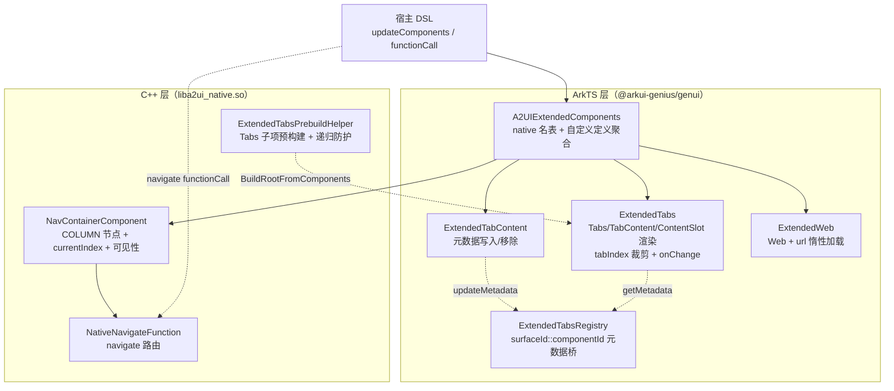
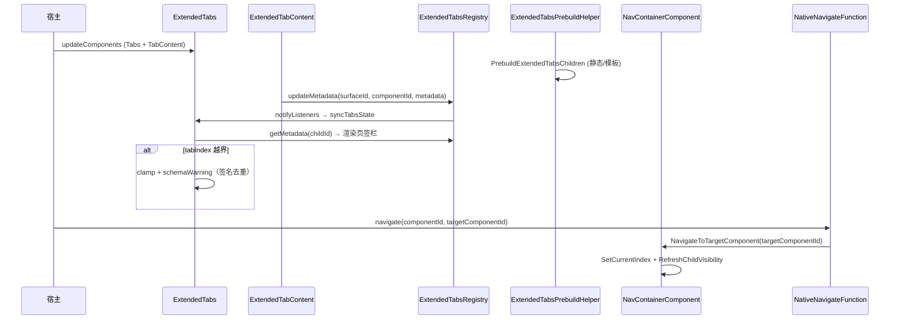

# 架构设计

> 确认目标仓和模块的架构约束、关键设计决策、Spec 拆分方向。

## 设计元数据

| Field | Content |
|-------|---------|
| Design ID | DESIGN-Func-07-04-13 |
| 关联需求 | 已有能力补录（无独立 requirement.md） |
| 关联 Epic | 无 |
| 目标 Feature | Feat-01 Tabs 扩展页签容器（基线）；Feat-02 TabContent 扩展页签项；Feat-03 NavContainer 扩展导航容器；Feat-04 Web 扩展网页容器 |
| 复杂度 | 标准 |
| 目标版本 | API Version 20；鸿蒙扩展协议 1.0.0（`ohos.a2ui.extended.catalog`） |
| Owner | GenUI SIG |
| 状态 | Baselined（已有实现补录） |

## 需求基线

> 需求基线详见 proposal.md。以下仅列出设计阶段需要额外强调的要点。

| 项 | 补充说明 |
|----|---------|
| 补录而非新增 | 当前实现即规格，可疑行为只能标注为风险/备注 |
| 基准实现声明 | 本域以 A2UIRender 全量渲染引擎（`GenerativeUI/A2UIRender`，`@arkui-genius/genui`）为基准实现 |
| 协议归属 | 本域组件属于鸿蒙扩展协议（`catalogId=ohos.a2ui.extended.catalog`），与标准协议（07-04-05 等）的 Tabs/TabContent 语义不同：扩展域 Tabs/TabContent 引入 `tabIndex`/`tabType`/`barPosition`/`vertical`/`scrollable`/私有 styles 等扩展能力 |
| 实现分层 | Tabs / TabContent / Web 为 ArkTS 自定义组件（`markInnerNative` 语义下由 `getExtendedCustomDefinitions` 注册）；NavContainer 为 C++ native 组件（`ExtendedComponentFactory` 注册） |
| 范围边界 | 本域覆盖四个扩展容器组件的「组件契约 + 渲染/路由/加载行为」；通用属性与通用样式归 07-04-27/28（扩展域）引用；动态值/表达式/绑定解析归数据/表达式域，本设计不展开底层解析 |

## 上下文和现状

### 涉及仓和模块

| 仓库 | 补充架构说明 |
|------|-------------|
| `GenerativeUI/A2UIRender` | 全量渲染引擎。ArkTS 层 `genui/src/main/ets/core/components/extended/`（`ExtendedTabs.ets`/`ExtendedTabContent.ets`/`ExtendedTabsRegistry.ets`/`ExtendedWeb.ets`）承载 Tabs/TabContent/Web 自定义组件；`core/components/A2UI/A2UIExtendedComponents.ets` 负责扩展 Catalog 注册聚合。C++ 层 `genui/src/main/cpp/components/extended/NavContainerComponent.*` 承载 NavContainer；`components/custom/ExtendedTabsPrebuildHelper.*` 承载 Tabs 子项预构建 |
| `GenerativeUI/Docs` | 开发者文档（`reference/extended-components/{tabs,tab-content,nav-container,web}.md`），仅作理解辅助，契约以 A2UIRender 实现 + 扩展 schema 为准 |
| `GenerativeUI/genui_protocol_analysis` | 扩展协议规范（`specification/extended/1.0.0/extended_catalog.json` 及组件 JSON Schema），为协议权威源 |

> 仓、模块、当前职责、影响类型详见 proposal.md「影响范围」。

### 调用链层级分析

| 层 | 模块 | 职责 | 修改类型 |
|----|------|------|---------|
| 1. 扩展 Catalog 聚合层（ArkTS） | `core/components/A2UI/A2UIExtendedComponents.ets` | `EXTENDED_NATIVE_COMPONENT_NAMES`（含 NavContainer）与 `getExtendedCustomDefinitions`（TabContent/Tabs/Web 等）聚合为扩展 Catalog 项 | 现状（基准实现） |
| 2. 自定义组件定义层（ArkTS） | `extended/ExtendedTabs.ets`、`ExtendedTabContent.ets`、`ExtendedWeb.ets` | `createXxxDefinition()` 声明 type/builder/schemaProvider；schema 经 `SchemaResourceLoader.loadSchema('schema/Extended/components/*.json')` 加载 | 现状 |
| 3. 组件渲染层（ArkTS） | `ExtendedTabs`/`ExtendedTabContent`/`ExtendedWeb` struct `build()` | 系统 `Tabs`/`TabContent`/`Column`/`Web` 声明式渲染 + 通用属性下发 | 现状 |
| 4. 元数据注册表（ArkTS） | `extended/ExtendedTabsRegistry.ets` | TabContent → Tabs 的标题/图标/样式元数据桥接（`surfaceId::componentId` 键、变更去重、监听通知） | 现状 |
| 5. Native 组件层（C++） | `cpp/components/extended/NavContainerComponent.*` | NavContainer 节点创建、currentIndex 解析/裁剪、子页面可见性切换、`navigate` 路由 | 现状 |
| 6. Native 预构建层（C++） | `cpp/components/custom/ExtendedTabsPrebuildHelper.*` | 扩展 Tabs 子项（静态/模板）预构建、递归 Tabs 防护、模板实例描述符生成 | 现状 |
| 7. Native 路由函数层（C++） | `cpp/functions/extended/NativeNavigateFunction.cpp` | `navigate` 函数：解析 componentId/targetComponentId → 定位 NavContainer → 切换当前页 | 现状 |
| 8. 属性归一化层（C++） | `cpp/components/custom/CustomComponentTabsValidation.cpp`、`CustomComponentTabContentValidation.cpp` | Tabs/TabContent 扩展属性类型校验与非法值重置 | 现状 |

检查项：
- [x] 调用链每一层都已覆盖（Catalog 聚合 → 自定义定义 → 渲染 → 元数据 → Native 组件/预构建/路由 → 属性归一化）
- [x] 每层职责边界清晰（ArkTS 负责契约/渲染/元数据桥接，C++ 负责 NavContainer 生命周期、Tabs 预构建与 navigate 路由）
- [x] 每层修改类型明确（均为「现状」，存量补录）

### 适用架构规则

| Rule ID | 适用原因 | 设计结论 | 验证方式 |
|---------|---------|---------|---------|
| OH-ARCH-LAYERING | ArkTS→C++ 分层：Tabs/TabContent/Web 纯 ArkTS，NavContainer/Tabs 预构建走 C++ | 自定义组件不跨越 native 边界；NavContainer 由 native 工厂创建；`navigate` 经 NAPI 函数桥接调用 native | 架构评审/依赖检查 |
| OH-ARCH-SUBSYSTEM | 单仓 + 独立 Docs/协议仓，无跨子系统 | 不引入子系统外依赖 | 依赖检查 |
| OH-ARCH-API-LEVEL | 组件协议经扩展 JSON Schema 声明，无新增公开 C-API | Public 面为 A2UI 组件协议（`component` 类型 + 属性）；无权限 | API 评审 |
| OH-ARCH-COMPONENT-BUILD | 现状无 BUILD.gn/bundle.json 变更 | 无构建影响 | 构建验证 |
| OH-ARCH-ERROR-LOG | 非法属性经 `ReportExtendedSchemaWarning`/`ReportCustomSchemaWarning` + ArkTS `SchemaErrorInfoManager` 双层告警 | 告警契约详见各 Feat；索引越界等含回退语义 | UT |

## 不涉及项承接

> proposal.md 已完成 N/A 判定。本节仅对标记「涉及」且需展开设计的维度给出结论。

| 维度 | 设计结论 |
|------|---------|
| 跨进程/SA | 不涉及（同进程 ArkTS↔C++ 经 NAPI；`navigate` 走 native 函数桥接） |
| 持久化 | 不涉及（元数据/索引/url 均为内存态） |
| 权限 | Web 组件使用系统 `@kit.ArkWeb` 内置能力，无新增权限声明 |
| 国际化/RTL | 组件标题/图标为任意字符串/资源，不内置 RTL 逻辑；下划线宽度估算仅影响视觉 |
| 多设备适配 | 四组件设备无关；Web/深色模式默认值按 `ThemeMode` 分支（深浅色各一套常量） |
| 范围边界 | 通用属性/通用样式归扩展域 07-04-27/28；动态值/表达式/绑定解析归数据/表达式域；标准协议 Tabs/TabContent 归 07-04-05 |

## 关键设计决策

| 决策 ID | 问题 | 推荐方案 | 探索过的替代方案 | 取舍理由 | 影响 |
|--------|------|---------|----------------|---------|------|
| ADR-1 | 四个容器组件如何分层实现 | Tabs/TabContent/Web 走 ArkTS 自定义组件（`getExtendedCustomDefinitions`）；NavContainer 走 C++ native（`ExtendedComponentFactory.RegisterComponent("NavContainer")`） | (a) 全部 native；(b) 全部 ArkTS | Tabs/TabContent/Web 依赖系统声明式组件（Tabs/Web 等）与元数据桥接，ArkTS 更灵活；NavContainer 需按索引切换子节点可见性并支持 `navigate` 路由，native 直接操作子节点 | 扩展 Catalog 注册分两路（native 名表 + 自定义定义表） |
| ADR-2 | TabContent 的标题/样式如何传给 Tabs 页签栏 | TabContent 渲染时把 title/icon/tabType/styles 写入 `ExtendedTabsRegistry`（键 `surfaceId::componentId`），Tabs 经 `getMetadata` 读取渲染页签栏；`isSameMetadata` 去重后 `notifyListeners` | (a) TabContent 直接回调 Tabs；(b) 经数据模型传递 | 解耦父子组件；Tabs 与 TabContent 异步创建仍能对齐；去重避免冗余通知 | TabContent 卸载时 `removeMetadata`，元数据键含 surfaceId 隔离多 Surface |
| ADR-3 | Tabs 子项（页签）如何确定 | 三来源优先级：显式 `children` 数组 → 动态模板 `{componentId,path}` → 命名槽位 `tab-*`；无显式 children 时过滤非 TabContent 子项 | (a) 仅静态 children；(b) 仅槽位 | 同时支持静态声明、数据驱动模板与运行时槽位注入；`filterNonTabContentChildren` 仅保留有元数据/槽位的子项 | 模板子项 childId 形如 `path:index:componentId`，与静态 id 区分 |
| ADR-4 | 扩展 Tabs 子项如何预构建 | C++ `ExtendedTabsPrebuildHelper` 在 `PrebuildExtendedTabsChildren` 中按 ChildList 类型（STATIC_IDS/TEMPLATE_PATH）预构建 TabContent 子项；`IsRecursiveExtendedTabsChild` 拦截递归 Tabs 防重入 | (a) 交由 ArkTS 逐个构建；(b) 全量重建 | 跨 updateComponents 消息分片到达时仍可提前构建；递归 Tabs 会无限重入，必须拦截 | 缺失子描述符延迟到后续消息；递归 Tabs 跳过预构建 |
| ADR-5 | NavContainer 如何路由到指定子页 | `navigate` 函数（`NativeNavigateFunction`）解析 `componentId`/`targetComponentId`，`dynamic_pointer_cast<NavContainerComponent>` 后调用 `NavigateToTargetComponent`（按子组件 id 匹配索引 → `SetCurrentIndex` → `RefreshChildVisibility`） | (a) 直接暴露 currentIndex 给宿主；(b) 经事件回调 | 以子组件 id 而非索引定位，语义稳定；非 NavContainer 或目标不存在返回 false | `navigate` 为 interactionOnly 函数（`navigate.json`） |
| ADR-6 | 页签/导航索引越界如何收敛 | 统一「非负整数校验 + 裁剪到 `[0, len-1]` + 告警去重」：Tabs `normalizeExtendedTabsIndexForItemCount`、NavContainer `ClampCurrentIndex`/`ApplyCurrentIndexValue` 均回退边界并 `ReportExtendedSchemaWarning` | (a) 越界报错拒绝；(b) 静默回退 | 非法输入不阻断渲染，回退可观测且告警幂等（签名去重） | tabIndex 越界告警签名 `${value}:${count}`；currentIndex 非法回退 0 |
| ADR-7 | Web url 何时触发加载 | `updateUrl` 仅当「新 url 非空 且 旧 url 非空 且 新旧不同」时调 `loadUrlSafely`（try/catch）；空 url 用空 src 渲染 | (a) 每次属性变更都加载；(b) 空 url 也加载 | 避免空/重复 url 的无效加载；异常保护防崩溃 | schema 要求 `url` 必填，运行时容忍缺失回退空串 |

## 设计骨架

### 骨架范围

| 骨架项 | 目标 | 不包含 | 验证方式 |
|--------|------|--------|---------|
| Tabs 扩展页签容器 | 固化子项解析、tabIndex 裁剪、声明式渲染、onChange 派发 | 标准协议 Tabs（07-04-05） | UT |
| TabContent 扩展页签项 | 固化元数据同步、tabType/私有 styles 归一化 | 动态值底层解析（数据/表达式域） | UT |
| NavContainer 扩展导航容器 | 固化 currentIndex 裁剪、子页可见性、navigate 路由 | 标准导航栈语义 | UT |
| Web 扩展网页容器 | 固化 url 解析/惰性加载/异常保护 | WebView 内部能力 | UT |
| Tabs 子项预构建 | 固化 native 静态/模板子项预构建与递归防护 | 模板展开底层（composition 域） | UT |

### 骨架 Spec 拆分

| Task ID | 目标 | 受影响文件 | AC |
|---------|------|----------|-----|
| TASK-SKELETON-1 | Feat-01 Tabs 扩展页签容器基线 | `ExtendedTabs.ets`、`ExtendedTabsRegistry.ets`、`ExtendedTabsPrebuildHelper.*`、`CustomComponentTabsValidation.cpp` | AC-1.1~1.x |
| TASK-SKELETON-2 | Feat-02 TabContent 扩展页签项 | `ExtendedTabContent.ets`、`ExtendedTabsRegistry.ets`、`CustomComponentTabContentValidation.cpp` | AC-2.1~2.x |
| TASK-SKELETON-3 | Feat-03 NavContainer 扩展导航容器 | `NavContainerComponent.*`、`NativeNavigateFunction.cpp` | AC-3.1~3.x |
| TASK-SKELETON-4 | Feat-04 Web 扩展网页容器 | `ExtendedWeb.ets` | AC-4.1~4.x |

## 后续 Task 拆分

| Task ID | 目标 | 受影响文件 | 依赖 |
|---------|------|----------|------|
| T-1 | Feat-01 Tabs 扩展页签容器（基线，本设计已承接） | `Feat-01-*-spec.md` + 本 design.md | — |
| T-2 | Feat-02 TabContent 扩展页签项 | `ExtendedTabContent.ets`、`ExtendedTabsRegistry.ets` | T-1 |
| T-3 | Feat-03 NavContainer 扩展导航容器 | `NavContainerComponent.*`、`NativeNavigateFunction.cpp` | T-1 |
| T-4 | Feat-04 Web 扩展网页容器 | `ExtendedWeb.ets` | T-1 |

## API 签名、Kit 与权限

> 本节承接 spec.md「API 变更分析」中识别的 API，给出签名、权限和 d.ts 位置等实现细节。

### 新增 API

无新增。本特性覆盖既有 A2UI 扩展协议组件（存量补录）。

### 变更/废弃 API

| 原有 API | 变更类型 | 新 API | 迁移说明 |
|---------|---------|--------|---------|
| `Tabs` 扩展组件协议（`component:"Tabs"`，属性 `barPosition`/`children`/`vertical`/`scrollable`/`tabIndex`，事件 `onChange`） | 既有 | — | 扩展页签容器契约 |
| `TabContent` 扩展组件协议（`component:"TabContent"`，属性 `title`/`icon`/`selectedSrc`/`tabType`/`children`，私有 `styles.*`） | 既有 | — | 扩展页签项契约 |
| `NavContainer` 扩展组件协议（`component:"NavContainer"`，属性 `children`/`currentIndex`） | 既有 | — | 扩展导航容器契约 |
| `Web` 扩展组件协议（`component:"Web"`，属性 `url`） | 既有 | — | 扩展网页容器契约 |
| `navigate` 扩展函数（`call:"navigate"`，args `componentId`/`targetComponentId`） | 既有 | — | NavContainer 路由函数 |

> Schema 位置：`genui/src/main/resources/rawfile/schema/Extended/components/{ExtendedTabs,ExtendedTabContent,NavContainer,ExtendedWeb}.json` 与 `functions/navigate.json`。Kit：`@arkui-genius/genui`；权限：无；SysCap：不适用。

## 构建系统影响

### BUILD.gn 变更

无变更（存量补录）。`genui/src/main/cpp/components/extended/` 与 `components/custom/` 已纳入现有 `liba2ui_native.so` 构建目标；`NavContainerComponent.*`、`ExtendedTabsPrebuildHelper.*` 已在 `ExtendedComponentFactory`/`SurfaceSlot` 引用链内。

### bundle.json 变更

无变更。

## 可选设计扩展

### 架构图



### 数据流/控制流

| 步骤 | 调用方 | 被调用方 | 数据/接口 | 说明 |
|------|--------|---------|----------|------|
| 1 | 宿主 | `A2UIExtendedComponents.allA2UIExtendedComponents` | 组件名表 + 自定义定义 | 扩展 Catalog 注册 |
| 2 | 渲染管线 | `ExtendedTabs.syncTabsState` | `CustomComponentAttribute` | 解析 children/tabIndex |
| 3 | `ExtendedTabs` | `ExtendedTabsRegistry.getMetadata` | `(surfaceId, childId)` | 读取页签元数据 |
| 4 | `ExtendedTabContent` | `ExtendedTabsRegistry.updateMetadata` | `ExtendedTabMetadata` | 写入标题/样式 |
| 5 | native | `ExtendedTabsPrebuildHelper.PrebuildExtendedTabsChildren` | `ChildListDescriptor` | Tabs 子项预构建 |
| 6 | `NativeNavigateFunction` | `NavContainerComponent.NavigateToTargetComponent` | `targetComponentId` | 路由切换 |
| 7 | `NavContainerComponent` | 子组件 `SetVisibility` | `VISIBLE/NONE` | 可见性切换 |
| 8 | `ExtendedWeb.updateUrl` | `webviewController.loadUrl` | url string | 惰性加载 |

### 时序设计



### 数据模型设计

**API 层（ArkTS，公开契约）**

```typescript
// ets/core/components/extended/ExtendedTabsRegistry.ets
export interface ExtendedTabMetadata {
  title: string; icon: string; selectedSrc: string; tabType: string;
  selectedColor?: string; unSelectedColor?: string;
  defaultBackgroundColor?: string; selectedBackgroundColor?: string;
  defaultBorderColor?: string; selectedBorderColor?: string;
  fontSize?: number; fontWeight?: TabFontWeight; iconSize?: number; space?: number;
}
// ets/core/components/extended/ExtendedWeb.ets
interface ExtendedWebOptions { url: string; }
```

**Framework 层（C++）**

```cpp
// cpp/components/extended/NavContainerComponent.h
int32_t currentIndex_ = 0;
size_t descriptorChildCount_ = 0;
bool isApplyingCurrentIndexDescriptor_ = false;
bool hasDescriptorCurrentIndex_ = false;
bool hasDescriptorChildCount_ = false;
```

| 结构 | 存储方案 | 生命周期 |
|------|---------|---------|
| `ExtendedTabsRegistry.metadataByComponentKey` | `Map<string, ExtendedTabMetadata>`（键 `surfaceId::componentId`） | TabContent 出现/消失增删 |
| `ExtendedTabsRegistry.listenersByOwnerKey` | `Map<string, () => void>` | Tabs 出现/消失增删 |
| `NavContainerComponent.currentIndex_` | `int32_t` | 属性更新 / navigate 变更 |
| `ExtendedTabsResolvedItem.slot` | `NodeContent` | Tabs 槽位绑定 |

### 测试性设计

| 测试层级 | 测试目标 | Mock 策略 | 验证方式 |
|---------|---------|----------|---------|
| ArkTS 单测 | `normalizeExtendedTabsIndexForItemCount` 裁剪/告警 | 直接测纯函数 | `genui/src/test/` |
| ArkTS 单测 | `ExtendedTabContent` 元数据归一化（tabType/颜色/字重） | 直接测纯函数 | `genui/src/test/` |
| C++ UT | `NavContainerComponent::NavigateToTargetComponent` 路由 | Mock 子组件 | `genui/src/test/cpp/` |
| C++ UT | `ExtendedTabsPrebuildHelper` 静态/模板预构建 + 递归防护 | Mock SurfaceSlot/DataModel | `genui/src/test/cpp/` |
| ohosTest | 四组件端到端渲染/切换/加载 | — | `entry/src/ohosTest/` |

### 接口参数规约

| 接口 | 参数 | 类型 | 合法范围 | 非法处理 | 边界说明 |
|------|------|------|---------|---------|---------|
| `Tabs.tabIndex` | value | number/dynamic | 非负整数 | 非整数/负数回退当前值；越界裁剪 + 告警 | 裁剪到 `[0, len-1]` |
| `Tabs.barPosition` | value | string | `start`/`end` | 非法回退 `start` | 缺省 `start` |
| `NavContainer.currentIndex` | value | number | 非负整数 | 非法回退 0 + 告警 | 越界裁剪到 `[0, len-1]` |
| `navigate` args | componentId/targetComponentId | string | 非空 | 空/非 string 返回 false | 目标不存在返回 false |
| `Web.url` | value | string/dynamic | 非空 | 空回退 `''` 不加载 | 惰性加载（旧值非空且变化） |

### 资源所有权矩阵

| 资源 | 创建方 | 持有方 | 销毁触发 | 实际释放 | 异常回收 |
|------|--------|--------|---------|---------|---------|
| `ExtendedTabMetadata` | `ExtendedTabContent.syncMetadata` | `ExtendedTabsRegistry.metadataByComponentKey` | TabContent 卸载 | `removeMetadata` | `aboutToDisappear` 兜底 |
| `NavContainerComponent` | `ExtendedComponentFactory` | `SurfaceSlot` 子节点树 | Surface 销毁/组件移除 | 随节点树释放 | — |
| `WebviewController` | `ExtendedWeb` 成员初始化 | `ExtendedWeb` | 组件销毁 | 随组件释放 | `loadUrl` try/catch 保护 |

### 线程与并发模型

| 操作 | 发起线程 | 回调线程 | 跨进程边界 | 线程安全 | 重入约束 |
|------|---------|---------|----------|---------|---------|
| 组件渲染/元数据同步 | UI | UI | 无 | 单线程 UI | — |
| `navigate` functionCall | UI | UI（native 桥接回主线程） | 无 | 单线程 | — |
| `loadUrl` | UI | UI | 无 | 单线程 | try/catch 保护 |

## 详细设计

### Tabs 扩展页签容器渲染

`ExtendedTabs.build`（`ExtendedTabs.ets:369-407`）：`tabItems.length > 0` 时声明系统 `Tabs({ index: currentIndex })`，`ForEach` 生成 `TabContent` + `ContentSlot(tab.slot)`，`.tabBar(buildTabBar)`；`.vertical(resolveVertical())`、`.barPosition(resolveBarPosition())`、`.scrollable(resolveScrollable())`、`.barMode(BarMode.Fixed)`、`.animationDuration(200)`（`:381-386`）。`onChange` 更新 `currentIndex` 并 `tabItems.slice()` 强制页签栏重建（`:387-391`）。

### Tabs 子项三来源解析

`resolveTabItems`（`ExtendedTabs.ets:504-526`）调用 `resolveChildrenFromChildren`（`:528-576`）解析显式 `children`（数组 id 或模板 `{componentId,path}`）；无显式 children 时回落 `resolveChildrenFromSlots`（`:578-588`，`tab-*` 槽位），并 `filterNonTabContentChildren`（`:636-673`）过滤无元数据/无槽位的非 TabContent 子项。模板子项 childId 经 `buildExtendedTabsTemplateInstanceChildId`（`:123-129`）生成 `<path><componentId>:<index>:<componentId>`。

### tabIndex 动态解析与裁剪

`syncTabsState`（`ExtendedTabs.ets:466-502`）解析 `tabIndex` → `normalizeExtendedTabsIndexValue`（`:112-117`，非有限/非整数/负数回退）→ `normalizeExtendedTabsIndexForItemCount`（`:131-150`，越界裁剪到 `len-1` 并置 `shouldReportWarning`）。有显式 `tabIndex` 且越界时 `dispatchTabIndexRangeWarning`（`:786-793`）按 `${value}:${count}` 签名去重派发 `SchemaErrorCode.INVALID_VALUE` 告警（`dispatchExtendedTabsIndexRangeWarning`，`:152-174`）。

### 页签栏项渲染

`ExtendedTabsBarItem.build`（`ExtendedTabs.ets:197-234`）：图标（`resolveIconSource` 选中态优先 `selectedSrc`）、标题文字（`resolveTitleColor`）、背景/边框（`resolveTitleBackgroundColor`/`resolveTitleBorderOptions`）、`borderRadius(resolveExtendedTabsBorderRadius)`（capsule → 18，`:119-121`）；`shouldRenderUnderline` 时渲染下划线，宽度经 `resolveUnderlineWidth`（`:289-313`）按 ASCII/宽字符估算（下限 20vp 上限 240vp）。点击时若 `currentIndex !== index` 则更新并 `dispatchComponentEvent('onClick')`。

### TabContent 元数据同步

`ExtendedTabContent.syncMetadata`（`ExtendedTabContent.ets:145-170`）读取 `title`/`icon`/`selectedSrc`/`tabType` + `styles.*`，组装 `ExtendedTabMetadata` 后 `ExtendedTabsRegistry.updateMetadata`；`aboutToDisappear`（`:119-121`）`removeMetadata`。`ExtendedTabsRegistry.updateMetadata`（`ExtendedTabsRegistry.ets:40-51`）`isSameMetadata` 去重后写入并 `notifyListeners`。

### NavContainer currentIndex 与可见性

`NavContainerComponent.ApplyCurrentIndexValue`（`NavContainerComponent.cpp:167-199`）：非法（非有限/负数/非整数/超 int32）→ 告警 + 回退 0；`>= childCount` → `ClampCurrentIndex` 裁剪 + 告警。`RefreshChildVisibility`（`:219-237`）仅 `ResolveVisibleIndex` 对应子节点 `VISIBLE`，其余 `NONE`。`NavigateToTargetComponent`（`:141-165`）按子组件 id 匹配索引后 `SetCurrentIndex` + `RefreshChildVisibility`。

### Tabs 子项 native 预构建

`PrebuildExtendedTabsChildren`（`ExtendedTabsPrebuildHelper.cpp:204-220`）按 `ChildListType` 分发：`PrebuildStaticChildren`（`:76-101`）遍历 `staticChildIds` 逐个 `BuildRootFromComponents`；`PrebuildTemplateChildren`（`:103-159`）经 `TemplateAdapterNode::BuildTemplateInstanceTreeDescriptors` 生成模板实例并注册局部变量。`IsRecursiveExtendedTabsChild`（`:49-55`）拦截嵌套 Tabs 防重入；缺失子描述符延迟到后续 updateComponents 消息。

### Web url 惰性加载

`ExtendedWeb.updateUrl`（`ExtendedWeb.ets:56-67`）：`resolveUrl` 解析 `options.url`（`resolveDynamicStringOptionValue`）；仅当新 url 非空且旧 url 非空且不等时 `loadUrlSafely`（`:114-121`，try/catch `webviewController.loadUrl`）。`build`（`:69-86`）声明 `Web({ src: currentUrl, controller })`，`accessibilityGroup(true)`。

## 风险和开放问题

| 项 | 类型 | 影响 | 处理方式 | Owner |
|----|------|------|---------|-------|
| RISK-1 扩展 Tabs/TabContent 与标准协议 Tabs/TabContent（07-04-05）语义部分重叠，二者 schema 不同（扩展引入 `tabIndex`/`tabType`/`barPosition`/私有 styles），需按 `catalogId` 区分 | 架构 | 中 | 规格 ADR-1 标注；`ExtendedTabsPrebuildHelper.cpp:44-47` 以 `IsExtendedProtocolSurface` 判别 | GenUI SIG |
| RISK-2 Web schema 要求 `url` 必填（`ExtendedWeb.json`），运行时容忍缺失回退空串（`ExtendedWeb.ets:110`），schema 与运行时契约不一致 | API | 中 | 规格 Feat-04 兼容性/风险表标注 | GenUI SIG |
| RISK-3 Tabs `tabIndex` 与 NavContainer `currentIndex` 均「裁剪 + 回退」但回退基准不同（Tabs 回退当前值，NavContainer 回退 0），跨组件索引语义易混淆 | 边界 | 低 | 规格 Feat-01/Feat-03 分别标注 | GenUI SIG |
| RISK-4 Tabs 下划线宽度为启发式估算（ASCII×0.55 / 宽字符×0.95，`ExtendedTabs.ets:305`），仅视觉近似，多语言下可能偏差 | 边界 | 低 | 规格 Feat-01 标注 | GenUI SIG |

## 设计审批

- [x] 需求基线已确认，设计覆盖 P0/P1 AC
- [x] 不涉及项已承接，N/A 和展开项都有结论
- [x] 涉及仓和模块职责清楚
- [x] 调用链层级分析完整，每层覆盖到位
- [x] 适用架构规则已识别并形成设计结论
- [x] 分层和子系统边界合规
- [x] API 变更有签名、权限、错误码和兼容性说明
- [x] BUILD.gn/bundle.json 影响明确
- [x] 设计输出和后续 Task 拆分明确
- [x] 关键设计决策有理由和影响说明
- [x] 风险和开放问题有 Owner

**结论:** 通过（已有实现补录）
