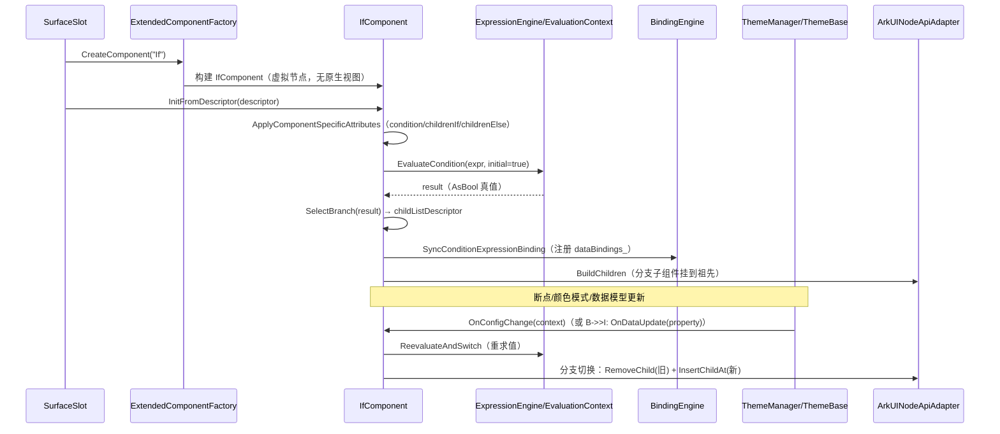
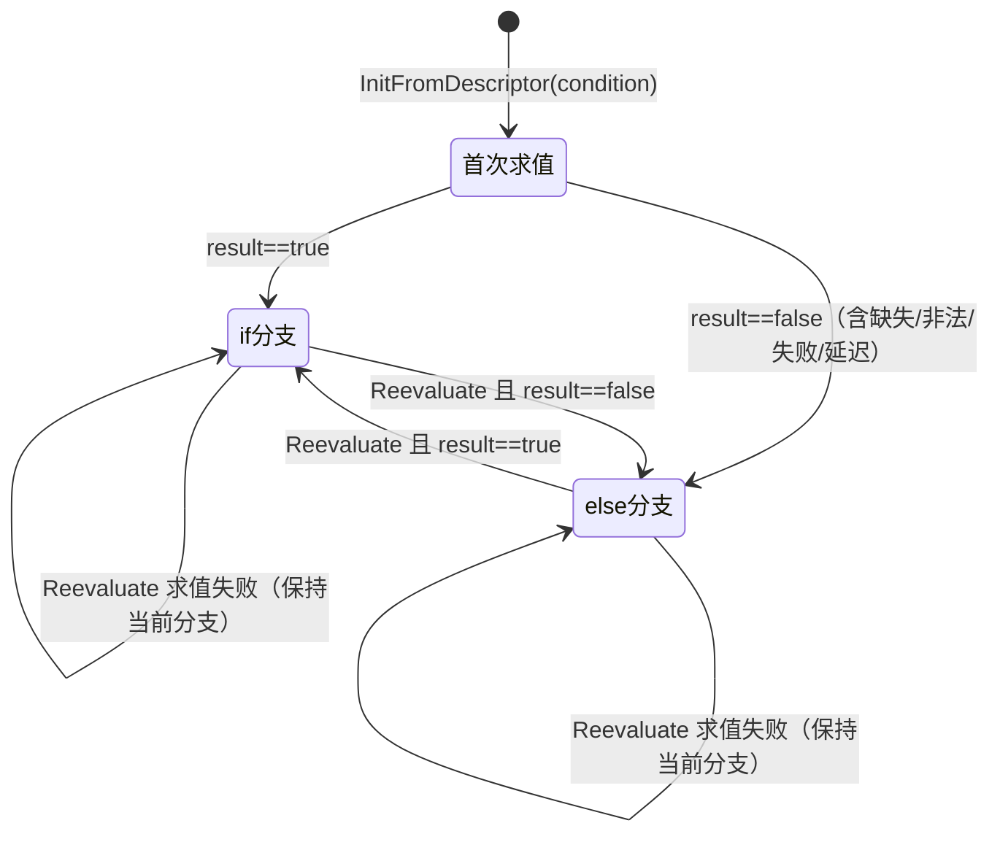

# 架构设计

> 确认目标仓和模块的架构约束、关键设计决策、Spec 拆分方向。

## 设计元数据

| Field | Content |
|-------|---------|
| Design ID | DESIGN-Func-07-04-15 |
| 关联需求 | 已有能力补录（无独立 requirement.md） |
| 关联 Epic | 无 |
| 目标 Feature | Feat-01 If 条件组件 |
| 复杂度 | 标准 |
| 目标版本 | A2UI 扩展协议 catalog `ohos.a2ui.extended.catalog`（`https://a2ui.org/specification/v0_9/extended_catalog.json`）+ 起始 API Version 20 |
| Owner | GenUI SIG |
| 状态 | Baselined（已有实现补录） |

## 需求基线

> 需求基线详见 proposal.md。以下仅列出设计阶段需要额外强调的要点。

| 项 | 补充说明 |
|----|---------|
| 补录而非新增 | 当前实现即规格，可疑行为只能标注为风险/备注 |
| 基准实现声明 | 条件组件域以 A2UIRender 全量渲染引擎（`GenerativeUI/A2UIRender`，`@arkui-genius/genui`）为基准实现 |
| 范围边界 | 本功能域（07-04-15）覆盖 1 个 A2UI 扩展条件组件：If（条件渲染）；通用布局/样式属性（width/height/margin/padding/accessibility 等）归通用样式域，且 If 为虚拟节点不支持样式/事件/accessibility |
| 组件分型 | If 为 native（C++）虚拟组件（`ExtendedComponentFactory` 注册），不产生原生节点；子组件经 passthrough 挂载到最近的含原生节点的祖先 |
| 协议身份 | If 属 A2UI 扩展协议 catalog（`ohos.a2ui.extended.catalog`），`component` 字段常量为 `If` |
| 与标准/扩展展示域差异 | If 不承载 `styles` 特有样式，仅三个专属键：`condition`（必填，表达式）、`childrenIf`（string[]）、`childrenElse`（string[]） |
| 表达式语义 | `condition` 求值走表达式引擎（`ExpressionEngine`），支持 `{{ ... }}` 包裹与 JS falsy 真值转换；全局变量 `__widthBreakpoint`/`__colorMode`/`__dataModel.*` 参与响应式切换 |

## 上下文和现状

### 涉及仓和模块

| 仓库 | 补充架构说明 |
|------|-------------|
| `GenerativeUI/A2UIRender` | 全量渲染引擎。ArkTS 层（`genui/src/main/ets/core/components/A2UI/A2UIExtendedComponents.ets`）声明扩展 catalog 项；C++ 层（`genui/src/main/cpp/components/extended/if/IfComponent.cpp/.h`）实现 If 虚拟组件；表达式引擎（`genui/src/main/cpp/expression/`）承担 condition 求值、变量解析与依赖收集；断点/主题通知链（`theme/`、`SurfaceManager`、`SurfaceControllerImpl`）触发响应式分支切换 |
| `GenerativeUI/Docs` | 开发者文档（`reference/extended-components/if.md`），仅作理解辅助，契约以 A2UIRender 实现为准 |

> 仓、模块、当前职责、影响类型详见 proposal.md「影响范围」。

### 调用链层级分析

| 层 | 模块 | 职责 | 修改类型 |
|----|------|------|---------|
| 1. 目录声明层（ArkTS） | `A2UIExtendedComponents.ets` | `EXTENDED_NATIVE_COMPONENT_NAMES` 含 `If`（`:44`）；`EXTENDED_NATIVE_SCHEMA_FILES['If']='ExtendedIf.json'`（`:63`）→ `createExtendedNativeSchema` 加载 schema 生成 `CatalogItem` | 现状 |
| 2. 工厂路由层（C++） | `ExtendedComponentFactory.cpp` | `RegisterBuiltInComponents()` 注册 `"If"` → `IfComponent`（`:126`） | 现状 |
| 3. 组件实现层（C++） | `IfComponent.cpp/.h` | 虚拟节点；`condition` 解析与校验；`childrenIf/childrenElse` 解析；分支选择 `SelectBranch`；重求值 `ReevaluateAndSwitch`；子组件 passthrough 挂载 | 现状 |
| 4. 表达式求值层（C++） | `ExpressionEngine` / `EvaluationContext` / `EvalResult` / `DependencyCollector` | condition 表达式解析求值；`__widthBreakpoint`/`__colorMode`/`__dataModel` 变量解析；JS falsy 真值转换（`EvalResult::AsBool`）；依赖收集 | 现状 |
| 5. 数据绑定层（C++） | `BindingEngine` / `SyncConditionExpressionBinding` | 把 condition 依赖注册为 `DataBinding`，数据模型更新时回调 `OnDataUpdate` 触发重求值 | 现状 |
| 6. 主题/断点通知层（C++/ArkTS） | `ThemeBase`/`ThemeManager`/`SurfaceManager` + `SurfaceControllerImpl`/`BreakpointUtils`/`NativeEngineBridge` | 断点/颜色模式更新 → `NotifyThemeChange` → `IfComponent::OnConfigChange` → 重求值；`NotifyGlobalExpressionVariableChanged("__widthBreakpoint"/"__colorMode")` | 现状 |
| 7. 原生节点适配层（C++） | `ArkUINodeApiAdapter` / `Component::BuildChildren`/`AttachStaticChildrenByIds` | 分支子组件经最近原生祖先节点插入/移除（passthrough），不产生 If 自身节点 | 现状 |

检查项：
- [x] 调用链每一层都已覆盖（目录→工厂→组件→表达式→绑定→主题/断点→原生适配）
- [x] 每层职责边界清晰（ArkTS 负责契约声明；C++ 负责虚拟组件、表达式求值、分支挂载）
- [x] 每层修改类型明确（均为「现状」，存量补录）

### 适用架构规则

| Rule ID | 适用原因 | 设计结论 | 验证方式 |
|---------|---------|---------|---------|
| OH-ARCH-LAYERING | ArkTS catalog → C++ native 虚拟组件 + 表达式引擎 | If 走 native C++ 路径（虚拟节点，不产生原生视图）；子组件挂载到最近原生祖先 | 架构评审/依赖检查 |
| OH-ARCH-SUBSYSTEM | 单仓 + 独立 Docs 仓，无跨子系统 | 不引入子系统外依赖 | 依赖检查 |
| OH-ARCH-API-LEVEL | 无 ArkTS 公开 API、无 C-API（组件经协议 DSL 声明） | 无新增 Public/System API，无权限 | API 评审 |
| OH-ARCH-COMPONENT-BUILD | 现状无 BUILD.gn/bundle.json 变更 | 无构建影响 | 构建验证 |
| OH-ARCH-ERROR-LOG | condition/分支非法或缺省走 schema warning（`ERROR_CODE_REQUIRED_MISS`/`ERROR_CODE_INVALID_VALUE`/`ERROR_CODE_TYPE_MISMATCH`/`ERROR_CODE_UNDEFINED_FIELD`） | 非法回落 childrenElse 或空分支 + schema warning | UT/hilog |

## 不涉及项承接

> proposal.md 已完成 N/A 判定。本节仅对标记「涉及」且需展开设计的维度给出结论。

| 维度 | 设计结论 |
|------|---------|
| 跨进程/SA | 不涉及（同进程 ArkTS↔C++ 经 NAPI） |
| 持久化 | 不涉及（分支状态仅内存态，随 surface 生命周期） |
| 权限 | 不涉及 |
| 样式/事件/无障碍 | 不涉及本域（If 为虚拟节点，`ApplyComponentSpecificStyles`/`RegisterClickHandler`/`RegisterComponentSpecificListeners` 均为空实现，不支持样式、事件与 accessibility——见 `IfComponent.cpp:302-310`） |
| 通用布局/样式属性 | 不涉及本域（width/height/margin/padding 等归通用样式域） |
| 深色/浅色模式 | 涉及（`$__colorMode` 可作为 condition 表达式变量，颜色模式切换经 `OnConfigChange` 触发重求值）——详见 Feat-01 |
| 断点/响应式布局 | 涉及（`$__widthBreakpoint` 可作为 condition 表达式变量，断点切换经 `OnConfigChange` + `NotifyGlobalExpressionVariableChanged` 触发重求值）——详见 Feat-01 |
| 多设备适配 | 涉及（断点分桶 XS/SM/MD/LG/XL 影响 `$__widthBreakpoint` 求值结果）——详见 Feat-01 |

## 关键设计决策

| 决策 ID | 问题 | 推荐方案 | 探索过的替代方案 | 取舍理由 | 影响 |
|--------|------|---------|----------------|---------|------|
| ADR-1 | If 是否产生原生节点 | 虚拟节点：`CreateArkUINode()` 恒返回 `true`（不创建原生视图），子组件经 passthrough 挂载到最近含原生节点的祖先（`IfComponent.cpp:243-246`、`OnAddChild`/`OnRemoveChild` `:371-404`） | (a) 用 Stack 等容器节点包裹分支；(b) 每分支各建容器节点 | 条件组件不应在渲染树中占位，直接透传可避免多余节点并保持兄弟顺序 | 分支切换需在祖先节点上做 InsertChildAt/RemoveChild，插入索引经 `ResolveBranchNativeInsertIndex`/`ResolvePassthroughNativeInsertIndex` 计算（`:135-161`） |
| ADR-2 | condition 值类型 | 声明为 `PropertyValueType::BOOLEAN`（`allowDynamic`/`allowExpression`），但 schema 约定为 `Expression` 字符串；number 字面量经 `NumberToConditionExpression` 强转字符串并告 `TYPE_MISMATCH`（`IfComponent.cpp:269-272`、`:312-322`） | (a) 仅接受 string 表达式；(b) 仅接受 bool | 兼容「字符串表达式」为主流、但容忍 number 字面量（按 truthiness 强转）的旧 DSL | number 字面量走 truthiness（0→else，非 0→if）；bool/object/array 类型直接告 `TYPE_MISMATCH` 并回落 else |
| ADR-3 | condition 真值语义 | 统一经 `EvalResult::AsBool` 做 JS falsy 转换：number≠0 且非 NaN→true，string 非空→true，JSON 经 `ToBool`，null/undefined→false（`EvalResult.h:194-210`） | (a) 仅接受布尔结果；(b) 严格类型校验 | 对齐 A2UI/JS 表达式语义，便于宿主复用前端真值直觉 | 非布尔 falsy 结果（0/''/null/NaN）告 `INVALID_VALUE` 但仍按 false 走 else（`ShouldReportInvalidFalsyConditionResult` `:163-175`） |
| ADR-4 | 首次求值失败 vs 重求值失败 | 首次（`initialized_` 前）失败 → 回落 childrenElse；已初始化后失败 → 保持当前分支不变（`ReevaluateAndSwitch` `:417-435`） | (a) 失败恒回落 else；(b) 失败恒保持 | 首屏保守走 else 避免误挂载；运行期短暂求值失败不应抖动分支 | 运行期稳定性优先，代价是失败后分支可能短暂陈旧 |
| ADR-5 | dataModel 延迟注入 | 首次求值引用 `$__dataModel` 且数据模型尚未到达时，判为「延迟求值」，不告警并保持默认分支；数据模型更新后重求值切换（`IsDeferredConditionEvaluation` `:177-190`） | (a) 首次即告警回落 else；(b) 阻塞等待 | 流式场景下 dataModel 常晚于组件到达，避免误告警与误渲染 | 依赖 `SurfaceSlot::HasReceivedDataModelUpdate` 判定数据是否已就绪 |
| ADR-6 | 分支子组件复用 | 分支切换时子组件按 id 在 surface 的 `allComponents` 中查找并复用同一指针（`ReconcileBranchChildren`→`AttachStaticChildrenByIds` `:653-657`）；同 id 同时出现在两分支则恒挂载 | (a) 切换即销毁重建；(b) 缓存但重挂 | 保留子树状态（滚动位置、输入框等），减少重建成本 | 挂载/卸载经原生祖先 InsertChildAt/RemoveChild，子组件对象本身不销毁 |

## 设计骨架

### 骨架范围

| 骨架项 | 目标 | 不包含 | 验证方式 |
|--------|------|--------|---------|
| If 条件组件 | 固化 `condition`（表达式 + JS falsy）、`childrenIf`/`childrenElse` 契约，虚拟节点 + passthrough 分支挂载，断点/颜色/数据模型驱动的响应式切换 | 样式/事件/accessibility（虚拟节点不支持）；通用布局属性（归通用样式域） | C++ UT（`IfComponentTest.cpp` / `IfComponentIntegrationTest.cpp`） |

### 骨架 Spec 拆分

| Task ID | 目标 | 受影响文件 | AC |
|---------|------|----------|-----|
| TASK-SKELETON-1 | Feat-01 If 条件组件基线 | `components/extended/if/IfComponent.cpp/.h`、`components/extended/ExtendedComponentFactory.cpp`、`ets/core/components/A2UI/A2UIExtendedComponents.ets`、`rawfile/schema/Extended/components/ExtendedIf.json` | AC-1.1~6.x |

## 后续 Task 拆分

| Task ID | 目标 | 受影响文件 | 依赖 |
|---------|------|----------|------|
| T-1 | Feat-01 If 条件组件（基线，本设计已承接） | `Feat-01-if-conditional-spec.md` + 本 design.md | — |

## API 签名、Kit 与权限

> 本节承接 spec.md「API 变更分析」中识别的 API，给出签名、权限和 d.ts 位置等实现细节。

### 新增 API

无新增。本特性覆盖既有组件契约（存量补录），无 ArkTS 公开 API、无 C-API。

### 变更/废弃 API

| 原有 API | 变更类型 | 新 API | 迁移说明 |
|---------|---------|--------|---------|
| `CatalogItem`（`A2UIExtendedComponents.allA2UIExtendedComponents()` 内 `If` 项） | 既有 | — | 扩展目录注册入口（native 名 + schema） |
| `ExtendedComponentFactory::RegisterBuiltInComponents()`（`"If"`） | 既有 | — | If 的 native 工厂注册 |

> d.ts 位置：`genui/src/main/ets/core/components/A2UI/A2UIExtendedComponents.ets`（ArkTS 源即契约，无独立 SDK `.d.ts`）。Kit：`@arkui-genius/genui`；权限：无；SysCap：不适用。

## 构建系统影响

### BUILD.gn 变更

无变更（存量补录）。`genui/src/main/cpp/components/extended/if/` 已纳入现有 `liba2ui_native.so` 构建目标（`cmake/A2UISources.cmake` 引用）。

### bundle.json 变更

无变更。

## 可选设计扩展

### 架构图

```mermaid
graph TB
  subgraph ArkTS["ArkTS 层（@arkui-genius/genui）"]
    CAT["A2UIExtendedComponents.ets<br/>EXTENDED_NATIVE_COMPONENT_NAMES 含 If<br/>schema ExtendedIf.json"]
    CTRL["SurfaceControllerImpl / BreakpointUtils<br/>updateBreakpoint(breakpoint)"]
  end
  subgraph CPP["C++ 层（liba2ui_native.so）"]
    FACTORY["ExtendedComponentFactory<br/>RegisterComponent(\"If\")"]
    IF["IfComponent（虚拟节点）<br/>condition 解析 / SelectBranch<br/>ReevaluateAndSwitch / passthrough"]
    EXPR["ExpressionEngine / EvaluationContext<br/>EvalResult.AsBool（JS falsy）<br/>DependencyCollector"]
    BIND["BindingEngine<br/>dataBindings_ / OnDataUpdate"]
    THEME["ThemeBase/ThemeManager/SurfaceManager<br/>OnConfigChange / NotifyGlobalVariableChanged"]
    ADAP["ArkUINodeApiAdapter<br/>祖先节点 InsertChildAt/RemoveChild"]
  end
  DSL["updateComponents DSL<br/>catalogId=ohos.a2ui.extended.catalog"]
  DSL --> CAT --> FACTORY --> IF
  IF --> EXPR
  EXPR --> BIND
  CTRL --> THEME --> IF
  THEME --> BIND
  IF --> ADAP
  ADAP -.分支子组件挂到最近原生祖先.-> PARENT["祖先原生节点（Column/Row/Stack…）"]
```

### 数据流/控制流

| 步骤 | 调用方 | 被调用方 | 数据/接口 | 说明 |
|------|--------|---------|----------|------|
| 1 | 宿主 | `SurfaceSlot::UpdateComponents` | components[] 描述符 | 组件增量更新入口 |
| 2 | `SurfaceSlot` | `ExtendedComponentFactory::CreateComponent` | `component` 短名 | 按 `If` 路由到 `IfComponent` |
| 3 | `IfComponent` | `ApplyComponentSpecificAttributes` | normalizedDescriptor | 解析 `condition`（string/number/缺失/非法）与 `childrenIf`/`childrenElse` |
| 4 | `IfComponent` | `EvaluateCondition` → `EvaluateConditionWithExpressionEngine` | condition 表达式 | 表达式引擎求值 + 真值转换 + 依赖收集 |
| 5 | `IfComponent` | `SyncConditionExpressionBinding` | 依赖列表 | 注册 `DataBinding`（含 dataModel 路径） |
| 6 | `IfComponent` | `SelectBranch(result)` | `childListDescriptor_` | 设 STATIC_IDS 为 if/else 分支 id 列表 |
| 7 | `Component` | `BuildChildren`/`AttachStaticChildrenByIds` | 子组件映射 | 按 id 从 surface 复用并挂载分支子组件 |
| 8 | `IfComponent` | `OnDataUpdate`/`OnConfigChange` | property / ThemeContext | 依赖命中或断点/颜色/数据模型变化 → `ReevaluateAndSwitch` |
| 9 | `ArkUINodeApiAdapter` | 祖先原生节点 | InsertChildAt/RemoveChild | 分支子组件落到最近原生祖先 |

### 时序设计



### 数据模型设计

**API 层（ArkTS，公开契约）**

```typescript
// ets/core/components/A2UI/A2UIExtendedComponents.ets
// EXTENDED_NATIVE_COMPONENT_NAMES 含 'If'（:44）
// EXTENDED_NATIVE_SCHEMA_FILES['If'] = 'ExtendedIf.json'（:63）
// createExtendedNativeSchema 经 SchemaResourceLoader.loadSchema('schema/Extended/components/ExtendedIf.json')
```

**Framework 层（C++）**

```cpp
// components/extended/if/IfComponent.h
// class IfComponent : public ExtendedComponent（:34）
// 成员：
//   std::string conditionExpression_;              // 条件表达式原始串（:63）
//   bool currentBranch_ = true;                    // 当前分支（if=true / else=false）（:64）
//   std::vector<Dependency> dependencies_;         // 收集到的依赖（:65）
//   std::list<std::string> childrenIfIds_;         // if 分支 id（:66）
//   std::list<std::string> childrenElseIds_;       // else 分支 id（:67）
//   bool initialized_ = false;                     // 是否完成首次求值（:68）
//   ThemeContext lastThemeContext_;                // 最近一次主题上下文（:69）
//   bool themeContextValid_ = false;               // 主题上下文是否有效（:70）

// components/extended/if/IfComponent.cpp
// constexpr char SCHEMA_ERROR_CODE_REQUIRED_MISS[]  = "ERROR_CODE_REQUIRED_MISS";   // :44
// constexpr char SCHEMA_ERROR_CODE_INVALID_VALUE[]  = "ERROR_CODE_INVALID_VALUE";   // :45
// constexpr char SCHEMA_ERROR_CODE_TYPE_MISMATCH[]  = "ERROR_CODE_TYPE_MISMATCH";   // :46
// constexpr char SCHEMA_ERROR_CODE_UNDEFINED_FIELD[] = "ERROR_CODE_UNDEFINED_FIELD"; // :47
// constexpr char CONDITION_PROPERTY_NAME[] = "condition";                           // :48
```

| 结构 | 存储方案 | 生命周期 |
|------|---------|---------|
| `conditionExpression_` | `std::string` | 组件创建/更新，`ApplyComponentSpecificAttributes` 写入 |
| `currentBranch_` | `bool`（默认 true） | 每次 `SelectBranch` 更新 |
| `childrenIfIds_`/`childrenElseIds_` | `std::list<std::string>` | 组件创建/更新 |
| `dependencies_` | `std::vector<Dependency>` | 每次求值经 `CollectConditionDependencies` 重算 |
| `childListDescriptor_` | `ChildListDescriptor`（STATIC_IDS） | `SelectBranch` 写入选中分支 id 列表 |
| `dataBindings_` | `std::vector<DataBinding>`（基类） | `SyncConditionExpressionBinding` 写入，含 dataModel 路径 |

### 算法与状态机



真值转换算法（`EvalResult::AsBool`，`EvalResult.h:194-210`）：

```
AsBool(result):
  BOOLEAN  -> result.boolValue
  NUMBER   -> (numberValue != 0) && !isnan(numberValue)
  STRING   -> !stringValue.empty()
  JSON     -> jsonValue.ToBool(false)
  NULL/UNDEFINED -> false
```

### 测试性设计

| 测试层级 | 测试目标 | Mock 策略 | 验证方式 |
|---------|---------|----------|---------|
| C++ UT | condition 解析/真值转换/告警码 | `SchemaWarningTestHelper` 注册告警回调 | `IfComponentTest.cpp`（`should_*` 系列） |
| C++ UT | 分支切换/依赖匹配/延迟 dataModel | Mock `SurfaceSlot` + `BindingEngine` | `IfComponentTest.cpp` |
| C++ UT | passthrough 挂载（InsertChildAt/RemoveChild） | `NativeApiTrackerScope` 劫持原生 API | `IfComponentTest.cpp`（BR-02 系列） |
| C++ UT | 断点/颜色模式/数据模型端到端切换 | `A2UIComponentTddTest` + `SurfaceSlot` | `IfComponentIntegrationTest.cpp` |
| ohosTest | If 端到端渲染 | — | `entry/src/ohosTest/` |

### 接口参数规约

| 接口 | 参数 | 类型 | 合法范围 | 非法处理 | 边界说明 |
|------|------|------|---------|---------|---------|
| If | condition | string（Expression） | `{{ ... }}` 或裸表达式；可引用 `__widthBreakpoint`/`__colorMode`/`__dataModel.*` | 缺失→`REQUIRED_MISS`+else；空串→`INVALID_VALUE`+else；bool/object/array→`TYPE_MISMATCH`+else | 必填；number 字面量强转 truthiness 并告 `TYPE_MISMATCH` |
| If | childrenIf | string[] | 每元素为同 components 内组件 id | 非数组→`TYPE_MISMATCH`+空；非字符串元素跳过并告 `TYPE_MISMATCH`；id 不存在→`UNDEFINED_FIELD`+跳过 | 可选，默认 [] |
| If | childrenElse | string[] | 每元素为同 components 内组件 id | 同 childrenIf | 可选，默认 [] |

### 线程与并发模型

| 操作 | 发起线程 | 回调线程 | 跨进程边界 | 线程安全 | 重入约束 |
|------|---------|---------|----------|---------|---------|
| condition 求值与分支切换 | UI | UI | 无 | 单线程 UI | 处理中不可销毁 |
| 断点/颜色/数据模型通知 | UI | UI | 无 | 单线程 | — |
| 原生节点 InsertChildAt/RemoveChild | UI | UI | 无 | 单线程 | — |

## 详细设计

### If 虚拟节点与属性解析

`IfComponent` 继承 `ExtendedComponent`（`IfComponent.h:34`），构造时经 `ExtendedComponent(nullptr, false, false)` 声明无原生视图（`IfComponent.cpp:234`）。`CreateArkUINode()` 恒返回 `true`（`:243-246`）——即「虚拟节点」：不产生 ArkUI 原生节点，`GetNativeView()` 为 null。`GetType()` 返回 `"If"`（`:238-241`）。`CollectChildListDescriptor` 清空子列表描述符（`:248-252`），因为分支子组件由 `SelectBranch` 动态写入 STATIC_IDS。

属性解析集中在 `ApplyComponentSpecificAttributes`（`:254-300`）：

- `condition`（`:261-286`）：`IsString` → 取串，空串告 `INVALID_VALUE`；`IsNumber` → `NumberToConditionExpression` 强转（`setprecision(17)`，`:192-203`）并告 `TYPE_MISMATCH`；其余类型 → 告 `TYPE_MISMATCH` 回落；缺省 → 告 `REQUIRED_MISS`。最终写入 `conditionExpression_`。
- `childrenIf`/`childrenElse`（`:288-293`）：经 `ParseStringArray`（`:437-463`），非数组告 `TYPE_MISMATCH` 回落空列表；逐元素跳过非字符串并告 `TYPE_MISMATCH`。
- 求值与分支（`:295-299`）：首次 `EvaluateCondition(expr, evalSucceeded, true)` → `SyncConditionExpressionBinding` → `SelectBranch(result)` → `initialized_ = true`。

`GetPrivatePropertyDeclaration("condition")` 返回 `PropertyValueType::BOOLEAN`（`allowDynamic`/`allowExpression`、`fallbackBool=false`）（`:312-322`）；非 `condition` 委托基类。`IsKnownAdditionalDescriptorKey` 承认 `condition`/`childrenIf`/`childrenElse` 三个额外键（`:324-330`）。

### condition 表达式求值与真值语义

求值入口 `EvaluateCondition`（`:514-533`）：表达式为空直接返回 false；`ENABLE_EXPRESSION_ENGINE` 下委派 `EvaluateConditionWithExpressionEngine`（`:482-511`），否则告 `INVALID_VALUE` 并返回 false。表达式经 `{{ ... }}` 自动包裹（`Engine.IsExpression` 判断，`:488`），随后：

1. `SetupConditionEvaluationContext`（`:466-480`）注入全局变量（`InjectGlobalVariables`，`:569-593` 设主题上下文）与 dataModel（`surfaceSlot->GetOrCreateDataModel()`）。
2. 求值后 `result.IsUndefined()` → 返回 false（不告警，`evalSucceeded` 保持 false）（`:491-497`）。
3. `IsDeferredConditionEvaluation`（`:177-190`）——首次求值有错、引用 `$__dataModel` 且 surface 尚未收到数据模型 → 返回 false（延迟，不告警）。
4. `ShouldReportInvalidFalsyConditionResult`（`:163-175`）——结果为 number 0/NaN、空串、null 等 falsy 非布尔 → 告 `INVALID_VALUE`。
5. 否则 `evalSucceeded=true`，返回 `result.AsBool()`。

真值转换见 `EvalResult::AsBool`（`EvalResult.h:194-210`）。全局变量解析见 `EvaluationContext::ResolveVariable`（`EvaluationContext.cpp:26-72`）：`__widthBreakpoint` → `BreakpointToString(themeContext.breakpoint)`（无主题上下文回落 `"sm"`）、`__colorMode` → `ColorModeToString`（回落 `"light"`）、`__dataModel` → dataModel 根；`__` 前缀未知全局 → `EVAL_NO_GLOBAL_VARIABLE` 错误并返回空串（带错误标记）。

### 分支选择与子组件挂载

`SelectBranch(result)`（`:595-607`）把 `childListDescriptor_` 设为 `ChildListType::STATIC_IDS`，`staticChildIds` 取 `childrenIfIds_` 或 `childrenElseIds_`（空则无子组件）。子组件实际挂载经 `BuildBranchChildren`/`ReconcileBranchChildren`（`:630-657`）→ `AttachStaticChildrenByIds`（按 id 从 surface `allComponents` 查找并复用）。

若分支子组件 id 在 `allComponents` 中不存在，`ReportMissingBranchChildren`（`:638-651`）告 `UNDEFINED_FIELD` 并跳过。同 id 同时出现在两分支时恒挂载（复用同一指针），切换分支不销毁未选中子组件对象，仅经祖先原生节点 InsertChildAt/RemoveChild 增减。

### 响应式重求值

重求值统一入口 `ReevaluateAndSwitch`（`:417-435`）：求值失败且已初始化 → 保持当前分支；结果未变 → 短路返回；结果变化 → `SelectBranch` 并 `ReconcileBranchChildren` 更新挂载。触发来源：

- `OnDataUpdate`（`:341-369`）：property 为 `condition` → 直接重求值；否则命中 `dependencies_`（精确匹配、`dep.variableName + "."` 前缀、`$`+path 前缀）才重求值。
- `OnConfigChange`（`:332-339`）：主题/断点/颜色模式变化，缓存 `lastThemeContext_` 并在 `initialized_` 且 condition 非空时重求值。
- 全局变量通知：`SurfaceManager::UpdateBreakpoint`（`SurfaceManager.cpp:303-325`）经 `ThemeManager::NotifyThemeChange`（`ThemeManager.cpp:108-129`）触发每个组件 `OnConfigChange`，并经 `NotifyGlobalExpressionVariableChanged("__widthBreakpoint")` 通知 `BindingEngine`。

### 断点重渲染链路（ArkTS→C++）

ArkTS 侧 `SurfaceControllerImpl.updateBreakpoint`（`SurfaceControllerImpl.ets:1175-1189`）在断点变化时经 `NativeEngineBridge.updateBreakpoint`（`NativeEngineBridge.ets:402-408`）下发；`updateBreakpointByWidth`（`:1192-1201`）先经 `BreakpointUtils.resolveBreakpoint`（`BreakpointUtils.ets:19-33`，`<320 XS`、`<600 SM`、`<840 MD`、`<1440 LG`、否则 `XL`）换算。C++ 侧 `NativeEntry::UpdateBreakpoint`（`NativeEntry.cpp:2225`）→ `SurfaceManager::UpdateBreakpoint`（`SurfaceManager.cpp:303`）→ 逐 surface `ThemeManager::UpdateBreakpoint`（`ThemeManager.cpp:35-38`）+ `NotifyThemeChange` + `NotifyGlobalExpressionVariableChanged("__widthBreakpoint")`。If 组件经 `OnConfigChange` 重求值，引用 `$__widthBreakpoint` 的条件随之切换分支。

## 风险和开放问题

| 项 | 类型 | 影响 | 处理方式 | Owner |
|----|------|------|---------|-------|
| RISK-1 求值失败告警语义与文档不一致：`render_docs/reference/extended-components/if.md` 称「表达式结果为 undefined → `INVALID_VALUE`」，但源码对 `{{ missingVar.field }}`（成员路径求值 undefined，`EVAL_PATH_NOT_FOUND`）不告警（`IfComponent.cpp:491-497` 提前 return），而对裸未定义变量 `{{ missingVar }}` 与 number 0/空串/null/NaN 告 `INVALID_VALUE`（测试 `IfComponentTest.cpp:297-309` vs `:311-325`） | 测试 | 中 | 以源码为准（`IfComponent.cpp:482-533`）；Feat-01 风险表标注 | GenUI SIG |
| RISK-2 number 字面量 condition 语义：源码接受 number 并按 truthiness 强转（`IfComponent.cpp:269-272`），schema（`ExtendedIf.json:15-18`）仅声明 `Expression`（string）——DSL 下发 number 会触发 `TYPE_MISMATCH` 告警但仍可渲染 | 测试 | 中 | 以源码为准（`IfComponent.cpp:269-272`）；Feat-01 标注 | GenUI SIG |
| RISK-3 condition 声明类型与实际契约不一致：`GetPrivatePropertyDeclaration` 声明 `BOOLEAN`（`IfComponent.cpp:317-321`），实际接受 string 表达式/number | 架构 | 低 | 以源码行为为准，声明类型仅供内部 fallback 语义 | GenUI SIG |
| RISK-4 `__widthBreakpoint` 默认回落 `"sm"`、`__colorMode` 默认回落 `"light"`（`EvaluationContext.cpp:30-38`），无主题上下文时可能误导条件求值 | 架构 | 低 | Feat-01 标注；默认值常量 | GenUI SIG |
| RISK-5 If 为虚拟节点不支持样式/事件/accessibility（`IfComponent.cpp:302-310`），DSL 下发 `styles`/`onClick`/`accessibility` 会被忽略或告警 | 架构 | 中 | schema `ExtendedIf.json:39` 已声明「virtual node」；Feat-01 标注 | GenUI SIG |

## 设计审批

- [x] 需求基线已确认，设计覆盖 P0/P1 AC
- [x] 不涉及项已承接，N/A 和展开项都有结论
- [x] 涉及仓和模块职责清楚
- [x] 调用链层级分析完整，每层覆盖到位
- [x] 适用架构规则已识别并形成设计结论
- [x] 分层和子系统边界合规
- [x] API 变更有签名、权限、错误码和兼容性说明
- [x] BUILD.gn/bundle.json 影响明确
- [x] 设计输出和后续 Task 拆分明确
- [x] 关键设计决策有理由和影响说明
- [x] 风险和开放问题有 Owner

**结论:** 通过（已有实现补录）
