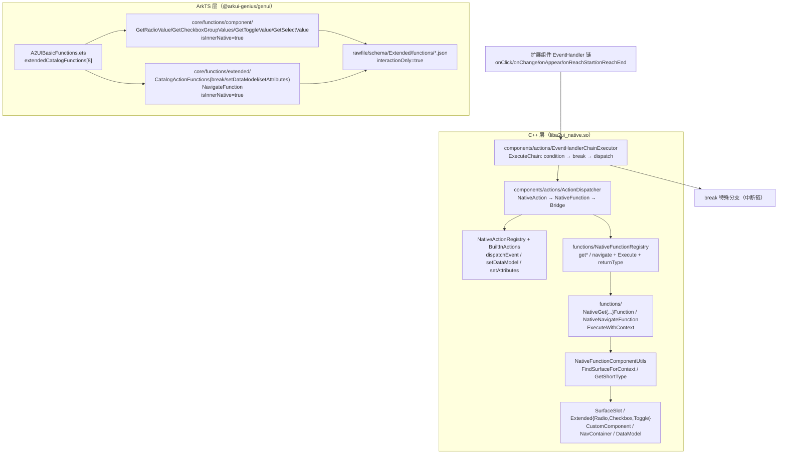
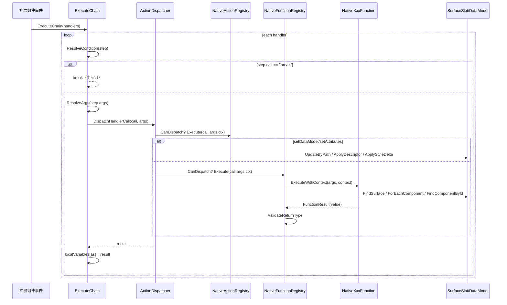

# 架构设计

> 确认目标仓和模块的架构约束、关键设计决策、Spec 拆分方向。

## 设计元数据

| Field | Content |
|-------|---------|
| Design ID | DESIGN-Func-07-04-16 |
| 关联需求 | 已有能力补录（无独立 requirement.md） |
| 关联 Epic | 无 |
| 目标 Feature | Feat-01 getRadioValue；Feat-02 getCheckboxGroupValues；Feat-03 getToggleValue；Feat-04 getSelectValue；Feat-05 break；Feat-06 setDataModel；Feat-07 setAttributes；Feat-08 navigate |
| 复杂度 | 标准 |
| 目标版本 | A2UI 鸿蒙扩展协议（`ohos.a2ui.extended.catalog`）+ API Version 20 |
| Owner | GenUI SIG |
| 状态 | Baselined（已有实现补录） |

## 需求基线

> 需求基线详见 proposal.md。以下仅列出设计阶段需要额外强调的要点。

| 项 | 补充说明 |
|----|---------|
| 补录而非新增 | 当前实现即规格，可疑行为只能标注为风险/备注，不做修改 |
| 基准实现声明 | 扩展协议函数以 A2UIRender 全量渲染引擎（`GenerativeUI/A2UIRender`，`@arkui-genius/genui`）为基准实现 |
| 范围边界 | 本功能域（07-04-16）覆盖 8 个扩展协议内置函数：组件取值 4 个（`getRadioValue`/`getCheckboxGroupValues`/`getToggleValue`/`getSelectValue`）、动作/流转 3 个（`break`/`setDataModel`/`setAttributes`）、导航 1 个（`navigate`） |
| 三条分发路径 | 8 函数按运行时承载形态分三路分发：① 组件取值 + 导航（`get*`/`navigate`）经 `NativeFunctionDispatch→NativeFunctionRegistry::ExecuteWithContext`（C++ 原生函数）；② 数据/属性动作（`setDataModel`/`setAttributes`）经 `NativeActionDispatch→NativeActionRegistry`（`BuiltInActions.cpp` 动作 handler）；③ `break` 既不在函数注册表也不在动作注册表，由 `EventHandlerChainExecutor::ExecuteChain` 特殊识别中断链 |
| 受限用途 | 8 函数均以 `interactionOnly: true` 的 schema 声明，仅用于 Action EventHandler 链（`onClick`/`onAppear`/`onChange`/`onReachStart`/`onReachEnd`）或 `action.event.context` 动态值；不可用于组件属性静态求值 |
| 双实现声明 | ArkTS 层仅注册目录项与 schema（`isInnerNative: true`，`loadExtendedFunctionSchema`），运行逻辑全部下沉 C++（`setDataModel`/`setAttributes` 为动作 handler，其余为原生函数） |
| 编码期契约分歧 | Docs 对 `navigate` 描述为 `url, params?`），对 `setAttributes` 描述为 `id, attributes`，均与 schema/代码（`componentId`+`targetComponentId` / `componentId`+`value`）不符，以代码为准（见 RISK） |

## 上下文和现状

### 涉及仓和模块

| 仓库 | 补充架构说明 |
|------|-------------|
| `GenerativeUI/A2UIRender` | 全量渲染引擎。ArkTS 目录注册层（`genui/src/main/ets/core/functions/component/{GetRadioValue,GetCheckboxGroupValues,GetToggleValue,GetSelectValue}Function.ets`、`genui/src/main/ets/core/functions/extended/{CatalogActionFunctions,NavigateFunction}.ets`、`genui/src/main/ets/core/functions/A2UIBasicFunctions.ets`）；C++ 原生实现层（`genui/src/main/cpp/functions/{NativeGetRadioValue,NativeGetCheckboxGroupValues,NativeGetToggleValue,NativeGetSelectValue}Function.cpp`、`functions/extended/NativeNavigateFunction.cpp`、`functions/NativeFunctionComponentUtils.h`、`functions/NativeFunctionRegistry.cpp`、`components/actions/{EventHandlerChainExecutor,ActionDispatcher,NativeActionRegistry,BuiltInActions}.cpp`） |
| `GenerativeUI/Docs` | 开发者文档（`reference/functions/{extension-functions,component-value}.md`、`concepts/actions-and-functions.md`），仅理解辅助，契约以 A2UIRender 实现为准（Docs 存在描述滞后，见风险表） |

> 仓、模块、当前职责、影响类型详见 proposal.md「影响范围」。

### 调用链层级分析

| 层 | 模块 | 职责 | 修改类型 |
|----|------|------|---------|
| 1. 目录注册层（ArkTS） | `component/Get{RadioValue,CheckboxGroupValues,ToggleValue,SelectValue}Function.ets`、`extended/NavigateFunction.ets`、`extended/CatalogActionFunctions.ets`（`break`/`setDataModel`/`setAttributes`） | 声明函数名（`super('<name>')`）、`isInnerNative: true`、`loadExtendedFunctionSchema('<name>.json')` | 现状（基准实现） |
| 2. 函数聚合层（ArkTS） | `A2UIBasicFunctions.ets` | 将 8 函数纳入 `extendedCatalogFunctions`（`:63-72`），经 `allA2UIExtendedFunctions()` / `getAllBuiltinFunctions()` 导出目录项 | 现状 |
| 3. 类型契约层（ArkTS/schema） | `rawfile/schema/Extended/functions/*.json` | 固化 8 函数 `call` 常量、`args` 结构、`returnType`、`interactionOnly: true` | 现状 |
| 4. Handler 链执行层（C++） | `components/actions/EventHandlerChainExecutor.cpp` | `ExecuteChain` 逐 handler：`ResolveCondition`（条件跳过）→ `break` 特殊中断 → `ResolveArgs`（递归解析动态值/表达式）→ `DispatchHandlerCall` 分发；`as` 局部变量回填 | 现状 |
| 5. Action 分发层（C++） | `components/actions/ActionDispatcher.cpp` | `CreateDefaultDispatchers` 依序构造 `NativeActionDispatcher → NativeFunctionDispatcher → BridgeFunctionDispatcher`，`CanDispatch` 命中即分发 | 现状 |
| 6. 原生动作注册层（C++） | `components/actions/NativeActionRegistry.cpp` + `BuiltInActions.cpp` | `RegisterBuiltInActions` 注册 `dispatchEvent`/`setDataModel`/`setAttributes`（`BuiltInActions.cpp:203-208`）；`Execute` 查表调用 handler | 现状 |
| 7. 原生函数注册层（C++） | `functions/NativeFunctionRegistry.cpp` | 构造器 `Register` `getToggleValue`/`getRadioValue`/`getSelectValue`/`getCheckboxGroupValues`/`navigate`（`:81-85`）；`Execute` 统一异常捕获 + `returnType` 校验 | 现状 |
| 8. 原生函数实现层（C++） | `functions/NativeGet{...}Function.cpp`、`functions/extended/NativeNavigateFunction.cpp` | 各函数 `GetName()` / `Execute`（direct 桩）/ `ExecuteWithContext` 判定逻辑，返回 `FunctionResult` | 现状 |
| 9. 组件工具层（C++） | `functions/NativeFunctionComponentUtils.h` | `FindSurfaceForContext`（renderId→RenderSlot→SurfaceManager→Surface）、`GetShortType`（取末段类型名） | 现状 |
| 10. 组件/数据模型层（C++） | `SurfaceSlot`、`Extended{Radio,Checkbox,Toggle}Component`、`CustomComponent`、`NavContainerComponent`、`DataModel` | `FindComponentById`/`ForEachComponent`/`ForEachRuntimeState`、`GetGroup`/`GetChecked`/`GetIsOn`、`NavigateToTargetComponent`、`UpdateByPath`/`NotifyPathUpdate` | 现状 |

检查项：
- [x] 调用链每一层都已覆盖（目录注册 → 函数聚合 → 类型契约 → Handler 链 → Action 分发 → 动作/函数双注册 → 原生实现 → 组件工具 → 组件/数据模型）
- [x] 每层职责边界清晰（ArkTS 只注册契约与 schema；`break` 属链控制器；`setDataModel`/`setAttributes` 属动作注册表；`get*`/`navigate` 属函数注册表）
- [x] 每层修改类型明确（均为「现状」，存量补录）

### 适用架构规则

| Rule ID | 适用原因 | 设计结论 | 验证方式 |
|---------|---------|---------|---------|
| OH-ARCH-LAYERING | ArkTS 目录层 → C++ 原生层跨语言调用 | 调用方向自顶向下；ArkTS 不承载运行逻辑，仅注册 `isInnerNative: true` 契约 | 架构评审/依赖检查 |
| OH-ARCH-SUBSYSTEM | 单仓 + 独立 Docs 仓，无跨子系统 | 不引入子系统外依赖 | 依赖检查 |
| OH-ARCH-API-LEVEL | 扩展函数以 DSL `call`/`args` 暴露，无独立 ArkTS 公共 API / C-API | 无新增权限；Kit `@arkui-genius/genui` | API 评审 |
| OH-ARCH-COMPONENT-BUILD | 现状无 BUILD.gn/bundle.json 变更 | 无构建影响 | 构建验证 |
| OH-ARCH-ERROR-LOG | 取值/导航失败返回空值（`""`/`{}`/`[]`/`false`），`setDataModel`/`setAttributes` 非法入参仅 `LOG_WARN`，均不产生错误码 | 失败语义契约详见各 Feat 规则表 | UT |

## 不涉及项承接

> proposal.md 已完成 N/A 判定。本节仅对标记「涉及」且需展开设计的维度给出结论。

| 维度 | 设计结论 |
|------|---------|
| 跨进程/SA | 不涉及（同进程 ArkTS↔C++ 经 NAPI） |
| 持久化 | 不涉及（函数无状态持久化；`setDataModel` 仅运行时更新内存 DataModel） |
| 权限 | 不涉及 |
| 国际化/RTL | 不涉及（取值/导航/动作逻辑与 locale 无关） |
| 多设备适配 | 函数语义设备无关；取值结果与组件运行态强相关（07-04-12/13 展开组件态），断点/主题为控制器状态 |
| 范围边界 | 组件取值函数消费的组件状态（`checked`/`select`/`isOn`/`selected`）归属 07-04-12/13 扩展交互组件；`EventHandler` 链结构与 `condition`/`as` 语义归 07-04-19/22；DataModel 绑定刷新归 07-04-21；`navigate` 的 NavContainer 组件归 07-04-13 |

## 关键设计决策

| 决策 ID | 问题 | 推荐方案 | 探索过的替代方案 | 取舍理由 | 影响 |
|--------|------|---------|----------------|---------|------|
| ADR-1 | 8 函数如何按运行时形态分类分发 | 三路分发：`break` 由链执行器特殊识别（`EventHandlerChainExecutor.cpp:396-399`）；`setDataModel`/`setAttributes` 走动作注册表（`BuiltInActions.cpp:203-208`）；`get*`/`navigate` 走函数注册表（`NativeFunctionRegistry.cpp:81-85`） | (a) 全部入函数注册表；(b) 全部入动作注册表 | 与函数语义对齐：取值/导航是「有返回值函数」，数据/属性写入是「副作用动作」，`break` 是「控制流指令」 | 三处注册/识别点需保持一致（ArkTS 侧 `extendedCatalogFunctions` + 两 C++ 注册表 + 链执行器硬编码） |
| ADR-2 | 取值函数如何拿到组件上下文 | 增补 `ExecuteWithContext(resolvedArgs, context)`，经 `NativeFunctionComponentUtils::FindSurfaceForContext` 定位 Surface 后查组件；`Execute`（无上下文）保留为 direct 桩返回空值 | (a) 仅实现 `Execute`；(b) 上下文作全局单例 | 取值需 surface/组件运行态，原生函数需显式上下文注入，避免隐式全局态 | `get*`/`navigate` 均 override `ExecuteWithContext`；direct `Execute` 恒返回空值 |
| ADR-3 | 取值失败（无 surface/组件不存在/类型不符）如何表达 | 返回类型一致的「空值」（`getRadioValue`/`getSelectValue`→`""`，`getToggleValue`→`{}`，`getCheckboxGroupValues`→`[]`），不抛错、不产生错误码 | (a) 抛异常；(b) 返回 null | 与 A2UI 扩展协议「空值即无选中」契约对齐，调用方无需 try/catch | 失败静默，仅 `LOG_WARN`/`LOG_DEBUG` 可见 |
| ADR-4 | `break` 如何中断链 | 在 `ExecuteChain` 循环内、`ResolveCondition` 之后、`DispatchHandlerCall` 之前识别 `step.call == "break"` 直接 `break`（支持条件中断） | (a) 注册为普通函数；(b) 抛出专用异常 | `break` 是链控制指令，须在分发前拦截；放在条件之后使 `break` 可条件化 | `break` 不进入任何分发器，`args` 恒为空对象 |
| ADR-5 | `setDataModel` 何时建/改 DataModel | 惰性建 `DataModel(surfaceId)`（`BuiltInActions.cpp:140-142`），`path` 非空才 `UpdateByPath` + `NotifyPathUpdate`；`path` 空仅 `LOG_WARN` 后放弃 | (a) 必须预建模型；(b) 空 path 更新根 | 支持「首次写入即建模型」的宿主形态；空 path 视为非法输入静默放弃 | 副作用：`NotifyPathUpdate` 触发绑定组件刷新（07-04-21） |
| ADR-6 | `setAttributes` 如何落地属性覆盖 | `component->ApplyDescriptor(value)`（`BuiltInActions.cpp:193`）；若为 `ExtendedComponent` 再 `ApplyStyleDelta(value.GetItem("styles"))`（`:194-197`）；`value` 非对象或 component 缺失仅 `LOG_WARN` | (a) 仅 ApplyDescriptor；(b) 仅 ApplyStyleDelta | 属性覆盖主路径 + 扩展样式增量合并，`styles` 为可选子键 | `value` 结构由 `ApplyDescriptor`/schema 双重约束 |
| ADR-7 | `navigate` 语义定为什么 | 作用域为 `NavContainerComponent`，入参 `componentId`（容器）+ `targetComponentId`（子页），调用 `NavigateToTargetComponent` 切换 `currentIndex` 并返回 `bool` 成功态（`NativeNavigateFunction.cpp:94-95`） | (a) url 页面路由（Docs 表述）；(b) 返回 void | 代码实现为容器内子页导航，非跨页路由；Docs/schema 的 `url`/`void` 描述与实际 return `bool` 不符（见 RISK） | `navigate` schema `returnType: "void"` 与执行返回 `bool` 存在分歧 |
| ADR-8 | 双注册如何保持一致 | ArkTS `A2UIBasicFunctions.extendedCatalogFunctions`（`:63-72`）与 C++ 函数注册表（`:81-85`）+ 动作注册表（`BuiltInActions.cpp:203-208`）三处函数名/schema 对齐 | (a) 单侧注册；(b) 运行时发现 | A2UI 目录发现需 ArkTS 契约，运行需 C++ 注册，双注册是跨语言架构必然 | 新增/改名函数需三处同步，`break` 仅 ArkTS 契约 + 链执行器硬编码 |

## 设计骨架

### 骨架范围

| 骨架项 | 目标 | 不包含 | 验证方式 |
|--------|------|--------|---------|
| 目录注册 | 固化 8 函数 ArkTS 注册契约 + schema 载入 | 函数运行逻辑（C++ 层） | ArkTS 单测 |
| 取值/导航执行语义 | 固化 `get*`/`navigate` 的 `ExecuteWithContext` 判定语义（空值/查组件/组取值/导航） | 组件状态流转（07-04-12/13） | C++ UT |
| 动作执行语义 | 固化 `setDataModel`/`setAttributes`/`break` 的副作用与中断语义 | DataModel 刷新呈现（07-04-21） | C++ UT |
| 失败语义 | 固化空值返回 + 无错误码 + `LOG_WARN`/`LOG_DEBUG` | 错误码契约（07-04-01） | C++ UT |

### 骨架 Spec 拆分

| Task ID | 目标 | 受影响文件 | AC |
|---------|------|----------|-----|
| TASK-SKELETON-1 | Feat-01 getRadioValue 基线 | `GetRadioValueFunction.ets`、`NativeGetRadioValueFunction.cpp/h`、`getRadioValue.json` | AC-1.1~4.x |
| TASK-SKELETON-2 | Feat-02~04 getCheckboxGroupValues/getToggleValue/getSelectValue | `Get{CheckboxGroupValues,ToggleValue,SelectValue}Function.ets`、`NativeGet{...}Function.cpp/h`、`*.json` | 各 Feat AC |
| TASK-SKELETON-3 | Feat-05 break 链中断 | `CatalogActionFunctions.ets`、`break.json`、`EventHandlerChainExecutor.cpp` | Feat-05 AC |
| TASK-SKELETON-4 | Feat-06~07 setDataModel/setAttributes 动作 | `CatalogActionFunctions.ets`、`BuiltInActions.cpp`、`*.json` | Feat-06/07 AC |
| TASK-SKELETON-5 | Feat-08 navigate 导航 | `NavigateFunction.ets`、`NativeNavigateFunction.cpp/h`、`navigate.json` | Feat-08 AC |

## 后续 Task 拆分

| Task ID | 目标 | 受影响文件 | 依赖 |
|---------|------|----------|------|
| T-1 | Feat-01 getRadioValue（基线，本设计已承接） | `Feat-01-getradiovalue-function-spec.md` + 本 design.md | — |
| T-2 | Feat-02 getCheckboxGroupValues | `NativeGetCheckboxGroupValuesFunction.cpp/h`、`GetCheckboxGroupValuesFunction.ets`、`getCheckboxGroupValues.json` | T-1 |
| T-3 | Feat-03 getToggleValue | `NativeGetToggleValueFunction.cpp/h`、`GetToggleValueFunction.ets`、`getToggleValue.json` | T-1 |
| T-4 | Feat-04 getSelectValue | `NativeGetSelectValueFunction.cpp/h`、`GetSelectValueFunction.ets`、`getSelectValue.json` | T-1 |
| T-5 | Feat-05 break | `CatalogActionFunctions.ets`、`break.json`、`EventHandlerChainExecutor.cpp` | T-1 |
| T-6 | Feat-06 setDataModel | `CatalogActionFunctions.ets`、`BuiltInActions.cpp`、`setDataModel.json` | T-1 |
| T-7 | Feat-07 setAttributes | `CatalogActionFunctions.ets`、`BuiltInActions.cpp`、`setAttributes.json` | T-1 |
| T-8 | Feat-08 navigate | `NativeNavigateFunction.cpp/h`、`NavigateFunction.ets`、`navigate.json` | T-1 |

## API 签名、Kit 与权限

> 本节承接 spec.md「API 变更分析」中识别的 API，给出签名、权限和 d.ts 位置等实现细节。

### 新增 API

无新增。8 函数均为 A2UI 鸿蒙扩展协议内置函数（存量补录），无独立 ArkTS 公开 API 变更，无 C-API。

### 变更/废弃 API

| 原有 API | 变更类型 | 新 API | 迁移说明 |
|---------|---------|--------|---------|
| `getRadioValue` / `getCheckboxGroupValues` / `getToggleValue` / `getSelectValue`（DSL 取值函数） | 既有 | — | 经 `A2UIBasicFunctions.extendedCatalogFunctions` 注册，schema 载入 `schema/Extended/functions/<name>.json` |
| `break` / `setDataModel` / `setAttributes` / `navigate`（DSL 动作/导航函数） | 既有 | — | 同上（`break` 无 C++ 注册，仅链执行器识别） |

> d.ts 位置：函数 schema 位于 `genui/src/main/resources/rawfile/schema/Extended/functions/*.json`（ArkTS 源即契约，无独立 SDK `.d.ts`）。Kit：`@arkui-genius/genui`；权限：无；SysCap：不适用。

## 构建系统影响

### BUILD.gn 变更

无变更（存量补录）。`genui/src/main/cpp/` 已纳入现有 `liba2ui_native.so` 构建目标（`CMakeLists.txt` / `cmake/A2UISources.cmake`）。

### bundle.json 变更

无变更。

## 可选设计扩展

### 架构图



### 数据流/控制流

| 步骤 | 调用方 | 被调用方 | 数据/接口 | 说明 |
|------|--------|---------|----------|------|
| 1 | 事件触发 | `DispatchEventToHandlers` | `eventName` + `extraContext` | 定位 handlers，构造 `ExecutionContext`（dataModel/eventContext） |
| 2 | `DispatchEventToHandlers` | `EventHandlerChainExecutor::ExecuteChain` | `handlers` 数组 | 逐 handler 顺序执行 |
| 3 | `ExecuteChain` | `ResolveCondition` | `step.condition` | 条件为 false 跳过；`break` 命中直接中断 |
| 4 | `ExecuteChain` | `ResolveArgs` | `step.args` | 递归解析动态值/表达式（`BuildResolveContext` 注入 localVariables） |
| 5 | `ExecuteChain` | `DispatchHandlerCall` | `call` + `resolvedArgs` | 依序尝试三类 dispatcher |
| 6a | `NativeActionDispatcher` | `NativeActionRegistry::Execute` | `call` ∈ {dispatchEvent,setDataModel,setAttributes} | 副作用动作（BuiltInActions handler） |
| 6b | `NativeFunctionDispatcher` | `NativeFunctionRegistry::Execute` | `call` ∈ {getToggleValue,getRadioValue,getSelectValue,getCheckboxGroupValues,navigate} | `ExecuteWithContext` + 异常捕获 + returnType 校验 |
| 7 | `ExecuteChain` | `context.localVariables` | `step.as` + 返回值 | 非空 `as` 且结果有效时回填局部变量 |

### 时序设计



### 数据模型设计

**API 层（ArkTS，目录注册契约）**

```typescript
// ets/core/functions/component/GetRadioValueFunction.ets（getToggleValue/getSelectValue/getCheckboxGroupValues/NavigateFunction 结构一致）
export class GetRadioValueFunction extends BuiltinFunctionBase {
  constructor() { super('getRadioValue'); }
  public override asFunctionItem(): InnerFunctionItem {
    return { name: 'getRadioValue', isInnerNative: true, schemaProvider: this.schemaProvider(), functionCall: undefined };
  }
  protected override schemaProvider(): SchemaProvider {
    return (_version: string) => this.loadExtendedFunctionSchema('getRadioValue.json');
  }
}
// ets/core/functions/extended/CatalogActionFunctions.ets — break/setDataModel/setAttributes 复用工厂
//   new CatalogActionFunction('setDataModel', 'setDataModel.json') 等
```

**Framework 层（C++，原生实现状态）**

```cpp
// functions/NativeFunctionBase.h — 抽象基类
virtual FunctionResult Execute(const JsonValue& resolvedArgs) = 0;
virtual FunctionResult ExecuteWithContext(const JsonValue& resolvedArgs, const DynamicResolveContext& context);
virtual bool ValidateReturnType(const std::string& returnType, const JsonValue& resultValue) const;

// functions/NativeFunctionComponentUtils.h — 上下文定位工具
inline SurfaceSlot* FindSurfaceForContext(const DynamicResolveContext& context);
inline std::string GetShortType(const std::string& type); // 取 'ohos.a2ui.extended.Radio' → 'Radio'

// components/actions/NativeActionRegistry.h — 动作 handler 类型
using NativeActionHandler = std::function<JsonValue(const JsonValue& args, ExecutionContext& context)>;
```

| 结构 | 存储方案 | 生命周期 |
|------|---------|---------|
| `NativeFunctionRegistry::handlers_` | `map<string, shared_ptr<NativeFunctionBase>>` | 单例构造期注册（`:66-86`） |
| `NativeActionRegistry::actions_` | `map<string, NativeActionHandler>` | `RegisterBuiltInActions` 注入，`Clear` 清空 |
| `ExtendedCheckboxComponent` 运行态 | `ForEachRuntimeState` scope `"ExtendedCheckbox.select"` | 组件选中态变化时 `CaptureRuntimeState` 重建 |
| `DataModel`（setDataModel） | `SetDataModelAction` 惰性 `make_shared` | surface 级 `GetOrCreateDataModel` 共享 |
| `FunctionResult` | `JsonValue` 值语义 | 每次 `ExecuteWithContext` 返回 |

### 算法与状态机

取值/导航函数为「读运行态」无状态查询，动作函数为「写 side-effect」。核心判定分支：

```text
getRadioValue:  group 空/无 Surface → ""
                ForEachComponent：ExtendedRadioComponent(GetGroup==group && GetChecked) 或
                CustomComponent(type=Radio, group 匹配, checked=true) → 取 value
                无命中 → ""

getCheckboxGroupValues: group 空/无 Surface → []
                先 ReadRuntimeSelections(scope=ExtendedCheckbox.select, group 匹配)
                再 ForEachComponent CollectCheckboxSelection（Extended 或 Custom type=Checkbox，group 匹配，select）
                已由 runtime key 覆盖的 checkbox 不重复取组件态；去重合并 → selectedByValue=true 的 value 数组

getToggleValue:  componentId 空/无 Surface/非 Toggle → {}
                FindComponentById → ExtendedToggleComponent → {isOn, label}

getSelectValue:  无 Surface/无组件/非 Custom/非 Select → ""
                value 属性为 string 且非空 → 返回 value
                否则取 selected(int) + options 数组 → options[selected].value；options 亦支持 JSON 字符串格式

break:           ExecuteChain 内 step.call=="break" → break（条件在 break 判定前已求值）

setDataModel:    惰性建 DataModel；path 空 → 放弃
                UpdateByPath(path, value) + NotifyPathUpdate(path)

setAttributes:   componentId 空/无 Surface/无组件/value 非对象 → 放弃
                ApplyDescriptor(value)；ExtendedComponent 再 ApplyStyleDelta(value.styles)

navigate:        componentId/targetComponentId 空/无 Surface/非 NavContainer → false
                NavContainerComponent::NavigateToTargetComponent(target) → 命中子组件则 SetCurrentIndex + RefreshChildVisibility → true
```

### 测试性设计

| 测试层级 | 测试目标 | Mock 策略 | 验证方式 |
|---------|---------|----------|---------|
| C++ UT | `NativeGetRadioValueFunction::ExecuteWithContext` 组匹配/空值 | 构造 Surface+Radio 组件 | `genui/src/test/cpp/` |
| C++ UT | `NativeGetCheckboxGroupValuesFunction` 运行态+组件态合并去重 | Mock `ForEachRuntimeState` | `genui/src/test/cpp/` |
| C++ UT | `NativeGetToggleValueFunction`/`NativeGetSelectValueFunction` 空值/类型不符 | 构造组件 | `genui/src/test/cpp/` |
| C++ UT | `EventHandlerChainExecutor::ExecuteChain` break 中断/条件跳过 | handlers 向量 | `genui/src/test/cpp/` |
| C++ UT | `BuiltInActions` setDataModel/setAttributes 副作用 | Mock DataModel/SurfaceSlot | `genui/src/test/cpp/` |
| C++ UT | `NativeNavigateFunction` 命中/未命中 target | Mock NavContainer | `genui/src/test/cpp/` |
| ArkTS 单测 | 目录注册 + schema 载入 | — | `genui/src/test/` |
| ohosTest | EventHandler 链端到端（取值→动作→导航） | — | `entry/src/ohosTest/` |

### 资源所有权矩阵

| 资源 | 创建方 | 持有方 | 销毁触发 | 实际释放 | 异常回收 |
|------|--------|--------|---------|---------|---------|
| `NativeGet*Function` / `NativeNavigateFunction` | `NativeFunctionRegistry` 构造 | `handlers_`（`shared_ptr`） | 进程退出 | 单例析构 | — |
| `FunctionResult` | 各 `ExecuteWithContext` | 栈 | 返回后 | 值语义销毁 | — |
| `BuiltInActions` handler | `RegisterBuiltInActions` | `NativeActionRegistry::actions_` | `Clear`/进程退出 | 静态函数指针，无释放 | — |
| `DataModel`（setDataModel） | `SetDataModelAction` | `ctx.dataModel`（`shared_ptr`） | 链执行结束 | `ExecutionContext` 作用域 | 空 surface 时仍建模型但不生效 |
| `JsonAdapter`（结果数组/对象） | `BuildArrayResult`/`CreateEmptyObjectResult`/`CreateObject` | 返回值 | 调用结束 | RAII | Create 失败返空值 |

### 接口参数规约

| 接口 | 参数 | 类型 | 合法范围 | 非法处理 | 边界说明 |
|------|------|------|---------|---------|---------|
| getRadioValue | group | string | 非空 string | 空/非 string→"" | 无命中→"" |
| getCheckboxGroupValues | group | string | 非空 string | 空/非 string→[] | 无选中→[] |
| getToggleValue | componentId | string | 非空 string | 空/非 string/无组件/非 Toggle→{} | 返回 {isOn,label} |
| getSelectValue | componentId | string | 非空 string | 空/无组件/非 Select→"" | value 优先，否则 selected+options |
| break | args | object | 空对象 | 非空忽略 | 无返回值 |
| setDataModel | path | string | 非空 string | 空→放弃（LOG_WARN） | JSON Pointer |
| setDataModel | value | any | 任意 JSON 值 | — | 写入并通知 |
| setAttributes | componentId | string | 非空 string | 空→放弃 | 目标组件 id |
| setAttributes | value | object | 非空对象 | 非对象→放弃 | 可选 styles 子键 |
| navigate | componentId | string | 非空 string | 空→false | 目标 NavContainer id |
| navigate | targetComponentId | string | 非空 string | 空→false | 目标子页 id |

### 线程与并发模型

| 操作 | 发起线程 | 回调线程 | 跨进程边界 | 线程安全 | 重入约束 |
|------|---------|---------|----------|---------|---------|
| EventHandler 链执行 | UI | UI | 无 | 单线程 UI | 同步顺序执行 |
| `NativeFunctionRegistry::Execute` | UI | UI | 无 | 只读 map，单线程 | — |
| `NativeActionRegistry::Execute` | UI | UI | 无 | 只读 map，单线程 | — |
| `setDataModel` 通知 | UI | UI | 无 | 单线程 UI | `NotifyPathUpdate` 同步触发刷新 |

## 详细设计

### getRadioValue 组取值

`NativeGetRadioValueFunction::ExecuteWithContext`（`NativeGetRadioValueFunction.cpp:56-109`）：`ResolveGroupName`（`:30-40`）取 `args.group`（非对象/非 string→`""`）；group 空→`FunctionResult()`（`:59-62`）；`FindSurfaceForContext` 为空→`FunctionResult("")`（`:64-67`）；`ForEachComponent`（`:71-106`）遍历：命中 `ExtendedRadioComponent` 且 `GetGroup()==group && GetChecked()`（`:75-83`）即取 `GetValue()`；否则 `CustomComponent` 且 `GetShortType(GetType())=="Radio"` 且 `group`/`checked` 属性匹配（`:85-105`）。direct `Execute` 为桩（`:49-54`，仅 WARN + 空串）。

### getCheckboxGroupValues 组取值

`NativeGetCheckboxGroupValuesFunction::ExecuteWithContext`（`.cpp:168-201`）：`ResolveGroup`（`:42-52`）；group 空 `LOG_WARN`+`FunctionResult()`（`:171-175`）；无 Surface→`BuildEmptyArrayResult`（`:177-182`）；`ReadRuntimeSelections`（`:89-108`）先读 `"ExtendedCheckbox.select"` 运行态；再 `ForEachComponent` `CollectCheckboxSelection`（`:115-152`），`ExtendedCheckboxComponent` 若 runtime key 已存在则跳过组件态（`:122-127`）；最终 `selectedByValue==true` 的 value 数组（`:190-195`）、`BuildArrayResult`（`:60-74`）。

### getToggleValue 组件态封装

`NativeGetToggleValueFunction::ExecuteWithContext`（`.cpp:61-90`）：`ResolveComponentId`（`:29-39`）；componentId 空/无 Surface/非 `ExtendedToggleComponent`→`CreateEmptyObjectResult`（`{}`）（`:64-78`）；`PutBool("isOn", GetIsOn())` + `PutString("label", GetLabel())`（`:85-89`）。direct `Execute` 桩（`:54-59`）。

### getSelectValue 选中取值

`NativeGetSelectValueFunction::ExecuteWithContext`（`.cpp:117-155`）：`ResolveTargetComponentId`（`:32-42`）；surfaceId/componentId 空、无 Surface、无组件、非 `CustomComponent`、`GetShortType != "Select"` 均返回 `""`（`:122-148`，各带 `LOG_WARN`）；优先 `value` 属性（string 且非空，`:150-153`）；否则 `ResolveInitialSelectedValue`（`:90-101`）经 `selected`（非负整数）+ `options`（数组或 JSON 字符串，`:62-88`）取 `options[selected].value`。

### break 链中断

`EventHandlerChainExecutor::ExecuteChain`（`EventHandlerChainExecutor.cpp:384-423`）：对每个 handler 先 `ResolveCondition`（`:391-394`，false 跳过）；随后 `if (step.call == "break") break;`（`:396-399`）。即 `break` 支持 `condition` 条件中断，位于分发之前，不进入任何 dispatcher。ArkTS 侧 `breakFunction = new CatalogActionFunction('break', 'break.json')`（`CatalogActionFunctions.ets:48`），schema `break.json` 声明空 `args` + `returnType: "void"`。

### setDataModel 数据动作分发

`NativeActionDispatcher::CanDispatch` 依 `NativeActionRegistry::HasAction`（`ActionDispatcher.cpp:26-29`）；`setDataModel` 由 `RegisterBuiltInActions` 注册（`BuiltInActions.cpp:206`）。`SetDataModelAction`（`:138-160`）：惰性建 `DataModel(surfaceId)`；`path` 为 string 且非空才 `UpdateByPath` + `NotifyPathUpdate`；空 path `LOG_WARN` 放弃。`break`/`setDataModel`/`setAttributes` 在 ArkTS 侧均声明 `isInnerNative: true`（`CatalogActionFunctions.ets:30-37`），但运行时分发走动作注册表而非函数注册表。

### setAttributes 属性动作分发

`SetAttributesAction`（`BuiltInActions.cpp:162-199`）：`componentId` 空/无 Surface/无组件/`value` 非对象均 `LOG_WARN` 放弃；`ApplyDescriptor(value)`（`:193`）；`ExtendedComponent` 则 `ApplyStyleDelta(value.GetItem("styles"))`（`:194-197`）。与 Docs「`id, attributes`」参数名表述不符，代码以 `componentId` + `value` 为准（见 RISK）。

### navigate 容器内导航

`NativeNavigateFunction::ExecuteWithContext`（`extended/NativeNavigateFunction.cpp:69-96`）：`componentId`/`targetComponentId` 均非空；`FindSurfaceForContext` 后 `FindComponentById` 并 `dynamic_pointer_cast<NavContainerComponent>`，非容器返回 `false`；`NavigateToTargetComponent(targetComponentId)`（`NavContainerComponent.cpp:141`）在 children 中按 id 命中后 `SetCurrentIndex` + `RefreshChildVisibility` 返回 `bool`。direct `Execute` 桩（`:62-67`）。注意 schema/函数返回 `bool`，而 schema 声明 `returnType: "void"`（分歧，见 RISK）。

## 风险和开放问题

| 项 | 类型 | 影响 | 处理方式 | Owner |
|----|------|------|---------|-------|
| RISK-1 三处分发点（ArkTS `extendedCatalogFunctions` + C++ `NativeFunctionRegistry` + `NativeActionRegistry`）+ `break` 硬编码，需手动同步 | 架构 | 中 | design ADR-1/ADR-8 标注；各 Feat 注册 AC 覆盖 | GenUI SIG |
| RISK-2 Docs 对 `navigate` 描述为 `url, params?`（页面路由），与代码 `componentId`+`targetComponentId`（容器内导航）不符；且 Docs `actions-and-functions.md:245` 标「navigate 当前未实现」 | API | 中 | Feat-08 兼容/风险表标注，以代码为准 | GenUI SIG |
| RISK-3 Docs 对 `setAttributes` 描述为 `id, attributes`，代码/schema 为 `componentId`+`value` | API | 低 | Feat-07 兼容/风险表标注 | GenUI SIG |
| RISK-4 `navigate` schema 声明 `returnType: "void"`，代码实际返回 `FunctionResult(bool)`；作为 DynamicValue 消费时 returnType 校验会 mismatch | API | 低 | Feat-08 规则表标注；链内 `as` 捕获返回 bool | GenUI SIG |
| RISK-5 取值/导航函数 direct `Execute` 是静默桩（返回空值），若误走无上下文路径不会报错 | 边界 | 低 | 各取值 Feat 规则表标注 direct `Execute` 为「不合规调用降级」 | GenUI SIG |
| RISK-6 `setDataModel` 空 `path` 静默放弃（仅 WARN），调用方无法以返回值感知失败 | 边界 | 低 | Feat-06 规则表标注 | GenUI SIG |
| RISK-7 `getSelectValue` 依赖 `options` 为数组或 JSON 字符串双格式，字符串 JSON 解析失败静默返回 `""` | 边界 | 低 | Feat-04 规则表标注 | GenUI SIG |

## 设计审批

- [x] 需求基线已确认，设计覆盖 P0/P1 AC
- [x] 不涉及项已承接，N/A 和展开项都有结论
- [x] 涉及仓和模块职责清楚
- [x] 调用链层级分析完整，每层覆盖到位
- [x] 适用架构规则已识别并形成设计结论
- [x] 分层和子系统边界合规
- [x] API 变更有签名、权限、错误码和兼容性说明
- [x] BUILD.gn/bundle.json 影响明确
- [x] 设计输出和后续 Task 拆分明确
- [x] 关键设计决策有理由和影响说明
- [x] 风险和开放问题有 Owner

**结论:** 通过（已有实现补录）