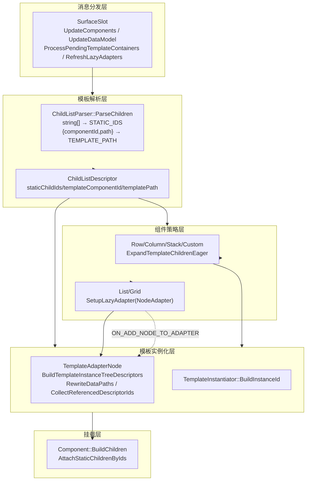
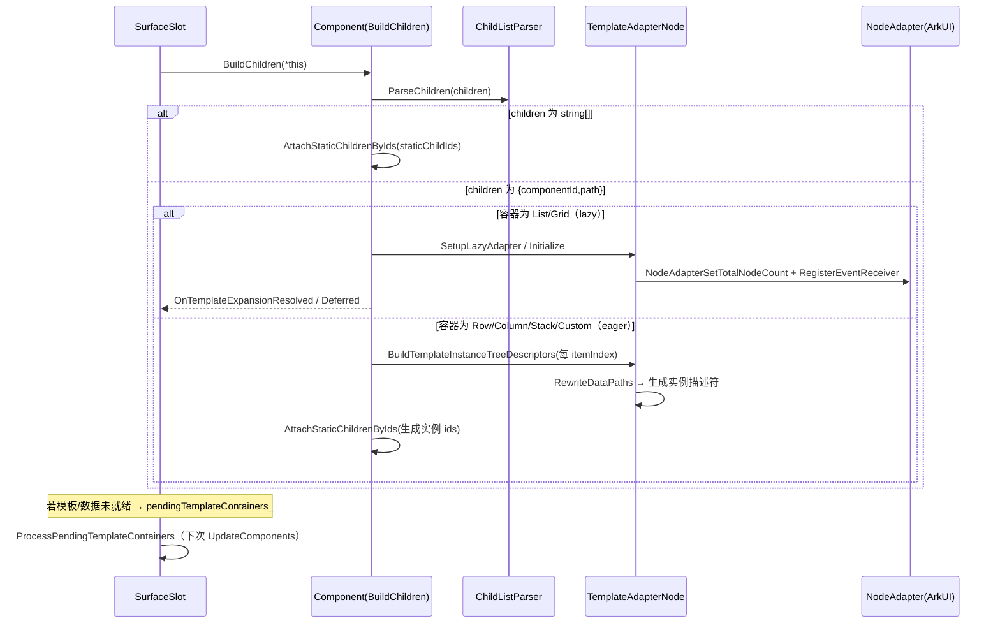
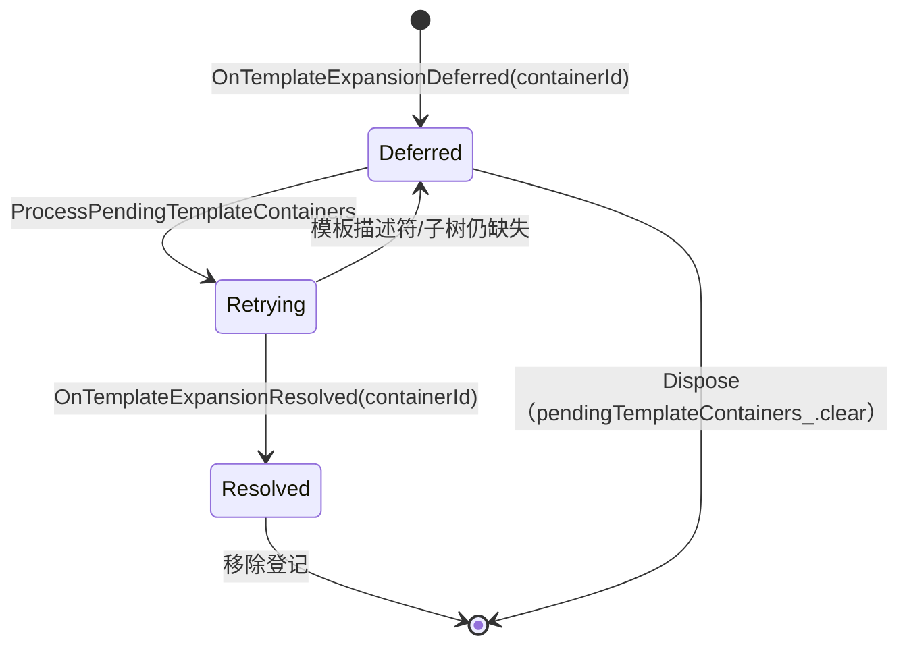

# 架构设计

> 确认目标仓和模块的架构约束、关键设计决策、Spec 拆分方向。

## 设计元数据

| Field | Content |
|-------|---------|
| Design ID | DESIGN-Func-07-04-17 |
| 关联需求 | 已有能力补录（无独立 requirement.md） |
| 关联 Epic | 无 |
| 目标 Feature | Feat-01 子组件模板声明与实例化（基线） |
| 复杂度 | 标准 |
| 目标版本 | A2UI 原生协议 v0.9（`https://a2ui.org/specification/v0_9/catalogs/basic/catalog.json`）+ 鸿蒙扩展协议 1.0.0（`catalogId=ohos.a2ui.extended.catalog`） |
| Owner | GenUI SIG |
| 状态 | Baselined（已有实现补录） |

## 需求基线

> 需求基线详见 proposal.md。以下仅列出设计阶段需要额外强调的要点。

| 项 | 补充说明 |
|----|---------|
| 补录而非新增 | 当前实现即规格，可疑行为只能标注为风险/备注 |
| 基准实现声明 | 子组件模板域以 A2UIRender 全量渲染引擎（`GenerativeUI/A2UIRender`，`@arkui-genius/genui`）为基准实现，C++ 层 `genui/src/main/cpp/composition/` + `components/` 提供模板声明解析与实例化 |
| 定位 | 本域是容器组件（07-04-05 标准容器 / 07-04-13 扩展容器）`children` 动态模板的底层支撑；上层组件（Tabs/List/Grid/Column/Row/Stack/NavContainer）声明 `children`，本域负责解析、绑定数据源、按 eager/lazy 策略实例化 |
| 协议语义 | `children` 二态：静态 ID 数组（`string[]`）与动态模板对象（`{ componentId, path }`，可选 `indexVar`/`itemVar`）；模板内部使用相对路径访问数组项字段 |
| 范围边界 | 具体组件（List/Grid/Tabs…）的组件语义与属性归 07-04-02~16；本域（07-04-17）只固化模板声明解析、数据源绑定、eager/lazy 展开、延迟展开、实例 ID 生成与数据路径重写 |

## 上下文和现状

### 涉及仓和模块

| 仓库 | 补充架构说明 |
|------|-------------|
| `GenerativeUI/A2UIRender` | 全量渲染引擎。C++ 层 `genui/src/main/cpp/composition/`（`ChildListDescriptor`/`ChildListParser`/`TemplateAdapterNode`/`ListAdapterNode`/`GridAdapterNode`/`TemplateInstantiator`）承担模板声明解析、数据路径重写、懒加载适配器；`components/`（`Component`/`A2UI` 标准组件/`extended` 扩展组件）承担 eager/lazy 展开与子节点挂载；`SurfaceSlot` 持有模板延迟展开登记表 |
| `GenerativeUI/Docs` | 开发者文档（`guides/creating-components-with-templates.md`），仅作理解辅助，契约以 A2UIRender 实现为准 |

> 仓、模块、当前职责、影响类型详见 proposal.md「影响范围」。

### 调用链层级分析

| 层 | 模块 | 职责 | 修改类型 |
|----|------|------|---------|
| 1. 公开契约层（ArkTS） | `ets/interface/*.ets`（`SurfaceController` 等） | 消息入口（`updateComponents`/`updateDataModel`），不感知模板细节 | 现状（基准实现） |
| 2. 消息分发层（C++） | `cpp/SurfaceSlot.cpp` | `UpdateComponents`/`UpdateDataModel` 分发；`ProcessPendingTemplateContainers` 延迟重试；`RefreshLazyAdapters` 数据驱动刷新 | 现状 |
| 3. 组件树构建层（C++） | `cpp/components/Component.cpp` | `BuildChildren` 按 `ChildListType` 分发；`ExpandTemplateChildrenEager`/`BuildEagerTemplateChild` eager 实例化；`AttachStaticChildrenByIds` 挂载 | 现状 |
| 4. 模板解析层（C++） | `cpp/composition/ChildListParser.cpp`、`ChildListDescriptor.h` | `children` 字段二态解析、循环变量（`indexVar`/`itemVar`）校验与回落 | 现状 |
| 5. 模板实例化层（C++） | `cpp/composition/TemplateAdapterNode.cpp`、`TemplateInstantiator.cpp` | 实例 ID 生成、数据路径重写、递归描述符生成、NodeAdapter 事件回调 | 现状 |
| 6. 懒加载适配器层（C++） | `cpp/composition/ListAdapterNode.cpp`、`GridAdapterNode.cpp` | List/Grid 专属 NodeAdapter、嵌套适配器递归配置 | 现状 |
| 7. 组件策略层（C++） | `cpp/components/A2UI/list|row|column/*.cpp`、`cpp/components/extended/*.cpp`、`custom/CustomComponent.cpp` | 各组件覆写 `ExpandTemplateChildren` 选择 eager/lazy 策略 | 现状 |

检查项：
- [x] 调用链每一层都已覆盖（消息分发→组件树构建→模板解析→模板实例化→懒加载适配器→组件策略）
- [x] 每层职责边界清晰（解析只产出 `ChildListDescriptor`；实例化只产出生成描述符；策略由组件决定）
- [x] 每层修改类型明确（均为「现状」，存量补录）

### 适用架构规则

| Rule ID | 适用原因 | 设计结论 | 验证方式 |
|---------|---------|---------|---------|
| OH-ARCH-LAYERING | 模板声明→解析→实例化→挂载多层调用 | 调用方向自顶向下；解析层不决策渲染策略（`ChildListDescriptor` 是 transport-only） | 架构评审/依赖检查 |
| OH-ARCH-SUBSYSTEM | 单仓 + 独立 Docs 仓，无跨子系统 | 不引入子系统外依赖 | 依赖检查 |
| OH-ARCH-API-LEVEL | 无新增公开 ArkTS API / C-API，仅 C++ 内部接口 | 无 Public API 变更，无新增权限 | API 评审 |
| OH-ARCH-COMPONENT-BUILD | 现状无 BUILD.gn/bundle.json 变更 | 无构建影响 | 构建验证 |
| OH-ARCH-ERROR-LOG | 模板路径非数组时发 `SCHEMA_ERROR_CODE_TYPE_MISMATCH` schema warning | 契约见 Feat-01 | UT |

## 不涉及项承接

> proposal.md 已完成 N/A 判定。本节仅对标记「涉及」且需展开设计的维度给出结论。

| 维度 | 设计结论 |
|------|---------|
| 跨进程/SA | 不涉及（同进程 C++ 内部调用） |
| 持久化 | 不涉及（模板实例与 DataModel 仅内存态） |
| 权限 | 不涉及 |
| 国际化/RTL | 不涉及（模板机制设备无关，RTL 归组件样式层） |
| 多设备适配 | 模板声明/展开设备无关；断点/主题为控制器状态（07-04-23/24 展开） |
| 范围边界 | 组件属性/事件语义归 07-04-02~16；模板循环变量表达式求值归 07-04-21 表达式域 |

## 关键设计决策

| 决策 ID | 问题 | 推荐方案 | 探索过的替代方案 | 取舍理由 | 影响 |
|--------|------|---------|----------------|---------|------|
| ADR-1 | `children` 如何表达「静态子项」与「数据驱动子项」 | 二态：`string[]` → `STATIC_IDS`；`{componentId,path}` → `TEMPLATE_PATH`；无法识别 → `INVALID`（`ChildListType` 三枚举） | (a) 统一模板对象；(b) 数组元素可混入对象 | 静态声明简单直观，模板对象承载数据源；解析层不决策渲染策略 | `ChildListDescriptor::IsValid` 判定合法性 |
| ADR-2 | 模板如何绑定数组数据源 | `children.componentId` 指向模板组件描述符，`children.path` 指向 DataModel 数组（绝对路径 `/` 开头）；模板内部字段用相对路径（无 `/` 前缀） | (a) 内联模板描述符；(b) 独立 template 命名空间 | 复用邻接表描述符机制，`componentId` 与静态组件共享描述符存储 | 数据路径重写规则（`RewriteObjectPathField`） |
| ADR-3 | 模板实例如何生成唯一 ID | 自动生成 `<arrayPath><templateComponentId>:<itemIndex>:<originalId>`；递归子树同样加前缀 | (a) 要求 DSL 手写唯一 ID；(b) 全局递增计数器 | 保证多模板、嵌套模板不冲突，DSL 编写者免于维护 ID 唯一性 | `TemplateAdapterNode::BuildTemplateInstanceDescriptorById` |
| ADR-4 | 容器按 eager 还是 lazy 展开 | 策略分化：Row/Column/Stack/Custom 走 eager（`ExpandTemplateChildrenEager`）；List/Grid 走 lazy（NodeAdapter）；Grid lazy 失败回退 eager | (a) 全部 eager；(b) 全部 lazy | 布局容器数据量小适合 eager；List/Grid 数据量大需避免离屏节点创建 | `ListComponent`/`ExtendedListComponent`/`ExtendedGridComponent` 覆写 |
| ADR-5 | 模板描述符/数据未就绪时如何处理 | `pendingTemplateContainers_` + `OnTemplateExpansionDeferred/Resolved`；`ProcessPendingTemplateContainers` 在下次 `updateComponents` 后重试完整子树 | (a) 直接报错；(b) 忽略 | 适配流式渲染分批下发描述符/数据的场景；缺失不破坏已有树 | `SurfaceSlot::ProcessPendingTemplateContainers` |
| ADR-6 | 模板循环变量如何注入 | `children.indexVar`/`itemVar` 覆盖默认 `index`/`item`；非法名回落默认；重名回落默认；eager/lazy 均经 `BuildTemplateLocalVariables`+`MergeLocalVariables` 合并 | (a) 固定 `$index`/`$item`；(b) 全局变量表 | 支持嵌套模板变量遮蔽，外层变量可被内层覆盖 | `ChildListParser::ApplyTemplateLoopVariableConfig` |
| ADR-7 | 数据路径如何重写为数组项路径 | `prefix = arrayPath + "/" + itemIndex`；模板内 `path` 以 `/` 开头 → `prefix + path`，否则 `prefix + "/" + path` | (a) 运行时动态解析不重写；(b) 只支持绝对路径 | 相对路径表达「当前数组项字段」，重写后统一为 DataModel 绝对路径 | `TemplateAdapterNode::RewriteObjectPathField` |

## 设计骨架

### 骨架范围

| 骨架项 | 目标 | 不包含 | 验证方式 |
|--------|------|--------|---------|
| children 声明解析 | 固化二态解析 + 循环变量校验回落 | 组件属性语义（07-04-02~16） | UT |
| 模板数据源绑定 | 固化 componentId/path 契约与数据路径重写 | 表达式求值（07-04-21） | UT |
| eager/lazy 展开 | 固化策略分化与组件挂载 | 组件渲染管线 | UT |
| 延迟展开 | 固化 pending 登记与重试语义 | 多 Surface 栈 | UT |
| 实例 ID 生成 | 固化前缀格式与递归子树生成 | — | UT |

### 骨架 Spec 拆分

| Task ID | 目标 | 受影响文件 | AC |
|---------|------|----------|-----|
| TASK-SKELETON-1 | Feat-01 子组件模板声明与实例化基线 | `composition/ChildListParser.cpp`、`ChildListDescriptor.h`、`components/Component.cpp`、`composition/TemplateAdapterNode.cpp`、`SurfaceSlot.cpp` | AC-1.1~AC-7.x |

## 后续 Task 拆分

| Task ID | 目标 | 受影响文件 | 依赖 |
|---------|------|----------|------|
| T-1 | Feat-01 子组件模板声明与实例化（基线，本设计已承接） | `Feat-01-*-spec.md` + 本 design.md | — |

## API 签名、Kit 与权限

> 本节承接 spec.md「API 变更分析」中识别的 API，给出签名、权限和 d.ts 位置等实现细节。

### 新增 API

无新增。本特性覆盖既有 C++ 内部接口（存量补录），无公开 ArkTS API 或 C-API 变更。

### 变更/废弃 API

| 原有 API | 变更类型 | 新 API | 迁移说明 |
|---------|---------|--------|---------|
| `children`（协议字段，`string[]`） | 既有 | — | 静态子项 ID 数组 |
| `children`（协议字段，`{componentId,path,indexVar?,itemVar?}`） | 既有 | — | 动态模板对象，数据驱动子项 |

> d.ts 位置：`genui/src/main/ets/interface/*.ets`（ArkTS 源即契约，无独立 SDK `.d.ts`）。Kit：`@arkui-genius/genui`；权限：无；SysCap：不适用。模板内部均为 C++ 内部类型（`ChildListDescriptor`/`TemplateAdapterNode` 等），不对外暴露。

## 构建系统影响

### BUILD.gn 变更

无变更（存量补录）。`genui/src/main/cpp/composition/` 已纳入现有 `liba2ui_native.so` 构建目标。

### bundle.json 变更

无变更。

## 可选设计扩展

### 架构图



### 数据流/控制流

| 步骤 | 调用方 | 被调用方 | 数据/接口 | 说明 |
|------|--------|---------|----------|------|
| 1 | 宿主应用 | `SurfaceSlot::UpdateComponents` | `components[]` | 入口 |
| 2 | `SurfaceSlot` | `Component::CollectChildListDescriptor` | `children` 字段 | 各组件解析二态 |
| 3 | `Component` | `ChildListParser::ParseChildren` | `JsonValue childrenValue` | 产出 `ChildListDescriptor` |
| 4 | `SurfaceSlot` | `Component::BuildChildren` | `SurfaceSlot&` | 按 `ChildListType` 分发 |
| 5 | eager 组件 | `Component::ExpandTemplateChildrenEager` | `ChildListDescriptor` | 遍历数组项实例化 |
| 6 | `Component` | `TemplateAdapterNode::BuildTemplateInstanceTreeDescriptors` | 模板 id + itemIndex | 生成实例描述符 |
| 7 | lazy 组件 | `ListAdapterNode::Initialize` | templateId/path/itemCount | 注册 NodeAdapter |
| 8 | `SurfaceSlot` | `RefreshLazyAdapters` | changedPath | 数据更新驱动刷新 |

### 时序设计



### 数据模型设计

**Framework 层（C++）**

```cpp
// composition/ChildListDescriptor.h
enum class ChildListType { INVALID = 0, STATIC_IDS = 1, TEMPLATE_PATH = 2 };
struct ChildListDescriptor {
    ChildListType type = ChildListType::INVALID;
    std::list<std::string> staticChildIds;
    std::string templateComponentId;
    std::string templatePath;
    std::string resolvedIndexVarName = "index";
    std::string resolvedItemVarName = "item";
    bool useDefaultIndexVar = true;
    bool useDefaultItemVar = true;
};

// composition/TemplateAdapterNode.h
struct TemplateInstanceBuildContext {
    const std::string& templateComponentId;
    const std::string& arrayPath;
    int32_t itemIndex = 0;
    const std::map<std::string, JsonValue>* allDescriptors = nullptr;
    std::map<std::string, JsonValue>* generatedDescriptors = nullptr;
};
```

| 结构 | 存储方案 | 生命周期 |
|------|---------|---------|
| `Component::childListDescriptor_` | `ChildListDescriptor` 值成员 | 随组件描述符应用更新 |
| `SurfaceSlot::allComponentDescriptorStore_` | `map<string, JsonValue>` | 模板/普通描述符缓存，`Dispose` 清空 |
| `SurfaceSlot::pendingTemplateContainers_` | `set<string>`（containerId） | Deferred 插入，Resolved/Dispose 清除 |
| `TemplateAdapterNode::generatedDescriptors` | `map<string, JsonValue>` | 单次实例化临时，随调用返回 |
| `TemplateAdapterNode::items_` | `unordered_map<ArkUI_NodeHandle, Component>` | NodeAdapter 挂载项，`Dispose` 释放 |

### 算法与状态机

模板容器展开状态机（`SurfaceSlot` 视角）：



关键算法：`ExpandTemplateChildrenEager` 遍历 `itemIndex ∈ [0, itemCount)`，每个 item 调 `BuildEagerTemplateChild`；任一项失败即 `allItemsBuilt=false` 并触发 `OnTemplateExpansionDeferred`。数据路径重写：`prefix = arrayPath + "/" + itemIndex`，`path` 以 `/` 开头拼 `prefix + path`，否则 `prefix + "/" + path`。

### 测试性设计

| 测试层级 | 测试目标 | Mock 策略 | 验证方式 |
|---------|---------|----------|---------|
| C++ UT | `ChildListParser::ParseChildren` 二态/非法解析 | 直接测 parser | `genui/src/test/cpp/` |
| C++ UT | `TemplateAdapterNode::RewriteDataPaths` 绝对/相对路径 | Mock DataModel | `genui/src/test/cpp/` |
| C++ UT | `Component::ExpandTemplateChildrenEager` 数组遍历实例化 | Mock SurfaceSlot/DataModel | `genui/src/test/cpp/` |
| C++ UT | `SurfaceSlot::ProcessPendingTemplateContainers` 延迟重试 | Mock Component | `genui/src/test/cpp/` |
| ohosTest | 模板列表端到端（流式渲染） | — | `entry/src/ohosTest/` |

### 资源所有权矩阵

| 资源 | 创建方 | 持有方 | 销毁触发 | 实际释放 | 异常回收 |
|------|--------|--------|---------|---------|---------|
| `ChildListDescriptor` | `ChildListParser` | `Component::childListDescriptor_` | 组件销毁 | 值成员自动 | — |
| `TemplateAdapterNode` | `ListComponent/ExtendedListComponent/Grid` | `ListComponent::adapterNode_` 等 | 组件 `~` | `Dispose()`（注销回调+释放句柄） | `Dispose` 幂等 |
| NodeAdapter handle | `NodeAdapterCreate()` | `TemplateAdapterNode::handle_` | `Dispose` | `NodeAdapterDispose` | — |
| 模板实例 `Component` | `BuildRootFromComponents` | `allComponents_` + `items_` | 组件移除/重建 | RemoveChild / `ReleaseItemWrapper` | `Dispose` |

### 接口参数规约

| 接口 | 参数 | 类型 | 合法范围 | 非法处理 | 边界说明 |
|------|------|------|---------|---------|---------|
| `children`（模板对象） | componentId | string | 非空，指向描述符 store 已存在的组件 | 缺失/空 → `INVALID`；store 缺失 → 延迟 | 大小写敏感 |
| `children`（模板对象） | path | string | 非空，绝对 `/` 开头 | 缺失/空 → `INVALID`；非数组 → type mismatch warning | 嵌套模板可用相对路径 |
| `children`（模板对象） | indexVar/itemVar | string | 合法局部变量名且互异 | 非法/重名 → 回落默认 `index`/`item` | `IsValidLocalVariableName` |
| 模板内部 `content.path` 等 | path | string | 相对（无 `/`）或绝对 | 重写后为 DataModel 绝对路径 | 见 ADR-7 |

### 线程与并发模型

| 操作 | 发起线程 | 回调线程 | 跨进程边界 | 线程安全 | 重入约束 |
|------|---------|---------|----------|---------|---------|
| UpdateComponents 模板展开 | UI | UI | 无 | 单线程 UI | 处理中不可销毁 |
| NodeAdapter 事件回调 | ArkUI 框架 | UI | 无 | 单线程 | 挂载/回收期间不重入 |
| RefreshLazyAdapters | UI | UI | 无 | 单线程 | 数据更新批次内合并 |

## 详细设计

### children 声明解析

`ChildListParser::ParseChildren`（`ChildListParser.cpp:62-92`）：`childrenValue.IsArray()` → `STATIC_IDS`，逐项 `GetStringValue`，空串过滤（`:66-75`）；`childrenValue.IsObject()` → 取 `componentId`/`path`（`:79-80`），二者均非空才 `TEMPLATE_PATH`（`:81-87`），随后 `ApplyTemplateLoopVariableConfig`（`:85`）；否则 `INVALID`（`:90-91`）。`ParseChild`（`:94-109`）处理单 `child` 字符串字段。`ApplyTemplateLoopVariableConfig`（`:25-58`）：`indexVar`/`itemVar` 经 `IsValidLocalVariableName` 校验，非法回落默认并打 warn（`:35-41`）；二者重名回落默认（`:43-48`）。`ChildListDescriptor::IsValid`（`ChildListDescriptor.h:49-58`）：`STATIC_IDS` 需非空 `staticChildIds`，`TEMPLATE_PATH` 需 `templateComponentId` 与 `templatePath` 均非空。

### 模板声明与数据源绑定

模板对象 `{componentId,path}`：`componentId` 指向描述符 store 中已存在的模板组件，`path` 指向 DataModel 数组（绝对路径）。`ExtendedComponent::CollectChildListDescriptor`（`ExtendedComponent.cpp:872-879`）仅当 `SupportsExtendedChildren`（`:57-61`，`Column/Row/List/Stack/Grid/NavContainer`）且存在 `children` 字段时解析。标准 A2UI 组件（`RowComponent.cpp:145-148`、`ColumnComponent.cpp:145-148`、`ListComponent.cpp:204-207`）各自直接 `ParseChildren`。

### eager 模板展开

`Component::BuildChildren`（`Component.cpp:1019-1038`）：`STATIC_IDS` → `AttachStaticChildrenByIds`（`:1023-1025`）；`TEMPLATE_PATH` → `ExpandTemplateChildren`（虚），返回 false 则直接 return（`:1030-1031`），返回 true 则 `AttachStaticChildrenByIds(childIds)`（`:1033`）。Row/Column/Stack/Custom 覆写 `ExpandTemplateChildren` 直调 `ExpandTemplateChildrenEager`（`RowComponent.cpp:149-153`、`ColumnComponent.cpp:150-154`、`ExtendedStackComponent.cpp:98-102`、`CustomComponent.cpp:487-490`）。`ExpandTemplateChildrenEager`（`Component.cpp:907-932`）先 `ResolveEagerTemplateArray`（`:911-914`），再遍历 item 调 `BuildEagerTemplateChild`（`:926-930`），返回 `allItemsBuilt`。`ResolveEagerTemplateArray`（`:934-972`）校验模板描述符存在（`:938-943`）、DataModel 非空（`:944-949`）、`GetNode(templatePath)` 存在（`:950-956`，缺失走 `ReportMissingPath(DEFER_UNTIL_DATA_UPDATE)`）、值为数组（`:963-971`，非数组发 `SCHEMA_ERROR_CODE_TYPE_MISMATCH` schema warning）。

### lazy 模板展开

`ListComponent::ExpandTemplateChildren`（`ListComponent.cpp:209-234`）：模板描述符缺失返回 false（`:215-221`），否则组装 `LazyAdapterConfig` 并 `SetupLazyAdapter`（`:223-232`），恒返回 false（懒加载不挂载静态子项）。`ResolveLazyAdapterItemCount`（`:144-182`）：相对路径返回 0（运行时解析，`:146-151`）；DataModel 空 → `nullopt`（`:153-157`）；`GetNode` 缺失 → 0 + `ReportMissingPath`（`:160-170`）；非数组 → 0（`:172-177`）。`ExtendedListComponent::ExpandTemplateChildren`（`:266-277`）`SetupLazyAdapter` 后按 `adapterNode_` 是否非空发 `OnTemplateExpansionResolved/Deferred`，恒返回 false。`ExtendedGridComponent::ExpandTemplateChildren`（`:649-665`）先尝试 `SetupLazyAdapter`，失败回落 `EAGER` 模式。

### 模板延迟展开

`SurfaceSlot::OnTemplateExpansionDeferred`（`SurfaceSlot.cpp:666-671`）将 containerId 插入 `pendingTemplateContainers_`；`OnTemplateExpansionResolved`（`:673-678`）擦除。`ProcessPendingTemplateContainers`（`:680-728`）遍历 pending 快照：容器不在 `allComponents_` → 擦除跳过（`:688-694`）；`cld.type != TEMPLATE_PATH` → 擦除跳过（`:697-701`）；模板描述符不在 `allComponentDescriptorStore_` → 等待（`:703-709`）；就绪则 `BuildChildren`（`:711`）并 `CollectReferencedDescriptorIds` 校验子树完整（`:713-723`），不完整则重新插入（`:724-726`）。`UpdateComponentsArray` 在建根后调用 `ProcessPendingTemplateContainers`（`:520`）。`Dispose` 清空 pending（`:775`）。

### 模板实例 ID 生成与数据路径重写

`TemplateAdapterNode::BuildTemplateInstanceDescriptorById`（`TemplateAdapterNode.cpp:302-328`）生成 `generatedInstanceId = arrayPath + templateComponentId + ":" + itemIndex + ":" + id`（`:311`），克隆模板描述符并 `ReplaceString("id", generatedInstanceId)`（`:316-320`），随后 `RewriteDataPaths`（`:321`）。`BuildTemplateInstanceTreeDescriptors`（`:373-408`）递归重写 `children`/`childrenIf`/`childrenElse`/`child`。`RewriteObjectPathField`（`:142-158`）：`prefix = arrayPath + "/" + itemIndex`（`:155`），原始 path 以 `/` 开头 → `prefix + original`，否则 `prefix + "/" + original`（`:156`）。`CollectReferencedDescriptorIds`（`:293-300`）递归收集模板子树的全部引用 id，用于完整性与延迟判定。

### 数据更新驱动的模板刷新

`SurfaceSlot::ExecuteDataModelOperation`（`SurfaceSlot.cpp:568-603`）在 UPDATE/DELETE/REPLACE 三态后分别调 `RefreshLazyAdapters(path)`（`:577`/`:584`）或 `RefreshLazyAdapters("", true)`（`:592`）。`RefreshLazyAdapters`（`:1041-1058`）遍历 `allComponents_`，对带 lazy adapter 的 `A2UIComponent` 调 `ShouldRefreshLazyAdapter`（`:92-108`：changedPath 等于 adapterPath、或为 `/`、或是 adapterPath 的前缀且边界为 `/`）命中后 `RefreshLazyAdapterFromDataModel`（`A2UIComponent.cpp:381-417`）重算 itemCount 并 `UpdateItemCount`+`ReloadAllItems`（`:412-413`）。

## 风险和开放问题

| 项 | 类型 | 影响 | 处理方式 | Owner |
|----|------|------|---------|-------|
| RISK-1 `SurfaceSlot.h` 声明 `GetTemplateArrayValue`/`ExpandTemplateChildrenEager`/`SetupLazyListAdapter`（`:188-193`）但无对应 `.cpp` 定义，实际逻辑位于 `Component.cpp`/`TemplateAdapterNode.cpp` | 架构 | 低 | 规格标注为死声明；后续如需统一入口再迁移 | GenUI SIG |
| RISK-2 `TemplateInstantiator::BuildInstanceId`（`TemplateInstantiator.cpp:20-23`）返回 `templateComponentId:idx:N`，与实际实例 ID 格式（`arrayPath+templateComponentId:itemIndex:id`）不一致 | 架构 | 低 | 规格标注 `TemplateInstantiator` 为预留扩展点，当前未被主流程调用 | GenUI SIG |
| RISK-3 Docs 声明模板子项 ID 为 `{arrayPath}{templateComponentId}:{itemIndex}:{originalId}`，与代码 `BuildTemplateInstanceDescriptorById` 一致，但 `OnNewItemIdCreated` 用 hash 生成 ArkUI 内部 node id | 架构 | 低 | 规格兼容性声明标注两种 ID 域（组件 id vs ArkUI node id） | GenUI SIG |
| RISK-4 `EagerChildrenStrategy`（`EagerChildrenStrategy.cpp:20-34`）对 TEMPLATE_PATH 恒返回 false，实际 eager 展开在 `Component.cpp`，策略类与 `ChildrenRenderStrategy` 当前未接入主流程 | 架构 | 低 | 规格标注为预留抽象 | GenUI SIG |
| RISK-5 eager 展开在数据未就绪时通过 `OnTemplateExpansionDeferred` 延迟重试，若模板描述符永不补发，容器将长期停留在空态 | 边界 | 中 | 规格 Feat-01 AC 覆盖延迟语义；docs 明确「模板描述符需首次渲染前完整提供」 | GenUI SIG |

## 设计审批

- [x] 需求基线已确认，设计覆盖 P0/P1 AC
- [x] 不涉及项已承接，N/A 和展开项都有结论
- [x] 涉及仓和模块职责清楚
- [x] 调用链层级分析完整，每层覆盖到位
- [x] 适用架构规则已识别并形成设计结论
- [x] 分层和子系统边界合规
- [x] API 变更有签名、权限、错误码和兼容性说明
- [x] BUILD.gn/bundle.json 影响明确
- [x] 设计输出和后续 Task 拆分明确
- [x] 关键设计决策有理由和影响说明
- [x] 风险和开放问题有 Owner

**结论:** 通过（已有实现补录）
