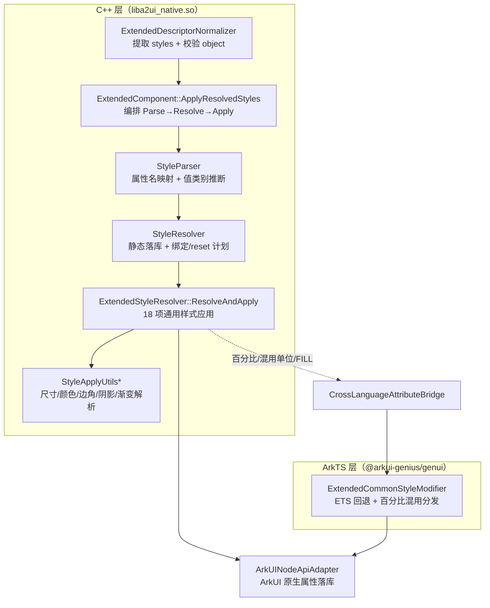
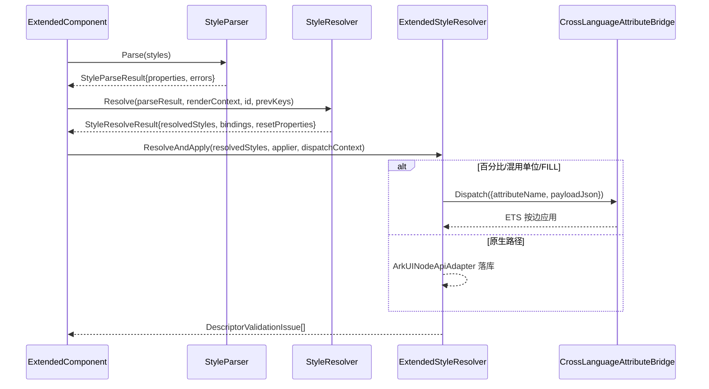

# 架构设计

> 确认目标仓和模块的架构约束、关键设计决策、Spec 拆分方向。

## 设计元数据

| Field | Content |
|-------|---------|
| Design ID | DESIGN-Func-07-04-18 |
| 关联需求 | 已有能力补录（无独立 requirement.md） |
| 关联 Epic | 无 |
| 目标 Feature | Feat-01 尺寸与布局样式（基线）；Feat-02 间距与边框样式；Feat-03 背景与颜色样式；Feat-04 视效样式；Feat-05 显示与裁切 |
| 复杂度 | 标准 |
| 目标版本 | A2UI 鸿蒙扩展协议 1.0.0（`ohos.a2ui.extended.catalog`，`extended_catalog.json` `CommonStyles`）；A2UI 原生 v0.9 标准目录不含样式 |
| Owner | GenUI SIG |
| 状态 | Baselined（已有实现补录） |

## 需求基线

> 需求基线详见 proposal.md。以下仅列出设计阶段需要额外强调的要点。

| 项 | 补充说明 |
|----|---------|
| 补录而非新增 | 当前实现即规格，可疑行为只能标注为风险/备注 |
| 基准实现声明 | 共享契约域以 A2UIRender 全量渲染引擎（`GenerativeUI/A2UIRender`，`@arkui-genius/genui`）为基准实现 |
| 归属边界 | 「通用样式」（`styles` 对象）仅适用于扩展协议组件（`catalogId=ohos.a2ui.extended.catalog`）；A2UI 原生 v0.9 标准目录**不支持样式**（`render_docs/concepts/components-and-layout.md:95`） |
| 范围边界 | 本功能域（07-04-18）覆盖 18 项通用样式属性的解析、校验、应用与非法值降级；各扩展组件的**专用私有样式**（如 Text 的 `fontColor`/`decoration`、Button 的 `fontScaleMode`、Column 的 `justifyContent` 等）归各自组件功能域（07-04-10~16），本设计不展开 |
| 契约声明 | `extended_catalog.json` `CommonStyles`（`specification/extended/1.0.0/extended_catalog.json:225-787`）声明 18 项通用样式；运行时另有 `opacity` 为 native-only 未文档化样式（见 RISK-2） |

## 上下文和现状

### 涉及仓和模块

| 仓库 | 补充架构说明 |
|------|-------------|
| `GenerativeUI/A2UIRender` | 全量渲染引擎。ArkTS 层（`genui/src/main/ets/core/components/extended/ExtendedCommonStyleModifier.ets`）提供 ETS 侧通用样式解析与回退应用；C++ 层（`genui/src/main/cpp/styles/`、`components/extended/`）提供原生样式解析/绑定/应用（`liba2ui_native.so`） |
| `GenerativeUI/Docs` | 开发者文档（`reference/extended-components/overview.md`、`concepts/components-and-layout.md`、`guides/building-ui-standard.md`），仅作理解辅助，契约以 A2UIRender 实现与 `extended_catalog.json` 为准 |

> 仓、模块、当前职责、影响类型详见 proposal.md「影响范围」。

### 调用链层级分析

| 层 | 模块 | 职责 | 修改类型 |
|----|------|------|---------|
| 1. 组件描述归一化层（C++） | `components/extended/ExtendedDescriptorNormalizer.cpp` | 从描述符提取 `styles`，校验 styles 为 object（非 object 上报 `TYPE_MISMATCH`） | 现状（基准实现） |
| 2. 组件样式调度层（C++） | `components/extended/ExtendedComponent.cpp`（`ApplyResolvedStyles`） | 编排 Parse→Resolve→Apply 全流程；上报 UNKNOWN 字段/解析错误；维护 `appliedStyleKeys_` 与 flexShrink 状态 | 现状 |
| 3. 样式解析层（C++） | `styles/StyleParser.cpp` | 属性名→枚举映射、值类别推断（STATIC/PATH_BINDING/FUNCTION_CALL/EXPRESSION/COMPOSITE_OBJECT）、复合属性判定 | 现状 |
| 4. 样式解析与绑定层（C++） | `styles/StyleResolver.cpp` | 静态值落库、动态值（path/call/expression）绑定计划、reset 计划、clear 绑定计划 | 现状 |
| 5. 样式应用层（C++） | `components/extended/ExtendedStyleResolver.cpp` | 18 项通用样式的 ArkUI 属性落库 + 非法值降级 + reset | 现状 |
| 6. 底层基元解析器（C++） | `styles/StyleApplyUtils*.cpp`、`StyleApplyUtilsInternal.h` | 尺寸/颜色/边距/圆角/阴影/渐变/可见性/裁剪等标量解析 | 现状 |
| 7. ArkUI Native 适配 + 跨语言桥（C++→ArkTS） | `adapter/ArkUINodeApiAdapter`、`CrossLanguageAttributeBridge` → `ExtendedCommonStyleModifier.ets` | 百分比/混用单位分发到 ETS 侧按边应用；native 属性落库 | 现状 |

检查项：
- [x] 调用链每一层都已覆盖（归一化→调度→解析→绑定→应用→基元解析→跨语言桥）
- [x] 每层职责边界清晰（Parser 只管解析、Resolver 管绑定计划、ExtendedStyleResolver 管应用）
- [x] 每层修改类型明确（均为「现状」，存量补录）

### 适用架构规则

| Rule ID | 适用原因 | 设计结论 | 验证方式 |
|---------|---------|---------|---------|
| OH-ARCH-LAYERING | ArkTS↔C++ 跨语言双路径应用 | 主路径 C++ `ExtendedStyleResolver`；百分比/混用单位经 `CrossLanguageAttributeBridge` 分发 ETS `ExtendedCommonStyleModifier`；方向自顶向下 | 架构评审/依赖检查 |
| OH-ARCH-SUBSYSTEM | 单仓 + 独立 Docs 仓，无跨子系统 | 不引入子系统外依赖 | 依赖检查 |
| OH-ARCH-API-LEVEL | 通用样式无新增 Public/System API；经 `styles` 对象（DSL 契约） | 无 C-API；schema 告警走 `registerErrorCallback` | API 评审 |
| OH-ARCH-COMPONENT-BUILD | 现状无 BUILD.gn/bundle.json 变更 | 无构建影响 | 构建验证 |
| OH-ARCH-ERROR-LOG | 样式非法值不中断渲染，经 schema warning 上报告警 | `SCHEMA_ERROR_CODE_TYPE_MISMATCH/INVALID_VALUE/UNDEFINED_FIELD`（`SchemaErrorCodes.h`） | UT/错误回调 |

## 不涉及项承接

> proposal.md 已完成 N/A 判定。本节仅对标记「涉及」且需展开设计的维度给出结论。

| 维度 | 设计结论 |
|------|---------|
| 跨进程/SA | 不涉及（同进程 ArkTS↔C++，native 经 NAPI 与跨语言桥） |
| 持久化 | 不涉及（样式仅内存态，随组件/描述符生命周期） |
| 权限 | 不涉及 |
| 国际化/RTL | 通用样式不含方向语义；RTL/镜像归布局与组件层，本域不展开 |
| 多设备适配 | 样式语义设备无关；断点/深浅色主题作为表达式全局变量（`$__widthBreakpoint`/`$__colorMode`）在表达式层（07-04-21/22）展开 |
| 范围边界 | 组件专用私有样式归 07-04-10~16；文本排版样式（font*/text*/decoration/wordBreak）虽进入 `StylePropertyName` 枚举但属 Text/TextInput 私有，归对应组件域 |

## 关键设计决策

| 决策 ID | 问题 | 推荐方案 | 探索过的替代方案 | 取舍理由 | 影响 |
|--------|------|---------|----------------|---------|------|
| ADR-1 | 样式如何与组件协议分层 | 通用样式归属扩展协议 `CommonStyles`（18 项），经组件 `styles` 对象承载；标准目录不提供样式 | (a) 并入标准目录；(b) 独立消息体 | 扩展协议定位为「精细化样式」，标准目录保持 v0.9 轻量 | `extended_catalog.json:225-787` |
| ADR-2 | 样式值如何分类解析 | `StyleValueKind` 五态：STATIC_VALUE / PATH_BINDING / FUNCTION_CALL / EXPRESSION / COMPOSITE_OBJECT；对象含 `path`→绑定、含 `call`→函数、复合属性或未知属性对象→COMPOSITE、`{{}}` 字符串→表达式 | (a) 运行时直接求值；(b) 全量静态 | 静态快速、动态可增量订阅；绑定计划支持 dataModel 更新后刷新 | `StyleParser.cpp:114-138` |
| ADR-3 | 属性名如何归一为枚举 | 集中映射表 `GetStylePropertyNameMap`（34 键），未命中回 `UNKNOWN` 并在调度层上报 `UNDEFINED_FIELD` | (a) 散落 if-else；(b) 直接字符串比较 | 单源映射便于补全与去重 | `StyleParser.cpp:26-47,84-95` |
| ADR-4 | 尺寸单位如何编码 | `StyleDimensionUnit`：VP/PERCENT/MATCH_PARENT/WRAP_CONTENT/FIX_AT_IDEAL_SIZE；数字默认 VP；字符串仅 vp/% 后缀；关键字 `matchParent`/`fill`/`wrapContent`/`fixAtIdealSize`；**px 非通用尺寸单位** | (a) 支持 px；(b) 支持 em/rem | 与 ArkUI Length 对齐；px 仅 Divider.strokeWidth 私有 | `StyleApplyUtilsLayout.cpp:32-61,110-153` |
| ADR-5 | 颜色如何解析 | 仅 `#RRGGBB`/`#AARRGGBB`（6/8 hex）；`NormalizeHexColor` 将 6 位补 `FF` 为 ARGB；命名色/rgb()/3 位 hex 均拒绝 | (a) 复用 ArkUI 完整 ResourceColor 解析；(b) 支持命名色 | 确定性 + 可校验；文档明确只支持 hex | `StyleApplyUtils.cpp:40-60`、`StyleApplyUtilsInternal.h:32-39` |
| ADR-6 | 样式应用为何双路径 | 主路径 C++ `ExtendedStyleResolver` 直接落 ArkUI 原生属性；百分比/混用单位/`backgroundImageSize=FILL` 等经 `CrossLanguageAttributeBridge` 分发到 ETS `ExtendedCommonStyleModifier` | (a) 全 native；(b) 全 ETS | 原生路径性能好；百分比按边清洗仅 ETS 侧原生 `margin/padding` 支持 | `ExtendedStyleResolver.cpp:801-820`、`ExtendedCommonStyleModifier.ets` |
| ADR-7 | 非法值如何降级 | 非法值重置为默认并上报 `INVALID_VALUE`/`TYPE_MISMATCH`，不中断渲染；复合属性仅重置非法子字段 | (a) 强转；(b) 丢弃整个组件 | 容错优先 + 可观测告警；保证局部降级 | `overview.md:939-969` |
| ADR-8 | 增量更新如何 reset | `BuildResetPlan` 比对 `previousStyleKeys` 与当前键集合，缺省属性入 reset；`BuildClearBindingPlan` 清旧绑定；`appliedStyleKeys_` 跨批次维护 | (a) 全量重建；(b) 不 reset | 支持流式增量更新，避免旧样式残留 | `StyleResolver.cpp:195-233`、`ExtendedComponent.cpp:991` |

## 设计骨架

### 骨架范围

| 骨架项 | 目标 | 不包含 | 验证方式 |
|--------|------|--------|---------|
| 尺寸与布局 | 固化 width/height/constraintSize/aspectRatio/flexShrink/layoutWeight 解析与应用 | 组件专用布局属性（justifyContent 等） | UT |
| 间距与边框 | 固化 padding/margin/borderWidth/borderColor/borderRadius 解析与边角语义 | Divider.strokeWidth（px 单位） | UT |
| 背景与颜色 | 固化 backgroundColor/backgroundImage/backgroundImageSizeWithStyle/linearGradient | 深浅色主题默认值（07-04-24） | UT |
| 视效 | 固化 shadow/opacity | decoration（Text 私有） | UT |
| 显示与裁切 | 固化 visibility/clip | 无障碍隐藏语义 | UT |

### 骨架 Spec 拆分

| Task ID | 目标 | 受影响文件 | AC |
|---------|------|----------|-----|
| TASK-SKELETON-1 | Feat-01 尺寸与布局样式基线 | `StyleApplyUtilsLayout.cpp`、`ExtendedStyleResolver.cpp` | AC-1.1~1.x |
| TASK-SKELETON-2 | Feat-02~05 间距边框/背景颜色/视效/显示裁切 | `StyleApplyUtils*.cpp`、`ExtendedStyleResolver.cpp` | 各 Feat AC |

## 后续 Task 拆分

| Task ID | 目标 | 受影响文件 | 依赖 |
|---------|------|----------|------|
| T-1 | Feat-01 尺寸与布局样式（基线，本设计已承接） | `Feat-01-*-spec.md` + 本 design.md | — |
| T-2 | Feat-02 间距与边框样式 | `StyleApplyUtilsLayout.cpp`、`ExtendedStyleResolver.cpp` | T-1 |
| T-3 | Feat-03 背景与颜色样式 | `StyleApplyUtilsEffects.cpp`、`ExtendedStyleResolver.cpp` | T-1 |
| T-4 | Feat-04 视效样式 | `StyleApplyUtilsEffects.cpp`、`ExtendedStyleResolver.cpp` | T-1 |
| T-5 | Feat-05 显示与裁切 | `StyleApplyUtilsText.cpp`、`StyleApplyUtilsEffects.cpp`、`ExtendedStyleResolver.cpp` | T-1 |

## API 签名、Kit 与权限

> 本节承接 spec.md「API 变更分析」中识别的 API，给出签名、权限和 d.ts 位置等实现细节。

### 新增 API

无新增。本特性覆盖既有 DSL 契约（`styles` 对象）与内部解析器（存量补录）。

### 变更/废弃 API

| 原有 API | 变更类型 | 新 API | 迁移说明 |
|---------|---------|--------|---------|
| `styles`（扩展组件描述符可选字段） | 既有 | — | 通用样式统一入口，无公开 ArkTS/C API |
| `ExtendedCommonStyleModifier`（ETS AttributeModifier） | 既有 | — | ETS 回退应用 + 百分比/混用分发 |
| `StyleParser`/`StyleResolver`/`ExtendedStyleResolver`（C++ 内部） | 既有 | — | 解析/绑定/应用三层 |

> 契约位置：`specification/extended/1.0.0/extended_catalog.json`（`CommonStyles`）；ArkTS 源即契约，无独立 SDK `.d.ts`。Kit：`@arkui-genius/genui`；权限：无；SysCap：不适用。

## 构建系统影响

### BUILD.gn 变更

无变更（存量补录）。`genui/src/main/cpp/styles/`、`components/extended/` 已纳入现有 `liba2ui_native.so` 构建目标。

### bundle.json 变更

无变更。

## 可选设计扩展

### 架构图



### 数据流/控制流

| 步骤 | 调用方 | 被调用方 | 数据/接口 | 说明 |
|------|--------|---------|----------|------|
| 1 | 组件描述符 | `ExtendedDescriptorNormalizer::Normalize` | `JsonValue descriptor` | 提取 styles，非 object 上报 TYPE_MISMATCH |
| 2 | `ExtendedComponent` | `StyleParser::Parse` | `StyleParseResult` | 属性名映射 + 值类别推断 |
| 3 | `ExtendedComponent` | `StyleResolver::Resolve` | `StyleResolveResult` | 静态落库 / 绑定计划 / reset 计划 |
| 4 | `ExtendedComponent` | `ExtendedStyleResolver::ResolveAndApply` | `resolvedStyles` | 按序应用 18 项样式 |
| 5 | 百分比/混用 | `CrossLanguageAttributeBridge::Dispatch` | `payloadJson` | 分发 ETS 按边应用 |
| 6 | 非法值 | `ReportExtendedSchemaWarning` | `SCHEMA_ERROR_CODE_*` | 告警 + reset 默认值 |

### 时序设计



### 数据模型设计

**Framework 层（C++，`styles/StyleTypes.h`）**

```cpp
enum class StyleDimensionUnit { VP=0, PERCENT, MATCH_PARENT, WRAP_CONTENT, FIX_AT_IDEAL_SIZE, INVALID };
struct StyleDimension { StyleDimensionUnit unit = INVALID; float value = 0.0F; };
struct StyleEdge { StyleDimension top, right, bottom, left; };   // margin/padding/borderWidth
struct StyleRadius { StyleDimension topLeft, topRight, bottomRight, bottomLeft; }; // borderRadius
struct StyleShadow { StyleShadowKind kind; int32_t style; float radius; uint32_t color; /* ... */ bool valid; };
struct StyleLinearGradient { float angle=180; int32_t direction=0; bool repeating=false; vector<uint32_t> colors; vector<float> stops; };
struct StyleProperty { std::string rawName; StylePropertyName name; StyleValueKind kind; JsonValue rawValue; };
```

**契约层（JSON，`extended_catalog.json` `CommonStyles`）**

```json
{ "styles": { "width": 200, "height": "40vp", "margin": {"top":10}, "backgroundColor": "#F0F0F0",
              "borderRadius": 8, "shadow": {"radius": 10}, "clip": true, "visibility": "hidden" } }
```

| 结构 | 存储方案 | 生命周期 |
|------|---------|---------|
| `StyleProperty::rawValue` | `JsonValue`（原始 DSL 值） | 解析期瞬态 |
| `StyleResolveResult::resolvedStyles` | `JsonAdapter` 对象 | 每批次 Resolve 重建 |
| `StyleResolveResult::bindings` | `vector<StyleBindingPlan>` | 绑定属性随 `appliedStyleKeys_` 增减 |
| `ExtendedComponent::appliedStyleKeys_` | `set<string>` | 跨批次增量 reset 依据 |

### 测试性设计

| 测试层级 | 测试目标 | Mock 策略 | 验证方式 |
|---------|---------|----------|---------|
| C++ UT | `StyleApplyUtils::ParseDimension/ParseColor/ParseEdge/ParseShadow/ParseLinearGradient` | 直接调静态方法 | `genui/src/test/cpp/` |
| C++ UT | `StyleParser::Parse` 值类别推断 | 构造 JsonValue | `genui/src/test/cpp/` |
| C++ UT | `ExtendedStyleResolver::Apply*` 非法值降级 | Mock ArkUINodeApiAdapter | `genui/src/test/cpp/` |
| ETS 单测 | `ExtendedCommonStyleModifier` 解析 | 直接调 resolver | `genui/src/test/` |
| ohosTest | 通用样式端到端渲染 | — | `entry/src/ohosTest/` |

### 资源所有权矩阵

| 资源 | 创建方 | 持有方 | 销毁触发 | 实际释放 | 异常回收 |
|------|--------|--------|---------|---------|---------|
| `StyleResolveResult::resolvedAdapter` | `StyleResolver::Resolve` | 栈内 `unique_ptr` | Resolve 返回 | 自动析构 | — |
| `ExtendedComponent::nodeApplier_` | `ApplyExtendedDescriptor` | `shared_ptr` 成员 | 组件销毁 | 引用计数归零 | Dispose |
| `ExtendedComponent::dataBindings_` | `ApplyResolvedStyleBindings` | 成员 vector | clear 绑定计划 | RemoveBindingsForProperty | 空路径跳过 |

### 接口参数规约

| 接口 | 参数 | 类型 | 合法范围 | 非法处理 | 边界说明 |
|------|------|------|---------|---------|---------|
| `ParseDimension` | value | number/string | number∈[0,+∞)；string 匹配 `N(单位)?` | 返回 false → 调用方 reset | 仅 vp/% 后缀；关键字 `matchParent`/`fill` |
| `ParseColor` | value | string | `#RRGGBB`/`#AARRGGBB` | 返回 false → reset | 6 位补 `FF` |
| `ParseEdge` | value | number/string/object | 1~4 段简写或 4 边对象 | 返回 false → 整体 reset | 空对象→全 0 |
| `ParseShadow` | value | number/string/object | 0~5 整数 / 预设名 / 含 radius 对象 | 返回 `valid=false` → reset | 子字段单独降级 |
| `ParseLinearGradient` | value | object | colors 数组必填 | 返回 false → reset | stop 钳制 [0,1] 单调不减 |

### 线程与并发模型

| 操作 | 发起线程 | 回调线程 | 跨进程边界 | 线程安全 | 重入约束 |
|------|---------|---------|----------|---------|---------|
| 样式解析/应用 | UI | UI | 无 | 单线程 UI | 处理中不可销毁组件 |
| 跨语言桥分发 | UI | UI | 无 | 单线程 | — |
| schema warning 上报 | UI | UI | 无 | 单线程 | 批次合并 |

## 详细设计

### 通用样式解析管线

`StyleParser::Parse`（`StyleParser.cpp:51-82`）：styles 非 object 时 `INVALID_STYLES`；遍历子键，`ToPropertyName`（`:84-95`，含 `linearGradient` 特例 `:91-93`）映射枚举，`InferValueKind`（`:114-138`）五态分类，产出 `properties`。`IsCompositeProperty`（`:97-112`）判定 PADDING/MARGIN/BORDER_RADIUS/SHADOW/BACKGROUND_IMAGE_SIZE/LINEAR_GRADIENT/DECORATION/CONSTRAINT_SIZE 为复合属性。

### 样式解析与绑定

`StyleResolver::Resolve`（`StyleResolver.cpp:123-174`）先 `BuildClearBindingPlan`/`BuildResetPlan`（`:195-233`）比对 `previousStyleKeys`；随后逐属性 `ResolveProperty`（`:235-288`）：PATH_BINDING/FUNCTION_CALL 走 `ResolveDynamicProperty`（`:290-343`）注册绑定计划；EXPRESSION 走 `CollectExpressionBindingPlans`；COMPOSITE_OBJECT 走 `ResolveDynamicDescriptorProperty`（`:345-383`）允许部分解析；静态值直接 `PutResolvedValue`。绑定属性前缀 `styles.`（`StyleResolver.h:32`）。

### 尺寸与布局应用

`ExtendedStyleResolver::ApplySizeStyles`（`ExtendedStyleResolver.cpp:908-914`）依次 `ApplyDimension(width)`/`ApplyDimension(height)`/`ApplyAspectRatio`。`ApplyDimension`（`:1910-1951`）按单位分派：WRAP_CONTENT/FIX_AT_IDEAL_SIZE→`ResetDirectDimension`；PERCENT/MATCH_PARENT→`ApplyPercentDimension`；VP→`ApplyAbsoluteDimension`。`ApplyAspectRatio`（`:916-957`）仅接受有限正数，非法回 `DEFAULT_ASPECT_RATIO`。`constraintSize`（`:1409-1465`）支持百分比经 native `SetPercentConstraintSize` 或跨语言桥分发；`flexShrink`（`:1307-1342`）与 `layoutWeight`（`:1377-1407`）应用后由 `ExtendedComponent::UpdateFlexShrinkStyleState`（`ExtendedComponent.cpp:994-1014`）维护状态。

### 间距与边框应用

`ApplyPaddingStyles`/`ApplyMarginStyles`（`ExtendedStyleResolver.cpp:1043-1159`）：`ParseEdgeStyle`（`:1746-1782`）解析边；百分比与绝对混用经 `DispatchMixedEdgeStyle` 分发 ETS，否则 `ApplyPaddingValues`/`ApplyMarginValues`。`ApplyRadius`（`:2093-2130`）按 `RadiusUnitMode`（ABSOLUTE/PERCENT/MIXED）分派。`ApplyBorderWidthStyle`（`:1215-1238`）仅 vp/%，百分比走 `SetBorderWidthPercent`。

### 背景与颜色应用

`ApplyColorStyles`（`:959-1003`）：`ParseColor` 失败即 `Reset` 并上报（区分 TYPE_MISMATCH vs INVALID_VALUE）。`ApplyBackgroundImage`（`:1467-1516`）空串 reset。`ApplyBackgroundImageSize`（`:2252-2275`）字符串枚举（cover/contain/auto 走 native，fill 分发 ETS）或 {width,height}。`ApplyLinearGradient`（`:2329-2345`）解析失败 reset。

### 视效与显示应用

`ApplyDecorationStyles`（`:1203-1213`）编排 borderWidth/opacity/visibility/borderRadius/shadow/linearGradient。`ApplyShadow`（`:2132-2179`）STYLE 或 CUSTOM 分派。`ApplyVisibilityStyle`（`:1253-1273`）经 `ParseVisibility`（`StyleApplyUtilsText.cpp:229-239`）映射 visible/hidden/none。`ApplyClipStyle`（`:1344-1375`）仅接受 boolean。

## 风险和开放问题

| 项 | 类型 | 影响 | 处理方式 | Owner |
|----|------|------|---------|-------|
| RISK-1 文档「15 种通用样式」与 `extended_catalog.json`「18 项 CommonStyles」及 `ExtendedCommonStyleModifier`「18 字段」计数不一致 | 文档 | 中 | 规格以 `extended_catalog.json:225-787` 为准；文档计数差异标注为风险 | GenUI SIG |
| RISK-2 `opacity` 在 C++ 解析器（`StyleParser.cpp:41`、`ExtendedStyleResolver.cpp:1240-1251`）存在，但未进 `extended_catalog.json`/`ExtendedCommonStyleModifier`/`overview.md` | 契约 | 中 | 规格 Feat-04 标注为 native-only 未文档化样式，行为以代码为准 | GenUI SIG |
| RISK-3 双路径应用（C++ vs ETS）在非法值降级上存在局部差异（如 layoutWeight 非法：native reset 0，ETS 回 1） | 架构 | 中 | 规格 Feat-01 AC 覆盖；`ExtendedStyleResolver.cpp:1377-1407` vs `ExtendedCommonStyleModifier.ets:448-460` | GenUI SIG |
| RISK-4 尺寸关键字 `fill` 与 `matchParent` 同义（`StyleApplyUtilsLayout.cpp:34`），但文档仅声明 `matchParent` | 契约 | 低 | 规格 Feat-01 标注兼容别名，行为以代码为准 | GenUI SIG |
| RISK-5 `px` 非通用尺寸单位，仅在 `Divider.strokeWidth` 私有解析支持（`StyleApplyUtilsLayout.cpp:63-86`） | 契约 | 低 | 规格 Feat-01 明确 px 不在通用尺寸单位集 | GenUI SIG |

## 设计审批

- [x] 需求基线已确认，设计覆盖 P0/P1 AC
- [x] 不涉及项已承接，N/A 和展开项都有结论
- [x] 涉及仓和模块职责清楚
- [x] 调用链层级分析完整，每层覆盖到位
- [x] 适用架构规则已识别并形成设计结论
- [x] 分层和子系统边界合规
- [x] API 变更有签名、权限、错误码和兼容性说明
- [x] BUILD.gn/bundle.json 影响明确
- [x] 设计输出和后续 Task 拆分明确
- [x] 关键设计决策有理由和影响说明
- [x] 风险和开放问题有 Owner

**结论:** 通过（已有实现补录）
