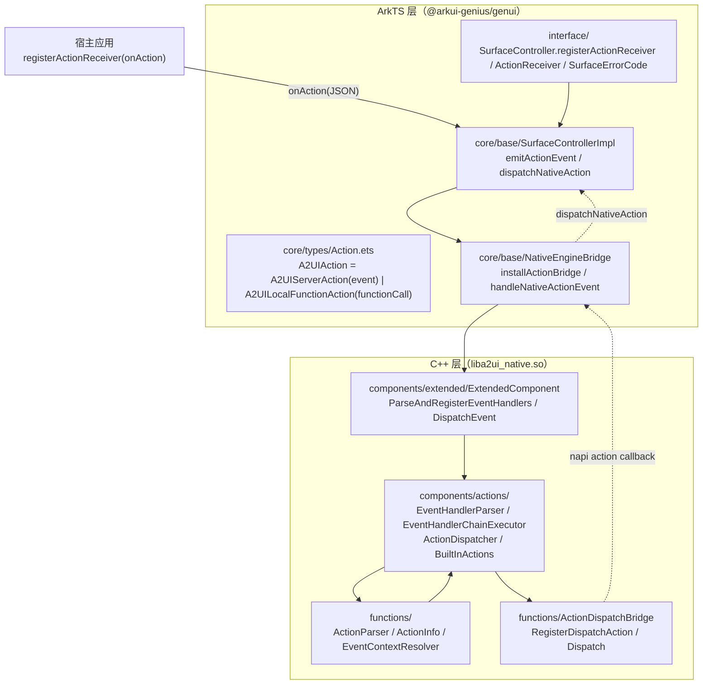
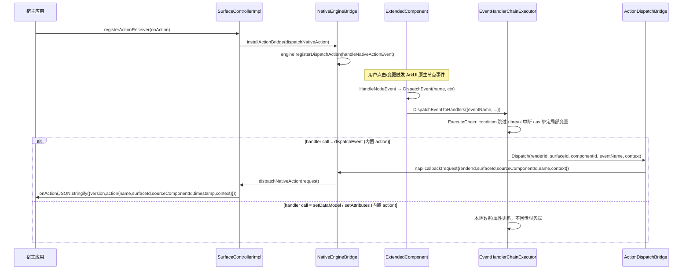

# 架构设计

> 确认目标仓和模块的架构约束、关键设计决策、Spec 拆分方向。

## 设计元数据

| Field | Content |
|-------|---------|
| Design ID | DESIGN-Func-07-04-19 |
| 关联需求 | 已有能力补录（无独立 requirement.md） |
| 关联 Epic | 无 |
| 目标 Feature | Feat-01 通用事件模型与触发契约（基线）；Feat-02 事件数据与分发 |
| 复杂度 | 标准 |
| 目标版本 | A2UI 原生协议 v0.9 + 鸿蒙扩展协议（`catalogId = ohos.a2ui.extended.catalog`） |
| Owner | GenUI SIG |
| 状态 | Baselined（已有实现补录） |

## 需求基线

> 需求基线详见 proposal.md。以下仅列出设计阶段需要额外强调的要点。

| 项 | 补充说明 |
|----|---------|
| 补录而非新增 | 当前实现即规格，可疑行为只能标注为风险/备注 |
| 基准实现声明 | 共享契约域以 A2UIRender 全量渲染引擎（`GenerativeUI/A2UIRender`，`@arkui-genius/genui`）为基准实现 |
| 范围边界 | 本功能域（07-04-19）覆盖「通用事件」：事件名称白名单、交互契约（`action` 与 EventHandler 链）、事件上下文数据、事件分发与 action 消息回传；具体组件属性/样式语义、函数实现归各自功能域，本设计不展开 |
| 交互契约双形态 | 标准组件（Button）用单一 `action`（server event / local functionCall 二选一）；扩展组件用 EventHandler 链（`onClick`/`onAppear`/`onChange`/`onReachStart`/`onReachEnd` 数组，每项 `call`/`args`/`condition`/`as`） |
| 事件回传 | 客户端交互以 `action` 消息回传服务端（`version` + `action{name,surfaceId,sourceComponentId,timestamp,context}`） |

## 上下文和现状

### 涉及仓和模块

| 仓库 | 补充架构说明 |
|------|-------------|
| `GenerativeUI/A2UIRender` | 全量渲染引擎。ArkTS 层（`genui/src/main/ets/interface/` 公开契约、`ets/core/base/` 控制器与桥接、`ets/core/types/Action.ets` 交互契约 schema）；C++ 层（`genui/src/main/cpp/components/actions/` 事件处理链、`functions/` 动作解析与桥接、`components/extended/` 组件事件注册与上下文构建） |
| `GenerativeUI/Docs` | 开发者文档（概念/指南/消息格式），仅作理解辅助，契约以 A2UIRender 实现为准 |

> 仓、模块、当前职责、影响类型详见 proposal.md「影响范围」。

### 调用链层级分析

| 层 | 模块 | 职责 | 修改类型 |
|----|------|------|---------|
| 1. 公开契约层（ArkTS） | `ets/interface/SurfaceController.ets`、`Types.ets`、`ets/core/types/Action.ets`、`FunctionCall.ets` | 声明 `registerActionReceiver`/`ActionReceiver`、`SurfaceErrorCode`、`A2UIAction`（server action / local function action）schema、`ClientToServerActionMessage` 类型 | 现状（基准实现） |
| 2. 控制器与桥接层（ArkTS） | `ets/core/base/SurfaceControllerImpl.ets`、`NativeEngineBridge.ets` | `emitActionEvent` 组装 action 消息、`dispatchNativeAction` 分发、`installActionBridge` 安装 native→ArkTS 回调 | 现状 |
| 3. 组件层（C++） | `components/extended/ExtendedComponent.cpp`、`components/A2UI/A2UIComponent.cpp`、各 `Extended*Component.cpp` | 事件注册（onClick/onAppear/onChange/onReachStart/onReachEnd）、`DispatchEvent`、action 优先级、事件上下文构建 | 现状 |
| 4. 事件处理链层（C++） | `components/actions/EventHandlerParser.cpp`、`EventHandlerChainExecutor.cpp`、`ActionDispatcher.cpp`、`BuiltInActions.cpp`、`NativeActionRegistry.cpp` | 事件名解析、Handler 链执行（condition/as/break）、dispatcher 链、内置 action | 现状 |
| 5. 动作解析与桥接层（C++） | `functions/ActionParser.cpp`、`ActionInfo.cpp`、`EventContextResolver.cpp`、`ActionDispatchBridge.cpp` | `action` 解析（event/functionCall）、事件上下文解析（path 引用）、跨语言事件回传 | 现状 |
| 6. 错误码层（C++ ↔ ArkTS） | `cpp/SurfaceErrorCodes.h`、`ets/interface/Types.ets` | `ACTION_NOT_REGISTER=3001`/`ACTION_PARSE_FAILED=3201` 数值对齐 | 现状 |

检查项：
- [x] 调用链每一层都已覆盖（公开契约→控制器/桥接→组件→事件处理链→动作解析/桥接→错误码）
- [x] 每层职责边界清晰（ArkTS 负责契约与消息组装，C++ 负责事件注册/解析/分发/回传）
- [x] 每层修改类型明确（均为「现状」，存量补录）

### 适用架构规则

| Rule ID | 适用原因 | 设计结论 | 验证方式 |
|---------|---------|---------|---------|
| OH-ARCH-LAYERING | ArkTS→NAPI→C++ 跨语言多层调用；事件经 C++→NAPI→ArkTS 回调回传 | 调用方向自顶向下；事件回传自底向上经 `ActionDispatchBridge::Dispatch` → NAPI → `emitActionEvent` | 架构评审/依赖检查 |
| OH-ARCH-SUBSYSTEM | 单仓 + 独立 Docs 仓，无跨子系统 | 不引入子系统外依赖 | 依赖检查 |
| OH-ARCH-API-LEVEL | 公开 ArkTS API（`registerActionReceiver`/`SurfaceErrorCode`/`A2UIAction`），无 C-API | Public API（ArkTS），无新增权限 | API 评审 |
| OH-ARCH-COMPONENT-BUILD | 现状无 BUILD.gn/bundle.json 变更 | 无构建影响 | 构建验证 |
| OH-ARCH-ERROR-LOG | 错误码双层映射（native 常量 `SurfaceErrorCodes.h` ↔ ArkTS `SurfaceErrorCode` 枚举） | 事件相关错误码 `3001`/`3201` 契约见 Feat-02 | UT |

## 不涉及项承接

> proposal.md 已完成 N/A 判定。本节仅对标记「涉及」且需展开设计的维度给出结论。

| 维度 | 设计结论 |
|------|---------|
| 跨进程/SA | 不涉及（同进程 ArkTS↔C++ 经 NAPI） |
| 持久化 | 不涉及（事件上下文/action 消息均为内存态瞬时值） |
| 权限 | 不涉及 |
| 国际化/RTL | 组件渲染层关注，本域事件模型设备无关 |
| 多设备适配 | 事件契约设备无关；`eventData` 组件载荷由各组件定义 |
| 范围边界 | 组件属性/样式语义归 07-04-02~18；函数实现归 07-04-16/20；卡片裁剪差异归扩展域 |

## 关键设计决策

| 决策 ID | 问题 | 推荐方案 | 探索过的替代方案 | 取舍理由 | 影响 |
|--------|------|---------|----------------|---------|------|
| ADR-1 | 哪些事件名可被识别 | 集中声明 6 个：`onClick`/`onAppear`/`onChange`/`onSelect`/`onReachStart`/`onReachEnd`（`EventHandlerParser.cpp:23-24` 与 `SurfaceSlotSchemaValidation.cpp:34-35` 双处） | (a) 开放任意事件名；(b) 按组件硬编码 | 白名单便于 schema 校验与未知键识别；双处声明存在同步风险 | 未知事件键不注册 handler；`onSelect` 声明但暂无组件触发（风险 RISK-4） |
| ADR-2 | 交互契约形态 | 标准组件单一 `action`（`event`/`functionCall` 二选一，`Action.ets:76-85`）；扩展组件 EventHandler 链（`call`/`args`/`condition`/`as`） | (a) 统一为函数链；(b) 统一为单一 action | 兼容 A2UI v0.9 标准 `action`；扩展链支持多步/条件/局部变量 | Button 定义 `action` 时 onClick 不注册（action 优先级） |
| ADR-3 | 事件上下文统一 shape | `{componentId, eventData}`，`eventData` 由各组件自定义（click=`{x,y}`、checkbox onChange=`{value}`、toggle=`{isOn}`、radio=`{isChecked}`、textInput=`{value}`、checkboxGroup=`{value,status}`） | (a) 各组件各自返回任意 JSON；(b) 统一扁平字段 | 统一外层 shape 使 handler 内 `$context.componentId`/`$context.eventData` 可预期访问 | `EventHandlerChainExecutor.cpp:328-364` `IsEventContextObject` 判定 |
| ADR-4 | handler 链 dispatch 策略 | `CreateDefaultDispatchers` 依序 `NativeActionDispatcher → NativeFunctionDispatcher → BridgeFunctionDispatcher`，首个 `CanDispatch` 命中即执行；未识别 call 回落到 BridgeFunction 并告警 | (a) 单一注册表；(b) 抛错中断 | 分层解耦 native action/function 与自定义桥接函数 | 未识别 call 不中断链（`EventHandlerChainExecutor.cpp:366-380`） |
| ADR-5 | action 消息回传格式 | native `ActionDispatchBridge::Dispatch` 构造 `{renderId,surfaceId,sourceComponentId,name,context}` → ArkTS `emitActionEvent` 组装 `ClientToServerActionMessage{version, action{name,surfaceId,sourceComponentId,timestamp,context}}` → `onAction(JSON)` | (a) native 直接拼 JSON 字符串；(b) 不经 ArkTS 二次组装 | 时间戳/版本由 ArkTS 补齐，native 只传原始载荷 | `onAction` 未注册时报 `ACTION_NOT_REGISTER=3001` |
| ADR-6 | 事件解析错误如何上报 | 解析失败经 `RuntimeErrorDispatchBridge` 派发 `SURFACE_ERROR_ACTION_PARSE_FAILED`；`onAction` 未注册由 ArkTS `reportError` 报 `3001` | (a) 静默忽略；(b) 仅日志 | 错误码契约稳定，宿主可按 3001/3201 分类处理 | `ActionParser.cpp:31-38`、`SurfaceControllerImpl.ets:572-577` |
| ADR-7 | action 上下文深度上限 | `MAX_EVENT_CONTEXT_DEPTH=20` 递归校验，超限丢弃 action 并派发解析错误 | (a) 无上限；(b) 更小上限 | 防恶意深嵌套上下文导致的栈/资源问题 | `ActionParser.cpp:29,40-62` |

## 设计骨架

### 骨架范围

| 骨架项 | 目标 | 不包含 | 验证方式 |
|--------|------|--------|---------|
| 事件模型 | 固化事件名白名单、`action`（event/functionCall）schema、EventHandler 链结构（call/args/condition/as） | 组件属性/样式语义（07-04-02~18） | C++ UT |
| 触发契约 | 固化各组件事件注册点（onClick/onAppear/onChange/onReachStart/onReachEnd）与 action 优先级 | 卡片裁剪（扩展域） | C++ UT |
| 事件数据与分发 | 固化事件上下文 `{componentId,eventData}`、分发链执行、action 消息回传格式与错误码 | 函数实现（07-04-16/20） | C++ UT + ArkTS 单测 |

### 骨架 Spec 拆分

| Task ID | 目标 | 受影响文件 | AC |
|---------|------|----------|-----|
| TASK-SKELETON-1 | Feat-01 通用事件模型与触发契约基线 | `components/actions/EventHandlerParser.*`、`functions/ActionParser.*`、`ActionInfo.*`、`ets/core/types/Action.ets`、`FunctionCall.ets` | AC-1.1~1.x |
| TASK-SKELETON-2 | Feat-02 事件数据与分发 | `EventHandlerChainExecutor.*`、`ActionDispatchBridge.*`、`EventContextResolver.*`、`BuiltInActions.*`、`SurfaceControllerImpl.ets`、`NativeEngineBridge.ets` | 各 AC |

## 后续 Task 拆分

| Task ID | 目标 | 受影响文件 | 依赖 |
|---------|------|----------|------|
| T-1 | Feat-01 通用事件模型与触发契约（基线，本设计已承接） | `Feat-01-event-model-trigger-contract-spec.md` + 本 design.md | — |
| T-2 | Feat-02 事件数据与分发 | `Feat-02-event-data-dispatch-spec.md` | T-1 |

## API 签名、Kit 与权限

> 本节承接 spec.md「API 变更分析」中识别的 API，给出签名、权限和 d.ts 位置等实现细节。

### 新增 API

无新增。本特性覆盖既有 ArkTS 公开 API（存量补录）。

### 变更/废弃 API

| 原有 API | 变更类型 | 新 API | 迁移说明 |
|---------|---------|--------|---------|
| `SurfaceController.registerActionReceiver(onAction: ActionReceiver)` | 既有 | — | 接收客户端回传 action 消息（JSON 字符串） |
| `SurfaceErrorCode`（`ACTION_NOT_REGISTER=3001`/`ACTION_PARSE_FAILED=3201` 等） | 既有 | — | 事件相关错误码契约 |
| `A2UIAction`/`A2UIServerAction`/`A2UIEventAction`/`A2UILocalFunctionAction` | 既有 | — | 组件 `action` 属性的 JSON schema |

> d.ts 位置：`genui/src/main/ets/interface/SurfaceController.ets`、`Types.ets`、`genui/src/main/ets/core/types/Action.ets`（ArkTS 源即契约，无独立 SDK `.d.ts`）。Kit：`@arkui-genius/genui`；权限：无；SysCap：不适用。

## 构建系统影响

### BUILD.gn 变更

无变更（存量补录）。`genui/src/main/cpp/components/actions/` 与 `functions/` 已纳入现有 `liba2ui_native.so` 构建目标。

### bundle.json 变更

无变更。

## 可选设计扩展

### 架构图



### 数据流/控制流

| 步骤 | 调用方 | 被调用方 | 数据/接口 | 说明 |
|------|--------|---------|----------|------|
| 1 | 宿主应用 | `SurfaceControllerImpl.registerActionReceiver` | `onAction: ActionReceiver` | 注册 action 回调 |
| 2 | ArkUI 原生节点 | `A2UIComponent::HandleNodeEvent` | `A2UINodeEvent` | 原生点击/变更事件入口 |
| 3 | `ExtendedComponent` | `DispatchEvent(name, extraContext)` | `({eventHandlers_, eventName, surfaceId, componentId, renderId, extraContext})` | 事件名匹配 handler 集 |
| 4 | `EventHandlerChainExecutor` | `ExecuteChain(handlers, context)` | `EventHandlerStep{call,args,condition,as}` | 链式执行，condition 跳过/break 中断 |
| 5 | handler（如 `dispatchEvent`） | `ActionDispatchBridge::Dispatch` | `(renderId, surfaceId, sourceComponentId, eventName, context)` | 序列化为 napi 对象 |
| 6 | native | `NativeEngineBridge::handleNativeActionEvent` | `NativeActionEventRequest` | 跨语言回调 |
| 7 | `SurfaceControllerImpl` | `emitActionEvent(request)` | `ClientToServerActionMessage` | 拼接版本/时间戳，`onAction(JSON)` |

### 时序设计



### 数据模型设计

**API 层（ArkTS，公开契约）**

```typescript
// ets/interface/Types.ets
export type A2UIValueType = string | number | boolean | null | undefined | A2UIValueType[] | Record<string, Object>;

// ets/interface/SurfaceController.ets
export type ActionReceiver = (action: string) => void;

// ets/core/base/NativeEngineBridge.ets
export interface NativeActionEventRequest {
  renderId: number; surfaceId: string; sourceComponentId: string;
  name: string; context?: A2UIValueType; timestamp?: string;
}
export interface ClientToServerActionMessage { version: string; action: ClientActionPayload; }
```

**API 层（ArkTS，事件契约 schema）**

```typescript
// ets/core/types/Action.ets
export class A2UIEventAction { name: string; context?: Record<string, Object>; }      // required: ["name"]
export class A2UIServerAction { event: A2UIEventAction; }                              // required: ["event"]
export class A2UILocalFunctionAction { functionCall: A2UIFunctionCall; }               // required: ["functionCall"]
```

**Framework 层（C++）**

```cpp
// components/actions/EventHandlerParser.h
struct EventHandlerStep { std::string call; JsonValue args; std::string condition; std::string as; };
struct EventListenerInfo { std::string eventName; std::vector<EventHandlerStep> handlers; };
using EventHandlerMap = std::map<std::string, EventListenerInfo>;

// functions/ActionInfo.h
enum class ActionType { UNKNOWN = 0, FUNCTION_CALL = 1, EVENT = 2 };

// functions/ActionParser.cpp
constexpr int32_t MAX_EVENT_CONTEXT_DEPTH = 20;
```

| 结构 | 存储方案 | 生命周期 |
|------|---------|---------|
| `ExtendedComponent::eventHandlers_` | `EventHandlerMap`（事件名 → handler 数组） | descriptor 解析时重建 |
| `EventHandlerChainExecutor::ExecutionContext::localVariables` | `map<string, JsonValue>` | 单次链执行生命周期 |
| `ActionInfo::eventContextDescriptor_` | `JsonValue`（DSL `action.event.context` 原始描述符） | 同 action 声明共存 |
| `NativeActionRegistry::actions_` | `map<string, NativeActionHandler>` | 引擎生命周期（内置 action 注册） |

### 数据流扩展：事件上下文构建

| 事件 | extraContext（组件侧载荷） | 统一后 context（handler 内 `$context`） |
|------|--------------------------|--------------------------------------|
| onClick | `{x: number, y: number}`（`A2UIComponent.cpp:292-311`） | `{componentId, eventData:{x,y}}` |
| TextInput onChange | `{value: string}`（`ExtendedTextInputComponent.cpp:70-79`） | `{componentId, eventData:{value}}` |
| Checkbox onChange | `{value: boolean}`（`ExtendedCheckboxComponent.cpp:60-69`） | `{componentId, eventData:{value}}` |
| Toggle onChange | `{isOn: boolean}`（`ExtendedToggleComponent.cpp:43-52`） | `{componentId, eventData:{isOn}}` |
| Radio onChange | `{isChecked: boolean}`（`ExtendedRadioComponent.cpp:45-54`） | `{componentId, eventData:{isChecked}}` |
| CheckboxGroup onChange | `{value: string[], status: string}`（`ExtendedCheckboxGroupComponent.cpp:67-83`） | `{componentId, eventData:{value,status}}` |
| onAppear / onReachStart / onReachEnd | 无额外载荷 | `{componentId}` |

### 测试性设计

| 测试层级 | 测试目标 | Mock 策略 | 验证方式 |
|---------|---------|----------|---------|
| C++ UT | `EventHandlerParser::Parse` 事件名/链结构解析 | 直接测 `EventHandlerParser.cpp` | `genui/src/test/cpp/suites/` |
| C++ UT | `ActionParser::Parse` event/functionCall 二选一分发 | 直接测 `ActionParser.cpp` | `genui/src/test/cpp/suites/` |
| C++ UT | `EventHandlerChainExecutor::ExecuteChain` condition/as/break | Mock dispatcher | `genui/src/test/cpp/suites/` |
| C++ UT | `EventContextResolver::Resolve` path 引用解析 | Mock DataModel | `genui/src/test/cpp/suites/` |
| ArkTS 单测 | `SurfaceControllerImpl.emitActionEvent` 消息组装 | 直接测 `.ets` | `genui/src/test/` |
| ohosTest | action 消息端到端回传 | — | `entry/src/ohosTest/` |

### 接口参数规约

| 接口 | 参数 | 类型 | 合法范围 | 非法处理 | 边界说明 |
|------|------|------|---------|---------|---------|
| `ActionDispatchBridge::Dispatch` | eventName | string | 非空 | 空则 `BuiltInActions.cpp:121-125` 返回空 | — |
| `ActionParser::Parse` | descriptor | JsonValue | 对象，含 `action` 或直接为 action | 非对象→null；`event`/`functionCall` 并存→null（`ActionParser.cpp:174-177`） | `action.event.context` 深嵌套 |
| `EventContextResolver::Resolve` | rawContextDescriptor | JsonValue | 对象；子值可用 `path`/`call` 引用 | 非对象→回落 `{}`；malformed function descriptor→跳过（`EventContextResolver.cpp:203-217`） | 单节点解析失败跳过该键 |
| `EventHandlerParser::ParseHandlerArray` | array | JsonValue 数组 | 每项对象且 `call` 非空 string | 非对象/`call` 非 string/`condition` 为对象/`as` 非法→跳过该项 | `as` 须为合法局部变量名 |

### 线程与并发模型

| 操作 | 发起线程 | 回调线程 | 跨进程边界 | 线程安全 | 重入约束 |
|------|---------|---------|----------|---------|---------|
| 原生节点事件 → HandleNodeEvent | UI | UI | 无 | 单线程 UI | — |
| ActionDispatchBridge::Dispatch → onAction | UI | UI | 无 | 单线程 | 回调可能触发新的 handleMessage |
| registerDispatchAction | UI | UI | 无 | 单线程 | action bridge 仅安装一次（幂等） |

## 详细设计

### 事件名称白名单

`EventHandlerParser::KNOWN_EVENT_NAMES`（`EventHandlerParser.cpp:23-24`）声明 6 个事件名：`onClick`/`onAppear`/`onChange`/`onSelect`/`onReachStart`/`onReachEnd`。`SurfaceSlotSchemaValidation.cpp:34-35` 的 `EVENT_HANDLER_PROPERTY_NAMES` 与之同列。`EventHandlerParser::Parse`（`:26-50`）遍历 descriptor 键，仅当键属于白名单且值为数组时，调用 `ParseHandlerArray` 生成 `EventListenerInfo`，空数组不产生条目（`:37-45`）。未知事件键在 `ExtendedComponent::IsKnownAdditionalDescriptorKey`（`ExtendedComponent.cpp:575-584`）中不视为「已知附加键」。

### 交互契约：action（标准组件）

标准 Button 用单一 `action` 属性表达交互行为，JSON schema 定义于 `Action.ets`：`A2UIAction` 为 `oneOf(A2UIServerAction, A2UILocalFunctionAction)`（`:76-85`）；`A2UIServerAction` 要求 `event`（`:44-58`）、`A2UILocalFunctionAction` 要求 `functionCall`（`:60-74`）；`A2UIEventAction` 要求 `name`，`context` 可选对象（`:19-41`）；`A2UIFunctionCall` 要求 `call`，`args`/`returnType` 可选（`FunctionCall.ets:21-61`）。

`ButtonComponent::ApplyPrivateAttributes`（`ButtonComponent.cpp:123-139`）`actionInfo_ = ActionParser::Parse(value, parseContext)`（`:88`），仅当解析结果 `IsValid()` 时 `RegisterOnClick([this]() { DispatchAction(); })`（`:134-135`）——即 action 优先级：合法 action 存在时 onClick 事件链不注册（与 Docs 所述一致）。

`ActionParser::Parse`（`ActionParser.cpp:149-190`）：descriptor 含 `action` 键时取其值（`:165-168`）；`functionCall` 与 `event` 并存→丢弃并告警（`:174-177`）；`functionCall` 分支 `ParseFunctionCall`（`:89-115`），`event` 分支 `ParseEventAction`（`:117-145`）。`ParseEventAction` 校验 `name` 非空（`:124-128`）与 `context` 为对象（`:130-142`），并通过 `ValidateEventContext`/`ValidateContextNode` 对 `context` 递归深度校验（上限 `MAX_EVENT_CONTEXT_DEPTH=20`，`:29,40-62`）。`ActionInfo::IsValid`（`ActionInfo.cpp:53-62`）：FUNCTION_CALL 要求非空 functionName，EVENT 要求非空 eventName。

### action 属性 schema 校验

`Component::ValidateActionSpecialProperty`（`Component.cpp:1744-1771`）校验 action 值非对象报 `SCHEMA_ERROR_CODE_TYPE_MISMATCH`（`:1746-1750`）；`event` 与 `functionCall` 并存报 `SCHEMA_ERROR_CODE_INVALID_VALUE`（`:1755-1758`）；两者皆缺报 `SCHEMA_ERROR_CODE_REQUIRED_MISS`（`:1760-1763`）。`ValidateActionEventProperty`（`:1699-1731`）校验 `event.name` 必需且为 string、`event.context` 为对象；`ValidateActionFunctionCallProperty`（`:1733-1742`）校验 `functionCall` 为对象。

### 交互契约：EventHandler 链（扩展组件）

扩展组件按事件名绑定 handler 数组。`EventHandlerParser::ParseHandlerArray`（`EventHandlerParser.cpp:52-105`）逐项解析：`call` 必须为非空 string（`:65-70`）否则跳过；`args`（`:72-74`）、`condition` 须为 string（`:76-82`，对象则跳过）、`as` 须为合法局部变量名（`:84-98`，`IsValidLocalVariableName` 不合法则丢弃绑定但保留 handler）。`IsValidHandler` 仅要求 `call` 非空（`:107-110`）。`ExtendedComponent::ParseAndRegisterEventHandlers`（`ExtendedComponent.cpp:1170-1181`）解析后调用 `RegisterExtendedListeners`（`:521-526`）：`RegisterClickHandler` 有 `onClick` 时 `RegisterOnClickWithContext` 分发（`:528-535`）；`RegisterAppearHandler` 有 `onAppear` 时注册 `ON_APPEAR` 节点事件（`:537-544`）；组件专属监听器（如 `ExtendedListComponent` 的 `onReachStart`/`onReachEnd`，`ExtendedListComponent.cpp:459-469`；各 onChange 组件）在 `RegisterComponentSpecificListeners` 中注册。

schema 侧 `ValidateEventHandlerFields`（`SurfaceSlotSchemaValidation.cpp:240-296`）对每个事件名校验值为数组、每项为对象、`call` 非空 string，并对 `as` 做局部变量名校验（`ValidateEventHandlerLocalVariable`，`:218-236`）。

### 事件触发归口

`A2UIComponent::HandleNodeEvent`（`A2UIComponent.cpp:256-277`）将 `ON_CLICK`/`ON_CLICK_EVENT` 走 `DispatchClickEvent`，其余节点事件按 `nodeEventHandlers_` 分发。`DispatchClickEvent`（`:279-290`）执行主 `onClick_` 与全部 `auxiliaryOnClick_`；`BuildClickContext`（`:292-311`）构造 `{x,y}` 载荷。

## 风险和开放问题

| 项 | 类型 | 影响 | 处理方式 | Owner |
|----|------|------|---------|-------|
| RISK-1 事件名白名单双处维护（`EventHandlerParser.cpp:23` vs `SurfaceSlotSchemaValidation.cpp:34`），新增事件名需同步 | 架构 | 中 | 规格 Feat-01 AC 覆盖两处一致 | GenUI SIG |
| RISK-2 错误码双层（native `SurfaceErrorCodes.h` vs ArkTS `Types.ets`）手写对齐，新增需同步 | 架构 | 中 | 规格 Feat-02 AC 覆盖 `3001`/`3201` 数值对齐 | GenUI SIG |
| RISK-3 Docs 事件表与代码分叉：Docs 列 onChange 仅 TextInput/Select/Toggle，代码额外含 Checkbox/Radio/CheckboxGroup；Docs 未列 `onSelect` | 文档 | 低 | 以代码为准，`Select`/`onSelect` 暂无组件触发，标注于 Feat-01 风险 | GenUI SIG |
| RISK-4 `onSelect` 声明于白名单但无组件触发（无 Select 组件，`DispatchEvent("onSelect")` 无调用点） | 架构 | 低 | 标注「声明但未使用」，后续 Select 组件落地时激活 | GenUI SIG |
| RISK-5 `MAX_EVENT_CONTEXT_DEPTH=20` 超限行为丢弃 action 并发 `ACTION_PARSE_FAILED`，未在 Docs 显式文档化 | 边界 | 低 | 规格 Feat-02 标注；`ActionParser.cpp:29` | GenUI SIG |

## 设计审批

- [x] 需求基线已确认，设计覆盖 P0/P1 AC
- [x] 不涉及项已承接，N/A 和展开项都有结论
- [x] 涉及仓和模块职责清楚
- [x] 调用链层级分析完整，每层覆盖到位
- [x] 适用架构规则已识别并形成设计结论
- [x] 分层和子系统边界合规
- [x] API 变更有签名、权限、错误码和兼容性说明
- [x] BUILD.gn/bundle.json 影响明确
- [x] 设计输出和后续 Task 拆分明确
- [x] 关键设计决策有理由和影响说明
- [x] 风险和开放问题有 Owner

**结论:** 通过（已有实现补录）