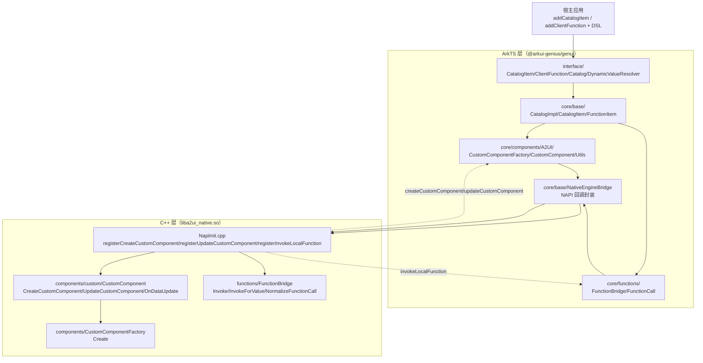
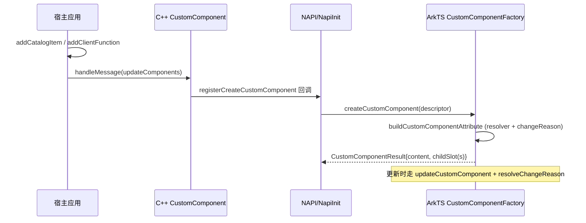

# 架构设计

> 确认目标仓和模块的架构约束、关键设计决策、Spec 拆分方向。

## 设计元数据

| Field | Content |
|-------|---------|
| Design ID | DESIGN-Func-07-04-20 |
| 关联需求 | 已有能力补录（无独立 requirement.md） |
| 关联 Epic | 无 |
| 目标 Feature | Feat-01 自定义组件注册与使用（基线）；Feat-02 自定义函数注册与调用 |
| 复杂度 | 标准 |
| 目标版本 | OpenHarmony API Version 13（`@arkui-genius/genui`） |
| Owner | GenUI SIG |
| 状态 | Baselined（已有实现补录） |

## 需求基线

> 需求基线详见 proposal.md。以下仅列出设计阶段需要额外强调的要点。

| 项 | 补充说明 |
|----|---------|
| 补录而非新增 | 当前实现即规格，可疑行为只能标注为风险/备注 |
| 基准实现声明 | 共享契约域以 A2UIRender 全量渲染引擎（`GenerativeUI/A2UIRender`，`@arkui-genius/genui`）为基准实现 |
| 范围边界 | 本功能域（07-04-20）覆盖「自定义组件注册与使用」与「自定义函数注册与调用」两大能力；内置组件/内置函数、表达式、数据绑定、事件/action 分发归各自功能域（07-04-02~24），本设计不展开 |
| 双层实现 | 自定义组件/函数均以「公开 ArkTS 契约 → ArkTS 实现 → NAPI 桥 → C++ 原生实现」双层结构承载；公开契约以 `interface/*.ets` 为准，C++ 侧为渲染/函数执行权威实现 |
| 同步语义 | 自定义组件 `ComponentBuilder` 与自定义函数 `FunctionCall` 均为同步回调；异步结果须由宿主经后续消息更新 DataModel/组件 |

## 上下文和现状

### 涉及仓和模块

| 仓库 | 补充架构说明 |
|------|-------------|
| `GenerativeUI/A2UIRender` | 全量渲染引擎。ArkTS 公开契约（`genui/src/main/ets/interface/`）、控制器/目录实现（`ets/core/base/`）、组件工厂与函数桥（`ets/core/components/A2UI/`、`ets/core/functions/`）；C++ 层（`genui/src/main/cpp/`）提供 `liba2ui_native.so` 原生自定义组件渲染与本地函数桥接 |
| `GenerativeUI/Docs` | 开发者文档（自定义组件/自定义函数指南 + API 参考），仅作理解辅助，契约以 A2UIRender 实现为准 |

> 仓、模块、当前职责、影响类型详见 proposal.md「影响范围」。

### 调用链层级分析

| 层 | 模块 | 职责 | 修改类型 |
|----|------|------|---------|
| 1. 公开契约层（ArkTS） | `ets/interface/CatalogItem.ets`、`ClientFunction.ets`、`Catalog.ets`、`DynamicValueResolver.ets`、`Types.ets` | 声明 `CatalogItem`/`ComponentBuilder`/`CustomComponentAttribute`/`ComponentTheme`/`ChangeReason`、`ClientFunction`/`FunctionCall`/`FunctionContext`、`Catalog` 注册接口、`A2UIValueType`/`SchemaProvider`/`SurfaceErrorCode` | 现状（基准实现） |
| 2. 目录实现层（ArkTS） | `ets/core/base/CatalogImpl.ets`、`CatalogItem.ets`、`FunctionItem.ets` | `addCatalogItem`/`addClientFunction` 及查询/移除，同名替换语义；`CatalogItem.forComponent` 归一化；`InnerFunctionItem` 内部函数项 | 现状 |
| 3. 组件工厂层（ArkTS） | `ets/core/components/A2UI/CustomComponentFactory.ets`、`CustomComponent.ets`、`CustomComponentUtils.ets`、`A2UIBasicCustomComponents.ets` | `registerCustomComponent`/`InstallCustomComponent`、`createCustomComponent`/`updateCustomComponent`、`changeReason` 快照判定、多 slot 管理、内置自定义组件定义 | 现状 |
| 4. 函数桥接层（ArkTS） | `ets/core/functions/FunctionBridge.ets`、`ets/core/types/FunctionCall.ets` | `register`/`invoke`/`invokeLocalFunction`、schema 校验与参数规范化、返回类型校验、函数查找、错误分发 | 现状 |
| 5. NAPI 桥接层（ArkTS + C++） | `ets/core/base/NativeEngineBridge.ets`、`cpp/NapiInit.cpp`、`cpp/NativeEntry.h` | 声明并注册 `registerCreateCustomComponent`/`registerUpdateCustomComponent`/`registerInvokeLocalFunction`/`dispatchCustomComponentAction`/`validateCustomComponentChecks` 等桥接回调 | 现状 |
| 6. 原生组件层（C++） | `cpp/components/custom/CustomComponent.cpp/.h`、`cpp/components/CustomComponentFactory.cpp/.h`、`custom/CustomComponentAttributeValue.cpp`、`BindingLifecycle.cpp`、`ExpressionBinding.cpp`、`PropsBuilder.cpp`、`RuntimeProperties.cpp` | `CustomComponent : Component` 实例化、`CreateCustomComponent`/`UpdateCustomComponent` 经 NAPI 回调 ArkTS、属性/主题/数据模型填充、customProps 构建、动态值绑定生命周期 | 现状 |
| 7. 原生函数层（C++） | `cpp/functions/FunctionBridge.cpp/.h`、`FunctionCallInfo.*`、`FunctionResult.*` | `Invoke`/`InvokeForValue`/`NormalizeFunctionCall`、catalog 授权校验、NAPI→Json 转换、`registerInvokeLocalFunction` 回调注册 | 现状 |

检查项：
- [x] 调用链每一层都已覆盖（公开契约→目录实现→组件工厂/函数桥→NAPI→原生组件/函数）
- [x] 每层职责边界清晰（ArkTS 负责契约、注册与流程编排；C++ 负责原生组件渲染与函数桥接）
- [x] 每层修改类型明确（均为「现状」，存量补录）

### 适用架构规则

| Rule ID | 适用原因 | 设计结论 | 验证方式 |
|---------|---------|---------|---------|
| OH-ARCH-LAYERING | ArkTS→NAPI→C++ 跨语言多层调用 | 调用方向自顶向下；C++ 经 NAPI 回调分发到 ArkTS（createCustomComponent/updateCustomComponent/invokeLocalFunction/action） | 架构评审/依赖检查 |
| OH-ARCH-SUBSYSTEM | 单仓 + 独立 Docs 仓，无跨子系统 | 不引入子系统外依赖 | 依赖检查 |
| OH-ARCH-API-LEVEL | 公开 ArkTS API（CatalogItem/ClientFunction/Catalog/DynamicValueResolver），无 C-API | Public API（ArkTS，API Version 13），无新增权限 | API 评审 |
| OH-ARCH-COMPONENT-BUILD | 现状无 BUILD.gn/bundle.json 变更 | 无构建影响 | 构建验证 |
| OH-ARCH-ERROR-LOG | 本地函数错误码 `LOCAL_FUNCTION=3101`；组件/函数静默降级路径打 log | 错误码契约详见 Feat-02；降级路径标注为风险 | UT |

## 不涉及项承接

> proposal.md 已完成 N/A 判定。本节仅对标记「涉及」且需展开设计的维度给出结论。

| 维度 | 设计结论 |
|------|---------|
| 跨进程/SA | 不涉及（同进程 ArkTS↔C++ 经 NAPI） |
| 持久化 | 不涉及（组件/函数定义仅内存态，随 Catalog 生命周期） |
| 权限 | 不涉及（无新增权限；`FunctionBridge.setHostContext` 仅用于内置函数/Schema 资源加载） |
| 国际化/RTL | 内置函数（format/pluralize）关注；自定义组件/函数注册与调用契约本身语言无关 |
| 多设备适配 | 断点/主题切换经 `changeReason` 通知自定义组件重渲染（本域固化判定逻辑）；断点/主题值本身归 07-04-23/24 |
| 范围边界 | 组件/函数语义校验、表达式、数据绑定、action 分发归 07-04-02~24；内置组件/内置函数实现归对应功能域 |

## 关键设计决策

| 决策 ID | 问题 | 推荐方案 | 探索过的替代方案 | 取舍理由 | 影响 |
|--------|------|---------|----------------|---------|------|
| ADR-1 | 自定义组件如何注册 | 以 `CatalogItem{name,schemaProvider,componentBuilder}` 为注册单元；`ComponentBuilder = WrappedBuilder<[CustomComponentAttribute]>`；`name` 与 DSL `component` 字段精确匹配，空名拒绝 | (a) 独立注册器接口；(b) 字符串反射 | 复用 Catalog 能力模型，WrappedBuilder 贴合 ArkUI @Builder 生态 | 空名/未匹配组件静默降级（`CustomComponentFactory.ets:135-141,473-482`） |
| ADR-2 | changeReason 如何判定 | 基于 `CustomComponentAttributeSnapshot` 快照对比：先比 `descriptorJson`，再比 `colorMode`，再比 `breakpoint`，最后比 `componentThemeJson`；分别映射 UPDATE_COMPONENT / THEME_MODE_CHANGE / BREAKPOINT_CHANGE | (a) 由 native 显式传 reason；(b) 不区分 reason | 快照对比无需 native 额外传递，优先级顺序固定 | 同次更新多因叠加时只报优先级最高项（`CustomComponentFactory.ets:254-274`） |
| ADR-3 | resolver 如何绑定到组件实例 | `buildCustomComponentAttribute` 为每个实例构造 `CustomComponentDynamicValueResolver`，注入 `customComponentHandle`/`surfaceId`/`componentId`/`renderId`/`catalogId`/`protocolVersion`/`dataModel`；`invokeFunction` 委托 `FunctionBridge.invoke` | (a) 复用全局 resolver；(b) 惰性构造 | 每实例独立 resolver 保证数据模型/函数调用上下文正确隔离 | resolver 生命周期随 attribute（`CustomComponentFactory.ets:89-100`） |
| ADR-4 | 组件 C++ 侧如何接回 ArkTS | C++ `CustomComponent : Component` 持有组件实例，`CreateCustomComponent`/`UpdateCustomComponent` 经 NAPI 回调 ArkTS `CustomComponentFactory.createCustomComponent/updateCustomComponent`（`registerCreateCustomComponent`/`registerUpdateCustomComponent` 注册） | (a) 纯 ArkTS 实现；(b) 纯 C++ 渲染 | C++ 侧负责组件树/生命周期/数据绑定，ArkTS 负责最终 ArkUI 视图构建 | 桥注册幂等（`ensureBridgeRegistered`） |
| ADR-5 | 自定义函数如何注册 | 以 `ClientFunction{name,schemaProvider,functionCall}` 为注册单元；`FunctionCall = (params, context) => A2UIValueType` 同步签名；`FunctionContext{resolver,onError}` 提供参数解析与错误上报 | (a) 异步 Promise 签名；(b) 事件式 | 同步语义贴合 A2UI FunctionCall 同步求值模型；异步结果走后续消息 | 同步返回 + onError 上报（`ClientFunction.ets:41`） |
| ADR-6 | 函数调用如何双层桥接 | C++ `FunctionBridge::Invoke/InvokeForValue/NormalizeFunctionCall` 构造 `request`，经 `registerInvokeLocalFunction` 回调 ArkTS `FunctionBridge.invokeLocalFunction`；ArkTS 侧先 `validateAndNormalizeFunctionCall`，再执行 `functionCall`，最后 `validateReturnType` | (a) 只 ArkTS 执行；(b) 只 C++ 执行 | C++ 负责授权/catalog 校验与请求编排，ArkTS 负责实际业务执行与类型安全 | 返回类型不匹配→`LOCAL_FUNCTION`（`FunctionBridge.ets:242-248`） |
| ADR-7 | 同名注册如何处理 | `addCatalogItem` 同名替换（`addOrReplaceItem`）；`addClientFunction` 同名覆盖（`functionItems.set`）；name 为空返回 false | (a) 同名报错；(b) 追加多值 | 替换语义符合「注册即覆盖」直觉，避免同名歧义 | 空名拒绝（`CatalogImpl.ets:73-80,94-101`） |

## 设计骨架

### 骨架范围

| 骨架项 | 目标 | 不包含 | 验证方式 |
|--------|------|--------|---------|
| 自定义组件注册 | 固化 `CatalogItem`/`ComponentBuilder`/`CustomComponentAttribute`/`ChangeReason` 契约与 `CatalogImpl` 注册/查询语义 | 内置组件实现（07-04-02~16） | ArkTS 单测 + ohosTest |
| 自定义组件使用 | 固化 C++ `CustomComponent` 实例化 → NAPI 回调 ArkTS 构建/更新流程、`changeReason` 判定、resolver 绑定 | 数据模型/表达式语义（07-04-21） | C++ UT + ohosTest |
| 自定义函数注册 | 固化 `ClientFunction`/`FunctionCall`/`FunctionContext` 契约与 catalog 同名覆盖语义 | 内置函数实现（07-04-08/09/16） | ArkTS 单测 |
| 自定义函数调用 | 固化 C++ `FunctionBridge` → ArkTS `invokeLocalFunction` 双层桥、schema 校验/规范化、返回类型校验、错误分发 | action/事件分发（07-04-22） | C++ UT + ohosTest |

### 骨架 Spec 拆分

| Task ID | 目标 | 受影响文件 | AC |
|---------|------|----------|-----|
| TASK-SKELETON-1 | Feat-01 自定义组件注册与使用基线 | `interface/CatalogItem.ets`、`core/base/CatalogImpl.ets`、`core/components/A2UI/CustomComponentFactory.ets`、`cpp/components/custom/CustomComponent.cpp` 等 | AC-1.1~1.x |
| TASK-SKELETON-2 | Feat-02 自定义函数注册与调用 | `interface/ClientFunction.ets`、`core/functions/FunctionBridge.ets`、`cpp/functions/FunctionBridge.cpp` 等 | AC-2.1~2.x |

## 后续 Task 拆分

| Task ID | 目标 | 受影响文件 | 依赖 |
|---------|------|----------|------|
| T-1 | Feat-01 自定义组件注册与使用（基线，本设计已承接） | `Feat-01-custom-component-registration-spec.md` + 本 design.md | — |
| T-2 | Feat-02 自定义函数注册与调用 | `Feat-02-custom-function-registration-spec.md` | T-1 |

## API 签名、Kit 与权限

> 本节承接 spec.md「API 变更分析」中识别的 API，给出签名、权限和 d.ts 位置等实现细节。

### 新增 API

无新增。本特性覆盖既有 ArkTS 公开 API（存量补录，API Version 13）。

### 变更/废弃 API

| 原有 API | 变更类型 | 新 API | 迁移说明 |
|---------|---------|--------|---------|
| `Catalog.addCatalogItem/removeCatalogItem/hasCatalogItem/getAllCatalogItemNames` | 既有 | — | 自定义组件注册/查询契约 |
| `Catalog.addClientFunction/removeClientFunction/hasClientFunction/getAllClientFunctionNames` | 既有 | — | 自定义函数注册/查询契约 |
| `CatalogItem`（`name`/`schemaProvider`/`componentBuilder`） | 既有 | — | 组件注册单元 |
| `CustomComponentAttribute` / `ComponentTheme` / `ChangeReason` / `ComponentBuilder` | 既有 | — | 组件运行时上下文契约 |
| `ClientFunction`（`name`/`schemaProvider`/`functionCall`） / `FunctionCall` / `FunctionContext` / `FunctionErrorReporter` | 既有 | — | 函数注册/执行契约 |

> d.ts 位置：`genui/src/main/ets/interface/*.ets`（ArkTS 源即契约，无独立 SDK `.d.ts`）。Kit：`@arkui-genius/genui`；权限：无；SysCap：不适用。

## 构建系统影响

### BUILD.gn 变更

无变更（存量补录）。`genui/src/main/cpp/components/custom/` 与 `genui/src/main/cpp/functions/` 已纳入现有 `liba2ui_native.so` 构建目标。

### bundle.json 变更

无变更。

## 可选设计扩展

### 架构图



### 数据流/控制流

| 步骤 | 调用方 | 被调用方 | 数据/接口 | 说明 |
|------|--------|---------|----------|------|
| 1 | 宿主应用 | `Catalog.addCatalogItem` | `CatalogItem` | 注册组件（同名替换） |
| 2 | 宿主应用 | `Catalog.addClientFunction` | `ClientFunction` | 注册函数（同名覆盖） |
| 3 | 宿主应用 | `SurfaceControllerImpl.handleMessage` | dsl string | 组件/函数入口 |
| 4 | native | `CustomComponent::CreateCustomComponent` | `CustomComponentDescriptor` | 组件实例化 |
| 5 | native | `CustomComponentFactory.createCustomComponent`（NAPI 回调） | `CustomComponentDescriptor` | ArkTS 构建 ComponentContent |
| 6 | native | `FunctionBridge::Invoke` | `FunctionCallInfo{name,args,returnType}` | 函数调用授权 |
| 7 | native | `FunctionBridge.invokeLocalFunction`（NAPI 回调） | `LocalFunctionRequest` | ArkTS 执行自定义函数 |
| 8 | ArkTS | `FunctionBridge.fail/notifyLocalFunctionError` | `errorCode/errorMessage` | 错误分发 |

### 时序设计



### 数据模型设计

**API 层（ArkTS，公开契约）**

```typescript
// ets/interface/CatalogItem.ets
export interface CatalogItem { name: string; schemaProvider: SchemaProvider; componentBuilder: ComponentBuilder; }
export type ComponentBuilder = WrappedBuilder<[CustomComponentAttribute]>;
export enum ChangeReason { UPDATE_COMPONENT, THEME_MODE_CHANGE, BREAKPOINT_CHANGE }
export interface CustomComponentAttribute { readonly type: string; readonly id: string; readonly surfaceId: string;
  readonly customProps?: Record<string, Object>; readonly protocolVersion: string; readonly catalogId: string;
  readonly componentTheme: ComponentTheme; readonly resolver: DynamicValueResolver; readonly changeReason: ChangeReason; }

// ets/interface/ClientFunction.ets
export type FunctionCall = (params: A2UIValueType, context: FunctionContext) => A2UIValueType;
export interface ClientFunction { name: string; schemaProvider: SchemaProvider; functionCall: FunctionCall; }
export interface FunctionContext { resolver: DynamicValueResolver; onError: FunctionErrorReporter; }
```

**Framework 层（C++）**

```cpp
// cpp/components/custom/CustomComponentDescriptor.h
struct CustomComponentDescriptor { std::string type; std::string id; std::string surfaceId; JsonValue customProps; CommonStyleProps properties; };

// cpp/functions/FunctionResult.h
enum class FunctionResultType { NULL_VALUE = 0, BOOL, INT, DOUBLE, STRING, JSON_VALUE };
```

| 结构 | 存储方案 | 生命周期 |
|------|---------|---------|
| `CustomComponentFactory.definitions`（ArkTS） | `Map<string, CustomComponentDefinition>` | registerCustomComponent 增，进程内常驻 |
| `CatalogImpl.components` | `CatalogItem[]` | add/remove 增删 |
| `CatalogImpl.functionItems` | `Map<string, InnerFunctionItem>` | add/remove 增删 |
| `CustomComponent.descriptor_` | `CustomComponentDescriptor` 值对象 | 组件实例持有 |
| `FunctionBridge.invokeLocalFunctionRef_`（C++） | `napi_ref` 单例 | `RegisterInvokeLocalFunction` 增（幂等替换） |

### 资源所有权矩阵

| 资源 | 创建方 | 持有方 | 销毁触发 | 实际释放 | 异常回收 |
|------|--------|--------|---------|---------|---------|
| `CustomComponent`（C++） | `CustomComponentFactory::Create` | `SurfaceSlot::allComponents_` | 组件移除 | `DisposeComponentContent` | `ResetReferences` |
| `ComponentContent`（ArkTS） | `CustomComponentFactory.createCustomComponent` | C++ `CustomComponent`（napi_ref） | 组件移除/更新 | ArkTS GC + C++ 解引用 | — |
| `CustomComponentDynamicValueResolver` | `buildCustomComponentAttribute` | `CustomComponentAttribute` | attribute 失效 | ArkTS GC | — |
| `invokeLocalFunctionRef_` | `RegisterInvokeLocalFunction` | `FunctionBridge` 单例 | 进程结束 | `napi.DeleteReference` | 注册前先释放旧 ref |

### 接口参数规约

| 接口 | 参数 | 类型 | 合法范围 | 非法处理 | 边界说明 |
|------|------|------|---------|---------|---------|
| `addCatalogItem` | catalogItem | CatalogItem | name 非空、schemaProvider/componentBuilder 存在 | 归一化失败返回 false | 空名返回 false |
| `addClientFunction` | clientFunction | ClientFunction | name 非空、functionCall 存在 | 归一化失败返回 false | 空名返回 false |
| `createCustomComponent` | value.type | string | 已注册组件类型 | 空 builder 返回 `{}` | 空 UIContext 返回 `{}` |
| `invoke` | functionCall.call | string | 非空函数名 | 空 call 返回 undefined | returnType 缺省 `any` |
| `RegisterDynamicValueCallback` | propertyName | string | 非空 | 返回 false + errorMessage | — |

### 线程与并发模型

| 操作 | 发起线程 | 回调线程 | 跨进程边界 | 线程安全 | 重入约束 |
|------|---------|---------|----------|---------|---------|
| addCatalogItem/addClientFunction | UI | UI | 无 | 单线程 UI | 需在创建 SurfaceController 前 |
| createCustomComponent/updateCustomComponent | native→ArkTS | UI | 无 | 单线程 | 处理中不可销毁 |
| invokeLocalFunction | native→ArkTS | UI | 无 | 单线程 | 同步执行，无重入 |
| changeReason 快照对比 | ArkTS | UI | 无 | WeakMap 持有 | 更新批次内 |

## 详细设计

### 自定义组件注册

`CatalogImpl.addCatalogItem`（`CatalogImpl.ets:73-80`）：`normalizeComponentItem` 经 `CatalogItem.fromComponentItem`（`core/base/CatalogItem.ets:110-127`）归一化——null/空名/缺 `schemaProvider` 或缺 `componentBuilder` 返回 undefined 进而 add 返回 false；`fromComponentItem` 对非 `CatalogItem` 实例以 `preserveDynamicDescriptors: true` 重建。`addOrReplaceItem`（`CatalogImpl.ets:123-130`）按 name 精确匹配，命中替换、未命中追加。`hasCatalogItem`（`:86-88`）按 name 线性查找；`getAllCatalogItemNames`（`:90-92`）返回 name 列表。

### 组件工厂注册与实例化

`CustomComponentFactory.registerCustomComponent`（`CustomComponentFactory.ets:135-141`）：type 空直接返回；`ensureBridgeRegistered` 后 `definitions.set(type, definition)`。`ensureBridgeRegistered`（`:160-170`）幂等注册 `registerCreateCustomComponent`/`registerUpdateCustomComponent`。`createCustomComponent`（`:473-505`）：UIContext 空或 builder 未找到返回 `{}`；多 slot 类型走 `createMultiSlotComponent`，单 slot 走 `buildCustomComponentAttribute` + `new ComponentContent`。`findDefinition`（`:180-190`）先精确匹配，失败后按 `getShortType`（`.` 分隔末段）短名兜底。`registerCatalogComponents`（`:143-158`）将 catalog 中非 `isInnerNative` 且带 builder 的项转入 definitions。

### changeReason 快照判定

`resolveChangeReason`（`CustomComponentFactory.ets:254-274`）：`previousSnapshot` 缺失或 `descriptorJson` 变化→`UPDATE_COMPONENT`；否则 `colorMode` 变化→`THEME_MODE_CHANGE`；否则 `breakpoint` 变化→`BREAKPOINT_CHANGE`；否则 `componentThemeJson` 变化→`THEME_MODE_CHANGE`；否则回落 `UPDATE_COMPONENT`。快照经 `createAttributeSnapshot`（`:239-252`）构造，用 `WeakMap<ComponentContent, Snapshot>`（`:113-116`）持久化，`rememberAttributeSnapshot`（`:276-281`）在创建/更新末尾写入。

### 原生组件实例化与属性填充

C++ `CustomComponent`（`CustomComponent.cpp:414` 构造、`:432` 析构）继承 `Component`。`ApplyCommonAttributes`（`:677`）与 `ApplyPrivateAttributes`（`:735`）解析 descriptor；`ApplyCustomProperties`（`:1256`）填充 `customPropertyNames_`/`properties_`。`CreateAttributeValue`（`CustomComponentAttributeValue.cpp:185-194`）分四步填充：`PopulateAttributeIdentity`（`:77-98`，type/id/surfaceId/renderId/customComponentHandle/protocolVersion/catalogId）、`PopulateAttributeThemeAndCustomProps`（`:100-113`）、`PopulateAttributeCommonProperties`（`:115-157`）、`PopulateAttributeDataModel`（`:159-183`，从 BindingEngine 取 DataModel 根并序列化）。`BuildCustomProps`（`CustomComponentPropsBuilder.cpp:313-341`）聚合 tabs/children/named/bindings 并做表达式解析。

### 自定义函数注册与查询

`CatalogImpl.addClientFunction`（`CatalogImpl.ets:94-101`）：`normalizeClientFunctionItem`（`:180-190`）空名返回 undefined；`wrapClientFunctionSchemaProvider`（`:192-232`）在 schema 非完整函数 schema 时包一层 `{call,args,returnType}` 包装。同名覆盖由 `functionItems.set(name, item)` 实现。`FunctionBridge.findCatalogFunctionItem`（`FunctionBridge.ets:307-329`）先查 `registeredFunctionOverrides`（`register` 写入），再经 `SurfaceControllerImpl.getControllerByRenderId` 取 catalog 的 `functions` 列表精确匹配。

### 函数双层桥接

C++ `FunctionBridge::Invoke/InvokeForValue/NormalizeFunctionCall`（`functions/FunctionBridge.cpp:427-461`）统一走 `InvokeInternal`（`:346-394`）：`ValidateInvokeTarget`（`:219-239`）校验 surface 与 `slot->GetCatalog()->HasFunction(functionName)`，未注册则 `DispatchUnknownLocalFunctionError` 并返回 false；`BuildInvokeRequest`（`:260-283`）构造 `{renderId,surfaceId,componentId,functionName,args,returnType[,normalizeOnly]}`；回调 ArkTS 后 `ValidateInvokeResponse`（`:299-320`）校验 `success` 字段。ArkTS `invokeLocalFunction`（`FunctionBridge.ets:177-267`）先 `validateAndNormalizeFunctionCall`，失败返回 `LOCAL_FUNCTION`；执行 `functionCall` 后 `validateReturnType`（`:377-398`）按 returnType 校验，不匹配报 `LOCAL_FUNCTION`；执行抛异常或 `onError` 上报均经 `notifyLocalFunctionError` 分发。

## 风险和开放问题

| 项 | 类型 | 影响 | 处理方式 | Owner |
|----|------|------|---------|-------|
| RISK-1 组件未注册/空 builder/空 UIContext 时 `createCustomComponent` 静默返回 `{}`，无错误码上报 | 架构 | 中 | 规格 Feat-01 AC 标注；`CustomComponentFactory.ets:473-482` | GenUI SIG |
| RISK-2 `changeReason` 判定优先级固定，同次更新多因叠加时只报优先级最高项（descriptor 变更优先于主题/断点） | 边界 | 低 | 规格 Feat-01 AC + 风险表标注；`CustomComponentFactory.ets:254-274` | GenUI SIG |
| RISK-3 公开 `CatalogItem` 无 `isInnerNative`/`preserveDynamicDescriptors` 字段，而 `core/base/CatalogItem` 有，二者语义分裂 | API | 中 | 规格 Feat-01 风险表标注；`core/base/CatalogItem.ets:66-72` | GenUI SIG |
| RISK-4 `FunctionBridge.register` 与 catalog 同名函数：`findCatalogFunctionItem` 先查 override 再查 catalog，自定义覆盖内置需谨慎 | 架构 | 中 | 规格 Feat-02 AC + 风险表标注；`FunctionBridge.ets:307-315` | GenUI SIG |
| RISK-5 函数返回类型不匹配仅报 `LOCAL_FUNCTION=3101`，无细分错误码；`void` 返回要求 `value===undefined` | 边界 | 低 | 规格 Feat-02 AC 覆盖；`FunctionBridge.ets:377-398` | GenUI SIG |
| RISK-6 C++ `MAX_NAPI_TO_JSON_DEPTH=32` 函数返回值/参数嵌套深度上限，超限返回 JsonValue 空导致转换失败 | 边界 | 低 | 规格 Feat-02 风险表标注；`functions/FunctionBridge.cpp:39` | GenUI SIG |

## 设计审批

- [x] 需求基线已确认，设计覆盖 P0/P1 AC
- [x] 不涉及项已承接，N/A 和展开项都有结论
- [x] 涉及仓和模块职责清楚
- [x] 调用链层级分析完整，每层覆盖到位
- [x] 适用架构规则已识别并形成设计结论
- [x] 分层和子系统边界合规
- [x] API 变更有签名、权限、错误码和兼容性说明
- [x] BUILD.gn/bundle.json 影响明确
- [x] 设计输出和后续 Task 拆分明确
- [x] 关键设计决策有理由和影响说明
- [x] 风险和开放问题有 Owner

**结论:** 通过（已有实现补录）
