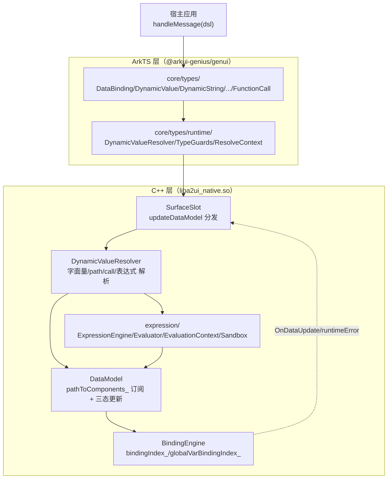
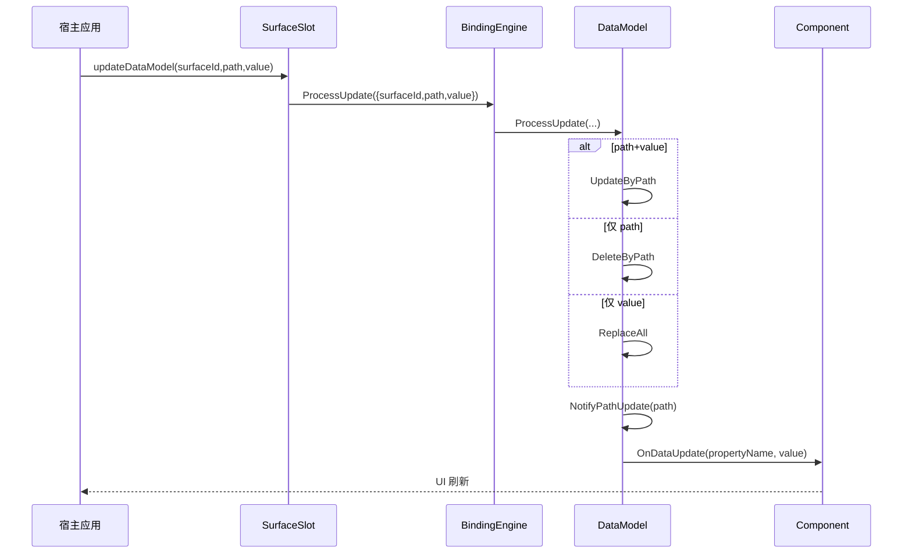

# 架构设计

> 确认目标仓和模块的架构约束、关键设计决策、Spec 拆分方向。

## 设计元数据

| Field | Content |
|-------|---------|
| Design ID | DESIGN-Func-07-04-21 |
| 关联需求 | 已有能力补录（无独立 requirement.md） |
| 关联 Epic | 无 |
| 目标 Feature | Feat-01 DataModel 读写契约（基线）；Feat-02 路径绑定；Feat-03 表达式绑定；Feat-04 变量系统 |
| 复杂度 | 复杂 |
| 目标版本 | A2UI 原生协议 v0.9（`https://a2ui.org/specification/v0_9/catalogs/basic/catalog.json`）+ 鸿蒙扩展协议 1.0.0（`ohos.a2ui.extended.catalog`，起始 API Version 20） |
| Owner | GenUI SIG |
| 状态 | Baselined（已有实现补录） |

## 需求基线

> 需求基线详见 proposal.md。以下仅列出设计阶段需要额外强调的要点。

| 项 | 补充说明 |
|----|---------|
| 补录而非新增 | 当前实现即规格，可疑行为只能标注为风险/备注 |
| 基准实现声明 | 动态数据绑定域以 A2UIRender 全量渲染引擎（`GenerativeUI/A2UIRender`，`@arkui-genius/genui`）为基准实现 |
| 值与结构分离 | 组件描述界面骨架，DataModel 填充内容；`updateDataModel` 消息驱动 DataModel 更新，绑定组件经订阅通知自动刷新 |
| DynamicValue 三来源 | 组件属性值支持「字面量 / 路径绑定 `{"path": "..."}` / 函数调用 `{"call": ..., "args": {...}}`」三态；表达式 `{{ }}` 为鸿蒙扩展协议新增第四态 |
| 协议边界 | 路径绑定（DataBinding/PathBinding）为 A2UI v0.9 原生能力；表达式（`{{ }}`）与变量系统（`$__widthBreakpoint`/`$__colorMode`/`$__dataModel` 等）为鸿蒙扩展协议能力，仅在 extended catalog + updateComponents 场景生效 |
| 范围边界 | 本域（07-04-21）覆盖 DataModel 读写 + 路径绑定 + 表达式绑定 + 变量系统；消息模型/组件/函数/样式/事件语义归各自功能域（07-04-01/02~20/22~24），本设计不展开 |

## 上下文和现状

### 涉及仓和模块

| 仓库 | 补充架构说明 |
|------|-------------|
| `GenerativeUI/A2UIRender` | 全量渲染引擎。ArkTS 层（`genui/src/main/ets/core/types/`、`ets/core/types/runtime/`）提供类型契约与运行时解析；C++ 层（`genui/src/main/cpp/`）提供原生 DataModel / BindingEngine / DynamicValueResolver / 表达式引擎（`liba2ui_native.so`） |
| `GenerativeUI/Docs` | 开发者文档（概念/类型/表达式/变量），仅作理解辅助，契约以 A2UIRender 实现为准 |

> 仓、模块、当前职责、影响类型详见 proposal.md「影响范围」。

### 调用链层级分析

| 层 | 模块 | 职责 | 修改类型 |
|----|------|------|---------|
| 1. 公开契约层（ArkTS 类型） | `ets/core/types/DataBinding.ets`、`DynamicValue.ets`、`DynamicString/Number/Boolean/StringList.ets`、`FunctionCall.ets` | 声明 DynamicValue 三态的 JSON Schema 与类型别名 | 现状（补录） |
| 2. 运行时解析层（ArkTS） | `ets/core/types/runtime/DynamicValueResolver.ets`、`TypeGuards.ets`、`ResolveContext.ets`、`CustomComponentDynamicValueResolver.ets` | ArkTS 侧动态值解析（字面量/路径/函数）、TypeGuard 判定 | 现状 |
| 3. 消息处理层（C++） | `cpp/SurfaceSlot.cpp`、`SurfaceManager.cpp` | `updateDataModel` 分发、`ExecuteDataModelOperation` 三态 | 现状 |
| 4. 数据模型与绑定层（C++） | `cpp/data/DataModel.cpp`、`BindingEngine.cpp`、`PathValidator.cpp`、`DynamicValueResolver.cpp`、`ResolvedValue.cpp` | 路径化数据模型、绑定订阅索引、通知刷新、动态值解析 | 现状 |
| 5. 表达式引擎层（C++） | `cpp/expression/ExpressionEngine.cpp`、`Lexer/Parser/Evaluator/EvaluationContext/DependencyCollector/Sandbox` | `{{ }}` 表达式识别、求值、依赖收集、安全沙箱 | 现状 |
| 6. 变量上下文层（C++） | `cpp/expression/EvaluationContext.cpp`、`ThemeContextUtils.h`、`DataModelPathUtils.h` | 全局变量（断点/深浅色/dataModel）注入、局部变量作用域栈 | 现状 |

检查项：
- [x] 调用链每一层都已覆盖（公开类型契约 → ArkTS 解析 → 消息处理 → 数据模型/绑定 → 表达式引擎 → 变量上下文）
- [x] 每层职责边界清晰（ArkTS 负责类型契约与轻量解析，C++ 负责原生数据模型、订阅与表达式求值）
- [x] 每层修改类型明确（均为「现状」，存量补录）

### 适用架构规则

| Rule ID | 适用原因 | 设计结论 | 验证方式 |
|---------|---------|---------|---------|
| OH-ARCH-LAYERING | ArkTS→NAPI→C++ 跨语言多层调用 | 调用方向自顶向下；C++ 经 NAPI 回调分发错误（action/schemaWarning/runtimeError） | 架构评审/依赖检查 |
| OH-ARCH-SUBSYSTEM | 单仓 + 独立 Docs 仓，无跨子系统 | 不引入子系统外依赖 | 依赖检查 |
| OH-ARCH-API-LEVEL | 公开 ArkTS 类型契约（DataBinding/Dynamic*/FunctionCall），无 C-API | Public API（ArkTS），无新增权限；表达式/变量为扩展协议能力 | API 评审 |
| OH-ARCH-COMPONENT-BUILD | 现状无 BUILD.gn/bundle.json 变更 | 无构建影响 | 构建验证 |
| OH-ARCH-ERROR-LOG | 错误码双层：native `SURFACE_ERROR_*`（3202/3203/3204）→ ArkTS `SurfaceErrorCode` 枚举 | 错误码契约详见各 Feat | UT |
| OH-ARCH-SECURITY | 表达式为不可信输入，需沙箱防 DoS | 沙箱 4 阶段校验 + 表达式长度/深度/Token/AST 上限 | 安全评审/UT |

## 不涉及项承接

> proposal.md 已完成 N/A 判定。本节仅对标记「涉及」且需展开设计的维度给出结论。

| 维度 | 设计结论 |
|------|---------|
| 跨进程/SA | 不涉及（同进程 ArkTS↔C++ 经 NAPI） |
| 持久化 | 不涉及（DataModel 仅内存态，surface 销毁即释放） |
| 权限 | 不涉及 |
| 国际化/RTL | 本域数据/绑定/表达式契约设备无关；布型展示由组件/样式层关注 |
| 多设备适配 | 断点/深浅色为全局变量（`$__widthBreakpoint`/`$__colorMode`）注入到表达式上下文，本域固化为变量语义，具体阈值归 07-04-23/24 |
| 表达式安全 | 涉及：表达式为服务端下发的不可信输入，需沙箱（长度/深度/Token/AST 上限）防护，详见 Feat-03 |

## 关键设计决策

| 决策 ID | 问题 | 推荐方案 | 探索过的替代方案 | 取舍理由 | 影响 |
|--------|------|---------|----------------|---------|------|
| ADR-1 | DataModel 更新如何表达增删改 | `DataModelUpdate{surfaceId, path, value(optional)}` 三态：path+value→`UpdateByPath`、仅 path→`DeleteByPath`、仅 value（path 空）→`ReplaceAll`；三态在 `DataModel::ProcessUpdate` 统一分发 | (a) 全量覆盖；(b) 仅 path/value 全有 | A2UI v0.9 `updateDataModel` 语义；path/value 组合表达增删改 | path 与 value 同时缺失判为无效（`DataModel.cpp:455-466`） |
| ADR-2 | 绑定订阅如何索引与通知 | 双索引：`DataModel::pathToComponents_`（path→weak_ptr<Component>）+ `BindingEngine::bindingIndex_`（path→set<component_id>）；`NotifyPathUpdate` 前缀匹配（`IsPathAffected`）双向判定后推 `OnDataUpdate(propertyName, value)` | (a) 全量遍历组件；(b) 只精确匹配 | 前缀匹配覆盖父子路径更新；weak_ptr 过期过滤防悬挂 | 前缀匹配为字符串 `find` 双向判定（`DataModel.cpp:176-214`） |
| ADR-3 | 路径合法性如何校验 | `PathValidator::IsValidDataPath` 只接受以 `/` 开头、由 `[A-Za-z0-9_]` 组成、段非空的路径；`~0`/`~1` 解码在 `DataModel::ParsePath(decodePointer)` 层支持 | (a) 完整 RFC 6901；(b) 不校验 | 简化实现并防注入；JSON Pointer 转义在读取层兜底 | 校验器与 RFC 6901 存在偏差（不含 `~`/`-`），读取层 `GetNode(path, true)` 才解码 `~0/~1`（见 RISK-4） |
| ADR-4 | 表达式如何识别与门控 | `ExpressionEngine::IsExpression` 要求完整 `{{ ... }}`、内部禁止额外 `{}`；仅扩展协议 + `updateComponents` 场景 `allowExpression=true` 才触发求值，标注协议下按普通字符串 | (a) 全文模糊匹配；(b) 所有协议求值 | 协议边界清晰；`{{ }}` 非整值匹配不识别 | 标准协议下 `{{ }}` 字面保留（`expression-language.md:341`） |
| ADR-5 | 表达式安全如何防 DoS | `EvaluationContext` 默认限制：`maxExprLength=2048`、`maxTokenCount=100`、`maxNestingDepth=20`、`maxAstNodes=100`，经 `Sandbox` 解析/词法/嵌套/AST 四阶段校验 | (a) 无限长度；(b) 白名单语法 | 服务端下发不可信输入必须限流 | 超限置 `SANDBOX_*` 错误 → 属性值无效（`EvaluationContext.h:131-134`） |
| ADR-6 | 变量如何分层解析 | `EvaluationContext::ResolveVariable` 固定优先级：`__widthBreakpoint`/`__colorMode`/`__dataModel` → `__*` 未注册报 `EVAL_NO_GLOBAL_VARIABLE` → `globalVariables_` → 作用域栈（就近）→ Undefined；`$__*` 双下划线命名空间不可被局部变量遮蔽 | (a) 单一 map；(b) 无命名空间 | 全局/局部/事件链分层 + `__` 命名空间边界（`variable-system.md:323-353`） | `__*` 局部绑定被 `SetLocalVariable` 静默丢弃（`EvaluationContext.h:71`） |
| ADR-7 | 依赖收集与失效通知如何工作 | 静态依赖收集：`DependencyCollector` 从 AST 提取 `{variableName, path}`；`__dataModel` 依赖落到 `bindingIndex_`（path→component），其余全局变量落到 `globalVarBindingIndex_`；`NotifyGlobalVariableChanged` 按 `globalVarDeps_` 匹配刷新 | (a) 观察者全量通知；(b) 动态追踪 | 静态收集在绑定注册期建立索引，更新期 O(订阅数) 精确刷新 | 表达式绑定注册/注销对称（`BindingEngine.cpp:345-439`） |

## 设计骨架

### 骨架范围

| 骨架项 | 目标 | 不包含 | 验证方式 |
|--------|------|--------|---------|
| DataModel 读写 | 固化 path/value 三态 + 深度上限 + 订阅通知 | 消息模型（07-04-01）；组件/函数语义 | UT |
| 路径绑定 | 固化 `{"path": "..."}` 解析 + JSON Pointer + 缺径策略 | 表达式/变量（07-04-21 其余 Feat） | UT |
| 表达式绑定 | 固化 `{{ }}` 语法/运算/类型转换/沙箱/依赖 | 变量语义（Feat-04） | UT |
| 变量系统 | 固化全局变量 + 局部变量 + 作用域优先级 | 断点/深浅色阈值（07-04-23/24） | UT |

### 骨架 Spec 拆分

| Task ID | 目标 | 受影响文件 | AC |
|---------|------|----------|-----|
| TASK-SKELETON-1 | Feat-01 DataModel 读写契约基线 | `DataModel.cpp/.h`、`BindingEngine.cpp/.h`、`PathValidator.cpp/.h` | AC-1.1~4.x |
| TASK-SKELETON-2 | Feat-02 路径绑定 | `DynamicValueResolver.cpp`、`DataModel.cpp`、`DataBinding.ets` | 各 Feat AC |
| TASK-SKELETON-3 | Feat-03 表达式绑定 | `expression/*`、`DynamicValueResolver.cpp` | 各 Feat AC |
| TASK-SKELETON-4 | Feat-04 变量系统 | `EvaluationContext.cpp`、`ThemeContextUtils.h`、`BindingEngine.cpp` | 各 Feat AC |

## 后续 Task 拆分

| Task ID | 目标 | 受影响文件 | 依赖 |
|---------|------|----------|------|
| T-1 | Feat-01 DataModel 读写契约（基线，本设计已承接） | `Feat-01-datamodel-readwrite-spec.md` + 本 design.md | — |
| T-2 | Feat-02 路径绑定 | `Feat-02-path-binding-spec.md` | T-1 |
| T-3 | Feat-03 表达式绑定 | `Feat-03-expression-binding-spec.md` | T-1,T-2 |
| T-4 | Feat-04 变量系统 | `Feat-04-variable-system-spec.md` | T-1,T-3 |

## API 签名、Kit 与权限

> 本节承接 spec.md「API 变更分析」中识别的 API，给出签名、权限和 d.ts 位置等实现细节。

### 新增 API

无新增。本特性覆盖既有 ArkTS 类型契约（存量补录）。

### 变更/废弃 API

| 原有 API | 变更类型 | 新 API | 迁移说明 |
|---------|---------|--------|---------|
| `A2UIDataBinding`（`path: string`） | 既有 | — | 路径绑定类型（`DataBinding.ets:16-35`） |
| `A2UIDynamicValue`（`A2UIValueType \| A2UIDataBinding \| A2UIFunctionCall`） | 既有 | — | 通用动态值（`DynamicValue.ets:22`） |
| `A2UIDynamicString/Number/Boolean/StringList` | 既有 | — | 动态值子类型（各 types 文件） |
| `A2UIFunctionCall`（`call/args/returnType`） | 既有 | — | 函数调用描述符（`FunctionCall.ets:21-24`） |

> d.ts 位置：`genui/src/main/ets/interface/*.ets` 与 `genui/src/main/ets/core/types/*.ets`（ArkTS 源即契约，无独立 SDK `.d.ts`）。Kit：`@arkui-genius/genui`；权限：无；SysCap：不适用。

## 构建系统影响

### BUILD.gn 变更

无变更（存量补录）。`genui/src/main/cpp/data/` 与 `genui/src/main/cpp/expression/` 已纳入现有 `liba2ui_native.so` 构建目标。

### bundle.json 变更

无变更。

## 可选设计扩展

### 架构图



### 数据流/控制流

| 步骤 | 调用方 | 被调用方 | 数据/接口 | 说明 |
|------|--------|---------|----------|------|
| 1 | 宿主应用 | `SurfaceControllerImpl.handleMessage` | dsl string | 入口 |
| 2 | native | `SurfaceSlot::UpdateDataModel` | `DataModelUpdate{surfaceId,path,value}` | 消息分发 |
| 3 | `SurfaceSlot` | `BindingEngine::ProcessUpdate` | DataModelUpdate | 三态落库 |
| 4 | `DataModel::ProcessUpdate` | `UpdateByPath/DeleteByPath/ReplaceAll` | path/value | 三态写入 |
| 5 | `DataModel` | `NotifyPathUpdate` | path | 前缀匹配订阅通知 |
| 6 | 组件渲染 | `DynamicValueResolver::Resolve` | `DynamicResolveContext` | 字面量/path/call/表达式 |
| 7 | `DynamicValueResolver` | `ExpressionEngine::EvaluateAsJsonValue` | 表达式 + `EvaluationContext` | 表达式求值 |
| 8 | native | `RuntimeErrorDispatchBridge` | `SURFACE_ERROR_*` | 错误回传 |

### 时序设计



### 数据模型设计

**API 层（ArkTS，公开类型契约）**

```typescript
// ets/core/types/DataBinding.ets
export class A2UIDataBinding { public path: string = '' }

// ets/core/types/DynamicValue.ets
export type A2UIDynamicValue = A2UIValueType | A2UIDataBinding | A2UIFunctionCall

// ets/core/types/FunctionCall.ets
export class A2UIFunctionCall { call: string; args?; returnType? }
```

**Framework 层（C++）**

```cpp
// cpp/data/DataModel.h
struct DataModelUpdate { std::string surfaceId; std::string path; std::optional<JsonValue> value; };
static constexpr int32_t MAX_DATA_MODEL_DEPTH = 20;   // DataModel.h:53

// cpp/data/DataBinding.h
enum class BindingType { PATH, FUNCTION_CALL, EXPRESSION };
struct DataBinding { std::string propertyName_; std::string dataPath_; BindingType type_; ... };

// cpp/expression/EvaluationContext.h
size_t maxExprLength = 2048; size_t maxTokenCount = 100;
size_t maxNestingDepth = 20;   size_t maxAstNodes = 100;
```

| 结构 | 存储方案 | 生命周期 |
|------|---------|---------|
| `BindingEngine::dataModels_` | `unordered_map<string, shared_ptr<DataModel>>` | surface create/delete |
| `DataModel::root_` | `shared_ptr<JsonValue>` | 数据模型根 |
| `DataModel::pathToComponents_` | `path → vector<weak_ptr<Component>>` | 订阅索引 |
| `BindingEngine::bindingIndex_` | `path → set<component_id>` | 绑定索引 |
| `BindingEngine::globalVarBindingIndex_` | `varName → set<component_id>` | 全局变量绑定索引 |
| `EvaluationContext::scopeStack_` | `vector<map<string,EvalResult>>` | 局部变量作用域 |

### 测试性设计

| 测试层级 | 测试目标 | Mock 策略 | 验证方式 |
|---------|---------|----------|---------|
| C++ UT | `DataModel` 三态 + 深度上限 + 前缀匹配 | Mock Component | `genui/src/test/cpp/suites/framework/DataModelTest.cpp` |
| C++ UT | `BindingEngine` 注册/通知/深度 | 同上 | `genui/src/test/cpp/suites/framework/BindingEngineDepthTddTest.cpp` |
| C++ UT | 表达式求值 + 类型转换 + 沙箱 | — | `genui/src/test/cpp/suites/expression/ExpressionEvaluatorTest.cpp` |
| C++ UT | 变量解析 + 依赖收集 | — | `genui/src/test/cpp/suites/expression/VariableResolutionTest.cpp` |
| ArkTS UT | `DynamicValue` 解析 | — | `genui/src/test/CustomComponentDynamicValueResolver.test.ets` |

### 资源所有权矩阵

| 资源 | 创建方 | 持有方 | 销毁触发 | 实际释放 | 异常回收 |
|------|--------|--------|---------|---------|---------|
| `DataModel` | `BindingEngine::GetOrCreateDataModel` | `dataModels_` | surface 销毁 | 随 map 释放 | — |
| `Component` 订阅 | `Component` 自身 | `pathToComponents_` (weak_ptr) | 组件销毁 | `CleanupExpiredSubscribers` | `PruneExpiredComponents` |
| `AstNode` 缓存 | `ExpressionEngine` | `cacheList_/cacheMap_` | 超容量 | `EvictOverflow` | — |
| 局部变量作用域 | `DynamicValueResolver` | `EvaluationContext::scopeStack_` | 求值结束 | `PopScope` | 栈析构 |

### 接口参数规约

| 接口 | 参数 | 类型 | 合法范围 | 非法处理 | 边界说明 |
|------|------|------|---------|---------|---------|
| `updateDataModel` | path | string | JSON Pointer `/` 或 `/seg/...` | 非法→`UpdateByPath` 返回 false | 缺省 `/` |
| `updateDataModel` | value | any | 可选 | 缺 value + 有 path→删除 | path 与 value 同缺→无效 |
| `DataBinding` | path | string | 必填 JSON Pointer | 非法→路径解析失败 | 必填（`required:["path"]`） |
| 表达式 | value | string | `{{ ... }}`，≤2048 字符 | 非整值→字面；超长→无效 | 内部禁 `{}` |

### 线程与并发模型

| 操作 | 发起线程 | 回调线程 | 跨进程边界 | 线程安全 | 重入约束 |
|------|---------|---------|----------|---------|---------|
| handleMessage | UI | UI | 无 | 单线程 UI | 处理中不可销毁 surface |
| 绑定通知 | UI | UI | 无 | 单线程 | — |
| 全局变量刷新 | UI | UI | 无 | 单线程 | — |
| 表达式求值 | UI | UI | 无 | 单线程 | 无并发 |

## 详细设计

### DataModel 三态读写与订阅

`DataModel::ProcessUpdate`（`DataModel.cpp:443-467`）：surfaceId 不匹配直接返回（`:448-452`）；path+value→`UpdateByPath`（`:455-457`）、仅 path→`DeleteByPath`（`:458-460`）、仅 value→`ReplaceAll`（`:461-463`）、双空→warn（`:464-466`）。`UpdateByPath`（`:346-382`）确保根存在后 `ParsePath` 分段，空段回退 `ReplaceAll`（`:361-364`），`BuildUpdatedNode` 递归重建更新路径，随后对 `pathToComponents_` 做 `IsPathAffected` 前缀匹配并 `NotifyPathUpdate`。`DeleteByPath`（`:384-422`）经 `BuildNodeWithoutPath` 删除键，键不存在返回 false（`:410-411`）。`ReplaceAll`（`:424-441`）克隆根并通知全部注册路径。深度上限在 `BindingEngine::UpdateDataModelByPath`/`ReplaceDataModel`（`BindingEngine.cpp:136-141`、`171-175`）测量 `MeasureJsonDepth` 超 `MAX_DATA_MODEL_DEPTH=20` 时仅记日志（不拒绝）。

### 路径校验与缺失处理

`IsValidDataPath`（`PathValidator.cpp:29-61`）：空或非 `/` 开头→false（`:31-33`）；单 `/`→true（`:35-37`）；逐字符仅允许 `[A-Za-z0-9_]`，`/` 需有非空段，段首尾不得空（`:39-60`）。`DataModel::GetNode(path, decodePointer)`（`:471-523`）支持数组索引（`std::stoi`）与 `~0/`~1` 解码（`ParsePath` decodePointer 分支，`:124`）。路径缺失上报由 `MissingPathPolicy`（`DynamicValueResolver.h:33`）控制：`REPORT_ALWAYS` 或 surface 已收到数据更新时，`DispatchMissingPathError` 上报 `path not found`（`DynamicValueResolver.cpp:62-76`）。

### 路径绑定解析

`ResolvePathValue`（`DynamicValueResolver.cpp:767-798`）：描述符须含 string `path`（`:769-772`）；`IsValidDataPath` 失败且无 `~` 时判非法（`:775-777`）；随后 `GetNode(path, true)` 读取并克隆；缺径走 `DispatchMissingPathError` 返回 `FailPath`（`:784-788`）。`HasOnlyPathDescriptorKey`（`:258-270`）区分纯路径描述符与对象字面量。ArkTS 侧 `TypeGuards.isDataBinding`（`TypeGuards.ets:23-30`）以 `path` string 且无 `call` 判定路径绑定。

### 表达式求值

`ExpressionEngine::IsExpression`（`ExpressionEngine.cpp:429-452`）要求完整 `{{...}}` 包裹且内部不含额外 `{}`。`EvaluateInternal`（`:475-496`）→ `PrepareExpression`（`:498-522`）校验长度（`maxExprLength=2048`）→ 词法 → `ValidatePreparedTokens`（Token 数 / 嵌套深度校验）→ 解析 AST → 求值。变量与路径解析在 `Evaluator::EvaluateVariableReference`（`Evaluator.cpp:500-516`）与 `TryEvaluateDataModelMemberAccess`（`:676-696`，经 `DataModelPathUtils::TryExtractDataModelPath` 提取 `$__dataModel.*` 路径）。内置 `size()` 注册于 `ExpressionEngine.cpp:402-415`（单参数组，非数组报 `size() expects an array argument`）。类型转换 +/`==`/`<` 等规则见 expression-language.md `类型转换规则` 章节。

### 变量解析与作用域

`EvaluationContext::ResolveVariable`（`EvaluationContext.cpp:26-72`）：`__widthBreakpoint`/`__colorMode`/`__dataModel` 特判（`:28-48`）；`__*` 未注册→`EVAL_NO_GLOBAL_VARIABLE`（`:50-57`）；`globalVariables_`（`:59-62`）；作用域栈就近查找（`:64-69`）；否则 Undefined。断点/深浅色字符串映射在 `ThemeContextUtils.h:25-53`。全局变量绑定刷新经 `BindingEngine::NotifyGlobalVariableChanged`（`BindingEngine.cpp:445-482`）按 `globalVarDeps_` 匹配刷新表达式/函数调用属性。

## 风险和开放问题

| 项 | 类型 | 影响 | 处理方式 | Owner |
|----|------|------|---------|-------|
| RISK-1 表达式引擎由 `ENABLE_EXPRESSION_ENGINE` 宏编译开关控制，关闭时表达式/变量能力整体缺失 | 构建 | 中 | 规格 Feat-03/04 标注；`BindingEngine.cpp:30-37` 条件编译 | GenUI SIG |
| RISK-2 `PathValidator::IsValidDataPath` 仅允许 `[A-Za-z0-9_]`，比 RFC 6901 更严格（不含 `-`、多字节键、`~` 于校验层），读取层才解码 `~0/~1` | 架构 | 中 | 规格 Feat-02 风险表标注；`PathValidator.cpp:22-25` | GenUI SIG |
| RISK-3 深度上限超限仅记日志不拒绝更新（`BindingEngine.cpp:136-141`），与规格「拒绝/截断」预期存在偏差 | 边界 | 低 | 规格 Feat-01 标注实际行为；`DataModel.h:53` | GenUI SIG |
| RISK-4 全局变量 ArkTS/C++ 双份维护（`__widthBreakpoint`/`__colorMode` 在 `EvaluationContext.cpp` 特判 + `ThemeContextUtils.h` 映射），新增变量需同步 | 架构 | 中 | 规格 Feat-04 标注；`VariableResolutionTest.cpp` | GenUI SIG |
| RISK-5 表达式 AST 缓存默认关闭（`astCacheEnabled_=false`，`ExpressionEngine.h:100`），性能与防重放缓存需权衡 | 测试 | 低 | 规格 Feat-03 标注 | GenUI SIG |

## 设计审批

- [x] 需求基线已确认，设计覆盖 P0/P1 AC
- [x] 不涉及项已承接，N/A 和展开项都有结论
- [x] 涉及仓和模块职责清楚
- [x] 调用链层级分析完整，每层覆盖到位
- [x] 适用架构规则已识别并形成设计结论
- [x] 分层和子系统边界合规
- [x] API 变更有签名、权限、错误码和兼容性说明
- [x] BUILD.gn/bundle.json 影响明确
- [x] 设计输出和后续 Task 拆分明确
- [x] 关键设计决策有理由和影响说明
- [x] 风险和开放问题有 Owner

**结论:** 通过（已有实现补录）