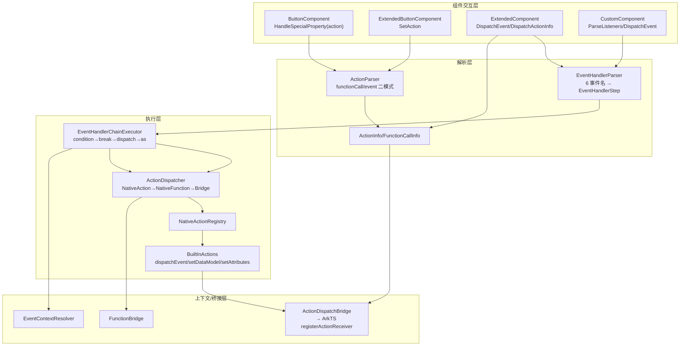
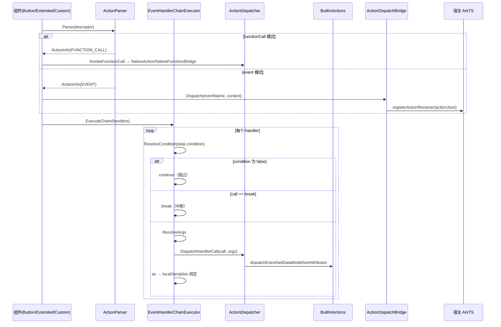

# 架构设计

> 确认目标仓和模块的架构约束、关键设计决策、Spec 拆分方向。

## 设计元数据

| Field | Content |
|-------|---------|
| Design ID | DESIGN-Func-07-04-22 |
| 关联需求 | 已有能力补录（无独立 requirement.md） |
| 关联 Epic | 无 |
| 目标 Feature | Feat-01 交互模型（基线）；Feat-02 事件处理链语义 |
| 复杂度 | 复杂 |
| 目标版本 | A2UI 原生协议 v0.9（`https://a2ui.org/specification/v0_9/catalogs/basic/catalog.json`）+ 鸿蒙扩展协议（`ohos.a2ui.extended.catalog`） |
| Owner | GenUI SIG |
| 状态 | Baselined（已有实现补录） |

## 需求基线

> 需求基线详见 proposal.md。以下仅列出设计阶段需要额外强调的要点。

| 项 | 补充说明 |
|----|---------|
| 补录而非新增 | 当前实现即规格，可疑行为只能标注为风险/备注 |
| 基准实现声明 | 交互行为链以 A2UIRender 全量渲染引擎（`GenerativeUI/A2UIRender`，`@arkui-genius/genui`）为基准实现 |
| 两种交互模型 | Action 二模式（`functionCall` 本地执行 / `event` 上报 Agent）为 A2UI 原生协议；EventHandler 链为鸿蒙扩展协议特有（`catalogId=ohos.a2ui.extended.catalog`） |
| 范围边界 | 本功能域（07-04-22）覆盖 Action 解析/派发 + EventHandler 链执行语义；函数实现（内置 14 函数/扩展函数/自定义函数）语义归各自功能域，本设计只关注"如何被调用/派发" |
| 事件链入口 | 事件链仅能挂接在事件属性（onClick/onAppear/onChange/onSelect/onReachStart/onReachEnd），不可用于组件属性或样式求值 |

## 上下文和现状

### 涉及仓和模块

| 仓库 | 补充架构说明 |
|------|-------------|
| `GenerativeUI/A2UIRender` | 全量渲染引擎。C++ 层（`genui/src/main/cpp/`）提供 `liba2ui_native.so` 原生渲染；`functions/`（ActionParser/ActionInfo/FunctionCallInfo/EventContextResolver/ActionDispatchBridge）承载 Action 模型，`components/actions/`（EventHandlerParser/EventHandlerChainExecutor/ActionDispatcher/NativeActionRegistry/BuiltInActions）承载事件链执行 |
| `GenerativeUI/Docs` | 开发者文档（actions-and-functions.md / functioncall.md / extension-functions.md / handling-user-interactions.md），仅作理解辅助，契约以 A2UIRender 实现为准 |

> 仓、模块、当前职责、影响类型详见 proposal.md「影响范围」。

### 调用链层级分析

| 层 | 模块 | 职责 | 修改类型 |
|----|------|------|---------|
| 1. 组件交互层（C++） | `components/A2UI/button/ButtonComponent.cpp`、`components/extended/ExtendedButtonComponent.cpp`、`components/extended/ExtendedComponent.cpp`、`components/custom/CustomComponent.cpp` | 声明 action 属性、事件属性；注册点击回调；触发 Action/事件链派发 | 现状（基准实现） |
| 2. 动作解析层（C++） | `functions/ActionParser.cpp`、`functions/ActionInfo.cpp`、`functions/FunctionCallInfo.cpp` | 解析 `action` 字段（functionCall/event 二模式互斥）、context 深度校验 | 现状 |
| 3. 事件链解析层（C++） | `components/actions/EventHandlerParser.cpp` | 解析事件属性数组，产出 `EventHandlerStep{call,args,condition,as}` | 现状 |
| 4. 事件链执行层（C++） | `components/actions/EventHandlerChainExecutor.cpp`、`components/actions/ActionDispatcher.cpp`、`components/actions/NativeActionRegistry.cpp` | 链式执行：condition 短路、break 中断、dispatcher 优先级、as 局部变量 | 现状 |
| 5. 内置动作层（C++） | `components/actions/BuiltInActions.cpp` | 注册 dispatchEvent/setDataModel/setAttributes 三个内置动作 | 现状 |
| 6. 事件上下文解析层（C++） | `functions/EventContextResolver.cpp` | 递归解析 event context（path/functionCall），schema warning | 现状 |
| 7. NAPI 桥接层（C++→ArkTS） | `functions/ActionDispatchBridge.cpp`、`functions/FunctionBridge.cpp` | event 上报宿主（registerActionReceiver）、functionCall 转发到 ArkTS 侧函数 | 现状 |

检查项：
- [x] 调用链每一层都已覆盖（组件交互→动作解析→事件链解析→事件链执行→内置动作→上下文解析→NAPI 桥接）
- [x] 每层职责边界清晰（解析层只产出结构，执行层只做派发，桥接层只做跨语言）
- [x] 每层修改类型明确（均为「现状」，存量补录）

### 适用架构规则

| Rule ID | 适用原因 | 设计结论 | 验证方式 |
|---------|---------|---------|---------|
| OH-ARCH-LAYERING | C++ 内部多层调用 + NAPI 跨语言回调 | 调用方向自顶向下；event 经 `ActionDispatchBridge` 回调 ArkTS，functionCall 经 `FunctionBridge` 或原生注册表执行 | 架构评审/依赖检查 |
| OH-ARCH-SUBSYSTEM | 单仓 + 独立 Docs 仓，无跨子系统 | 不引入子系统外依赖 | 依赖检查 |
| OH-ARCH-API-LEVEL | 无新增公开 ArkTS API / C-API，仅既有回调（registerActionReceiver/registerErrorCallback） | Public API（ArkTS），无新增权限 | API 评审 |
| OH-ARCH-COMPONENT-BUILD | 现状无 BUILD.gn/bundle.json 变更 | 无构建影响 | 构建验证 |
| OH-ARCH-ERROR-LOG | 运行时错误经 `RuntimeErrorDispatchBridge`、schema 警告经 `WarningDispatchBridge` 上报 | 错误码契约详见 Feat-01/Feat-02（`SurfaceErrorCodes.h` 3201/3202/3203/3204 段） | UT |

## 不涉及项承接

> proposal.md 已完成 N/A 判定。本节仅对标记「涉及」且需展开设计的维度给出结论。

| 维度 | 设计结论 |
|------|---------|
| 跨进程/SA | 不涉及（同进程 C++↔ArkTS 经 NAPI） |
| 持久化 | 不涉及（DataModel 仅内存态，setDataModel 动作写入内存） |
| 权限 | 不涉及 |
| 国际化/RTL | 组件/样式层关注，本域交互模型不涉及 |
| 多设备适配 | 本域交互/事件链契约为设备无关；断点/主题作为表达式上下文（07-04-23 展开） |
| 范围边界 | 函数实现语义（内置 14 函数/扩展函数/自定义函数）归 07-04-16/20；变量系统/表达式求值归 07-04-21；本域只固化调用与派发链 |

## 关键设计决策

| 决策 ID | 问题 | 推荐方案 | 探索过的替代方案 | 取舍理由 | 影响 |
|--------|------|---------|----------------|---------|------|
| ADR-1 | Action 如何表达交互 | `action` 字段内 `functionCall` 与 `event` 二选一；两者同时出现 → 丢弃整个 action（返回 nullptr） | (a) 允许并存按序执行；(b) 独立顶层字段 | A2UI v0.9 规定二模式互斥；互斥避免语义歧义 | 同时含两键判空（`ActionParser::Parse` 174-177） |
| ADR-2 | 事件链 dispatcher 优先级 | 按序 `NativeActionDispatcher` → `NativeFunctionDispatcher` → `BridgeFunctionDispatcher`；首个 `CanDispatch` 命中即执行 | (a) 按函数名精确路由；(b) 统一注册表 | 内置动作（setDataModel 等）优先于同名函数；末位 Bridge 作为 ArkTS 兜底 | 同名 call 行为由优先级决定（`ActionDispatcher.cpp:79-86`） |
| ADR-3 | break 短路时机 | `break` 在 condition 求值之后、args 解析与派发之前短路；条件为 false 的 break 不中断 | (a) 先解析 args 再判 break；(b) break 作为注册动作 | 短路语义需在副作用前生效；条件使 break 可条件化 | break 不消耗 args（`EventHandlerChainExecutor.cpp:391-399`） |
| ADR-4 | 链内局部变量传递 | `as` 将返回值绑定到 `localVariables` 映射；`as` 可遮蔽 `$context` 与模板变量；结果无效时不绑定 | (a) 独立变量栈；(b) 只读引用 | 单事件链作用域、后 handler 可见；遮蔽优先级满足组合需求 | as 名非法丢弃绑定（`EventHandlerParser.cpp:90-98`、`EventHandlerChainExecutor.cpp:419-421`） |
| ADR-5 | condition 双引擎 | `ENABLE_EXPRESSION_ENGINE` 下走 `ExpressionEngine`；否则 fallback 提取 `{{ }}` 包裹表达式并做 `==`/`!=` 求值 | (a) 仅表达式引擎；(b) 仅字符串模板 | 无表达式引擎构建仍需支持条件跳过 | 空 condition 视为 true（`EventHandlerChainExecutor.cpp:280-312`） |
| ADR-6 | event context 深度上限 | `context` 递归解析（path/functionCall），嵌套深度上限 `MAX_EVENT_CONTEXT_DEPTH=20`，超限报 `ACTION_PARSE_FAILED` 并丢弃 action | (a) 无上限；(b) 只支持一层 | 防止恶意深度嵌套栈溢出；与数据模型 `MAX_DATA_MODEL_DEPTH` 对齐 | 超限丢弃（`ActionParser.cpp:29,45-49`） |
| ADR-7 | Button action 与 onClick 优先级 | 组件有合法 `action` 时才注册 onClick 回调；action 解析失败清除并回退 onClick | (a) onClick 优先；(b) 两者并存 | 原生协议 action 与扩展事件链共存的取舍：action 优先保证标准组件语义 | action 无效回退 onClick（`ButtonComponent.cpp:123-136`） |

## 设计骨架

### 骨架范围

| 骨架项 | 目标 | 不包含 | 验证方式 |
|--------|------|--------|---------|
| 交互模型 | 固化 Action 二模式解析、互斥、context 深度上限、event 上报 | 函数实现语义（07-04-16/20） | UT |
| 事件处理链 | 固化 6 类事件、handler 四字段、condition/break/as、dispatcher 优先级、内置动作 | 变量/表达式求值（07-04-21） | UT |

### 骨架 Spec 拆分

| Task ID | 目标 | 受影响文件 | AC |
|---------|------|----------|-----|
| TASK-SKELETON-1 | Feat-01 交互模型基线 | `functions/ActionParser.cpp`、`functions/ActionInfo.cpp`、`functions/FunctionCallInfo.cpp`、`functions/EventContextResolver.cpp`、`functions/ActionDispatchBridge.cpp` | AC-1.x~5.x |
| TASK-SKELETON-2 | Feat-02 事件处理链语义 | `components/actions/EventHandlerParser.cpp`、`components/actions/EventHandlerChainExecutor.cpp`、`components/actions/ActionDispatcher.cpp`、`components/actions/BuiltInActions.cpp` | 各 Feat AC |

## 后续 Task 拆分

| Task ID | 目标 | 受影响文件 | 依赖 |
|---------|------|----------|------|
| T-1 | Feat-01 交互模型（基线，本设计已承接） | `Feat-01-*-spec.md` + 本 design.md | — |
| T-2 | Feat-02 事件处理链语义 | `Feat-02-*-spec.md` + 本 design.md | T-1 |

## API 签名、Kit 与权限

> 本节承接 spec.md「API 变更分析」中识别的 API，给出签名、权限和 d.ts 位置等实现细节。

### 新增 API

无新增。本特性覆盖既有公开回调契约（存量补录）。

### 变更/废弃 API

| 原有 API | 变更类型 | 新 API | 迁移说明 |
|---------|---------|--------|---------|
| `SurfaceController.registerActionReceiver` | 既有 | — | 接收 event Action（`action.event` 上报） |
| `SurfaceController.registerErrorCallback` | 既有 | — | 接收 ACTION_NOT_REGISTER(3001)/LOCAL_FUNCTION(3101)/ACTION_PARSE_FAILED(3201) 等错误码 |

> d.ts 位置：`genui/src/main/ets/interface/*.ets`（ArkTS 源即契约，无独立 SDK `.d.ts`）。Kit：`@arkui-genius/genui`；权限：无；SysCap：不适用。

## 构建系统影响

### BUILD.gn 变更

无变更（存量补录）。`functions/` 与 `components/actions/` 已纳入现有 `liba2ui_native.so` 构建目标（`cmake/A2UISources.cmake`）。

### bundle.json 变更

无变更。

## 可选设计扩展

### 架构图



### 数据流/控制流

| 步骤 | 调用方 | 被调用方 | 数据/接口 | 说明 |
|------|--------|---------|----------|------|
| 1 | 组件（Button/Extended/Custom） | `ActionParser::Parse` / `EventHandlerParser::Parse` | descriptor JSON | 解析 action / 事件属性 |
| 2 | `EventHandlerParser` | `EventHandlerChainExecutor::ExecuteChain` | `vector<EventHandlerStep>` | 链式执行入口 |
| 3 | `EventHandlerChainExecutor` | `ResolveCondition` / `ResolveArgs` | step.condition / step.args | 条件短路 + 参数递归解析 |
| 4 | `EventHandlerChainExecutor` | `ActionDispatcherList` | call / resolvedArgs | 三级 dispatcher 派发 |
| 5 | `BuiltInActions::setDataModel` | `DataModel::UpdateByPath/NotifyPathUpdate` | path/value | 数据模型写 + 通知 |
| 6 | `BuiltInActions::dispatchEvent` / `ActionInfo(EVENT)` | `ActionDispatchBridge::Dispatch` | eventName/context | event 上报宿主 |
| 7 | `ActionDispatchBridge` | ArkTS `registerActionReceiver` 回调 | `{renderId,surfaceId,sourceComponentId,name,context}` | 跨语言回调 |

### 时序设计



### 数据模型设计

**Framework 层（C++）**

```cpp
// functions/ActionInfo.h
enum class ActionType { UNKNOWN = 0, FUNCTION_CALL = 1, EVENT = 2 };
class ActionInfo {
    ActionType type_ = ActionType::UNKNOWN;
    std::shared_ptr<FunctionCallInfo> functionCall_;
    JsonValue functionCallDescriptor_;   // 原始描述符（供动态解析）
    std::string eventName_;
    JsonValue eventContextDescriptor_;
};

// functions/FunctionCallInfo.h
class FunctionCallInfo {
    std::string functionName_;
    JsonValue args_;
    std::string returnType_;   // 缺省 "void"
};

// components/actions/EventHandlerParser.h
struct EventHandlerStep {
    std::string call;
    JsonValue args;
    std::string condition;
    std::string as;
};

// components/actions/EventHandlerChainExecutor.h
struct ExecutionContext {
    int32_t renderId = 0;
    std::string surfaceId;
    std::string componentId;
    std::shared_ptr<DataModel> dataModel;
    JsonValue eventContext;             // $context
    JsonValue externalEventContext;
    bool hasExternalEventContext = false;
    std::map<std::string, JsonValue> localVariables;  // as 变量 + 模板变量
    std::vector<std::unique_ptr<JsonAdapter>> ownedValues;
};
```

| 结构 | 存储方案 | 生命周期 |
|------|---------|---------|
| `ActionInfo` | 组件成员（`ButtonComponent::actionInfo_` 等） | 组件 descriptor 应用/销毁时重算 |
| `EventHandlerMap` | 组件成员 `eventHandlers_` | `ParseListeners`/`ApplySchemaProperty` 重算 |
| `EventHandlerChainExecutor::localVariables` | 单次事件链执行栈 | 每次 `DispatchEventToHandlers` 新建 |
| `NativeActionRegistry::actions_` | 进程级单例 map | `InitRenderSlot` 时 `RegisterBuiltInActions`，测试用 `Clear` |

### 测试性设计

| 测试层级 | 测试目标 | Mock 策略 | 验证方式 |
|---------|---------|----------|---------|
| C++ UT | `ActionParser::Parse` 二模式/互斥/深度 | 直接测 `functions/ActionParser.cpp` | `genui/src/test/cpp/suites/actions/ActionsTest.cpp` |
| C++ UT | `EventHandlerParser::Parse` 字段校验 | 直接测 `components/actions/EventHandlerParser.cpp` | `EventHandlerParserTest.cpp` |
| C++ UT | `EventHandlerChainExecutor::ExecuteChain` 链/break/as/condition | `NativeActionRegistry` 注册 lambda | `EventHandlerChainExecutorTest.cpp` |
| C++ UT | `BuiltInActions` setDataModel/setAttributes | `RenderManager` 创建测试 Surface | `NativeActionRegistryTest.cpp` |
| C++ UT | 分支覆盖 | 覆盖 fallback condition 路径 | `EventHandlerBranchCoverageTest.cpp` |

### 资源所有权矩阵

| 资源 | 创建方 | 持有方 | 销毁触发 | 实际释放 | 异常回收 |
|------|--------|--------|---------|---------|---------|
| `ActionInfo` | `ActionParser::Parse` | 组件 `actionInfo_` | 组件重算/销毁 | `reset()` | 无效即 `ClearAction` |
| `EventHandlerStep` | `EventHandlerParser::Parse` | `eventHandlers_` | 组件重算/销毁 | `clear()` | — |
| `ownedValues` | `NativeFunctionDispatcher` | `ExecutionContext` | 链执行结束 | 局部析构 | — |
| `DataModel`（setDataModel） | `DispatchEventToHandlers`/`GetOrCreateDataModel` | Surface | surface 销毁 | 随 binding 释放 | 缺省时惰性创建 |

### 接口参数规约

| 接口 | 参数 | 类型 | 合法范围 | 非法处理 | 边界说明 |
|------|------|------|---------|---------|---------|
| `ActionParser::Parse` | descriptor | JsonValue | 对象或含 `action` 键 | 非对象→null | `functionCall`/`event` 同现→null |
| `EventHandlerParser` | handler `call` | string | 非空字符串 | 非 string/空→跳过 handler | 不支持表达式 |
| `EventHandlerParser` | handler `condition` | string | `{{ }}` 表达式或空 | 对象→跳过 handler | 空=无条件执行 |
| `EventHandlerParser` | handler `as` | string | 合法标识符且非 `__` 前缀 | 非法→丢弃绑定 | `IsValidLocalVariableName` |
| `setDataModel` | path | string | 非空 | 空→告警并返回 | value 可为任意 JSON |
| `setAttributes` | value | object | 必须为对象 | 非对象→告警并返回 | `componentId` 空→返回 |

### 线程与并发模型

| 操作 | 发起线程 | 回调线程 | 跨进程边界 | 线程安全 | 重入约束 |
|------|---------|---------|----------|---------|---------|
| Action/事件链派发 | UI | UI | 无 | 单线程 UI | 处理中不可销毁组件 |
| event 上报（ActionDispatchBridge） | UI | UI（NAPI 同步回调） | 无 | 单线程 | 回调内不得重入销毁 |
| setDataModel 通知刷新 | UI | UI | 无 | 单线程 | 链内同步生效 |

## 详细设计

### Action 二模式解析

`ActionParser::Parse`（`functions/ActionParser.cpp:154-190`）：descriptor 非对象→null（`:161-163`）；若含 `action` 键则取其值（`:165-168`）；action 非对象→null（`:169-172`）；`functionCall` 与 `event` 同现→丢弃（`:174-177`）；`functionCall` 走 `ParseFunctionCall`（`:179-184`），`event` 走 `ParseEventAction`（`:185-187`）。`ParseFunctionCall`（`:89-115`）：`call` 空→null（`:96-100`）；args 克隆（`:102-111`）；`returnType` 缺省 `"void"`（`:113`）。`ParseEventAction`（`:117-145`）：`event.name` 空→null（`:124-128`）；`event.context` 对象则深度校验，超 `MAX_EVENT_CONTEXT_DEPTH=20` 派发 `SURFACE_ERROR_ACTION_PARSE_FAILED` 并丢弃（`:130-142`）。

### Action 派发（functionCall / event）

`ButtonComponent::HandleSpecialProperty`（`ButtonComponent.cpp:81-97`）解析 `action` 属性；`ApplyPrivateAttributes`（`:123-139`）在 `actionInfo_` 合法时注册 onClick 回调（`DispatchAction`），否则不注册（回退扩展 onClick）。`DispatchAction`（`:298-315`）按 `ActionType` 分流：FUNCTION_CALL→`DispatchFunctionCallAction`（`:317-355`），EVENT→`EventContextResolver::Resolve` 后经 `ActionDispatchBridge::Dispatch` 上报。`ExtendedComponent::DispatchActionInfo`（`ExtendedComponent.cpp:619-643`）与 `InvokeFunctionCall`（`:681-723`）实现扩展组件侧等价路径。

### 事件链解析

`EventHandlerParser::Parse`（`components/actions/EventHandlerParser.cpp:26-50`）：仅识别 `KNOWN_EVENT_NAMES`（onClick/onAppear/onChange/onSelect/onReachStart/onReachEnd，`:23-24`）且值为数组的事件键。`ParseHandlerArray`（`:52-105`）：handler 非对象→跳过（`:58-61`）；`call` 非 string→跳过（`:65-69`）；`args` 有则取（`:72-74`）；`condition` string 取、对象→跳过（`:76-82`）；`as` 非 string→跳过、非法名→丢弃绑定但保留 handler（`:84-98`）。`IsValidHandler` 仅要求 `call` 非空（`:107-110`）。

### 事件链执行语义

`EventHandlerChainExecutor::ExecuteChain`（`components/actions/EventHandlerChainExecutor.cpp:384-423`）：`CreateDefaultDispatchers`（`:386`）构建三级派发器；循环内先 `ResolveCondition`（`:391-394`，false→continue）；`call=="break"`→break（`:396-399`）；`ResolveArgs` 递归解析（`:402`）；派发 try/catch，异常即 break（`:403-417`）；`as` 非空且结果有效→写入 `localVariables`（`:419-421`）。`ResolveCondition`（`:280-312`）：condition 空→true；`ENABLE_EXPRESSION_ENGINE` 下走 `ExpressionEngine`，否则 fallback 提取 `{{ }}` 包裹表达式。

### 内置动作

`RegisterBuiltInActions`（`components/actions/BuiltInActions.cpp:203-208`）注册三动作：`dispatchEvent`（`:118-136`，经 `ActionDispatchBridge` 上报宿主）、`setDataModel`（`:138-160`，`UpdateByPath`+`NotifyPathUpdate`）、`setAttributes`（`:162-199`，`component->ApplyDescriptor` + 扩展组件 `ApplyStyleDelta`）。`NativeEntry.cpp:1350` 在 `InitRenderSlot` 时注册。

## 风险和开放问题

| 项 | 类型 | 影响 | 处理方式 | Owner |
|----|------|------|---------|-------|
| RISK-1 `EventHandlerChainExecutor::ExecuteChain` 派发异常即 break，无单步隔离/降级 | 架构 | 中 | 规格 Feat-02 AC 覆盖；`EventHandlerChainExecutor.cpp:403-417` | GenUI SIG |
| RISK-2 `BridgeFunctionDispatcher::CanDispatch` 恒返回 false，仅靠 `DispatchHandlerCall` 兜底调用，未命中即打"unknown call"警告（无错误码上报） | 架构 | 中 | 规格 Feat-02 标注；`ActionDispatcher.cpp:60-77`、`EventHandlerChainExecutor.cpp:374-380` | GenUI SIG |
| RISK-3 `condition` 无 `ENABLE_EXPRESSION_ENGINE` 时 fallback 仅支持 `==`/`!=` 二元比较与字面量/变量，能力显著弱于表达式引擎 | 架构 | 中 | 规格 Feat-02 标注；`EventHandlerChainExecutor.cpp:149-278` | GenUI SIG |
| RISK-4 Docs 声明扩展函数 9 个（含 `scrollTo`），但代码 `BuiltInActions` 仅注册 3 个动作、`functions/extended/` 仅 `NativeNavigateFunction`，`scrollTo` 未见实现 | 文档/代码 | 低 | 分歧以代码为准写入风险表；`BuiltInActions.cpp:203-208`、`functions/extended/` | GenUI SIG |
| RISK-5 `as` 可遮蔽 `$context`/模板变量（同名覆盖），行为有意但易误用 | 边界 | 低 | 规格 Feat-02 AC 覆盖遮蔽优先级；`EventHandlerChainExecutorTest.cpp:739-772` | GenUI SIG |

## 设计审批

- [x] 需求基线已确认，设计覆盖 P0/P1 AC
- [x] 不涉及项已承接，N/A 和展开项都有结论
- [x] 涉及仓和模块职责清楚
- [x] 调用链层级分析完整，每层覆盖到位
- [x] 适用架构规则已识别并形成设计结论
- [x] 分层和子系统边界合规
- [x] API 变更有签名、权限、错误码和兼容性说明
- [x] BUILD.gn/bundle.json 影响明确
- [x] 设计输出和后续 Task 拆分明确
- [x] 关键设计决策有理由和影响说明
- [x] 风险和开放问题有 Owner

**结论:** 通过（已有实现补录）
