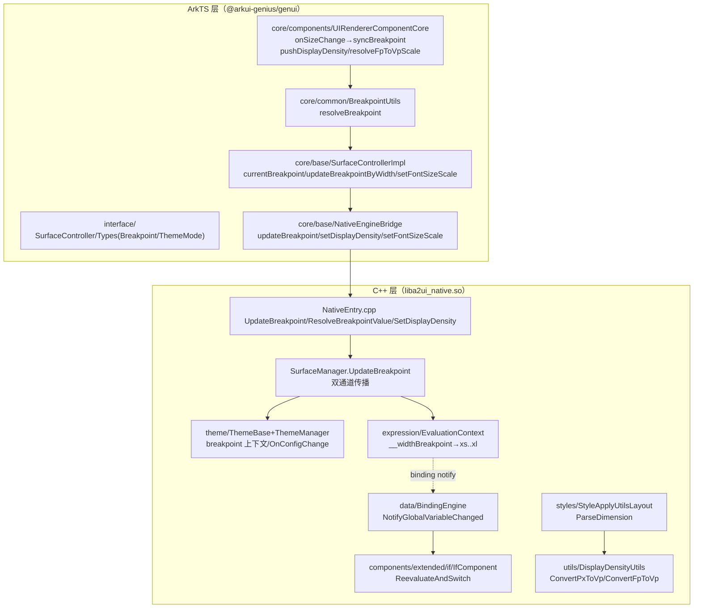
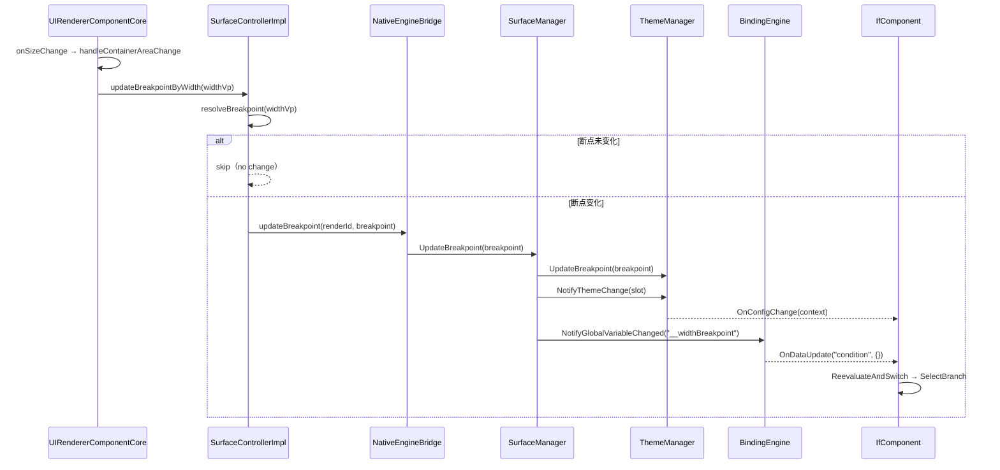
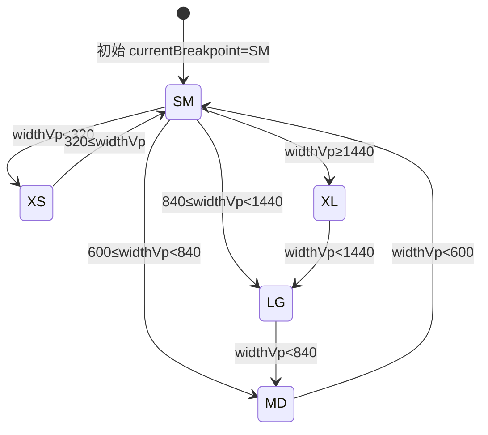

# 架构设计

> 确认目标仓和模块的架构约束、关键设计决策、Spec 拆分方向。

## 设计元数据

| Field | Content |
|-------|---------|
| Design ID | DESIGN-Func-07-04-23 |
| 关联需求 | 已有能力补录（无独立 requirement.md） |
| 关联 Epic | 无 |
| 目标 Feature | Feat-01 响应式断点（基线）；Feat-02 自适应单位；Feat-03 条件组件与断点重渲染 |
| 复杂度 | 复杂 |
| 目标版本 | OpenHarmony API Version 20（多设备自适应为鸿蒙扩展协议新增能力，仅在 `ohos.a2ui.extended.catalog` 下可用） |
| Owner | GenUI SIG |
| 状态 | Baselined（已有实现补录） |

## 需求基线

> 需求基线详见 proposal.md。以下仅列出设计阶段需要额外强调的要点。

| 项 | 补充说明 |
|----|---------|
| 补录而非新增 | 当前实现即规格，可疑行为只能标注为风险/备注 |
| 基准实现声明 | 多设备自适应以 A2UIRender 全量渲染引擎（`GenerativeUI/A2UIRender`，`@arkui-genius/genui`）为基准实现 |
| 双端机制 | 多设备自适应依赖两大机制：单位系统（vp/fp/%/keyword）+ 响应式断点（5 档 + `$__widthBreakpoint` 全局变量） |
| 断点驱动归属 | 断点由承载组件 `UIRendererComponentCore` 通过 `onSizeChange` 自动采集并下发，非宿主显式 API；公开契约仅 `setFontSizeScale`/`updateThemeMode` |
| 范围边界 | 本域覆盖断点枚举与阈值、自适应单位解析、条件组件断点重渲染；具体组件主题（Button/TextTheme 等断点索引存储）归 07-04-18/24，本设计不展开 |
| 协议分层 | 本域能力属于鸿蒙扩展协议，仅在 `catalogId=ohos.a2ui.extended.catalog` 下生效 |

## 上下文和现状

### 涉及仓和模块

| 仓库 | 补充架构说明 |
|------|-------------|
| `GenerativeUI/A2UIRender` | 全量渲染引擎。ArkTS 层（`ets/interface/`、`ets/core/base/`、`ets/core/common/`、`ets/core/components/`）提供公开契约、断点解析与组件承载；C++ 层（`genui/src/main/cpp/`）提供主题/断点传播、单位解析、密度换算与条件组件渲染 |
| `GenerativeUI/Docs` | 开发者文档（多设备自适应概念/最佳实践/API 参考），仅作理解辅助，契约以 A2UIRender 实现为准 |

> 仓、模块、当前职责、影响类型详见 proposal.md「影响范围」。

### 调用链层级分析

| 层 | 模块 | 职责 | 修改类型 |
|----|------|------|---------|
| 1. 公开契约层（ArkTS） | `ets/interface/SurfaceController.ets`、`Types.ets` | 声明公开契约（`setFontSizeScale`/`updateThemeMode`）与 `Breakpoint`/`ThemeMode` 枚举 | 现状（基准实现） |
| 2. 控制器实现层（ArkTS） | `ets/core/base/SurfaceControllerImpl.ets`、`ets/core/common/BreakpointUtils.ets` | 断点状态跟踪、`resolveBreakpoint` 阈值判定、`updateBreakpoint`/`updateBreakpointByWidth`/`setFontSizeScale` | 现状 |
| 3. 组件承载层（ArkTS） | `ets/core/components/UIRendererComponentCore.ets`、`extended/ExtendedDivider.ets` | `onSizeChange`/`onAppear` 驱动断点同步；密度与 fp→vp 比例采集 | 现状 |
| 4. NAPI 桥接层（ArkTS） | `ets/core/base/NativeEngineBridge.ets` | 封装 `updateBreakpoint`/`setFontSizeScale`/`setDisplayDensity` 调用 | 现状 |
| 5. 原生入口层（C++） | `cpp/NativeEntry.cpp`、`cpp/NapiInit.cpp` | `UpdateBreakpoint`（含 `ResolveBreakpointValue`）、`SetDisplayDensity`、`SetFontSizeScale` 参数校验与分发 | 现状 |
| 6. 渲染管理层（C++） | `cpp/SurfaceManager.cpp`、`cpp/SurfaceSlot.cpp`、`cpp/RenderSlot.cpp` | 断点统一传播（主题 + 全局变量通知）、字体缩放下发、viewport 尺寸存储 | 现状 |
| 7. 主题层（C++） | `cpp/theme/ThemeBase.*`、`ThemeManager.*` | 断点上下文存储、`OnConfigChange` 回调、按 `Breakpoint` 索引的数值存储 | 现状 |
| 8. 单位/密度工具层（C++） | `cpp/styles/StyleApplyUtilsLayout.cpp`、`cpp/utils/DisplayDensityUtils.*` | `ParseDimension` 单位/关键词解析、px/fp→vp 换算 | 现状 |
| 9. 表达式与条件层（C++） | `cpp/expression/EvaluationContext.cpp`、`cpp/expression/ThemeContextUtils.h`、`cpp/data/BindingEngine.cpp`、`cpp/components/extended/if/IfComponent.*` | `__widthBreakpoint` 全局变量解析、断点变化重求值与 If 分支切换 | 现状 |

检查项：
- [x] 调用链每一层都已覆盖（公开契约→控制器→组件承载→NAPI→原生入口→渲染管理→主题→单位密度→表达式条件）
- [x] 每层职责边界清晰（ArkTS 负责阈值判定与尺寸采集，C++ 负责传播/解析/换算/重渲染）
- [x] 每层修改类型明确（均为「现状」，存量补录）

### 适用架构规则

| Rule ID | 适用原因 | 设计结论 | 验证方式 |
|---------|---------|---------|---------|
| OH-ARCH-LAYERING | ArkTS→NAPI→C++ 跨语言多层调用 | 调用方向自顶向下；断点由 ArkTS 承载组件采集，经 NAPI 下发 C++ 统一传播 | 架构评审/依赖检查 |
| OH-ARCH-SUBSYSTEM | 单仓 + 独立 Docs 仓，无跨子系统 | 不引入子系统外依赖；依赖 `@kit.ArkUI`（display/NodeContent）采集显示密度 | 依赖检查 |
| OH-ARCH-API-LEVEL | 公开 ArkTS API（`setFontSizeScale`/`updateThemeMode`），断点接口为 internal | 断点接口不对外（Impl 内部）；fontSizeScale 走 Public | API 评审 |
| OH-ARCH-COMPONENT-BUILD | 现状无 BUILD.gn/bundle.json 变更 | 无构建影响 | 构建验证 |
| OH-ARCH-ERROR-LOG | 断点/密度非法输入走日志降级而非错误码 | 非法 width 跳过、非法 breakpoint 回落 SM、非法 density 告警 | UT/hilog |

## 不涉及项承接

> proposal.md 已完成 N/A 判定。本节仅对标记「涉及」且需展开设计的维度给出结论。

| 维度 | 设计结论 |
|------|---------|
| 跨进程/SA | 不涉及（同进程 ArkTS↔C++ 经 NAPI） |
| 持久化 | 不涉及（断点/密度/密度换算均为内存态，`DisplayDensityUtils` 按 renderId 缓存） |
| 权限 | 不涉及 |
| 国际化/RTL | 本域不涉及（RTL 见 UIRendererComponentCore 返回手势判定，非本域范围） |
| 深色模式 | 与本域共享 `SurfaceManager::UpdateThemeMode` 同构传播路径（`__colorMode`），本域仅覆盖断点与单位 |
| 多窗口/分屏 | 断点依赖容器 `onSizeChange` 尺寸，分屏/悬浮窗尺寸变化自动触发断点重算 |
| 范围边界 | 组件/函数/样式具体语义归 07-04-02~22；组件主题断点索引归 07-04-18/24；卡片裁剪归 07-04-25 |

## 关键设计决策

| 决策 ID | 问题 | 推荐方案 | 探索过的替代方案 | 取舍理由 | 影响 |
|--------|------|---------|----------------|---------|------|
| ADR-1 | 断点档位如何划分 | 5 档 `xs/sm/md/lg/xl`，阈值 `[0,320)/[320,600)/[600,840)/[840,1440)/[1440,+∞)`（vp），ArkTS `BreakpointUtils.resolveBreakpoint` 与 C++ `ResolveBreakpointFromWidth` 双端一致 | (a) OHOS 标准 4 档（lg 上不封顶）；(b) 3 档 | 增加 `xl` 覆盖超宽桌面窗口；双端同阈值便于对账 | 阈值双端手工同步（风险 RISK-3） |
| ADR-2 | 断点由谁驱动 | ArkTS `UIRendererComponentCore` 在 `onSizeChange`/`aboutToAppear`/`onAppear` 采集容器宽度 vp，经 `updateBreakpointByWidth`→`resolveBreakpoint`→NAPI 下发 | (a) native 直接监听窗口；(b) 宿主显式调 API | native 无窗口句柄；承载组件天然持有容器尺寸 | 断点精度受 `onSizeChange` 计算精度影响（风险 RISK-6） |
| ADR-3 | 断点变化如何传播 | `SurfaceManager::UpdateBreakpoint` 双通道：主题 `OnConfigChange`（更新缓存主题 + 组件配置）+ 全局变量 `__widthBreakpoint` 通知（表达式重求值） | (a) 仅主题；(b) 仅全局变量 | 主题缓存需随断点刷新数值，表达式需重求值切分支，二者目标不同需双通道 | `NotifyGlobalVariableChanged` 仅在表达式引擎启用时生效（风险 RISK-5） |
| ADR-4 | 单位系统如何解析 | 通用维度仅 `vp`/`%/keyword`（matchParent/fill/wrapContent/fixAtIdealSize），纯数字默认 vp；`px` 仅 stroke width；`fp` 走密度 `fpToVpScale` 换算 | (a) 全单位统一解析；(b) 只支持 vp | 对齐 OHOS 单位语义；fp 依赖系统字体缩放必须经换算 | 文档声明的 `16fp` fontSize 未在通用解析实现（风险 RISK-2） |
| ADR-5 | 密度与字体缩放如何采集 | ArkTS `resolveDisplayDensityPixels`（densityPixels 有效优先，否则 densityDPI/160）+ `resolveFpToVpScale`（`px2vp(fp2px(1))`）经 `setDisplayDensity` 下发，native `DisplayDensityUtils` 单例按 renderId 缓存 | (a) native 自取显示信息；(b) 每次渲染即时查询 | 避免 native 跨进程查询显示信息；单例缓存减少重复计算 | 密度缺失时 `ConvertPxToVp` 原样返回 px（降级） |
| ADR-6 | 条件组件如何响应断点 | If 组件 `condition` 表达式依赖 `__widthBreakpoint`，断点变化经 `NotifyGlobalVariableChanged("__widthBreakpoint")` 触发 `OnDataUpdate`→`ReevaluateAndSwitch` 切分支 | (a) 仅依赖主题 `OnConfigChange`；(b) 全量重建组件树 | 表达式引擎能精准定位依赖组件，避免无关重建 | 双路径（OnConfigChange 与 OnDataUpdate）可能重复求值（见 Feat-03） |

## 设计骨架

### 骨架范围

| 骨架项 | 目标 | 不包含 | 验证方式 |
|--------|------|--------|---------|
| 响应式断点 | 固化 5 档枚举、阈值、双端解析、`__widthBreakpoint` 字符串值与传播链路 | 组件主题断点索引（07-04-18/24） | UT |
| 自适应单位 | 固化 vp/%/keyword/px/fp 的解析与换算、密度采集、字体缩放 | 组件样式具体语义（07-04-18） | UT |
| 条件组件重渲染 | 固化 If 组件 condition 表达式、`__widthBreakpoint` 依赖与分支切换 | 表达式语言语法（07-04-21） | UT |

### 骨架 Spec 拆分

| Task ID | 目标 | 受影响文件 | AC |
|---------|------|----------|-----|
| TASK-SKELETON-1 | Feat-01 响应式断点（基线） | `BreakpointUtils.ets`、`SurfaceControllerImpl.ets`、`SurfaceManager.cpp`、`ThemeBase.h`、`ThemeManager.cpp`、`EvaluationContext.cpp` | AC-1.x~AC-5.x |
| TASK-SKELETON-2 | Feat-02 自适应单位 | `StyleApplyUtilsLayout.cpp`、`DisplayDensityUtils.cpp`、`UIRendererComponentCore.ets`、`SurfaceSlot.cpp` | Feat-02 AC |
| TASK-SKELETON-3 | Feat-03 条件组件与断点重渲染 | `IfComponent.cpp`、`BindingEngine.cpp`、`ExtendedComponentFactory.cpp` | Feat-03 AC |

## 后续 Task 拆分

| Task ID | 目标 | 受影响文件 | 依赖 |
|---------|------|----------|------|
| T-1 | Feat-01 响应式断点（基线，本设计已承接） | `Feat-01-responsive-breakpoint-spec.md` + 本 design.md | — |
| T-2 | Feat-02 自适应单位 | `Feat-02-adaptive-unit-spec.md` | T-1 |
| T-3 | Feat-03 条件组件与断点重渲染 | `Feat-03-conditional-breakpoint-rerender-spec.md` | T-1 |

## API 签名、Kit 与权限

> 本节承接 spec.md「API 变更分析」中识别的 API，给出签名、权限和 d.ts 位置等实现细节。

### 新增 API

无新增。本特性覆盖既有 ArkTS 公开 API（存量补录）。

### 变更/废弃 API

| 原有 API | 变更类型 | 新 API | 迁移说明 |
|---------|---------|--------|---------|
| `SurfaceController.setFontSizeScale` | 既有 | — | 字体缩放公开契约 |
| `SurfaceController.updateThemeMode` | 既有 | — | 主题模式公开契约 |
| `SurfaceControllerImpl.updateBreakpoint` / `updateBreakpointByWidth` / `getBreakpoint` | 既有（internal） | — | 断点接口不对外，仅 Impl 内部 + 承载组件驱动 |
| `Breakpoint` / `ThemeMode` 枚举 | 既有 | — | 断点/主题枚举契约 |

> d.ts 位置：`genui/src/main/ets/interface/*.ets`（ArkTS 源即契约，无独立 SDK `.d.ts`）。Kit：`@arkui-genius/genui`；权限：无；SysCap：不适用。

## 构建系统影响

### BUILD.gn 变更

无变更（存量补录）。`genui/src/main/cpp/` 已纳入现有 `liba2ui_native.so` 构建目标（`IfComponent.cpp` 见 `cmake/A2UISources.cmake:130`）。

### bundle.json 变更

无变更。

## 可选设计扩展

### 架构图



### 数据流/控制流

| 步骤 | 调用方 | 被调用方 | 数据/接口 | 说明 |
|------|--------|---------|----------|------|
| 1 | `UIRendererComponentCore` | `handleContainerAreaChange` | `SizeOptions newValue.width` | onSizeChange 触发 |
| 2 | `UIRendererComponentCore` | `resolveAreaLengthVpForBreakpoint` | `Length` | 解析 number 或 `Nvp` 字符串 |
| 3 | `UIRendererComponentCore` | `controller.updateBreakpointByWidth` | `widthVp` | 非法 width 跳过 |
| 4 | `SurfaceControllerImpl` | `BreakpointUtils.resolveBreakpoint` | `widthVp` | 五档阈值判定 |
| 5 | `SurfaceControllerImpl` | `NativeEngineBridge.updateBreakpoint` | `(renderId, breakpoint)` | 无变化跳过 |
| 6 | native | `SurfaceManager::UpdateBreakpoint` | `Breakpoint` | 逆序遍历 surface |
| 7 | native | `ThemeManager::UpdateBreakpoint/NotifyThemeChange` + `NotifyGlobalExpressionVariableChanged` | `themeContext` / `__widthBreakpoint` | 双通道传播 |
| 8 | native | `IfComponent::OnConfigChange`/`OnDataUpdate` | `condition` | 表达式重求值切分支 |

### 时序设计



### 数据模型设计

**API 层（ArkTS，公开契约）**

```typescript
// ets/interface/Types.ets
export enum Breakpoint { XS = 0, SM = 1, MD = 2, LG = 3, XL = 4 }
export enum ThemeMode { LIGHT = 0, DARK = 1 }
```

**Framework 层（C++）**

```cpp
// cpp/theme/ThemeBase.h
enum class Breakpoint { XS, SM, MD, LG, XL };            // 默认 SM（ThemeContext.breakpoint）
constexpr Breakpoint ResolveBreakpointFromWidth(float width);  // 320/600/840/1440 阈值
struct ThemeContext { ThemeMode colorMode; ...; Breakpoint breakpoint = Breakpoint::SM; };

// cpp/utils/DisplayDensityUtils.h
struct DisplayDensityInfo { float densityPixels = 0.0F; float fpToVpScale = 0.0F; };
std::map<int32_t, DisplayDensityInfo> densityByRenderId_;

// cpp/styles/StyleTypes.h
enum class StyleDimensionUnit { VP = 0, PERCENT, MATCH_PARENT, WRAP_CONTENT, FIX_AT_IDEAL_SIZE, INVALID };
struct StyleDimension { StyleDimensionUnit unit; float value; };
```

| 结构 | 存储方案 | 生命周期 |
|------|---------|---------|
| `ThemeContext.breakpoint` | `Breakpoint`（默认 SM） | `UpdateBreakpoint` 更新，随 surface 存续 |
| `DisplayDensityUtils::densityByRenderId_` | `map<renderId, DisplayDensityInfo>` | `SetDisplayDensity` 写入，`ClearDisplayDensity` 清除 |
| `ThemeManager::context_` | `ThemeContext` | surface 生命周期 |
| `Breakpoint` 数值样式 | `array<Value, 5>`（按 Breakpoint 索引） | 主题类缓存（07-04-18 展开） |

### 算法与状态机

**断点判定算法**（`BreakpointUtils.resolveBreakpoint`，`BreakpointUtils.ets:19-33`）：

```
resolveBreakpoint(widthVp):
  if widthVp < 320  → XS
  if widthVp < 600  → SM
  if widthVp < 840  → MD
  if widthVp < 1440 → LG
  return XL
```

**断点传播状态机**（无显式状态机，`updateBreakpoint` 无变化短路）：



### 测试性设计

| 测试层级 | 测试目标 | Mock 策略 | 验证方式 |
|---------|---------|----------|---------|
| ArkTS 单测 | `BreakpointUtils.resolveBreakpoint` 阈值边界 | 直接测 `BreakpointUtils.ets` | `genui/src/test/` |
| ArkTS 单测 | `resolveAreaLengthVpForBreakpoint`/`resolveDisplayDensityPixels` | Mock display 数据 | `genui/src/test/` |
| C++ UT | `ResolveBreakpointFromWidth`/`ResolveBreakpointValue` | 直接调函数 | `genui/src/test/cpp/` |
| C++ UT | `ParseDimension` 单位/关键词解析 | 直接测 `StyleApplyUtilsLayout.cpp` | `genui/src/test/cpp/` |
| C++ UT | `DisplayDensityUtils::ConvertPxToVp/ConvertFpToVp` | 无依赖 | `genui/src/test/cpp/` |
| C++ UT | `IfComponent::ReevaluateAndSwitch` | Mock SurfaceSlot/DataModel | `genui/src/test/cpp/` |

### 资源所有权矩阵

| 资源 | 创建方 | 持有方 | 销毁触发 | 实际释放 | 异常回收 |
|------|--------|--------|---------|---------|---------|
| `DisplayDensityInfo` | `DisplayDensityUtils::SetDisplayDensity` | `densityByRenderId_`（单例） | `ClearDisplayDensity(renderId)` | map erase | surface 销毁时清理 |
| `ThemeBase` 实例 | `ThemeManager::CreateTheme` | `themes_` 缓存 | surface 销毁 | shared_ptr 释放 | — |
| `IfComponent` 依赖 | `SyncConditionExpressionBinding` | `dataBindings_` | 组件移除 | RemoveBindings | — |

### 接口参数规约

| 接口 | 参数 | 类型 | 合法范围 | 非法处理 | 边界说明 |
|------|------|------|---------|---------|---------|
| `updateBreakpoint` | breakpoint | Breakpoint | XS/SM/MD/LG/XL 之一 | native 非法值回落 SM | 与当前相同则跳过 |
| `updateBreakpointByWidth` | widthVp | number | 有限且 >0 | 跳过并告警 | 0/负数/NaN/Infinity 拒绝 |
| `resolveBreakpoint` | widthVp | number | 任意值 | 无（全范围映射） | =320 属 SM、=600 属 MD、=840 属 LG、=1440 属 XL |
| `setFontSizeScale` | scale | number | native 侧 >0 生效 | ≤0 回落 1.0 | — |
| `setDisplayDensity` | densityPixels | number | 有限且 >0 | 告警忽略 | fpToVpScale 可选 |
| `ParseDimension` | value | number/string | 非负有限数值或合法单位串 | 失败返回 false | 负值/非法后缀拒绝 |

### 线程与并发模型

| 操作 | 发起线程 | 回调线程 | 跨进程边界 | 线程安全 | 重入约束 |
|------|---------|---------|----------|---------|---------|
| onSizeChange 断点同步 | UI | UI | 无 | 单线程 UI | 无变化短路 |
| updateBreakpoint 下发 | UI | UI | 无 | 单线程 | 处理中不可销毁 |
| `DisplayDensityUtils` 读写 | UI | UI | 无 | 单例（非多线程） | — |
| If 分支切换 | UI | UI | 无 | 单线程 | 初始未初始化仅设 branch |

## 详细设计

### 断点枚举与阈值

`Breakpoint` 枚举五档（`Types.ets:151-166`：XS=0/SM=1/MD=2/LG=3/XL=4；C++ `ThemeBase.h:36-42` 同序）。阈值以 `vp` 为单位：`[0,320)` XS、`[320,600)` SM、`[600,840)` MD、`[840,1440)` LG、`[1440,+∞)` XL。ArkTS `BreakpointUtils.resolveBreakpoint`（`BreakpointUtils.ets:19-33`）与 C++ `ResolveBreakpointFromWidth`（`ThemeBase.h:44-59`）双端一致；native 入参转换为 `ResolveBreakpointValue`（`NativeEntry.cpp:2206-2223`，0-4 映射、非法回落 SM）。

### 断点驱动与下发

`SurfaceControllerImpl` 持有 `currentBreakpoint`（默认 SM，`:124`）。`updateBreakpoint`（`:1175-1190`）：destroyed 忽略；与当前相同跳过；否则更新并 `NativeEngineBridge.updateBreakpoint`。`updateBreakpointByWidth`（`:1192-1201`）：非有限或 ≤0 跳过；否则 `resolveBreakpoint` 转档。`getBreakpoint`（`:1207-1209`）返回当前档。承载组件 `UIRendererComponentCore` 于 `aboutToAppear`（`:206`）与 `onAppear`（`:385`）调用 `syncBreakpointFromContainer`，并在 `onSizeChange`（`:387-389`）触发 `handleContainerAreaChange`（`:279-282`）→ `resolveAreaLengthVp`（`:40-63`，number 或 `Nvp` 字符串，须有限且 >0）→ `updateBreakpointByWidth`。

### 断点传播与全局变量

native `SurfaceManager::UpdateBreakpoint`（`SurfaceManager.cpp:303-325`）：更新 `themeContext_.breakpoint`，逆序遍历 surface，`themeManager->UpdateBreakpoint`（`ThemeManager.cpp:35-38` 仅更新 context）、`themeManager->NotifyThemeChange`（`:108-129` 更新缓存主题 + 遍历组件 `OnConfigChange`）、`NotifyGlobalExpressionVariableChanged(slot, "__widthBreakpoint")`（`SurfaceManager.cpp:33-39`）。`__widthBreakpoint` 字符串值经 `BreakpointToString`（`ThemeContextUtils.h:25-41`：xs/sm/md/lg/xl），`EvaluationContext::ResolveVariable`（`EvaluationContext.cpp:28-33`）解析，缺 themeContext 回落 `"sm"`。

### 自适应单位解析

`StyleApplyUtils::ParseDimension`（`StyleApplyUtilsLayout.cpp:110-153`）：number 默认 vp（须非负有限）；string 先查关键词 `matchParent`/`fill`/`wrapContent`/`fixAtIdealSize`（`:32-47`），再 `strtof`+后缀 `vp`/`%`（`:49-61`），非法后缀/负值返回 false。stroke width 专有 `ParseDividerStrokeWidth`/`ParseStrokeWidthTokenInternal`（`:63-108`）额外支持 `px`。fontSize 走 `ParseNumber`（`ExtendedStyleResolver.cpp:1016-1022` + `StyleApplyUtilsInternal.h:41-54` 全量数字校验）。密度采集 `resolveDisplayDensityPixels`（`UIRendererComponentCore.ets:67-78`）、fp→vp 比例 `resolveFpToVpScale`（`:298-308`，`px2vp(fp2px(1))`），经 `setDisplayDensity` 下发，native `DisplayDensityUtils`（`DisplayDensityUtils.cpp:39-108`）按 renderId 缓存并换算。

### 字体缩放

`SurfaceController.setFontSizeScale`（`SurfaceController.ets:121`）→ `SurfaceControllerImpl.setFontSizeScale`（`:1123-1132`，apiSupported 校验）→ NAPI `setFontSizeScale`（`NapiInit.cpp:58`、`NativeEntry.cpp:1819-1854`）→ `RenderSlot::SetFontSizeScale`（`RenderSlot.h:80`）→ `SurfaceManager::SetFontSizeScale`（`SurfaceManager.cpp:144-150`，scale>0 否则 1.0）→ `SurfaceSlot::SetFontSizeScale`（`SurfaceSlot.cpp:1609-1630`，经 `OnFontSizeScaleChanged` 通知 extended 组件）。

### 条件组件与断点重渲染

If 组件注册为 `"If"`（`ExtendedComponentFactory.cpp:126`）。`condition` 表达式经 `EvaluateConditionWithExpressionEngine`（`IfComponent.cpp:482-511`）求值，`__widthBreakpoint` 依赖由 `SyncConditionExpressionBinding`（`:535-567`）收集入 `dataBindings_`。断点变化经双通道触发 `ReevaluateAndSwitch`（`:417-435`）：主题通道 `OnConfigChange`（`:332-339`）与全局变量通道 `BindingEngine::NotifyGlobalVariableChanged`（`BindingEngine.cpp:445-482`，`#ifdef ENABLE_EXPRESSION_ENGINE` 下）→ `IfComponent::OnDataUpdate`（`:341-369`）。求值结果不变保持分支，变化则 `SelectBranch`（`:595` 起）在 `childrenIfIds_`/`childrenElseIds_` 间切换并 `ReconcileBranchChildren`。

## 风险和开放问题

| 项 | 类型 | 影响 | 处理方式 | Owner |
|----|------|------|---------|-------|
| RISK-1 文档声明断点含宽高比「有效宽度」修正（`multi-device-adaptation.md:59,146-154`），但代码 `resolveBreakpoint` 仅用宽度未做宽高比修正（`BreakpointUtils.ets:19-33`） | 架构 | 中 | 规格 Feat-01 风险表标注「以代码为准」 | GenUI SIG |
| RISK-2 文档声明 `16fp` fontSize 支持（`multi-device-adaptation.md:16,25`），但 C++ `ParseDimension` 不解析 `fp` 后缀，fontSize 走 `ParseNumber` 全量数字校验 | API | 中 | 规格 Feat-02 兼容性声明标注 | GenUI SIG |
| RISK-3 断点阈值双端维护（`BreakpointUtils.ets` vs `ThemeBase.h`），需手动同步 | 架构 | 中 | 规格 Feat-01 AC 覆盖双端比对 | GenUI SIG |
| RISK-4 `__widthBreakpoint` 字符串值（xs..xl）与枚举双端维护（`ThemeContextUtils.h` vs `Types.ets`） | 架构 | 低 | 规格 Feat-01 AC 覆盖 | GenUI SIG |
| RISK-5 `NotifyGlobalVariableChanged` 仅在 `ENABLE_EXPRESSION_ENGINE` 下生效（`BindingEngine.cpp:447`），未启用时断点重渲染依赖主题 OnConfigChange 单通道 | 架构 | 中 | 规格 Feat-03 规则标注 | GenUI SIG |
| RISK-6 断点依赖 `onSizeChange` 回调，受计算精度影响可能偏差（文档 `multi-device-adaptation.md:49` 亦说明） | 边界 | 低 | 规格 Feat-01 边界 AC 标注 | GenUI SIG |
| RISK-7 `ParseDimension` 不支持 `px`（仅 stroke width 支持），与通用单位语义存在不一致 | API | 低 | 规格 Feat-02 规则/兼容性标注 | GenUI SIG |

## 设计审批

- [x] 需求基线已确认，设计覆盖 P0/P1 AC
- [x] 不涉及项已承接，N/A 和展开项都有结论
- [x] 涉及仓和模块职责清楚
- [x] 调用链层级分析完整，每层覆盖到位
- [x] 适用架构规则已识别并形成设计结论
- [x] 分层和子系统边界合规
- [x] API 变更有签名、权限、错误码和兼容性说明
- [x] BUILD.gn/bundle.json 影响明确
- [x] 设计输出和后续 Task 拆分明确
- [x] 关键设计决策有理由和影响说明
- [x] 风险和开放问题有 Owner

**结论:** 通过（已有实现补录）