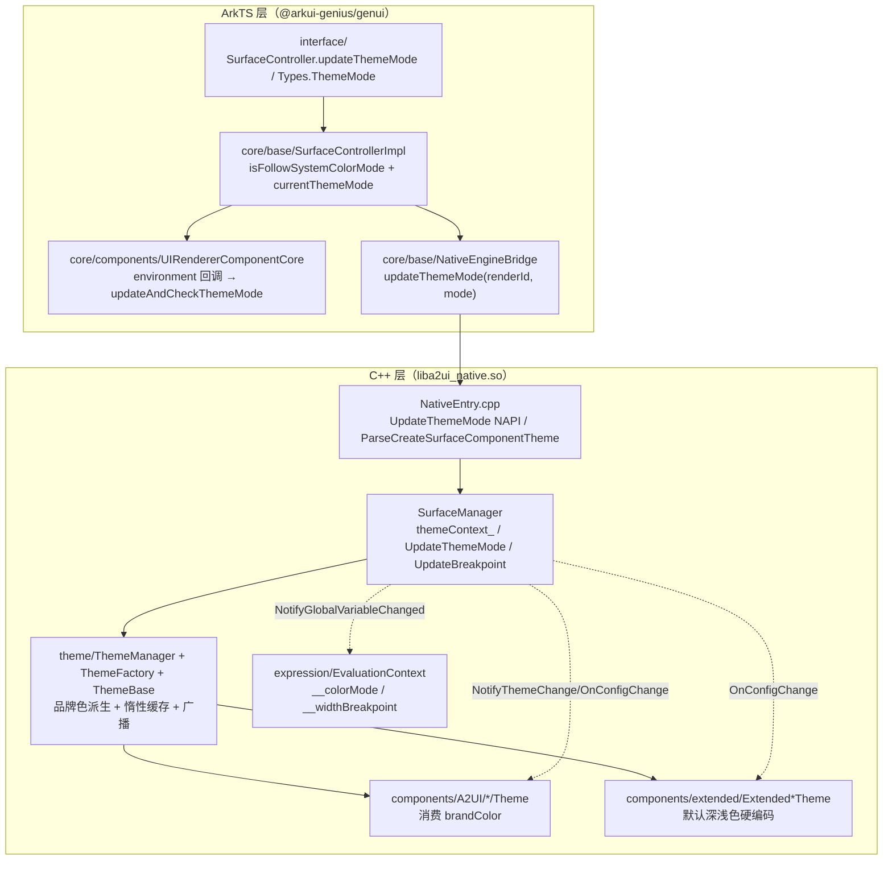
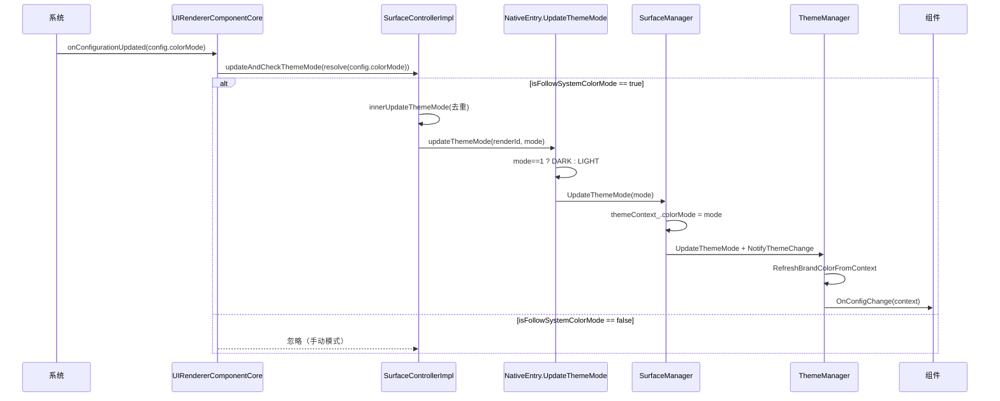
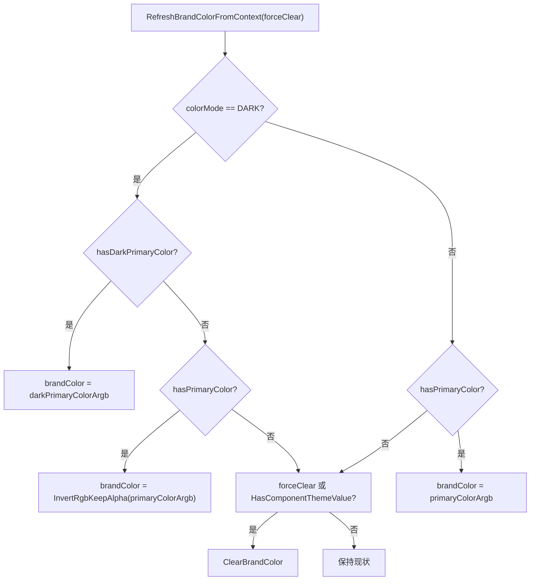

# 架构设计

> 确认目标仓和模块的架构约束、关键设计决策、Spec 拆分方向。

## 设计元数据

| Field | Content |
|-------|---------|
| Design ID | DESIGN-Func-07-04-24 |
| 关联需求 | 已有能力补录（无独立 requirement.md） |
| 关联 Epic | 无 |
| 目标 Feature | Feat-01 主题与色彩模式（基线）；Feat-02 扩展组件默认深浅色 |
| 复杂度 | 复杂 |
| 目标版本 | A2UI 原生协议 v0.9（标准协议 `theme` 字段）+ 鸿蒙扩展协议（`ohos.a2ui.extended.catalog`）；宿主集成 API Version ≥ 20 |
| Owner | GenUI SIG |
| 状态 | Baselined（已有实现补录） |

## 需求基线

> 需求基线详见 proposal.md。以下仅列出设计阶段需要额外强调的要点。

| 项 | 补充说明 |
|----|---------|
| 补录而非新增 | 当前实现即规格，可疑行为只能标注为风险/备注 |
| 基准实现声明 | 主题域以 A2UIRender 全量渲染引擎（`GenerativeUI/A2UIRender`，`@arkui-genius/genui`）为基准实现 |
| 双协议分支 | 标准协议：`createSurface.theme` 品牌色（primaryColor/darkPrimaryColor）驱动标准组件主题；扩展协议：不解析 theme，扩展组件用 `Extended*Theme` 硬编码默认深浅色 |
| 深浅色来源 | 两种来源：宿主通过 `UIRendererComponent` 的 environment 回调自动跟随系统（`updateAndCheckThemeMode`），或宿主主动调用 `updateThemeMode` 手动切换 |
| 范围边界 | 本功能域（07-04-24）覆盖主题上下文/品牌色派生/深浅色切换/扩展组件默认深浅色；断点一多部署归 07-04-23；变量系统与 `$__colorMode` 表达式归 07-04-21/22，本设计仅承接 `__colorMode` 全局变量注入 |

## 上下文和现状

### 涉及仓和模块

| 仓库 | 补充架构说明 |
|------|-------------|
| `GenerativeUI/A2UIRender` | 全量渲染引擎。ArkTS 层（`genui/src/main/ets/interface/`、`ets/core/base/`、`ets/core/components/`）提供公开契约（`ThemeMode`/`SurfaceController.updateThemeMode`）与跟随系统集成；C++ 层（`genui/src/main/cpp/theme/`、`SurfaceManager.cpp`、`NativeEntry.cpp`、`components/`）提供 `ThemeManager`/`ThemeFactory`/`ThemeBase`/`Extended*Theme` 原生实现 |
| `GenerativeUI/Docs` | 开发者文档（`concepts/theme-and-color-mode.md`、`concepts/extension-color-mode.md`），仅作理解辅助，契约以 A2UIRender 实现为准 |

> 仓、模块、当前职责、影响类型详见 proposal.md「影响范围」。

### 调用链层级分析

| 层 | 模块 | 职责 | 修改类型 |
|----|------|------|---------|
| 1. 公开契约层（ArkTS） | `ets/interface/SurfaceController.ets`（`updateThemeMode`）、`ets/interface/Types.ets`（`ThemeMode`/`Breakpoint` 枚举） | 声明主题模式枚举与手动切换契约 | 现状（基准实现） |
| 2. 控制器实现层（ArkTS） | `ets/core/base/SurfaceControllerImpl.ets` | `updateThemeMode`/`updateAndCheckThemeMode`/`getThemeMode`/`IsFollowSystemColorMode`；维护 `isFollowSystemColorMode` 与 `currentThemeMode` 状态 | 现状 |
| 3. 宿主组件集成层（ArkTS） | `ets/core/components/UIRendererComponentCore.ets` | environment 回调监听系统色彩模式变化，`resolveThemeModeFromSystemColorMode` → `updateAndCheckThemeMode` | 现状 |
| 4. NAPI 桥接层（ArkTS） | `ets/core/base/NativeEngineBridge.ets`（`updateThemeMode`/`updateBreakpoint`） | 封装 `liba2ui_native.so` 主题模式/断点更新调用 | 现状 |
| 5. 原生入口层（C++） | `cpp/NativeEntry.cpp` | `UpdateThemeMode` NAPI（mode==1?DARK:LIGHT）；`ParseCreateSurfaceComponentTheme`/`ApplyCreateSurfaceTheme`（解析 createSurface.theme） | 现状 |
| 6. 渲染管理层（C++） | `cpp/SurfaceManager.cpp`、`cpp/SurfaceSlot.cpp` | 持有 `themeContext_`，`UpdateThemeMode`/`UpdateBreakpoint` 逆序遍历 surfaces + 表达式变量通知；`SurfaceSlot::InitializeThemeManager` | 现状 |
| 7. 主题管理层（C++） | `cpp/theme/ThemeManager.cpp`、`ThemeFactory.cpp`、`ThemeBase.cpp`、`expression/ThemeContextUtils.h` | 主题上下文更新、品牌色派生（`RefreshBrandColorFromContext`）、惰性缓存、变更广播 | 现状 |
| 8. 组件主题层（C++） | `cpp/components/A2UI/*/Theme.cpp`、`cpp/components/extended/Extended*Theme.cpp` | 标准组件消费品牌色；扩展组件固化默认深浅色 | 现状 |
| 9. 表达式求值层（C++） | `cpp/expression/EvaluationContext.cpp` | 解析 `__colorMode`/`__widthBreakpoint` 全局变量（字符串映射） | 现状 |

检查项：
- [x] 调用链每一层都已覆盖（公开契约→控制器→宿主集成→NAPI→原生入口→渲染管理→主题管理→组件主题→表达式求值）
- [x] 每层职责边界清晰（ArkTS 负责契约/状态/系统监听，C++ 负责主题派生/缓存/广播）
- [x] 每层修改类型明确（均为「现状」，存量补录）

### 适用架构规则

| Rule ID | 适用原因 | 设计结论 | 验证方式 |
|---------|---------|---------|---------|
| OH-ARCH-LAYERING | ArkTS→NAPI→C++ 跨语言多层调用 | 调用方向自顶向下；主题状态真源在 C++ `SurfaceManager::themeContext_`，ArkTS 仅镜像 `currentThemeMode` 作去重判断 | 架构评审/依赖检查 |
| OH-ARCH-SUBSYSTEM | 单仓 + 独立 Docs 仓，无跨子系统 | 不引入子系统外依赖；系统色彩模式经 ArkUI `Configuration` environment 事件传入 | 依赖检查 |
| OH-ARCH-API-LEVEL | 公开 ArkTS API（`SurfaceController.updateThemeMode`/`ThemeMode` 枚举），无 C-API | Public API（ArkTS），无新增权限；native 侧 `UpdateThemeMode` 为 NAPI 内部接口 | API 评审 |
| OH-ARCH-COMPONENT-BUILD | 现状无 BUILD.gn/bundle.json 变更 | 无构建影响 | 构建验证 |
| OH-ARCH-ERROR-LOG | 主题解析失败走 `LOG_A2UI(LOG_WARN)`，无错误码 | 无效 primaryColor/darkPrimaryColor 仅告警不阻断（`NativeEntry.cpp:391-393,403-405`） | UT/hilog |

## 不涉及项承接

> proposal.md 已完成 N/A 判定。本节仅对标记「涉及」且需展开设计的维度给出结论。

| 维度 | 设计结论 |
|------|---------|
| 跨进程/SA | 不涉及（同进程 ArkTS↔C++ 经 NAPI；系统色彩模式经应用环境事件，非 SA 直连） |
| 持久化 | 不涉及（`ThemeContext` 仅内存态，随 Surface 销毁释放） |
| 权限 | 不涉及 |
| 国际化/RTL | 不涉及（颜色/模式与语言方向无关） |
| 多设备适配 | 部分涉及（断点 `Breakpoint` 是 `ThemeContext` 成员，`ExtendedGridTheme`/`ExtendedListTheme` 按断点切列数/行数，归 07-04-23 展开） |
| 变量系统 | 部分涉及（`__colorMode`/`__widthBreakpoint` 全局表达式变量由 `SurfaceManager` 注入通知，表达式语义归 07-04-21/22） |
| 范围边界 | 标准组件品牌色生效组件清单（Button/CheckBox/Slider 等）在组件域各自展开；本域仅承接主题派生与切换 |

## 关键设计决策

| 决策 ID | 问题 | 推荐方案 | 探索过的替代方案 | 取舍理由 | 影响 |
|--------|------|---------|----------------|---------|------|
| ADR-1 | 主题模式如何跨层表示 | ArkTS `ThemeMode{LIGHT=0,DARK=1}`（`Types.ets:140-146`）与 C++ `enum class ThemeMode{LIGHT,DARK}`（`ThemeBase.h:27-30`）双层枚举；NAPI 边界 `UpdateThemeMode` 用 `mode==1 ? DARK : LIGHT` 收敛（`NativeEntry.cpp:2199`） | (a) 只 ArkTS 枚举；(b) 字符串传递 | 数值枚举跨语言稳定；NAPI 单点收敛避免 C++ 收到越界值 | 非 1 的任意值（含 2/-1）一律按 LIGHT（`NativeEntry.cpp:2199`） |
| ADR-2 | 品牌色如何从 primaryColor/darkPrimaryColor 派生 | `RefreshBrandColorFromContext` 三态优先级：深色→`darkPrimaryColor` 优先，缺省→`primaryColor` 的 RGB 取反（`InvertRgbKeepAlpha`）；浅色→`primaryColor`；均无→清除品牌色回落组件默认色（`ThemeManager.cpp:64-83`） | (a) 深浅色强制各配一个；(b) 深色不派生 | darkPrimaryColor 可选；深色缺省用浅色反色保证观感一致 | RGB 反色保留 alpha（`ThemeColorUtils.cpp:81-86`） |
| ADR-3 | createSurface.theme 如何解析 | 在 `NativeEntry.cpp:ParseCreateSurfaceComponentTheme` 解析 `iconUrl`/`agentDisplayName`/`primaryColor`/`darkPrimaryColor`（`:381-406`），经 `ThemeManager::SetComponentTheme` 写入上下文（`:424`）；无效颜色仅告警 | (a) 在 SurfaceSlot 解析；(b) ArkTS 解析后传参 | 解析集中在原生入口，与 schema 校验同层；SurfaceSlot 只负责初始化/存上下文 | 任务线索标注的解析位置（SurfaceSlot.cpp）实际在 NativeEntry.cpp，见 RISK-5 |
| ADR-4 | 跟随系统 vs 手动切换如何区分 | 控制器 `isFollowSystemColorMode` 默认 `true`（`SurfaceControllerImpl.ets:108`）；`updateThemeMode` 置 false 并更新（`:1158-1161`）；`updateAndCheckThemeMode` 仅在跟随时生效（`:1148-1153`）；`UIRendererComponentCore` environment 回调调用后者（`:118-128`） | (a) 无跟随标志，靠系统监听 | 显式标志避免系统回调覆盖宿主手动选择 | 手动切换后系统切换被忽略（`updateAndCheckThemeMode` 早退） |
| ADR-5 | 主题对象生命周期与缓存 | 每个 `SurfaceSlot` 持有一个 `ThemeManager`（`SurfaceSlot::InitializeThemeManager`，`:739-749`）；组件主题经 `ThemeFactory` 按组件类型惰性创建并缓存于 `ThemeManager::themes_`（`ThemeManager.cpp:85-100`） | (a) 全局单例主题；(b) 每组件独立主题实例 | 每 Surface 独立主题（符合「每 Surface 独立主题」文档语义）；缓存避免重复创建 | 多 Surface 主题相互独立 |
| ADR-6 | 主题变更如何广播 | `SurfaceManager::UpdateThemeMode` 逆序遍历 surfaces，调 `ThemeManager::UpdateThemeMode`+`NotifyThemeChange`（缓存主题 `UpdateContext` + 所有组件 `OnConfigChange`），并通知 `__colorMode` 全局表达式变量（`SurfaceManager.cpp:277-301`） | (a) 仅通知组件；(b) 仅通知表达式 | 组件刷新与表达式重求值需同时触发，保证 `$__colorMode` 引用同步 | 全局变量名常量 `__colorMode`（`SurfaceManager.cpp:30`） |
| ADR-7 | 扩展组件默认深浅色在哪里固化 | 扩展组件默认色硬编码在 `components/extended/Extended*Theme.cpp`（Text/Divider/Progress/Common），组件按需构造主题实例读取（如 `ExtendedTextComponent.cpp:656-657`），不走 `ThemeFactory` | (a) 并入 ThemeFactory；(b) 集中在样式解析器 | 扩展主题构造即计算、无需缓存；与标准 A2UI 主题解耦 | `Extended*Theme` 不在 `ThemeFactory` 注册表中（`ThemeFactory.cpp:38-52`），见 RISK-6 |

## 设计骨架

### 骨架范围

| 骨架项 | 目标 | 不包含 | 验证方式 |
|--------|------|--------|---------|
| 主题上下文 | 固化 `ThemeContext` 字段（colorMode/breakpoint/brandColor/primaryColor/darkPrimaryColor/iconUrl/agentDisplayName） | 表达式语义（07-04-21/22） | UT |
| 品牌色派生 | 固化 dark/light 三态优先级与 RGB 反色 | 标准组件品牌色消费（组件域） | UT |
| 深浅色切换 | 固化跟随系统/手动切换状态机与 NAPI 边界收敛 | 断点切换（07-04-23） | UT |
| 扩展组件默认深浅色 | 固化 Text/Divider/Progress/Common/Grid/List 的默认值与类型 | 其它扩展组件默认色（组件 .cpp 内联硬编码） | UT |

### 骨架 Spec 拆分

| Task ID | 目标 | 受影响文件 | AC |
|---------|------|----------|-----|
| TASK-SKELETON-1 | Feat-01 主题与色彩模式基线 | `Types.ets`、`SurfaceControllerImpl.ets`、`NativeEngineBridge.ets`、`NativeEntry.cpp`、`SurfaceManager.cpp`、`theme/*` | AC-1.1~6.x |
| TASK-SKELETON-2 | Feat-02 扩展组件默认深浅色 | `components/extended/Extended*Theme.cpp`、各 `Extended*Component.cpp` | Feat-02 各 AC |

## 后续 Task 拆分

| Task ID | 目标 | 受影响文件 | 依赖 |
|---------|------|----------|------|
| T-1 | Feat-01 主题与色彩模式（基线，本设计已承接） | `Feat-01-theme-color-mode-spec.md` + 本 design.md | — |
| T-2 | Feat-02 扩展组件默认深浅色 | `Feat-02-extended-default-color-spec.md` | T-1 |

## API 签名、Kit 与权限

> 本节承接 spec.md「API 变更分析」中识别的 API，给出签名、权限和 d.ts 位置等实现细节。

### 新增 API

无新增。本特性覆盖既有 ArkTS 公开 API（存量补录）。

### 变更/废弃 API

| 原有 API | 变更类型 | 新 API | 迁移说明 |
|---------|---------|--------|---------|
| `SurfaceController.updateThemeMode(mode: ThemeMode): void` | 既有 | — | 手动切换深浅色；`SurfaceController.ets:128` |
| `ThemeMode`（`LIGHT=0`/`DARK=1`） | 既有 | — | 主题模式枚举；`Types.ets:140-146` |
| `Breakpoint`（`XS=0`…`XL=4`） | 既有 | — | 断点枚举；`Types.ets:151-166`（C++ 同构 `ThemeBase.h:36-42`） |
| `ComponentTheme`（native `.d.ts`：primaryColor/darkPrimaryColor/iconUrl/agentDisplayName 等） | 既有 | — | 原生自定义组件主题桥接；`types/liba2ui_native/Index.d.ts:112-122` |

> d.ts 位置：`genui/src/main/ets/interface/Types.ets`、`SurfaceController.ets`（ArkTS 源即契约，无独立 SDK `.d.ts`）；native 桥接类型见 `genui/src/main/cpp/types/liba2ui_native/Index.d.ts`。Kit：`@arkui-genius/genui`；权限：无；SysCap：不适用。

## 构建系统影响

### BUILD.gn 变更

无变更（存量补录）。`genui/src/main/cpp/theme/` 与 `components/extended/` 已纳入现有 `liba2ui_native.so` 构建目标。

### bundle.json 变更

无变更。

## 可选设计扩展

### 架构图



### 数据流/控制流

| 步骤 | 调用方 | 被调用方 | 数据/接口 | 说明 |
|------|--------|---------|----------|------|
| 1 | 系统 | `UIRendererComponentCore.environmentCallback` | `Configuration.colorMode` | 系统色彩模式变化 |
| 2 | `UIRendererComponentCore` | `SurfaceControllerImpl.updateAndCheckThemeMode` | `ThemeMode` | 仅跟随时转发 |
| 3 | `SurfaceControllerImpl` | `NativeEngineBridge.updateThemeMode` | `(renderId, mode)` | 跨语言 |
| 4 | native | `NativeEntry.UpdateThemeMode` | `(renderId, mode)` | `mode==1?DARK:LIGHT` |
| 5 | native | `SurfaceManager::UpdateThemeMode` | `ThemeMode` | 逆序遍历 surfaces |
| 6 | `SurfaceManager` | `ThemeManager::UpdateThemeMode`+`NotifyThemeChange` | `ThemeContext` | 派生品牌色 + 广播组件 |
| 7 | `ThemeManager` | 组件 `OnConfigChange(context)` / 表达式 `NotifyGlobalVariableChanged("__colorMode")` | context/变量名 | 刷新与重求值 |
| 8 | 组件（标准/扩展） | 各自 Theme | context | 读取品牌色/默认深浅色 |

### 时序设计



### 数据模型设计

**API 层（ArkTS，公开契约）**

```typescript
// ets/interface/Types.ets
export enum ThemeMode { LIGHT = 0, DARK = 1 }          // :140-146
export enum Breakpoint { XS = 0, SM = 1, MD = 2, LG = 3, XL = 4 } // :151-166
```

**Framework 层（C++）**

```cpp
// theme/ThemeBase.h
enum class ThemeMode { LIGHT, DARK };                  // :27-30
enum class Breakpoint { XS, SM, MD, LG, XL };          // :36-42
struct ThemeContext {                                   // :69-90
    ThemeMode colorMode = ThemeMode::LIGHT;
    bool hasBrandColor = false; uint32_t brandColor = 0;
    bool hasPrimaryColor = false; uint32_t primaryColorArgb = 0;
    bool hasDarkPrimaryColor = false; uint32_t darkPrimaryColorArgb = 0;
    std::string iconUrl; std::string agentDisplayName;
    Breakpoint breakpoint = Breakpoint::SM;
};
```

| 结构 | 存储方案 | 生命周期 |
|------|---------|---------|
| `SurfaceManager::themeContext_` | `ThemeContext`（值成员） | 随 SurfaceManager 存活 |
| `SurfaceSlot::themeManager_` | `shared_ptr<ThemeManager>` | `InitializeThemeManager` 惰性创建（`SurfaceSlot.cpp:739-749`） |
| `ThemeManager::themes_` | `unordered_map<string, shared_ptr<ThemeBase>>` | 按组件类型惰性缓存（`ThemeManager.cpp:85-100`） |
| `ThemeManager::context_` | `ThemeContext`（值成员） | 随 ThemeManager 存活 |

### 算法与状态机

品牌色派生（`ThemeManager::RefreshBrandColorFromContext`，`ThemeManager.cpp:64-83`）：



### 测试性设计

| 测试层级 | 测试目标 | Mock 策略 | 验证方式 |
|---------|---------|----------|---------|
| ArkTS 单测 | `SurfaceControllerImpl.updateThemeMode`/`updateAndCheckThemeMode` 状态机 | Mock `NativeEngineBridge` | `genui/src/test/` |
| C++ UT | `ThemeManager::RefreshBrandColorFromContext` 三态派生 | 构造 `ThemeContext` 组合 | `genui/src/test/cpp/` |
| C++ UT | `ThemeColorUtils::TryParseArgb`/`InvertRgbKeepAlpha` | 纯函数直测 | `genui/src/test/cpp/` |
| C++ UT | `Extended*Theme::GetDefault*` 深浅色取值 | 构造 `ThemeContext{LIGHT/DARK}` | `genui/src/test/cpp/` |
| ohosTest | 跟随系统/手动切换端到端 | — | `entry/src/ohosTest/` |

### 资源所有权矩阵

| 资源 | 创建方 | 持有方 | 销毁触发 | 实际释放 | 异常回收 |
|------|--------|--------|---------|---------|---------|
| `ThemeManager` | `SurfaceSlot::InitializeThemeManager` | `SurfaceSlot::themeManager_` | Surface Dispose | 随 SurfaceSlot 释放 | — |
| `ThemeBase`（标准组件主题） | `ThemeFactory::CreateTheme` | `ThemeManager::themes_` | Surface Dispose | 随 ThemeManager 释放 | — |
| `Extended*Theme`（扩展组件主题） | 组件按需构造（栈对象） | 组件方法局部 | 方法返回 | 自动析构 | 无缓存无泄漏 |

### 接口参数规约

| 接口 | 参数 | 类型 | 合法范围 | 非法处理 | 边界说明 |
|------|------|------|---------|---------|---------|
| `updateThemeMode` | mode | ThemeMode | 0（LIGHT）/1（DARK） | 其它值 native 侧收敛为 LIGHT（`NativeEntry.cpp:2199`） | 值域仅两态 |
| `createSurface.theme.primaryColor` | string | `#RRGGBB`/`#AARRGGBB` | 长度 7 或 9，`#` 前缀 | 非法仅告警，`hasPrimaryColor` 保持 false（`NativeEntry.cpp:390-394`） | 空串不解析 |
| `createSurface.theme.darkPrimaryColor` | string | 同上 | 同上 | 非法仅告警（`NativeEntry.cpp:402-405`） | 缺省取 primaryColor 反色 |

### 线程与并发模型

| 操作 | 发起线程 | 回调线程 | 跨进程边界 | 线程安全 | 重入约束 |
|------|---------|---------|----------|---------|---------|
| `updateThemeMode` | UI | UI | 无 | 单线程 UI | 同值去重（`SurfaceControllerImpl.ets:1140-1143`） |
| environment 回调 | UI | UI | 无 | 单线程 | 跟随标志门控（`:1148-1153`） |
| `NotifyThemeChange` 广播 | UI | UI | 无 | 单线程 | 遍历中组件不可销毁 |

## 详细设计

### 主题上下文与模式枚举

`ThemeContext`（`ThemeBase.h:69-90`）聚合颜色因子（`colorMode`/`hasBrandColor`/`brandColor`）、Surface 主题字段（`hasPrimaryColor`/`primaryColorArgb`/`hasDarkPrimaryColor`/`darkPrimaryColorArgb`/`iconUrl`/`agentDisplayName`）与断点（`breakpoint`，默认 `SM`）。默认 `colorMode=LIGHT`（`:71`）。`ThemeMode`/`Breakpoint` 在 ArkTS（`Types.ets:140-146`/`:151-166`）与 C++（`ThemeBase.h:27-30`/`:36-42`）双层定义，数值一致（0/1 与 0..4）。`HasComponentThemeValue()` 判断是否含任一 Surface 主题字段（`ThemeBase.h:86-89`）。

### 品牌色派生

`ThemeManager::RefreshBrandColorFromContext(forceClearWhenUnresolved)`（`ThemeManager.cpp:64-83`）：深色模式下优先 `darkPrimaryColor`（`:67-70`），缺省时若含 `primaryColor` 则用 `InvertRgbKeepAlpha` 取反（`:71-74`）；浅色模式直接用 `primaryColor`（`:75-78`）；均未解析且（`forceClearWhenUnresolved` 或 `HasComponentThemeValue`）则清除品牌色（`:80-82`）。`InvertRgbKeepAlpha` 保留 alpha 通道仅反色 RGB（`ThemeColorUtils.cpp:81-86`）。`SetComponentTheme`（`ThemeManager.cpp:52-62`）写入 Surface 主题字段后以 `forceClearWhenUnresolved=true` 重派生，保证无有效品牌色时清空。

### createSurface.theme 解析

`ParseCreateSurfaceComponentTheme`（`NativeEntry.cpp:369-409`）：`messageBody` 无 `theme` 或非对象时返回 false（`:371-379`）；读取 `iconUrl`/`agentDisplayName`（`:381-382`）；`primaryColor`/`darkPrimaryColor` 经 `TryParseArgb` 解析（`:384-406`），非法值仅告警不置位。`ApplyCreateSurfaceTheme`（`:411-425`）先 `InitializeThemeManager(defaultThemeContext)` 再 `SetComponentTheme`。`TryParseArgb` 支持 `#RRGGBB`（alpha 补 FF）与 `#AARRGGBB`（`ThemeColorUtils.cpp:49-79`）。调用点：`NativeEntry.cpp:1031`（`createSurface` 处理流程）。

### 跟随系统与手动切换

`SurfaceControllerImpl` 初始 `isFollowSystemColorMode=true`（`:108`）、`currentThemeMode=LIGHT`（`:123`）。`innerUpdateThemeMode`（`:1134-1147`）在 destroyed/同值时早退，否则更新 `currentThemeMode` 并 `NativeEngineBridge.updateThemeMode(renderId, mode)`。`updateAndCheckThemeMode`（`:1148-1153`）仅在 `isFollowSystemColorMode` 时生效；`updateThemeMode`（`:1158-1161`）置 `isFollowSystemColorMode=false` 后强制更新。`UIRendererComponentCore` 在 `aboutToAppear`（`:202-205`）与 environment 回调（`:118-128`）经 `resolveThemeModeFromSystemColorMode`（`:111-116`，`COLOR_MODE_DARK→DARK` 否则 `LIGHT`）调用 `updateAndCheckThemeMode`。NAPI 层 `UpdateThemeMode`（`NativeEntry.cpp:2162-2204`）按 `mode==1?DARK:LIGHT` 收敛，经 `renderId→renderSlot→surfaceManager` 定位（`:2186-2197`）。

### 主题变更广播

`SurfaceManager::UpdateThemeMode`（`SurfaceManager.cpp:277-301`）更新 `themeContext_.colorMode` 后逆序（latest→earliest）遍历 `surfaceOrder_`，对每个 surface 调 `ThemeManager::UpdateThemeMode`（更新上下文+重派生品牌色，`ThemeManager.cpp:29-33`）与 `NotifyThemeChange`（缓存主题 `UpdateContext` + 所有组件 `OnConfigChange`，`ThemeManager.cpp:108-129`），并 `NotifyGlobalExpressionVariableChanged(slot, "__colorMode")`。`UpdateBreakpoint`（`:303-325`）同构，变量名为 `__widthBreakpoint`。全局变量名常量定义于 `SurfaceManager.cpp:30-31`；`EvaluationContext::ResolveVariable` 将 `__colorMode`/`__widthBreakpoint` 映射为 `light`/`dark` 与 `xs`…`xl` 字符串（`EvaluationContext.cpp:28-39`，经 `ThemeContextUtils.h:25-53`）。

### 扩展组件默认深浅色

扩展组件主题硬编码默认色并暴露 `GetDefault*` 取值方法（详见 Feat-02 spec），组件按需以当前 `ThemeContext` 构造主题实例读取（如 `ExtendedTextComponent.cpp:656-657`、`ExtendedDividerComponent.cpp:359-360`、`ExtendedProgressComponent.cpp:120-121`、`ExtendedGridComponent.cpp:680-681`、`ExtendedListComponent.cpp:591-592`、`ExtendedStyleResolver.cpp:2173`）。扩展主题直接继承 `ThemeBase`（经 `ExtendedCommonTheme`），不走 `ThemeFactory`，因此不受 `ThemeManager::themes_` 缓存与 `NotifyThemeChange` 的 `UpdateContext` 路径管理，主题变更经组件级 `OnConfigChange` 重渲染体现。

## 风险和开放问题

| 项 | 类型 | 影响 | 处理方式 | Owner |
|----|------|------|---------|-------|
| RISK-1 品牌色派生优先级（darkPrimaryColor 优先于 primaryColor 反色）在文档与代码一致，但 `RefreshBrandColorFromContext` 的 `forceClearWhenUnresolved` 分支较隐晦 | 架构 | 中 | 规格 Feat-01 AC 覆盖三态派生；`ThemeManager.cpp:64-83` | GenUI SIG |
| RISK-2 NAPI `UpdateThemeMode` 将非 1 值（含非法 2/-1）一律按 LIGHT，无参数校验 | 边界 | 低 | 规格 Feat-01 AC 覆盖边界；`NativeEntry.cpp:2199` | GenUI SIG |
| RISK-3 手动 `updateThemeMode` 后 `isFollowSystemColorMode` 永久为 false，无「恢复跟随系统」接口 | API | 中 | 规格 Feat-01 标注为风险/备注；`SurfaceControllerImpl.ets:1158-1161` | GenUI SIG |
| RISK-4 无效 primaryColor/darkPrimaryColor 仅告警不阻断，宿主无感知（无错误码回传） | 架构 | 低 | 规格 Feat-01 兼容性/风险标注；`NativeEntry.cpp:390-394,402-405` | GenUI SIG |
| RISK-5 任务线索标注 createSurface.theme 解析位置为 `SurfaceSlot.cpp`，实际在 `NativeEntry.cpp:369-425` | 文档 | 低 | 本 design 已按代码纠正位置；`SurfaceSlot.cpp` 仅 `InitializeThemeManager` | GenUI SIG |
| RISK-6 `Extended*Theme` 不在 `ThemeFactory` 注册表（`ThemeFactory.cpp:38-52`），其中 `"Text"`/`"List"` 映射到标准 A2UI 主题而非扩展主题，扩展主题由组件直接构造 | 架构 | 中 | 规格 Feat-02 架构约束标注；`ThemeFactory.cpp:40,48` | GenUI SIG |
| RISK-7 扩展组件（Radio/Toggle/Button/Checkbox/TextInput/Select/TabContent 等）默认深浅色硬编码在各组件 `.cpp/.h`，未集中到 `Extended*Theme`，本域仅承接 Text/Divider/Progress/Common/Grid/List | 架构 | 中 | 规格 Feat-02 范围边界标注；交叉引用 `extension-color-mode.md` | GenUI SIG |

## 设计审批

- [x] 需求基线已确认，设计覆盖 P0/P1 AC
- [x] 不涉及项已承接，N/A 和展开项都有结论
- [x] 涉及仓和模块职责清楚
- [x] 调用链层级分析完整，每层覆盖到位
- [x] 适用架构规则已识别并形成设计结论
- [x] 分层和子系统边界合规
- [x] API 变更有签名、权限、错误码和兼容性说明
- [x] BUILD.gn/bundle.json 影响明确
- [x] 设计输出和后续 Task 拆分明确
- [x] 关键设计决策有理由和影响说明
- [x] 风险和开放问题有 Owner

**结论:** 通过（已有实现补录）
