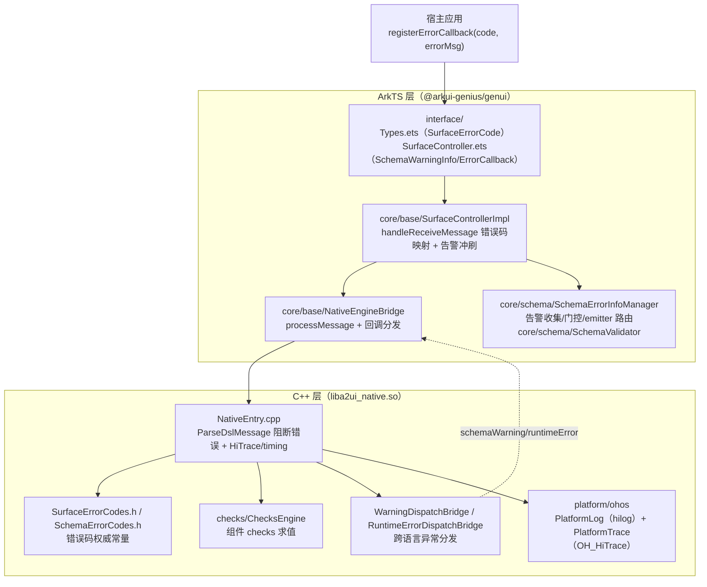
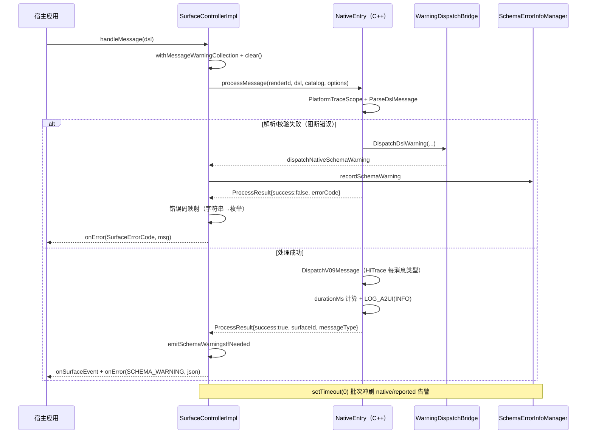

# 架构设计

> 确认目标仓和模块的架构约束、关键设计决策、Spec 拆分方向。

## 设计元数据

| Field | Content |
|-------|---------|
| Design ID | DESIGN-Func-07-04-26 |
| 关联需求 | 已有能力补录（无独立 requirement.md） |
| 关联 Epic | 无 |
| 目标 Feature | Feat-01 错误码与异常行为契约（基线）；Feat-02 维测可观测契约；Feat-03 大数据打点 |
| 复杂度 | 复杂 |
| 目标版本 | A2UI 原生协议 v0.9（`https://a2ui.org/specification/v0_9/catalogs/basic/catalog.json`）+ 鸿蒙扩展协议 1.0.0（`ohos.a2ui.extended.catalog`） |
| Owner | GenUI SIG |
| 状态 | Baselined（已有实现补录） |

## 需求基线

> 需求基线详见 proposal.md。以下仅列出设计阶段需要额外强调的要点。

| 项 | 补充说明 |
|----|---------|
| 补录而非新增 | 当前实现即规格，可疑行为只能标注为风险/备注，禁止提出修复建议 |
| 基准实现声明 | 异常处理与 DFX 契约以 A2UIRender 全量渲染引擎（`@arkui-genius/genui`）为基准实现 |
| 错误码分层 | 外层数字码（`SurfaceErrorCode` 枚举，经 `registerErrorCallback(code, errorMsg)` 上报）+ 内层字符串码（`SchemaErrorCode` 字符串，仅出现在 `SCHEMA_WARNING=2001` 的聚合 JSON 内）双层 |
| 异常 vs 告警 | 阻断错误（schema 解析/校验 2002~2107、surface 操作 11001~11005）中断渲染；告警（`SCHEMA_WARNING=2001`、`FALLBACK_WARNING=1101`）不中断渲染 |
| 范围边界 | 本功能域（07-04-26）覆盖错误码契约、告警可观测性、性能/日志打点；具体消息解析归 07-04-01，组件/函数语义归 07-04-02~24 |

## 上下文和现状

### 涉及仓和模块

| 仓库 | 补充架构说明 |
|------|-------------|
| `GenerativeUI/A2UIRender` | 全量渲染引擎。ArkTS 层（`ets/interface/Types.ets`、`ets/interface/SurfaceController.ets`、`ets/core/schema/`、`ets/core/base/SurfaceControllerImpl.ets`）提供错误码契约与告警收集/冲刷；C++ 层（`cpp/SurfaceErrorCodes.h`、`cpp/SchemaErrorCodes.h`、`cpp/functions/*DispatchBridge.cpp`、`cpp/checks/`、`cpp/platform/`）提供原生错误码、跨语言异常分发、日志与 trace |
| `GenerativeUI/Docs` | 开发者文档（`reference/errors.md`、`reference/schema-validation.md`、`guides/troubleshooting.md`），仅作理解辅助，契约以 A2UIRender 实现为准 |

> 仓、模块、当前职责、影响类型详见 proposal.md「影响范围」。

### 调用链层级分析

| 层 | 模块 | 职责 | 修改类型 |
|----|------|------|---------|
| 1. 公开契约层（ArkTS） | `ets/interface/Types.ets`、`ets/interface/SurfaceController.ets` | 声明 `SurfaceErrorCode`/`SchemaWarningInfo`/`ErrorCallback` 契约 | 现状（基准实现） |
| 2. 控制器实现层（ArkTS） | `ets/core/base/SurfaceControllerImpl.ets`、`ets/core/base/NativeEngineBridge.ets` | handleMessage 错误码映射、schema 告警收集/冲刷、异常分发入口 | 现状 |
| 3. 告警管理/校验层（ArkTS） | `ets/core/schema/SchemaErrorInfoManager.ets`、`SchemaValidator.ets`、`SchemaBuilder.ets` | 告警单例状态、setTimeout 批次冲刷、schema 校验 | 现状 |
| 4. NAPI 桥接层（ArkTS） | `ets/core/base/NativeEngineBridge.ets` | 封装 `liba2ui_native.so` 调用 + 回调分发（action/schemaWarning/runtimeError） | 现状 |
| 5. 原生消息处理层（C++） | `cpp/NativeEntry.cpp`、`cpp/SurfaceErrorCodes.h`、`cpp/SchemaErrorCodes.h` | DSL 解析/校验、阻断错误产生、HiTrace/timing 打点 | 现状 |
| 6. 跨语言分发层（C++） | `cpp/functions/WarningDispatchBridge.cpp`、`RuntimeErrorDispatchBridge.cpp` | 告警/运行时错误经 NAPI 回调分发到 ArkTS | 现状 |
| 7. 组件校验层（C++） | `cpp/checks/ChecksEngine.cpp` | 组件 `checks` 数组（required/regex/length/numeric/email）求值 | 现状 |
| 8. 平台日志/trace 层（C++） | `cpp/platform/ohos/PlatformLog.cpp`、`cpp/platform/ohos/PlatformTrace.cpp`、`cpp/platform/common/PlatformLog.cpp` | hilog 输出、`%{public}`/`%{private}` 归一化、OH_HiTrace | 现状 |

检查项：
- [x] 调用链每一层都已覆盖（公开契约→控制器→告警管理→NAPI→原生处理→跨语言分发→组件校验→平台日志）
- [x] 每层职责边界清晰（ArkTS 负责契约、告警收集与冲刷编排；C++ 负责错误码权威源、解析校验与日志 trace）
- [x] 每层修改类型明确（均为「现状」，存量补录）

### 适用架构规则

| Rule ID | 适用原因 | 设计结论 | 验证方式 |
|---------|---------|---------|---------|
| OH-ARCH-LAYERING | ArkTS→NAPI→C++ 跨语言多层调用 | 调用方向自顶向下；C++ 经 NAPI 回调分发到 ArkTS（schemaWarning/runtimeError/action） | 架构评审/依赖检查 |
| OH-ARCH-SUBSYSTEM | 单仓 + 独立 Docs 仓，无跨子系统 | 不引入子系统外依赖 | 依赖检查 |
| OH-ARCH-API-LEVEL | 公开 ArkTS API（SurfaceErrorCode/SchemaWarningInfo/ErrorCallback），无 C-API | Public API（ArkTS），无新增权限 | API 评审 |
| OH-ARCH-COMPONENT-BUILD | hilog/hitrace 依赖已纳入现有 `liba2ui_native.so`（`CMakeLists.txt:217-218`） | 无构建影响（存量） | 构建验证 |
| OH-ARCH-ERROR-LOG | 错误码双层（native 字符串 errorCode → SurfaceErrorCode 枚举；外层数字码 + 内层字符串码） | 错误码契约详见 Feat-01；告警冲刷见 Feat-02；打点见 Feat-03 | UT/hilog |

## 不涉及项承接

> proposal.md 已完成 N/A 判定。本节仅对标记「涉及」且需展开设计的维度给出结论。

| 维度 | 设计结论 |
|------|---------|
| 跨进程/SA | 不涉及（同进程 ArkTS↔C++ 经 NAPI） |
| 持久化 | 不涉及（告警/错误码仅内存态，`SchemaErrorInfoManager` 单例持有） |
| 权限 | 不涉及 |
| 国际化/RTL | 不涉及（错误消息为英文/开发向，不本地化） |
| 多设备适配 | 打点/日志/错误码契约设备无关；设备类型仅影响日志落盘目标（hilog），行为无差异 |
| 范围边界 | 消息解析错误归 07-04-01；组件/函数 schema 语义归 07-04-02~24；本域只固化错误码与 DFX 契约 |

## 关键设计决策

| 决策 ID | 问题 | 推荐方案 | 探索过的替代方案 | 取舍理由 | 影响 |
|--------|------|---------|----------------|---------|------|
| ADR-1 | 错误码如何分层 | 外层数字码（`SurfaceErrorCode` 枚举）+ 内层字符串码（`SchemaErrorCode` 字符串）双层；阻断错误中断渲染，告警不中断 | (a) 单一数字码；(b) 单一字符串码 | 数字码对宿主稳定可 switch，字符串码承载具体告警类型；两码各司其职 | `SCHEMA_WARNING=2001` 聚合 JSON 内嵌 warnings[i].code |
| ADR-2 | native 与 ArkTS 错误码如何对齐 | C++ `SurfaceErrorCodes.h` 常量与 ArkTS `Types.ets` 枚举数值一一对齐；native 返回字符串 errorCode，ArkTS `handleReceiveMessage` 手写 if-else 链映射为枚举 | (a) native 直接返回枚举数值；(b) 不映射 | 字符串解耦 native 与 ArkTS；枚举对外稳定 | 映射链需完整覆盖（`SurfaceControllerImpl.ets:723-870`） |
| ADR-3 | schema 告警如何收集与冲刷 | `SchemaErrorInfoManager` 单例按 renderId 门控收集；控制器用 `setTimeout(0)` 合并同帧告警批量经 `onError(SCHEMA_WARNING, json)` 上报 | (a) 每条告警立即上报；(b) 只缓存不冲刷 | 批次合并降低跨语言回调频次；setTimeout 0 保证消息处理完成后再上报 | 两类冲刷队列（native 告警 + reported 告警） |
| ADR-4 | 告警开关与路由如何实现 | `enableSchemaWarningReport` 写 `registerWarningGate`（renderId→bool）；CREATE/DELETE 时 `bindSurface`/`registerWarningEmitter` 建立 surface→emitter 路由 | (a) 全局开关；(b) 无开关 | renderId 粒度门控 + surface 粒度 emitter 支持多 Surface 独立上报 | 缺省 `checkSchema=true`；disabled 时 `recordSchemaWarning` 直接返回 |
| ADR-5 | 逐消息性能与追踪如何打点 | 每条消息入口记录 `startTime`，成功后 `LOG_A2UI(LOG_INFO)` 输出 durationMs；每条消息用 `PlatformTraceScope` 包裹 `OH_HiTrace` trace | (a) 无打点；(b) 累加计数器 | HiTrace 可集成到系统 trace 面板；durationMs 日志可观测卡顿 | 仅成功路径输出 timing 日志 |
| ADR-6 | 日志隐私与超长消息如何防护 | `PlatformLogPrint` 归一化 `%{public}` 标记、含 `%{private}` 整条脱敏；消息 > 4096 截断加 `[truncated]`；DSL > 100KB 在入口直接拒绝 | (a) 原样输出；(b) 不设长度上限 | `%{private}` 防敏感信息泄漏；4096 上限防日志爆炸 | `MAX_DSL_LENGTH=100*1024` 护栏 |

## 设计骨架

### 骨架范围

| 骨架项 | 目标 | 不包含 | 验证方式 |
|--------|------|--------|---------|
| 错误码契约 | 固化 `SurfaceErrorCode`/`SchemaErrorCode` 数值与分层、native→ArkTS 映射 | 组件/函数语义（07-04-02~24） | 静态比对 + UT |
| 告警可观测 | 固化告警收集/冲刷/开关/路由、日志输出契约 | 卡片裁剪（07-04-25） | UT |
| 打点 | 固化 HiTrace/逐消息 timing/DSL 长度护栏/日志隐私 | — | UT + hilog |

### 骨架 Spec 拆分

| Task ID | 目标 | 受影响文件 | AC |
|---------|------|----------|-----|
| TASK-SKELETON-1 | Feat-01 错误码与异常行为契约基线 | `Types.ets`、`SurfaceErrorCodes.h`、`SurfaceControllerImpl.ets`、`SchemaErrorInfoManager.ets` | AC-1.1~AC-6.x |
| TASK-SKELETON-2 | Feat-02 维测可观测契约 | `SchemaErrorInfoManager.ets`、`SurfaceControllerImpl.ets`、`PlatformLog.cpp` | Feat-02 AC |
| TASK-SKELETON-3 | Feat-03 大数据打点 | `NativeEntry.cpp`、`PlatformTrace.cpp`、`PlatformLog.cpp` | Feat-03 AC |

## 后续 Task 拆分

| Task ID | 目标 | 受影响文件 | 依赖 |
|---------|------|----------|------|
| T-1 | Feat-01 错误码与异常行为契约（基线，本设计已承接） | `Feat-01-*-spec.md` + 本 design.md | — |
| T-2 | Feat-02 维测可观测契约 | `SchemaErrorInfoManager.ets`、`SurfaceControllerImpl.ets` | T-1 |
| T-3 | Feat-03 大数据打点 | `NativeEntry.cpp`、`PlatformTrace.cpp`、`PlatformLog.cpp` | T-1 |

## API 签名、Kit 与权限

> 本节承接 spec.md「API 变更分析」中识别的 API，给出签名、权限和 d.ts 位置等实现细节。

### 新增 API

无新增。本特性覆盖既有 ArkTS 公开 API（存量补录）。

### 变更/废弃 API

| 原有 API | 变更类型 | 新 API | 迁移说明 |
|---------|---------|--------|---------|
| `SurfaceErrorCode`（`Types.ets:51-135` 枚举） | 既有 | — | 错误码对外契约，数值稳定 |
| `SchemaWarningInfo`（`SurfaceController.ets:33-39`） | 既有 | — | 告警上报负载契约 |
| `ErrorCallback`（`SurfaceController.ets:28`） | 既有 | — | `(code, errorMsg)` 错误回调 |
| `SurfaceController.enableSchemaWarningReport`/`reportSchemaWarning`/`registerErrorCallback` | 既有 | — | 告警开关/上报/错误回调 |

> d.ts 位置：`genui/src/main/ets/interface/Types.ets`、`genui/src/main/ets/interface/SurfaceController.ets`（ArkTS 源即契约，无独立 SDK `.d.ts`）。Kit：`@arkui-genius/genui`；权限：无；SysCap：不适用。

## 构建系统影响

### BUILD.gn 变更

无变更（存量补录）。`genui/src/main/cpp/` 已纳入现有 `liba2ui_native.so` 构建目标；hilog/hitrace 依赖见 `CMakeLists.txt:217-218`（`hilog-lib`、`hilog_ndk.z`）。

### bundle.json 变更

无变更。

## 可选设计扩展

### 架构图



### 数据流/控制流

| 步骤 | 调用方 | 被调用方 | 数据/接口 | 说明 |
|------|--------|---------|----------|------|
| 1 | 宿主应用 | `SurfaceControllerImpl.handleMessage` | dsl string | 入口，包裹 `withMessageWarningCollection` |
| 2 | `SurfaceControllerImpl` | `NativeEngineBridge.processMessage` | `(renderId, dsl, catalog, options)` | 跨语言 |
| 3 | native `ProcessMessage` | `ParseDslMessage` | `JsonValue root` | 阻断错误 → `ProcessResult.errorCode` |
| 4 | native `ParseDslMessage` | `DispatchDslWarning` | `(renderId, code, msg, path, itemName)` | 解析期告警 → `WarningDispatchBridge` |
| 5 | `WarningDispatchBridge` | `SurfaceControllerImpl.dispatchNativeSchemaWarning` | `{renderId, code, message, path, itemType, itemName}` | 跨语言告警 |
| 6 | `dispatchNativeSchemaWarning` | `SchemaErrorInfoManager.recordSchemaWarning` | `SchemaErrorInfo` | 告警收集（门控后） |
| 7 | `SurfaceControllerImpl` | `onError(SCHEMA_WARNING, payloadJson)` | 聚合 JSON | setTimeout 0 批次冲刷 |
| 8 | native `ProcessMessage` | `RuntimeErrorDispatchBridge.Dispatch` | `{renderId, errorCode, errorMessage, source}` | 运行时错误 |
| 9 | `CreateTimedProcessResultValue` | `LOG_A2UI(LOG_INFO)` | `durationMs` | 逐消息 timing 打点 |

### 时序设计



### 数据模型设计

**API 层（ArkTS，公开契约）**

```typescript
// ets/interface/Types.ets
export enum SurfaceErrorCode {
  NO_ERROR = 0, NO_SURFACE_MATCHED = 1001, NATIVE_PROCESS_FAILED = 1002,
  UNSUPPORTED_PROTOCOL_VERSION = 1003, COMPONENT_DROPPED_ON_INVALID_PARAMETER = 1004,
  FALLBACK_WARNING = 1101, SCHEMA_WARNING = 2001, SCHEMA_DSL_EMPTY = 2002,
  /* ... 2003/2004, 2101-2107, 3001/3101/3201-3204, 11001-11005 ... */
}

// ets/core/schema/SchemaErrorInfoManager.ets
export enum SchemaErrorCode {
  REQUIRED_MISS = 'ERROR_CODE_REQUIRED_MISS',
  INVALID_VALUE = 'ERROR_CODE_INVALID_VALUE',
  UNDEFINED_FIELD = 'ERROR_CODE_UNDEFINED_FIELD',
  TYPE_MISMATCH = 'ERROR_CODE_TYPE_MISMATCH',
  SCHEMA_PARSE_FAILED = 'ERROR_CODE_SCHEMA_PARSE_FAILED',
  FUNCTION_SCHEMA_INVALID = 'ERROR_CODE_FUNCTION_SCHEMA_INVALID'
}
export interface SchemaErrorInfo { code: string; message: string; path?: string;
  itemType?: SchemaItemType; itemName?: string; timestamp: string; }
```

**Framework 层（C++）**

```cpp
// cpp/SurfaceErrorCodes.h
constexpr int32_t SURFACE_RESULT_SCHEMA_DSL_EMPTY = 2002;        // schema parse 2002-2004
constexpr int32_t SURFACE_RESULT_SCHEMA_MESSAGE_OPERATION_INVALID = 2101; // 2101-2107
constexpr int32_t SURFACE_RESULT_MULTI_SURFACE_DISABLED = 11001; // 11001-11005
constexpr int32_t SURFACE_ERROR_SCHEMA_WARNING = 2001;           // runtime 回调 1001-3204

// cpp/SchemaErrorCodes.h
constexpr char SCHEMA_ERROR_CODE_REQUIRED_MISS[] = "ERROR_CODE_REQUIRED_MISS"; // 内层字符串码
```

| 结构 | 存储方案 | 生命周期 |
|------|---------|---------|
| `SchemaErrorInfoManager.warnings[]` | 内存数组（单例） | `clear()` 每次消息入口清空 |
| `schemaWarningEnabledByRenderId` | `Map<number, boolean>` | register/unregisterWarningGate |
| `surfaceIdToRenderIds` | `Map<string, number[]>` | bindSurface/unbindSurface |
| `surfaceWarningEmitters` | `Map<string, (warnings)=>void>` | register/unregisterWarningEmitter |
| `SurfaceControllerImpl.pendingNativeSchemaWarnings[]` | 数组 | enqueue → setTimeout 0 flush |

### 测试性设计

| 测试层级 | 测试目标 | Mock 策略 | 验证方式 |
|---------|---------|----------|---------|
| ArkTS 单测 | `SchemaErrorInfoManager` 收集/门控/冲刷 | 直接测单例 | `genui/src/test/` |
| ArkTS 单测 | `handleReceiveMessage` 错误码映射链 | mock `NativeEngineBridge.processMessage` | `genui/src/test/` |
| C++ UT | `ParseDslMessage` 阻断错误产生 | 直接测 `NativeEntry` | `genui/src/test/cpp/` |
| C++ UT | `PlatformLogPrint` 归一化/截断 | 注入超长格式串 | `genui/src/test/cpp/` |
| hilog 验证 | hilog 输出 + HiTrace | 真机 `hilog | grep A2UI` | 手动 |

### 接口参数规约

| 接口 | 参数 | 类型 | 合法范围 | 非法处理 | 边界说明 |
|------|------|------|---------|---------|---------|
| `registerErrorCallback` | onError | ErrorCallback | `(code, errorMsg)` | destroyed 时忽略 | — |
| `enableSchemaWarningReport` | enable | boolean | true/false | destroyed 时忽略 | 缺省 true |
| `reportSchemaWarning` | schemaWarningInfo | SchemaWarningInfo | errorMsg 非空 string | 空/非 string 忽略 | checkSchema=false 忽略 |
| `handleMessage` | dsl | string | 非空，≤100KB | 空/超长→错误码 | `MAX_DSL_LENGTH=100*1024` |
| `PlatformLogPrint` | format | const char* | 无 `%{private}` | 含 `%{private}` 整条脱敏 | >4096 截断 |

### 线程与并发模型

| 操作 | 发起线程 | 回调线程 | 跨进程边界 | 线程安全 | 重入约束 |
|------|---------|---------|----------|---------|---------|
| handleMessage | UI | UI | 无 | 单线程 UI | 处理中不可销毁 |
| schemaWarning 回调 | native→ArkTS | UI | 无 | 单线程 | — |
| runtimeError 回调 | native→ArkTS | UI | 无 | 单线程 | — |
| setTimeout 0 冲刷 | UI 事件循环 | UI | 无 | 单线程 | 批次合并 |
| HiTrace/timing | native | native | 无 | 单线程 | trace scope RAII |

## 详细设计

### 错误码双层契约

`SurfaceErrorCode` 枚举（`Types.ets:51-135`）为对外数字码，分段：`0`（成功）、`1001-1101`（surface/runtime 基础）、`2001-2107`（schema 告警+解析/校验阻断）、`3001-3204`（action/local function/表达式）、`11001-11005`（多 Surface）。C++ 权威常量在 `SurfaceErrorCodes.h:25-64`：`SURFACE_RESULT_*`（schema 解析/校验/surface 操作）与 `SURFACE_ERROR_*`（runtime 回调）数值与 `Types.ets` 对齐。内层字符串码在 `SchemaErrorCodes.h:23-27`（`REQUIRED_MISS`/`INVALID_VALUE`/`TYPE_MISMATCH`/`UNDEFINED_FIELD`/`SCHEMA_PARSE_FAILED`），ArkTS 侧 `SchemaErrorInfoManager.ets:16-23` 的 `SchemaErrorCode` 多一个 `FUNCTION_SCHEMA_INVALID`（见 RISK-3）。

### native → ArkTS 错误码映射

`handleReceiveMessage`（`SurfaceControllerImpl.ets:701-893`）：`processMessage` 返回 `NativeProcessResult`；`success!==true` 时按 `errorCode` 字符串 if-else 链映射（`:723-870`）：`VERSION_INVALID`→`SCHEMA_VERSION_INVALID`、`UNSUPPORTED_PROTOCOL_VERSION`→`UNSUPPORTED_PROTOCOL_VERSION`、`DSL_EMPTY`→`SCHEMA_DSL_EMPTY`、`JSON_PARSE_FAILED`→`SCHEMA_JSON_PARSE_FAILED`、`ROOT_NOT_OBJECT`→`SCHEMA_ROOT_NOT_OBJECT`、`MESSAGE_OPERATION_INVALID`/`MESSAGE_MULTIPLE_BODIES`/`MESSAGE_BODY_INVALID`/`SURFACE_ID_MISSING`/`COMPONENTS_INVALID`/`CATALOG_ID_MISSING` 对应 `SCHEMA_*`、`SURFACE_NOT_FOUND` 或 `surfaceResultCode===NO_SURFACE_MATCHED`→`NO_SURFACE_MATCHED`、policy 码→`reportSurfacePolicyFailure`、默认→`NATIVE_PROCESS_FAILED`。native 字符串产生于 `ParseDslMessage`（`NativeEntry.cpp:609-659`）与各 `Validate*` 函数。

### schema 告警收集与冲刷

`SchemaErrorInfoManager`（`SchemaErrorInfoManager.ets:51-283`）单例：`recordSchemaWarning`（`:193-228`）先经 `isSchemaWarningEnabled` 门控，构造 `SchemaErrorInfo`（`timestamp=new Date().toISOString()`，`:210`），有 capture 态则入 capture，否则入全局 `warnings`；同时 `console.warn` 打日志（`:227`）。控制器 `enqueueNativeSchemaWarnings`（`SurfaceControllerImpl.ets:500-518`）与 `enqueueReportedSchemaWarning`（`:530-546`）用 `setTimeout(0)` 合并批次后经 `flush*` 一次性 `emitSchemaWarnings`（`:485-491`）→ `onError(SCHEMA_WARNING, buildSchemaWarningPayloadFromWarnings(...))`。

### 日志与 trace 打点

hilog 输出经 `PlatformLogWrite`（`PlatformLog.cpp:51-55`）用 `OH_LOG_Print(LOG_APP, level, 0xFF00, "A2UI@"+commit, "%{public}s")`；`PlatformLogPrint`（`platform/common/PlatformLog.cpp:170-208`）归一化 `%{public}`、遇 `%{private}` 整条脱敏、>4096 截断加 `[truncated]`。HiTrace 经 `PlatformTraceScope`（`PlatformTrace.cpp:20-45`）RAII 调 `OH_HiTrace_StartTrace/FinishTrace`（`platform/ohos/PlatformTrace.cpp:27,33`）；逐消息在 `DispatchV09Message`（`NativeEntry.cpp:1078-1101`）按类型包裹。逐消息 timing 在 `CreateTimedProcessResultValue`（`NativeEntry.cpp:1149-1161`）成功后输出 `durationMs`。

## 风险和开放问题

| 项 | 类型 | 影响 | 处理方式 | Owner |
|----|------|------|---------|-------|
| RISK-1 native 字符串 errorCode → `SurfaceErrorCode` 枚举映射为手写 if-else 链，新增错误码需同步补映射 | 架构 | 中 | 规格 Feat-01 AC 覆盖映射；`SurfaceControllerImpl.ets:723-870` | GenUI SIG |
| RISK-2 `SurfaceErrorCodes.h:24` 注释声称与 `SurfaceTypes.ets` 同步，实际文件名为 `Types.ets`（`SurfaceTypes.ets` 仅 re-export），易误导维护者 | 架构 | 低 | 规格 Feat-01 风险表标注 | GenUI SIG |
| RISK-3 内层字符串码 ArkTS `SchemaErrorCode`（`SchemaErrorInfoManager.ets:16-23`）含 `FUNCTION_SCHEMA_INVALID`，C++ `SchemaErrorCodes.h` 未定义该常量 | 架构 | 低 | 规格 Feat-01 风险表标注 | GenUI SIG |
| RISK-4 ArkTS `SchemaValidator.validateMessageEnvelope`（`SchemaValidator.ets:111-143`）标记为 Deprecated 兼容入口，实际权威解析在 native `ParseDslMessage`，双份校验逻辑需避免分歧 | 架构 | 中 | 规格 Feat-02 标注；`SchemaValidator.ets:149-153` | GenUI SIG |
| RISK-5 `MAX_DSL_LENGTH=100*1024` 护栏返回 `NATIVE_PROCESS_FAILED`（1002），与其它 DSL 阻断错误（2002 段）分类不同，宿主需按 1002 处理超长 | 边界 | 低 | 规格 Feat-03 AC 覆盖；`NativeEntry.cpp:1136-1147` | GenUI SIG |
| RISK-6 逐消息 timing 日志仅在成功路径输出（`CreateTimedProcessResultValue` 内 `result.success` 判断），失败路径无耗时观测 | 测试 | 低 | 规格 Feat-03 风险表标注；`NativeEntry.cpp:1152-1159` | GenUI SIG |

## 设计审批

- [x] 需求基线已确认，设计覆盖 P0/P1 AC
- [x] 不涉及项已承接，N/A 和展开项都有结论
- [x] 涉及仓和模块职责清楚
- [x] 调用链层级分析完整，每层覆盖到位
- [x] 适用架构规则已识别并形成设计结论
- [x] 分层和子系统边界合规
- [x] API 变更有签名、权限、错误码和兼容性说明
- [x] BUILD.gn/bundle.json 影响明确
- [x] 设计输出和后续 Task 拆分明确
- [x] 关键设计决策有理由和影响说明
- [x] 风险和开放问题有 Owner

**结论:** 通过（已有实现补录）
