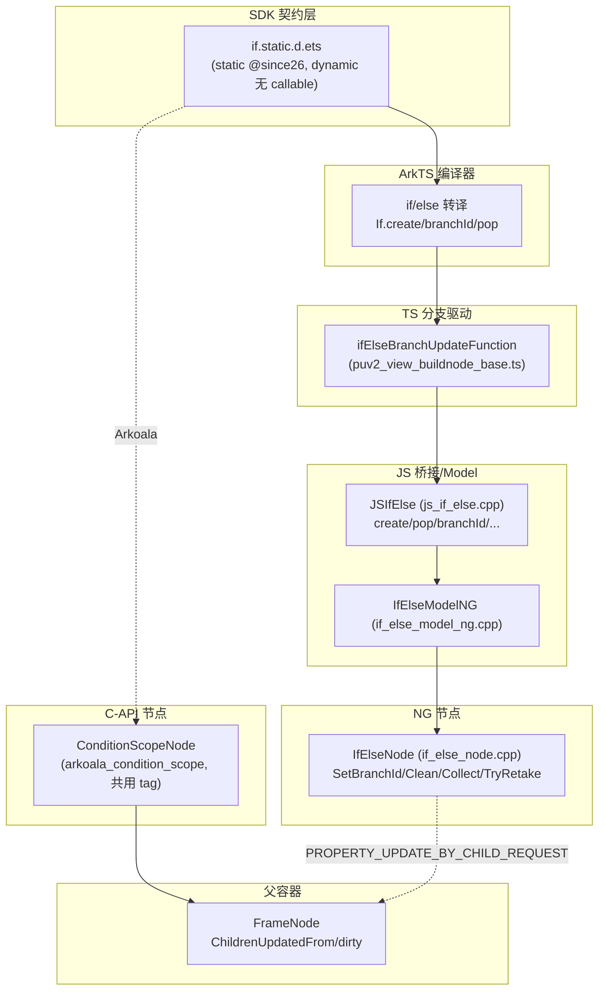
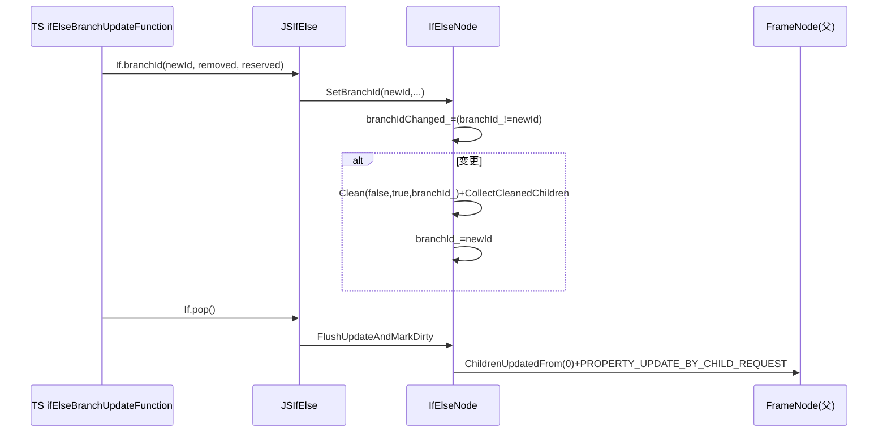

# 架构设计

> 确认目标仓和模块的架构约束、关键设计决策、Spec 拆分方向。

## 设计元数据

| Field | Content |
|-------|---------|
| Design ID | `DESIGN-Func-07-05-01` |
| 关联需求 | 已有能力补录（无独立 requirement.md） |
| 关联 Epic | 无 |
| 目标 Feature | Feat-01 if/else 条件渲染语法（基线）；Feat-02 ForEach 循环渲染语法（已补录）；Feat-03 渲染控制语法共享框架（已补录） |
| 复杂度 | 标准 |
| 目标版本 | dynamic：if/else 纯语法（无 callable）、ForEach `@since7`；static：if/else `@since26`、ForEach `@since23`；`@since26 staticonly` style-builder/debugLine 等 |
| Owner | ArkUI SIG |
| 状态 | Baselined（已有实现补录） |

## 需求基线

> 需求基线详见 proposal.md。以下仅列出设计阶段需要额外强调的要点。

| 项 | 补充说明 |
|----|---------|
| 补录而非新增 | 当前实现即规格，可疑行为只能标注为风险/备注 |
| 范围边界 | 本功能域（07-05-01）覆盖 if/else 条件渲染 + ForEach 循环渲染 + 共享语法节点框架；LazyForEach（07-05-02）与 Repeat（07-05-03）为独立 FuncID，本设计不展开 |
| if/else 范式差异 | dynamic 为纯语法（无公开 callable，由 ArkTS 编译器转译），仅 static `@since26` 暴露 `If/ElseIf/Else` callable |
| 共享基类 | ForEachNode/LazyForEachNode/RepeatNode/RepeatVirtualScroll(2)Node/ArkoalaForEachNode 均继承 `ForEachBaseNode`；IfElseNode 直接继承 UINode（仅共享 `IsSyntaxNode` 标记） |
| （Feat-02）ForEach | `ForEach(arr,itemGen,keyGen?)`（dyn `@since7`/static `@since23`）；keyGen 默认 `${index}__${JSON.stringify(item)`、重复 key 抛 applicationError；id-based diff（新/既有重排/消失移除）；`FlushUpdateAndMarkDirty` no-op 守卫 + `MEASURE_SELF_AND_PARENT\|BY_CHILD_REQUEST`；onMove 仅 List/Grid（注：与 Repeat 经 `isThisRepeatNode_` 共用 ForEachNode 已废弃，详见 ADR-F2-2） |
| （Feat-03）共享框架 | framework-internal：`ForEachBaseNode` 共享契约（IsSyntaxNode/MoveData/GetFrameNode 纯虚/onMove·drag virtuals/DisableRecycle）、`UINode::IsSyntaxNode` 标记、循环节点均 `: public ForEachBaseNode`（IfElseNode 直接继承 UINode）、Create/Pop 生命周期、NG/legacy 管线选择、C-API `ArkoalaForEachNode` |

## 上下文和现状

### 涉及仓和模块

| 仓库 | 补充架构说明 |
|------|-------------|
| `arkui_ace_engine` | if/else + ForEach + 共享语法节点框架全部实现（TS 转译、JS 桥接、NG 节点、Model 工厂、C-API 节点）均在本仓 |
| `interface/sdk-js` | static `if.static.d.ets`、dynamic+static `for_each.d.ts`/`forEach.static.d.ets` 契约（外部 API 权威） |

> 仓、模块、当前职责、影响类型详见 proposal.md「影响范围」。

### 调用链层级分析

| 层 | 模块 | 职责 | 修改类型 |
|----|------|------|---------|
| 1. SDK 契约层 | `if.static.d.ets`（Feat-01 static `@since26`）、`for_each.d.ts`/`forEach.static.d.ets`（Feat-02） | 声明 If/ForEach 公开契约（dynamic if 无 callable） | 不修改（外部 API 权威） |
| 2. ArkTS 编译器/转译层 | ArkTS 编译器 | if/else 转译为 `If.create`→`ifElseBranchUpdateFunction`→`If.branchId`→`If.pop`；ForEach 转译为对应调用 | 现状（不在本仓） |
| 3. TS 分支/diff 驱动层 | `puv2_view_buildnode_base.ts`（ifElseBranchUpdateFunction，Feat-01）、`pu_view.ts`（ForEach diff，Feat-02） | TS 侧分支选择/id diff 驱动 | 现状（Feat-01） |
| 4. JS 桥接层 | `js_if_else.cpp`（Feat-01）、`js_foreach.cpp`（Feat-02） | `JSIfElse`/`JSForEach` 绑定 + NG/legacy 管线选择 | 现状（Feat-01 已补录；Feat-02 JSForEach/SetIdArray 已补录） |
| 5. Model 工厂层 | `if_else_model_ng.cpp`/`if_else_model.h`（Feat-01）、`for_each_model_ng.cpp`（Feat-02） | Create/Pop/SetBranchId(or SetNewIds)/CanRetake 等门面 | 现状（Feat-01 已补录；Feat-02 ForEachModelNG 已补录） |
| 6. 语法节点层 | `if_else_node.cpp`/`.h`（Feat-01 IfElseNode）、`for_each_node.cpp`/`.h`（Feat-02 ForEachNode） | 分支 diff/id diff + 脏标记 | 现状（Feat-01 已补录；Feat-02 ForEachNode id-diff 已补录） |
| 7. 共享基类层 | `for_each_base_node.h`（Feat-03 ForEachBaseNode）、`ui_node.h`（IsSyntaxNode 标记） | 循环节点共享契约；IsSyntaxNode 标记 | 现状（Feat-03 已补录） |
| 8. C-API 节点层 | `arkoala_condition_scope.*`（Feat-01 ConditionScopeNode）、`arkoala_for_each_node.*`（Feat-02/03 ArkoalaForEachNode） | Arkoala/C-API 对应节点 | 现状（Feat-01 已补录；Feat-03 ArkoalaForEachNode 已补录） |
| 9. 父容器层 | `FrameNode`（`ChildrenUpdatedFrom`/dirty 标记） | 分支/列表变更通知父重测量 | 现状（跨特性） |

检查项：
- [x] 调用链每一层都已覆盖（SDK→编译器→TS→JS 桥接→Model→节点→共享基类→C-API→父容器）
- [x] 每层职责边界清晰（TS 驱动 diff/分支，C++ 节点执行）
- [x] 每层修改类型明确（均为「现状」，存量补录）

### 适用架构规则

| Rule ID | 适用原因 | 设计结论 | 验证方式 |
|---------|---------|---------|---------|
| OH-ARCH-LAYERING | SDK→编译器→TS→JS→Model→节点多层 | 调用方向自顶向下；C++ 节点不直接驱动 TS，由 TS ifElseBranchUpdateFunction 调度 | 架构评审/依赖检查 |
| OH-ARCH-SUBSYSTEM | 仅本仓 + SDK 契约，无跨子系统 | 不引入子系统外依赖 | 依赖检查 |
| OH-ARCH-API-LEVEL | ForEach dynamic `@since7`/static `@since23`、if/else static `@since26`；dynamic if 无 callable | Public API，无新增权限 | API 评审/XTS |
| OH-ARCH-COMPONENT-BUILD | 现状无 BUILD.gn/bundle.json 变更 | 无构建影响 | 构建验证 |
| OH-ARCH-ERROR-LOG | 分支切换无错误码（仅脏标记）；TryRetake 失败返回 false | 无错误码路径 | UT |

## 不涉及项承接

> proposal.md 已完成 N/A 判定。本节仅对标记「涉及」且需展开设计的维度给出结论。

| 维度 | 设计结论 |
|------|---------|
| 跨进程/SA | 不涉及（同进程语法节点） |
| 持久化 | 不涉及 |
| 权限 | 不涉及（Public API 无权限） |
| 国际化/RTL | 子树布局随父容器 |
| 多范式兼容 | dynamic（NG/legacy）+ static（`@since23/26`）双范式；if/else dynamic 纯语法 |
| 范围边界 | LazyForEach（07-05-02）、Repeat（07-05-03）独立 FuncID，本设计不展开 |

## 关键设计决策

| 决策 ID | 问题 | 推荐方案 | 探索过的替代方案 | 取舍理由 | 影响 |
|--------|------|---------|----------------|---------|------|
| ADR-1 | if/else 在 dynamic 范式如何暴露 | **纯语法、无公开 callable**——由 ArkTS 编译器转译为内部 `If.create`/`If.branchId`/`If.pop`；仅 static `@since26` 暴露 `If/ElseIf/Else` callable | (a) dynamic 也暴露 If callable；(b) 静态也不暴露 | dynamic 与 ArkTS 语言 if/else 语义融合更自然；static 范式需显式 callable 供静态编译 | dynamic 无 If 公开声明（风险 RISK-3） |
| ADR-2 | 分支切换检测机制 | `SetBranchId` 经 `branchIdChanged_=(branchId_!=value)` 检测；变更时 `Clean`+`CollectCleanedChildren` 拆 removed/reserved，**之后**才 `branchId_=value`（顺序固定）；`branchId_` 初值 -1 故首分支必变更 | (a) AST 比较；(b) 条件值缓存比较 | 编译器生成唯一 branchId，比较简单可靠；顺序固定保证 Clean 用旧 branchId | branchId_=-1 初值是边界（RISK 见 AC-1.3） |
| ADR-3 | 分支切换脏标记 | **仅** `PROPERTY_UPDATE_BY_CHILD_REQUEST`，**无** `PROPERTY_UPDATE_MEASURE_SELF_AND_PARENT`；父重测量经 `ChildrenUpdatedFrom(0)` 沿父链到首个 FrameNode 间接触发 | (a) 用 MEASURE_SELF_AND_PARENT；(b) 不通知父 | 分支切换仅子树变化，BY_CHILD_REQUEST 让父按需重测量；与 ForEach/LazyForEach 数据变更标记不同 | 父重测量路径与数据变更不同（风险 RISK-2） |
| ADR-4 | 跨分支状态保留 | `TryRetake(id)` 经 `GetDisappearingChildById(id,branchId_)` 按 **(id, 当前 branchId_)** 查 disappearing 子，命中则 SetJSViewActive(true)+AddChild+UpdateAllGeometryTransition 复用 | (a) 不保留状态；(b) 全局 id 查（不带 branchId） | 跨分支复用减少重建、保留状态；带 branchId 避免跨分支误取 | 仅同分支 disappearing 子可复用 |
| ADR-5 | JS 分支切换方法命名 | JS 绑定方法名 **`If.branchId`**（非 `setBranchId`），签名 `(branchId,removedElmtIds,reservedElmtIds)` | — | 历史命名；TS 实际调 `If.branchId` | C++ 注释写 setBranchId 与实际不符（风险 RISK-1） |
| ADR-6 | C-API（Arkoala）if/else 节点 | `ConditionScopeNode`（extends UINode）共用 `JS_IF_ELSE_ETS_TAG`，**不做 C++ 分支 diff**（分支由 Arkoala 侧先决），仅 AddChild+UpdateAllGeometryTransition+FlushUpdateAndMarkDirty | (a) C++ 也做分支 diff；(b) 独立 tag | Arkoala 静态编译侧已决分支，C++ 仅做节点管理+脏标记 | 与 dynamic IfElseNode 实现路径不同（风险 RISK-4） |
| ADR-F2-1 | ForEach diff 模型 | id-based：keyGen 生成 id→`CompareAndUpdateChildren` 建 newIdsSet/oldIdsSet 比较；新 id `AddChild+InitDragManager`、既有 id `SetAncestor(nullptr)+AddChild` 重排复用、消失 id `RemoveChild` | (a) 全量重建；(b) index-based diff | id 比较精确识别新建/重排/移除三态，复用未变项 | keyGen 须唯一稳定（重复抛 applicationError） |
| ADR-F2-2 | ForEach/Repeat 节点复用（已废弃） | ~~ForEach 与 Repeat 共用同一 C++ 类 ForEachNode，以 `isThisRepeatNode_` 标志区分~~ — **已废弃**，历史实现耦合不再演进；Repeat 非虚拟渲染规格详见 07-05-03 Feat-01 | (a) 独立 RepeatNode 类；(b) 完全共用无分支 | 历史实现复用 ForEachNode；标志分支降低重复 | 两语法共用类已废弃，下游新开发勿基于此（详见 07-05-03） |
| ADR-F2-3 | ForEach 脏标记 | id 变更/MoveData 用 `PROPERTY_UPDATE_MEASURE_SELF_AND_PARENT\|BY_CHILD_REQUEST`+`MarkNeedSyncRenderTree(true)`；`ids_==tempIds_` no-op 跳过 | (a) 仅 BY_CHILD_REQUEST（if/else 模式）；(b) 总是标记 | ForEach 数据项数/尺寸可能变化需自+父重测量；no-op 守卫避免无谓刷新 | 与 if/else 仅 BY_CHILD_REQUEST 不同（RISK-F2-1） |
| ADR-F3-1 | 循环节点共享基类 | `ForEachBaseNode : public UINode` 为 ForEach/LazyForEach/Repeat/RepeatVirtualScroll(2)/ArkoalaForEachNode 共享基类，统一 IsSyntaxNode/onMove·drag virtuals/回收/sync-load 契约；纯虚 MoveData/GetFrameNode 由子类覆写 | (a) 各节点独立实现；(b) 多重继承组合 | 共享通用能力减少重复；纯虚强制子类实现各自 diff/数据移动 | IfElseNode 不继承（分支与循环语义不同） |
| ADR-F3-2 | IsSyntaxNode 标记 + IfElseNode 例外 | `UINode::IsSyntaxNode()` 默认 false；ForEachBaseNode/IfElseNode/ConditionScopeNode 覆写 true。`IfElseNode` **直接继承 UINode**（非 ForEachBaseNode），仅共享标记 | (a) IfElseNode 也继承 ForEachBaseNode；(b) 独立标记接口 | 分支（if/else）与循环（ForEach 等）语义不同，不强共用循环基类；标记统一供管线识别 | 下游勿假设所有语法节点共享 ForEachBaseNode（RISK-F3-1） |
| ADR-F3-3 | 多管线/多范式兼容 | Model 工厂 `NG_BUILD` 编译时或 `IsCurrentUseNewPipeline()` 运行时选 NG `*ModelNG`/legacy `*ModelImpl`；C-API（Arkoala）路径用 `ArkoalaForEachNode`/`ConditionScopeNode` 独立节点 | (a) 仅 NG；(b) 统一节点不分管线 | 历史兼容 legacy + 多范式（dynamic/static/C-API）并存 | 三套实现路径（NG/legacy/C-API）需同步维护 |

## 设计骨架

### 骨架范围

| 骨架项 | 目标 | 不包含 | 验证方式 |
|--------|------|--------|---------|
| if/else 分支 diff | 固化 SetBranchId/branchIdChanged/Clean 顺序、FlushUpdateAndMarkDirty | ForEach diff（Feat-02） | UT |
| TryRetake 状态保留 | 固定 (id,branchId_) 键 + retakenElmtIds | — | UT |
| TS/桥接/Model | ifElseBranchUpdateFunction + If.branchId + IfElseModelNG | ForEach 桥接（Feat-02） | TS 单测 + UT |
| static/C-API | static `@since26` callable + ConditionScopeNode | ForEach C-API（Feat-02/03） | UT + SDK 比对 |

### 骨架 Spec 拆分

| Task ID | 目标 | 受影响文件 | AC |
|---------|------|----------|-----|
| TASK-SKELETON-1 | Feat-01 if/else 分支/diff/TryRetake/桥接/static/C-API 基线 | `if_else_node.cpp`、`if_else_model_ng.cpp`、`js_if_else.cpp`、`puv2_view_buildnode_base.ts`、`arkoala_condition_scope.cpp` | AC-1.1~5.5 |

## 后续 Task 拆分

| Task ID | 目标 | 受影响文件 | 依赖 |
|---------|------|----------|------|
| T-1 | Feat-01 if/else 条件渲染语法（基线，本设计已承接） | `Feat-01-*-spec.md` + 本 design.md | — |
| T-2 | Feat-02 ForEach 循环渲染语法（已补录） | `for_each_node.cpp`、`for_each_model_ng.cpp`、`js_foreach.cpp`、`puv2_view_base.ts` | T-1 |
| T-3 | Feat-03 渲染控制语法共享框架（已补录） | `for_each_base_node.h`、`ui_node.h`（IsSyntaxNode）、`arkoala_for_each_node.*` | T-1 |

## API 签名、Kit 与权限

> 本节承接 spec.md「API 变更分析」中识别的 API，给出签名、权限和 d.ts 位置等实现细节。

### 新增 API

无新增。本特性覆盖既有 API（存量补录）。

### 变更/废弃 API

| 原有 API | 变更类型 | 新 API | 迁移说明 |
|---------|---------|--------|---------|
| `If(condition,content_)` + `IfAttribute.ElseIf/Else`（static `@since26`） | 既有 | — | dynamic 无 callable |
| `If(style,content_)` + `setIfOptions`/`applyAttributesFinish`/`debugLine`（static `@since26 staticonly`） | 既有 | — | style-builder 须 setIfOptions+applyAttributesFinish |
| `ForEach(arr,itemGen,keyGen?)`（dynamic `@since7`/static `@since23`） | 既有 | — | 循环渲染（Feat-02） |
| `ForEach(style)` + `setForEachOptions`/`applyAttributesFinish`/`debugLine`（static `@since26 staticonly`） | 既有 | — | 静态 style-builder（Feat-02） |

> d.ts 位置：static `interface/sdk-js/api/arkui/component/if.static.d.ets:32-124`。Kit：ArkUI；权限：无；SysCap：`SystemCapability.ArkUI.ArkUI.Full`。

## 构建系统影响

### BUILD.gn 变更

无变更（存量补录）。语法节点源文件已纳入 `frameworks/core/components_ng/syntax/` 现有构建目标。

### bundle.json 变更

无变更。

## 可选设计扩展

### 架构图



### 数据流/控制流

| 步骤 | 调用方 | 被调用方 | 数据/接口 | 说明 |
|------|--------|---------|----------|------|
| 1 | ArkTS 编译器 | TS/JS | `If.create`/`ifElseBranchUpdateFunction`/`If.branchId`/`If.pop` | 转译生成 |
| 2 | TS ifElseBranchUpdateFunction | JS If.branchId | `(branchId,removed,reserved)` | 分支切换（branchId≠getBranchId） |
| 3 | JSIfElse | IfElseModelNG | `SetBranchId` | 节点分支 diff |
| 4 | IfElseNode | self | `Clean`+`CollectCleanedChildren`（拆 removed/reserved）→`branchId_=value` | 顺序固定 |
| 5 | IfElseNode | FrameNode | `ChildrenUpdatedFrom(0)`+`PROPERTY_UPDATE_BY_CHILD_REQUEST` | FlushUpdateAndMarkDirty |
| 6 | TS（切回原分支） | IfElseNode | `TryRetake(id)`→`GetDisappearingChildById(id,branchId_)` | 状态保留 |

### 时序设计



### 数据模型设计

**API 层（TypeScript，static SDK 契约）**

```typescript
interface IfAttribute { ElseIf(condition: boolean, content_: CustomBuilder): this; Else(content_: CustomBuilder): void;
  debugLine(...): this; setIfOptions(condition: boolean): this; applyAttributesFinish(): void; }
@ComponentBuilder function If(condition: boolean, content_: CustomBuilder): IfAttribute;  // @since26 static
```

**Framework 层（C++/TS）**

```cpp
// if_else_node.h:61-74
int32_t branchId_ = -1;                  // 初值 -1，首分支必变更
bool branchIdChanged_ = false;           // SetBranchId 置，FlushUpdateAndMarkDirty 清
std::list<int32_t> retakenElmtIds_;      // TryRetake 收集，GetRetakenElmtIds splice 转移
```

| 结构 | 存储方案 | 生命周期 |
|------|---------|---------|
| `branchId_` | IfElseNode int32 | 随分支切换更新 |
| `branchIdChanged_` | IfElseNode bool | SetBranchId 置→FlushUpdate 清 |
| `retakenElmtIds_` | IfElseNode list | GetRetakenElmtIds 后清空 |
| disappearing 子（按 (id,branchId_)） | UINode 基类管理 | Clean 后入 disappearing |

### 测试性设计

| 测试层级 | 测试目标 | Mock 策略 | 验证方式 |
|---------|---------|----------|---------|
| TS 单测 | ifElseBranchUpdateFunction 分支选择 | 直接测 `puv2_view_buildnode_base.ts` | state_mgmt 单测 |
| UT | IfElseNode 分支 diff/TryRetake/脏标记 | Mock 父 FrameNode | `if_else_node` UT |
| UT | Model 门面 | 直接调 `IfElseModelNG` | if_else_model UT |
| XTS | static 范式 If/ElseIf/Else 端到端 | — | `test/xts` |

### 资源所有权矩阵

| 资源 | 创建方 | 持有方 | 销毁触发 | 实际释放 | 异常回收 |
|------|--------|--------|---------|---------|---------|
| 分支子节点 | TS branchfunc→C++ | IfElseNode children | 分支切换/节点销毁 | Clean→disappearing；TryRetake 复用 | 切回原分支复用 |
| IfElseNode | `GetOrCreateIfElseNode` | ElementRegister+父子树 | 父容器销毁 | 随父容器 | — |
| disappearing 子 | Clean | UINode disappearing 池 | TryRetake 复用/超时 | 自动 | 按 (id,branchId_) |

### 接口参数规约

| 接口 | 参数 | 类型 | 合法范围 | 非法处理 | 边界说明 |
|------|------|------|---------|---------|---------|
| `If.branchId`（内部 JS） | branchId | number | 编译器生成唯一 id | — | 非公开 callable |
| SetBranchId | value/removedElmtId/reservedElmtId | int32/list | — | — | branchId_=-1 初值 |
| TryRetake | id | string | elmtId 对应 | 未命中返回 false | 键含 branchId_ |
| `If`（static） | condition/content_ | boolean/CustomBuilder | — | — | @since26；dynamic 无 |

### 线程与并发模型

| 操作 | 发起线程 | 回调线程 | 跨进程边界 | 线程安全 | 重入约束 |
|------|---------|---------|----------|---------|---------|
| 分支子节点构建 | UI/Pipeline | 同 | 无 | 单线程 UI | branchfunc 内不可重入切换分支 |
| TryRetake | TS rerender（UI） | UI | 无 | 单线程 | — |

## 详细设计

### 分支 diff 与 branchId 检测

ArkTS 编译器将 `if/else if/else` 转译为 `If.create()`→`ifElseBranchUpdateFunction(<branchId>,()=>children)`→`If.branchId(<branchId>,...)`→`If.pop()`（注释 `if_else_node.cpp:36-65`）；dynamic 无公开 callable。`SetBranchId(value,removedElmtId,reservedElmtId)`（`:66-79`）：`branchIdChanged_=(branchId_!=value)`（`:68`）；变更时 `Clean(false,true,branchId_)`（`:75`）+`CollectCleanedChildren(GetChildren(),removedElmtId,reservedElmtId,true)`（`:76`）拆 removed/reserved，**之后**`branchId_=value`（`:77`）。`branchId_` 初值 -1（`if_else_node.h:66`）故首分支必变更；同分支再切换（value==branchId_）`branchIdChanged_=false` 不重建。

### 分支切换脏标记

`FlushUpdateAndMarkDirty`（`if_else_node.cpp:81-97`）：`branchIdChanged_` 为真时沿父链找首个 `FrameNode` 祖先调 `ChildrenUpdatedFrom(0)`（`:85-88`），**仅**`MarkNeedFrameFlushDirty(PROPERTY_UPDATE_BY_CHILD_REQUEST)`（`:94`，**无** MEASURE_SELF_AND_PARENT），复位 `branchIdChanged_`（`:96`）。在 `If.pop()` 时执行（编译器生成）。

### TryRetake 跨分支状态保留

`TryRetake(id)`（`:99-112`）经 `GetDisappearingChildById(id,branchId_)`（`:101`，按**当前 branchId_**查，`ui_node.h:596`）；命中则 `SetJSViewActive(true)`+`AddChild`+`LayoutProperty::UpdateAllGeometryTransition(node)`（`:104-107`）+`CollectRetakenNodes`（`:108`）。`CollectRetakenNodes`（`:114-123`）记 `retakenElmtIds_`，递归子（遇 `JS_VIEW_ETS_TAG` 停，`:117`）。`GetRetakenElmtIds`（`:124-130`）`splice` 转移并清空本地，partial-update 据此标非 dirty。键含 `branchId_` 故跨分支不误取。

### TS 分支选择与 JS 桥接

`ifElseBranchUpdateFunction(branchId,branchfunc)`（`puv2_view_buildnode_base.ts:274-311`）：读 `If.getBranchId()`，`branchId===oldBranchid` no-op（`:275-277`）；否则 `If.branchId(branchId,removedChildElmtIds,reservedChildElmtIds)`（`:289`，**方法名 branchId 非 setBranchId**）+reserved 子 `setPending(true)`（`:292`）+removed 子从 `elmtId2Repeat_` 删除+`unregisterRemovedElmtsFromViewPUs`（`:295-300`）+`purgeDeletedElmtIds`（`:304`）+`branchfunc()`（`:306`）+`ifElseBranchUpdateFunctionDirtyRetaken`（`:307`）。`JSIfElse::JSBind`（`js_if_else.cpp:43-55`）绑定 `"If"` 的 `create`/`pop`/`branchId`/`getBranchId`/`canRetake`/`getRetakenElmtIds`。`IfElseModel::GetInstance()`（`:24-38`）`NG_BUILD`/`IsCurrentUseNewPipeline()` 选 `IfElseModelNG` 否则 legacy `IfElseModelImpl`。`IfElseModelNG`（`if_else_model_ng.cpp:23-66`）：Create→`GetOrCreateIfElseNode`+Push、Pop→`PopContainer`、SetBranchId、GetBranchId（默认 -1）、CanRetake→TryRetake、GetRetakenElmtIds。

### 静态范式 callable surface 与 C-API

static `@since26`（`if.static.d.ets`）：`If(condition: boolean, content_: CustomBuilder): IfAttribute`（`:104-108` `@ComponentBuilder`）；style-builder `If(style: CustomBuilderT<IfAttribute>, content_)`（`:121-124` `@since26 staticonly`，须首调 `setIfOptions(condition)`（`:82`）末调 `applyAttributesFinish()`（`:91`），另含 `debugLine`（`:71`））。`IfAttribute`（`:32`）：`ElseIf(condition,content_): this`（`:44`）、`Else(content_): void`（`:57`）。**dynamic 无 If callable**（grep `interface/sdk-js` 仅 static 有 if 声明）。C-API `ConditionScopeNode`（`arkoala_condition_scope.h:27`，extends UINode）共用 `JS_IF_ELSE_ETS_TAG`（`:21`）、`IsSyntaxNode()=true`（`:39`）；**不做 C++ 分支 diff**（分支由 Arkoala 侧先决），仅 `AddChild`+`UpdateAllGeometryTransition`（`:23-30`）+`FlushUpdateAndMarkDirty` 发 `NotifyChange(START_CHANGE_POSITION)`（`:37`）+`PROPERTY_UPDATE_BY_CHILD_REQUEST`（`:40`）。

### ForEach 循环渲染（Feat-02）

`ForEach(arr,itemGenerator,keyGenerator?)`（dynamic `for_each.d.ts:85-89,107` `@since7`/static `forEach.static.d.ets:110-114` `@since23`）返回 `ForEachAttribute`（`@since12` dyn/`@since23` static）。keyGen 默认 `${index}__${JSON.stringify(item)`（`for_each.d.ts:72-74`、`puv2_view_base.ts:1077-1086`，`idGenFuncUsesIndex=true`）；重复 key 经 `forEachUpdateFunction`（`puv2_view_base.ts:1045-1145`）抛 `applicationError("Ids must be unique...")`（`:1115-1117`），C++ `SetIdArray` 仅留首现+记 `duplicateIds`（`js_foreach.cpp:188-194`）；`JSON.stringify` 失败抛 `BusinessError(103801)`（`:1081-1083`）。TS `forEachUpdateFunction`：`ForEach.setIdArray(elmtId,newIdArray,diffIndexArray,idDuplicates,removedChildElmtIds)`（`:1112`），新子 `ForEach.createNewChildStart/Finish`（`:1125-1133`），removed 子 `unregisterRemovedElmtsFromViewPUs`+`purgeDeletedElmtIds`（`:1136,1140`）。

**id-based diff**：`CreateTempItems`（`for_each_node.cpp:61-71`）`swap(ids_,tempIds_)`+`swap(ModifyChildren(),tempChildren_)`（Repeat 另复制 `tempChildrenOfRepeat_`）。`CollectRemovingIds`（`:73-91`）种 `tempOldIdsSet_`+`oldNodeByIdMap_`，移除仍存 id，余者 `CollectRemovedChildren`。`CompareAndUpdateChildren`（`:94-146`）：`newIdsSet`/`oldIdsSet`（`:102,106`）→`swap(children,tempChildren_)`（`:115`）→移除非保留 `RemoveChild(,true)`（`:117-123`）→`MappingChildWithId`（`:128`）→`ChildrenUpdatedFrom(0)`（`:143-145`）。`MappingChildWithId`（`:148-182`）：新 id `AddChild(newComp,DEFAULT_NODE_SLOT,false,true)`+`InitDragManager`（`:155-168`）；既有 id `SetAncestor(nullptr)`（绕过双加守卫）+`AddChild(uiNode,DEFAULT_NODE_SLOT,true)` 重排复用（`:169-179`）。

**脏标记/no-op 守卫**：`FlushUpdateAndMarkDirty`（`:184-197`）`ids_==tempIds_ && !isThisRepeatNode_` 时 no-op（`:186`）仅 `tempIds_.clear()`；变更则 `MarkNeedSyncRenderTree(true)`+`MEASURE_SELF_AND_PARENT|BY_CHILD_REQUEST`（`:196`）。`MoveData(from,to)`（`:291-321`）重排 `ids_`+children 后同标记（`:314-315`）。

**与 Repeat 共用类（已废弃）**：~~`GetOrCreateRepeatNode` 复用 `ForEachNode` 并置 `isThisRepeatNode_=true`~~ — 此共用机制已废弃，不再演进；Repeat 非虚拟渲染规格详见 07-05-03 Feat-01。

**onMove/drag + 桥接/Model**：`SetOnMove`（`:254-277`）首设非空 `InitAllChildrenDragManager(true)`；`InitDragManager`/`InitAllChildrenDragManager` 仅 `LIST_ETS_TAG`/`GRID_ETS_TAG` 父 proceed（`:339,357`），非此清空 drag handlers（`:358-363`）；`FireOnMove` 共享 `ForEachBaseNode`（`for_each_base_node.h:31-36`，from!=to）。`JSForEach::JSBind`（`js_foreach.cpp:294-305`）绑定 create/pop/getIdArray/setIdArray/createNewChildStart/createNewChildFinish/onMove；`SetIdArray`（`:159-215`）检测重复/新 id→`SetNewIds`+`SetRemovedElmtIds`。`ForEachModelNG`（`for_each_model_ng.cpp:36-105`）Create→`GetOrCreateForEachNode`+Push+`CreateTempItems`、SetNewIds→SetIds、SetRemovedElmtIds→CollectRemovingIds、CreateNewChildStart/Finish、OnMove；NG/legacy 经 `IsCurrentUseNewPipeline()`（`js_foreach.cpp:38`）。static `@since26 staticonly`：style-builder（`forEach.static.d.ets:126-129`）+`debugLine`（`:71`）/`setForEachOptions`（`:84`）/`applyAttributesFinish`（`:95`）。

### 渲染控制语法共享框架（Feat-03）

framework-internal。`ForEachBaseNode : public UINode`（`for_each_base_node.h:23`）为所有循环节点共享基类：纯虚 `MoveData(from,to,isNeedUpdate)`（`:28`）/`GetFrameNode(index)`（`:29`）由子类覆写；虚 onMove/drag hook + 默认实现 `RecycleItems`（`:30`）/`FireOnMove`（`:31-36`，仅 from!=to）/`FireOnLongPress`（`:38`）/`FireOnDragStart`（`:45`）/`FireOnMoveThrough`（`:52`）/`FireOnDrop`（`:59`），回调存储 `onMoveEvent_`/`onLongPressEvent_`/`onDragStartEvent_`/`onMoveThroughEvent_`/`onDropEvent_`（`:101-105`）；`IsSyntaxNode()=true`（`:66-69`）；`static DisableRecycle`（`:71-88`，递归处理 RecycleDummyNode/ForEachBaseNode）、`DisableChildrenAndCachesRecycle`（`:90`）、`SetEnableSyncLoad`/`SetIsSyncLoad`（`:97-98`，默认 no-op 由 LazyForEach/RepeatVirtualScroll2 覆写）。继承体系：`ForEachNode`/`LazyForEachNode`/`RepeatNode`/`RepeatVirtualScrollNode`（v1，已废弃）/`RepeatVirtualScroll2Node`/`ArkoalaForEachNode`（`arkoala_for_each_node.h:28`）均 `: public ForEachBaseNode`；`IfElseNode : public UINode`（直接，非 ForEachBaseNode）。`UINode::IsSyntaxNode()`（`ui_node.h:240`）默认 false，由语法节点覆写 true。

生命周期：Model `Create()` 经 `ViewStackProcessor::ClaimNodeId()`→`*Node::GetOrCreate*Node(nodeId)`（经 `ElementRegister` 复用/新建+`AddUINode`）→`Push`（`if_else_model_ng.cpp:23-29`、`for_each_model_ng.cpp:36-46`）；`Pop()`→`PopContainer()`。管线选择：`*Model::GetInstance()` `NG_BUILD` 编译时或 `IsCurrentUseNewPipeline()` 运行时选 NG `*ModelNG`，否则 legacy `*ModelImpl`（`js_if_else.cpp:24-38`、`js_foreach.cpp:32-46`）。C-API（Arkoala）路径用 `ArkoalaForEachNode`（ForEach）/`ConditionScopeNode`（if/else，Feat-01）独立节点。

## 风险和开放问题

| 项 | 类型 | 影响 | 处理方式 | Owner |
|----|------|------|---------|-------|
| RISK-1 JS 方法名 `If.branchId` 非 `setBranchId`，C++ 注释（`if_else_node.cpp:50`）写 setBranchId 与实际不符 | API | 低 | 规格 AC-4.2/ADR-5 标注；下游按 `If.branchId` 调用 | ArkUI SIG |
| RISK-2 分支切换仅 `PROPERTY_UPDATE_BY_CHILD_REQUEST`（无 MEASURE_SELF_AND_PARENT），父重测量经 `ChildrenUpdatedFrom(0)` 间接，与 ForEach/LazyForEach 数据变更标记不同 | 架构 | 中 | 规格 AC-2.2/ADR-3 标注；父重测量路径与数据变更不同 | ArkUI SIG |
| RISK-3 if/else dynamic 无公开 callable（纯语法），仅 static `@since26` 暴露 If/ElseIf/Else | API | 中 | 规格 AC-5.4/ADR-1 标注；dynamic 路径 C-API/Arkoala 直构造须 TS 配合 | ArkUI SIG |
| RISK-4 C-API `ConditionScopeNode` 共用 `JS_IF_ELSE_ETS_TAG` 但不做 C++ 分支 diff，分支由 Arkoala 侧先决 | 架构 | 中 | 规格 AC-5.5/ADR-6 标注；与 dynamic IfElseNode 实现路径不同 | ArkUI SIG |
| RISK-F2-1 ForEach 脏标记用 `MEASURE_SELF_AND_PARENT\|BY_CHILD_REQUEST`，与 if/else 仅 `BY_CHILD_REQUEST` 不同，下游勿假设语法节点脏标记一致 | 架构 | 中 | 规格 AC-3.2/ADR-F2-3 标注；ForEach 数据变更含尺寸变化需自+父重测量 | ArkUI SIG |
| RISK-F2-2 ForEach 与 Repeat 经 `isThisRepeatNode_` 共用 ForEachNode 类的机制**已废弃**，下游勿基于此共用设计做新开发 | 架构 | 低 | 规格 US-4 废弃声明/ADR-F2-2 标注；Repeat 非虚拟渲染详见 07-05-03 Feat-01 | ArkUI SIG |
| RISK-F3-1 IfElseNode 直接继承 UINode（非 ForEachBaseNode），仅共享 IsSyntaxNode 标记，下游勿假设所有语法节点共享 ForEachBaseNode | 架构 | 低 | 规格 AC-2.3/ADR-F3-2 标注；分支与循环节点继承路径不同 | ArkUI SIG |
| RISK-F3-2 NG/legacy/C-API 三套实现路径（NG ModelNG/legacy ModelImpl/Arkoala 节点）需同步维护，改动须覆盖全部 | 架构 | 中 | 规格 AC-4.1~4.3/ADR-F3-3 标注；多范式并存 | ArkUI SIG |

## 设计审批

- [x] 需求基线已确认，设计覆盖 P0/P1 AC
- [x] 不涉及项已承接，N/A 和展开项都有结论
- [x] 涉及仓和模块职责清楚
- [x] 调用链层级分析完整，每层覆盖到位
- [x] 适用架构规则已识别并形成设计结论
- [x] 分层和子系统边界合规
- [x] API 变更有签名、权限、错误码和兼容性说明
- [x] BUILD.gn/bundle.json 影响明确
- [x] 设计输出和后续 Task 拆分明确
- [x] 关键设计决策有理由和影响说明
- [x] 风险和开放问题有 Owner

**结论:** 通过（已有实现补录）
