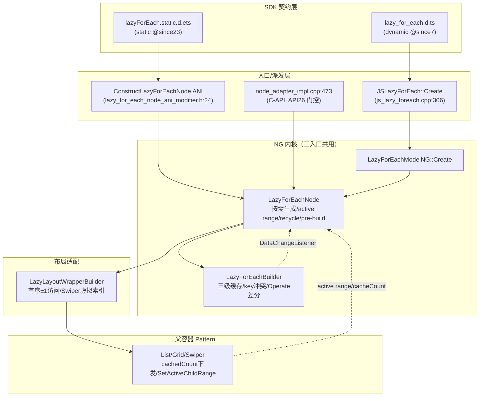
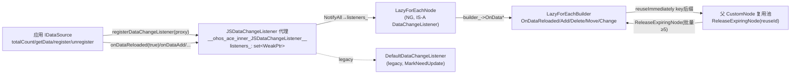
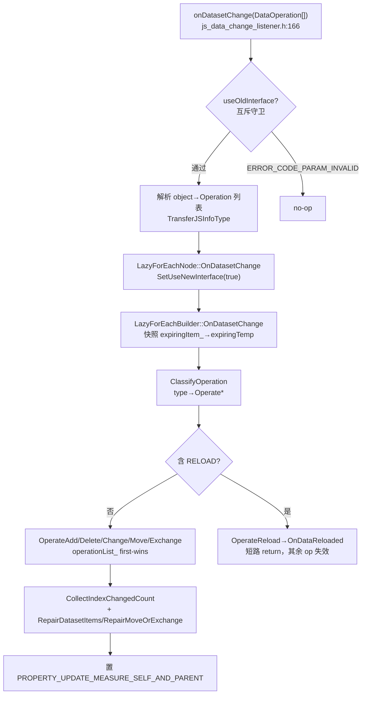
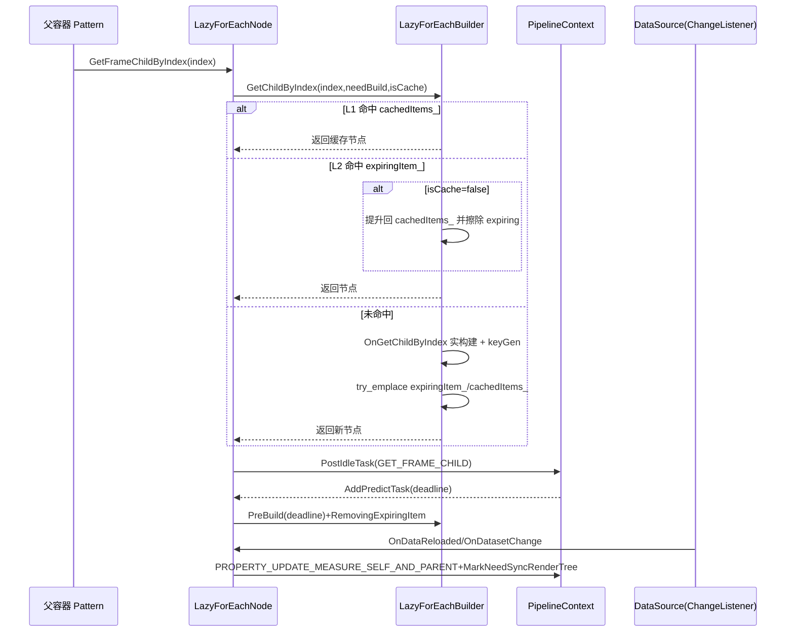

# 架构设计

> 确认目标仓和模块的架构约束、关键设计决策、Spec 拆分方向。

## 设计元数据

| Field | Content |
|-------|---------|
| Design ID | `DESIGN-Func-07-05-02` |
| 关联需求 | 已有能力补录（无独立 requirement.md） |
| 关联 Epic | 无 |
| 目标 Feature | Feat-01 LazyForEach 核心语法与按需渲染（基线）；Feat-02 数据源契约与单条变更通知（已补录）；Feat-03 批量数据集变更 onDatasetChange（已补录）；Feat-04 选项策略与内存/冻结优化（已补录）；Feat-05 拖拽排序 onMove（已补录） |
| 复杂度 | 关键 |
| 目标版本 | dynamic `@since7`/`@since12`/`@since26`；static `@since23`/`@since26`/`@since26 staticonly`；crossplatform `@since10`、atomicservice `@since11` |
| Owner | ArkUI SIG |
| 状态 | Baselined（已有实现补录） |

## 需求基线

> 需求基线详见 proposal.md。以下仅列出设计阶段需要额外强调的要点。

| 项 | 补充说明 |
|----|---------|
| 补录而非新增 | 当前实现即规格，可疑行为只能标注为风险/备注，不得在规格中提出修改 |
| 长列表性能 | LazyForEach 的核心价值是按需构建+预缓存+回收，服务于 List/Grid/Swiper 等大数据量容器 |
| key 契约是正确性关键 | 默认 key 仅按序号，重排/交换/删除场景下需应用提供内容型 keyGenerator 才能正确复用 |
| （Feat-02）数据侧契约 | IDataSource 四方法注册期不校验、调用期静默降级（不报错）；单条变更 API 弃用名与现行名别名等价、无运行时告警；`onDataReloaded(reuseImmediately)`（`@since26.1`）走 key 后缀立即回收交父 CustomNode |
| （Feat-03）批量变更 | `onDatasetChange`（`@since12`）与单条 API per-instance 互斥；同回调 RELOAD 短路使其余 op 失效；same-index first-wins 静默丢弃；越界静默无效；ADD keys>count 抛错；多 op 经 index 归一化重定位 |
| （Feat-04）选项与优化 | `LazyForEachOptions`（`@since26`）三选项默认 AUTO/BATCH/DEFAULT；releaseStrategy BATCH 同步 vs PROGRESSIVE 空闲分批；ENABLE_AUTO_CACHE_OPTIMIZATION 注册窗口/内存回调；customComponentFreezeMode 门控全局 metadata 标志 |
| （Feat-05）拖拽排序 | `.onMove`（`@since12`）是 List/Grid 直接父拖拽排序的门控与通知；framework 内部 `MoveData` 实时重排，应用 onMove 同步 dataSource；非 List/Grid 父不可用 |

## 上下文和现状

### 涉及仓和模块

| 仓库 | 补充架构说明 |
|------|-------------|
| `arkui_ace_engine` | LazyForEach 全部实现（JS 桥接/NG 语法节点/缓存差分引擎/布局适配/Arkoala 静态节点/C-API NodeAdapter）均在本仓 |
| `interface/sdk-js` | 提供 dynamic `lazy_for_each.d.ts` 与 static `lazyForEach.static.d.ets` 契约（外部 API 权威） |

> 仓、模块、当前职责、影响类型详见 proposal.md「影响范围」。本节补充设计层面的架构现状。

### 调用链层级分析

| 层 | 模块 | 职责 | 修改类型 |
|----|------|------|---------|
| 1. SDK 契约层 | `lazy_for_each.d.ts` / `lazyForEach.static.d.ets` | 声明 `LazyForEach()` 重载、`LazyForEachAttribute`、`itemGenerator`/`keyGenerator` 类型 | 不修改（外部 API 权威） |
| 2. JS 桥接层 | `frameworks/bridge/declarative_frontend/jsview/js_lazy_foreach.cpp` | `JSLazyForEach::Create` 参数解析（`ParseAndVerifyParams`）、`keyGenFunc` 构造、`ParseOptions`、管线选择（`LazyForEachModel::GetInstance`） | 现状 |
| 3. JS 执行器层 | `js_lazy_foreach_builder.h` / `js_lazy_foreach_actuator.h` | `JSLazyForEachBuilder::OnGetChildByIndex(New)` 驱动 ViewStack `PushKey`/`PopKey` 构建子树；持有 dataSource/四个 JS 函数/options | 现状（Feat-02：四方法提取/totalCount·getData 调用/监听器代理创建） |
| 4. ANI 静态入口层 | `frameworks/core/interfaces/native/ani/lazy_for_each_node_ani_modifier.h` | `ConstructLazyForEachNode`→`ArkoalaLazyNode`（static 范式独立路径，不经 ModelNG） | 现状 |
| 5. Model 工厂层 | `frameworks/core/components_ng/syntax/lazy_for_each_model_ng.h` / legacy `LazyForEachModelImpl` | `Create(actuator)`→`LazyForEachNode::GetOrCreateLazyForEachNode`；`OnMove`/`SetItemDragHandler`（Feat-05） | 现状 |
| 6. 语法节点层 | `frameworks/core/components_ng/syntax/lazy_for_each_node.cpp/.h` | 按需 `GetFrameChildByIndex`、`BuildAllChildren`、`DoSetActiveChildRange`、`RecycleItems`、`PostIdleTask`、数据变更监听 `OnData*`/`OnDatasetChange`、主题/配置更新 | 现状 |
| 7. 缓存/差分引擎层 | `frameworks/core/components_ng/syntax/lazy_for_each_builder.cpp/.h` | 三级缓存（`cachedItems_`/`expiringItem_`/build）、key 冲突检测、`Operate*` 差分、`PreBuild`/`CheckCacheIndex`、渐进释放 `RemovingExpiringItem` | 现状 |
| 8. 布局适配层 | `frameworks/core/components_ng/syntax/lazy_layout_wrapper_builder.cpp/.h` | 安装到父容器 wrapper，`OnGetOrCreateWrapperByIndex` 有序 ±1 访问、Swiper 虚拟索引、`OnExpandChildLayoutWrapper` 全量展开 | 现状 |
| 9. 父容器 Pattern 层 | List/Grid/Swiper/WaterFlow Pattern | 经 `OnSetCacheCount` 下发 cachedCount、`SetActiveChildRange` 下发活跃区间、`AdjustLayoutWrapperTree` 接管 lazy builder | 现状（跨特性；Feat-05：List/Grid 经 `ListItemDragManager` 驱动拖拽排序） |
| 10. C-API/NodeAdapter 层 | `frameworks/core/interfaces/native/node/node_adapter_impl.cpp` | `node_adapter_impl.cpp:473`→`CreateLazyForEachNode`（API26 门控自动注册监听器） | 现状 |
| 11. 数据源契约层 | `frameworks/core/components_v2/foreach/lazy_foreach_component.h` | `V2::DataChangeListener`/`V2::Operation` 监听器契约（Feat-02/03 承接） | 现状（Feat-02：单条 OnData*/`Operation.reuseImmediately`；Feat-03：`OnDatasetChange` 批量契约） |

检查项：
- [x] 调用链每一层都已覆盖（从 SDK 契约到父容器 Pattern、C-API、数据源契约）
- [x] 每层职责边界清晰，无跨层违规调用（Builder 不直接驱动渲染管线，经 Node 转发）
- [x] 每层修改类型明确（均为「现状」，存量补录）

### 适用架构规则

| Rule ID | 适用原因 | 设计结论 | 验证方式 |
|---------|---------|---------|---------|
| OH-ARCH-LAYERING | SDK→桥接→Model→Node→Builder→布局适配→父容器 Pattern 多层调用 | 调用方向自顶向下单向；Builder 经 Node 触发 `MarkNeedSyncRenderTree`/`PROPERTY_UPDATE`，不跨层直驱渲染 | 架构评审/依赖检查 |
| OH-ARCH-SUBSYSTEM | 仅本仓 + SDK 契约，无跨子系统 | 不引入子系统外依赖 | 依赖检查 |
| OH-ARCH-API-LEVEL | dynamic `@since7`、static `@since23`、options/style-builder `@since26` | Public API，无新增权限；版本差异在 d.ts `@since` 标注 | API 评审/XTS |
| OH-ARCH-COMPONENT-BUILD | 现状无 BUILD.gn/bundle.json 变更 | 无构建影响 | 构建验证 |
| OH-ARCH-ERROR-LOG | key 冲突 `Use repeat key` 告警（`ACE_LAZY_FOREACH`），不抛错误码 | 静默降级 + 告警日志 | UT/hilog |

## 不涉及项承接

> proposal.md 已完成 N/A 判定。本节仅对标记「涉及」且需展开设计的维度给出结论。

| 维度 | 设计结论 |
|------|---------|
| 跨进程/SA | 不涉及（同进程语法节点） |
| 持久化 | 不涉及（节点生命周期随父容器） |
| 权限 | 不涉及（Public API 无权限要求） |
| 国际化/RTL | 子节点布局随父容器，LazyForEach 自身不做 RTL 处理 |
| 多范式兼容 | dynamic（NG/legacy）+ static（Arkoala）双范式并存，由 `IsCurrentUseNewPipeline()`/ANI 入口分流 |

## 关键设计决策

| 决策 ID | 问题 | 推荐方案 | 探索过的替代方案 | 取舍理由 | 影响 |
|--------|------|---------|----------------|---------|------|
| ADR-1 | 默认 key 如何生成 | 省略 keyGenerator 时 key = `viewId + "-" + index`（仅按序号） | (a) 默认按内容哈希；(b) 默认按数据项对象引用 | 序号 key 零依赖、实现最简、适合纯追加场景；代价是重排/交换/删除时无法识别内容迁移，需应用提供内容型 keyGenerator | 默认场景正确，重排场景需应用侧显式 keyGenerator（风险 RISK-1） |
| ADR-2 | 用户 keyGenerator 返回值是否原样使用 | 恒注入 `viewId + "-"` 前缀，且返回非 string/number 时回退 index | (a) 原样使用用户返回；(b) 仅在冲突时加前缀 | 前缀注入保证同一 LazyForEach 实例 key 命名空间天然隔离，避免多实例间 key 碰撞；回退保证健壮性 | 用户 key 永远带实例前缀；跨实例不会碰撞 |
| ADR-3 | 同实例内 key 冲突如何处理 | `try_emplace` 失败→`Use repeat key` 告警→`ProcessOffscreenNode` 丢弃重复项，不抛异常、不中断渲染 | (a) 抛异常中断；(b) 静默覆盖 | 渲染韧性优先，避免单条坏数据导致整列表崩溃；告警便于定位 | 重复 key 项静默消失（风险 RISK-2） |
| ADR-4 | 子节点缓存模型 | 三级：`cachedItems_`（L1 活跃 map<index,child>）→`expiringItem_`（L2 离屏池 unordered_map<key,child>）→实构建；越界节点 `SetActive(false)` 入 L2 而非销毁 | (a) 单级缓存销毁离屏节点；(b) 全量保留 | L2 池支持滚动回弹时快速提升复用，降低重建开销；L2 可被内存压力渐进释放 | 内存模型：离屏节点占内存直到渐进释放（RISK-3） |
| ADR-5 | 预构建与脏标记策略 | 帧间 predict-task（`AddPredictTask`）deadline 型预构建，超时记 `preBuildingIndex_` 续建；任一数据变更统一 `PROPERTY_UPDATE_MEASURE_SELF_AND_PARENT`+`MarkNeedSyncRenderTree(true)` | (a) 同步全量预构建；(b) 仅 LAYOUT 标记 | deadline 预构建不阻塞当前帧、保流畅；MEASURE_SELF_AND_PARENT 因数据项数/尺寸可能变化，父容器须重测量 | 数据变更必然触发父容器重测量（性能成本） |
| ADR-6 | cachedCount 归属与默认值 | cachedCount 由父容器 Pattern 经 `OnSetCacheCount` 下发，LazyForEach 默认 `cacheCount_=0`；0 仍预构建可视窗口（范围 `cacheCount_-showCached`） | (a) LazyForEach 自持默认非零；(b) 0 即完全不预构建 | 缓存策略由最了解滚动行为的父容器决策；默认 0 保证最小内存，窗口内仍构建保可见性 | 父容器未设置时仅构建可见窗口 |
| ADR-7 | 多入口派发架构 | 三入口：dynamic ArkTS（`JSLazyForEach::Create`→`IsCurrentUseNewPipeline`→NG/legacy）、static Arkoala（ANI `ConstructLazyForEachNode`→`ArkoalaLazyNode`）、C-API NodeAdapter（`node_adapter_impl.cpp`→`CreateLazyForEachNode`） | 单一统一入口 | 各范式运行时与构建链不同，统一入口代价高；保持分流但共用 NG `LazyForEachNode`/`LazyForEachBuilder` 内核 | 三入口共用内核，差异在监听器注册时机（C-API 受 API26 门控，RISK-4） |
| ADR-F2-1 | IDataSource 契约校验时机 | 注册期（`SetDataSourceObj`）不校验四方法存在性/类型，缺失方法在调用期静默降级（totalCount→0/getData→空/不注册监听），不抛错误码 | (a) 注册期强校验抛错；(b) 仅日志告警 | 静默降级保渲染韧性，避免构造期抛错中断；代价是残缺 dataSource 无错误反馈，表现为空列表 | 残缺 dataSource 无错误反馈（风险 RISK-F2-1） |
| ADR-F2-2 | 单条变更弃用名处理 | 弃用名（onDataAdded/Moved/Deleted/Changed，`@since7`）与现行名（onDataAdd/Move/Delete/Change，`@since8`）在 JS 绑定层别名到同一处理器，零行为差异、无运行时弃用告警 | (a) 运行时 emit 弃用告警；(b) 移除弃用名 | 双绑定保后向兼容、零迁移成本；弃用信号仅 JSDoc `@deprecated since 8` | 应用难察觉仍在用弃用名（风险 RISK-F2-2） |
| ADR-F2-3 | reuseImmediately 立即回收机制 | `onDataReloaded(true)`（`@since26.1`）对 `expiringItem_` 全部 key 加 `__MarkedByReuseImmediately__Internal` 后缀，使 LazyForEach 级 key 匹配复用无法命中，转交父 CustomNode 池；父经 `ReleaseExpiringNode(reuseId)` 按 `MIN_RELEASE_COUNT=5` 批量释放 | (a) 直接销毁离屏节点；(b) LazyForEach 自身复用池消化 | 大规模重载场景下离屏 CustomNode 交父复用池更高效；后缀隔离保证不被 LazyForEach 错误复用 | 机制较隐晦，依赖父 CustomNode 配合释放 |
| ADR-F3-1 | 同回调 RELOAD 短路 | `OnDatasetChange` 遇 RELOAD 立即 return，同回调其余 op 全失效，框架调 keyGenerator 做 key 比较 | (a) RELOAD 仅清缓存不短路；(b) RELOAD 与其他 op 顺序叠加 | RELOAD 语义为全量重载，与增量 op 叠加无意义；短路简化语义、避免冲突 | 应用若同回调混用 RELOAD+其他 op，其他 op 静默失效（RISK 见 AC-3.1） |
| ADR-F3-2 | 同 index first-wins 静默丢弃 | 多 op 命中同 index 时 `operationList_`（map）first-wins，后续 `ThrowRepeatOperationError` 仅日志、不抛异常 | (a) 抛异常；(b) 后者覆盖前者 | 渲染韧性优先，坏 op 不中断整回调；first-wins 语义可预测 | 重复 index op 静默消失（RISK） |
| ADR-F3-3 | 多 op index 归一化 | 非 RELOAD op 全分类后 `CollectIndexChangedCount` 累积 delta（ADD+/DEL-/MOVE from-1·to+1）+回填 gap，`RepairDatasetItems` 按 `index+changedIndex` 重定位缓存/离屏节点 | (a) 每 op 即时位移；(b) 不归一化由应用保证 | 累积 delta 一次性重定位，避免多次位移的中间态错乱 | 归一化逻辑复杂，边界（Exchange 与 null 节点）需测试 |
| ADR-F4-1 | 离屏节点释放策略 | `releaseStrategy` BATCH 同步 `ProcessOffscreenNodesNotInExpiring`；PROGRESSIVE 额外 `CollectNodesForDelayedRelease`→`removingNodeList_`，由 `RemovingExpiringItem` 帧间 deadline 分批释放 | (a) 仅 BATCH；(b) 仅 PROGRESSIVE | BATCH 简单但可能卡顿；PROGRESSIVE 保流畅但释放延后 | 默认 BATCH，大列表宜 PROGRESSIVE |
| ADR-F4-2 | 内存优化回调模型 | `ENABLE_AUTO_CACHE_OPTIMIZATION` 在节点创建注册窗口/内存回调：hide 同步清、show 延迟恢复、LOW/CRITICAL 异步清；2s 防抖 + maxCacheCount=2 | (a) 全量激进回收；(b) 不回收 | 仅在启用时注册回调，避免默认开销；防抖避免抖动 | 回收依赖系统内存等级与窗口可见性事件 |
| ADR-F4-3 | 冻结模式门控全局标志 | `customComponentFreezeMode` 实例选项**门控而非替换**进程全局 metadata 标志：AUTO 用全局、DISABLED/ENABLED 硬覆盖；SetJSViewActive(false) 无条件 | (a) 实例选项替换全局；(b) 无实例覆盖 | 保留 metadata 全局默认，允许实例按需覆盖离屏冻结 | enableRepeatAnimation 仅全局、不暴露（RISK-F4-2） |
| ADR-F5-1 | onMove 拖拽门控 | `.onMove` 既是门控（onMoveEvent_ 非空才挂 `ListItemDragManager`）又是落下通知；仅 List/Grid 直接父生效 | (a) 单独开关 API；(b) 任意父容器 | onMove 二合一简化 API；父容器限制因拖拽由 List/Grid Pattern 驱动 | 非 List/Grid 父不可用（RISK-F5-1） |
| ADR-F5-2 | 拖拽重排分工 | framework 内部 `MoveData`→`OnDataMoveToNewPlace` 实时重排缓存做交换动画；应用 `onMove(from,to)` 同步 IDataSource | (a) framework 全权重排含数据；(b) 应用全权 | 视觉实时反馈由 framework 保证，数据一致性由应用保证 | 应用未同步 dataSource 则 totalCount/getData 与视图不一致（RISK-F5-2） |

## 设计骨架

### 骨架范围

| 骨架项 | 目标 | 不包含 | 验证方式 |
|--------|------|--------|---------|
| 构造与多入口派发 | 固化 `LazyForEach()` 重载、NG/legacy/Arkoala/C-API 派发 | options 选项语义（Feat-04）、onMove（Feat-05） | UT `lazy_for_each_model_test_ng` |
| 按需生成与三级缓存 | 固化 `GetFrameChildByIndex`/`GetChildByIndex`/`BuildAllChildren` 与缓存命中 | 差分 Operate 语义（Feat-02/03） | UT `lazy_for_each_builder_syntax_test_ng` |
| key 契约 | 固化默认 key/前缀注入/冲突丢弃 | — | UT `lazy_for_each_builder_syntax_test_ng(_advanced)` |
| 虚拟滚动引擎 | 固化 cachedCount/active range/recycle/idle pre-build | 内存优化策略细节（Feat-04） | UT `lazy_for_each_syntax_test_ng(_2)` + benchmark |

### 骨架 Spec 拆分

| Task ID | 目标 | 受影响文件 | AC |
|---------|------|----------|-----|
| TASK-SKELETON-1 | Feat-01 构造与派发基线 | `js_lazy_foreach.cpp`、`lazy_for_each_model_ng.h`、`lazy_for_each_node_ani_modifier.h` | AC-1.1~1.9 |
| TASK-SKELETON-2 | Feat-01 按需生成与缓存基线 | `lazy_for_each_node.cpp`、`lazy_for_each_builder.cpp` | AC-2.1~2.7、AC-4.1~4.9 |
| TASK-SKELETON-3 | Feat-01 key 契约基线 | `js_lazy_foreach.cpp`、`lazy_for_each_builder.cpp` | AC-3.1~3.6 |

## 后续 Task 拆分

| Task ID | 目标 | 受影响文件 | 依赖 |
|---------|------|----------|------|
| T-1 | Feat-01 LazyForEach 核心语法与按需渲染（基线，本设计已承接） | `Feat-01-*-spec.md` + 本 design.md | — |
| T-2 | Feat-02 数据源契约与单条变更通知（已补录） | `js_lazy_foreach_actuator.h`、`js_data_change_listener.h`、`lazy_foreach_component.h`、`lazy_for_each_node.cpp`（OnData*） | T-1 |
| T-3 | Feat-03 批量数据集变更 onDatasetChange（已补录） | `lazy_for_each_node.cpp`（OnDatasetChange/ParseOperations）、`lazy_for_each_builder.cpp`（Operate*） | T-2 |
| T-4 | Feat-04 选项策略与内存/冻结优化（已补录） | `js_lazy_foreach.cpp`（ParseOptions）、`lazy_for_each_node.cpp`（CleanCache/RestoreCache/MemoryLevel）、`lazy_for_each_utils.h` | T-1 |
| T-5 | Feat-05 拖拽排序 onMove（已补录） | `lazy_for_each_model_ng.h`（OnMove/SetItemDragHandler）、`lazy_for_each_node.cpp`（MoveData/InitDragManager）、`list_item_drag_manager.cpp` | T-1 |

## API 签名、Kit 与权限

> 本节承接 spec.md「API 变更分析」中识别的 API，给出签名、权限和 d.ts 位置等实现细节。

### 新增 API

无新增。本特性覆盖既有 API（存量补录）。

### 变更/废弃 API

| 原有 API | 变更类型 | 新 API | 迁移说明 |
|---------|---------|--------|---------|
| `LazyForEach(dataSource,itemGenerator,keyGenerator?)`（dynamic） | 既有 | — | `@since12` 起返回 `LazyForEachAttribute`（原 `LazyForEachInterface`） |
| `LazyForEach(...,options?)` | 既有版本扩展 | — | options 语义见 Feat-04 |
| `LazyForEach(style)`（static） | 既有版本扩展（`@since26 staticonly`） | — | dynamic 无对应形态 |
| `IDataSource.{totalCount,getData,registerDataChangeListener,unregisterDataChangeListener}`（dynamic `@since7`/static `@since23`） | 既有 | — | 数据供给契约；缺方法静默降级（Feat-02） |
| `DataChangeListener.onDataAdd/onDataMove/onDataDelete/onDataChange`（dynamic `@since8`/static `@since23`） | 既有 | — | 现行单条名；static 无弃用形式 |
| `DataChangeListener.onDataAdded/onDataMoved/onDataDeleted/onDataChanged`（dynamic `@since7`） | 废弃（`@since8` 弃用） | onDataAdd/onDataMove/onDataDelete/onDataChange | 别名等价、无运行时弃用告警（Feat-02） |
| `DataChangeListener.onDataReloaded(reuseImmediately: boolean)`（dynamic `@since26.1`） | 既有版本扩展 | — | true 触发 key 后缀立即回收交父 CustomNode（Feat-02） |
| `DataChangeListener.onDatasetChange(dataOperations: DataOperation[])`（dynamic `@since12`/static `@since23`） | 既有 | — | 批量变更入口，stage-model-only，与单条 API per-instance 互斥（Feat-03） |
| `DataOperationType`（ADD/DELETE/EXCHANGE/MOVE/CHANGE/RELOAD）+ `DataAddOperation`/`DataDeleteOperation`/`DataChangeOperation`/`DataMoveOperation`/`DataExchangeOperation`/`DataReloadOperation` + `MoveIndex`/`ExchangeIndex`/`ExchangeKey` + `DataOperation` 联合（dynamic `@since12`/static `@since23`） | 既有 | — | 六 op 类型与结构（Feat-03） |
| `DataReloadOperation.reuseImmediately`（dynamic `@since26.1`） | 既有版本扩展 | — | RELOAD op 立即回收，**static `DataReloadOperation` 无此字段**（Feat-03） |
| `LazyForEach(...,options?: LazyForEachOptions)` + `LazyForEachOptions` + `LazyForEachReleaseStrategy`/`LazyForEachCustomComponentFreezeMode`/`LazyForEachMemOptStrategy`（dynamic/static `@since26`） | 既有版本扩展 | — | options 第四参与三枚举（Feat-04） |
| `LazyForEachAttribute.setLazyForEachOptions(...,options?)`（static `@since26 staticonly`） | 既有 | — | static 范式选项设置，dynamic 无（Feat-04） |
| `LazyForEachAttribute.onMove(callback,handlers?)` 链式属性（`@since12`） | 既有 | — | List/Grid 拖拽排序门控+通知（Feat-05） |

> d.ts 位置：dynamic `interface/sdk-js/api/@internal/component/ets/lazy_for_each.d.ts:1015,1035`；static `interface/sdk-js/api/arkui/component/lazyForEach.static.d.ets:768,787,804`。Kit：ArkUI；权限：无；SysCap：`SystemCapability.ArkUI.ArkUI.Full`。

## 构建系统影响

### BUILD.gn 变更

无变更（存量补录）。LazyForEach 源文件已纳入 `frameworks/core/components_ng/syntax/` 与 `frameworks/bridge/declarative_frontend/jsview/` 现有构建目标。

### bundle.json 变更

无变更。

## 可选设计扩展

### 架构图



#### 数据源与变更通知架构图（Feat-02）



#### onDatasetChange 批量变更架构图（Feat-03）



### 数据流/控制流

| 步骤 | 调用方 | 被调用方 | 数据/接口 | 说明 |
|------|--------|---------|----------|------|
| 1 | 父容器 Pattern | LazyForEachNode | `GetFrameChildByIndex(index,needBuild,isCache)` | 按 index 请求子节点 |
| 2 | LazyForEachNode | LazyForEachBuilder | `GetChildByIndex(index,needBuild,isCache)` | bounds check 后派发 |
| 3 | LazyForEachBuilder | 三级缓存 | `cachedItems_`→`expiringItem_`→`OnGetChildByIndex` | 命中即返回，未命中实构建 |
| 4 | LazyForEachBuilder | JSLazyForEachBuilder | `OnGetChildByIndex(New)` | ViewStack `PushKey`/`PopKey` 构建子树 |
| 5 | 父容器 Pattern | LazyForEachNode | `DoSetActiveChildRange` | 下发活跃区间+缓存区 |
| 6 | LazyForEachNode | LazyForEachBuilder | `SetActiveChildRange` | 越界节点入 `expiringItem_` |
| 7 | PipelineContext | LazyForEachNode | `AddPredictTask`(deadline) | 帧间预构建 `PreBuild`+`RemovingExpiringItem` |
| 8 | dataSource | DataChangeListener | `OnData*`/`OnDatasetChange` | 数据变更通知（Feat-02/03） |
| 9 | LazyForEachNode | PipelineContext | `PROPERTY_UPDATE_MEASURE_SELF_AND_PARENT`+`MarkNeedSyncRenderTree` | 触发自+父重测量与渲染树重同步 |

### 时序设计



### 数据模型设计

**API 层（TypeScript，SDK 契约）**

```typescript
interface IDataSource<T> { totalCount(): number; getData(index: number): T;
  registerDataChangeListener(listener: DataChangeListener): void;
  unregisterDataChangeListener(listener: DataChangeListener): void; }
type ItemGeneratorFunc<T> = (item: T, index: number) => void;
type KeyGeneratorFunc<T> = (item: T, index: number) => string;
interface LazyForEachAttribute extends DynamicNode { /* @since26 staticonly methods */ }
```

**Framework 层（C++）**

```cpp
// lazy_for_each_builder.h:346-388
std::map<int32_t, LazyForEachCacheChild> cachedItems_;        // L1 活跃（index→child）
std::unordered_map<std::string, LazyForEachCacheChild> expiringItem_; // L2 离屏池（key→child）
int32_t cacheCount_ = 0;            // 父容器下发，默认 0
int32_t startIndex_ / endIndex_;    // 活跃窗口
int32_t preBuildingIndex_ = -1;     // 预构建续建点
int32_t startShowCached_ / endShowCached_; // 可视缓存计数
```

| 结构 | 存储方案 | 生命周期 |
|------|---------|---------|
| `cachedItems_` | 进程内 map | 随 active range 滚动 |
| `expiringItem_` | 进程内 unordered_map | 渐进释放/内存压力回收（Feat-04） |
| 生成的子节点（RefPtr） | builder 持有，node tree 挂载时附加 | 出树入 L2，最终释放 |

#### 监听器与 Operation 数据模型（Feat-02）

**API 层（TypeScript，SDK 契约）**

```typescript
interface IDataSource { totalCount(): number; getData(index: number): any;
  registerDataChangeListener(listener: DataChangeListener): void;
  unregisterDataChangeListener(listener: DataChangeListener): void; }
interface DataChangeListener {
  onDataReloaded(): void; onDataReloaded(reuseImmediately: boolean): void; // @since26.1
  onDataAdd(index): void; onDataMove(from,to): void; onDataDelete(index): void; onDataChange(index): void;
  onDatasetChange(ops: DataOperation[]): void; // @since12，与单条互斥
}
```

**Framework 层（C++）**

```cpp
// frameworks/core/components_v2/foreach/lazy_foreach_component.h:26-40
struct Operation { std::string type; int32_t count; int32_t index;
  std::pair<int32_t,int32_t> coupleIndex; std::string key;
  std::pair<std::string,std::string> coupleKey; std::list<std::string> keyList;
  bool reuseImmediately = false; };                 // reuseImmediately 默认 false
class DataChangeListener { virtual void OnDataReloaded(bool reuseImmediately = false) = 0; ... };

// frameworks/bridge/declarative_frontend/jsview/js_data_change_listener.h
std::set<WeakPtr<V2::DataChangeListener>> listeners_;  // 多监听器（实践中每 builder 一个）
bool useOldInterface = false; bool useNewInterface = false; // 粘性互斥守卫
```

| 结构 | 存储方案 | 生命周期 |
|------|---------|---------|
| `listeners_` | `JSDataChangeListener` 代理内 set | 代理随 dataSource 引用；节点销毁解注册 |
| `Operation.reuseImmediately` | 临时 payload | 单次通知用 |
| 后缀化 key（`__MarkedByReuseImmediately__Internal`） | `expiringItem_` 临时键 | 预构建完成/释放后消失 |

#### DataOperation 与 OperationInfo 数据模型（Feat-03）

**API 层（TypeScript，SDK 契约）**

```typescript
enum DataOperationType { ADD='add', DELETE='delete', EXCHANGE='exchange', MOVE='move', CHANGE='change', RELOAD='reload' }
interface DataAddOperation { type: ADD; index: number; count?: number; key?: string | string[]; }
interface DataDeleteOperation { type: DELETE; index: number; count?: number; }
interface DataChangeOperation { type: CHANGE; index: number; key?: string; }
interface MoveIndex { from: number; to: number; } interface ExchangeIndex { start: number; end: number; } interface ExchangeKey { start: string; end: string; }
interface DataMoveOperation { type: MOVE; index: MoveIndex; key?: string; }
interface DataExchangeOperation { type: EXCHANGE; index: ExchangeIndex; key?: ExchangeKey; }
interface DataReloadOperation { type: RELOAD; reuseImmediately?: boolean; } // reuseImmediately dynamic @since26.1，static 无
type DataOperation = DataAddOperation | DataDeleteOperation | DataChangeOperation | DataMoveOperation | DataExchangeOperation | DataReloadOperation;
```

**Framework 层（C++）**

```cpp
// frameworks/core/components_v2/foreach/lazy_foreach_component.h:26-35
struct Operation { std::string type; int32_t count; int32_t index;
  std::pair<int32_t,int32_t> coupleIndex; std::string key;
  std::pair<std::string,std::string> coupleKey; std::list<std::string> keyList; bool reuseImmediately = false; };
// frameworks/core/components_ng/syntax/lazy_for_each_builder.h:57-68,354
struct OperationInfo { int32_t changeCount=0; int32_t fromDiffTo=0; std::string key; RefPtr<UINode> node;
  bool isDeleting=false; bool isChanged=false; bool moveIn=false; bool isExchange=false; std::vector<std::string> extraKey; };
std::map<int32_t, OperationInfo> operationList_;   // 同 index first-wins
```

| 结构 | 存储方案 | 生命周期 |
|------|---------|---------|
| `Operation` 列表 | 单次 `onDatasetChange` 临时 list | 回调内消费 |
| `operationList_` | builder 内 map | 回调末尾 `clear()` |
| `indexChangedMap` | `CollectIndexChangedCount` 临时 map | `RepairDatasetItems` 消费 |

### 测试性设计

| 测试层级 | 测试目标 | Mock 策略 | 验证方式 |
|---------|---------|----------|---------|
| UT | 构造/参数校验/派发 | 直接调用 `LazyForEachModelNG::Create` | `lazy_for_each_model_test_ng` |
| UT | 三级缓存/key 契约/active range/pre-build | `mock_lazy_foreach_actuator.h`/`mock_lazy_foreach_builder.h` 注入 | `lazy_for_each_builder_syntax_test_ng(_2/_advanced)` |
| UT | Node 行为（recycle/idle/数据变更标记） | Mock builder | `lazy_for_each_syntax_test_ng(_2)`、`lazy_for_each_utils_test_ng` |
| Benchmark | 长列表滚动帧率/内存 | 真实 dataSource | `test/benchmark` |
| XTS | dynamic/static 双范式端到端 | — | `test/xts` |

### 资源所有权矩阵

| 资源 | 创建方 | 持有方 | 销毁触发 | 实际释放 | 异常回收 |
|------|--------|--------|---------|---------|---------|
| 子节点 RefPtr | LazyForEachBuilder（`OnGetChildByIndex`） | `cachedItems_`/`expiringItem_` | 出 active range | 渐进释放 `RemovingExpiringItem`/内存压力 | key 冲突项 `ProcessOffscreenNode` 立即释放 |
| LazyForEachNode | `GetOrCreateLazyForEachNode`/`CreateLazyForEachNode` | ElementRegister + 父容器子树 | 父容器销毁 | 随父容器 | — |
| DataChangeListener 注册 | Node `RegisterBuilderListener` | builder 监听器列表 | Node 销毁 | 自动解注册 | — |

### 接口参数规约

| 接口 | 参数 | 类型 | 合法范围 | 非法处理 | 边界说明 |
|------|------|------|---------|---------|---------|
| `LazyForEach` | dataSource | IDataSource | 实现四方法的 object | 非 object：`ParseAndVerifyParams` 拦截不构造 | 契约详见 Feat-02 |
| `LazyForEach` | itemGenerator | (item,index)=>void | function | 非 function：拦截不构造 | 回调内构建子树 |
| `LazyForEach` | keyGenerator | (item,index)=>string | function/undefined | undefined→默认 `viewId-index`；返回非 string/number→回退 index | 重复 key 静默丢弃 |
| `LazyForEach` | options | LazyForEachOptions | object（`@since26`）/undefined | undefined→默认选项 | 详见 Feat-04 |

### 线程与并发模型

| 操作 | 发起线程 | 回调线程 | 跨进程边界 | 线程安全 | 重入约束 |
|------|---------|---------|----------|---------|---------|
| 子节点构建 | UI/Pipeline | 同 | 无 | 单线程 UI | 不可在 itemGenerator 内同步触发数据变更 |
| 数据变更通知 | dataSource（业务） | UI（经 `MarkNeedSyncRenderTree` 调度） | 无 | 跨线程须切 UI 线程 | — |
| predict-task 预构建 | Pipeline | UI | 无 | 单线程 | deadline 内可中断续建 |

## 详细设计

### 构造与多入口派发

`JSLazyForEach::Create`（`js_lazy_foreach.cpp:306-365`）执行：`ParseAndVerifyParams`（:309）类型校验→`ProcessViewId`（:317）→构造 `keyGenFunc`（:333-342）→构建 actuator（:348）→`ParseOptions`+`SetOptions`（:355-356）→`LazyForEachModel::GetInstance()->Create(actuator)`（:364）。`keyGenFunc` 构造逻辑：

```
if keyGenerator isUndefined:
    return viewId + "-" + index                       // 默认序号 key
else if keyGenerator isFunction:
    userKey = keyGenerator(item, index)
    suffix = (userKey isString || isNumber) ? userKey.ToString() : to_string(index)
    return viewId + "-" + suffix                       // 恒加前缀，非 string/number 回退 index
```

`LazyForEachModel::GetInstance()`（:45-59）经 `Container::IsCurrentUseNewPipeline()` 返回 NG `LazyForEachModelNG` 或 legacy `LazyForEachModelImpl`。NG `Create`（`lazy_for_each_model_ng.h:54-66`）→`LazyForEachNode::GetOrCreateLazyForEachNode`（`lazy_for_each_node.cpp:37-60`，line 52 无条件 `RegisterBuilderListener`）。Arkoala 静态路径独立：`ConstructLazyForEachNode`（`lazy_for_each_node_ani_modifier.h:24-31`）→`ArkoalaLazyNode`（`arkoala_lazy_node.cpp:25-26`，按 `isRepeat` 选 `JS_LAZY_FOR_EACH_ETS_TAG`/`JS_REPEAT_ETS_TAG`）。C-API 路径 `node_adapter_impl.cpp:473`→`CreateLazyForEachNode`（`lazy_for_each_node.cpp:86-96`），API≥26 时自动 `RegisterBuilderListener`。

### 按需子节点生成与三级缓存

`GetFrameChildByIndex`（`lazy_for_each_node.cpp:421-474`）：bounds check `index >= FrameCount()`→nullptr（:427）→`builder_->GetChildByIndex`（:431）→`isCache` 分支处理 offscreen/active（:434-473）→`PostIdleTask(GET_FRAME_CHILD)`（:468）。`GetChildByIndex`（`lazy_for_each_builder.cpp:25-64`）三级查找：

```
1. cachedItems_.find(index) 命中且有节点 → 返回
2. expiringItem_.find(key) 命中：
   - isCache=false → 提升回 cachedItems_，擦除 expiring，返回
   - isCache=true  → 返回副本不提升
3. needBuild → OnGetChildByIndex(New) 实构建；
   isCache=true → 节点入 expiringItem_，cachedItems_ 存 key+null 占位
   isCache=false → 节点直接入 cachedItems_
```

`BuildAllChildren`（:116-130）对 `[0,FrameCount)` 全量 `GetFrameChildByIndex` 后回填 `children_`，用于非滚动容器枚举（调用方 `frame_node.cpp:357-364`）。

### key 契约与冲突处理

key 生成见「构造与多入口派发」。冲突检测在 `expiringItem_`/cache 的 `try_emplace` 失败处（`lazy_for_each_builder.cpp:919-923` `RemoveAllChild`、:947-951 `SetActiveChildRange`、:1008-1022 `CacheItem`）：插入失败→`TAG_LOGW(ACE_LAZY_FOREACH, "Use repeat key for index: %d")`→`ProcessOffscreenNode(tempNode, true)` 丢弃，不抛异常。`:56` `GetChildByIndex` 实构建路径直接 `emplace` 不做冲突检查。

### 虚拟滚动引擎（cachedCount/active range/recycle/idle pre-build）

- **cachedCount**：父容器经 `ForEachBaseNode::OnSetCacheCount`（`lazy_for_each_node.h:133-139`）→`builder_->SetCacheCount`；默认 `cacheCount_=0`（`lazy_for_each_builder.h:367`）。预构建范围 `CheckCacheIndex`（`lazy_for_each_builder.cpp:1031-1072`）：前向 `cacheCount_-endShowCached_`、后向 `cacheCount_-startShowCached_`；内存压力 `ReduceCacheCount` 上限 `maxCacheCount=2`（:1467-1474）。
- **active range**：`DoSetActiveChildRange`（`lazy_for_each_node.cpp:519-548`）→`SetActiveChildRange`（`lazy_for_each_builder.cpp:927-977`）：越界节点 `SetActive(false)`+移入 `expiringItem_`（:947），重复 key 越界项 `ProcessOffscreenNode(true)`；活跃区 null 占位从 `expiringItem_` 提升回（:963-974）。
- **recycle**：`RecycleItems`（`:490-503`）/`DoRemoveChildInRenderTree`（`:505-517`）→`PostIdleTask(RECYCLE_ITEMS)`→`RecycleItemsOutOfBoundary`→`RecycleChildByIndex`（`:770-787`）回收 `RecycleDummyNode` 占位；`RemoveAllChild`（`:907-925`）全部入 `expiringItem_`。
- **idle pre-build**：`PostIdleTask`（`:132-171`）以 `AddPredictTask` 注册帧间 deadline 任务→`builder_->PreBuild(deadline,...)`（:153）+`RemovingExpiringItem(deadline)`（:164）；`PreBuildByIndex`（`:1074-1118`）顶部 deadline 校验，超时记 `preBuildingIndex_`，`ProcessPreBuildingIndex`（`:1362-1372`）续建。
- **脏标记**：所有 `OnData*`/`OnDatasetChange`/`MoveData`/`TryTriggleAdditionalLayout` 统一 `PROPERTY_UPDATE_MEASURE_SELF_AND_PARENT`+前置 `MarkNeedSyncRenderTree(true)`（`:193,210,227,260,290,306,337,353,369,411,592,697`）。
- **布局适配**：`AdjustLayoutWrapperTree`（`:104-114`）把 `LazyLayoutWrapperBuilder` 装到父容器 wrapper；`OnGetOrCreateWrapperByIndexLegacy`（`lazy_layout_wrapper_builder.cpp:94-139`）强制 ±1 有序步进，越序返回 nullptr+LOGE；Swiper 走虚拟索引（:52-59）。

### IDataSource 契约与静默降级（Feat-02）

`SetDataSourceObj`（`js_lazy_foreach_actuator.h:157-164`）经 `GetFunctionFromObject`（`:195-202`）提取 `totalCount`/`getData`/`registerDataChangeListener`/`unregisterDataChangeListener` 四方法——**注册期不校验存在性/类型**，缺失返回空 `JSRef`（无 throw/无 log/无错误码）。调用期各站点 `IsEmpty()` 守卫静默降级：缺 `totalCount`→`GetTotalIndexCount` 返回 0（`:85-87`）；缺 `getData`→`OnGetChildByIndex(New)` 返回空 info（`js_lazy_foreach_builder.h:138-140,195-197`）；缺 register/unregister→`RegisterListener`/析构直接 return（`js_lazy_foreach_actuator.h:112-114,74`）。框架确实调用 `totalCount()`（`:90`，结果作 `FrameCount()` bounds check）与 `getData(index)`（`js_lazy_foreach_builder.h:143,200`）。

### 监听器注册生命周期（Feat-02）

NG 路径：`LazyForEachNode` 继承 `V2::DataChangeListener`（`lazy_for_each_node.h:45`），`RegisterBuilderListener`（`:173-179`，`isRegisterListener_` 防重）调 `builder_->RegisterDataChangeListener(Claim(this))`。ArkTS 路径 `GetOrCreateLazyForEachNode`（`lazy_for_each_node.cpp:37-60`，line 52）**无条件**注册；C-API NodeAdapter 路径 `CreateLazyForEachNode`（`:86-96`，唯一调用方 `node_adapter_impl.cpp:473`）**仅 API≥26** 注册。解注册在 `OnDelete`（`:62-70`）/析构（`:72-84`）。首次 `registerDataChangeListener` 时创建内部类 `__ohos_ace_inner_JSDataChangeListener__` 代理（`js_lazy_foreach.cpp:66`、`js_lazy_foreach_actuator.h:116-127`），`AddListener` 入 `listeners_`（`js_data_change_listener.h:36-44,370`）后回调应用。legacy 路径用 `DefaultDataChangeListener`（`js_lazy_foreach_component.h:30-89`，仅 `MarkNeedUpdate`），于 `ExpandChildren`（`:179-187`）创建。

### 单条变更通知派发（Feat-02）

`JSDataChangeListener::JSBind`（`js_lazy_foreach.cpp:64-91`）同时绑定弃用名（onDataAdded/Moved/Deleted/Changed，`@since7`）与现行名（onDataAdd/Move/Delete/Change，`@since8`），**别名到同一处理器**，零行为差异、无运行时弃用告警。每个 handler 置 `useOldInterface=true`，经粘性守卫 `UseAnotherInterface(useNewInterface)`（`js_data_change_listener.h:316-324`）与 `onDatasetChange` 互斥（混用抛 `ERROR_CODE_PARAM_INVALID`「onDatasetChange cannot be used with other interface」并 no-op，**仅约束 JS 桥接**），再 `NotifyAll`（`:326-368`）派发到 `listeners_`。Node 侧 `OnDataReloaded`（`:173-194`）/`OnDataAdded`（`:196-211`）/`OnDataDeleted`（`:230-261`）/`OnDataChanged`（`:293-307`）/`OnDataMoved`（`:356-370`）置 `builder_->SetUseNewInterface(false)`，调对应 builder op，收尾 `MarkNeedSyncRenderTree(true)`（受 `needMarkParent_` 门控，`:414-419`）+`MarkNeedFrameFlushDirty(PROPERTY_UPDATE_MEASURE_SELF_AND_PARENT)`。负 index 经 `ConvertFromJSCallbackInfo` clamp 到 0（`:62-75`）。

### reuseImmediately 立即回收（Feat-02）

`onDataReloaded(reuseImmediately)`（`@since26.1`）JS 布尔→`Operation.reuseImmediately`/`OnDataReloaded(bool)`（`lazy_foreach_component.h:34,40`）→`LazyForEachBuilder::OnDataReloaded(bool)`（`lazy_for_each_builder.cpp:66-98`）。`false` 时 `CHECK_EQUAL_VOID` 提前 return（`:81`，普通重载）；`true` 时：`TryRecordRecyclableNodeRecursively`（`:84-88,1597-1613`）按 CustomNode reuseId 记 `recyclableNodeSet_`，给 `expiringItem_` **全部 key 追加 `__MarkedByReuseImmediately__Internal` 后缀**（`:91-95`）使 LazyForEach 级复用无法命中，`EnableParentCustomNodeReleaseExpiringNode(reuseIds)`（`:96-97`、`lazy_for_each_node.cpp:1051-1058`）注册父 CustomNode 为释放方。父经 `LazyForEachNode::ReleaseExpiringNode`（`:1070-1073`）转发 `builder_->ReleaseExpiringNode(reuseId)`（`:1533-1575`），按 key 累计释放至 `releasedCount>=MIN_RELEASE_COUNT=5` 或桶空，每节点 `NotifyDataDeleted`+`ProcessOffscreenNode(true)`+`NotifyItemDeleted`+detach+erase。预构建完成 `DisableParentCustomNodeReleaseExpiringNode()`（`:161`）关闭授权。

### onDatasetChange 批量变更派发与修复（Feat-03）

`JSDataChangeListener::OnDatasetChange`（`js_data_change_listener.h:166-188`）置 `useNewInterface=true`，经粘性守卫 `UseAnotherInterface(useOldInterface)` 与单条 API 互斥（双向、per-instance、跨实例独立，`:168-171,316-324`），校验入参为单数组（否则静默 no-op，`:173-175`），遍历仅 object 元素经 `TransferJSInfoType` 转 `Operation` 列表（非 object 跳过，`:179`）；ADD keys>count 置 `allocateMoreKeys` 末尾抛 `ERROR_CODE_PARAM_INVALID`（`:184-187`）；`NotifyAll`（`:336-351`）派发。Node `OnDatasetChange`（`lazy_for_each_node.cpp:372-412`）置 `builder_->SetUseNewInterface(true)`，调 `builder_->OnDatasetChange`（`:379`），消失节点 `AddDisappearingChild`/`DetachFromMainTree`+`ProcessOffscreenNode(true)`+`NotifyItemDeleted`（`:382-390`），`ParseOperations`（`:799-835`）仅发 `END_CHANGE_POSITION` 通知（不改子节点），收尾 `MarkNeedSyncRenderTree(true)`+`PROPERTY_UPDATE_MEASURE_SELF_AND_PARENT`（`:410-411`）。

Builder `OnDatasetChange`（`lazy_for_each_builder.cpp:405-439`）快照 `expiringItem_`→`expiringTemp`，循环 `ClassifyOperation`（`:529-553`）按 `operationTypeMap[type]` 派发 `OperateAdd/Delete/Change/Move/Exchange`（`:571-741`）；遇 RELOAD `OperateReload(expiringTemp, operation.reuseImmediately)`（`:549,756-763`）`return true` **短路**，同回调其余 op 失效（`:424-427`）。同 index first-wins：每个 `Operate*` 查 `operationList_.find(index)`，命中则 `ThrowRepeatOperationError`（`:765-768`，仅 `TAG_LOGE` 静默丢弃，不抛异常）；DELETE 批量占用 `index..index+count-1` 各自检查（`:606-614`），MOVE/EXCHANGE 两端各自 first-wins（`:658-689,701-740`）。越界 `ValidateIndex`（`:555-569`）：ADD 允许 `index==totalCount`，其余要求 `0<=index<totalCount`，越界 op 错误日志+跳过。

归一化：`CollectIndexChangedCount`（`:514-527`）按 ADD +count/DEL -count/MOVE from -1·to +1 累积 `changeCount` 并回填 gap 构造 `indexChangedMap`；`RepairDatasetItems`（`:441-486`）对缓存/离屏节点按 `index+changedIndex` 重定位，`isDeleting` 入 nodeList、`isChanged` 置 null 重建、`extraKey` 插新 key 槽、`moveIn|isExchange` 走 `RepairMoveOrExchange`（`:488-512`，按 `fromDiffTo` 决定位移、Exchange 与 null 节点交换则既有子删除）。RELOAD `reuseImmediately`（dynamic `@since26.1`）经 `TransferReuseImmediately`（`js_data_change_listener.h:223-225,306-314`）→`OperateReload`→`OnDataReloaded(reuseImmediately)`（`:762`）走 Feat-02 后缀机制；static `DataReloadOperation`（`lazyForEach.static.d.ets:518-528`）无 `reuseImmediately` 字段。

### 选项策略与内存/冻结优化（Feat-04）

`ParseOptions`（`js_lazy_foreach.cpp:258-277`）读 `customComponentFreezeMode`/`releaseStrategy`/`memoryOptimizationStrategy` 三属性，经 `ParseLazyForEach*Strategy`（`:177-256`，接受 number/string 双形式，无法识别回退默认）解析，`actuator->SetOptions`（`:355-356`）；非 object 返回默认 AUTO/BATCH/DEFAULT。`JSLazyForEachBuilder` 三个 getter（`js_lazy_foreach_builder.h:237-250`）static_cast 桥接 options 字段到 NG 枚举。

- **releaseStrategy**：`PreBuild`（`lazy_for_each_builder.cpp:812-815,829-832`）末尾 `ProcessOffscreenNodesNotInExpiring`（BATCH 同步 detach）；PROGRESSIVE 额外 `CollectNodesForDelayedRelease`（`:853-861`）入 `removingNodeList_`，由 `RemovingExpiringItem`（`:1282-1302`）帧间按 deadline 分批（测每节点耗时，`deadline-endTimeStamp>averageTime` 续释），未完则 `PostIdleTask(RELEASE_NODE)` 重投（`lazy_for_each_node.cpp:164-167`）。
- **memoryOptimizationStrategy**：ENABLE_AUTO_CACHE_OPTIMIZATION 在 `GetOrCreateLazyForEachNode`（`:54-58`）注册 `WindowStateChangedCallback`+`MemoryLevelChangedCallback`+`PostMemOptTask`，析构对称解注册（`:72-77`）；DEFAULT 不注册。`OnWindowHide`→`CleanCache(true)` 同步（`:855-858`）；`OnWindowShow`→`ScheduleRestoreCacheTask` 延迟（`:849-853`）；`OnNotifyMemoryLevel` 仅 LOW(1)/CRITICAL(2) 触发 `CleanCache(false)` 异步（`:860-865`）。`TryExecuteScheduledCacheTask`（`:924-940`）须等 `CACHE_TASK_DELAY_TIME=2s`（`:30`）防抖，clean 另要求无近期 active range 变化、restore 另要求父可见。`CleanCache` 置 `reduceCache_=true`，`CheckCacheIndex` 经 `ReduceCacheCount` 把缓存范围压到 `maxCacheCount=2`（`:1467-1474`）；`RestoreCache` 置 `reduceCache_=false`（`:1462-1465`）。`PostMemOptTask`（`:986-1013`）每 1000ms poll pipeline onShow 与父可见性。
- **customComponentFreezeMode**：`GetFrameChildByIndex`（`:421-450`）缓存离屏节点无条件 `SetJSViewActive(false,...)`（`:437,439`）；冻结 `isFreeze` 取全局 `LazyForEachUtils::GetEnableCustomComponentFreeze()`（`:441-447`），DISABLED 强制 false、ENABLED 强制 true、AUTO 用全局。全局标志由 app metadata `enableCustomComponentFreeze=="true"` 设置（`ui_content_impl.cpp:2266-2270`）；`enableRepeatAnimation_` 仅全局、`LazyForEachOptions` 不暴露。

### 拖拽排序 onMove（Feat-05）

`.onMove` 经 `JSLazyForEach::OnMove`（`js_lazy_foreach.cpp:379-395`）解析 `arg[0]` 为 `void(from,to)` 回调（`CallJsFuncWithFromTo` `:288-292`），`arg[1]` 可选对象经 `JsParseItemDragEventHandler`（`:397-429`）解析 onLongPress/onDragStart/onMoveThrough/onDrop；非 function 清空。`LazyForEachModelNG::OnMove`→`node->SetOnMove`（`lazy_for_each_node.cpp:664-672`），onMoveEvent_ 由空变非空调 `InitAllChilrenDragManager(true)`；`SetItemDragHandler`（`:674-684`）仅 onMoveEvent_ 已设才存。子节点构建时 `if (onMoveEvent_) InitDragManager(...)`（`:470-472`），`InitDragManager`（`:730-747`）仅 LIST_ETS_TAG/GRID_ETS_TAG 父 proceed（List→`ListItemPattern::InitDragManager`、Grid→`NodeModifier::GetGridItemCustomModifier()->initDragManager`）。

拖拽由 `ListItemDragManager`（每 ListItem 一个，`list_item_pattern.cpp:100-114`）驱动：长按→`HandleOnItemLongPress`→`FireOnLongPress`（`list_item_drag_manager.cpp:193-204`）；start→`HandleOnItemDragStart` 记 `fromIndex_`+`FireOnDragStart`（`:162-191`）；update→`HandleOnItemDragUpdate`（`:570-602`）`HandleSwapAnimation`（`:627-658`，30ms `InterpolatingSpring` 内）调 `forEach->MoveData(from,to)`（`:650`）实时重排并 `FlushUITasks`，再 `FireOnMoveThrough`（`:601`）；end→`HandleOnItemDragEnd`→`FireOnMove(fromIndex_,to)`+`FireOnDrop(to)`（`:752-774`）；cancel→若 DRAGGING 则 `FireOnMove`+`FireOnDrop`（`:776-800`）。`MoveData`（`lazy_for_each_node.cpp:686-703`）调 `builder_->OnDataMoveToNewPlace`（`lazy_for_each_builder.cpp:269-298`）+`UpdateMoveFromTo`（`:876-883`）重排缓存，`MarkNeedSyncRenderTree(true)`+`PROPERTY_UPDATE_MEASURE_SELF_AND_PARENT`，**不调 onMove**。`FireOnMove`（`:705-711`）先 `ResetMoveFromTo`，基类 `ForEachBaseNode::FireOnMove`（`for_each_base_node.h:31-36`）仅 from!=to 触发回调。framework 内部缓存已重排，应用须在 onMove 同步 IDataSource（`dataSource.moveData`+`onDataMove`/`onDatasetChange(MOVE)`），后续通知仅作 index/key 一致性。

## 风险和开放问题

| 项 | 类型 | 影响 | 处理方式 | Owner |
|----|------|------|---------|-------|
| RISK-1 默认 index-key 在重排/交换/删除场景渲染错位 | API | 高 | 文档/规格标注：重排场景须提供内容型 keyGenerator（AC-3.6）；不在规格中改实现 | ArkUI SIG |
| RISK-2 重复 key 静默丢弃，应用难以察觉 | API | 中 | `Use repeat key` 告警日志（`ACE_LAZY_FOREACH`）；规格列为异常规则 R-8 | ArkUI SIG |
| RISK-3 L2 `expiringItem_` 离屏节点占内存 | 架构 | 中 | 渐进释放 `RemovingExpiringItem` + 内存压力 `ReduceCacheCount`；详细策略 Feat-04 | ArkUI SIG |
| RISK-4 ArkTS 无条件注册监听器 vs C-API API26 门控 | API | 中 | 规格兼容性声明标注差异（`lazy_for_each_node.cpp:37-60` vs `:86-96`）；C-API NodeAdapter 在 API<26 须显式注册 | ArkUI SIG |
| RISK-5 SDK 静态 `LazyForEachAttribute` 方法（`debugLine`/`setLazyForEachOptions`/`applyAttributesFinish`）为 `@since26 staticonly`，dynamic 侧空类 | API | 低 | 版本矩阵标注；下游 code-gen 须区分范式 | ArkUI SIG |
| RISK-F2-1 IDataSource 四方法注册期不校验、调用期静默降级、不报错 | API | 高 | 规格列为异常规则 R-8/AC-1.4~1.6；残缺 dataSource 表现为空列表/无更新；不在规格中改实现 | ArkUI SIG |
| RISK-F2-2 弃用单条 API（`@since7`）与现行名别名等价、无运行时弃用告警 | API | 中 | 仅 SDK JSDoc `@deprecated since 8`；规格 AC-3.7 标注；应用难察觉仍用弃用名 | ArkUI SIG |
| RISK-F2-3 单条 vs onDatasetChange 互斥守卫仅约束 JS 桥接，C++ 直接调用不受限 | 架构 | 低 | 规格 AC-3.8/规则 R-10 标注；C++ 内部 `OnDataBulk*`/`OnDataMoveToNewPlace` 内部路径不受互斥约束 | ArkUI SIG |
| RISK-F3-1 `DataReloadOperation.reuseImmediately` 为 dynamic-only `@since26.1`，static `DataReloadOperation` 无此字段 | API | 中 | 规格 AC-4.5/兼容性声明标注 dynamic/static 差异（`lazy_for_each.d.ts:650` vs `lazyForEach.static.d.ets:518-528`）；下游 code-gen 须区分 | ArkUI SIG |
| RISK-F3-2 RELOAD 短路使同回调其余 op 静默失效、same-index/越界静默丢弃，应用难察觉 | API | 中 | 错误日志（`out of range`/`Repeat Operation`）；规格 AC-3.1~3.3/规则 R-4~R-6 标注；不在规格中改实现 | ArkUI SIG |
| RISK-F4-1 customComponentFreezeMode 实例选项门控而非替换全局 metadata 标志，语义易误解 | API | 中 | 规格 AC-4.2~4.4/ADR-F4-3 标注：AUTO 用全局、DISABLED/ENABLED 硬覆盖；文档说明门控语义 | ArkUI SIG |
| RISK-F4-2 `enableRepeatAnimation` 仅进程全局（metadata）、`LazyForEachOptions` 不暴露，无实例级控制 | API | 低 | 规格 AC-4.5 标注；如需实例级须后续 API 扩展 | ArkUI SIG |
| RISK-F4-3 内存优化回收依赖窗口/内存事件与 2s 防抖，短期前后台切换可能延迟生效 | 架构 | 低 | 规格 AC-3.7 标注 `CACHE_TASK_DELAY_TIME=2s`；为防抖设计，非缺陷 | ArkUI SIG |
| RISK-F5-1 `.onMove` 拖拽排序仅 List/Grid 直接父生效，其他父容器静默不可用 | API | 中 | 规格 AC-4.2/ADR-F5-1 标注；`InitDragManager` 对非 List/Grid 父提前 return | ArkUI SIG |
| RISK-F5-2 应用未在 onMove 同步 IDataSource 将导致 totalCount/getData 与视图不一致 | API | 中 | 规格 AC-4.3/ADR-F5-2 标注；framework 仅重排内部缓存，数据一致性由应用保证 | ArkUI SIG |

## 设计审批

- [x] 需求基线已确认，设计覆盖 P0/P1 AC
- [x] 不涉及项已承接，N/A 和展开项都有结论
- [x] 涉及仓和模块职责清楚
- [x] 调用链层级分析完整，每层覆盖到位
- [x] 适用架构规则已识别并形成设计结论
- [x] 分层和子系统边界合规
- [x] API 变更有签名、权限、错误码和兼容性说明
- [x] BUILD.gn/bundle.json 影响明确
- [x] 设计输出和后续 Task 拆分明确
- [x] 关键设计决策有理由和影响说明
- [x] 风险和开放问题有 Owner

**结论:** 通过（已有实现补录）
