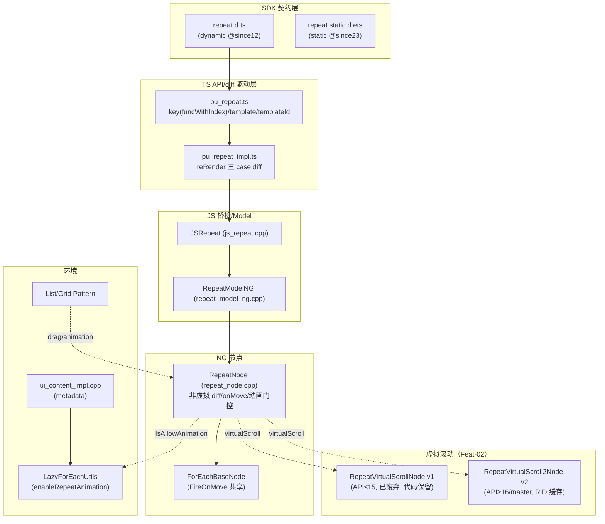
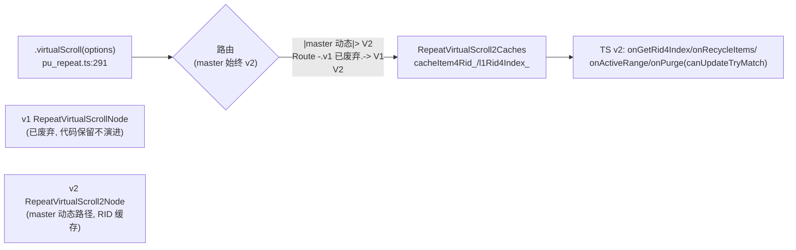
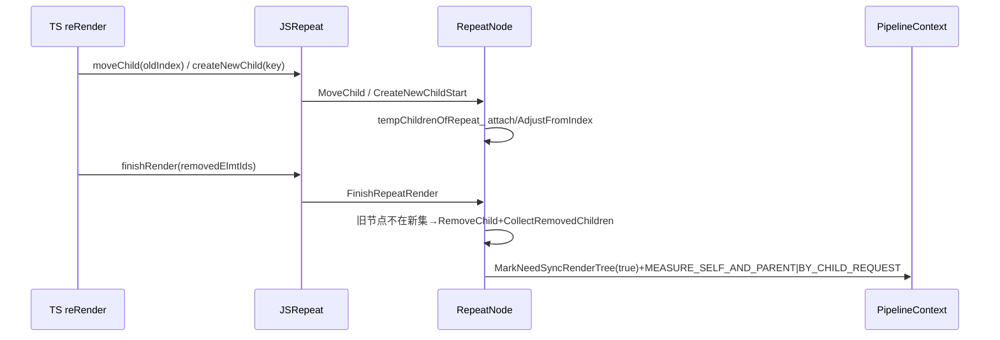

# 架构设计

> 确认目标仓和模块的架构约束、关键设计决策、Spec 拆分方向。

## 设计元数据

| Field | Content |
|-------|---------|
| Design ID | `DESIGN-Func-07-05-03` |
| 关联需求 | 已有能力补录（无独立 requirement.md） |
| 关联 Epic | 无 |
| 目标 Feature | Feat-01 Repeat 核心语法与非虚拟渲染（基线）；Feat-02 Repeat 虚拟滚动（v2；v1 已废弃）（已补录）；Feat-03 Repeat 模板化渲染与复用（已补录）；Feat-04 Repeat 内存优化策略（已补录） |
| 复杂度 | 关键 |
| 目标版本 | dynamic `@since12`（核心）/ `@since18`（RepeatArray readonly）/ `@since23`（static 整套）/ `@since26`（内存优化）；虚拟滚动 v2（master 动态路径）；v1 已废弃（代码保留不演进） |
| Owner | ArkUI SIG |
| 状态 | Baselined（已有实现补录） |

## 需求基线

> 需求基线详见 proposal.md。以下仅列出设计阶段需要额外强调的要点。

| 项 | 补充说明 |
|----|---------|
| 补录而非新增 | 当前实现即规格，可疑行为只能标注为风险/备注 |
| 与 LazyForEach 并存 | Repeat 与 LazyForEach 同属渲染控制，共享 `ForEachBaseNode` 基类与 onMove/drag 机制，但数据源契约与缓存模型独立（Repeat 数组+TS lambda，无 IDataSource/DataChangeListener） |
| key 在 TS 侧生成 | 与 LazyForEach 的 C++ keyGen 不同，Repeat key 完全在 TS（`pu_repeat.ts`），C++ 仅消费 id 串 |
| v1 已废弃 | 虚拟滚动 v1（`repeat_virtual_scroll_*`，原 API≤15 兼容）**已废弃**、代码保留不演进；v2（`repeat_virtual_scroll_2_*`）为 master 动态路径（Feat-02） |
| （Feat-02）虚拟滚动澄清 | master 动态路径**始终 v2**（`pu_repeat.ts:291`）；**v1 已废弃**（代码保留不演进）；v2 RID 缓存；cachedCount 双源（TemplateOptions+容器）；sync-load 默认开；API≥18 FreezeSpareNode |
| （Feat-03）模板化渲染 | `.template(ttype,...)`/`.templateId(typedFunc)` 按 ttype 字符串注册多模板（`''` 为 each 保留）；未知 ttype 回退 each；v1 per-ttype 池已废弃、v2 per-ttype 簿记在 TS；模板子节点 `SetAllowReusableV2Descendant(false)` 禁用 `@ReusableV2` |
| （Feat-04）内存优化 | `memoryOptimizationStrategy`（`@since26`，仅 v2）注册窗口/内存回调；hide 同步清/show 延迟恢复/LOW·CRITICAL 异步清；2s 防抖+1s poll；PurgeAll 按 per-ttype cachedCount 预算保留；**无 maxCacheCount 硬下限**（仅 LazyForEach 有） |

## 上下文和现状

### 涉及仓和模块

| 仓库 | 补充架构说明 |
|------|-------------|
| `arkui_ace_engine` | Repeat 全部实现（TS API/diff 驱动、JS 桥接、NG 节点 v1/v2、Model 工厂、缓存）均在本仓 |
| `interface/sdk-js` | 提供 dynamic `repeat.d.ts` 与 static `repeat.static.d.ets` 契约（外部 API 权威） |

> 仓、模块、当前职责、影响类型详见 proposal.md「影响范围」。

### 调用链层级分析

| 层 | 模块 | 职责 | 修改类型 |
|----|------|------|---------|
| 1. SDK 契约层 | `repeat.d.ts` / `repeat.static.d.ets` | 声明 `Repeat`/`each`/`key`/`RepeatItem`/`RepeatAttribute`/`VirtualScrollOptions`/`TemplateOptions` | 不修改（外部 API 权威） |
| 2. TS API/diff 驱动层 | `frameworks/bridge/declarative_frontend/state_mgmt/src/lib/partial_update/pu_repeat.ts` / `pu_repeat_impl.ts` | TS 侧 key 生成（默认 funcWithIndex）、reRender 三 case diff、`RepeatNative` 调度 | 现状（Feat-01：key/非虚拟 diff） |
| 3. JS 桥接层 | `frameworks/bridge/declarative_frontend/jsview/js_repeat.cpp` / `js_repeat.h` | `JSRepeat` 绑定（startRender/finishRender/moveChild/createNewChild/onMove/item-drag/isAllowAnimation） | 现状 |
| 4. Model 工厂层 | `frameworks/core/components_ng/syntax/repeat_model_ng.cpp` / `repeat_model.h` | `StartRender`/`FinishRender`/`MoveChild`/`CreateNewChildStart/Finish`/`OnMove`/`IsAllowAnimation` 门面 | 现状 |
| 5. 非虚拟节点层 | `frameworks/core/components_ng/syntax/repeat_node.cpp` / `repeat_node.h` | `RepeatNode`：`CreateTempItems`/`FinishRepeatRender`/`MoveChild`/`MoveData`/`SetOnMove`/`InitDragManager`/动画门控 | 现状（Feat-01） |
| 6. 共享基类层 | `frameworks/core/components_ng/syntax/for_each_base_node.h` | `ForEachBaseNode`：`FireOnMove`（from!=to）/drag 回调/`MoveData` 纯虚；ForEach/Repeat/LazyForEach 共享 | 现状（跨特性） |
| 7. 虚拟滚动节点层（Feat-02） | `repeat_virtual_scroll_node.*`（v1，**已废弃**）/ `repeat_virtual_scroll_2_node.*`（v2，master） | 虚拟滚动按需生成/active range/recycle；v2 RID 缓存（v1 key+ttype 已废弃） | 现状（Feat-02 已补录：v1 已废弃、master 始终 v2） |
| 8. 缓存层（Feat-02/03） | `repeat_virtual_scroll_caches.*`（v1，**已废弃**）/ `repeat_virtual_scroll_2_caches.*`（v2） | v2 RID 键 L1/L2（v1 per-ttype 池已废弃） | 现状（Feat-02 已补录；v1 已废弃） |
| 9. 父容器 Pattern 层 | List/Grid Pattern | 经 drag 驱动 onMove、animation gating 判定 parent==List | 现状（跨特性） |
| 10. 全局工具层 | `frameworks/core/components_ng/syntax/lazy_for_each_utils.cpp` / `.h` | `GetEnableRepeatAnimation` 全局标志（命名含 LazyForEach 但供 Repeat 用） | 现状 |
| 11. metadata 层 | `adapter/ohos/entrance/ui_content_impl.cpp` | 读 app metadata `enableRepeatAnimation=="true"` 一次性设全局标志 | 现状 |

检查项：
- [x] 调用链每一层都已覆盖（SDK→TS diff→JS 桥接→Model→节点→共享基类→父容器→全局标志→metadata）
- [x] 每层职责边界清晰（TS 驱动 diff，C++ 仅执行；onMove 共享基类）
- [x] 每层修改类型明确（均为「现状」，存量补录）

### 适用架构规则

| Rule ID | 适用原因 | 设计结论 | 验证方式 |
|---------|---------|---------|---------|
| OH-ARCH-LAYERING | SDK→TS diff→JS→Model→节点→共享基类多层 | 调用方向自顶向下；C++ 节点不直接驱动 TS diff，由 TS reRender 调度 | 架构评审/依赖检查 |
| OH-ARCH-SUBSYSTEM | 仅本仓 + SDK 契约，无跨子系统 | 不引入子系统外依赖 | 依赖检查 |
| OH-ARCH-API-LEVEL | dynamic `@since12/18`、static `@since23`、虚拟滚动 API15/16 分叉 | Public API，无新增权限；版本差异在 d.ts `@since` 标注 | API 评审/XTS |
| OH-ARCH-COMPONENT-BUILD | 现状无 BUILD.gn/bundle.json 变更 | 无构建影响 | 构建验证 |
| OH-ARCH-ERROR-LOG | 缺 each 抛 `BusinessError(103802)`；重复 key 静默回退（无错误码） | 运行时错误码 + 静默降级 | UT |

## 不涉及项承接

> proposal.md 已完成 N/A 判定。本节仅对标记「涉及」且需展开设计的维度给出结论。

| 维度 | 设计结论 |
|------|---------|
| 跨进程/SA | 不涉及（同进程语法节点） |
| 持久化 | 不涉及（节点生命周期随父容器） |
| 权限 | 不涉及（Public API 无权限） |
| 国际化/RTL | 子节点布局随父容器，Repeat 自身不做 RTL |
| 多范式兼容 | dynamic（NG）+ static（@since23）双范式；static `@since26 staticonly` surface 按用户决策不单独成 Feat，差异在各 Feat 版本矩阵标注 |
| 数据源契约 | Repeat 用数组+TS lambda（onCreateNode/onUpdateNode/onGetKeys4Range 等），无 IDataSource/DataChangeListener（与 LazyForEach 不同） |

## 关键设计决策

| 决策 ID | 问题 | 推荐方案 | 探索过的替代方案 | 取舍理由 | 影响 |
|--------|------|---------|----------------|---------|------|
| ADR-1 | key 在哪一层生成 | 完全在 TS（`pu_repeat.ts` `__RepeatDefaultKeyGen`），默认 `funcWithIndex`=`${index}__${itemKey}`（对象经 WeakMap）；C++ 仅消费解析后 id 串（`ids_`） | (a) C++ keyGen（LazyForEach 模式）；(b) 应用强制提供 key | TS 侧可访问对象引用做 WeakMap 稳定 key，且与状态管理 diff 同层；C++ 无需感知数据语义 | C-API/Arkoala 直构造 RepeatNode 须自供 id 串（风险 RISK-1）；与 LazyForEach C++ keyGen 路径不同 |
| ADR-2 | 重复用户 key 如何处理 | 检测 `key2Item.size<arr.length` → 警告 + 回退默认 `funcWithIndex` + 重跑 `genKeys()`（全量重渲染） | (a) 抛错中断；(b) 静默覆盖 | 渲染韧性优先；回退默认保证可继续渲染；代价是全量重渲染性能开销 | 重复 key 静默触发全量重渲染，应用难察觉（风险 RISK-2） |
| ADR-3 | `.each()` 是否必填 | 必填；缺省运行时抛 `BusinessError(103802)` | (a) 编译期检查；(b) 默认空实现 | 运行时抛错实现简单；与 ArkTS 动态范式一致 | 仅运行时报错，非编译期（风险 RISK-4） |
| ADR-4 | 非虚拟 diff 由谁驱动 | TS `reRender` 三 case（retained/reused-slot/new）经 `RepeatNative.moveChild`/`createNewChild` 驱动；C++ `RepeatNode` 仅执行 swap/attach（`tempChildrenOfRepeat_`） | (a) C++ 全权 diff；(b) 全量重建 | TS 侧持有 key2Item map 与状态管理同层，diff 决策更自然；C++ 仅做节点搬移 | diff 逻辑在 TS，C++ 节点无 diff 智能 |
| ADR-5 | onMove 机制复用 | RepeatNode 不覆写 `FireOnMove`，继承 `ForEachBaseNode`（from!=to 触发）；List/Grid 直接父门控；与 ForEach/LazyForEach 共享 | (a) Repeat 独立实现 drag；(b) 抽公共 mixin | 共享基类减少重复；onMove 语义跨三语法一致 | 仅 List/Grid 直接父生效；非 List/Grid 父 onMoveEvent_ 被置空 |
| ADR-6 | 动画复用抑制何时启用 | `IsAllowAnimation`=全局 `GetEnableRepeatAnimation()`（metadata `enableRepeatAnimation=true`，默认 false）AND parent==List；启用时 TS 4 条规则在隐式动画开/子动画中跳过 moveChild 复用强制新建 | (a) 默认启用；(b) 含 Grid | 默认关避免无动画场景误判；Grid 路径不启用；metadata 显式开启 | 默认 false + 仅 List，Grid 无动画复用抑制（风险 RISK-3） |
| ADR-F2-1 | v1/v2 分叉实现方式（v1 已废弃） | master 动态路径 `pu_repeat.ts:291` **始终实例化 v2**；v1（`repeat_virtual_scroll_*`，原 API≤15 兼容）**已废弃**——源码保留但不演进，经独立前端桥接保留（`js_view_register_impl.cpp:498-499` 双注册）；非运行时版本门控 | (a) 运行时 API 版本门控选 v1/v2；(b) 仅保留 v2 删除 v1 | v1 历史兼容实现现已废弃；下游新开发一律基于 v2 | v1 残留代码/引用待后续清理移除（RISK-F2-3） |
| ADR-F2-2 | v1 缓存模型（已废弃） | ~~key+ttype：`node4key4ttype_`/`activeNodeKeysInL1_`/`cacheCountL24ttype_`，复用按 ttype 匹配~~ ——**v1 整体已废弃**，源码保留不演进，本决策仅作历史记录 | (a) 全局 L2 池不分 ttype；(b) 仅按 key | 历史决策；v1 不再演进 | 复用模型以 v2 RID（ADR-F2-3）为准 |
| ADR-F2-3 | v2 缓存模型 | RID 键：`cacheItem4Rid_`（RID→CacheItem{node_,isL1_,isActive_,isOnRenderTree_}）+`l1Rid4Index_`（index→RID）；复用匹配（ttype/key）**在 TS 侧**（`canUpdateTryMatch`），C++ 仅存 RID→node+L1 标志；`SetInvalid`=L1→L2 保留、`RemoveNode`=完全删除 | (a) C++ 侧 ttype 匹配（v1 模式）；(b) 全删替换 | TS 侧匹配更灵活（可访问状态管理）；C++ 解耦数据语义 | v2 复用决策在 TS，C++ 无 diff 智能（与 Feat-01 ADR-4 一致） |
| ADR-F2-4 | v2 sync-load 与 API18 spare 冻结 | sync-load 默认开（`enableSyncLoad_/isSyncLoad_` 默认 true），`OrganizeSyncLoadCache` 在 L1 变更后刷新同步快照保证布局期子树就绪；API≥18 预构建后 `FreezeSpareNode` 对非 L1 spare 节点 `SetJSViewActive(false)` 冻结 | (a) 默认 async；(b) 不冻结 spare | 默认 sync 保布局稳定；spare 冻结减少离屏 JS 活跃开销 | API<18 不冻结 spare |
| ADR-F3-1 | 模板 ttype 标识方式 | ttype 为任意字符串，`''`（`RepeatEachFuncTtype`）保留给 `each()`；`templateId(typedFunc)` 装 item→ttype 映射，per-item 调用决策；未知 ttype/抛错回退 `''`（each） | (a) 枚举 ttype；(b) 数字 ttype id | 字符串 ttype 灵活、可读；回退 each 保证韧性 | 未知 ttype 静默回退（应用难察觉） |
| ADR-F3-2 | per-ttype 实现（v2；v1 已废弃） | ~~v1 原生 per-ttype 池在 C++~~ ——v1 已废弃；v2 per-ttype 簿记在 TS（`templateOptions_`/`RIDMeta.ttype_`），C++ v2 仅 flat RID→CacheItem | (a) v2 也用 C++ per-ttype；(b) v1 也用 TS | v1 历史实现已废弃；v2 与状态管理同层 TS 决策更灵活 | per-ttype 以 v2 TS 簿记为准 |
| ADR-F3-3 | 模板内 @ReusableV2 复用 | 模板子节点（ttype≠''）`SetCreateByTemplate(true)`→`SetAllowReusableV2Descendant(false)` 禁用 `@ReusableV2` reuseId 复用，Repeat ttype 池为唯一复用路径；each 子节点（ttype=''）允许 | (a) 允许模板内 @ReusableV2；(b) 完全禁用 | 避免模板池与 @ReusableV2 双重复用冲突；each 不限 | 模板内 @ReusableV2 不生效（应用须知） |
| ADR-F4-1 | 内存优化适用范围与触发 | memOpt 仅 v2（`@since26`）；ENABLE 时节点创建注册窗口/内存回调+1s PostMemOptTask poll；hide 同步清、show 延迟恢复、LOW/CRITICAL 异步清；2s 防抖 | (a) v1 也支持；(b) 全量激进回收 | 仅 v2 新实现支持；防抖+poll 避免抖动；DEFAULT 零开销 | v1 无内存优化能力 |
| ADR-F4-2 | 内存回收彻底度 | PurgeAll 按 per-ttype `cachedCount` 预算保留恢复项、余 removeNodes；RemovingExpiringItem deadline 分批；**无 maxCacheCount 硬下限**（仅 LazyForEach 有 maxCacheCount=2） | (a) 加 maxCacheCount 下限；(b) 盲删全部 | 用户 cachedCount 控制恢复预算，框架不强加下限；与 LazyForEach 策略不同 | 用户未设 cachedCount 时回收后保留项取决于默认预算 |

## 设计骨架

### 骨架范围

| 骨架项 | 目标 | 不包含 | 验证方式 |
|--------|------|--------|---------|
| 构造与链式 | 固化 `Repeat(arr)`/`each`/`key`/`RepeatItem`/`RepeatAttribute` | virtualScroll/template（Feat-02/03） | UT + SDK 比对 |
| key 生成 | 固化默认 funcWithIndex/自定义/重复 key 回退 | — | TS 单测 |
| 非虚拟 diff | 固化 RepeatNode CreateTempItems/FinishRender/三 case | 虚拟滚动 active range/recycle（Feat-02） | UT |
| onMove/动画 | 固化 List/Grid 拖拽门控+FireOnMove+动画门控 | 内存优化（Feat-04） | UT + XTS |

### 骨架 Spec 拆分

| Task ID | 目标 | 受影响文件 | AC |
|---------|------|----------|-----|
| TASK-SKELETON-1 | Feat-01 构造/key/diff/onMove/动画基线 | `pu_repeat.ts`、`repeat_node.cpp`、`repeat_model_ng.cpp`、`for_each_base_node.h` | AC-1.1~5.5 |

## 后续 Task 拆分

| Task ID | 目标 | 受影响文件 | 依赖 |
|---------|------|----------|------|
| T-1 | Feat-01 Repeat 核心语法与非虚拟渲染（基线，本设计已承接） | `Feat-01-*-spec.md` + 本 design.md | — |
| T-2 | Feat-02 Repeat 虚拟滚动（v2；v1 已废弃）（已补录） | `repeat_virtual_scroll_2_node.*`、`repeat_virtual_scroll_2_caches.*`、`js_repeat_virtual_scroll_2.cpp`、`pu_repeat_virtual_scroll_2_impl.ts`（v1 文件已废弃） | T-1 |
| T-3 | Feat-03 Repeat 模板化渲染与复用（已补录） | `pu_repeat.ts`（template/templateId）、`repeat_virtual_scroll_caches.h`（per-ttype 池）、`repeat_virtual_scroll_2_model_ng.cpp`（SetCreateByTemplate） | T-2 |
| T-4 | Feat-04 Repeat 内存优化策略（已补录） | `repeat_virtual_scroll_2_node.cpp`（CleanCache/RestoreCache/MemoryLevel）、`VirtualScrollOptions.memoryOptimizationStrategy` | T-2 |

## API 签名、Kit 与权限

> 本节承接 spec.md「API 变更分析」中识别的 API，给出签名、权限和 d.ts 位置等实现细节。

### 新增 API

无新增。本特性覆盖既有 API（存量补录）。

### 变更/废弃 API

| 原有 API | 变更类型 | 新 API | 迁移说明 |
|---------|---------|--------|---------|
| `Repeat<T>(arr)` + `.each`/`.key`（dynamic `@since12`） | 既有 | — | `@since18` arr 放宽 `RepeatArray<T>`（readonly） |
| `Repeat<T>(arr)`（static `@since23`） | 既有 | — | `@ComponentBuilder`，返回 `this` |
| `RepeatItem<T>`/`RepeatAttribute<T>` | 既有 | — | static index 为 int |
| `.virtualScroll(VirtualScrollOptions?)`（dynamic `@since12`/static `@since23`） | 既有 | — | 开启虚拟滚动（Feat-02） |
| `VirtualScrollOptions`（totalCount `@since12`/reusable `@since18`/onLazyLoading·onTotalCount `@since19`/disableVirtualScroll static-only `@since23`） | 既有 | — | 虚拟滚动选项（Feat-02）；memoryOptimizationStrategy `@since26` 见 Feat-04 |
| `.template(type,itemBuilder,TemplateOptions?)`/`.templateId(typedFunc)`/`TemplateOptions.cachedCount`/`TemplateTypedFunc<T>`（dynamic `@since12`/static `@since23`） | 既有 | — | 多模板渲染与 per-ttype 复用（Feat-03） |
| `VirtualScrollOptions.memoryOptimizationStrategy` + `RepeatMemOptStrategy`（dynamic/static `@since26`，仅 v2） | 既有版本扩展 | — | v2 自动缓存优化（Feat-04） |

> d.ts 位置：dynamic `interface/sdk-js/api/@internal/component/ets/repeat.d.ts:65,317,342,361,459`；static `interface/sdk-js/api/arkui/component/repeat.static.d.ets:69,215,226,237,319`。Kit：ArkUI；权限：无；SysCap：`SystemCapability.ArkUI.ArkUI.Full`。

## 构建系统影响

### BUILD.gn 变更

无变更（存量补录）。Repeat 源文件已纳入 `frameworks/core/components_ng/syntax/` 与 `frameworks/bridge/declarative_frontend/` 现有构建目标。

### bundle.json 变更

无变更。

## 可选设计扩展

### 架构图



#### 虚拟滚动架构图（Feat-02）



### 数据流/控制流

| 步骤 | 调用方 | 被调用方 | 数据/接口 | 说明 |
|------|--------|---------|----------|------|
| 1 | TS reRender | RepeatNative | `moveChild(oldIndex)`/`createNewChild(key)` | 三 case diff 驱动 |
| 2 | JS 桥接 | RepeatModelNG | `MoveChild`/`CreateNewChildStart/Finish` | 节点搬移/创建 |
| 3 | RepeatModelNG | RepeatNode | `MoveChild`/`CreateTempItems`/`FinishRepeatRender` | swap temp、attach/detach |
| 4 | RepeatNode | PipelineContext | `MarkNeedSyncRenderTree(true)`+`PROPERTY_UPDATE_MEASURE_SELF_AND_PARENT\|BY_CHILD_REQUEST` | 脏标记 |
| 5 | 父容器 drag | RepeatNode | `MoveData(from,to)`/`FireOnMove` | 拖拽重排+通知 |
| 6 | TS reRender | RepeatNode | `getActiveRange`/`isAllowAnimation`/`isImplicitAnimationOpen` | 动画复用抑制判定 |

### 时序设计



### 数据模型设计

**API 层（TypeScript，SDK 契约）**

```typescript
interface RepeatItem<T> { item: T; index: number; }
interface RepeatAttribute<T> extends DynamicNode { each(g): RepeatAttribute<T>; key(g): RepeatAttribute<T>;
  virtualScroll(o?): RepeatAttribute<T>; template(...): RepeatAttribute<T>; templateId(...): RepeatAttribute<T>; }
type RepeatArray<T> = Array<T> | ReadonlyArray<T> | Readonly<Array<T>>; // @since18
```

**Framework 层（C++/TS）**

```ts
// pu_repeat.ts
__RepeatDefaultKeyGen.func<T>(item): string        // 基本类型→JSON.stringify；对象→WeakMap 数值键
__RepeatDefaultKeyGen.funcWithIndex<T>(item,index): string  // `${index}__${func(item)}`
config.keyGenFunc / keyGenFuncSpecified             // 默认 funcWithIndex；.key() 覆盖
```
```cpp
// repeat_node.h:84 / repeat_node.cpp
std::list<std::string> ids_;                        // C++ 仅消费 TS 解析的 id 串
std::list<RefPtr<UINode>> tempChildren_;            // diff 临时
std::vector<RefPtr<UINode>> tempChildrenOfRepeat_;  // O(1) 随机访问
int32_t from_ / to_;                                // 在途 MoveData 偏移
int32_t activeRangeStart_ / activeRangeEnd_;
```

| 结构 | 存储方案 | 生命周期 |
|------|---------|---------|
| `ids_` | RepeatNode list | 随渲染轮换 |
| `tempChildrenOfRepeat_` | RepeatNode vector | 单次 diff |
| `key2Item_`（TS） | TS map | reRender 期 |
| `enableRepeatAnimation_` | 进程全局静态 | UI 内容初始化一次 |

#### v2 缓存数据模型（Feat-02）（v1 已废弃）

> **v1 废弃：** v1（`repeat_virtual_scroll_caches.h`，key+ttype：`node4key4ttype_`/`cacheCountL24ttype_`/`ttype4index_`/`activeNodeKeysInL1_`）**已废弃**，源码保留但不演进，本节不再展开（详见 Feat-02 废弃声明）。

**v2（RID，`repeat_virtual_scroll_2_caches.h`）**

```cpp
struct RepeatVirtualScroll2CacheItem { bool isL1_; bool isActive_; bool isOnRenderTree_; RefPtr<UINode> node_; }; // :96-113
map<IndexType=int32_t, RIDType=uint32_t> l1Rid4Index_;                      // :313 L1 index→RID
map<RIDType, CacheItem> cacheItem4Rid_;                                     // :316 全节点 RID→CacheItem
optional<pair<IndexType,IndexType>> moveFromTo_;                            // :329 drag
bool enableSyncLoad_ = true; bool isSyncLoad_ = true;                       // :338-339
map<index, WeakPtr<UINode>> syncLoadCache_;                                 // :337 同步快照
// 结果码 OnGetRid4IndexResult { NO_NODE=0, CREATED_NEW_NODE=1, UPDATED_NODE=2, UNCHANGED_NODE=3 } :124-130
```

| 模型 | 复用单元 | 复用匹配位置 | L1/L2 迁移 |
|------|---------|------------|-----------|
| ~~v1（已废弃）~~ | ~~UINode by key，按 ttype 分池~~ | ~~C++ 侧（`UpdateFromL2`）~~ | ~~`activeNodeKeysInL1_` 标志~~ |
| v2（master） | UINode by RID | TS 侧（`canUpdateTryMatch`） | `SetInvalid`=L1→L2 保留 / `RemoveNode`=删除 |

### 测试性设计

| 测试层级 | 测试目标 | Mock 策略 | 验证方式 |
|---------|---------|----------|---------|
| TS 单测 | key 生成/diff 三 case/复用抑制 | 直接测 `pu_repeat_impl.ts` | state_mgmt 单测 |
| UT | RepeatNode diff/onMove/动画门控 | Mock 父容器 tag | `repeat_node` UT |
| UT | Model 门面 | 直接调 `RepeatModelNG` | repeat_model UT |
| XTS | dynamic/static 双范式端到端 | — | `test/xts` |

### 资源所有权矩阵

| 资源 | 创建方 | 持有方 | 销毁触发 | 实际释放 | 异常回收 |
|------|--------|--------|---------|---------|---------|
| 子节点 | TS `initialRenderItem`→C++ SyntaxItem | RepeatNode children | 数组缩减/节点销毁 | `FinishRepeatRender` RemoveChild | 重复 key 回退全量重建 |
| RepeatNode | `GetOrCreateRepeatNode` | ElementRegister+父子树 | 父容器销毁 | 随父容器 | — |
| onMoveEvent_ | `SetOnMove` | ForEachBaseNode | onMove 置空/节点销毁 | 自动 | 非 List/Grid 父置空 |

### 接口参数规约

| 接口 | 参数 | 类型 | 合法范围 | 非法处理 | 边界说明 |
|------|------|------|---------|---------|---------|
| `Repeat` | arr | RepeatArray<T> | 数组/readonly | — | @since18 readonly |
| `.each` | itemGenerator | (RepeatItem<T>)=>void | function | 缺省抛 BusinessError(103802) | 不可解构 RepeatItem |
| `.key` | keyGenerator | (item,index)=>string | function/默认 | 重复→回退默认+全量重渲染 | TS 侧生成 |
| `.onMove` | callback/handlers | (from,to)=>void / object | function+可选 object | 非函数清空；非 List/Grid 父置空 | 仅 List/Grid |

### 线程与并发模型

| 操作 | 发起线程 | 回调线程 | 跨进程边界 | 线程安全 | 重入约束 |
|------|---------|---------|----------|---------|---------|
| 子节点构建 | UI/Pipeline | 同 | 无 | 单线程 UI | reRender 不可在 itemGenerator 内重入 |
| onMove 回调 | drag（UI） | UI | 无 | 单线程 | from!=to 才触发 |
| metadata 标志设置 | UI 内容初始化 | — | 无 | 一次性 | 进程级 |

## 详细设计

### 构造与链式调用

`Repeat(arr)`（dynamic `repeat.d.ts:459` `@since12`，`@since18` 起 `RepeatInterface`/`RepeatArray<T>`；static `repeat.static.d.ets:319` `@since23` `@ComponentBuilder`）返回 `RepeatAttribute<T>`（`:317`/`:215`）。`.each(itemGenerator)`（dynamic `:342`/static `:226`）设置 item 构建器，接收 `RepeatItem<T>{item,index}`（`:65`/`:69`）；**缺 each 运行时抛 `BusinessError(103802)`**（`pu_repeat.ts:282`）。`.key(keyGen)`（`:361`/`:237`）覆盖默认 key。文档禁止解构 RepeatItem（`:341`）。

### key 生成（TS 侧）

key 完全在 TS（`pu_repeat.ts`）。默认 `__RepeatDefaultKeyGen.funcWithIndex(item,index)`=`` `${index}__${func(item)}` ``（`:129-131,186-187`）；`funcImpl`（`:133-144`）基本类型→`JSON.stringify`，对象/符号→WeakMap 数值键（同引用同 key）。`.key(keyGen)` 置 `config.keyGenFunc=keyGen`、`keyGenFuncSpecified=true`（`:213-217`）。重复 key（`key2Item.size<arr.length`）警告 "Duplicates detected, fallback to index-based keyGen"，重置 `keyGenFunction_=funcWithIndex` 并重跑 `genKeys()` 全量重渲染（`pu_repeat_impl.ts:62-67`）。C++ 仅消费 id 串（`repeat_node.h:84` `ids_`/`SetIds:61`，经 `RepeatNative.createNewChildStart(key)`→`js_repeat.cpp:93`→`repeat_model_ng.cpp:58`）。

### 非虚拟 diff 渲染

`StartRender`（`repeat_model_ng.cpp:28-38`）→`CreateTempItems`（`repeat_node.cpp:44-51`）把旧 `ids_`/children 交换到 `tempIds_`/`tempChildren_`+复制 `tempChildrenOfRepeat_`。TS `reRender`（`pu_repeat_impl.ts:91-201`）三 case：retained（`:123-141`，`moveChild(oldIndex)`）/reused-slot（`:143-170`，`updateItem`+`moveChild(oldKeyIndex)`）/new（`:171-178`，`initialRenderItem`）。`RepeatNode::MoveChild`（`:103-111`）经 `AdjustFromIndex`（`:308-321`）补偿在途 MoveData 偏移后 silent re-attach。`FinishRender`→`FinishRepeatRender`（`:54-93`）对 `tempChildrenOfRepeat_` 不在新集的旧节点 silent re-attach+`RemoveChild`+`CollectRemovedChildren`，清 temp 并 `ChildrenUpdatedFrom(0)`。`FlushUpdateAndMarkDirty`（`:186-192`）`MarkNeedSyncRenderTree(true)`+`PROPERTY_UPDATE_MEASURE_SELF_AND_PARENT|BY_CHILD_REQUEST`。`DumpInfo` 硬编码 `"VirtualScroll: false"`（`:323-328`）。

### onMove 拖拽排序

`SetOnMove`（`repeat_node.cpp:114-137`）：onMoveEvent_ 空变非空→`InitAllChildrenDragManager(true)`（无父 PostTask(UI)）；非空变空→`InitAllChildrenDragManager(false)`。`InitDragManager`（`:200-220`，gate `:208`）/`InitAllChildrenDragManager`（`:222-261`，gate `:226`）仅 LIST_ETS_TAG/GRID_ETS_TAG 父 proceed（非此则提前 return 且 `:227` 置空 `onMoveEvent_`）；List→`ListItemPattern::InitDragManager`，Grid→`NodeModifier::GetGridItemCustomModifier()->initDragManager`。`MoveData(from,to)`（`:152-184`）早退 `from==to||from<0||to<0`，记录 `from_`/`to_`，`ModifyChildren()` erase@from+insert@to+脏标记。`FireOnMove` 不覆写，继承 `ForEachBaseNode::FireOnMove`（`for_each_base_node.h:31-36`）仅 `from!=to && onMoveEvent_` 触发。`SetItemDragHandler`（`:139-149`）仅 onMoveEvent_ 已设才存 onLongPress/onDragStart/onMoveThrough/onDrop；JS 解析 `js_repeat.cpp:118-173`。

### 动画门控

`IsAllowAnimation`（`repeat_node.cpp:263-272`）返回 `LazyForEachUtils::GetEnableRepeatAnimation() && parent->GetTag()==LIST_ETS_TAG`（无父 false；Grid 不在路径）。全局标志 `enableRepeatAnimation_` 默认 false（`lazy_for_each_utils.cpp:22`），由 app metadata `enableRepeatAnimation=="true"` 在 `ui_content_impl.cpp:2271-2274` 一次性设。`IsChildInAnimation`（`:274-293`）仅 Rosen 后端读子 FrameNode `RosenRenderContext::GetRSNode()->GetAnimationsCount()>0`。`IsImplicitAnimationOpen`（`repeat_model_ng.cpp:113-116`）委托 `AnimationUtils::IsImplicitAnimationOpen()`。TS reRender（`pu_repeat_impl.ts:110-117,127-135,148-155`）4 条规则：动画允许且（隐式开 或 子动画中）跳过 moveChild 复用，强制 `mkRepeatItem_`+`initialRenderItem`。

### 虚拟滚动（Feat-02，v2；v1 已废弃）

`.virtualScroll(options?)`（dynamic `repeat.d.ts:378`/static `:249`）开启虚拟滚动；`pu_repeat.ts:280-293` 检测 `isVirtualScroll`，**master 动态路径始终实例化 `__RepeatVirtualScroll2Impl`**（`:291`）。`VirtualScrollOptions`（`:102`）：totalCount（`:136` `@since12`）、reusable（`:153` `@since18` 默认 true）、onLazyLoading（`:183` `@since19`）、onTotalCount（`:219` `@since19`）、disableVirtualScroll（static-only `repeat.static.d.ets:176` `@since23`）、memoryOptimizationStrategy（`:230` `@since26`，Feat-04）。

> **v1 已废弃：** `RepeatVirtualScrollNode`（v1，key+ttype 缓存，原 API≤15 兼容）已废弃，源码保留但不演进，master 动态路径始终 v2。v1 的 `GetFrameChildByIndex`/`UpdateFromL2`/`CreateNewNode`/`Purge`/`node4key4ttype_` 等历史行为不再展开（详见 Feat-02 废弃声明）。

**v2（RID，API≥16/master）**：`GetFrameChild(index,needBuild)`（`repeat_virtual_scroll_2_caches.cpp:50-68`）`ConvertFromToIndex`（drag `:54`）→`GetL1CacheItem4Index`（`:55`）命中 UNCHANGED；!needBuild NO_NODE；否则 `CallOnGetRid4Index`（`:273-308`）调 TS `onGetRid4Index_`（`:283`），CREATED_NEW_NODE→`GetNewRid4Index`（`:310-329`）/UPDATED_NODE→`GetUpdatedRid4Index`（`:331-355`）。ttype/key 复用匹配**在 TS 侧**（`canUpdateTryMatch`，`pu_repeat_virtual_scroll_2_impl.ts:30-37`），C++ 仅存 RID→CacheItem+L1 标志。`SetInvalid`（`:170-174`）=L1→L2 保留；`RemoveNode`（`:153-163`）=完全删除。TS 驱动 `{onGetRid4Index,onRecycleItems,onActiveRange,onMoveFromTo,onPurge,onPurgeAll,onUpdateDirty}`（`:532-540`）。

**活跃区间/cachedCount/recycle/pre-build（v2）**：父容器 `DoSetActiveChildRange(start,end,cacheStart,cacheEnd,showCache)`（v2 `:105-153`），showCache 折入窗口。reusable=false：v2 强制模板 cachedCount=0（`:516-519`）。TemplateOptions.cachedCount（`repeat.d.ts:276`）：v2 TS 约束（`availableCachedCount`/`getCachedCountByType`）；未指定则动态 `max(numberOfActiveItems,cachedCount)`（`:1462-1469`）。回收：v2 `RecycleItems`（`:648-669`）记 `prevRecycleFrom_/To_`，L1→L2 在 `RebuildL1+ProcessActiveL2Nodes`，TS 侧经 `onRecycleItems`/`SetInvalid`。Pre-build：v2 `PostIdleTask`（`:769-809`）`GetChildren()`→（`!CheckIsSyncLoad()` 重投）→`RestoreCache`→`Purge`→[API≥18]`FreezeSpareNode`→`RemovingExpiringItem`。数据变更统一 `MEASURE_SELF_AND_PARENT|BY_CHILD_REQUEST`+`MarkNeedSyncRenderTree(true)`（v2 `RequestContainerReLayout:448-451`）；仅区间变更用 `RequestSyncTree`（`:140,358`）。

**sync-load + FreezeSpareNode（v2）**：sync-load 默认开（`caches.h:338-339`），`CheckIsSyncLoad`（`caches.cpp:603-606`）；`OrganizeSyncLoadCache`（`:594-601`）在 `UpdateL1Rid4Index`（`node.cpp:423`）后刷新 `syncLoadCache_` 同步快照；async 模式 `ProcessSyncLoadTempChildren`（`:576-592`）补齐。API≥18 `PostIdleTask` 内 `FreezeSpareNode`（`node.cpp:795`）对非 L1 spare CacheItem `SetJSViewActive(false)`（`:811-824`）；API<18 不冻结。

### 模板化渲染与复用（Feat-03）

`.template(ttype,itemBuilder,templateOptions?)`（dynamic `repeat.d.ts:397`/static `:262` `@since12/23`）注册 `config.itemGenFuncs[ttype]=itemBuilder`+`config.templateOptions[ttype]=normTemplateOptions(options)`（`pu_repeat.ts:267-273`）；多次累积不同 ttype。`.templateId(typedFunc)`（`:414`/`:273`）装 `config.ttypeGenFunc`（`:261-264`），per-item 调用决策 ttype。`.each()` 注册保留 ttype `''`（`RepeatEachFuncTtype`，`:173,207-211`），`templateId` 无匹配回落 each（`:342`）。`TemplateOptions.cachedCount`（`:276`/`:204`）经 `normTemplateOptions` 校验 `Number.isInteger&&>=0`（`:314-324`），范围 `[0,+∞)` 默认显示+预加载且不递减。ttype 决策：`ttypeGenFunc_===undefined`→`''`；返回未知 ttype 或抛错→日志+回退 `''`（v2 `pu_repeat_virtual_scroll_2_impl.ts:878-899`；v1 已废弃）。

**v1 per-ttype 池（C++ 原生，已废弃）**：v1 的 `templateCachedCountMap`/`node4key4ttype_`/`cacheCountL24ttype_`/`GetL2KeyToUpdate` 等 per-ttype 池机制随 v1 整体废弃，不再演进（详见 Feat-02 废弃声明）。模板 per-ttype 复用以 v2 TS 侧簿记为准。

**v2 TS 簿记 + SetCreateByTemplate**：v2 `templateOptions_`/`itemGenFuncs_` 全在 TS（`pu_repeat_virtual_scroll_2_impl.ts:306,488`），ttype 按 RID 经 `RIDMeta.ttype_`（`:1170,1049`），spare-RID 匹配在 TS `canUpdate`/`canUpdateTryMatch`（`:1043-1090`）；C++ v2 缓存仅 flat `cacheItem4Rid_`，无 per-ttype 结构。模板子节点（ttype≠''）创建时 `RepeatVirtualScroll2Native.setCreateByTemplate(true)`（`:1152-1154`）→`SetCreateByTemplate(true)`→`SetAllowReusableV2Descendant(false)`（`repeat_virtual_scroll_2_model_ng.cpp:136-142`）；`AllowReusableV2Descendant`（`view_partial_update_model_ng.cpp:125-147`）沿父链遇 RepeatVirtualScroll(2)Node 返回该标志——禁用模板内 `@ReusableV2` reuseId 复用，Repeat ttype 池为唯一复用路径（`ui_node.h:1001-1008`）。each 子节点（ttype=''）`SetAllowReusableV2Descendant(true)` 允许 `@ReusableV2`。

### 内存优化策略（Feat-04）

`VirtualScrollOptions.memoryOptimizationStrategy`（dynamic `repeat.d.ts:230`/static `:185` `@since26`）经 `parseMemoryOptimizationStrategy`（`pu_repeat.ts:326-341`）解析，非法值警告+强制 DEFAULT，存 `config.memOptStrategy`（`:163,338`），v2 作 `RepeatVirtualScroll2Native.create` 第 3 参（`pu_repeat_virtual_scroll_2_impl.ts:495,532`）。`RepeatMemOptStrategy` 枚举 DEFAULT=0/ENABLE_AUTO_CACHE_OPTIMIZATION=1<<0（`repeat_virtual_scroll_2_node.h:95-98`，ctor int→enum `:83`）。**仅 v2**。

ENABLE 时 `GetOrCreateRepeatNode` 新建注册 `WindowStateChangedCallback`+`MemoryLevelChangedCallback`+`PostMemOptTask()`（`:65-69`），析构对称解注册（`:88-94`）；DEFAULT 不注册。回调：`OnWindowHide`→`CleanCache(true)` 同步（`:1048-1051`）；`OnWindowShow`→`ScheduleRestoreCacheTask`+`PostMemOptTask`（`:1042-1046`）；`OnNotifyMemoryLevel` 仅 LOW(1)/CRITICAL(2)（常量 `:34-35`）→`CleanCache(false)` 异步（`:1053-1058`）。防抖：`CACHE_TASK_DELAY_TIME=2s`（`:33`），`TryExecuteScheduledCacheTask`（`:1117-1133`）须距 `cacheTaskPostTime_`≥2s 且（clean）距 `setActiveRangeTime_`（`DoSetActiveChildRange:144` 戳记）≥2s；restore 另要求 `CheckParentFrameNodeVisibility()`。`PostMemOptTask`（`:1197-1224`）1000ms 自重投 poll，可见性变化 schedule clean/restore。`CleanCache(syncClean)`（`:1135-1155`）`PurgeAll()`+sync 排空 `pendingRemoveRids_`/async `PostIdleTask`；`PurgeAll`（`:691-702`）`onPurgeAll_`（TS 按 per-ttype `cachedCount` 预算保留 `template4RestoreCache_`，余 `removeNodes`，`pu_repeat_virtual_scroll_2_impl.ts:1783-1816`）；`RestoreCache`（`:1167-1185`）经 `caches_.RestoreL2CacheByIndex`（`caches.cpp:70-114`，调 TS `onGetRid4Index(...,true)` 离屏构建）；`RemovingExpiringItem`（`:712-744`）deadline 分批排空 `pendingRemoveRids_`（`DisableRecycle`+`RemoveNode` 每 rid，未完重投 `:800-802`）。**无 maxCacheCount 硬下限**（仅 LazyForEach `lazy_for_each_builder.cpp:1472` 有 maxCacheCount=2），回收量仅由用户 `TemplateOptions.cachedCount` per-ttype 预算约束。

## 风险和开放问题

| 项 | 类型 | 影响 | 处理方式 | Owner |
|----|------|------|---------|-------|
| RISK-1 key 在 TS 侧生成，C-API/Arkoala 直构造 RepeatNode 须自供 id 串（与 LazyForEach C++ keyGen 不同） | 架构 | 中 | 规格 AC-2.5/ADR-1 标注；C++ 节点无 keyGen 字段，仅消费 ids_ | ArkUI SIG |
| RISK-2 重复用户 key 静默回退默认+全量重渲染，应用难察觉（性能） | API | 中 | 警告日志（`pu_repeat_impl.ts:62-67`）；规格 AC-2.4/R-4 标注；不在规格中改实现 | ArkUI SIG |
| RISK-3 动画复用抑制默认 false（metadata）且仅 List 父，Grid 不启用 | API | 低 | 规格 AC-5.1/ADR-6 标注；metadata 显式开启 | ArkUI SIG |
| RISK-4 `.each()` 缺省仅运行时抛 BusinessError(103802)，非编译期 | API | 低 | 规格 AC-1.4/R-2 标注；ArkTS 动态范式限制 | ArkUI SIG |
| RISK-F2-1 v1/v2 分叉非运行时版本门控——master 动态路径始终 v2（`pu_repeat.ts:291`） | 架构 | 中 | 规格「关键澄清」/ADR-F2-1 标注；下游勿假设运行时按 API 选 v1/v2 | ArkUI SIG |
| RISK-F2-3 v1（RepeatVirtualScrollNode，key+ttype）已废弃但源码仍保留、被部分生产 Pattern 引用（如 list_pattern/swiper_pattern），未随版本移除 | 架构 | 中 | 规格 Feat-02「废弃声明」/ADR-F2-1 标注；下游勿基于 v1 新开发；残留引用待后续代码清理 | ArkUI SIG |
| RISK-F2-2 v2 复用匹配在 TS 侧（`canUpdateTryMatch`），C++ 无 diff 智能，C-API/Arkoala 直构造须 TS 配合 | 架构 | 中 | 规格 AC-3.6/ADR-F2-3 标注；与 Feat-01 ADR-1/4 一致（key/diff 均在 TS） | ArkUI SIG |
| RISK-F3-1 模板子节点（ttype≠''）经 SetAllowReusableV2Descendant(false) 禁用 @ReusableV2 reuseId 复用，应用在模板内用 @ReusableV2 不生效 | API | 中 | 规格 AC-4.4/ADR-F3-3 标注；each 子节点仍允许 @ReusableV2 | ArkUI SIG |
| RISK-F3-2 v1 per-ttype 池（C++）已废弃、v2 per-ttype 簿记在 TS；下游勿假设统一 C++ per-ttype 结构 | 架构 | 低 | 规格 ADR-F3-2 标注；v1 已废弃，以 v2 TS 簿记为准 | ArkUI SIG |
| RISK-F4-1 Repeat v2 内存回收无 maxCacheCount 硬下限（仅 LazyForEach 有），用户未设 TemplateOptions.cachedCount 时回收后保留项取决于默认预算 | API | 中 | 规格 AC-4.6/ADR-F4-2 兼容性声明标注；与 LazyForEach 策略不同 | ArkUI SIG |
| RISK-F4-2 memOpt 仅 v2（`@since26`），v1（已废弃）无内存优化能力 | API | 低 | 规格 ADR-F4-1 标注；v1 已废弃不注册回调 | ArkUI SIG |

## 设计审批

- [x] 需求基线已确认，设计覆盖 P0/P1 AC
- [x] 不涉及项已承接，N/A 和展开项都有结论
- [x] 涉及仓和模块职责清楚
- [x] 调用链层级分析完整，每层覆盖到位
- [x] 适用架构规则已识别并形成设计结论
- [x] 分层和子系统边界合规
- [x] API 变更有签名、权限、错误码和兼容性说明
- [x] BUILD.gn/bundle.json 影响明确
- [x] 设计输出和后续 Task 拆分明确
- [x] 关键设计决策有理由和影响说明
- [x] 风险和开放问题有 Owner

**结论:** 通过（已有实现补录）
