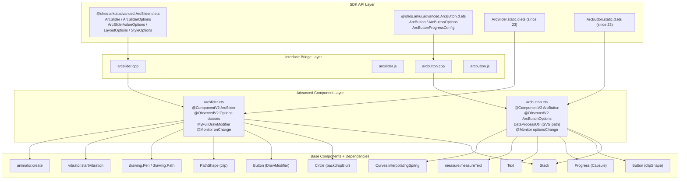
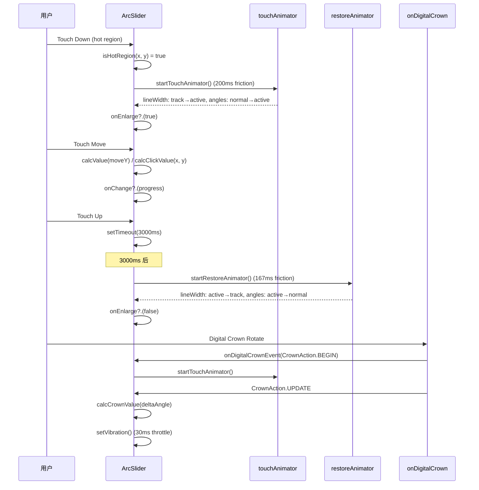
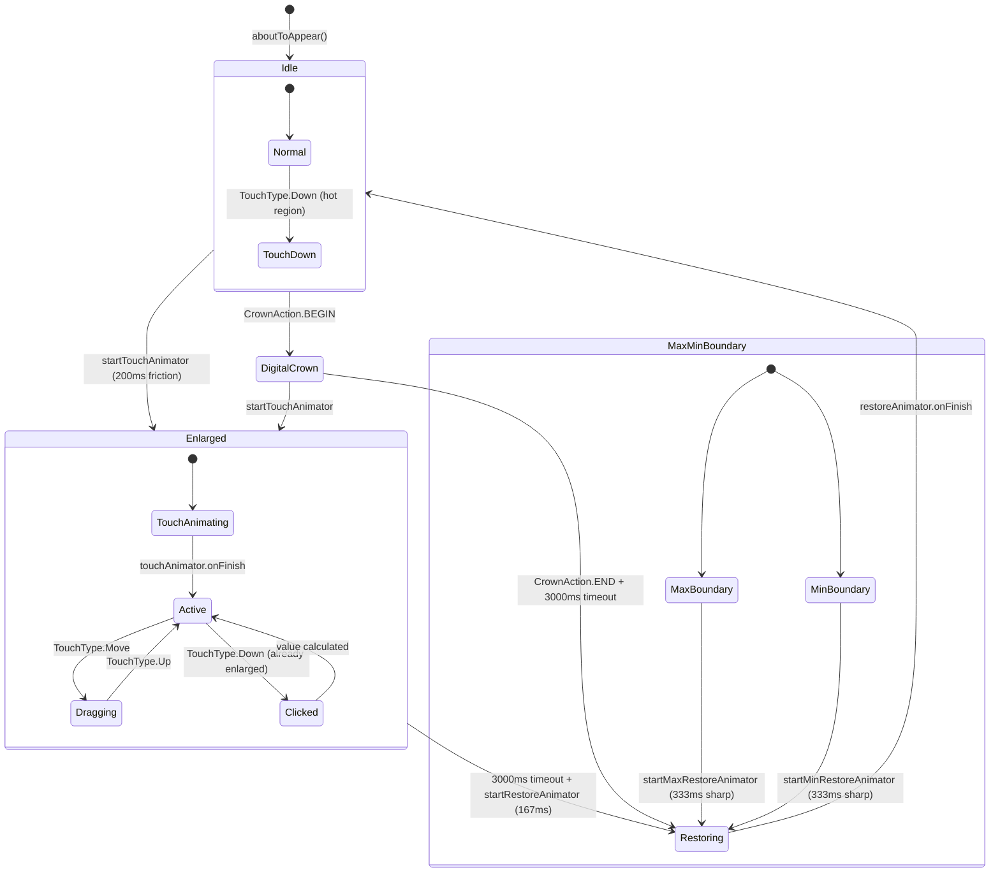

# 架构设计
> Arc 圆弧组件功能域的架构设计文档，覆盖 ArcSlider（Feat-01）和 ArcButton（Feat-02）两个高级 UI 组件，面向穿戴式圆形设备。

## 设计元数据

| 字段 | 内容 |
|------|------|
| Design ID | DESIGN-Func-10-01-01 |
| 关联需求 | 已有能力补录（无独立 requirement.md） |
| 关联 Epic | 无 |
| 目标 Feature | Feat-01: ArcSlider, Feat-02: ArcButton |
| 复杂度 | 标准 |
| 目标版本 | API 18 ~ API 26+ |
| Owner | ArkUI SIG |
| 状态 | Baselined（已有实现补录） |

## 需求基线

> 需求基线详见 proposal.md。以下仅列出设计阶段需要额外强调的要点。

| 项 | 补充说明（如需） |
|----|------------------|
| 面向穿戴设备 | ArcSlider 和 ArcButton 均为面向穿戴式圆形屏幕的高级组件，SysCap 为 SystemCapability.ArkUI.ArkUI.Circle |
| State V2 组件 | 两者均使用 @ComponentV2 + @ObservedV2 + @Trace + @Param/@Local + @Monitor 状态管理 |
| 无独立 Pattern | 高级组件不涉及 components_ng/pattern/ 层实现 |
| 无 C API | 高级组件无 NDK 接口 |
| Digital Crown | ArcSlider 支持数字表冠交互（onDigitalCrown），ArcButton 不支持 |
| Static API | 两者 Static API 均 @since 23 |

## 上下文和现状

### 涉及仓和模块

| 仓库 | 模块路径 | 当前职责 | 本 Feature 影响 |
|------|----------|----------|-----------------|
| ace_engine | `advanced_ui_component/arcslider/source/arcslider.ets` | ArcSlider 组件实现（@ComponentV2 + DrawModifier） | Feat-01 规格补录 |
| ace_engine | `advanced_ui_component/arcslider/interfaces/arcslider.cpp` | ArcSlider C++ 接口桥接 | 规格补录 |
| ace_engine | `advanced_ui_component/arcslider/interfaces/arcslider.js` | ArcSlider JS 接口导出 | 规格补录 |
| ace_engine | `advanced_ui_component/arcbutton/source/arcbutton.ets` | ArcButton 组件实现（@ComponentV2 + SVG 路径裁剪） | Feat-02 规格补录 |
| ace_engine | `advanced_ui_component/arcbutton/interfaces/arcbutton.cpp` | ArcButton C++ 接口桥接 | 规格补录 |
| ace_engine | `advanced_ui_component/arcbutton/interfaces/arcbutton.js` | ArcButton JS 接口导出 | 规格补录 |
| interface/sdk-js | `api/@ohos.arkui.advanced.ArcSlider.d.ets` / `.static.d.ets` | ArcSlider Dynamic/Static API 声明 | 规格对照 |
| interface/sdk-js | `api/@ohos.arkui.advanced.ArcButton.d.ets` / `.static.d.ets` | ArcButton Dynamic/Static API 声明 | 规格对照 |

### 调用链层级分析

| 层 | 模块 | 职责 | 修改类型 |
|----|------|------|----------|
| SDK API (ArcSlider) | `interface/sdk-js/api/@ohos.arkui.advanced.ArcSlider.d.ets` / `.static.d.ets` | Dynamic/Static API 声明 | 无修改（规格补录） |
| SDK API (ArcButton) | `interface/sdk-js/api/@ohos.arkui.advanced.ArcButton.d.ets` / `.static.d.ets` | Dynamic/Static API 声明 | 无修改（规格补录） |
| Advanced Component (ArcSlider) | `advanced_ui_component/arcslider/source/arcslider.ets` | @ComponentV2 ArcSlider + DrawModifier + 动画 + 触摸 + 数字表冠 | 无修改（规格补录） |
| Advanced Component (ArcButton) | `advanced_ui_component/arcbutton/source/arcbutton.ets` | @ComponentV2 ArcButton + SVG 路径裁剪 + 按压动画 + 文字自适应 | 无修改（规格补录） |
| Interface Bridge (ArcSlider) | `advanced_ui_component/arcslider/interfaces/arcslider.cpp` | C++ 接口桥接 | 无修改（规格补录） |
| Interface Bridge (ArcButton) | `advanced_ui_component/arcbutton/interfaces/arcbutton.cpp` | C++ 接口桥接 | 无修改（规格补录） |
| JS Interface (ArcSlider) | `advanced_ui_component/arcslider/interfaces/arcslider.js` | JS 接口导出 | 无修改（规格补录） |
| JS Interface (ArcButton) | `advanced_ui_component/arcbutton/interfaces/arcbutton.js` | JS 接口导出 | 无修改（规格补录） |
| Base Components | Stack/Circle/Button/Progress/Text/PathShape | 基础组件渲染能力 | 无修改 |
| Graphics | drawing.Pen/drawing.Path (ArcSlider) | 自定义绘制 | 无修改（外部依赖） |
| Sensor | vibrator (ArcSlider) | 触觉反馈 | 无修改（外部依赖） |
| Measure | measure.measureText (ArcButton) | 文字宽度测量 | 无修改（外部依赖） |

### 适用架构规则

| Rule ID | 适用原因 | 设计结论 | 验证方式 |
|---------|----------|----------|----------|
| OH-ARCH-LAYERING | 高级组件基于基础组件 + DrawModifier/Path 组合 | 调用方向：SDK → Advanced Component → Base Components + Graphics/Sensor | 代码评审 |
| OH-ARCH-API-LEVEL | ArcSlider/ArcButton Dynamic @since 18, Static @since 23 | Dynamic 和 Static API 通过 @since 标注区分 | API 评审 / XTS |
| OH-ARCH-COMPONENT-BUILD | 高级组件作为 advanced_ui_component 库的一部分，无独立 SO | 通过 advanced_ui_component/ 构建系统统一生成 .cpp/.js | 构建验证 |
| OH-ARCH-SUBSYSTEM | ArcSlider 依赖 Sensor（vibrator）和 Graphics（drawing）跨子系统 | 允许，通过标准 ArkTS import 引入 | 依赖检查 |

## 不涉及项承接

> proposal.md 已完成 N/A 判定。本节仅对 proposal 中标记为"涉及"且需展开设计的维度给出结论。

| 维度 | 设计结论 |
|------|----------|
| 穿戴设备适配 | ArcSlider/ArcButton 专为圆形屏幕设计，使用 display.getDefaultDisplaySync().width 作为表盘直径；默认直径 233vp（DIAMETER_DEFAULT） |
| 触觉反馈 | ArcSlider 数字表冠交互时通过 vibrator.startVibration 触发 watchhaptic.feedback.crown.strength2 振动反馈 |
| 主题 | ArcSlider 使用固定颜色默认值（#33FFFFFF/#FF5EA1FF）；ArcButton 通过 sys.color/sys.float 资源获取主题值 |
| 静态前端 | 两者当前无静态前端聚合源码（advanced_ui_component_static/ 中不存在），静态构建支持待确认 |
| 版本升级 | Dynamic API @since 18, Static API @since 23，无破坏性变更 |

## 关键设计决策

| 决策 ID | 问题 | 推荐方案 | 探索过的替代方案 | 取舍理由 | 影响 |
|---------|------|----------|-----------------|----------|------|
| ADR-1 | ArcSlider 滑动值计算方式 | 基于触摸 Y 轴位移的圆弧角度映射（calcValue/calcClickValue） | 使用标准 Slider 组件 | 标准 Slider 无法实现圆弧交互隐喻；自定义绘制允许精确控制弧形轨道和选中区域 | AC(Slider)-1.1 ~ AC(Slider)-4.3 |
| ADR-2 | ArcSlider 绘制方案 | 自定义 DrawModifier（MyFullDrawModifier）在 Button 上绘制弧形轨道和选中区域 | 使用 Shape/Path 组件 | DrawModifier 提供更高效的 Canvas 绘制能力，避免多节点开销 | AC(Slider)-2.1 ~ AC(Slider)-2.5 |
| ADR-3 | ArcSlider 触摸动画 | 触摸放大动画 200ms friction，恢复动画 167ms friction，3000ms 超时后触发 | 使用统一动画 | 分阶段动画提供更自然的交互体验：触摸时放大轨道，超时后缩回 | AC(Slider)-3.1 ~ AC(Slider)-3.4 |
| ADR-4 | ArcSlider 数字表冠灵敏度 | 三级灵敏度（LOW=0.5, MEDIUM=1, HIGH=2）乘以 CROWN_CONTROL_RATIO=2.10 | 单一灵敏度 | 不同用户需要不同精度，三级灵敏度覆盖从粗略到精细的需求 | AC(Slider)-5.1 ~ AC(Slider)-5.3 |
| ADR-5 | ArcButton 形状裁剪方案 | SVG Path 裁剪（两圆相交：表盘圆 + 弧形圆 + 倒角圆），通过 DataProcessUtil 计算路径点 | 使用 ClipShape 组件 | SVG Path 允许精确的几何计算和任意形状裁剪，两圆相交数学模型可精确控制弧形按钮边界 | AC(Button)-2.1 ~ AC(Button)-2.2 |
| ADR-6 | ArcButton 按压动画 | InterpolatingSpring(10, 1, 350, 35) 弹簧曲线 + scale 变换 | 使用线性动画 | 弹簧曲线提供更自然的按压回弹效果 | AC(Button)-3.1 ~ AC(Button)-3.3 |
| ADR-7 | ArcButton 文字自适应 | 使用 measure.measureText 测量文字宽度，超过容器时自动缩小字号（13-19fp），仍超出则使用 MARQUEE | 固定字号 + 截断 | 自适应字号在不同文字长度下保持可读性；MARQUEE 作为最后手段保证完整显示 | AC(Button)-4.1 ~ AC(Button)-4.3 |
| ADR-8 | ArcButton 进度条支持 | 设置 progressConfig 时切换为 Progress 组件（ProgressType.Capsule），否则使用 Button | 始终使用 Button | 进度条模式支持加载状态场景，通过条件渲染切换底层组件 | AC(Button)-5.1 ~ AC(Button)-5.3 |

## 设计骨架

### 骨架范围

| 骨架项 | 目标 | 不包含 | 验证方式 |
|--------|------|--------|----------|
| ArcSlider 全量接口 | ArcSliderOptions 及子选项 + 事件回调 | C API（无） | UT |
| ArcSlider 绘制 | DrawModifier 弧形轨道 + 选中区域 | 自定义绘制内容 | UT + 手工 |
| ArcSlider 交互 | 触摸/拖拽/点击/数字表冠 + 动画 | 多指手势 | UT + 手工 |
| ArcButton 全量接口 | ArcButtonOptions + 枚举 + 事件回调 | C API（无） | UT |
| ArcButton 形状 | SVG Path 两圆相交裁剪 | 非圆形屏幕适配 | UT + 手工 |
| ArcButton 文字 | measureText + 自适应字号 + MARQUEE | 自定义字体渲染 | UT + 手工 |
| ArcButton 进度 | Progress 组件 + progressConfig | 圆形进度条 | UT + 手工 |

### 骨架 Spec 拆分

| Task ID | 目标 | 受影响文件 | AC |
|---------|------|-----------|-----|
| TASK-SKELETON-1 | ArcSlider 全量规格补录（接口、绘制、交互、动画、数字表冠） | Feat-01-arc-slider-full-spec.md | AC(Slider)-1.1 ~ AC(Slider)-7.2 |
| TASK-SKELETON-2 | ArcButton 全量规格补录（接口、形状、颜色、动画、文字、进度） | Feat-02-arc-button-full-spec.md | AC(Button)-1.1 ~ AC(Button)-6.4 |

## 后续 Task 拆分

| Task ID | 目标 | 受影响文件 | 依赖 |
|---------|------|-----------|------|
| TASK-ARC-01 | ArcSlider 全量规格补录 | Feat-01-arc-slider-full-spec.md, design.md | 无 |
| TASK-ARC-02 | ArcButton 全量规格补录 | Feat-02-arc-button-full-spec.md, design.md | 无 |

## API 签名、Kit 与权限

> 本节承接 spec.md"API 变更分析"中识别的 API，给出签名、权限和 d.ts 位置等实现细节。

### 新增 API

| API 签名 | 类型 | d.ts 位置 | 权限要求 | SysCap |
|----------|------|-----------|----------|--------|
| `@ComponentV2 struct ArcSlider` with `@Param options: ArcSliderOptions` | Public | `@ohos.arkui.advanced.ArcSlider.d.ets` | 无 | SystemCapability.ArkUI.ArkUI.Circle |
| `class ArcSliderValueOptions (@ObservedV2, @Trace)` | Public | 同上 | 无 | 同上 |
| `class ArcSliderLayoutOptions (@ObservedV2, @Trace)` | Public | 同上 | 无 | 同上 |
| `class ArcSliderStyleOptions (@ObservedV2, @Trace)` | Public | 同上 | 无 | 同上 |
| `class ArcSliderOptions (@ObservedV2, @Trace)` | Public | 同上 | 无 | 同上 |
| `enum ArcSliderPosition { LEFT=0, RIGHT=1 }` | Public | 同上 | 无 | 同上 |
| `ArcSlider Static API` | Public | `@ohos.arkui.advanced.ArcSlider.static.d.ets` | 无 | 同上 |
| `@ComponentV2 struct ArcButton` with `@Require @Param options: ArcButtonOptions` | Public | `@ohos.arkui.advanced.ArcButton.d.ets` | 无 | SystemCapability.ArkUI.ArkUI.Circle |
| `class ArcButtonOptions (@ObservedV2, @Trace)` | Public | 同上 | 无 | 同上 |
| `class ArcButtonProgressConfig (@ObservedV2, @Trace)` | Public | 同上 | 无 | 同上 |
| `enum ArcButtonPosition { TOP_EDGE=0, BOTTOM_EDGE=1 }` | Public | 同上 | 无 | 同上 |
| `enum ArcButtonStyleMode { EMPHASIZED_LIGHT=0, EMPHASIZED_DARK=1, NORMAL_LIGHT=2, NORMAL_DARK=3, CUSTOM=4 }` | Public | 同上 | 无 | 同上 |
| `enum ArcButtonStatus { NORMAL=0, PRESSED=1, DISABLED=2 }` | Public | 同上 | 无 | 同上 |
| `ArcButton Static API` | Public | `@ohos.arkui.advanced.ArcButton.static.d.ets` | 无 | 同上 |

### 变更/废弃 API

| 原有 API | 变更类型 | 新 API | 迁移说明 |
|----------|----------|--------|----------|
| 无 | — | — | — |

## 构建系统影响

### BUILD.gn 变更

ArcSlider 和 ArcButton 高级组件作为 advanced_ui_component 库的一部分构建，无独立 SO：

```
# advanced_ui_component/arcslider/BUILD.gn
# 构建目标：advanced_ui_component 库的一部分
# 接口桥接：arcslider.cpp / arcslider.js
# 组件源码：source/arcslider.ets

# advanced_ui_component/arcbutton/BUILD.gn
# 构建目标：advanced_ui_component 库的一部分
# 接口桥接：arcbutton.cpp / arcbutton.js
# 组件源码：source/arcbutton.ets
```

### bundle.json 变更

ArcSlider/ArcButton 高级组件作为 ace_engine 的内部 component，无独立 bundle.json 变更。

## 可选设计扩展

### 架构图



### 数据流/控制流

| 步骤 | 调用方 | 被调用方 | 数据/接口 | 说明 |
|------|--------|----------|-----------|------|
| 1 | 应用代码 | ArcSlider/ArcButton | ArcSliderOptions/ArcButtonOptions | 组件创建 |
| 2 | ArcSlider | aboutToAppear() | updateArcSlider + setDiameter + 动画初始化 | 初始化 |
| 3 | ArcButton | aboutToAppear() | initValues + dataProcessUtil.initData + calculate + generatePath | SVG 路径计算 |
| 4 | 用户触摸 | ArcSlider.onTouchEvent | isHotRegion → startTouchAnimator/calcValue | 触摸交互 |
| 5 | 数字表冠 | ArcSlider.onDigitalCrownEvent | calcDisplayControlRatio → calcCrownValue → setVibration | 表冠交互 |
| 6 | 用户按压 | ArcButton.dealTouchEvent | scale + btnColor 切换 | 按压动画 |
| 7 | @Monitor | ArcSlider.onChange / ArcButton.optionsChange | updateArcSlider / judgeTextWidth+changeStatus | 响应式更新 |

### 时序设计



### 数据模型设计

**API 层类型 (TypeScript)**:

```typescript
// ArcSlider (arcslider.ets:78-175)
enum ArcSliderPosition { LEFT = 0, RIGHT = 1 }

@ObservedV2 class ArcSliderValueOptions {
  @Trace progress: number;     // default: 0 (= min)
  @Trace min: number;          // default: 0
  @Trace max: number;         // default: 100
}

@ObservedV2 class ArcSliderLayoutOptions {
  @Trace reverse: boolean;    // default: true
  @Trace position: ArcSliderPosition; // default: RIGHT
}

@ObservedV2 class ArcSliderStyleOptions {
  @Trace trackThickness: number;        // default: 5, range [5, 16]
  @Trace activeTrackThickness: number;  // default: 24, range [24, 36]
  @Trace trackColor: string;            // default: '#33FFFFFF'
  @Trace selectedColor: string;         // default: '#FF5EA1FF'
  @Trace trackBlur: number;             // default: 20
}

@ObservedV2 class ArcSliderOptions {
  @Trace valueOptions: ArcSliderValueOptions;
  @Trace layoutOptions: ArcSliderLayoutOptions;
  @Trace styleOptions: ArcSliderStyleOptions;
  @Trace digitalCrownSensitivity: CrownSensitivity; // default: MEDIUM
  @Trace onTouch: Callback<TouchEvent>;
  @Trace onChange: Callback<number>;
  @Trace onEnlarge: Callback<boolean>;
}

// ArcButton (arcbutton.ets:20-248)
enum ArcButtonPosition { TOP_EDGE = 0, BOTTOM_EDGE = 1 }
enum ArcButtonStyleMode { EMPHASIZED_LIGHT=0, EMPHASIZED_DARK=1, NORMAL_LIGHT=2, NORMAL_DARK=3, CUSTOM=4 }
enum ArcButtonStatus { NORMAL=0, PRESSED=1, DISABLED=2 }

@ObservedV2 class ArcButtonProgressConfig {
  @Trace value: number;       // default: 0
  @Trace total?: number;      // default: 100
  @Trace color?: ResourceColor; // default: #1F71FF
}

@ObservedV2 class ArcButtonOptions {
  @Trace position: ArcButtonPosition;
  @Trace styleMode: ArcButtonStyleMode;
  @Trace status: ArcButtonStatus;
  @Trace label: ResourceStr;
  @Trace backgroundBlurStyle: BlurStyle;        // default: NONE
  @Trace backgroundColor: ColorMetrics;        // default: Black
  @Trace shadowColor: ColorMetrics;             // default: Black
  @Trace shadowEnabled: boolean;                // default: false
  @Trace fontSize: LengthMetrics;              // default: 19fp
  @Trace fontColor: ColorMetrics;               // default: White
  @Trace pressedFontColor: ColorMetrics;        // default: White
  @Trace fontStyle: FontStyle;                  // default: Normal
  @Trace fontFamily: string | Resource;         // default: ''
  @Trace fontMargin: LocalizedMargin;           // default: {start:24vp, top:10vp, end:24vp, bottom:16vp}
  @Trace progressConfig?: ArcButtonProgressConfig;
  @Trace onTouch?: Callback<TouchEvent>;
  @Trace onClick?: Callback<ClickEvent>;
}
```

### 算法与状态机



### 测试性设计

| 测试层级 | 测试目标 | Mock 策略 | 验证方式 |
|----------|----------|-----------|----------|
| UT - ArcSlider 参数校验 | checkParam min/max/progress/trackThickness/activeTrackThickness | 直接构造 Options 对象 | 组件单测 |
| UT - ArcSlider 布局 | setLayoutState reverse × position 四种组合 | 直接调用 | 组件单测 |
| UT - ArcSlider 热区 | isHotRegion 圆环内/外/角度范围判定 | 模拟触摸坐标 | 组件单测 |
| UT - ArcButton 路径 | DataProcessUtil.calculate 两圆相交路径 | 直接调用 | 组件单测 |
| UT - ArcButton 颜色 | changeStatus 5 种 styleMode × 3 种 status | 直接构造 Options | 组件单测 |
| UT - ArcButton 文字 | judgeTextWidth measureText 超出判定 | Mock measure.measureText | 组件单测 |
| 手工 | ArcSlider 触摸/拖拽/表冠动画 | 真机 | 视觉比对 |
| 手工 | ArcButton 按压动画 + 文字自适应 | 真机 | 视觉比对 |

### 接口参数规约

| 接口 | 参数 | 类型 | 合法范围 | 非法处理 | 边界说明 |
|------|------|------|----------|----------|----------|
| ArcSliderValueOptions | progress | number | [min, max] | 超出范围时 clamp | 默认 = min |
| ArcSliderValueOptions | min | number | 任意 | max ≤ min 时重置为 0/100 | 默认 0 |
| ArcSliderValueOptions | max | number | > min | max ≤ min 时重置为 100 | 默认 100 |
| ArcSliderStyleOptions | trackThickness | number | [5, 16] | < 5 或 > 16 时回退默认 5 | 默认 5 |
| ArcSliderStyleOptions | activeTrackThickness | number | [24, 36] | < 24 或 > 36 时回退默认 24 | 默认 24 |
| ArcSliderStyleOptions | trackBlur | number | ≥ 0 | < 0 时回退默认 20 | 默认 20 |
| ArcSliderOptions | digitalCrownSensitivity | CrownSensitivity | LOW/MEDIUM/HIGH | 默认 MEDIUM | — |
| ArcButtonOptions | fontSize | LengthMetrics | 任意 | 未设置时使用 maxFontSize/minFontSize 自适应 | 默认 19fp |
| ArcButtonProgressConfig | value | number | [0, total] | — | 默认 0 |
| ArcButtonProgressConfig | total | number | > 0 | 未设置时默认 100 | 默认 100 |

## 详细设计

### ArcSlider 自定义绘制

ArcSlider 使用 `MyFullDrawModifier`（`arcslider.ets:196-270`）继承 `DrawModifier`，通过 Canvas API 绘制弧形轨道和选中区域：

**drawTrack(context)**（`:208-232`）：
- 使用 `drawing.Pen` 设置抗锯齿、颜色、线宽（vp2px 转换）、圆角端点
- `drawing.Path.arcTo()` 绘制弧形轨道
- 起始角 = `trackEndAngle * RADIAN_TO_ANGLE`，扫过角 = `(trackStartAngle - trackEndAngle) * RADIAN_TO_ANGLE`

**drawSelection(context)**（`:234-261`）：
- 选中区域使用相同 Pen 参数但不同颜色（selectedColor）
- 起始角 = `selectedEndAngle * RADIAN_TO_ANGLE`，扫过角 = `(selectedStartAngle - selectedEndAngle) * RADIAN_TO_ANGLE`
- 当 `nearEqual(selectedStartAngle, selectedEndAngle)` 时跳过绘制

**drawContent / drawFront**（`:263-269`）：
- `drawContent` 调用 `drawTrack`（背景层）
- `drawFront` 调用 `drawSelection`（前景层）

### ArcSlider 布局状态

`setLayoutState(reverse, position)`（`arcslider.ets:562-596`）定义四种布局组合：

| reverse | position | isAntiClock | normalStart | normalEnd | activeStart | activeEnd |
|---------|----------|-------------|-------------|-----------|-------------|-----------|
| true | RIGHT | true | -15° | -45° | -60° | 60° |
| false | RIGHT | false | -45° | -15° | 60° | -60° |
| true | LEFT | false | -165° | -135° | -120° | -240° |
| false | LEFT | true | -135° | -165° | -240° | -120° |

默认值：START_ANGLE_DEFAULT=15, END_ANGLE_DEFAULT=45, ACTIVE_START_ANGLE_DEFAULT=-60, ACTIVE_END_ANGLE_DEFAULT=60（`:40-43`）

### ArcSlider 触摸交互

**onTouchEvent(event)**（`:964-993`）：
- TouchType.Down：检查 isHotRegion，触发 onTouchDown
- TouchType.Up（已放大时）：设置 3000ms 超时后 startRestoreAnimator，检查 max/min 恢复动画
- TouchType.Move（已放大 + 动画完成时）：调用 onTouchMove，触发 onChange

**onTouchDown(event)**（`:995-1021`）：
- 未放大时：记录 touchY，isHotRegion 判定后 startTouchAnimator
- 已放大时：isHotRegion 判定后，若动画完成则 calcClickValue（点击跳转），然后 calcValue（拖拽）

**calcValue(moveY)**（`:718-736`）：
- delta = touchY - moveY（垂直位移）
- total = radius × sqrt(3)（圆弧有效拖拽距离）
- valueNow += delta / total（reverse 时为 +=，否则为 -=）
- clamp [0, 1]，映射回 [min, max]

**calcClickValue(clickX, clickY)**（`:684-716`）：
- 通过 asin 计算触摸点角度
- 四象限角度修正
- delta = (selectedStartAngle - selectedEndAngle) / ANGLE_TO_RADIAN
- selectRatio = delta / (ACTIVE_END_ANGLE - ACTIVE_START_ANGLE)

**isHotRegion(touchX, touchY)**（`:917-944`）：
- 计算触摸点到圆心距离 radius
- 有效区域：normalRadius - activeTrackThickness < radius < normalRadius（圆环）
- 角度范围：在 selectedStartAngle 到 trackEndAngle 之间（逆时针/顺时针判定）

### ArcSlider 数字表冠

**onDigitalCrownEvent(event)**（`:1094-1120`）：
- CrownAction.BEGIN + 未放大：clearTimeout + isEnlarged=true + startTouchAnimator
- CrownAction.UPDATE + 已放大：计算 crownDeltaAngle，调用 calcCrownValue，触发 setVibration
- CrownAction.END + 已放大：clearTimeout + 3000ms 超时后 startRestoreAnimator

**calcDisplayControlRatio(sensitivity)**（`:946-955`）：
- LOW: CROWN_CONTROL_RATIO × 0.5 = 2.10 × 0.5 = 1.05
- MEDIUM: CROWN_CONTROL_RATIO × 1 = 2.10
- HIGH: CROWN_CONTROL_RATIO × 2 = 2.10 × 2 = 4.20

**setVibration()**（`:1122-1135`）：
- 30ms 节流（CROWN_TIME_FLAG = 30）
- 到达 max/min 时不振动
- 使用 `vibrator.startVibration` 触发 `watchhaptic.feedback.crown.strength2`（`:58`）

### ArcSlider 动画

| 动画 | duration | easing | 触发条件 | 用途 |
|------|----------|--------|----------|------|
| touchAnimator | 200ms | friction | 触摸按下 | 轨道放大：trackThickness→activeTrackThickness, normal→active 角度 |
| restoreAnimator | 167ms | friction | 3000ms 超时 | 轨道缩回：activeTrackThickness→trackThickness, active→normal |
| maxRestoreAnimator | 333ms | sharp | max 边界恢复 | 选中区域从 max 角度恢复到 active 角度 |
| minRestoreAnimator | 333ms | sharp | min 边界恢复 | 轨道起点从 min 角度恢复到 active 角度 |

`calcAnimatorChange(start, end, fraction)` = `fraction × (end - start) + start`（`:680-682`）

### ArcButton SVG 路径裁剪

`DataProcessUtil`（`arcbutton.ets:630-783`）计算两圆相交路径：

**initData()**（`:641-649`）：
- dial 圆：圆心(dialRadius, dialRadius)，半径=dialRadius（表盘圆）
- arc 圆：圆心(dialX, dialY)，半径=arcRadius（弧形圆）
- arcY = dial.center.y + dialRadius + arcRadius - height

**calculate()**（`:652-667`）：
- innerDial = dial - chamferCircleR（内缩倒角半径）
- innerArc = arc - chamferCircleR
- findCircleIntersections(innerArc, innerDial) → 两个交点
- 通过 calculateIntersection 计算四个角点：tp1~tp4
- btnWidth = 交点距离 + chamferCircleR × 2

**generatePath(data)**（`:439-479`）：
- SVG Path：`M leftTop → A upperArcCircle → Q chamfer → A lowerArcCircle → Q chamfer → Z`
- 上弧使用 ARC_CIRCLE_DIAMETER 半径
- 下弧使用 DIAL_CIRCLE_DIAMETER 半径
- 倒角使用二次贝塞尔曲线（Q 命令）

### ArcButton 颜色方案

`changeStatus()`（`arcbutton.ets:313-373`）按 styleMode 设置颜色：

| styleMode | btnNormal | textNormal | btnPress | btnDisable | textDisable |
|-----------|-----------|------------|----------|------------|-------------|
| EMPHASIZED_LIGHT | comp_background_emphasize | #FFFFFF | normal + #1AFFFFFF 混合 | #1F71FF | #FFFFFF |
| EMPHASIZED_DARK | #BF2629 | #FFFFFF | normal + 混合 | #4C0f10 | #99FFFFFF |
| NORMAL_LIGHT | #17273F | #5EA1FF | normal + 混合 | #17273F | #995ea1ff |
| NORMAL_DARK | #252525 | #5EA1FF | normal + 混合 | #262626 | #995ea1ff |
| CUSTOM | options.backgroundColor | options.fontColor | bg + 混合 | options.backgroundColor | options.fontColor |

按压色 = normalColor.blendColor(#1AFFFFFF)（`:159, 318-319`）

### ArcButton 文字自适应

**judgeTextWidth()**（`:410-420`）：
- 使用 `measure.measureText` 测量以 MIN_FONT_SIZE(13fp) 渲染的文字宽度
- 若超过容器宽度则 isExceed = true

**TextBuilderNormal**（`:504-523`）：
- isExceed=false 时使用：maxFontSize(19fp) + minFontSize(13fp) + maxLines(1) 自动缩放
- 设置了 options.fontSize 时使用固定字号

**TextBuilderIsExceed**（`:482-501`）：
- isExceed=true 时使用：固定 MIN_FONT_SIZE(13fp) + textOverflow(MARQUEE)

### ArcButton 进度条模式

当 `progressConfig` 设置时（`arcbutton.ets:553-563`）：
- 渲染 `Progress({ value, total, type: ProgressType.Capsule })`
- 应用 clipShape(Path) 裁剪为弧形
- backgroundColor 默认 #1F71FF（EMPHASIZED_DISABLE_BTN_COLOR）
- progressColor 取自 progressConfig.color 或 backgroundColor

### ArcButton TOP_EDGE 旋转

`isUp = options.position == ArcButtonPosition.TOP_EDGE`（`:379`）
- TOP_EDGE 时 rotate 180°（`:568, 557`）
- 文字 margin top/bottom 交换（`:497, 519`）
- scale centerY = 0（从顶部缩放）（`:587`）

## 风险和开放问题

| 项 | 类型 | 影响 | 处理方式 | Owner |
|----|------|------|----------|-------|
| ArcSlider/ArcButton 无静态前端聚合源码 | 构建 | 中 | advanced_ui_component_static/ 中不存在对应文件，静态构建支持待确认 | ArkUI SIG |
| ArcSlider display API 异常处理 | 可靠性 | 低 | display.getDefaultDisplaySync() 异常时回退默认直径 233vp | ArkUI SIG |
| ArcButton measure API 依赖 | 架构 | 低 | measure.measureText 为系统 API，功能稳定 | ArkUI SIG |
| ArcSlider 振动权限 | 安全 | 低 | vibrator.startVibration 需要声明权限，通过 isSupportEffectSync 检查支持 | ArkUI SIG |
| ArcButton sys.float 资源获取 | 可靠性 | 中 | arcButtonTheme 获取失败时（值为 0）aboutToAppear 直接返回 | ArkUI SIG |

## 设计审批

- [x] 需求基线已确认，设计覆盖 P0/P1 AC
- [x] 不涉及项已承接，N/A 和展开项都有结论
- [x] 涉及仓和模块职责清楚
- [x] 调用链层级分析完整，每层覆盖到位
- [x] 适用架构规则已识别并形成设计结论
- [x] 分层和子系统边界合规
- [x] API 变更有签名、权限、错误码和兼容性说明
- [x] BUILD.gn/bundle.json 影响明确
- [x] 设计输出和后续 Task 拆分明确
- [x] 关键设计决策有理由和影响说明
- [x] 风险和开放问题有 Owner

**结论:** 通过（已有实现补录）
